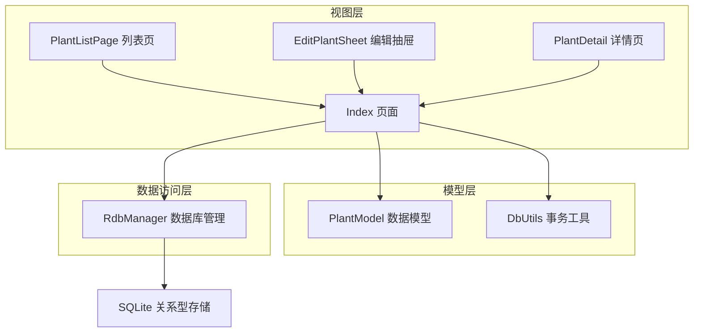
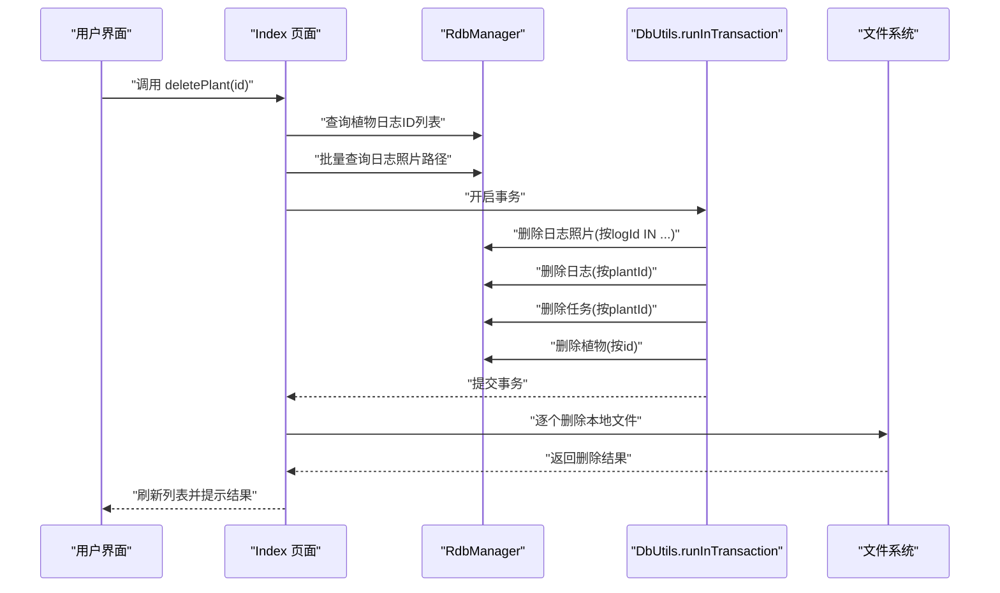
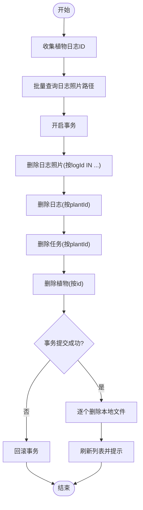
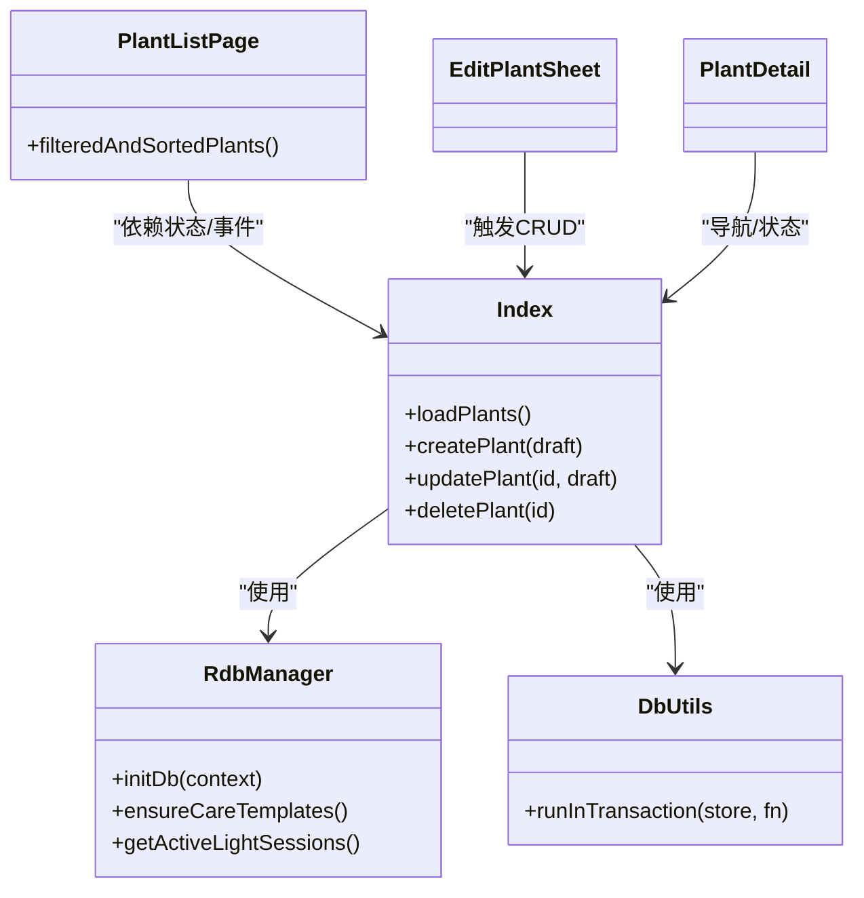

# 植物数据管理

<cite>
**本文引用的文件**
- [RdbManager.ets](file://entry/src/main/ets/viewmodel/RdbManager.ets)
- [PlantModel.ets](file://entry/src/main/ets/model/PlantModel.ets)
- [DbUtils.ets](file://entry/src/main/ets/model/DbUtils.ets)
- [Index.ets](file://entry/src/main/ets/pages/Index.ets)
- [PlantListPage.ets](file://entry/src/main/ets/pages/PlantListPage.ets)
- [EditPlantSheet.ets](file://entry/src/main/ets/view/EditPlantSheet.ets)
- [PlantDetail.ets](file://entry/src/main/ets/pages/PlantDetail.ets)
- [err.ets](file://entry/src/main/ets/viewmodel/err.ets)
</cite>

## 目录
1. [简介](#简介)
2. [项目结构](#项目结构)
3. [核心组件](#核心组件)
4. [架构总览](#架构总览)
5. [详细组件分析](#详细组件分析)
6. [依赖关系分析](#依赖关系分析)
7. [性能考量](#性能考量)
8. [故障排查指南](#故障排查指南)
9. [结论](#结论)
10. [附录](#附录)

## 简介
本文件面向植物数据管理API，系统性梳理植物CRUD能力：loadPlants（植物列表查询）、createPlant（植物创建）、updatePlant（植物更新）、deletePlant（植物删除）。文档覆盖：
- SQL查询语句与索引设计
- 数据模型映射（Plant、PlantDraft）
- 事务处理与数据一致性保障
- 删除策略（任务、日志、照片）与批量文件清理
- 搜索与过滤（名称/品种/位置）与排序
- 参数说明、返回值类型与使用示例

## 项目结构
围绕植物数据管理的关键模块如下：
- 数据库与表结构：RdbManager 负责建表、索引与默认数据
- 数据模型：Plant、PlantDraft 等用于页面与数据库之间的数据传递
- 事务工具：DbUtils 提供统一事务封装
- 页面与交互：Index 作为状态中枢，负责CRUD与删除流程；PlantListPage 提供本地搜索/过滤/排序；EditPlantSheet 提供编辑/新建界面；PlantDetail 展示植物详情

**图表来源**
- [Index.ets:128-160](file://entry/src/main/ets/pages/Index.ets#L128-L160)
- [RdbManager.ets:27-170](file://entry/src/main/ets/viewmodel/RdbManager.ets#L27-L170)
- [PlantModel.ets:6-67](file://entry/src/main/ets/model/PlantModel.ets#L6-L67)
- [DbUtils.ets:12-22](file://entry/src/main/ets/model/DbUtils.ets#L12-L22)

**章节来源**
- [Index.ets:128-160](file://entry/src/main/ets/pages/Index.ets#L128-L160)
- [RdbManager.ets:27-170](file://entry/src/main/ets/viewmodel/RdbManager.ets#L27-L170)
- [PlantModel.ets:6-67](file://entry/src/main/ets/model/PlantModel.ets#L6-L67)
- [DbUtils.ets:12-22](file://entry/src/main/ets/model/DbUtils.ets#L12-L22)

## 核心组件
- 数据库与表结构
  - 植物表：包含 id、name、species、location、createdAt
  - 任务表：包含 id、plantId、type、planDate、done、doneAt
  - 日志表：包含 id、plantId、note、createdAt
  - 日志照片表：包含 id、logId、path、thumbPath、createdAt
  - 成长指标表：包含 id、plantId、height、width、score、createdAt
  - 养护模板/规则表：用于生成周期任务
  - 索引：任务唯一索引（plantId,type,planDate）、日志复合索引（plantId,createdAt）、日志照片索引（logId）、指标复合索引（plantId,createdAt）

- 数据模型
  - Plant：列表展示与详情展示使用的实体
  - PlantDraft：编辑态草稿，避免直接修改列表实体
  - PlantTask、LogEntry、Metric 等用于其他模块的数据承载

- 事务工具
  - runInTransaction：统一开启/提交/回滚，确保批量写入原子性

**章节来源**
- [RdbManager.ets:36-169](file://entry/src/main/ets/viewmodel/RdbManager.ets#L36-L169)
- [PlantModel.ets:6-67](file://entry/src/main/ets/model/PlantModel.ets#L6-L67)
- [DbUtils.ets:12-22](file://entry/src/main/ets/model/DbUtils.ets#L12-L22)

## 架构总览
植物CRUD在 Index 页面集中实现，通过 RdbManager 的 RdbStore 执行SQL，配合 DbUtils 的事务封装，确保一致性。删除植物时，先收集日志ID，再批量查询照片路径，随后在单个事务内删除日志照片、日志、任务、植物，最后统一清理本地文件。

**图表来源**
- [Index.ets:318-402](file://entry/src/main/ets/pages/Index.ets#L318-L402)
- [DbUtils.ets:12-22](file://entry/src/main/ets/model/DbUtils.ets#L12-L22)

**章节来源**
- [Index.ets:318-402](file://entry/src/main/ets/pages/Index.ets#L318-L402)
- [DbUtils.ets:12-22](file://entry/src/main/ets/model/DbUtils.ets#L12-L22)

## 详细组件分析

### loadPlants（植物列表查询）
- 功能概述
  - 从植物表按创建时间倒序查询，返回 Plant 列表
- SQL与索引
  - 查询语句：按 createdAt 倒序
  - 索引：RdbManager 创建了合适的索引以支持排序与过滤
- 返回值
  - Promise<void>，内部更新页面状态并触发刷新
- 使用示例
  - 在 Index 页面初始化后调用，或在编辑/删除后刷新

**章节来源**
- [Index.ets:143-159](file://entry/src/main/ets/pages/Index.ets#L143-L159)
- [RdbManager.ets:131-146](file://entry/src/main/ets/viewmodel/RdbManager.ets#L131-L146)

### createPlant（植物创建）
- 功能概述
  - 接收 PlantDraft，去除多余空白，写入植物表并记录 createdAt
- SQL与数据模型
  - ValuesBucket 包含 name、species、location、createdAt
  - 返回主键 id 由数据库自增产生
- 事务与一致性
  - 单条插入，无需事务
- 使用示例
  - EditPlantSheet 点击保存后调用

**章节来源**
- [Index.ets:287-302](file://entry/src/main/ets/pages/Index.ets#L287-L302)
- [PlantModel.ets:62-67](file://entry/src/main/ets/model/PlantModel.ets#L62-L67)

### updatePlant（植物更新）
- 功能概述
  - 接收 id 与 PlantDraft，更新 name、species、location
- SQL与数据模型
  - 使用 RdbPredicates 按 id 更新
- 事务与一致性
  - 单条更新，无需事务
- 使用示例
  - EditPlantSheet 修改后点击保存

**章节来源**
- [Index.ets:304-316](file://entry/src/main/ets/pages/Index.ets#L304-L316)
- [PlantModel.ets:62-67](file://entry/src/main/ets/model/PlantModel.ets#L62-L67)

### deletePlant（植物删除）
- 功能概述
  - 删除植物及其关联任务、日志、日志照片，并清理本地文件
- 删除顺序与策略
  - 先收集日志ID，再批量查询照片路径
  - 在单个事务内删除：日志照片 → 日志 → 任务 → 植物
  - 事务提交后再统一删除本地文件
- SQL与级联策略
  - 通过 RdbPredicates 按 plantId 删除日志与任务
  - 通过 RdbPredicates 按 id 删除植物
- 文件清理
  - 逐个删除照片与缩略图文件，记录失败数量并提示
- 事务与一致性
  - 使用 runInTransaction 确保数据库层面原子性
- 使用示例
  - EditPlantSheet 点击删除后触发

**图表来源**
- [Index.ets:318-402](file://entry/src/main/ets/pages/Index.ets#L318-L402)
- [DbUtils.ets:12-22](file://entry/src/main/ets/model/DbUtils.ets#L12-L22)

**章节来源**
- [Index.ets:318-402](file://entry/src/main/ets/pages/Index.ets#L318-L402)
- [DbUtils.ets:12-22](file://entry/src/main/ets/model/DbUtils.ets#L12-L22)

### 搜索与过滤（植物列表）
- 搜索关键词
  - 支持按名称、品种、位置进行模糊匹配
- 本地过滤与排序
  - 物种筛选芯片：动态提取现有植物的 species，支持“全部”
  - 排序选项：创建时间（新→旧）、名称（A→Z）、完成率（高→低）
- 实现要点
  - 过滤在内存中完成，避免重复查询数据库
  - 排序采用稳定比较器，减少不必要的重排

**章节来源**
- [Index.ets:742-758](file://entry/src/main/ets/pages/Index.ets#L742-L758)
- [PlantListPage.ets:65-114](file://entry/src/main/ets/pages/PlantListPage.ets#L65-L114)

## 依赖关系分析
- 组件耦合
  - Index 依赖 RdbManager 与 DbUtils，承担CRUD与删除流程
  - PlantListPage 依赖 Index 的状态与事件，提供本地搜索/过滤/排序
  - EditPlantSheet 与 PlantDetail 通过事件与状态驱动 Index 的数据变更
- 外部依赖
  - relationalStore（RdbStore）用于SQL执行与事务控制
  - 文件系统（fs）用于照片文件清理

**图表来源**
- [Index.ets:128-160](file://entry/src/main/ets/pages/Index.ets#L128-L160)
- [RdbManager.ets:27-170](file://entry/src/main/ets/viewmodel/RdbManager.ets#L27-L170)
- [DbUtils.ets:12-22](file://entry/src/main/ets/model/DbUtils.ets#L12-L22)

**章节来源**
- [Index.ets:128-160](file://entry/src/main/ets/pages/Index.ets#L128-L160)
- [RdbManager.ets:27-170](file://entry/src/main/ets/viewmodel/RdbManager.ets#L27-L170)
- [DbUtils.ets:12-22](file://entry/src/main/ets/model/DbUtils.ets#L12-L22)

## 性能考量
- 查询优化
  - 按 createdAt 倒序查询植物列表，利用索引避免全表扫描
  - 日志按 plantId + createdAt 复合索引，支持高效分页与排序
- 写入优化
  - 事务批量删除日志照片、日志、任务、植物，减少多次往返
  - 使用 IN(...) 批量删除日志照片，降低SQL数量
- I/O 优化
  - 删除文件在事务提交后进行，避免事务失败导致文件与数据库不一致
  - 逐个删除文件并统计失败数量，便于后续修复

[本节为通用指导，无需特定文件来源]

## 故障排查指南
- 数据库初始化失败
  - 现象：初始化阶段提示失败
  - 排查：检查 RdbManager.initDb 是否抛错，确认上下文与权限
- 唯一索引冲突（任务重复）
  - 现象：插入任务时报唯一约束冲突
  - 排查：确认同一植物、类型、计划日是否已存在
- 删除失败或部分删除
  - 现象：删除植物后仍有残留文件或记录
  - 排查：检查事务是否提交成功；对失败文件进行重试或手动清理
- 文件清理失败
  - 现象：提示部分文件删除失败
  - 排查：检查文件是否存在、权限是否足够；后续可再次清理

**章节来源**
- [Index.ets:116-125](file://entry/src/main/ets/pages/Index.ets#L116-L125)
- [Index.ets:404-424](file://entry/src/main/ets/pages/Index.ets#L404-L424)
- [Index.ets:384-399](file://entry/src/main/ets/pages/Index.ets#L384-L399)

## 结论
本项目通过清晰的分层设计与事务封装，实现了植物CRUD与删除的完整闭环。数据库层面通过索引与事务保障性能与一致性，文件层面通过“先删记录、后删文件”的策略确保数据与文件的一致性。搜索与过滤在前端完成，提升用户体验。建议在后续版本中：
- 为日志与指标查询增加分页与缓存
- 增加删除前二次确认与回收站机制
- 对文件清理失败场景提供重试与报告

[本节为总结，无需特定文件来源]

## 附录

### API 定义与参数说明
- loadPlants
  - 输入：无
  - 输出：Promise<void>（内部更新状态）
  - SQL：按 createdAt 倒序查询植物表
  - 示例：在 Index 初始化后调用

- createPlant
  - 输入：draft: PlantDraft
  - 输出：Promise<void>
  - SQL：INSERT INTO plant(...)
  - 示例：EditPlantSheet 保存时调用

- updatePlant
  - 输入：id: number, draft: PlantDraft
  - 输出：Promise<void>
  - SQL：UPDATE plant SET ... WHERE id=?
  - 示例：EditPlantSheet 修改后调用

- deletePlant
  - 输入：id: number
  - 输出：Promise<void>
  - 流程：收集日志ID → 查询照片路径 → 事务删除 → 清理文件 → 刷新列表
  - 示例：EditPlantSheet 删除时调用

**章节来源**
- [Index.ets:143-159](file://entry/src/main/ets/pages/Index.ets#L143-L159)
- [Index.ets:287-316](file://entry/src/main/ets/pages/Index.ets#L287-L316)
- [Index.ets:318-402](file://entry/src/main/ets/pages/Index.ets#L318-L402)

### 数据模型映射
- Plant
  - 字段：id, name, species, location, createdAt
  - 用途：列表与详情展示
- PlantDraft
  - 字段：name, species, location
  - 用途：编辑态草稿，避免直接修改列表实体

**章节来源**
- [PlantModel.ets:6-21](file://entry/src/main/ets/model/PlantModel.ets#L6-L21)
- [PlantModel.ets:62-67](file://entry/src/main/ets/model/PlantModel.ets#L62-L67)

### 事务与一致性
- 事务封装
  - runInTransaction：统一开启/提交/回滚
- 删除一致性
  - 先删子表（日志照片、日志、任务），再删主表（植物）
  - 事务提交后再清理文件，避免不一致

**章节来源**
- [DbUtils.ets:12-22](file://entry/src/main/ets/model/DbUtils.ets#L12-L22)
- [Index.ets:358-382](file://entry/src/main/ets/pages/Index.ets#L358-L382)

### 搜索与过滤实现
- 关键词搜索
  - 支持名称、品种、位置三字段模糊匹配
- 本地过滤与排序
  - 物种芯片动态生成，支持“全部”
  - 排序：创建时间、名称、完成率

**章节来源**
- [Index.ets:742-758](file://entry/src/main/ets/pages/Index.ets#L742-L758)
- [PlantListPage.ets:65-114](file://entry/src/main/ets/pages/PlantListPage.ets#L65-L114)