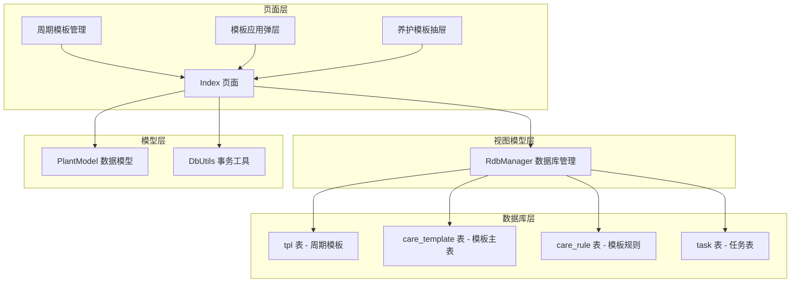
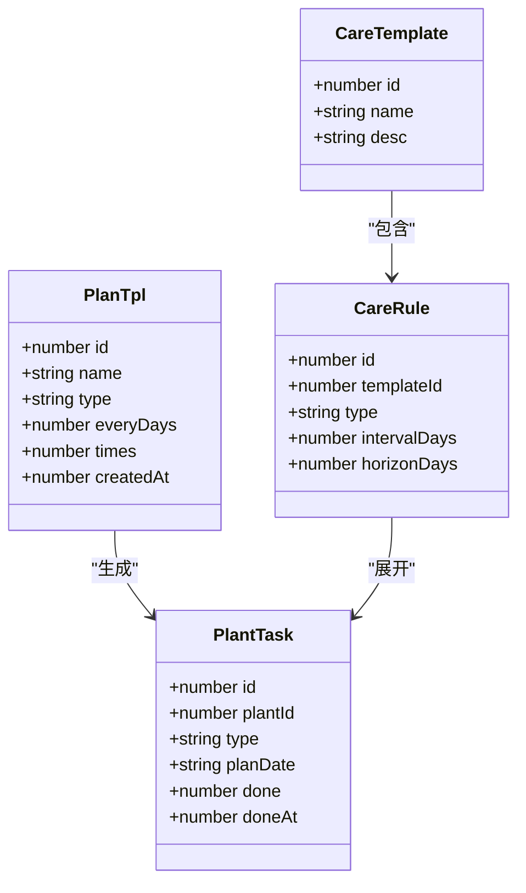
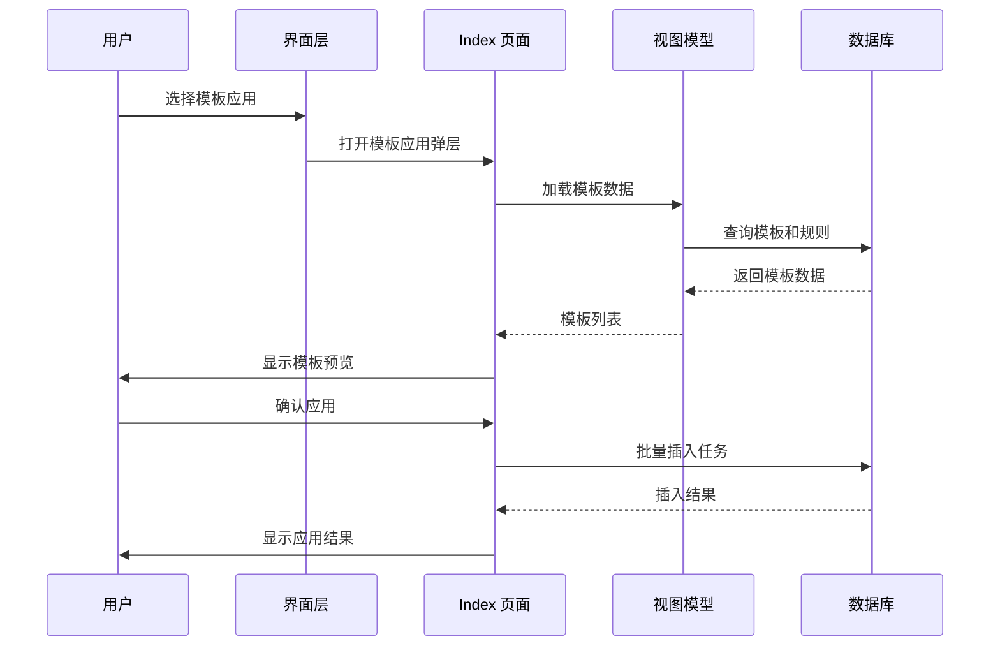
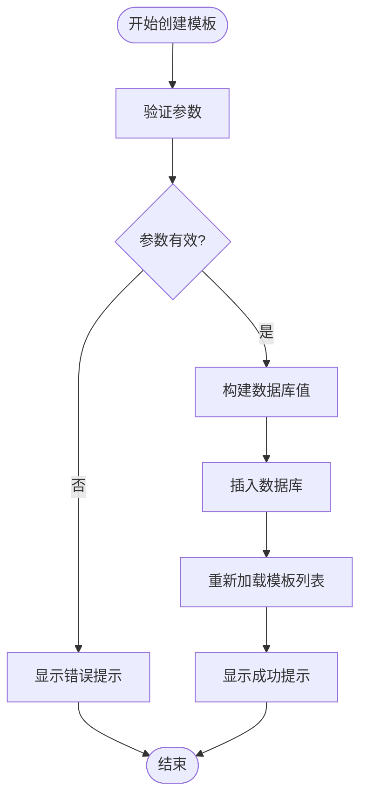
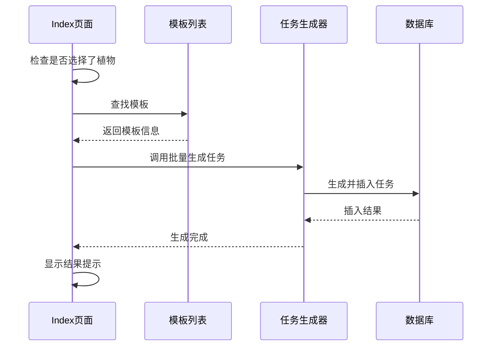
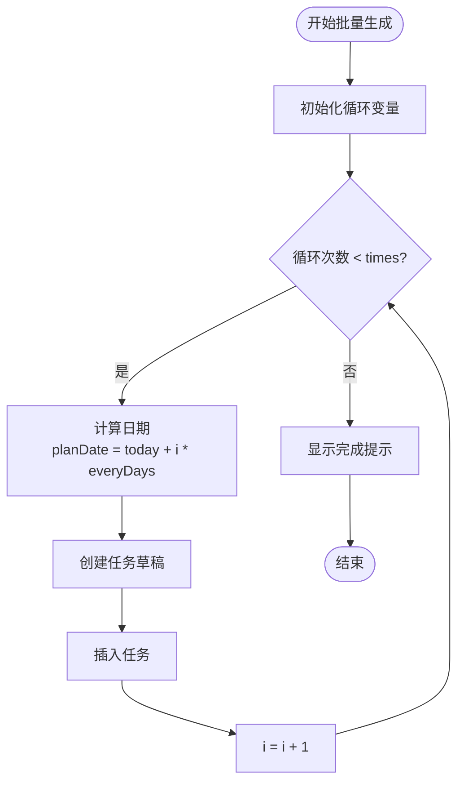
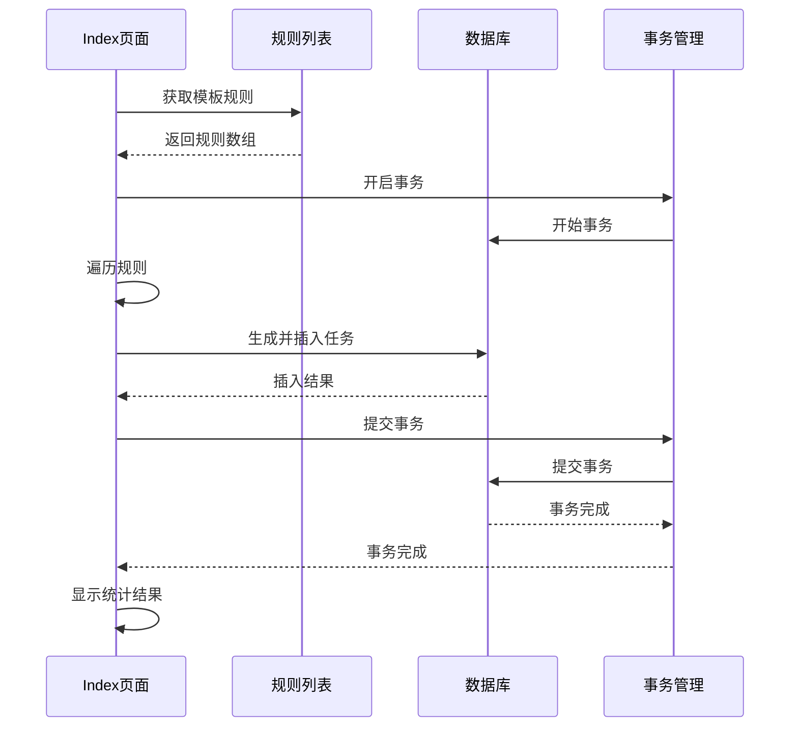
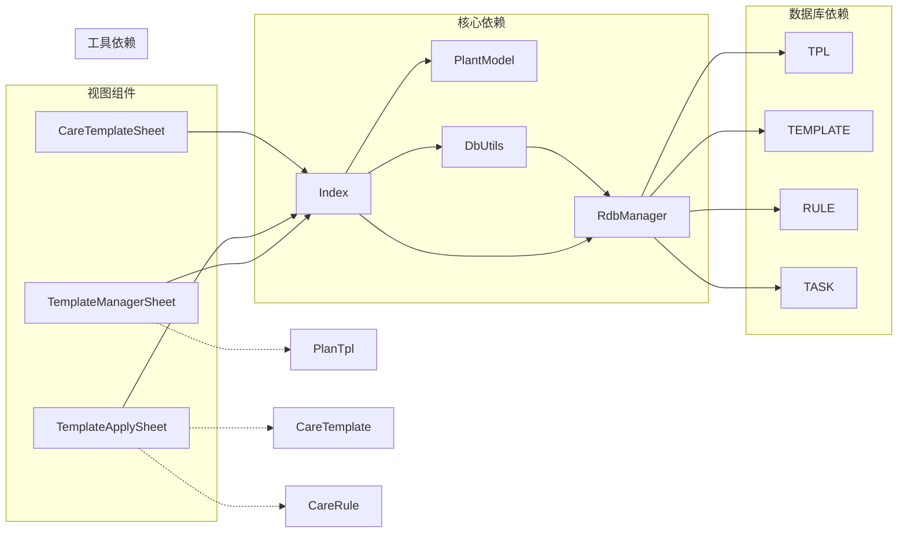

# 模板系统API

<cite>
**本文档引用的文件**
- [Index.ets](file://entry/src/main/ets/pages/Index.ets)
- [RdbManager.ets](file://entry/src/main/ets/viewmodel/RdbManager.ets)
- [PlantModel.ets](file://entry/src/main/ets/model/PlantModel.ets)
- [TemplateManagerSheet.ets](file://entry/src/main/ets/view/TemplateManagerSheet.ets)
- [TemplateApplySheet.ets](file://entry/src/main/ets/view/TemplateApplySheet.ets)
- [CareTemplateSheet.ets](file://entry/src/main/ets/view/CareTemplateSheet.ets)
- [DbUtils.ets](file://entry/src/main/ets/model/DbUtils.ets)
</cite>

## 目录
1. [简介](#简介)
2. [项目结构](#项目结构)
3. [核心组件](#核心组件)
4. [架构概览](#架构概览)
5. [详细组件分析](#详细组件分析)
6. [依赖关系分析](#依赖关系分析)
7. [性能考虑](#性能考虑)
8. [故障排除指南](#故障排除指南)
9. [结论](#结论)

## 简介

PlantDiary项目的模板系统API为用户提供了一套完整的植物养护任务模板管理解决方案。该系统支持两种模板类型：传统周期模板（PlanTpl）和新的养护模板（CareTemplate）体系。

系统提供了完整的模板生命周期管理，包括模板创建、更新、删除、应用到具体植物，以及批量任务生成等功能。模板系统采用双轨制设计，既支持传统的固定周期模板，也支持基于规则的智能模板系统。

## 项目结构

模板系统主要分布在以下模块中：

**图表来源**
- [Index.ets:1-1382](file://entry/src/main/ets/pages/Index.ets#L1-L1382)
- [RdbManager.ets:1-296](file://entry/src/main/ets/viewmodel/RdbManager.ets#L1-L296)

**章节来源**
- [Index.ets:1-1382](file://entry/src/main/ets/pages/Index.ets#L1-L1382)
- [RdbManager.ets:1-296](file://entry/src/main/ets/viewmodel/RdbManager.ets#L1-L296)

## 核心组件

### 数据模型

模板系统涉及三个核心数据模型：

**图表来源**
- [PlantModel.ets:24-166](file://entry/src/main/ets/model/PlantModel.ets#L24-L166)

### 数据库表结构

系统使用以下数据库表来存储模板相关信息：

| 表名 | 描述 | 主要字段 |
|------|------|----------|
| `tpl` | 传统周期模板表 | id, name, type, everyDays, times, createdAt |
| `care_template` | 养护模板主表 | id, name, desc |
| `care_rule` | 养护模板规则表 | id, templateId, type, intervalDays, horizonDays |
| `task` | 任务表 | id, plantId, type, planDate, done, doneAt |

**章节来源**
- [RdbManager.ets:54-103](file://entry/src/main/ets/viewmodel/RdbManager.ets#L54-L103)
- [PlantModel.ets:24-166](file://entry/src/main/ets/model/PlantModel.ets#L24-L166)

## 架构概览

模板系统采用分层架构设计，各层职责明确：

**图表来源**
- [Index.ets:776-852](file://entry/src/main/ets/pages/Index.ets#L776-L852)
- [TemplateApplySheet.ets:62-144](file://entry/src/main/ets/view/TemplateApplySheet.ets#L62-L144)

**章节来源**
- [Index.ets:776-852](file://entry/src/main/ets/pages/Index.ets#L776-L852)
- [TemplateApplySheet.ets:1-145](file://entry/src/main/ets/view/TemplateApplySheet.ets#L1-L145)

## 详细组件分析

### 模板管理API

#### createTpl - 模板创建

创建新的周期模板，支持基本的参数验证和错误处理。

**方法签名**: `createTpl(name: string, type: string, everyDays: number, times: number): Promise<void>`

**参数说明**:
- `name`: 模板名称，必填且长度必须大于0
- `type`: 任务类型，如"浇水"、"施肥"、"修剪"
- `everyDays`: 间隔天数，必须大于0
- `times`: 生成次数，必须大于0

**返回值**: `Promise<void>` - 异步操作，无返回值

**实现逻辑**:

**图表来源**
- [Index.ets:579-597](file://entry/src/main/ets/pages/Index.ets#L579-L597)

**章节来源**
- [Index.ets:579-597](file://entry/src/main/ets/pages/Index.ets#L579-L597)

#### updateTpl - 模板更新

更新现有模板信息，包含完整的参数验证。

**方法签名**: `updateTpl(id: number, name: string, type: string, everyDays: number, times: number): Promise<void>`

**参数说明**:
- `id`: 模板ID，必须大于0
- `name`: 新的模板名称
- `type`: 新的任务类型
- `everyDays`: 新的间隔天数
- `times`: 新的生成次数

**返回值**: `Promise<void>`

**实现逻辑**:
- 验证模板ID有效性
- 构建更新值对象
- 使用RdbPredicates定位目标模板
- 执行更新操作

**章节来源**
- [Index.ets:599-618](file://entry/src/main/ets/pages/Index.ets#L599-L618)

#### deleteTpl - 模板删除

删除指定的模板，支持级联删除相关任务。

**方法签名**: `deleteTpl(id: number): Promise<void>`

**参数说明**:
- `id`: 要删除的模板ID

**返回值**: `Promise<void>`

**实现逻辑**:
- 使用RdbPredicates定位目标模板
- 执行删除操作
- 重新加载模板列表

**章节来源**
- [Index.ets:620-629](file://entry/src/main/ets/pages/Index.ets#L620-L629)

### 模板应用API

#### applyTplToPlant - 应用模板到植物

将选定模板应用到指定植物，生成相应的周期任务。

**方法签名**: `applyTplToPlant(tplId: number): Promise<void>`

**参数说明**:
- `tplId`: 模板ID

**返回值**: `Promise<void>`

**实现流程**:

**图表来源**
- [Index.ets:631-646](file://entry/src/main/ets/pages/Index.ets#L631-L646)

**章节来源**
- [Index.ets:631-646](file://entry/src/main/ets/pages/Index.ets#L631-L646)

### 批量任务生成API

#### bulkCreateRecurringTasks - 批量创建周期任务

根据模板参数批量生成周期性任务。

**方法签名**: `bulkCreateRecurringTasks(plantId: number, type: string, everyDays: number, times: number): Promise<void>`

**参数说明**:
- `plantId`: 目标植物ID
- `type`: 任务类型
- `everyDays`: 任务间隔天数
- `times`: 生成任务数量

**返回值**: `Promise<void>`

**实现算法**:

**图表来源**
- [Index.ets:559-576](file://entry/src/main/ets/pages/Index.ets#L559-L576)

**章节来源**
- [Index.ets:559-576](file://entry/src/main/ets/pages/Index.ets#L559-L576)

#### generateTemplateTasks - 通用模板任务生成

支持更灵活的模板任务生成，基于规则系统。

**方法签名**: `generateTemplateTasks(plantId: number, waterInt: number, fertInt: number, pruneInt: number, startISO: string, days: number): Promise<void>`

**参数说明**:
- `plantId`: 目标植物ID
- `waterInt`: 浇水间隔天数
- `fertInt`: 施肥间隔天数  
- `pruneInt`: 修剪间隔天数
- `startISO`: 开始日期(YYYY-MM-DD)
- `days`: 生成天数

**实现算法**:
逐日遍历指定范围，根据间隔天数判断是否生成相应类型的任务。

**章节来源**
- [Index.ets:663-691](file://entry/src/main/ets/pages/Index.ets#L663-L691)

### 模板应用机制

#### applyTemplateToPlant - 智能模板应用

基于care_rule规则系统进行模板应用，支持事务处理和冲突检测。

**方法签名**: `applyTemplateToPlant(templateId: number, startISO: string): Promise<void>`

**实现流程**:

**图表来源**
- [Index.ets:814-852](file://entry/src/main/ets/pages/Index.ets#L814-L852)

**章节来源**
- [Index.ets:814-852](file://entry/src/main/ets/pages/Index.ets#L814-L852)

## 依赖关系分析

模板系统的关键依赖关系如下：

**图表来源**
- [Index.ets:1-35](file://entry/src/main/ets/pages/Index.ets#L1-L35)
- [RdbManager.ets:1-17](file://entry/src/main/ets/viewmodel/RdbManager.ets#L1-L17)

**章节来源**
- [Index.ets:1-35](file://entry/src/main/ets/pages/Index.ets#L1-L35)
- [RdbManager.ets:1-17](file://entry/src/main/ets/viewmodel/RdbManager.ets#L1-L17)

## 性能考虑

### 数据库优化

1. **唯一索引优化**: 任务表使用复合唯一索引 `(plantId, type, planDate)` 防止重复任务
2. **查询优化**: 为常用查询字段建立索引，提高查询性能
3. **事务批量处理**: 使用事务确保批量操作的一致性和性能

### 内存管理

1. **数据分页**: 大量数据采用分页加载策略
2. **状态管理**: 使用ObservedV2确保响应式更新
3. **资源释放**: 及时关闭数据库游标和连接

### 网络和异步处理

1. **异步操作**: 所有数据库操作均为异步，避免阻塞UI线程
2. **错误处理**: 完善的异常捕获和错误提示机制
3. **超时控制**: 合理的超时设置防止长时间无响应

## 故障排除指南

### 常见问题及解决方案

**问题1: 模板参数验证失败**
- 检查模板名称是否为空
- 确认间隔天数和次数都大于0
- 验证模板ID的有效性

**问题2: 任务生成冲突**
- 系统会自动跳过已存在的任务
- 检查唯一索引是否正常工作
- 确认日期格式正确

**问题3: 数据库操作失败**
- 检查数据库连接状态
- 验证事务是否正确提交
- 查看具体的错误日志

**问题4: 模板应用不生效**
- 确认已选择目标植物
- 检查模板是否存在
- 验证权限设置

**章节来源**
- [Index.ets:583-585](file://entry/src/main/ets/pages/Index.ets#L583-L585)
- [Index.ets:632-634](file://entry/src/main/ets/pages/Index.ets#L632-L634)

## 结论

PlantDiary项目的模板系统API提供了完整而灵活的植物养护任务管理解决方案。系统采用双轨制设计，既支持传统的固定周期模板，也支持基于规则的智能模板系统。

### 主要优势

1. **双轨制设计**: 同时支持传统模板和智能模板，满足不同用户需求
2. **完整的生命周期管理**: 从创建到应用的全流程支持
3. **高性能设计**: 采用事务处理、索引优化等技术手段
4. **用户友好**: 提供直观的界面和完善的错误处理机制

### 扩展建议

1. **模板继承**: 支持模板间的继承和复用
2. **条件模板**: 支持基于环境条件的动态模板
3. **模板分享**: 支持模板的导入导出和分享功能
4. **智能推荐**: 基于植物类型和养护历史的智能模板推荐

该模板系统为PlantDiary应用提供了强大的基础，能够有效提升用户的植物养护体验。