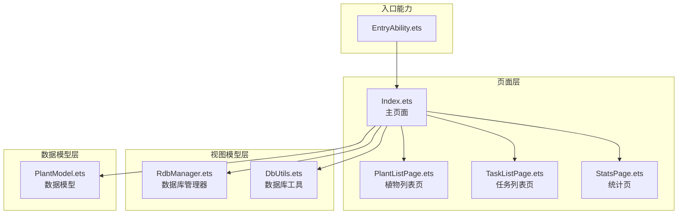
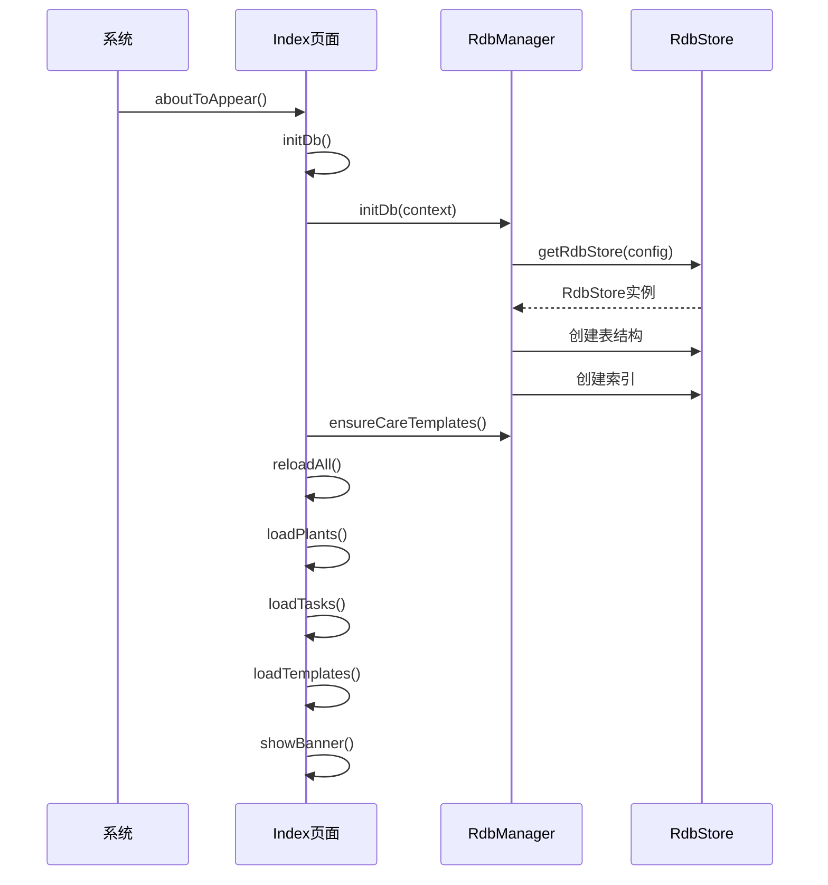
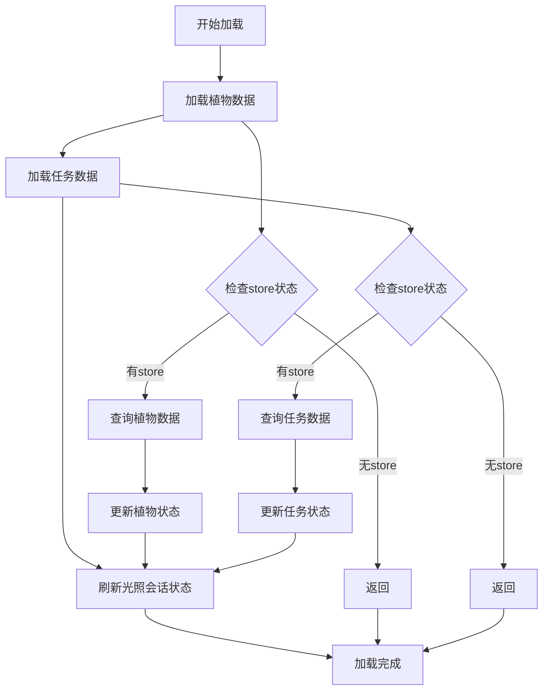
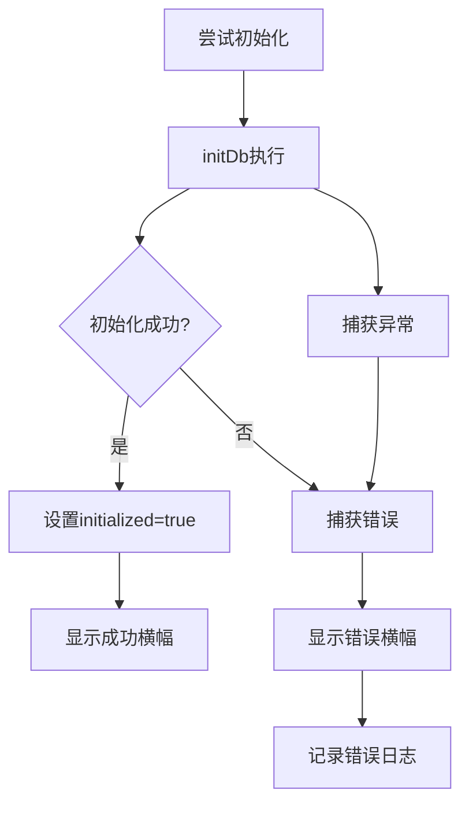
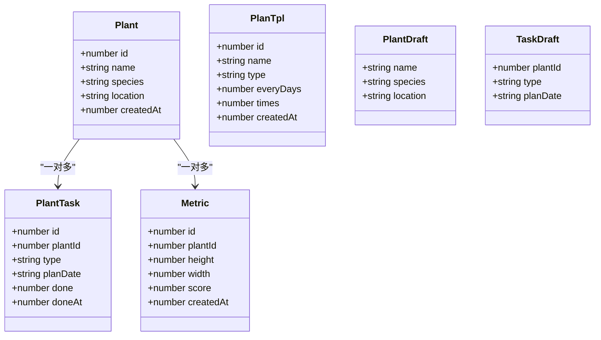
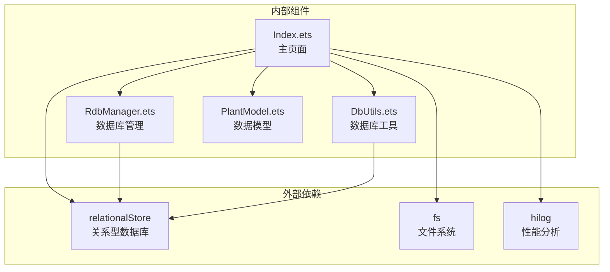
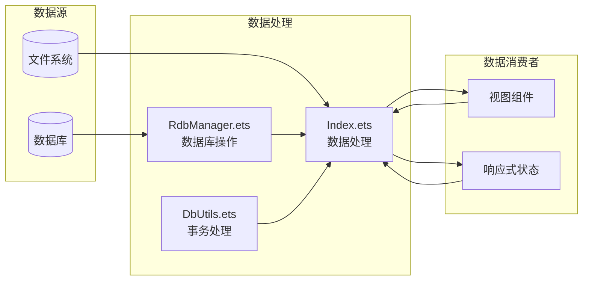

# 生命周期API

<cite>
**本文档引用的文件**
- [Index.ets](file://entry/src/main/ets/pages/Index.ets)
- [RdbManager.ets](file://entry/src/main/ets/viewmodel/RdbManager.ets)
- [DbUtils.ets](file://entry/src/main/ets/model/DbUtils.ets)
- [PlantModel.ets](file://entry/src/main/ets/model/PlantModel.ets)
- [EntryAbility.ets](file://entry/src/main/ets/entryability/EntryAbility.ets)
- [err.ets](file://entry/src/main/ets/viewmodel/err.ets)
</cite>

## 目录
1. [简介](#简介)
2. [项目结构](#项目结构)
3. [核心组件](#核心组件)
4. [架构概览](#架构概览)
5. [详细组件分析](#详细组件分析)
6. [依赖关系分析](#依赖关系分析)
7. [性能考虑](#性能考虑)
8. [故障排除指南](#故障排除指南)
9. [结论](#结论)

## 简介
本文档详细说明了Index主页面的生命周期API，重点阐述aboutToAppear生命周期钩子的实现机制。该钩子负责应用启动时的数据库初始化、全局数据加载和模板数据加载等关键步骤，确保页面在首次显示前具备完整可用的数据状态。

## 项目结构
Index主页面位于entry模块的pages目录下，采用ArkTS框架构建，实现了完整的生命周期管理和数据流控制。



**图表来源**
- [Index.ets:1-1382](file://entry/src/main/ets/pages/Index.ets#L1-L1382)
- [RdbManager.ets:1-296](file://entry/src/main/ets/viewmodel/RdbManager.ets#L1-L296)
- [EntryAbility.ets:1-79](file://entry/src/main/ets/entryability/EntryAbility.ets#L1-L79)

**章节来源**
- [Index.ets:1-1382](file://entry/src/main/ets/pages/Index.ets#L1-L1382)
- [EntryAbility.ets:1-79](file://entry/src/main/ets/entryability/EntryAbility.ets#L1-L79)

## 核心组件
Index主页面作为应用的状态中枢，承担着以下核心职责：

### 生命周期管理
- **aboutToAppear钩子**：应用启动时的初始化入口
- **状态管理**：维护植物、任务、模板等全局状态
- **数据同步**：确保多页面间的数据一致性

### 数据管理
- **数据库初始化**：建立RDB连接和表结构
- **全局数据加载**：植物、任务、指标等主数据
- **模板管理**：养护模板和规则的加载

**章节来源**
- [Index.ets:115-135](file://entry/src/main/ets/pages/Index.ets#L115-L135)
- [Index.ets:137-141](file://entry/src/main/ets/pages/Index.ets#L137-L141)
- [Index.ets:206-221](file://entry/src/main/ets/pages/Index.ets#L206-L221)

## 架构概览
Index主页面采用分层架构设计，实现了清晰的关注点分离：

```mermaid
graph TB
subgraph "表现层"
IDX[Index.ets<br/>主页面组件]
UI[各种视图组件<br/>PlantCard, MetricSheet等]
end
subgraph "业务逻辑层"
LIFECYCLE[生命周期管理<br/>aboutToAppear, build]
DATAOPS[数据操作<br/>loadPlants, loadTasks, loadTemplates]
CRUD[CRUD操作<br/>create, update, delete]
end
subgraph "数据访问层"
RDBMGR[RdbManager<br/>数据库管理]
STORE[RdbStore<br/>关系型数据库]
end
subgraph "数据模型层"
MODEL[PlantModel<br/>数据结构定义]
STATE[状态管理<br/>@Local装饰器]
end
IDX --> UI
IDX --> LIFECYCLE
LIFECYCLE --> DATAOPS
DATAOPS --> CRUD
CRUD --> RDBMGR
RDBMGR --> STORE
IDX --> MODEL
IDX --> STATE
```

**图表来源**
- [Index.ets:115-1382](file://entry/src/main/ets/pages/Index.ets#L115-L1382)
- [RdbManager.ets:4-296](file://entry/src/main/ets/viewmodel/RdbManager.ets#L4-L296)
- [PlantModel.ets:1-166](file://entry/src/main/ets/model/PlantModel.ets#L1-L166)

## 详细组件分析

### aboutToAppear生命周期钩子

#### 调用时机和执行顺序
aboutToAppear钩子在页面即将显示时自动调用，执行顺序如下：



**图表来源**
- [Index.ets:116-125](file://entry/src/main/ets/pages/Index.ets#L116-L125)
- [Index.ets:129-135](file://entry/src/main/ets/pages/Index.ets#L129-L135)
- [RdbManager.ets:27-170](file://entry/src/main/ets/viewmodel/RdbManager.ets#L27-L170)

#### 实现机制详解

##### 数据库初始化流程（initDb）
initDb方法负责完整的数据库初始化过程：

1. **数据库连接建立**：通过RdbManager获取RdbStore实例
2. **表结构创建**：创建植物、任务、指标等核心表
3. **索引优化**：为常用查询场景创建复合索引
4. **模板数据准备**：确保养护模板的基础数据存在

##### 全局数据加载（reloadAll）
reloadAll方法确保应用状态的一致性：



**图表来源**
- [Index.ets:138-141](file://entry/src/main/ets/pages/Index.ets#L138-L141)
- [Index.ets:143-184](file://entry/src/main/ets/pages/Index.ets#L143-L184)
- [Index.ets:162-168](file://entry/src/main/ets/pages/Index.ets#L162-L168)

##### 模板数据加载（loadTemplates）
模板系统支持两种类型的数据加载：

1. **周期性模板**：用于批量生成任务的模板
2. **养护模板**：包含模板主表和规则表的完整系统

**章节来源**
- [Index.ets:116-135](file://entry/src/main/ets/pages/Index.ets#L116-L135)
- [Index.ets:138-184](file://entry/src/main/ets/pages/Index.ets#L138-L184)
- [Index.ets:206-221](file://entry/src/main/ets/pages/Index.ets#L206-L221)

### 异步操作处理机制

#### 错误捕获和处理
Index页面实现了完善的错误处理机制：



**图表来源**
- [Index.ets:116-125](file://entry/src/main/ets/pages/Index.ets#L116-L125)

#### 状态管理策略
页面使用@Local装饰器管理响应式状态：

| 状态类型 | 关键状态 | 用途 |
|---------|----------|------|
| 基础状态 | initialized, plants, tasks | 页面初始化和数据缓存 |
| UI状态 | bannerMsg, bannerType, panelVisible | 用户界面反馈 |
| 过滤状态 | filterStatus, filterType, sortKey | 数据筛选和排序 |
| 模板状态 | templates, tplList, ruleList | 养护模板管理 |

**章节来源**
- [Index.ets:44-112](file://entry/src/main/ets/pages/Index.ets#L44-L112)
- [Index.ets:115-125](file://entry/src/main/ets/pages/Index.ets#L115-L125)

### 数据模型和类型定义

#### 核心数据模型
Index页面使用了多种数据模型来表示不同的业务实体：



**图表来源**
- [PlantModel.ets:6-166](file://entry/src/main/ets/model/PlantModel.ets#L6-L166)

**章节来源**
- [PlantModel.ets:1-166](file://entry/src/main/ets/model/PlantModel.ets#L1-L166)

## 依赖关系分析

### 组件耦合关系
Index页面与各个组件之间的依赖关系如下：



**图表来源**
- [Index.ets:1-35](file://entry/src/main/ets/pages/Index.ets#L1-L35)
- [RdbManager.ets:1-3](file://entry/src/main/ets/viewmodel/RdbManager.ets#L1-L3)

### 数据流依赖
页面的数据流遵循单向数据绑定原则：



**图表来源**
- [Index.ets:129-184](file://entry/src/main/ets/pages/Index.ets#L129-L184)
- [RdbManager.ets:27-170](file://entry/src/main/ets/viewmodel/RdbManager.ets#L27-L170)

**章节来源**
- [Index.ets:1-35](file://entry/src/main/ets/pages/Index.ets#L1-L35)
- [RdbManager.ets:1-296](file://entry/src/main/ets/viewmodel/RdbManager.ets#L1-L296)

## 性能考虑

### 数据库性能优化
1. **索引策略**：为常用查询条件创建复合索引
2. **批量操作**：使用事务处理批量数据变更
3. **查询优化**：合理使用LIMIT和ORDER BY优化查询性能

### 内存管理
1. **状态最小化**：仅缓存必要的全局状态
2. **及时释放**：页面销毁时清理资源
3. **懒加载**：按需加载非关键数据

### 网络和IO优化
1. **文件操作**：批量处理文件删除操作
2. **数据库连接**：复用RdbStore实例
3. **UI更新**：使用响应式更新减少不必要的重绘

## 故障排除指南

### 常见问题和解决方案

#### 数据库初始化失败
**症状**：页面显示"数据库初始化失败"横幅
**原因**：RdbStore获取失败或表结构创建异常
**解决方案**：
1. 检查应用权限配置
2. 验证数据库文件访问权限
3. 查看HILOG日志获取详细错误信息

#### 数据加载异常
**症状**：植物或任务数据显示异常
**原因**：数据库查询失败或数据格式不匹配
**解决方案**：
1. 验证SQL查询语句正确性
2. 检查数据模型字段映射
3. 确认数据库版本兼容性

#### 事务处理失败
**症状**：批量操作后数据状态不一致
**原因**：事务回滚或并发访问冲突
**解决方案**：
1. 使用runInTransaction确保原子性
2. 处理唯一索引冲突
3. 实现适当的重试机制

**章节来源**
- [Index.ets:121-124](file://entry/src/main/ets/pages/Index.ets#L121-L124)
- [DbUtils.ets:12-21](file://entry/src/main/ets/model/DbUtils.ets#L12-L21)

## 结论
Index主页面的生命周期API设计体现了良好的软件工程实践，通过合理的分层架构、完善的错误处理机制和高效的性能优化策略，为用户提供稳定可靠的应用体验。其aboutToAppear钩子实现了从数据库初始化到全局数据加载的完整流程，确保了应用启动时的数据完整性。

该实现方案具有以下优势：
1. **模块化设计**：清晰的职责分离便于维护和扩展
2. **错误处理**：完善的异常捕获和用户反馈机制
3. **性能优化**：合理的数据库索引和查询优化策略
4. **状态管理**：响应式的状态更新确保UI一致性