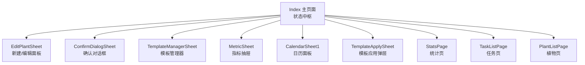
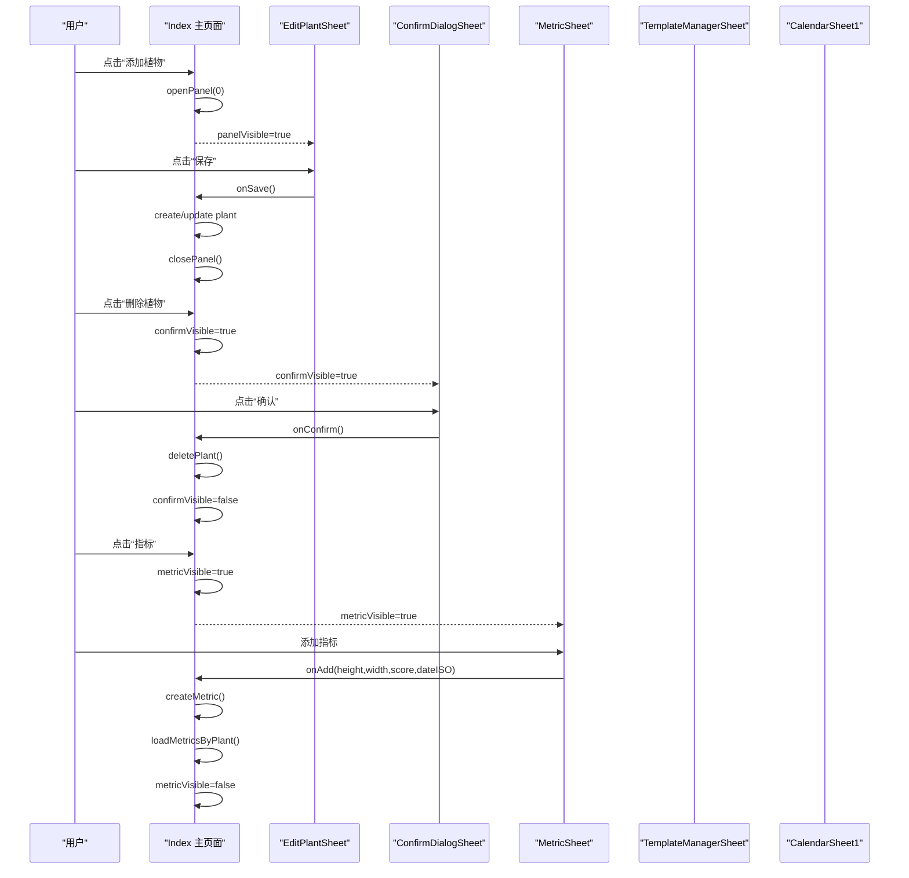
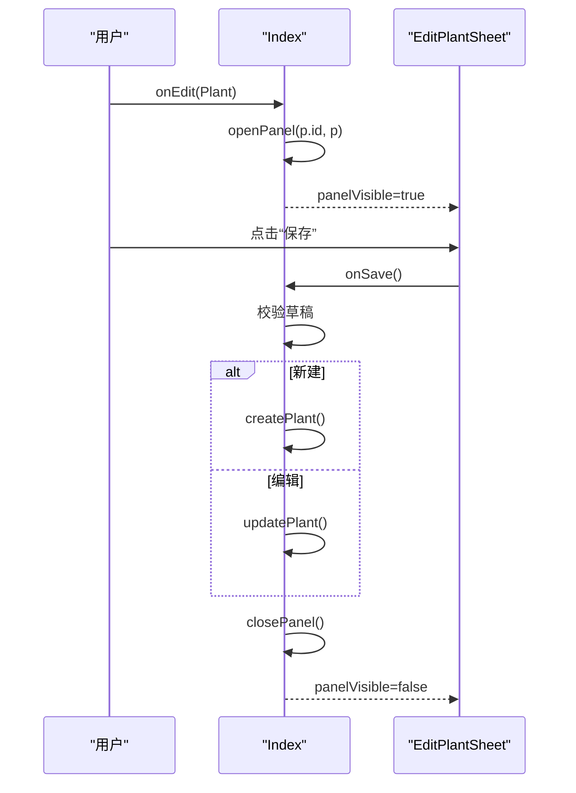
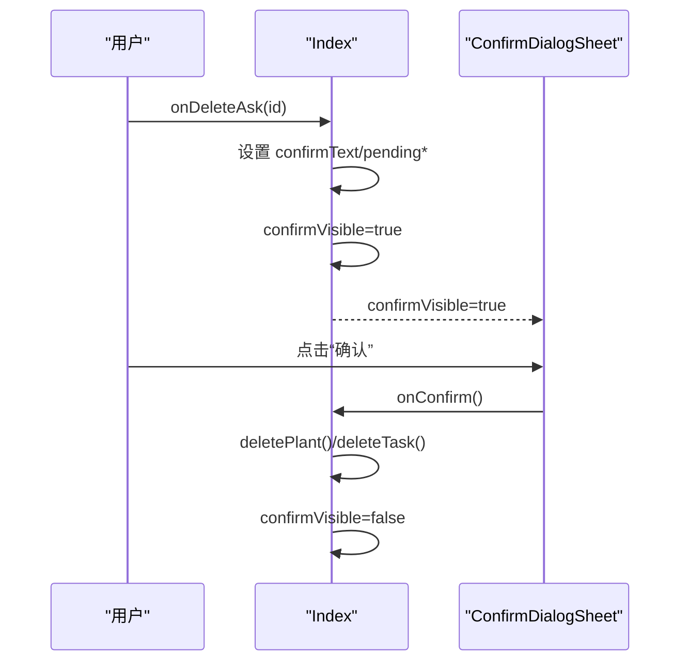
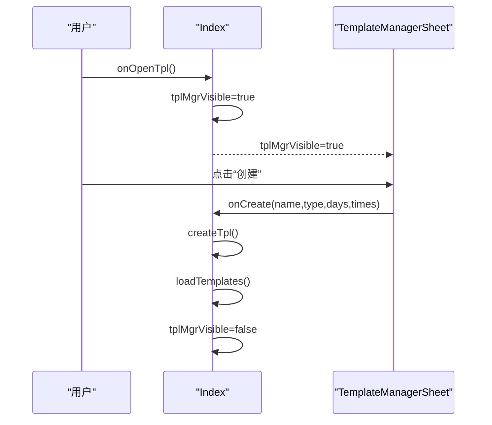
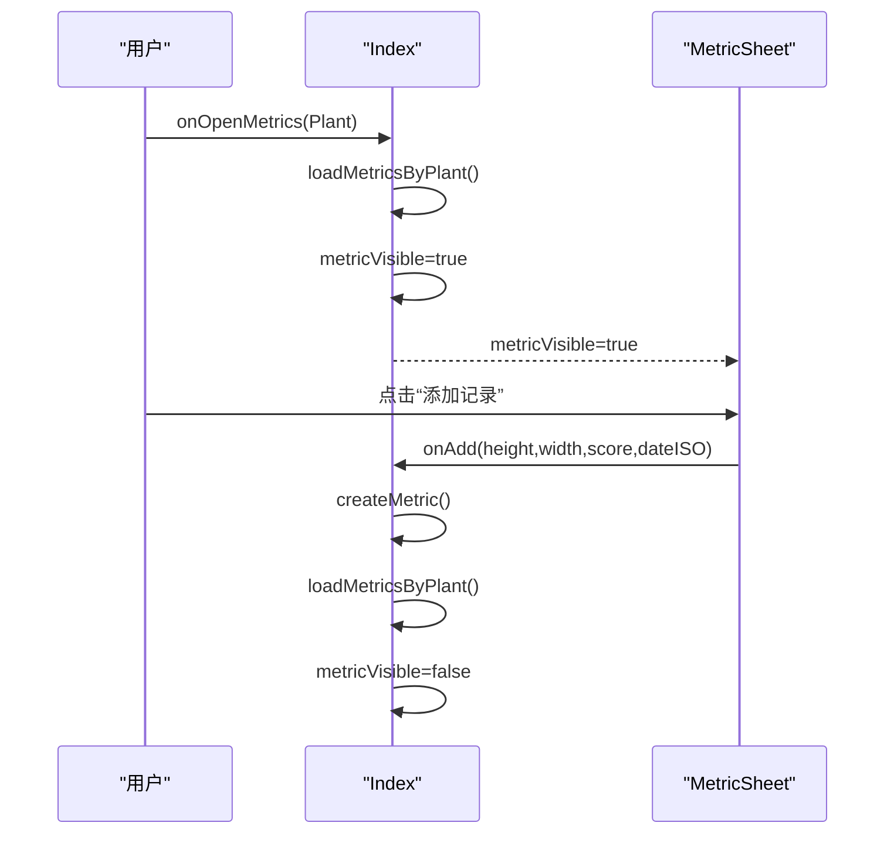
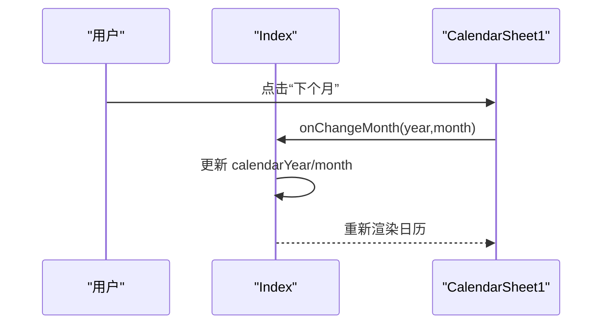
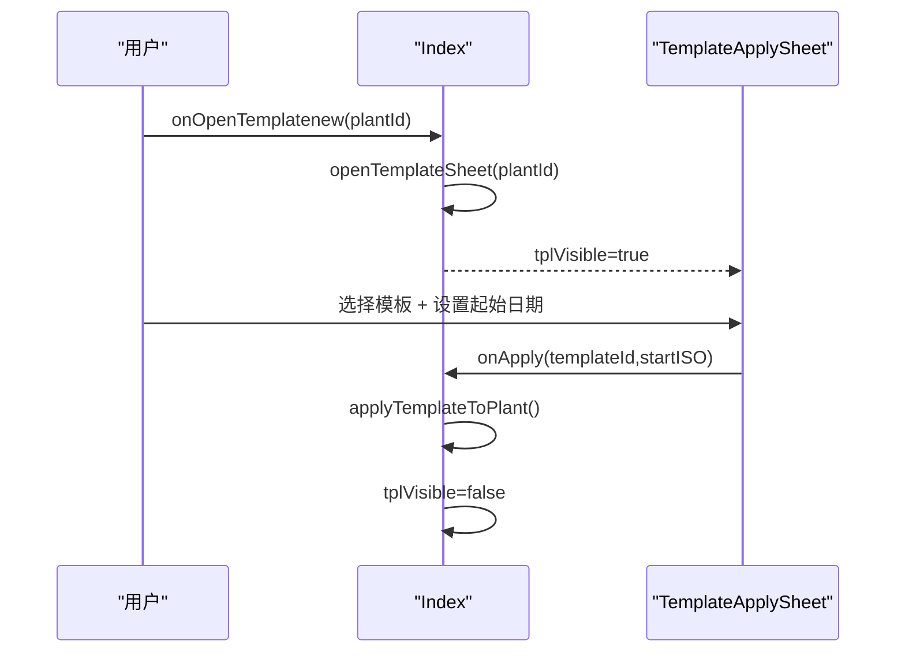
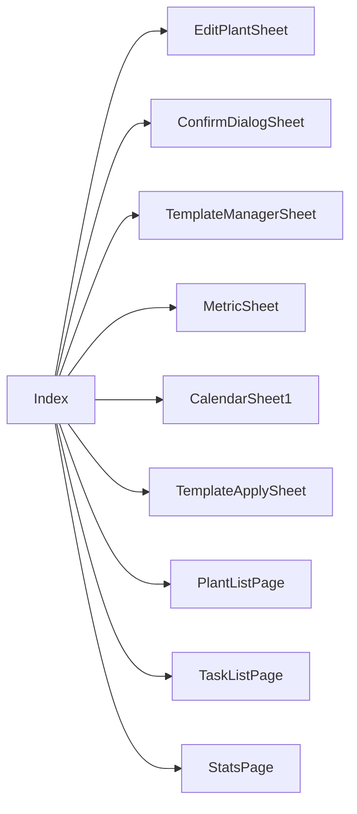

# 界面状态API

<cite>
**本文档引用的文件**
- [Index.ets](file://entry/src/main/ets/pages/Index.ets)
- [EditPlantSheet.ets](file://entry/src/main/ets/view/EditPlantSheet.ets)
- [ConfirmDialogSheet.ets](file://entry/src/main/ets/view/ConfirmDialogSheet.ets)
- [TemplateManagerSheet.ets](file://entry/src/main/ets/view/TemplateManagerSheet.ets)
- [MetricSheet.ets](file://entry/src/main/ets/view/MetricSheet.ets)
- [CalendarSheet.ets](file://entry/src/main/ets/pages/CalendarSheet.ets)
- [TemplateApplySheet.ets](file://entry/src/main/ets/view/TemplateApplySheet.ets)
</cite>

## 目录
1. [简介](#简介)
2. [项目结构](#项目结构)
3. [核心组件](#核心组件)
4. [架构总览](#架构总览)
5. [详细组件分析](#详细组件分析)
6. [依赖关系分析](#依赖关系分析)
7. [性能考虑](#性能考虑)
8. [故障排除指南](#故障排除指南)
9. [结论](#结论)

## 简介
本文件系统性梳理 PlantDiary Index 主页面的界面状态管理 API，重点覆盖以下弹窗与面板的状态控制：
- 新建/编辑面板：openPanel、closePanel
- 确认对话框：confirmVisible
- 模板管理器：tplMgrVisible
- 指标抽屉：metricVisible
- 日历功能：calendarYear、calendarMonth
- 其他相关状态：taskFilterVisible、careVisible、metricChartVisible、tplVisible、taskStatsVisible 等

文档将详细说明状态变量的数据类型、状态切换逻辑、用户交互处理方式，并提供最佳实践、动画效果与用户体验优化建议，以及完整的状态参数说明与使用示例。

## 项目结构
Index 页面作为应用的状态中枢，承担导航容器、全局弹层宿主与共享数据 Provider 的职责。其状态通过装饰器与本地变量集中管理，配合多个自定义视图组件实现弹窗、抽屉与对话框的统一控制。

**图表来源**
- [Index.ets:855-1198](file://entry/src/main/ets/pages/Index.ets#L855-L1198)
- [EditPlantSheet.ets:1-264](file://entry/src/main/ets/view/EditPlantSheet.ets#L1-L264)
- [ConfirmDialogSheet.ets:1-103](file://entry/src/main/ets/view/ConfirmDialogSheet.ets#L1-L103)
- [TemplateManagerSheet.ets:1-249](file://entry/src/main/ets/view/TemplateManagerSheet.ets#L1-L249)
- [MetricSheet.ets:1-491](file://entry/src/main/ets/view/MetricSheet.ets#L1-L491)
- [CalendarSheet.ets:1-504](file://entry/src/main/ets/pages/CalendarSheet.ets#L1-L504)
- [TemplateApplySheet.ets:1-145](file://entry/src/main/ets/view/TemplateApplySheet.ets#L1-L145)

**章节来源**
- [Index.ets:41-112](file://entry/src/main/ets/pages/Index.ets#L41-L112)
- [Index.ets:855-1198](file://entry/src/main/ets/pages/Index.ets#L855-L1198)

## 核心组件
本节概述 Index 页面中与界面状态管理直接相关的状态变量与方法，涵盖数据类型、用途与典型交互路径。

- 状态变量与类型
  - panelVisible: boolean —— 新建/编辑面板开关
  - editingPlantId: number —— 正在编辑的植物 ID
  - plantDraft: PlantDraft —— 新建/编辑草稿
  - taskDraft: TaskDraft —— 任务草稿
  - confirmVisible: boolean —— 确认对话框开关
  - confirmText: string —— 对话框提示文本
  - pendingDeletePlantId/pendingDeleteTaskId: number —— 待删除对象 ID
  - tplMgrVisible: boolean —— 模板管理器开关
  - templates: Array<PlanTpl> —— 模板列表
  - metricVisible: boolean —— 指标抽屉开关
  - metricPlantId/metricPlantName: number/string —— 指标所属植物
  - metrics: Array<Metric> —— 指标数据
  - calendarYear/calendarMonth: number —— 日历当前年/月
  - metricChartVisible: boolean —— 指标趋势图开关
  - metricChartData: Array<Metric> —— 趋势图数据
  - tplVisible: boolean —— 模板应用弹层开关
  - tplTargetPlantId/tplTargetPlantName: number/string —— 目标植物
  - tplList/ruleList: Array<CareTemplate>/Array<CareRule> —— 模板与规则

- 关键方法
  - openPanel(editId, preset?) —— 打开新建/编辑面板
  - closePanel() —— 关闭新建/编辑面板
  - openMetricChart(plantId) —— 打开指标趋势图
  - openTemplateSheet(plantId) —— 打开模板应用弹层
  - applyTemplateToPlant(templateId, startISO) —— 应用模板到植物
  - loadMetricsByPlant(plantId) —— 加载指标数据
  - createMetric/ deleteMetric —— 指标增删
  - showBanner(text, type) —— 顶部横幅提示

**章节来源**
- [Index.ets:48-112](file://entry/src/main/ets/pages/Index.ets#L48-L112)
- [Index.ets:725-740](file://entry/src/main/ets/pages/Index.ets#L725-L740)
- [Index.ets:197-204](file://entry/src/main/ets/pages/Index.ets#L197-L204)
- [Index.ets:806-810](file://entry/src/main/ets/pages/Index.ets#L806-L810)
- [Index.ets:224-284](file://entry/src/main/ets/pages/Index.ets#L224-L284)
- [Index.ets:715-723](file://entry/src/main/ets/pages/Index.ets#L715-L723)

## 架构总览
Index 页面采用“状态集中 + 组件解耦”的设计模式：
- 状态集中在 Index 中，通过 @Local/@Provider 管理
- 弹窗/抽屉以条件渲染形式挂载于 Index 根节点，统一接收状态并触发回调
- 子页面与组件通过事件回调与 Index 交互，避免跨层级状态传播

**图表来源**
- [Index.ets:875-910](file://entry/src/main/ets/pages/Index.ets#L875-L910)
- [Index.ets:1067-1083](file://entry/src/main/ets/pages/Index.ets#L1067-L1083)
- [Index.ets:1086-1146](file://entry/src/main/ets/pages/Index.ets#L1086-L1146)
- [EditPlantSheet.ets:10-16](file://entry/src/main/ets/view/EditPlantSheet.ets#L10-L16)
- [ConfirmDialogSheet.ets:4-6](file://entry/src/main/ets/view/ConfirmDialogSheet.ets#L4-L6)
- [MetricSheet.ets:6-11](file://entry/src/main/ets/view/MetricSheet.ets#L6-L11)

## 详细组件分析

### 新建/编辑面板（openPanel、closePanel）
- 状态变量
  - panelVisible: boolean —— 控制面板显示/隐藏
  - editingPlantId: number —— 当前编辑植物 ID（0 表示新建）
  - plantDraft: PlantDraft —— 表单草稿
  - taskDraft: TaskDraft —— 快速任务草稿
- 方法
  - openPanel(editId, preset?) —— 设置草稿与编辑 ID，打开面板
  - closePanel() —— 关闭面板
- 用户交互
  - 保存：校验名称非空，新建或更新植物，关闭面板
  - 删除：删除植物后关闭面板
  - 快速添加：为当前植物添加“今日浇水”任务
  - 批量排程：基于模板生成周期任务
  - 打开模板管理：打开模板管理器
- 动画与体验
  - 面板底部抽屉入场动画，背景遮罩渐显
  - 按钮按压缩放反馈
  - 键盘避让模式

**图表来源**
- [Index.ets:725-740](file://entry/src/main/ets/pages/Index.ets#L725-L740)
- [Index.ets:1086-1146](file://entry/src/main/ets/pages/Index.ets#L1086-L1146)
- [EditPlantSheet.ets:10-16](file://entry/src/main/ets/view/EditPlantSheet.ets#L10-L16)

**章节来源**
- [Index.ets:61-65](file://entry/src/main/ets/pages/Index.ets#L61-L65)
- [Index.ets:725-740](file://entry/src/main/ets/pages/Index.ets#L725-L740)
- [Index.ets:1086-1146](file://entry/src/main/ets/pages/Index.ets#L1086-L1146)
- [EditPlantSheet.ets:1-264](file://entry/src/main/ets/view/EditPlantSheet.ets#L1-L264)

### 确认对话框（confirmVisible）
- 状态变量
  - confirmVisible: boolean —— 对话框显示/隐藏
  - confirmText: string —— 提示文本
  - pendingDeletePlantId/pendingDeleteTaskId: number —— 待删除对象 ID
- 用户交互
  - 取消：关闭对话框
  - 确认：根据待删除 ID 删除植物或任务，关闭对话框
- 动画与体验
  - 背景遮罩渐显动画
  - 按钮按压缩放反馈

**图表来源**
- [Index.ets:898-903](file://entry/src/main/ets/pages/Index.ets#L898-L903)
- [Index.ets:937-942](file://entry/src/main/ets/pages/Index.ets#L937-L942)
- [Index.ets:1067-1083](file://entry/src/main/ets/pages/Index.ets#L1067-L1083)
- [ConfirmDialogSheet.ets:4-6](file://entry/src/main/ets/view/ConfirmDialogSheet.ets#L4-L6)

**章节来源**
- [Index.ets:66-70](file://entry/src/main/ets/pages/Index.ets#L66-L70)
- [Index.ets:1067-1083](file://entry/src/main/ets/pages/Index.ets#L1067-L1083)
- [ConfirmDialogSheet.ets:1-103](file://entry/src/main/ets/view/ConfirmDialogSheet.ets#L1-L103)

### 模板管理器（tplMgrVisible）
- 状态变量
  - tplMgrVisible: boolean —— 模板管理器显示/隐藏
  - templates: Array<PlanTpl> —— 周期模板列表
- 用户交互
  - 新建：输入名称、类型、间隔天数、次数，创建模板
  - 更新：进入编辑态，修改后保存
  - 删除：删除模板
  - 应用：将模板应用到当前植物（通过 Index 的 applyTplToPlant）
- 动画与体验
  - 底部抽屉入场动画
  - 列表滚动与边缘弹性效果

**图表来源**
- [Index.ets:1133-1136](file://entry/src/main/ets/pages/Index.ets#L1133-L1136)
- [Index.ets:1149-1169](file://entry/src/main/ets/pages/Index.ets#L1149-L1169)
- [TemplateManagerSheet.ets:7-11](file://entry/src/main/ets/view/TemplateManagerSheet.ets#L7-L11)

**章节来源**
- [Index.ets:78-80](file://entry/src/main/ets/pages/Index.ets#L78-L80)
- [Index.ets:1149-1169](file://entry/src/main/ets/pages/Index.ets#L1149-L1169)
- [TemplateManagerSheet.ets:1-249](file://entry/src/main/ets/view/TemplateManagerSheet.ets#L1-L249)

### 指标抽屉（metricVisible）
- 状态变量
  - metricVisible: boolean —— 指标抽屉显示/隐藏
  - metricPlantId/metricPlantName: number/string —— 指标所属植物
  - metrics: Array<Metric> —— 指标数据
- 用户交互
  - 打开：加载指标数据，设置植物名，显示抽屉
  - 添加：输入身高、冠幅、健康分与日期，调用 Index 的 createMetric
  - 删除：调用 Index 的 deleteMetric
  - 切换维度：健康分/身高/冠幅
  - 切换排序：时间升序/降序
- 动画与体验
  - 背景遮罩渐显动画
  - 图表柱状图入场动画
  - 按钮按压缩放反馈

**图表来源**
- [Index.ets:904-910](file://entry/src/main/ets/pages/Index.ets#L904-L910)
- [Index.ets:1039-1053](file://entry/src/main/ets/pages/Index.ets#L1039-L1053)
- [Index.ets:224-260](file://entry/src/main/ets/pages/Index.ets#L224-L260)
- [MetricSheet.ets:6-11](file://entry/src/main/ets/view/MetricSheet.ets#L6-L11)

**章节来源**
- [Index.ets:81-85](file://entry/src/main/ets/pages/Index.ets#L81-L85)
- [Index.ets:1039-1053](file://entry/src/main/ets/pages/Index.ets#L1039-L1053)
- [MetricSheet.ets:1-491](file://entry/src/main/ets/view/MetricSheet.ets#L1-L491)

### 日历功能（calendarYear、calendarMonth）
- 状态变量
  - calendarYear: number —— 日历年
  - calendarMonth: number —— 日历月
- 用户交互
  - 切换月份：通过 CalendarSheet1 的 onChangeMonth 回调更新 Index 的年/月
  - 快速添加：在指定日期为选定植物创建任务
  - 切换关注：长按某日进入“仅看当天”模式
  - 筛选：按完成状态与任务类型筛选
- 动画与体验
  - 月标题与导航按钮动画
  - 日单元格点击与长按反馈
  - 快速添加条目入场动画

**图表来源**
- [Index.ets:957-960](file://entry/src/main/ets/pages/Index.ets#L957-L960)
- [CalendarSheet.ets:27-31](file://entry/src/main/ets/pages/CalendarSheet.ets#L27-L31)

**章节来源**
- [Index.ets:86-88](file://entry/src/main/ets/pages/Index.ets#L86-L88)
- [Index.ets:952-978](file://entry/src/main/ets/pages/Index.ets#L952-L978)
- [CalendarSheet.ets:1-504](file://entry/src/main/ets/pages/CalendarSheet.ets#L1-L504)

### 模板应用弹层（tplVisible）
- 状态变量
  - tplVisible: boolean —— 模板应用弹层显示/隐藏
  - tplTargetPlantId/tplTargetPlantName: number/string —— 目标植物
  - tplList: Array<CareTemplate> —— 模板列表
  - ruleList: Array<CareRule> —— 规则列表
- 用户交互
  - 选择模板：切换选中模板
  - 设置起始日期：YYYY-MM-DD 输入
  - 预览结果：按规则展开生成的任务列表
  - 复制到植物：调用 Index 的 applyTemplateToPlant
- 动画与体验
  - 底部抽屉入场动画
  - 列表滚动与边缘弹性效果

**图表来源**
- [Index.ets:917-920](file://entry/src/main/ets/pages/Index.ets#L917-L920)
- [Index.ets:806-810](file://entry/src/main/ets/pages/Index.ets#L806-L810)
- [Index.ets:1170-1184](file://entry/src/main/ets/pages/Index.ets#L1170-L1184)
- [TemplateApplySheet.ets:9-10](file://entry/src/main/ets/view/TemplateApplySheet.ets#L9-L10)

**章节来源**
- [Index.ets:107-111](file://entry/src/main/ets/pages/Index.ets#L107-L111)
- [Index.ets:1170-1184](file://entry/src/main/ets/pages/Index.ets#L1170-L1184)
- [TemplateApplySheet.ets:1-145](file://entry/src/main/ets/view/TemplateApplySheet.ets#L1-L145)

### 其他相关状态
- taskFilterVisible: boolean —— 任务筛选面板开关
- careVisible: boolean —— 养护模板入口开关
- metricChartVisible: boolean —— 指标趋势图开关
- taskStatsVisible: boolean —— 任务统计弹层开关
- filterVisible/filterStatus/filterType/filterFrom/filterTo/filterKeyword/sortKey/sortAsc：任务筛选与排序状态

这些状态与对应的组件在 Index 的 build 中以条件渲染方式挂载，遵循相同的“状态集中 + 组件解耦”模式。

**章节来源**
- [Index.ets:58-101](file://entry/src/main/ets/pages/Index.ets#L58-L101)
- [Index.ets:103-107](file://entry/src/main/ets/pages/Index.ets#L103-L107)

## 依赖关系分析
- Index 对多个自定义组件具有直接依赖：EditPlantSheet、ConfirmDialogSheet、TemplateManagerSheet、MetricSheet、CalendarSheet1、TemplateApplySheet
- 组件间通过 @Param/@Event 传递状态与回调，避免跨层级状态传播
- Index 作为全局 Provider，向子页面提供数据库与页面栈等共享资源

**图表来源**
- [Index.ets:13-36](file://entry/src/main/ets/pages/Index.ets#L13-L36)
- [Index.ets:855-1198](file://entry/src/main/ets/pages/Index.ets#L855-L1198)

**章节来源**
- [Index.ets:13-36](file://entry/src/main/ets/pages/Index.ets#L13-L36)
- [Index.ets:855-1198](file://entry/src/main/ets/pages/Index.ets#L855-L1198)

## 性能考虑
- 状态集中管理：避免多处重复状态，降低状态不一致风险
- 条件渲染：仅在需要时渲染弹窗/抽屉，减少不必要的组件构建
- 动画时长与曲线：统一使用短时长动画（100-300ms）提升响应感
- 数据加载：指标与模板加载在打开抽屉/弹层时按需触发，避免首屏压力
- 列表渲染：日历与任务列表使用分片与滚动优化，减少重绘

[本节为通用指导，无需特定文件来源]

## 故障排除指南
- 保存按钮无效
  - 检查草稿名称是否为空（新建/编辑均要求名称非空）
  - 确认 Index 的 onSave 回调正确触发
- 删除操作未生效
  - 确认 pendingDeletePlantId/pendingDeleteTaskId 是否正确设置
  - 检查 confirmVisible 是否被关闭
- 指标抽屉不显示
  - 确认 metricVisible 已设置为 true
  - 检查 metricPlantId 是否有效且指标数据已加载
- 模板应用失败
  - 确认模板 ID 与目标植物 ID 有效
  - 检查起始日期格式是否为 YYYY-MM-DD
- 日历月份切换异常
  - 确认 onChangeMonth 回调正确更新 calendarYear 与 calendarMonth

**章节来源**
- [Index.ets:1092-1104](file://entry/src/main/ets/pages/Index.ets#L1092-L1104)
- [Index.ets:1073-1081](file://entry/src/main/ets/pages/Index.ets#L1073-L1081)
- [Index.ets:1046-1051](file://entry/src/main/ets/pages/Index.ets#L1046-L1051)
- [Index.ets:1165-1167](file://entry/src/main/ets/pages/Index.ets#L1165-L1167)
- [CalendarSheet.ets:27-31](file://entry/src/main/ets/pages/CalendarSheet.ets#L27-L31)

## 结论
Index 主页面通过集中式状态管理与组件化弹窗/抽屉设计，实现了清晰、可维护的界面状态控制。本文档总结了关键状态变量、切换逻辑与用户交互路径，并提供了最佳实践与优化建议。建议在后续迭代中持续关注状态一致性、动画流畅性与数据加载策略，以进一步提升用户体验。