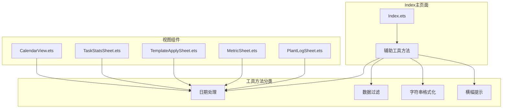
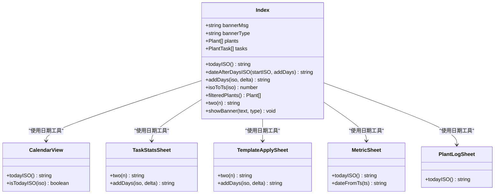
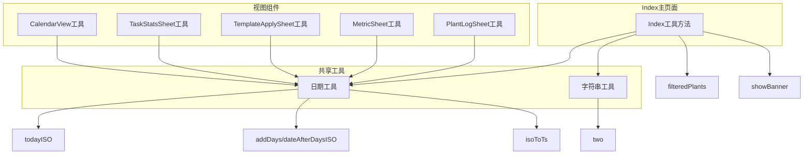

# 辅助工具API

<cite>
**本文档引用的文件**
- [Index.ets](file://entry/src/main/ets/pages/Index.ets)
- [CalendarView.ets](file://entry/src/main/ets/view/CalendarView.ets)
- [TaskStatsSheet.ets](file://entry/src/main/ets/view/TaskStatsSheet.ets)
- [TemplateApplySheet.ets](file://entry/src/main/ets/view/TemplateApplySheet.ets)
- [MetricSheet.ets](file://entry/src/main/ets/view/MetricSheet.ets)
- [PlantLogSheet.ets](file://entry/src/main/ets/view/PlantLogSheet.ets)
</cite>

## 目录
1. [简介](#简介)
2. [项目结构](#项目结构)
3. [核心组件](#核心组件)
4. [架构概览](#架构概览)
5. [详细组件分析](#详细组件分析)
6. [依赖关系分析](#依赖关系分析)
7. [性能考虑](#性能考虑)
8. [故障排除指南](#故障排除指南)
9. [结论](#结论)

## 简介

本文档详细介绍了PlantDiary应用中Index主页面的辅助工具API。这些工具方法提供了日期处理、数据过滤、字符串格式化和横幅提示等实用功能，是应用日常操作的核心支撑组件。文档涵盖了所有辅助方法的输入输出格式、计算逻辑、使用场景以及最佳实践建议。

## 项目结构

PlantDiary是一个基于ArkTS的植物养护管理应用，采用模块化的架构设计。Index主页面作为应用的状态中枢，集成了多种辅助工具方法来支持植物管理、任务调度和数据展示等功能。

**图表来源**
- [Index.ets:693-774](file://entry/src/main/ets/pages/Index.ets#L693-L774)
- [CalendarView.ets:424-431](file://entry/src/main/ets/view/CalendarView.ets#L424-L431)

## 核心组件

Index主页面包含了丰富的辅助工具方法，主要分为以下几类：

### 1. 日期处理工具
- `todayISO()`: 获取当前日期的ISO格式字符串
- `dateAfterDaysISO(startISO: string, addDays: number)`: 在指定日期基础上增加天数
- `addDays(iso: string, delta: number)`: 添加或减去指定天数
- `isoToTs(iso: string)`: ISO日期字符串转换为时间戳

### 2. 数据过滤工具
- `filteredPlants()`: 根据关键词过滤植物列表

### 3. 字符串格式化工具
- `two(n: number)`: 数字转两位字符串格式

### 4. 横幅提示工具
- `showBanner(text: string, type: 'ok' | 'warn' | 'info' = 'info')`: 显示横幅提示消息

**章节来源**
- [Index.ets:693-774](file://entry/src/main/ets/pages/Index.ets#L693-L774)
- [Index.ets:741-758](file://entry/src/main/ets/pages/Index.ets#L741-L758)

## 架构概览

Index主页面的辅助工具API采用了集中式的设计模式，所有工具方法都定义在Index组件内部，通过状态管理和事件驱动的方式为各个视图组件提供服务。

**图表来源**
- [Index.ets:693-774](file://entry/src/main/ets/pages/Index.ets#L693-L774)
- [CalendarView.ets:424-431](file://entry/src/main/ets/view/CalendarView.ets#L424-L431)
- [TaskStatsSheet.ets:52-71](file://entry/src/main/ets/view/TaskStatsSheet.ets#L52-L71)

## 详细组件分析

### 日期处理工具

#### todayISO() 方法
**功能**: 获取当前日期的ISO格式字符串（YYYY-MM-DD）

**输入参数**: 无

**返回值**: string - ISO格式的日期字符串

**计算逻辑**:
1. 创建新的Date对象获取当前时间
2. 提取年份、月份和日期
3. 使用padStart方法确保月份和日期都是两位数
4. 格式化为"YYYY-MM-DD"字符串

**使用场景**:
- 设置默认任务计划日期
- 创建新记录的创建时间
- 日历组件的当前日期标识

**章节来源**
- [Index.ets:693-700](file://entry/src/main/ets/pages/Index.ets#L693-L700)
- [CalendarView.ets:424-431](file://entry/src/main/ets/view/CalendarView.ets#L424-L431)

#### dateAfterDaysISO() 方法
**功能**: 在指定ISO日期基础上增加指定天数

**输入参数**:
- `startISO: string` - 起始日期（ISO格式）
- `addDays: number` - 要增加的天数（可为负数）

**返回值**: string - 计算后的ISO格式日期字符串

**计算逻辑**:
1. 解析ISO日期字符串为年、月、日
2. 创建Date对象并设置为起始日期
3. 使用setDate方法增加指定天数
4. 格式化为目标字符串

**使用场景**:
- 批量生成周期性任务
- 计算任务到期时间
- 日期范围计算

**章节来源**
- [Index.ets:701-713](file://entry/src/main/ets/pages/Index.ets#L701-L713)

#### addDays() 方法
**功能**: 在现有ISO日期基础上添加或减去指定天数

**输入参数**:
- `iso: string` - 当前ISO格式日期
- `delta: number` - 要添加的天数（正数为未来，负数为过去）

**返回值**: string - 计算后的ISO格式日期字符串

**计算逻辑**:
1. 解析ISO日期字符串为数字数组
2. 创建Date对象并设置为当前日期
3. 使用setDate方法调整天数
4. 使用two()方法确保月份和日期格式正确

**使用场景**:
- 日程安排中的日期计算
- 任务提醒时间设置
- 数据统计的时间范围计算

**章节来源**
- [Index.ets:768-774](file://entry/src/main/ets/pages/Index.ets#L768-L774)
- [TaskStatsSheet.ets:66-71](file://entry/src/main/ets/view/TaskStatsSheet.ets#L66-L71)
- [TemplateApplySheet.ets:34-41](file://entry/src/main/ets/view/TemplateApplySheet.ets#L34-L41)

#### isoToTs() 方法
**功能**: 将ISO日期字符串转换为毫秒级时间戳

**输入参数**:
- `iso: string` - ISO格式日期字符串（YYYY-MM-DD）

**返回值**: number - 对应的毫秒时间戳

**计算逻辑**:
1. 验证ISO字符串长度是否为10字符
2. 解析年、月、日部分
3. 创建Date对象并设置时间为当天00:00:00
4. 返回getTime()得到的时间戳

**使用场景**:
- 数据库存储的日期标准化
- 时间比较和排序
- 与其他时间相关的计算

**章节来源**
- [Index.ets:262-272](file://entry/src/main/ets/pages/Index.ets#L262-L272)

### 数据过滤工具

#### filteredPlants() 方法
**功能**: 根据用户输入的关键词过滤植物列表

**输入参数**: 无

**返回值**: Array~Plant~ - 过滤后的植物数组

**计算逻辑**:
1. 获取并标准化用户输入的关键词
2. 如果关键词为空，直接返回完整植物列表
3. 遍历植物列表，检查名称、种类和位置是否包含关键词
4. 返回匹配的植物数组

**使用场景**:
- 植物列表的实时搜索
- 快速定位特定植物
- 用户友好的植物浏览体验

**章节来源**
- [Index.ets:741-758](file://entry/src/main/ets/pages/Index.ets#L741-L758)

### 字符串格式化工具

#### two() 方法
**功能**: 将数字转换为两位字符串格式（在个位数前补零）

**输入参数**:
- `n: number` - 要格式化的数字

**返回值**: string - 两位字符串格式的数字

**计算逻辑**:
1. 将数字转换为字符串
2. 如果字符串长度为1，前面添加'0'
3. 返回格式化后的字符串

**使用场景**:
- 日期格式化（确保月份和日期为两位数）
- 时间显示格式化
- ID生成和编号格式化

**章节来源**
- [Index.ets:759-767](file://entry/src/main/ets/pages/Index.ets#L759-L767)
- [TaskStatsSheet.ets:52-60](file://entry/src/main/ets/view/TaskStatsSheet.ets#L52-L60)
- [TemplateApplySheet.ets:26-32](file://entry/src/main/ets/view/TemplateApplySheet.ets#L26-L32)

### 横幅提示工具

#### showBanner() 方法
**功能**: 显示临时的横幅提示消息，支持不同类型的状态反馈

**输入参数**:
- `text: string` - 要显示的提示文本
- `type: 'ok' | 'warn' | 'info'` - 提示类型，默认为'info'

**返回值**: void

**计算逻辑**:
1. 设置bannerMsg为传入的文本
2. 设置bannerType为传入的类型
3. 使用setTimeout延迟2.8秒
4. 使用animateTo动画效果隐藏提示
5. 自动清除提示内容

**使用场景**:
- 操作成功确认
- 错误信息提示
- 系统状态通知
- 用户操作反馈

**章节来源**
- [Index.ets:714-723](file://entry/src/main/ets/pages/Index.ets#L714-L723)

## 依赖关系分析

辅助工具方法在应用中形成了紧密的依赖关系网络，各个组件通过这些通用工具实现功能复用。

**图表来源**
- [Index.ets:693-774](file://entry/src/main/ets/pages/Index.ets#L693-L774)
- [CalendarView.ets:424-431](file://entry/src/main/ets/view/CalendarView.ets#L424-L431)

**章节来源**
- [Index.ets:693-774](file://entry/src/main/ets/pages/Index.ets#L693-L774)

## 性能考虑

### 时间复杂度分析
- **todayISO()**: O(1) - 基本的字符串格式化操作
- **dateAfterDaysISO()**: O(1) - 固定的日期计算操作
- **addDays()**: O(1) - 固定的日期计算操作
- **isoToTs()**: O(1) - 固定的字符串解析和转换
- **filteredPlants()**: O(n) - 需要遍历所有植物进行匹配
- **two()**: O(1) - 固定的字符串操作

### 内存使用优化
- 所有工具方法都是纯函数，不持有外部状态
- 字符串操作使用临时变量，生命周期短
- 数组过滤操作创建新的数组，避免修改原始数据

### 最佳实践建议
1. **缓存常用结果**: 对频繁使用的日期计算结果可以考虑缓存
2. **批量操作优化**: 对于大量植物的过滤操作，考虑使用更高效的算法
3. **异步处理**: 对于可能耗时的操作，考虑使用异步处理机制

## 故障排除指南

### 常见问题及解决方案

#### 日期格式错误
**问题**: ISO日期字符串格式不正确导致计算异常
**解决方案**: 
- 确保输入的ISO字符串长度为10字符
- 验证年、月、日的数值范围
- 使用内置的验证逻辑进行检查

#### 字符串格式化问题
**问题**: 数字格式化后显示异常
**解决方案**:
- 检查输入数字的类型和范围
- 确保two()方法的输入为有效的数字

#### 横幅提示不显示
**问题**: showBanner()调用后提示不显示
**解决方案**:
- 检查bannerMsg和bannerType的状态绑定
- 确认动画配置的正确性
- 验证组件的重新渲染机制

**章节来源**
- [Index.ets:714-723](file://entry/src/main/ets/pages/Index.ets#L714-L723)

## 结论

PlantDiary应用的辅助工具API展现了良好的设计原则：集中式管理、功能明确、易于复用。这些工具方法不仅提高了代码的可维护性，还为用户提供了流畅的操作体验。

### 主要优势
1. **统一的数据格式**: 所有日期都使用ISO格式，确保数据一致性
2. **清晰的方法职责**: 每个工具方法都有明确的功能边界
3. **良好的用户体验**: 横幅提示系统提供了及时的操作反馈
4. **可扩展性**: 工具方法的设计便于后续功能扩展

### 改进建议
1. **国际化支持**: 考虑添加多语言支持
2. **配置化**: 将一些硬编码的参数改为可配置项
3. **单元测试**: 为关键工具方法添加自动化测试
4. **文档完善**: 为每个工具方法添加详细的使用示例

这些辅助工具API为PlantDiary应用提供了坚实的基础，使得复杂的植物养护管理功能变得简单易用。