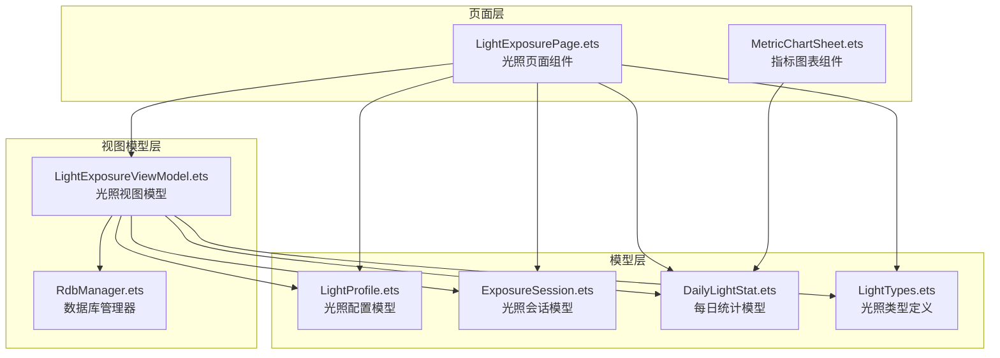
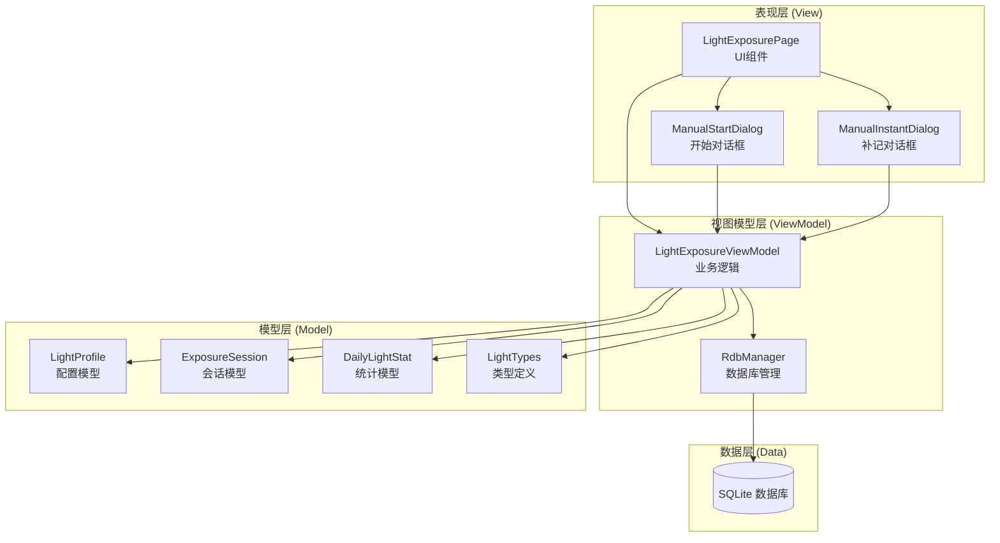
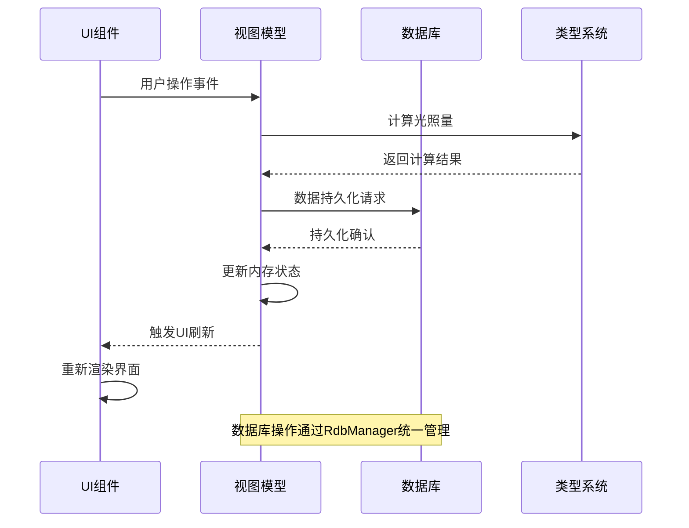
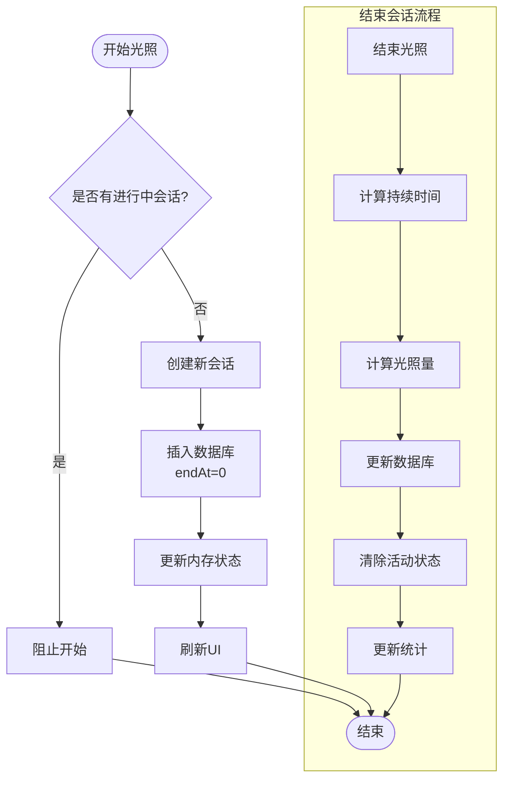
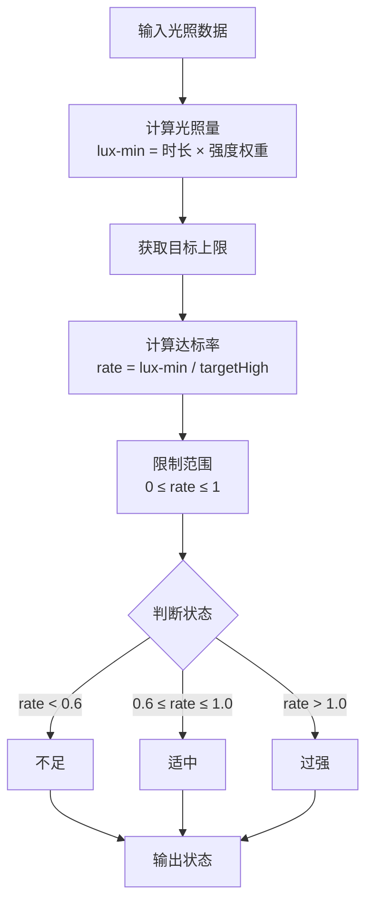
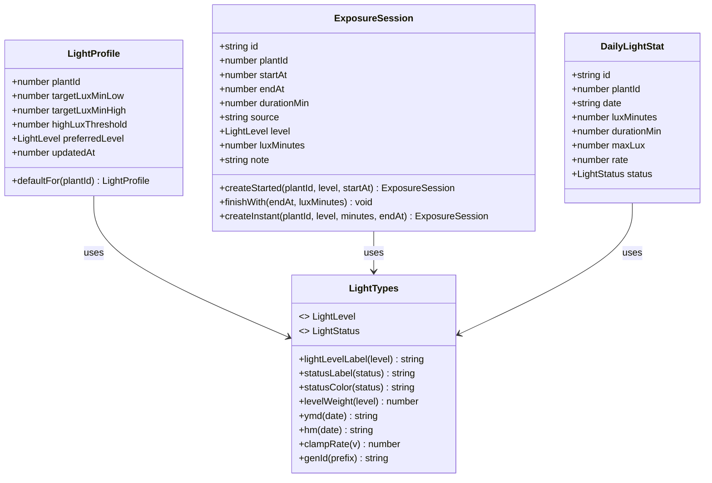
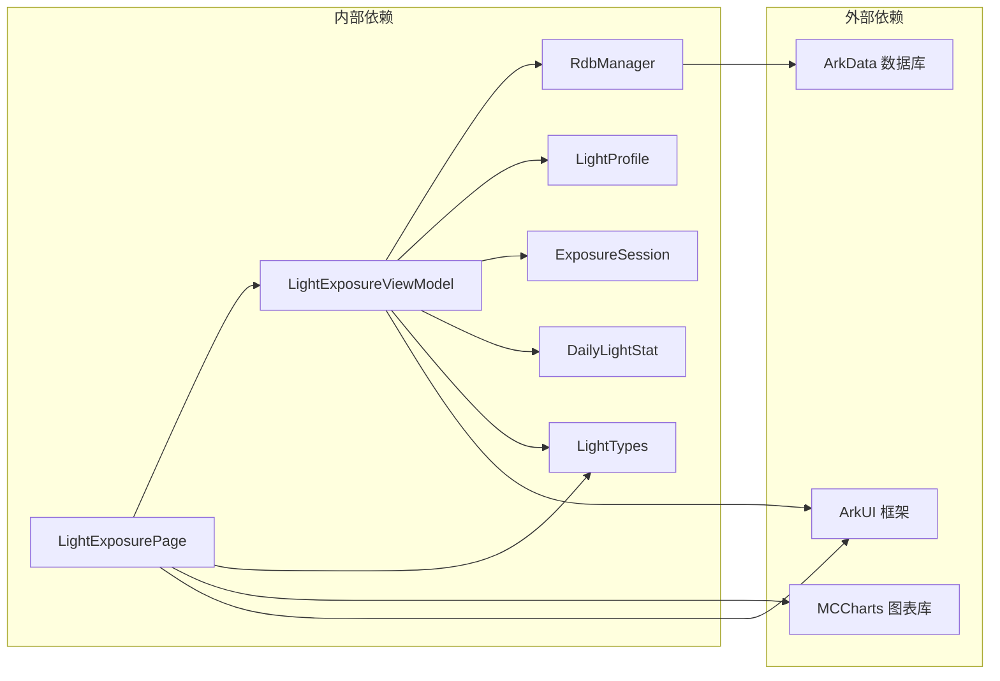

# LightExposurePage光照页面API

<cite>
**本文档引用的文件**
- [LightExposurePage.ets](file://entry/src/main/ets/pages/LightExposurePage.ets)
- [LightExposureViewModel.ets](file://entry/src/main/ets/viewmodel/LightExposureViewModel.ets)
- [LightProfile.ets](file://entry/src/main/ets/model/LightProfile.ets)
- [ExposureSession.ets](file://entry/src/main/ets/model/ExposureSession.ets)
- [DailyLightStat.ets](file://entry/src/main/ets/model/DailyLightStat.ets)
- [LightTypes.ets](file://entry/src/main/ets/model/LightTypes.ets)
- [RdbManager.ets](file://entry/src/main/ets/viewmodel/RdbManager.ets)
- [MetricChartSheet.ets](file://entry/src/main/ets/view/MetricChartSheet.ets)
</cite>

## 目录
1. [简介](#简介)
2. [项目结构](#项目结构)
3. [核心组件](#核心组件)
4. [架构概览](#架构概览)
5. [详细组件分析](#详细组件分析)
6. [依赖关系分析](#依赖关系分析)
7. [性能考虑](#性能考虑)
8. [故障排除指南](#故障排除指南)
9. [结论](#结论)

## 简介

LightExposurePage光照页面是PlantDiary应用中的核心功能模块，专注于植物光照管理。该页面提供了完整的光照记录、统计分析和偏好设置功能，包括：

- **实时光照会话管理**：开始/结束光照记录、手动补记功能
- **可视化图表展示**：环形进度图、7日条形图
- **智能统计分析**：当日达标率计算、光照状态判断
- **个性化偏好配置**：光照强度偏好、目标范围设置
- **数据持久化**：基于ArkData的关系型数据库存储

该系统采用MVVM架构模式，通过ViewModel统一管理数据状态和业务逻辑，确保UI与数据的完全分离。

## 项目结构

光照页面相关的文件组织结构如下：

**图表来源**
- [LightExposurePage.ets:1-806](file://entry/src/main/ets/pages/LightExposurePage.ets#L1-L806)
- [LightExposureViewModel.ets:1-554](file://entry/src/main/ets/viewmodel/LightExposureViewModel.ets#L1-L554)

**章节来源**
- [LightExposurePage.ets:1-806](file://entry/src/main/ets/pages/LightExposurePage.ets#L1-L806)
- [LightExposureViewModel.ets:1-554](file://entry/src/main/ets/viewmodel/LightExposureViewModel.ets#L1-L554)

## 核心组件

### 光照页面组件 (LightExposurePage)

LightExposurePage是光照功能的主要UI组件，采用ArkTS的ComponentV2装饰器实现响应式界面。

**主要功能特性：**
- **实时状态监控**：通过定时器每秒刷新光照进度
- **会话管理**：开始/结束光照记录、手动补记
- **历史记录展示**：列表形式展示所有光照会话
- **偏好配置界面**：调整光照目标和强度偏好
- **图表展示**：环形进度图和7日趋势图

**关键UI组件：**
- `RingAndStatus`：显示当日光照达标率和状态
- `ProfileCard`：光照偏好配置面板
- `SevenDaysChart`：7日光照趋势图表
- `ManualStartDialog`：手动开始对话框
- `ManualInstantDialog`：手动补记对话框

### 光照视图模型 (LightExposureViewModel)

LightExposureViewModel是光照功能的核心业务逻辑层，负责数据管理和状态同步。

**核心职责：**
- **数据持久化**：与数据库交互，管理光照配置和会话记录
- **状态管理**：跟踪当前光照会话状态和统计数据
- **计算逻辑**：光照量计算、达标率统计、状态判断
- **实时更新**：通过tick机制驱动UI刷新

**主要数据属性：**
- `sessions`：所有光照会话记录数组
- `dailyStats`：每日统计数据数组
- `profile`：光照配置档案
- `hasActive`：是否存在进行中的会话
- `activeSession`：当前进行中的会话

**章节来源**
- [LightExposurePage.ets:210-806](file://entry/src/main/ets/pages/LightExposurePage.ets#L210-L806)
- [LightExposureViewModel.ets:16-554](file://entry/src/main/ets/viewmodel/LightExposureViewModel.ets#L16-L554)

## 架构概览

光照页面采用清晰的分层架构设计，确保各层职责明确、耦合度低。

**图表来源**
- [LightExposurePage.ets:5-227](file://entry/src/main/ets/pages/LightExposurePage.ets#L5-L227)
- [LightExposureViewModel.ets:16-36](file://entry/src/main/ets/viewmodel/LightExposureViewModel.ets#L16-L36)
- [RdbManager.ets:4-296](file://entry/src/main/ets/viewmodel/RdbManager.ets#L4-L296)

### 数据流架构

**图表来源**
- [LightExposureViewModel.ets:129-220](file://entry/src/main/ets/viewmodel/LightExposureViewModel.ets#L129-L220)
- [RdbManager.ets:27-170](file://entry/src/main/ets/viewmodel/RdbManager.ets#L27-L170)

**章节来源**
- [LightExposureViewModel.ets:43-113](file://entry/src/main/ets/viewmodel/LightExposureViewModel.ets#L43-L113)
- [RdbManager.ets:105-129](file://entry/src/main/ets/viewmodel/RdbManager.ets#L105-L129)

## 详细组件分析

### 光照会话管理

光照会话管理是系统的核心功能，支持两种记录模式：

#### 开始/结束模式

**图表来源**
- [LightExposureViewModel.ets:129-192](file://entry/src/main/ets/viewmodel/LightExposureViewModel.ets#L129-L192)

#### 即时记录模式
即时记录允许用户直接输入光照时长，无需开始/结束流程：

**章节来源**
- [LightExposureViewModel.ets:200-220](file://entry/src/main/ets/viewmodel/LightExposureViewModel.ets#L200-L220)
- [ExposureSession.ets:64-82](file://entry/src/main/ets/model/ExposureSession.ets#L64-L82)

### 统计分析算法

系统实现了完整的光照数据分析功能，包括达标率计算和状态判断。

#### 达标率计算流程

**图表来源**
- [LightExposureViewModel.ets:372-385](file://entry/src/main/ets/viewmodel/LightExposureViewModel.ets#L372-L385)
- [LightTypes.ets:107-111](file://entry/src/main/ets/model/LightTypes.ets#L107-L111)

#### 7日趋势分析
系统提供7日光照趋势分析，支持实时数据更新：

**章节来源**
- [LightExposureViewModel.ets:451-506](file://entry/src/main/ets/viewmodel/LightExposureViewModel.ets#L451-L506)
- [LightExposurePage.ets:705-750](file://entry/src/main/ets/pages/LightExposurePage.ets#L705-L750)

### 偏好配置系统

光照偏好配置允许用户根据植物需求调整光照管理策略：

#### 偏好级别映射
| 偏好级别 | 目标下限 | 目标上限 | 强度权重 |
|---------|---------|---------|---------|
| 弱光 | < 10,000 lux-min | < 15,000 lux-min | 1.0 |
| 中光 | ≥ 10,000 lux-min | ≥ 20,000 lux-min | 1.5 |
| 强光 | ≥ 15,000 lux-min | ≥ 26,000 lux-min | 2.0 |

**章节来源**
- [LightExposureViewModel.ets:515-552](file://entry/src/main/ets/viewmodel/LightExposureViewModel.ets#L515-L552)
- [LightProfile.ets:14-18](file://entry/src/main/ets/model/LightProfile.ets#L14-L18)

### 数据模型设计

系统采用标准化的数据模型设计，确保数据一致性和可扩展性。

**图表来源**
- [LightProfile.ets:11-41](file://entry/src/main/ets/model/LightProfile.ets#L11-L41)
- [ExposureSession.ets:14-84](file://entry/src/main/ets/model/ExposureSession.ets#L14-L84)
- [DailyLightStat.ets:11-30](file://entry/src/main/ets/model/DailyLightStat.ets#L11-L30)
- [LightTypes.ets:5-124](file://entry/src/main/ets/model/LightTypes.ets#L5-L124)

**章节来源**
- [LightProfile.ets:1-41](file://entry/src/main/ets/model/LightProfile.ets#L1-L41)
- [ExposureSession.ets:1-84](file://entry/src/main/ets/model/ExposureSession.ets#L1-L84)
- [DailyLightStat.ets:1-30](file://entry/src/main/ets/model/DailyLightStat.ets#L1-L30)

## 依赖关系分析

光照页面的依赖关系清晰明确，遵循单一职责原则：

**图表来源**
- [LightExposurePage.ets:5-10](file://entry/src/main/ets/pages/LightExposurePage.ets#L5-L10)
- [LightExposureViewModel.ets:5-10](file://entry/src/main/ets/viewmodel/LightExposureViewModel.ets#L5-L10)
- [RdbManager.ets:1-2](file://entry/src/main/ets/viewmodel/RdbManager.ets#L1-L2)

### 数据库设计

系统使用SQLite数据库存储光照相关数据，采用关系型数据模型：

**光照配置表 (light_profile)**
| 字段名 | 类型 | 约束 | 描述 |
|--------|------|------|------|
| plantId | INTEGER | PRIMARY KEY | 植物ID |
| targetLuxMinLow | INTEGER | NOT NULL | 目标下限 |
| targetLuxMinHigh | INTEGER | NOT NULL | 目标上限 |
| preferredLevel | INTEGER | NOT NULL | 偏好级别 |
| updatedAt | INTEGER | NOT NULL | 更新时间 |

**光照会话表 (exposure_session)**
| 字段名 | 类型 | 约束 | 描述 |
|--------|------|------|------|
| id | TEXT | PRIMARY KEY | 会话ID |
| plantId | INTEGER | NOT NULL | 植物ID |
| startAt | INTEGER | NOT NULL | 开始时间 |
| endAt | INTEGER | DEFAULT 0 | 结束时间 |
| durationMin | INTEGER | DEFAULT 0 | 持续时间(分钟) |
| level | INTEGER | NOT NULL | 光照级别 |
| luxMinutes | INTEGER | DEFAULT 0 | 等效光照量 |
| note | TEXT |  | 备注 |

**章节来源**
- [RdbManager.ets:108-129](file://entry/src/main/ets/viewmodel/RdbManager.ets#L108-L129)

## 性能考虑

光照页面在设计时充分考虑了性能优化：

### 实时更新机制
- **定时刷新**：每1秒更新一次UI，确保光照进度实时显示
- **增量计算**：只更新受影响的统计数据，避免全量重算
- **内存优化**：使用响应式属性减少不必要的重渲染

### 数据访问优化
- **索引设计**：为常用查询字段建立索引
- **批量操作**：支持批量数据处理
- **缓存策略**：合理使用AppStorage缓存状态

### 内存管理
- **对象池**：复用UI组件对象
- **垃圾回收**：及时释放不再使用的资源
- **异步处理**：避免阻塞主线程

## 故障排除指南

### 常见问题及解决方案

**问题1：光照会话无法正常开始**
- 检查是否存在进行中的会话
- 验证数据库连接状态
- 确认AppStorage状态同步

**问题2：统计数据不准确**
- 检查光照量计算公式
- 验证目标上限设置
- 确认时间戳转换正确性

**问题3：图表显示异常**
- 检查数据源完整性
- 验证颜色映射配置
- 确认图表库版本兼容性

### 调试工具

系统提供了完善的调试和监控功能：

**日志记录**
- 关键操作日志
- 错误信息记录
- 性能指标监控

**状态检查**
- 数据库状态验证
- 内存使用情况
- 网络连接状态

**章节来源**
- [LightExposureViewModel.ets:227-251](file://entry/src/main/ets/viewmodel/LightExposureViewModel.ets#L227-L251)
- [RdbManager.ets:277-294](file://entry/src/main/ets/viewmodel/RdbManager.ets#L277-L294)

## 结论

LightExposurePage光照页面API设计完整、架构清晰，具有以下特点：

**技术优势：**
- 采用MVVM架构，职责分离明确
- 数据持久化设计合理，支持离线使用
- 实时更新机制保证用户体验
- 完善的错误处理和恢复机制

**功能完整性：**
- 覆盖光照管理的全流程需求
- 提供丰富的统计分析功能
- 支持个性化配置和偏好设置
- 具备良好的扩展性和维护性

**最佳实践：**
- 遵循响应式编程范式
- 采用类型安全的设计
- 实现数据驱动的UI更新
- 提供完善的API文档和示例

该API为植物光照管理提供了专业、可靠的技术解决方案，能够满足不同用户群体的需求。