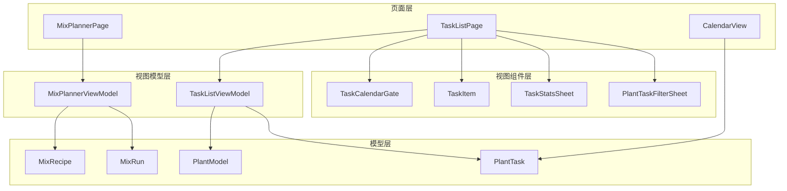
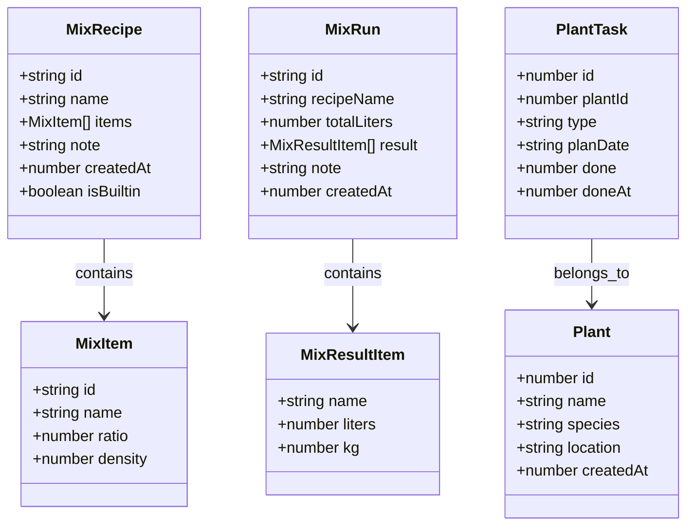
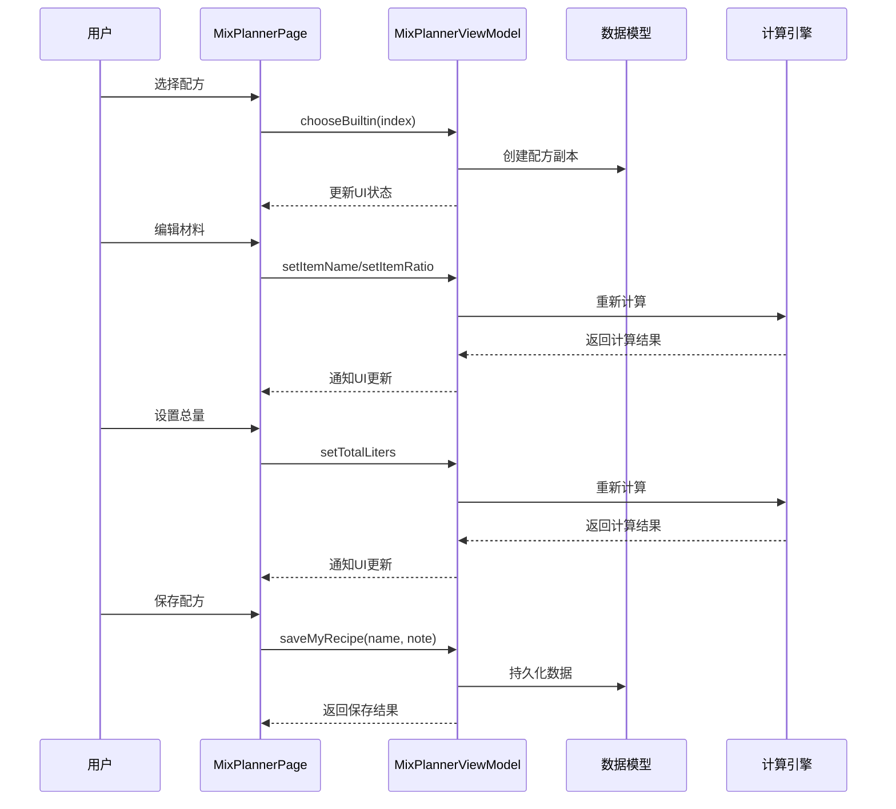
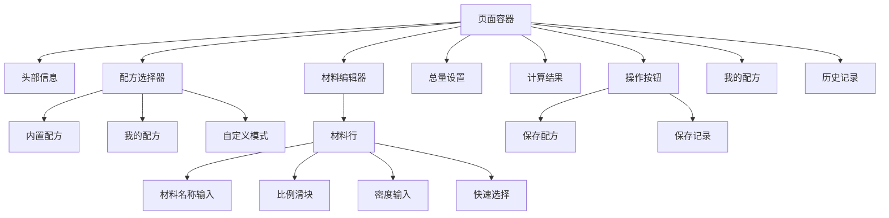
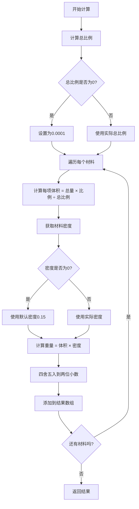
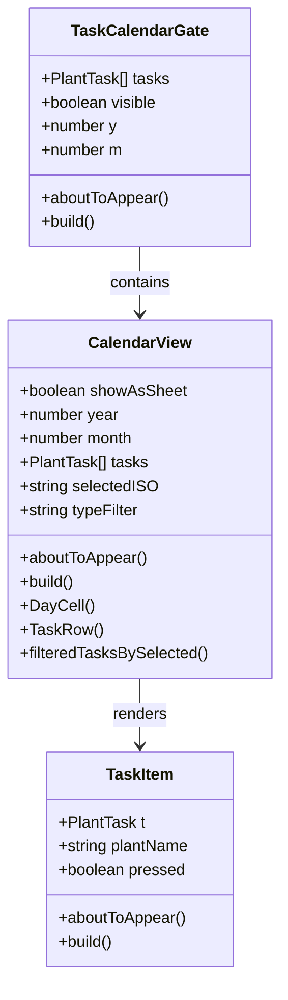
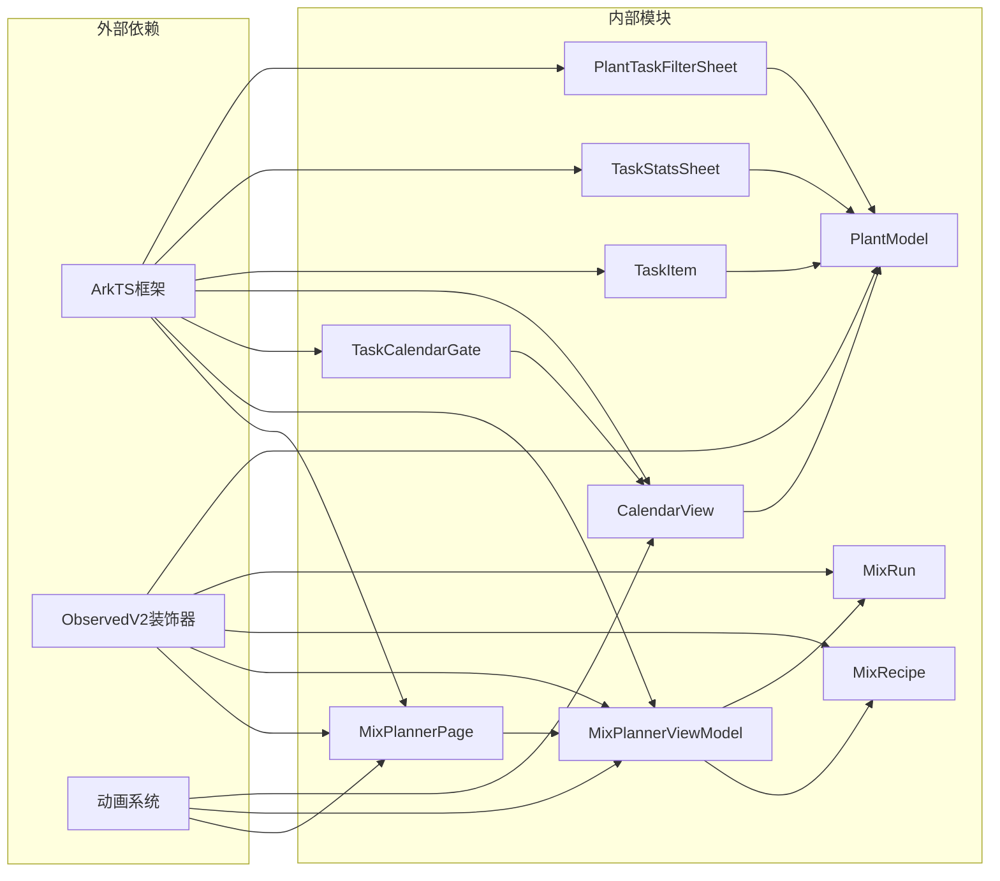

# MixPlannerPage混合计划API

<cite>
**本文档引用的文件**
- [MixPlannerPage.ets](file://entry/src/main/ets/pages/MixPlannerPage.ets)
- [MixPlannerViewModel.ets](file://entry/src/main/ets/viewmodel/MixPlannerViewModel.ets)
- [MixRecipe.ets](file://entry/src/main/ets/model/MixRecipe.ets)
- [MixRun.ets](file://entry/src/main/ets/model/MixRun.ets)
- [PlantModel.ets](file://entry/src/main/ets/model/PlantModel.ets)
- [TaskCalendarGate.ets](file://entry/src/main/ets/view/TaskCalendarGate.ets)
- [CalendarView.ets](file://entry/src/main/ets/view/CalendarView.ets)
- [TaskItem.ets](file://entry/src/main/ets/view/TaskItem.ets)
- [TaskStatsSheet.ets](file://entry/src/main/ets/view/TaskStatsSheet.ets)
- [PlantTaskFilterSheet.ets](file://entry/src/main/ets/view/PlantTaskFilterSheet.ets)
- [TaskListPage.ets](file://entry/src/main/ets/pages/TaskListPage.ets)
</cite>

## 目录
1. [简介](#简介)
2. [项目结构](#项目结构)
3. [核心组件](#核心组件)
4. [架构概览](#架构概览)
5. [详细组件分析](#详细组件分析)
6. [依赖关系分析](#依赖关系分析)
7. [性能考虑](#性能考虑)
8. [故障排除指南](#故障排除指南)
9. [结论](#结论)

## 简介

MixPlannerPage是一个专为植物养护设计的混合计划页面，提供了完整的养护任务混合规划、时间安排和资源分配功能。该系统支持多种养护任务的智能组合，包括浇水、施肥、修剪等，通过直观的界面让用户能够轻松创建、调整和执行个性化的养护计划。

系统采用MVVM架构模式，将视图逻辑与业务逻辑分离，确保了代码的可维护性和扩展性。页面集成了实时计算引擎，能够根据用户输入的参数动态计算最佳的资源分配方案，并提供冲突检测机制来避免时间安排上的冲突。

## 项目结构

项目采用模块化组织方式，主要分为以下几个层次：

**图表来源**
- [MixPlannerPage.ets:1-366](file://entry/src/main/ets/pages/MixPlannerPage.ets#L1-L366)
- [MixPlannerViewModel.ets:1-228](file://entry/src/main/ets/viewmodel/MixPlannerViewModel.ets#L1-L228)

**章节来源**
- [MixPlannerPage.ets:1-366](file://entry/src/main/ets/pages/MixPlannerPage.ets#L1-L366)
- [MixPlannerViewModel.ets:1-228](file://entry/src/main/ets/viewmodel/MixPlannerViewModel.ets#L1-L228)

## 核心组件

### 主要功能模块

系统包含以下核心功能模块：

1. **配方管理模块** - 支持内置配方、自定义配方和用户配方的管理
2. **材料编辑模块** - 提供直观的材料添加、删除和属性编辑功能
3. **计算引擎模块** - 实时计算混合比例和资源分配
4. **历史记录模块** - 记录和管理调配历史
5. **任务规划模块** - 集成养护任务的时间安排和冲突检测

### 数据模型

系统采用清晰的数据模型设计：

**图表来源**
- [MixRecipe.ets:1-33](file://entry/src/main/ets/model/MixRecipe.ets#L1-L33)
- [MixRun.ets:1-31](file://entry/src/main/ets/model/MixRun.ets#L1-L31)
- [PlantModel.ets:1-166](file://entry/src/main/ets/model/PlantModel.ets#L1-L166)

**章节来源**
- [MixRecipe.ets:1-33](file://entry/src/main/ets/model/MixRecipe.ets#L1-L33)
- [MixRun.ets:1-31](file://entry/src/main/ets/model/MixRun.ets#L1-L31)
- [PlantModel.ets:1-166](file://entry/src/main/ets/model/PlantModel.ets#L1-L166)

## 架构概览

系统采用MVVM架构模式，实现了清晰的关注点分离：

**图表来源**
- [MixPlannerPage.ets:39-90](file://entry/src/main/ets/pages/MixPlannerPage.ets#L39-L90)
- [MixPlannerViewModel.ets:79-226](file://entry/src/main/ets/viewmodel/MixPlannerViewModel.ets#L79-L226)

系统架构特点：

1. **响应式更新** - 使用`@ObservedV2`装饰器实现数据驱动的UI更新
2. **数据验证** - 在输入阶段进行边界检查和格式验证
3. **实时计算** - 计算结果随用户输入即时更新
4. **持久化存储** - 支持配方和历史记录的长期保存

**章节来源**
- [MixPlannerPage.ets:39-90](file://entry/src/main/ets/pages/MixPlannerPage.ets#L39-L90)
- [MixPlannerViewModel.ets:17-228](file://entry/src/main/ets/viewmodel/MixPlannerViewModel.ets#L17-L228)

## 详细组件分析

### MixPlannerPage页面组件

MixPlannerPage是整个混合计划系统的核心页面组件，采用了Builder模式来构建UI结构：

#### 页面布局结构

**图表来源**
- [MixPlannerPage.ets:62-366](file://entry/src/main/ets/pages/MixPlannerPage.ets#L62-L366)

#### 核心交互流程

页面实现了完整的配方制作工作流：

1. **配方选择** - 支持内置配方、用户配方和自定义配方
2. **材料编辑** - 动态添加、删除和修改材料属性
3. **参数设置** - 调整总量和密度参数
4. **结果预览** - 实时显示计算结果
5. **保存操作** - 保存为配方模板或记录本次操作

**章节来源**
- [MixPlannerPage.ets:108-366](file://entry/src/main/ets/pages/MixPlannerPage.ets#L108-L366)

### MixPlannerViewModel业务逻辑

MixPlannerViewModel是系统的业务逻辑核心，负责处理所有数据操作和计算逻辑：

#### 数据管理方法

| 方法名 | 参数 | 功能描述 | 返回值 |
|--------|------|----------|--------|
| `chooseBuiltin` | `index: number` | 选择内置配方 | `void` |
| `addItem` | 无 | 添加新材料项 | `void` |
| `removeItem` | `id: string` | 删除指定材料 | `void` |
| `setItemName` | `id: string, name: string` | 修改材料名称 | `void` |
| `setItemRatio` | `id: string, ratio: number` | 设置材料比例 | `void` |
| `setItemDensity` | `id: string, density: number` | 设置材料密度 | `void` |
| `setTotalLiters` | `v: number` | 设置总容量 | `void` |
| `compute` | 无 | 执行计算 | `Array<MixResultItem>` |
| `saveMyRecipe` | `name: string, note: string` | 保存为配方 | `MixRecipe \| undefined` |
| `saveRun` | `note: string` | 保存运行记录 | `MixRun` |

#### 计算算法实现

计算引擎采用加权分配算法：

**图表来源**
- [MixPlannerViewModel.ets:169-181](file://entry/src/main/ets/viewmodel/MixPlannerViewModel.ets#L169-L181)

**章节来源**
- [MixPlannerViewModel.ets:17-228](file://entry/src/main/ets/viewmodel/MixPlannerViewModel.ets#L17-L228)

### 任务规划集成

系统集成了完整的任务规划功能，支持养护任务的时间安排和冲突检测：

#### 任务日历组件

**图表来源**
- [TaskCalendarGate.ets:1-81](file://entry/src/main/ets/view/TaskCalendarGate.ets#L1-L81)
- [CalendarView.ets:1-566](file://entry/src/main/ets/view/CalendarView.ets#L1-L566)
- [TaskItem.ets:1-67](file://entry/src/main/ets/view/TaskItem.ets#L1-L67)

#### 任务过滤和统计

系统提供了强大的任务管理和分析功能：

| 组件 | 功能特性 | 使用场景 |
|------|----------|----------|
| PlantTaskFilterSheet | 多维度筛选、排序、关键词搜索 | 任务查找和管理 |
| TaskStatsSheet | 完成率趋势、类型占比分析 | 任务执行情况统计 |
| TaskListPage | 任务列表视图、日历视图切换 | 日常任务管理 |

**章节来源**
- [TaskCalendarGate.ets:1-81](file://entry/src/main/ets/view/TaskCalendarGate.ets#L1-L81)
- [CalendarView.ets:1-566](file://entry/src/main/ets/view/CalendarView.ets#L1-L566)
- [TaskStatsSheet.ets:1-273](file://entry/src/main/ets/view/TaskStatsSheet.ets#L1-L273)
- [PlantTaskFilterSheet.ets:1-374](file://entry/src/main/ets/view/PlantTaskFilterSheet.ets#L1-L374)
- [TaskListPage.ets:1-200](file://entry/src/main/ets/pages/TaskListPage.ets#L1-L200)

## 依赖关系分析

系统采用模块化设计，各组件间依赖关系清晰：

**图表来源**
- [MixPlannerPage.ets:1-366](file://entry/src/main/ets/pages/MixPlannerPage.ets#L1-L366)
- [MixPlannerViewModel.ets:1-228](file://entry/src/main/ets/viewmodel/MixPlannerViewModel.ets#L1-L228)

**章节来源**
- [MixPlannerPage.ets:1-366](file://entry/src/main/ets/pages/MixPlannerPage.ets#L1-L366)
- [MixPlannerViewModel.ets:1-228](file://entry/src/main/ets/viewmodel/MixPlannerViewModel.ets#L1-L228)

## 性能考虑

系统在设计时充分考虑了性能优化：

### 响应式更新策略
- 使用`@ObservedV2`装饰器实现细粒度的状态监听
- 避免不必要的UI重绘，只更新受影响的组件
- 实现懒加载机制，延迟初始化不常用的组件

### 计算优化
- 实时计算采用增量更新策略，只重新计算受影响的部分
- 使用缓存机制存储中间计算结果
- 优化循环结构，减少重复计算

### 内存管理
- 合理使用对象池，避免频繁的对象创建和销毁
- 及时清理不再使用的事件监听器
- 实现弱引用机制防止内存泄漏

## 故障排除指南

### 常见问题及解决方案

#### 配方计算异常
**问题症状**：计算结果显示为0或异常值
**可能原因**：
- 材料比例设置过小（小于0.1）
- 总量设置为0或超出范围（1-200L）
- 密度设置为负数

**解决步骤**：
1. 检查所有材料的比例值是否大于等于0.1
2. 确认总量在有效范围内
3. 验证密度值在合理范围内（0-3）

#### UI更新延迟
**问题症状**：修改参数后UI没有及时更新
**解决方法**：
- 确保使用正确的setter方法更新状态
- 检查`@ObservedV2`装饰器是否正确应用
- 验证数据绑定是否正确建立

#### 性能问题
**症状表现**：页面响应缓慢或卡顿
**优化建议**：
- 减少不必要的状态更新
- 使用防抖机制处理高频输入
- 优化列表渲染，使用合适的key值

**章节来源**
- [MixPlannerViewModel.ets:124-159](file://entry/src/main/ets/viewmodel/MixPlannerViewModel.ets#L124-L159)
- [MixPlannerPage.ets:179-230](file://entry/src/main/ets/pages/MixPlannerPage.ets#L179-L230)

## 结论

MixPlannerPage混合计划系统通过精心设计的架构和完善的业务逻辑，为植物养护提供了强大而易用的工具。系统的主要优势包括：

1. **直观的用户体验** - 采用Builder模式构建清晰的UI结构
2. **强大的计算能力** - 实时的混合配方计算和资源优化
3. **灵活的配置选项** - 支持多种配方类型和自定义参数
4. **完整的任务管理** - 集成日历视图和任务规划功能
5. **良好的扩展性** - 模块化设计便于功能扩展和维护

系统在性能优化和错误处理方面也做了充分考虑，能够为用户提供流畅稳定的使用体验。通过合理的架构设计和代码组织，该系统为植物养护管理提供了一个可靠的数字化解决方案。