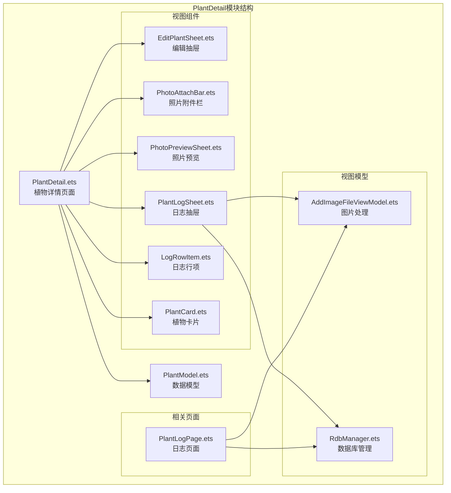
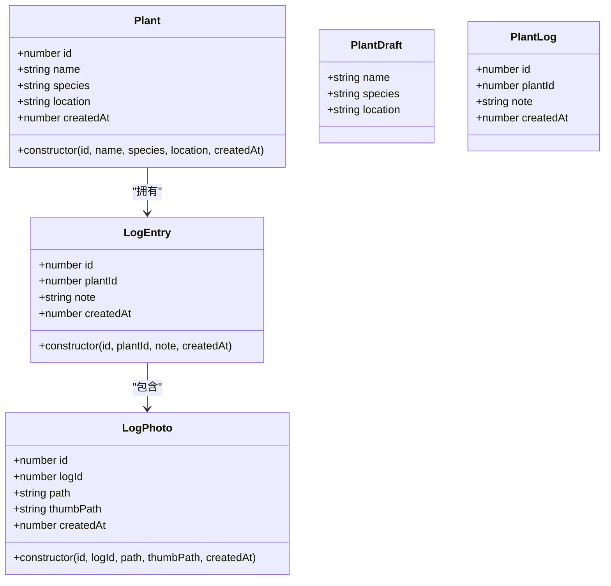
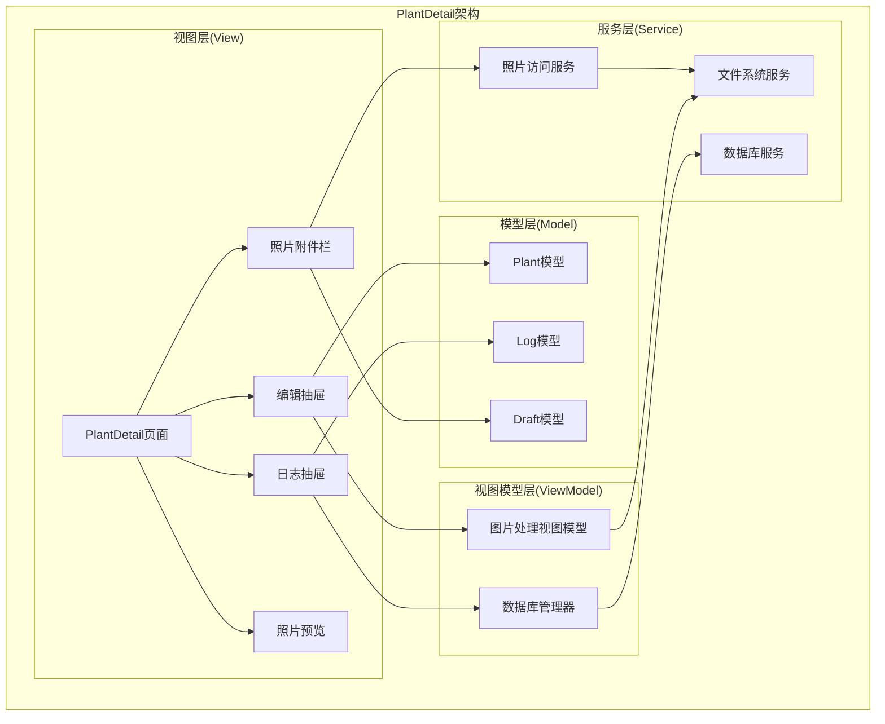
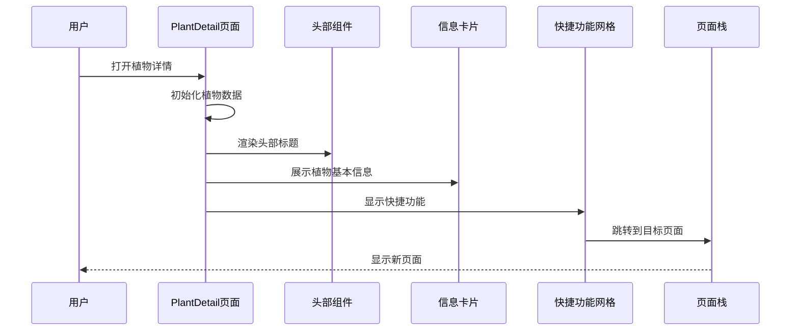
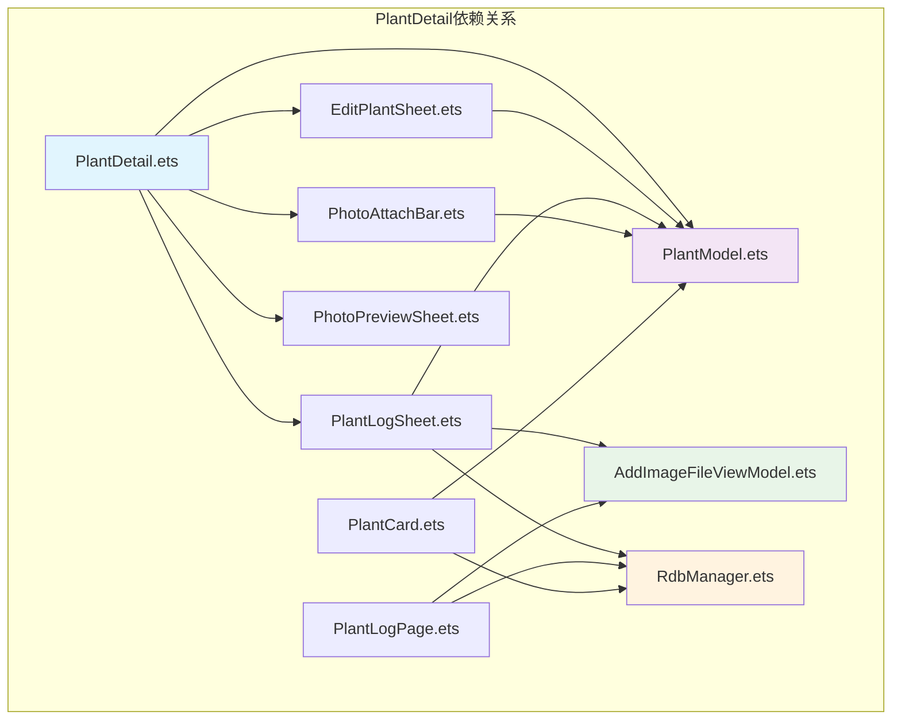

# PlantDetail植物详情API

<cite>
**本文档引用的文件**
- [PlantDetail.ets](file://entry/src/main/ets/pages/PlantDetail.ets)
- [PlantModel.ets](file://entry/src/main/ets/model/PlantModel.ets)
- [EditPlantSheet.ets](file://entry/src/main/ets/view/EditPlantSheet.ets)
- [PhotoAttachBar.ets](file://entry/src/main/ets/view/PhotoAttachBar.ets)
- [PhotoPreviewSheet.ets](file://entry/src/main/ets/view/PhotoPreviewSheet.ets)
- [PlantLogSheet.ets](file://entry/src/main/ets/view/PlantLogSheet.ets)
- [LogRowItem.ets](file://entry/src/main/ets/view/LogRowItem.ets)
- [AddImageFileViewModel.ets](file://entry/src/main/ets/viewmodel/AddImageFileViewModel.ets)
- [PlantLogPage.ets](file://entry/src/main/ets/pages/PlantLogPage.ets)
- [RdbManager.ets](file://entry/src/main/ets/viewmodel/RdbManager.ets)
- [PlantCard.ets](file://entry/src/main/ets/view/PlantCard.ets)
</cite>

## 目录
1. [简介](#简介)
2. [项目结构](#项目结构)
3. [核心组件](#核心组件)
4. [架构概览](#架构概览)
5. [详细组件分析](#详细组件分析)
6. [依赖关系分析](#依赖关系分析)
7. [性能考虑](#性能考虑)
8. [故障排除指南](#故障排除指南)
9. [结论](#结论)

## 简介

PlantDetail植物详情页面是PlantDiary应用中的核心功能模块，为用户提供植物信息的完整展示、编辑和历史记录管理能力。该模块采用ArkTS框架开发，实现了响应式UI设计和数据绑定机制。

本API文档详细说明了植物详情页面的所有接口，包括：
- 植物信息展示组件API
- 编辑表单组件API  
- 历史日志列表组件API
- 照片展示和管理功能
- 数据查询和更新处理接口
- 状态管理和用户交互处理

## 项目结构

PlantDetail模块位于entry/src/main/ets/pages目录下，主要包含以下文件：

**图表来源**
- [PlantDetail.ets:1-136](file://entry/src/main/ets/pages/PlantDetail.ets#L1-L136)
- [PlantModel.ets:1-166](file://entry/src/main/ets/model/PlantModel.ets#L1-L166)

**章节来源**
- [PlantDetail.ets:1-136](file://entry/src/main/ets/pages/PlantDetail.ets#L1-L136)
- [PlantModel.ets:1-166](file://entry/src/main/ets/model/PlantModel.ets#L1-L166)

## 核心组件

### 植物详情页面组件

PlantDetail页面是整个植物详情功能的核心容器，负责组织和协调各个子组件的工作。

**主要特性：**
- 响应式布局设计，支持动态尺寸调整
- 渐变背景和阴影效果增强视觉体验
- 导航栈集成，支持页面间跳转
- 动态数据绑定，实时更新植物信息

**关键属性：**
- `@Local plant: Plant | undefined` - 植物数据对象
- `@Param @Require pageStack: NavPathStack` - 页面导航栈
- `@Local headerHeight: number` - 头部高度计算

**章节来源**
- [PlantDetail.ets:1-136](file://entry/src/main/ets/pages/PlantDetail.ets#L1-L136)

### 数据模型系统

PlantModel提供了完整的数据结构定义，确保前后端数据的一致性和类型安全。

**核心数据模型：**

**图表来源**
- [PlantModel.ets:6-21](file://entry/src/main/ets/model/PlantModel.ets#L6-L21)
- [PlantModel.ets:62-90](file://entry/src/main/ets/model/PlantModel.ets#L62-L90)

**章节来源**
- [PlantModel.ets:1-166](file://entry/src/main/ets/model/PlantModel.ets#L1-L166)

## 架构概览

PlantDetail采用MVVM架构模式，通过组件化设计实现功能模块的解耦和复用。

**图表来源**
- [PlantDetail.ets:3-36](file://entry/src/main/ets/pages/PlantDetail.ets#L3-L36)
- [EditPlantSheet.ets:5-16](file://entry/src/main/ets/view/EditPlantSheet.ets#L5-L16)
- [AddImageFileViewModel.ets:14-27](file://entry/src/main/ets/viewmodel/AddImageFileViewModel.ets#L14-L27)

## 详细组件分析

### 植物详情页面组件

#### 组件结构

**图表来源**
- [PlantDetail.ets:8-36](file://entry/src/main/ets/pages/PlantDetail.ets#L8-L36)
- [PlantDetail.ets:38-135](file://entry/src/main/ets/pages/PlantDetail.ets#L38-L135)

#### 快捷功能网格

快捷功能网格提供了一组常用操作的快速入口：

| 功能图标 | 名称 | 目标页面 | 参数传递 |
|---------|------|----------|----------|
| 🌱 | 养护日志 | PlantLogPage | 植物ID |
| ☀️ | 光照记录 | LightExposurePage | 整个Plant对象 |
| 📊 | 生长指标 | GrowthIndicatorPage | 整个Plant对象 |
| 📸 | 成长对比 | GrowthComparePage | 整个Plant对象 |
| 💧 | 浇水估算 | WaterEstimatorPage | 植物ID |
| 🔄 | 应急与轮换 | EmergencyAndRotatePage | 植物ID |

**章节来源**
- [PlantDetail.ets:70-115](file://entry/src/main/ets/pages/PlantDetail.ets#L70-L115)

### 编辑抽屉组件

EditPlantSheet提供了植物信息的编辑和管理功能。

#### 组件API

**参数属性：**
- `@Param @Require title: string` - 抽屉标题
- `@Param @Require draft: PlantDraft` - 编辑草稿对象
- `@Param @Require editingId: number` - 编辑的植物ID
- `@Event onSave: () => void` - 保存事件
- `@Event onDelete: () => void` - 删除事件
- `@Event onClose: () => void` - 关闭事件

**功能特性：**
- 支持植物名称、品种、位置的编辑
- 周期任务快捷创建
- 模板管理入口
- 实时键盘适配
- 平滑动画过渡

**章节来源**
- [EditPlantSheet.ets:5-16](file://entry/src/main/ets/view/EditPlantSheet.ets#L5-L16)
- [EditPlantSheet.ets:37-207](file://entry/src/main/ets/view/EditPlantSheet.ets#L37-L207)

### 照片附件栏组件

PhotoAttachBar专门用于处理日志照片的展示和管理。

#### 组件API

**参数属性：**
- `@Param @Require photos: Array<LogPhoto>` - 照片数组
- `@Event onPick: () => void` - 选择照片事件
- `@Event onDeleteAsk: (photoId: number) => void` - 删除确认事件
- `@Event onPreview: (filePath: string) => void` - 预览事件

**界面元素：**
- 照片标题显示
- 添加照片按钮
- 横向滚动照片缩略图
- 删除操作按钮

**章节来源**
- [PhotoAttachBar.ets:18-99](file://entry/src/main/ets/view/PhotoAttachBar.ets#L18-L99)

### 照片预览组件

PhotoPreviewSheet提供全屏照片浏览和管理功能。

#### 组件API

**参数属性：**
- `@Param @Require files: Array<string>` - 文件路径数组
- `@Param @Require startIndex: number` - 起始索引
- `@Event onDelete: (index: number) => void` - 删除事件
- `@Event onClose: () => void` - 关闭事件

**交互功能：**
- 左右滑动切换照片
- 单击缩放功能
- 删除确认对话框
- 计数显示

**章节来源**
- [PhotoPreviewSheet.ets:2-16](file://entry/src/main/ets/view/PhotoPreviewSheet.ets#L2-L16)
- [PhotoPreviewSheet.ets:102-222](file://entry/src/main/ets/view/PhotoPreviewSheet.ets#L102-L222)

### 日志抽屉组件

PlantLogSheet实现了完整的日志管理和照片附件功能。

#### 组件API

**参数属性：**
- `@Param @Require plantName: string` - 植物名称
- `@Param @Require logs: Array<PlantLog>` - 日志数组
- `@Param @Require photos: Array<LogPhoto>` - 照片数组
- `@Event onAddLog: (note: string, dateISO: string) => void` - 添加日志事件
- `@Event onDeleteLog: (logId: number) => void` - 删除日志事件
- `@Event onPickPhotos: (logId: number) => void` - 选择照片事件

**核心功能：**
- 日志内容编辑和日期设置
- 日志列表排序和筛选
- 多选删除功能
- 照片附件管理
- 关键词高亮显示

**章节来源**
- [PlantLogSheet.ets:35-50](file://entry/src/main/ets/view/PlantLogSheet.ets#L35-L50)
- [PlantLogSheet.ets:65-283](file://entry/src/main/ets/view/PlantLogSheet.ets#L65-L283)

### 日志行项组件

LogRowItem负责单条日志的展示和交互处理。

#### 组件API

**参数属性：**
- `@Param @Require lg: PlantLog` - 日志对象
- `@Param @Require selectMode: boolean` - 选择模式
- `@Param @Require photos: Array<LogPhoto>` - 照片数组
- `@Param @Require logItemPhotos: Array<LogPhoto>` - 当前日志的照片

**交互事件：**
- `@Event onPickPhotos: (logId: number) => void` - 选择照片
- `@Event onCapturePhoto: (logId: number) => void` - 拍照
- `@Event onDeleteLog: (logId: number) => void` - 删除日志
- `@Event onDeletePhoto: (photoId: number) => void` - 删除照片

**章节来源**
- [LogRowItem.ets:3-18](file://entry/src/main/ets/view/LogRowItem.ets#L3-L18)
- [LogRowItem.ets:72-134](file://entry/src/main/ets/view/LogRowItem.ets#L72-L134)

## 依赖关系分析

PlantDetail模块的依赖关系体现了清晰的分层架构：

**图表来源**
- [PlantDetail.ets:1-3](file://entry/src/main/ets/pages/PlantDetail.ets#L1-L3)
- [EditPlantSheet.ets:1-2](file://entry/src/main/ets/view/EditPlantSheet.ets#L1-L2)
- [AddImageFileViewModel.ets:1-7](file://entry/src/main/ets/viewmodel/AddImageFileViewModel.ets#L1-L7)

**章节来源**
- [PlantDetail.ets:1-136](file://entry/src/main/ets/pages/PlantDetail.ets#L1-L136)
- [EditPlantSheet.ets:1-264](file://entry/src/main/ets/view/EditPlantSheet.ets#L1-L264)

## 性能考虑

### 数据加载优化

PlantDetail采用了多种性能优化策略：

1. **懒加载机制**：照片和日志采用按需加载，减少初始渲染时间
2. **缓存策略**：AppStorage用于存储光照状态等高频访问数据
3. **虚拟滚动**：日志列表使用虚拟滚动技术处理大量数据
4. **异步处理**：图片处理和数据库操作采用异步方式

### 内存管理

- 使用`@ObservedV2`装饰器优化响应式数据的内存使用
- 及时释放数据库游标和文件句柄
- 图片资源的生命周期管理

### 网络和IO优化

- 图片压缩和缓存机制
- 批量数据库操作减少IO次数
- 错误处理和重试机制

## 故障排除指南

### 常见问题及解决方案

**植物信息无法显示**
- 检查导航参数传递是否正确
- 验证Plant对象的完整性
- 确认数据库连接状态

**照片加载失败**
- 检查文件路径格式（确保以file://开头）
- 验证文件权限和存在性
- 确认分布式文件目录访问权限

**编辑功能异常**
- 检查PlantDraft对象的状态
- 验证表单数据的合法性
- 确认保存和删除操作的回调函数

**章节来源**
- [PlantDetail.ets:32-35](file://entry/src/main/ets/pages/PlantDetail.ets#L32-L35)
- [AddImageFileViewModel.ets:130-144](file://entry/src/main/ets/viewmodel/AddImageFileViewModel.ets#L130-L144)

## 结论

PlantDetail植物详情API提供了完整的植物信息管理功能，具有以下特点：

**功能完整性**
- 支持植物信息的完整展示和编辑
- 提供历史日志的查看和管理
- 实现照片的上传、预览和删除
- 包含快捷功能导航和状态管理

**架构优势**
- 采用MVVM架构，职责分离清晰
- 组件化设计，易于维护和扩展
- 响应式数据绑定，用户体验良好
- 异步处理机制，性能表现优秀

**最佳实践**
- 遵循数据模型定义，确保类型安全
- 合理使用状态管理，避免不必要的重渲染
- 实施错误处理和用户反馈机制
- 优化性能，提升用户体验

该API为PlantDiary应用提供了坚实的植物详情管理基础，为用户提供了直观、便捷的植物信息管理体验。