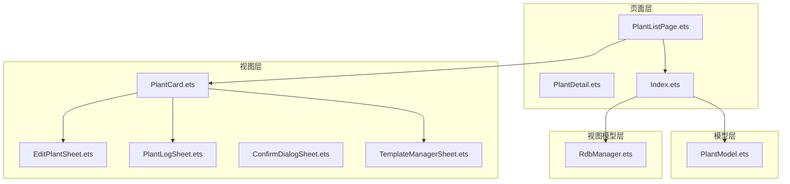
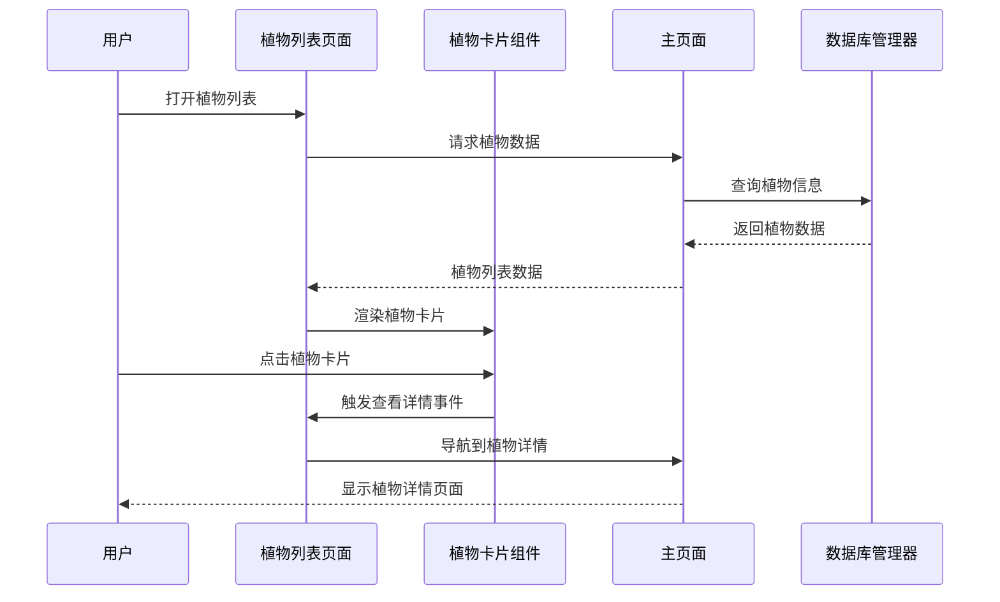
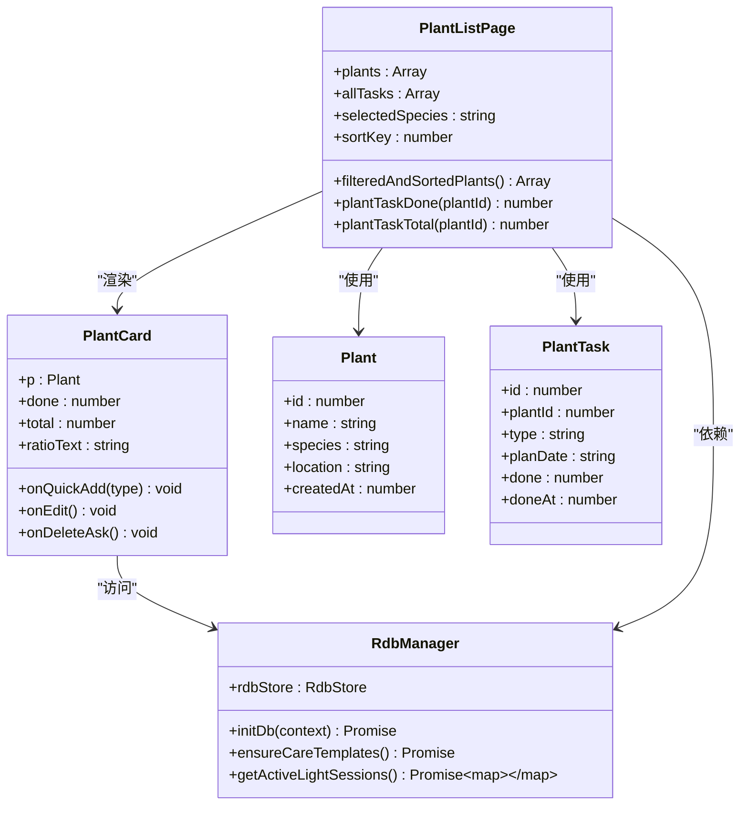

# PlantListPage植物列表API

<cite>
**本文档引用的文件**
- [PlantListPage.ets](file://entry/src/main/ets/pages/PlantListPage.ets)
- [PlantCard.ets](file://entry/src/main/ets/view/PlantCard.ets)
- [PlantModel.ets](file://entry/src/main/ets/model/PlantModel.ets)
- [RdbManager.ets](file://entry/src/main/ets/viewmodel/RdbManager.ets)
- [Index.ets](file://entry/src/main/ets/pages/Index.ets)
- [PlantDetail.ets](file://entry/src/main/ets/pages/PlantDetail.ets)
- [EditPlantSheet.ets](file://entry/src/main/ets/view/EditPlantSheet.ets)
- [PlantLogSheet.ets](file://entry/src/main/ets/view/PlantLogSheet.ets)
- [ConfirmDialogSheet.ets](file://entry/src/main/ets/view/ConfirmDialogSheet.ets)
- [TemplateManagerSheet.ets](file://entry/src/main/ets/view/TemplateManagerSheet.ets)
</cite>

## 目录
1. [简介](#简介)
2. [项目结构](#项目结构)
3. [核心组件](#核心组件)
4. [架构概览](#架构概览)
5. [详细组件分析](#详细组件分析)
6. [依赖关系分析](#依赖关系分析)
7. [性能考虑](#性能考虑)
8. [故障排除指南](#故障排除指南)
9. [结论](#结论)

## 简介

PlantListPage是植物日记应用中的核心植物列表页面，负责展示植物信息、提供搜索过滤功能、支持批量操作，并集成了丰富的植物卡片渲染组件。该页面采用ArkTS框架开发，实现了响应式的植物管理界面，支持多种植物状态显示和快速操作功能。

## 项目结构

PlantListPage位于应用的页面层，与视图组件、模型层和视图模型层协同工作：

**图表来源**
- [PlantListPage.ets:1-228](file://entry/src/main/ets/pages/PlantListPage.ets#L1-L228)
- [PlantCard.ets:1-326](file://entry/src/main/ets/view/PlantCard.ets#L1-L326)
- [Index.ets:1-800](file://entry/src/main/ets/pages/Index.ets#L1-L800)

**章节来源**
- [PlantListPage.ets:1-228](file://entry/src/main/ets/pages/PlantListPage.ets#L1-L228)
- [Index.ets:1-800](file://entry/src/main/ets/pages/Index.ets#L1-L800)

## 核心组件

### PlantListPage 主要特性

PlantListPage作为植物列表的主要容器，提供了以下核心功能：

- **植物数据展示**：基于PlantModel的植物信息渲染
- **搜索过滤**：支持按名称、种类、位置的关键词搜索
- **筛选功能**：按植物种类进行芯片式筛选
- **排序机制**：支持按创建时间、名称、完成率排序
- **批量操作**：统一的植物操作事件处理
- **状态管理**：本地状态管理用于筛选和排序控制

### PlantCard 组件API

PlantCard是植物卡片的核心渲染组件，提供：

- **植物信息展示**：名称、种类、位置、创建时间
- **状态指示**：光照状态、任务完成进度
- **快速操作**：浇水、施肥、修剪等快捷操作
- **导航入口**：日志、指标、模板、应急等功能入口
- **交互反馈**：按钮按压动画效果

**章节来源**
- [PlantListPage.ets:5-228](file://entry/src/main/ets/pages/PlantListPage.ets#L5-L228)
- [PlantCard.ets:7-326](file://entry/src/main/ets/view/PlantCard.ets#L7-L326)

## 架构概览

PlantListPage采用了分层架构设计，实现了清晰的关注点分离：

**图表来源**
- [PlantListPage.ets:116-199](file://entry/src/main/ets/pages/PlantListPage.ets#L116-L199)
- [Index.ets:128-141](file://entry/src/main/ets/pages/Index.ets#L128-L141)
- [RdbManager.ets:27-170](file://entry/src/main/ets/viewmodel/RdbManager.ets#L27-L170)

## 详细组件分析

### PlantListPage API规范

#### 参数定义

| 参数名称 | 类型 | 必填 | 描述 |
|---------|------|------|------|
| plants | Array<Plant> | 是 | 植物数据数组 |
| allTasks | Array<PlantTask> | 是 | 所有植物任务数组 |
| Header | Builder | 否 | 自定义头部组件 |

#### 事件回调

| 事件名称 | 参数 | 描述 |
|---------|------|------|
| onOpenDetail | (p: Plant) => void | 打开植物详情 |
| onQuickAdd | (plantId: number, type: string) => void | 快速添加任务 |
| onEdit | (p: Plant) => void | 编辑植物信息 |
| onDeleteAsk | (plantId: number) => void | 删除确认 |
| onOpenTemplate | (p: Plant) => void | 打开模板页面 |
| onOpenTemplatenew | (pid: number) => void | 创建新模板 |
| onOpenLogs | (p: Plant) => void | 打开日志页面 |
| onOpenWaterEstimator | (p: Plant) => void | 打开水量估算器 |
| onOpenMetrics | (p: Plant) => void | 打开指标页面 |
| onOpenEmergencyAndRotate | (p: Plant) => void | 打开应急与轮换 |
| onOpenMetric | (plantId: number) => void | 打开指标详情 |

#### 私有方法

| 方法名称 | 返回类型 | 描述 |
|---------|----------|------|
| plantTaskDone | (plantId: number) => number | 计算植物完成的任务数量 |
| plantTaskTotal | (plantId: number) => number | 计算植物总任务数量 |
| plantRatePct | (plantId: number) => number | 计算植物任务完成百分比 |
| ratioString | (plantId: number) => string | 返回完成率字符串表示 |
| speciesChips | () => Array<string> | 生成物种筛选芯片列表 |
| filteredAndSortedPlants | () => Array<Plant> | 获取筛选和排序后的植物列表 |

#### 本地状态

| 状态名称 | 类型 | 默认值 | 描述 |
|---------|------|--------|------|
| selectedSpecies | string | '全部' | 当前选中的植物种类 |
| sortKey | number | 0 | 排序方式（0=创建时间, 1=名称, 2=完成率） |

**章节来源**
- [PlantListPage.ets:6-228](file://entry/src/main/ets/pages/PlantListPage.ets#L6-L228)

### PlantCard 组件API

#### 参数定义

| 参数名称 | 类型 | 必填 | 描述 |
|---------|------|------|------|
| p | Plant | 是 | 植物对象 |
| done | number | 是 | 已完成任务数量 |
| total | number | 是 | 总任务数量 |
| ratioText | string | 是 | 完成率文本 |
| onQuickAdd | (type: string) => void | 是 | 快速添加任务事件 |
| onEdit | () => void | 是 | 编辑事件 |
| onDeleteAsk | () => void | 是 | 删除确认事件 |
| onOpenLogs | () => void | 是 | 打开日志事件 |
| onOpenWaterEstimator | (p: Plant) => void | 是 | 打开水量估算器事件 |
| onOpenEmergencyAndRotate | (p: Plant) => void | 是 | 打开应急与轮换事件 |
| onOpenMetrics | () => void | 是 | 打开指标事件 |
| onOpenTemplate | () => void | 是 | 打开模板事件 |
| onOpenTemplatenew | (pid: number) => void | 是 | 创建新模板事件 |
| onOpenMetric | (plantId: number) => void | 是 | 打开指标详情事件 |

#### 本地状态

| 状态名称 | 类型 | 默认值 | 描述 |
|---------|------|--------|------|
| pressed | boolean | false | 卡片按压状态 |
| logs | Array<PlantLog> | [] | 植物日志列表 |
| photos | Array<LogPhoto> | [] | 日志照片列表 |
| isLighting | boolean | false | 光照状态 |
| lightOpacity | number | 0.3 | 光照透明度 |

#### 快速操作按钮

| 按钮类型 | 事件处理 | 功能描述 |
|---------|----------|----------|
| 浇水 | onQuickAdd('浇水') | 快速添加浇水任务 |
| 施肥 | onQuickAdd('施肥') | 快速添加施肥任务 |
| 修剪 | onQuickAdd('修剪') | 快速添加修剪任务 |

**章节来源**
- [PlantCard.ets:8-326](file://entry/src/main/ets/view/PlantCard.ets#L8-L326)

### 数据模型 API

#### Plant 模型

| 属性名称 | 类型 | 描述 |
|---------|------|------|
| id | number | 植物唯一标识符 |
| name | string | 植物名称 |
| species | string | 植物种类 |
| location | string | 植物位置 |
| createdAt | number | 创建时间戳 |

#### PlantTask 模型

| 属性名称 | 类型 | 描述 |
|---------|------|------|
| id | number | 任务唯一标识符 |
| plantId | number | 关联植物ID |
| type | string | 任务类型（浇水/施肥/修剪） |
| planDate | string | 计划日期（YYYY-MM-DD） |
| done | number | 完成状态（0/1） |
| doneAt | number | 完成时间戳 |

#### PlantDraft 和 TaskDraft

用于表单编辑态的数据草稿，避免直接修改列表中的实体对象。

**章节来源**
- [PlantModel.ets:6-166](file://entry/src/main/ets/model/PlantModel.ets#L6-L166)

### 数据库管理 API

#### RdbManager 类

| 方法名称 | 参数 | 返回类型 | 描述 |
|---------|------|----------|------|
| getInstance | () => RdbManager | RdbManager实例 | 获取数据库管理器单例 |
| initDb | (context: common.Context) => Promise<void> | Promise | 初始化数据库 |
| ensureCareTemplates | () => Promise<void> | Promise | 确保养护模板存在 |
| getActiveLightSessions | () => Promise<Map<number, boolean>> | Promise<Map> | 获取活跃光照会话 |

#### 数据库表结构

| 表名称 | 描述 | 主要字段 |
|-------|------|----------|
| plant | 植物信息 | id, name, species, location, createdAt |
| task | 养护任务 | id, plantId, type, planDate, done, doneAt |
| log | 日志记录 | id, plantId, note, createdAt |
| metric | 生长指标 | id, plantId, height, width, score, createdAt |
| log_photo | 日志照片 | id, logId, path, thumbPath, createdAt |

**章节来源**
- [RdbManager.ets:4-296](file://entry/src/main/ets/viewmodel/RdbManager.ets#L4-L296)

## 依赖关系分析

PlantListPage与其他组件的依赖关系如下：

**图表来源**
- [PlantListPage.ets:5-228](file://entry/src/main/ets/pages/PlantListPage.ets#L5-L228)
- [PlantCard.ets:8-326](file://entry/src/main/ets/view/PlantCard.ets#L8-L326)
- [PlantModel.ets:6-166](file://entry/src/main/ets/model/PlantModel.ets#L6-L166)
- [RdbManager.ets:4-296](file://entry/src/main/ets/viewmodel/RdbManager.ets#L4-L296)

**章节来源**
- [PlantListPage.ets:1-228](file://entry/src/main/ets/pages/PlantListPage.ets#L1-L228)
- [PlantCard.ets:1-326](file://entry/src/main/ets/view/PlantCard.ets#L1-L326)

## 性能考虑

### 数据处理优化

1. **任务统计缓存**：PlantListPage在本地计算任务完成情况，避免每个PlantCard单独查询数据库
2. **筛选算法优化**：使用单次遍历生成筛选列表，时间复杂度O(n)
3. **排序策略**：根据sortKey选择不同的排序算法，平衡性能和用户体验

### 渲染性能

1. **虚拟列表**：使用List组件实现虚拟滚动，减少DOM节点数量
2. **状态最小化**：仅在需要时更新状态，避免不必要的重新渲染
3. **动画优化**：使用animateTo实现流畅的过渡动画

### 数据库访问

1. **批量查询**：Index页面一次性加载植物和任务数据，避免频繁数据库访问
2. **索引优化**：数据库表建立适当的索引以提高查询性能
3. **连接池管理**：RdbManager管理数据库连接，避免资源泄漏

## 故障排除指南

### 常见问题及解决方案

#### 植物列表为空

**症状**：植物列表显示"没有符合条件的植物"

**可能原因**：
1. 数据库初始化失败
2. 植物数据加载异常
3. 筛选条件过于严格

**解决步骤**：
1. 检查数据库连接状态
2. 验证plants数组是否正确加载
3. 检查selectedSpecies和sortKey状态

#### 任务统计不准确

**症状**：植物卡片显示的任务完成率与预期不符

**可能原因**：
1. allTasks数据不完整
2. plantId匹配错误
3. done状态判断异常

**解决步骤**：
1. 验证PlantTask数据完整性
2. 检查plantTaskDone和plantTaskTotal方法
3. 确认done字段的值为0或1

#### 性能问题

**症状**：页面加载缓慢或滚动卡顿

**可能原因**：
1. 数据量过大
2. 渲染复杂度过高
3. 动画效果过多

**优化建议**：
1. 实施分页加载
2. 简化卡片渲染逻辑
3. 减少不必要的动画

**章节来源**
- [PlantListPage.ets:27-114](file://entry/src/main/ets/pages/PlantListPage.ets#L27-L114)
- [Index.ets:128-184](file://entry/src/main/ets/pages/Index.ets#L128-L184)

## 结论

PlantListPage植物列表页面是一个功能完整、架构清晰的植物管理界面。它通过合理的组件分离、优化的数据处理策略和完善的事件处理机制，为用户提供了流畅的植物管理体验。

主要优势包括：
- **模块化设计**：PlantListPage和PlantCard职责明确，便于维护和扩展
- **性能优化**：本地状态管理和批量数据处理提高了响应速度
- **用户体验**：丰富的交互效果和直观的操作流程提升了使用体验
- **数据一致性**：通过Index页面统一管理数据状态，确保各组件间的数据同步

该页面为植物日记应用的核心功能模块，为后续的功能扩展和性能优化奠定了良好的基础。