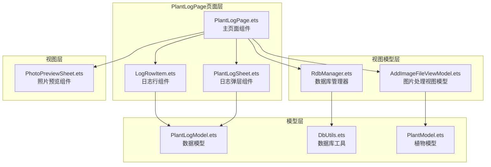
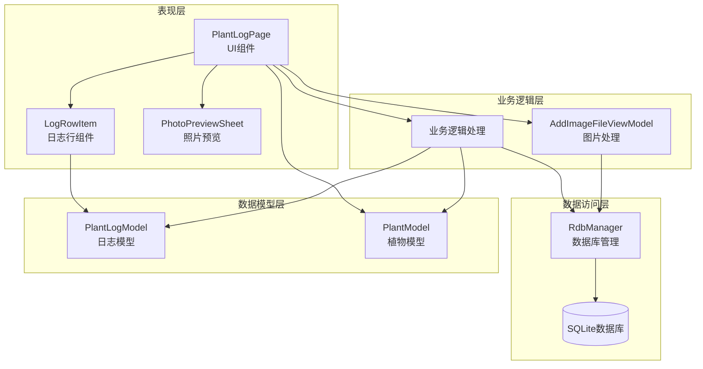
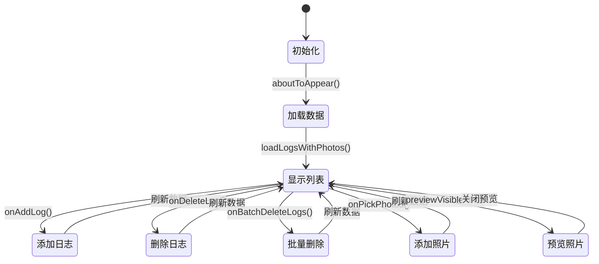
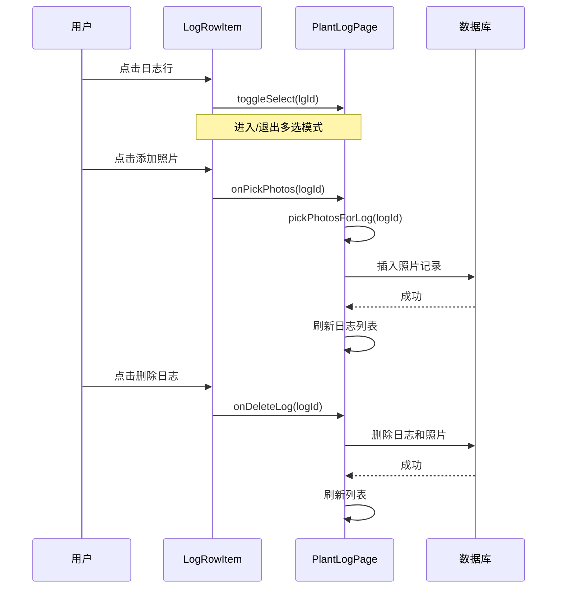
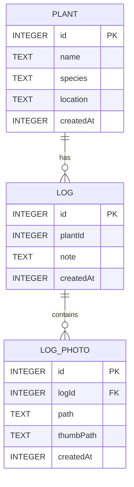
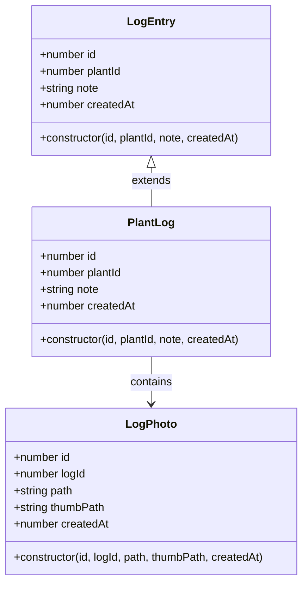
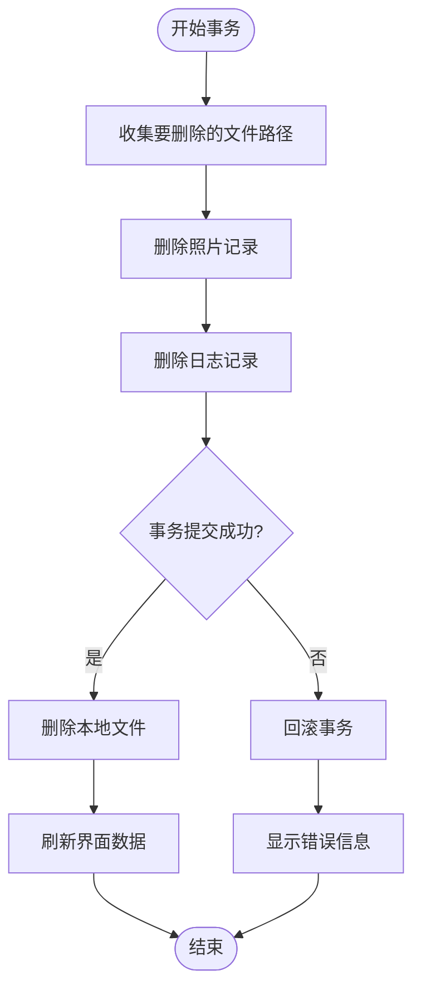
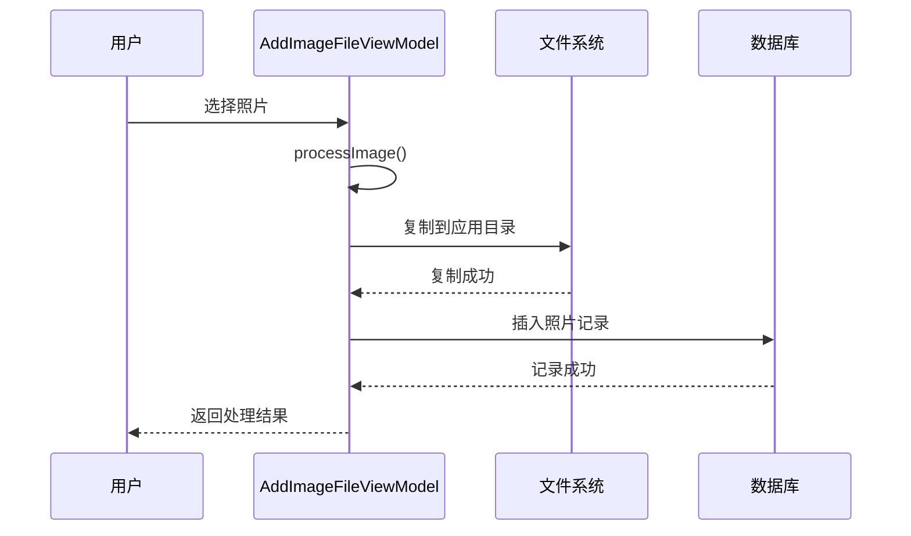

# PlantLogPage植物日志API

<cite>
**本文档引用的文件**
- [PlantLogPage.ets](file://entry/src/main/ets/pages/PlantLogPage.ets)
- [PlantLogModel.ets](file://entry/src/main/ets/model/PlantLogModel.ets)
- [RdbManager.ets](file://entry/src/main/ets/viewmodel/RdbManager.ets)
- [AddImageFileViewModel.ets](file://entry/src/main/ets/viewmodel/AddImageFileViewModel.ets)
- [LogRowItem.ets](file://entry/src/main/ets/view/LogRowItem.ets)
- [PlantLogSheet.ets](file://entry/src/main/ets/view/PlantLogSheet.ets)
- [PhotoPreviewSheet.ets](file://entry/src/main/ets/view/PhotoPreviewSheet.ets)
- [DbUtils.ets](file://entry/src/main/ets/model/DbUtils.ets)
- [PlantModel.ets](file://entry/src/main/ets/model/PlantModel.ets)
</cite>

## 目录
1. [简介](#简介)
2. [项目结构](#项目结构)
3. [核心组件](#核心组件)
4. [架构概览](#架构概览)
5. [详细组件分析](#详细组件分析)
6. [API接口规范](#api接口规范)
7. [数据模型](#数据模型)
8. [文件存储管理](#文件存储管理)
9. [性能考虑](#性能考虑)
10. [故障排除指南](#故障排除指南)
11. [结论](#结论)

## 简介

PlantLogPage植物日志页面是PlantDiary植物日记应用中的核心功能模块，提供植物养护日志记录、照片管理、分类标签等完整的植物护理管理功能。该页面支持日志的创建、编辑、删除、搜索，以及照片的上传、预览和管理，为用户提供便捷的植物成长追踪体验。

## 项目结构

PlantLogPage位于应用的页面层，采用ArkTS框架构建，主要包含以下核心文件：



**图表来源**
- [PlantLogPage.ets:1-1030](file://entry/src/main/ets/pages/PlantLogPage.ets#L1-L1030)
- [RdbManager.ets:1-296](file://entry/src/main/ets/viewmodel/RdbManager.ets#L1-L296)

**章节来源**
- [PlantLogPage.ets:1-1030](file://entry/src/main/ets/pages/PlantLogPage.ets#L1-L1030)
- [RdbManager.ets:1-296](file://entry/src/main/ets/viewmodel/RdbManager.ets#L1-L296)

## 核心组件

PlantLogPage系统由多个相互协作的组件构成，每个组件都有明确的职责分工：

### 主要组件职责

| 组件名称 | 职责描述 | 主要功能 |
|---------|----------|----------|
| PlantLogPage | 主页面组件 | 日志列表展示、日志操作、照片管理、UI交互 |
| LogRowItem | 日志行组件 | 单条日志显示、照片网格、交互事件处理 |
| PlantLogSheet | 日志弹层组件 | 日志弹窗界面、表单输入、批量操作 |
| RdbManager | 数据库管理器 | 数据库初始化、表结构管理、数据访问 |
| AddImageFileViewModel | 图片处理视图模型 | 图片选择、处理、存储、复制 |

**章节来源**
- [PlantLogPage.ets:13-662](file://entry/src/main/ets/pages/PlantLogPage.ets#L13-L662)
- [LogRowItem.ets:3-272](file://entry/src/main/ets/view/LogRowItem.ets#L3-L272)
- [PlantLogSheet.ets:35-367](file://entry/src/main/ets/view/PlantLogSheet.ets#L35-L367)

## 架构概览

PlantLogPage采用分层架构设计，实现了清晰的关注点分离：



**图表来源**
- [PlantLogPage.ets:1-1030](file://entry/src/main/ets/pages/PlantLogPage.ets#L1-L1030)
- [RdbManager.ets:1-296](file://entry/src/main/ets/viewmodel/RdbManager.ets#L1-L296)

## 详细组件分析

### PlantLogPage主页面组件

PlantLogPage是整个植物日志功能的核心组件，负责协调各个子组件的工作。

#### 核心状态管理



**图表来源**
- [PlantLogPage.ets:58-152](file://entry/src/main/ets/pages/PlantLogPage.ets#L58-L152)

#### 主要方法接口

| 方法名称 | 参数 | 返回值 | 功能描述 |
|---------|------|--------|----------|
| onAddLog | note: string, iso: string | Promise<void> | 创建新的日志记录 |
| onDeleteLog | logId: number | Promise<void> | 删除指定日志及其照片 |
| onBatchDeleteLogs | ids: Array<number> | Promise<void> | 批量删除日志 |
| onPickPhotos | logId: number | Promise<void> | 选择并保存照片 |
| loadLogsWithPhotos | plantId: number | Promise<void> | 加载日志和照片数据 |
| deleteLogAndPhotos | logId: number | Promise<void> | 删除日志及其关联文件 |

**章节来源**
- [PlantLogPage.ets:66-152](file://entry/src/main/ets/pages/PlantLogPage.ets#L66-L152)
- [PlantLogPage.ets:324-357](file://entry/src/main/ets/pages/PlantLogPage.ets#L324-L357)

### LogRowItem日志行组件

LogRowItem专门负责单条日志的显示和交互处理。

#### 组件交互流程



**图表来源**
- [LogRowItem.ets:72-134](file://entry/src/main/ets/view/LogRowItem.ets#L72-L134)
- [PlantLogPage.ets:561-577](file://entry/src/main/ets/pages/PlantLogPage.ets#L561-L577)

**章节来源**
- [LogRowItem.ets:1-272](file://entry/src/main/ets/view/LogRowItem.ets#L1-L272)

### 数据库管理器RdbManager

RdbManager负责整个应用的数据库初始化和管理。

#### 数据库表结构



**图表来源**
- [RdbManager.ets:62-87](file://entry/src/main/ets/viewmodel/RdbManager.ets#L62-L87)

**章节来源**
- [RdbManager.ets:1-296](file://entry/src/main/ets/viewmodel/RdbManager.ets#L1-L296)

## API接口规范

### 日志管理API

#### 创建日志接口

**接口定义**
```typescript
async onAddLog(note: string, iso: string): Promise<void>
```

**参数说明**
- `note`: 日志内容字符串，必填
- `iso`: 日期字符串，格式为YYYY-MM-DD

**功能描述**
创建新的植物日志记录，包含内容和日期信息，自动设置创建时间戳。

**使用示例**
```typescript
await plantLogPage.onAddLog("新叶子发芽", "2024-01-15");
```

**章节来源**
- [PlantLogPage.ets:66-72](file://entry/src/main/ets/pages/PlantLogPage.ets#L66-L72)

#### 删除日志接口

**接口定义**
```typescript
async onDeleteLog(logId: number): Promise<void>
```

**参数说明**
- `logId`: 要删除的日志ID

**功能描述**
删除指定的日志记录及其关联的所有照片文件，采用事务性删除确保数据一致性。

**章节来源**
- [PlantLogPage.ets:74-83](file://entry/src/main/ets/pages/PlantLogPage.ets#L74-L83)

#### 批量删除接口

**接口定义**
```typescript
async onBatchDeleteLogs(ids: Array<number>): Promise<void>
```

**参数说明**
- `ids`: 要删除的日志ID数组

**功能描述**
批量删除多个日志记录及其照片，支持多选删除功能。

**章节来源**
- [PlantLogPage.ets:139-152](file://entry/src/main/ets/pages/PlantLogPage.ets#L139-L152)

### 照片管理API

#### 选择照片接口

**接口定义**
```typescript
async onPickPhotos(logId: number): Promise<void>
```

**参数说明**
- `logId`: 关联的日志ID

**功能描述**
打开系统相册选择照片，支持多选，自动复制到应用私有目录并保存记录。

**章节来源**
- [PlantLogPage.ets:154-159](file://entry/src/main/ets/pages/PlantLogPage.ets#L154-L159)

#### 删除照片接口

**接口定义**
```typescript
async onDeletePhoto(pid: number): Promise<void>
```

**参数说明**
- `pid`: 照片记录ID

**功能描述**
删除指定的照片记录及其对应的文件。

**章节来源**
- [PlantLogPage.ets:306-315](file://entry/src/main/ets/pages/PlantLogPage.ets#L306-L315)

### 数据加载API

#### 加载日志和照片

**接口定义**
```typescript
private async loadLogsWithPhotos(plantId: number): Promise<void>
```

**参数说明**
- `plantId`: 植物ID

**功能描述**
并行加载指定植物的所有日志和照片数据，支持日志按时间排序。

**章节来源**
- [PlantLogPage.ets:324-357](file://entry/src/main/ets/pages/PlantLogPage.ets#L324-L357)

## 数据模型

### PlantLog日志模型

PlantLog模型用于表示植物日志的基本信息。



**图表来源**
- [PlantLogModel.ets:8-57](file://entry/src/main/ets/model/PlantLogModel.ets#L8-L57)

**章节来源**
- [PlantLogModel.ets:1-58](file://entry/src/main/ets/model/PlantLogModel.ets#L1-L58)

### 数据库事务处理

系统使用统一的事务处理机制确保数据一致性：



**图表来源**
- [DbUtils.ets:12-21](file://entry/src/main/ets/model/DbUtils.ets#L12-L21)
- [PlantLogPage.ets:87-137](file://entry/src/main/ets/pages/PlantLogPage.ets#L87-L137)

**章节来源**
- [DbUtils.ets:1-22](file://entry/src/main/ets/model/DbUtils.ets#L1-L22)

## 文件存储管理

### 照片存储策略

PlantLogPage采用安全的文件存储策略：

1. **应用私有目录存储**：所有照片都存储在应用的私有文件目录中
2. **文件命名规范**：使用时间戳+随机数的命名方式避免冲突
3. **URI统一处理**：确保所有文件路径都带有file://前缀

#### 文件复制流程



**图表来源**
- [AddImageFileViewModel.ets:35-55](file://entry/src/main/ets/viewmodel/AddImageFileViewModel.ets#L35-L55)
- [PlantLogPage.ets:210-240](file://entry/src/main/ets/pages/PlantLogPage.ets#L210-L240)

**章节来源**
- [AddImageFileViewModel.ets:1-146](file://entry/src/main/ets/viewmodel/AddImageFileViewModel.ets#L1-L146)

### 存储优化策略

| 优化策略 | 实现方式 | 效果 |
|---------|----------|------|
| 文件去重 | 使用文件路径去重算法 | 避免重复存储相同文件 |
| 异步处理 | 异步文件复制和数据库操作 | 提升用户体验 |
| 错误处理 | 容错机制和回滚策略 | 确保数据完整性 |
| 内存管理 | 及时释放PixelMap内存 | 防止内存泄漏 |

## 性能考虑

### 数据加载优化

1. **并行数据加载**：日志和照片数据采用并行加载方式
2. **索引优化**：数据库表建立合适的索引提高查询效率
3. **分页加载**：大量数据时采用分页加载策略

### UI性能优化

1. **虚拟滚动**：长列表采用虚拟滚动减少DOM节点数量
2. **懒加载**：图片采用懒加载策略
3. **状态缓存**：本地状态缓存避免重复计算

### 内存管理

1. **及时释放**：大图片处理后及时释放内存
2. **生命周期管理**：组件销毁时清理定时器和监听器
3. **对象池**：重复使用的对象采用对象池模式

## 故障排除指南

### 常见问题及解决方案

#### 数据库连接问题

**问题症状**：页面无法加载数据，显示空列表

**可能原因**：
- 数据库未正确初始化
- 权限不足
- 数据库文件损坏

**解决步骤**：
1. 检查数据库初始化是否成功
2. 验证应用权限设置
3. 重新启动应用

#### 照片保存失败

**问题症状**：选择照片后无法保存

**可能原因**：
- 存储空间不足
- 文件权限问题
- 网络异常

**解决步骤**：
1. 检查设备存储空间
2. 验证文件写入权限
3. 检查网络连接状态

#### 界面刷新问题

**问题症状**：删除操作后界面未更新

**解决步骤**：
1. 调用loadLogsWithPhotos()重新加载数据
2. 检查响应式状态更新
3. 验证UI组件重新渲染

**章节来源**
- [PlantLogPage.ets:1015-1023](file://entry/src/main/ets/pages/PlantLogPage.ets#L1015-L1023)

## 结论

PlantLogPage植物日志页面是一个功能完整、架构清晰的植物护理管理组件。通过合理的分层设计和完善的错误处理机制，为用户提供了流畅的植物日志记录和管理体验。

### 主要优势

1. **模块化设计**：各组件职责明确，易于维护和扩展
2. **数据一致性**：采用事务处理确保数据完整性
3. **用户体验**：响应式设计和流畅的交互体验
4. **性能优化**：多种性能优化策略提升应用性能

### 技术亮点

1. **ArkTS框架**：充分利用ArkTS的响应式特性和类型安全
2. **数据库集成**：深度集成关系型数据库提供可靠的数据存储
3. **文件管理**：完善的文件存储和管理机制
4. **组件化开发**：高度模块化的组件设计便于复用

该系统为植物爱好者提供了专业的日志管理和照片记录功能，是PlantDiary应用的重要组成部分。