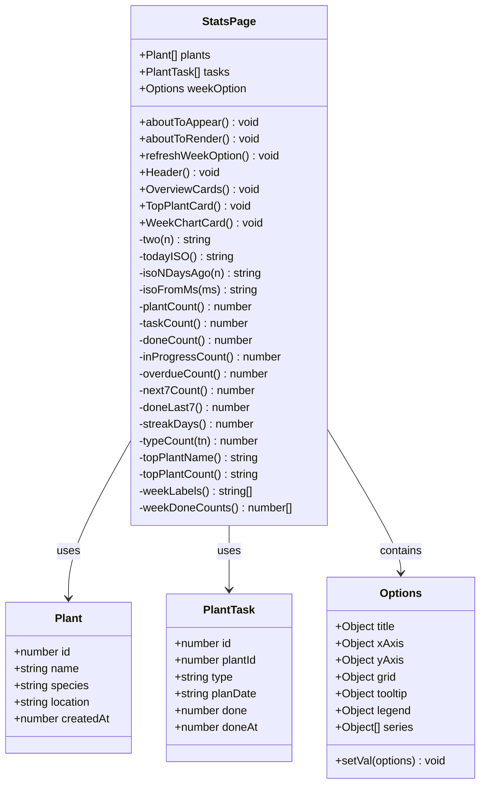
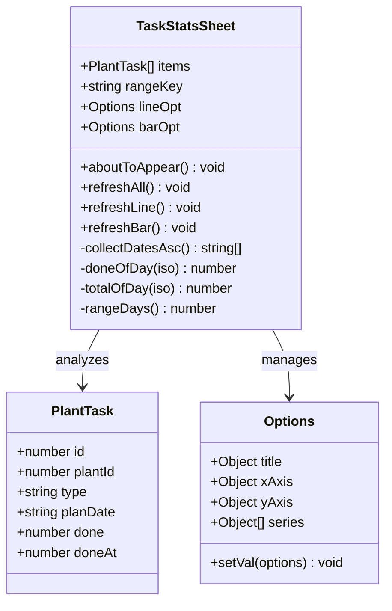
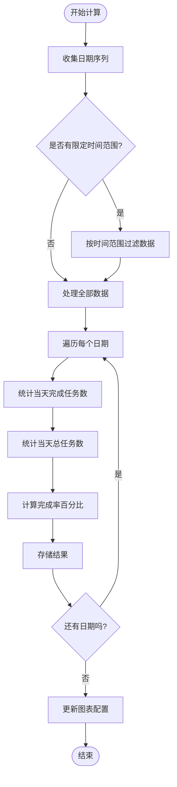
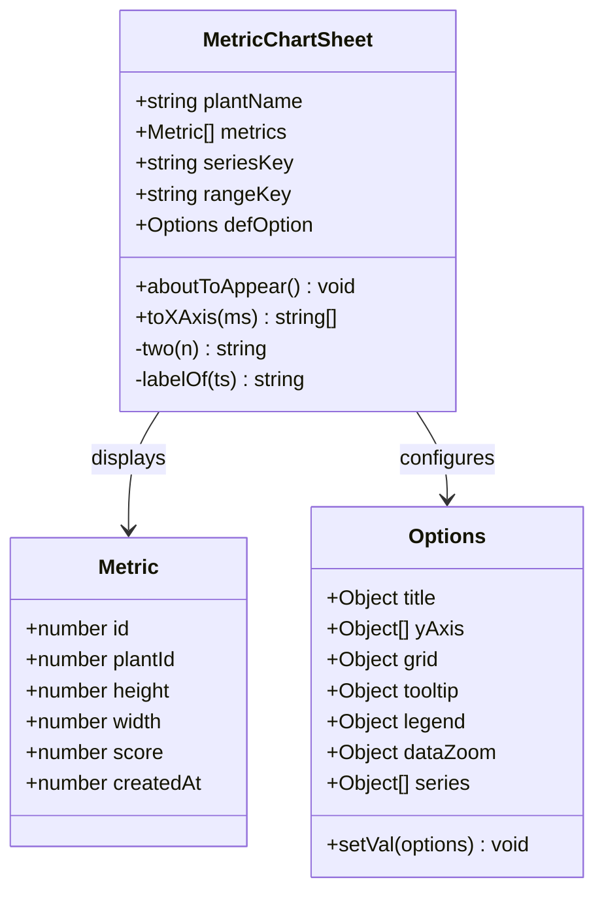
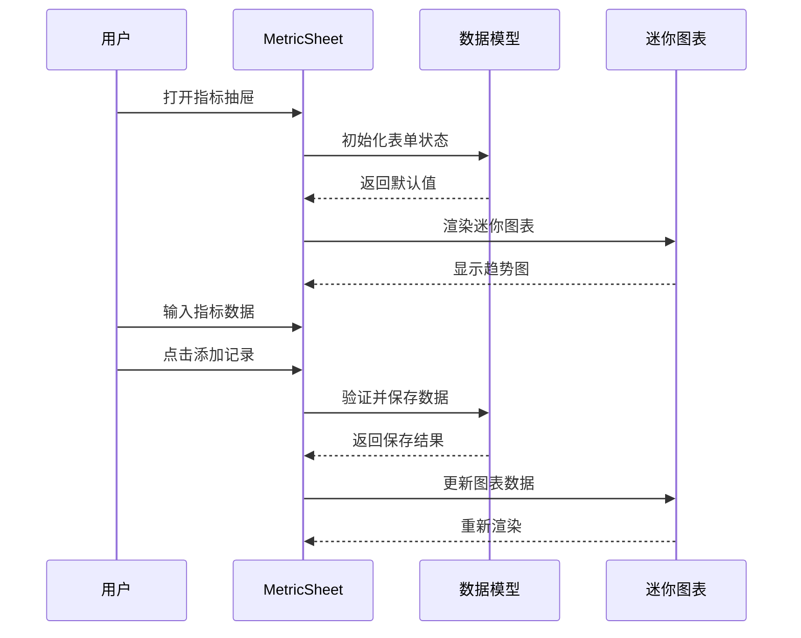

# StatsPage统计分析API

<cite>
**本文档引用的文件**
- [StatsPage.ets](file://entry/src/main/ets/pages/StatsPage.ets)
- [MetricChartSheet.ets](file://entry/src/main/ets/view/MetricChartSheet.ets)
- [MetricSheet.ets](file://entry/src/main/ets/view/MetricSheet.ets)
- [TaskStatsSheet.ets](file://entry/src/main/ets/view/TaskStatsSheet.ets)
- [PlantModel.ets](file://entry/src/main/ets/model/PlantModel.ets)
- [CalendarView.ets](file://entry/src/main/ets/view/CalendarView.ets)
</cite>

## 目录
1. [简介](#简介)
2. [项目结构](#项目结构)
3. [核心组件](#核心组件)
4. [架构概览](#架构概览)
5. [详细组件分析](#详细组件分析)
6. [依赖分析](#依赖分析)
7. [性能考虑](#性能考虑)
8. [故障排除指南](#故障排除指南)
9. [结论](#结论)

## 简介

StatsPage统计分析页面是PlantDiary植物养护应用中的核心数据分析模块。该页面提供了全面的统计分析功能，包括任务完成情况统计、植物生长指标分析、时间趋势可视化等。通过集成多种图表组件和数据聚合算法，为用户提供直观的数据洞察和决策支持。

本API文档详细说明了统计图表展示、数据分析、报表生成等功能的接口规范，涵盖图表组件集成、统计数据计算、可视化展示等核心功能。文档还包含了数据获取方法、图表配置选项、交互事件处理和导出功能的技术细节。

## 项目结构

StatsPage统计分析功能分布在多个文件中，采用模块化设计：

```mermaid
graph TB
subgraph "统计分析模块"
StatsPage[StatsPage.ets<br/>主统计页面]
TaskStatsSheet[TaskStatsSheet.ets<br/>任务统计抽屉]
MetricChartSheet[MetricChartSheet.ets<br/>指标趋势图]
MetricSheet[MetricSheet.ets<br/>指标抽屉]
end
subgraph "数据模型"
PlantModel[PlantModel.ets<br/>数据模型]
CalendarView[CalendarView.ets<br/>日历视图]
end
subgraph "图表组件"
McBarChart[@mcui/mccharts<br/>柱状图]
McLineChart[@mcui/mccharts<br/>折线图]
Options[Options<br/>图表配置]
end
StatsPage --> PlantModel
TaskStatsSheet --> PlantModel
MetricChartSheet --> PlantModel
MetricSheet --> PlantModel
StatsPage --> McBarChart
TaskStatsSheet --> McLineChart
TaskStatsSheet --> McBarChart
MetricChartSheet --> McLineChart
StatsPage --> Options
TaskStatsSheet --> Options
MetricChartSheet --> Options
```

**图表来源**
- [StatsPage.ets:1-442](file://entry/src/main/ets/pages/StatsPage.ets#L1-L442)
- [TaskStatsSheet.ets:1-273](file://entry/src/main/ets/view/TaskStatsSheet.ets#L1-L273)
- [MetricChartSheet.ets:1-181](file://entry/src/main/ets/view/MetricChartSheet.ets#L1-L181)

**章节来源**
- [StatsPage.ets:1-442](file://entry/src/main/ets/pages/StatsPage.ets#L1-L442)
- [PlantModel.ets:1-166](file://entry/src/main/ets/model/PlantModel.ets#L1-L166)

## 核心组件

### StatsPage 主统计页面

StatsPage是统计分析的核心页面组件，提供以下主要功能：

- **实时数据聚合**：基于plants和tasks数组即时计算各种统计指标
- **多维度统计**：包括植物数量、任务总数、完成率、进行中、逾期等指标
- **趋势可视化**：集成McBarChart展示近7天任务完成趋势
- **活跃植物分析**：识别并展示近30天最活跃的植物
- **数据刷新机制**：支持手动刷新和自动更新

### 任务统计抽屉 TaskStatsSheet

TaskStatsSheet提供详细的任务分析功能：

- **完成率趋势**：展示指定时间范围内任务完成率变化趋势
- **任务类型分析**：统计不同类型任务的完成情况
- **时间范围筛选**：支持近30天、近90天、全部数据的切换
- **双图表展示**：同时显示折线图和柱状图

### 指标趋势图 MetricChartSheet

专门用于展示植物生长指标的趋势分析：

- **多指标对比**：同时展示高度、宽度、健康度三个指标
- **时间范围选择**：支持不同时间窗口的数据展示
- **全屏展示**：提供独立的全屏趋势图界面
- **详细数据**：展示完整的指标变化过程

### 指标抽屉 MetricSheet

轻量级的指标管理组件：

- **快速录入**：支持快速添加植物生长指标
- **迷你趋势图**：展示简化的趋势图表
- **历史记录管理**：支持查看、删除历史指标记录
- **维度切换**：可在不同指标间切换查看

**章节来源**
- [StatsPage.ets:4-442](file://entry/src/main/ets/pages/StatsPage.ets#L4-L442)
- [TaskStatsSheet.ets:4-273](file://entry/src/main/ets/view/TaskStatsSheet.ets#L4-L273)
- [MetricChartSheet.ets:5-181](file://entry/src/main/ets/view/MetricChartSheet.ets#L5-L181)
- [MetricSheet.ets:5-491](file://entry/src/main/ets/view/MetricSheet.ets#L5-L491)

## 架构概览

统计分析系统的整体架构采用分层设计，确保功能模块的清晰分离和高效协作：

```mermaid
graph TB
subgraph "UI层"
StatsPage[StatsPage<br/>主统计页面]
TaskStatsSheet[TaskStatsSheet<br/>任务统计抽屉]
MetricChartSheet[MetricChartSheet<br/>指标趋势图]
MetricSheet[MetricSheet<br/>指标抽屉]
end
subgraph "业务逻辑层"
StatsCalculator[统计计算器]
DataAggregator[数据聚合器]
ChartConfigurator[图表配置器]
end
subgraph "数据层"
PlantModel[PlantModel<br/>数据模型]
TaskModel[TaskModel<br/>任务模型]
MetricModel[MetricModel<br/>指标模型]
end
subgraph "图表引擎"
McCharts[@mcui/mccharts<br/>图表组件]
Options[Options<br/>配置选项]
end
StatsPage --> StatsCalculator
TaskStatsSheet --> DataAggregator
MetricChartSheet --> ChartConfigurator
StatsPage --> McCharts
TaskStatsSheet --> McCharts
MetricChartSheet --> McCharts
StatsCalculator --> PlantModel
DataAggregator --> TaskModel
ChartConfigurator --> MetricModel
StatsPage --> Options
TaskStatsSheet --> Options
MetricChartSheet --> Options
```

**图表来源**
- [StatsPage.ets:1-442](file://entry/src/main/ets/pages/StatsPage.ets#L1-L442)
- [TaskStatsSheet.ets:1-273](file://entry/src/main/ets/view/TaskStatsSheet.ets#L1-L273)
- [MetricChartSheet.ets:1-181](file://entry/src/main/ets/view/MetricChartSheet.ets#L1-L181)

系统采用以下设计原则：

1. **单一职责原则**：每个组件专注于特定的统计功能
2. **数据驱动**：所有UI元素都基于实时数据动态更新
3. **组件复用**：图表组件可在多个场景中重复使用
4. **事件驱动**：通过事件机制实现组件间的通信

## 详细组件分析

### StatsPage 组件详解

StatsPage是统计分析的核心组件，采用结构化组件设计模式：



**图表来源**
- [StatsPage.ets:4-442](file://entry/src/main/ets/pages/StatsPage.ets#L4-L442)
- [PlantModel.ets:6-59](file://entry/src/main/ets/model/PlantModel.ets#L6-L59)

#### 核心统计功能

StatsPage实现了多种统计计算功能：

1. **基础统计指标**
   - 植物总数统计：`plantCount()`
   - 任务总数统计：`taskCount()`
   - 完成率计算：`doneCount() / taskCount() * 100%`
   - 进行中任务：`inProgressCount()`
   - 逾期任务：`overdueCount()`

2. **时间维度分析**
   - 近7天完成统计：`doneLast7()`
   - 未来7天计划：`next7Count()`
   - 连续打卡天数：`streakDays()`

3. **活跃度分析**
   - 最活跃植物识别：`topPlantName()`
   - 活跃度量化：`topPlantCount()`

#### 图表配置系统

StatsPage使用Options对象管理图表配置：

```mermaid
sequenceDiagram
participant Page as StatsPage
participant Options as Options
participant Chart as McBarChart
Page->>Page : refreshWeekOption()
Page->>Options : setVal({
title : {...}
xAxis : {data : weekLabels()}
yAxis : {name : '次数'}
series : [{name : '完成', data : weekDoneCounts()}]
})
Page->>Chart : 渲染图表
Chart->>Options : 读取配置
Options-->>Chart : 返回配置数据
Chart-->>Page : 显示图表
```

**图表来源**
- [StatsPage.ets:277-290](file://entry/src/main/ets/pages/StatsPage.ets#L277-L290)

**章节来源**
- [StatsPage.ets:32-290](file://entry/src/main/ets/pages/StatsPage.ets#L32-L290)

### TaskStatsSheet 任务统计分析

TaskStatsSheet提供专业的任务分析功能：



**图表来源**
- [TaskStatsSheet.ets:4-273](file://entry/src/main/ets/view/TaskStatsSheet.ets#L4-L273)
- [PlantModel.ets:42-59](file://entry/src/main/ets/model/PlantModel.ets#L42-L59)

#### 完成率趋势计算

任务完成率趋势通过以下算法计算：



**图表来源**
- [TaskStatsSheet.ets:135-148](file://entry/src/main/ets/view/TaskStatsSheet.ets#L135-L148)

#### 任务类型占比分析

类型占比通过分类统计实现：

1. **数据过滤**：根据时间范围过滤任务数据
2. **分类计数**：分别统计浇水、施肥、修剪、其他类型的任务数量
3. **比例计算**：计算各类型占总数的百分比
4. **图表更新**：更新柱状图的系列数据

**章节来源**
- [TaskStatsSheet.ets:135-189](file://entry/src/main/ets/view/TaskStatsSheet.ets#L135-L189)

### MetricChartSheet 指标趋势分析

MetricChartSheet专注于植物生长指标的深度分析：



**图表来源**
- [MetricChartSheet.ets:5-181](file://entry/src/main/ets/view/MetricChartSheet.ets#L5-L181)
- [PlantModel.ets:108-125](file://entry/src/main/ets/model/PlantModel.ets#L108-L125)

#### 多指标对比展示

系统支持三种指标的对比分析：

1. **高度指标**：植物垂直生长情况
2. **宽度指标**：植物横向扩展情况  
3. **健康度指标**：综合健康状况评估

#### 时间范围灵活切换

支持三种时间粒度的选择：

- **近30天**：短期趋势分析
- **近90天**：中期发展轨迹
- **全部数据**：长期历史回顾

**章节来源**
- [MetricChartSheet.ets:55-88](file://entry/src/main/ets/view/MetricChartSheet.ets#L55-L88)

### MetricSheet 指标管理

MetricSheet提供轻量级的指标管理功能：



**图表来源**
- [MetricSheet.ets:28-40](file://entry/src/main/ets/view/MetricSheet.ets#L28-L40)

#### 迷你图表设计

迷你图表采用简洁的设计理念：

1. **简化显示**：仅展示关键趋势信息
2. **响应式布局**：适应不同屏幕尺寸
3. **动画效果**：提供流畅的视觉体验
4. **交互反馈**：通过颜色和形状传达信息

**章节来源**
- [MetricSheet.ets:285-353](file://entry/src/main/ets/view/MetricSheet.ets#L285-L353)

## 依赖分析

统计分析系统的依赖关系体现了清晰的分层架构：

```mermaid
graph TB
subgraph "外部依赖"
McCharts[@mcui/mccharts<br/>图表库]
ObservedV2[ObservedV2<br/>响应式框架]
end
subgraph "内部模块"
StatsPage[StatsPage]
TaskStatsSheet[TaskStatsSheet]
MetricChartSheet[MetricChartSheet]
MetricSheet[MetricSheet]
CalendarView[CalendarView]
end
subgraph "数据模型"
PlantModel[PlantModel]
PlantTask[PlantTask]
Metric[Metric]
PlantMetric[PlantMetric]
end
StatsPage --> McCharts
TaskStatsSheet --> McCharts
MetricChartSheet --> McCharts
StatsPage --> ObservedV2
TaskStatsSheet --> ObservedV2
MetricChartSheet --> ObservedV2
MetricSheet --> ObservedV2
StatsPage --> PlantModel
TaskStatsSheet --> PlantTask
MetricChartSheet --> Metric
MetricSheet --> PlantMetric
CalendarView --> PlantTask
```

**图表来源**
- [StatsPage.ets:1-2](file://entry/src/main/ets/pages/StatsPage.ets#L1-L2)
- [PlantModel.ets:6-147](file://entry/src/main/ets/model/PlantModel.ets#L6-L147)

### 数据流分析

统计分析涉及多层数据流转：

1. **原始数据层**：从数据库或内存中获取原始任务和指标数据
2. **聚合计算层**：对原始数据进行统计分析和聚合
3. **配置转换层**：将聚合结果转换为图表组件所需的配置格式
4. **渲染展示层**：通过图表组件进行可视化展示

### 性能优化策略

系统采用了多项性能优化措施：

1. **懒加载机制**：图表配置在需要时才进行计算和更新
2. **增量更新**：仅更新发生变化的数据部分
3. **缓存策略**：对计算结果进行缓存以避免重复计算
4. **虚拟滚动**：对大量数据进行分页和延迟加载

**章节来源**
- [StatsPage.ets:277-290](file://entry/src/main/ets/pages/StatsPage.ets#L277-L290)
- [TaskStatsSheet.ets:186-189](file://entry/src/main/ets/view/TaskStatsSheet.ets#L186-L189)

## 性能考虑

### 数据计算优化

统计分析涉及大量的数据计算，系统采用了以下优化策略：

1. **时间复杂度优化**
   - 使用哈希表进行数据索引，将查找复杂度从O(n)降低到O(1)
   - 通过预排序减少重复计算，避免多次遍历相同数据集

2. **内存使用优化**
   - 采用流式处理方式，避免一次性加载所有数据
   - 及时释放不再使用的中间计算结果

3. **渲染性能优化**
   - 图表配置对象的复用，避免频繁创建销毁
   - 通过节流和防抖机制控制高频更新操作

### 用户体验优化

1. **加载状态管理**
   - 提供进度指示器和骨架屏
   - 支持数据加载失败的降级处理

2. **交互响应性**
   - 异步数据处理，避免阻塞主线程
   - 实时预览功能，提升用户操作反馈

3. **适配性设计**
   - 支持不同屏幕尺寸的自适应布局
   - 提供深色模式和无障碍访问支持

## 故障排除指南

### 常见问题及解决方案

#### 图表显示异常

**问题现象**：图表无法正常显示或显示错误

**可能原因**：
1. 数据格式不正确
2. 图表配置参数缺失
3. 内存不足导致渲染失败

**解决步骤**：
1. 检查数据源的有效性
2. 验证Options配置的完整性
3. 监控内存使用情况
4. 尝试重启应用

#### 统计结果不准确

**问题现象**：统计结果显示错误或不一致

**可能原因**：
1. 数据同步延迟
2. 时间范围计算错误
3. 过滤条件设置不当

**解决步骤**：
1. 确认数据源的最新状态
2. 检查时间范围的边界条件
3. 验证过滤逻辑的正确性
4. 重新执行统计计算

#### 性能问题

**问题现象**：页面加载缓慢或操作卡顿

**可能原因**：
1. 数据量过大
2. 计算复杂度过高
3. 图表渲染过于频繁

**解决步骤**：
1. 实施数据分页加载
2. 优化算法复杂度
3. 减少不必要的重渲染
4. 使用缓存机制

**章节来源**
- [StatsPage.ets:332-335](file://entry/src/main/ets/pages/StatsPage.ets#L332-L335)
- [TaskStatsSheet.ets:186-189](file://entry/src/main/ets/view/TaskStatsSheet.ets#L186-L189)

## 结论

StatsPage统计分析API为PlantDiary应用提供了完整的数据分析解决方案。通过模块化的组件设计、高效的算法实现和优雅的用户界面，系统能够满足用户对植物养护数据的各种分析需求。

### 主要优势

1. **功能完整性**：涵盖了从基础统计到高级分析的全方位功能
2. **性能优异**：通过多种优化策略确保良好的用户体验
3. **扩展性强**：模块化设计便于功能扩展和维护
4. **用户体验佳**：直观的界面设计和流畅的交互体验

### 技术特色

1. **响应式设计**：支持多种设备和屏幕尺寸
2. **实时更新**：数据变更时自动刷新显示
3. **多维分析**：支持时间、类型、植物等多个维度的分析
4. **可视化丰富**：提供多种图表类型满足不同的展示需求

该API为植物养护应用的数据分析奠定了坚实的基础，为用户提供了科学、直观的数据洞察，有助于提升植物养护的效果和效率。