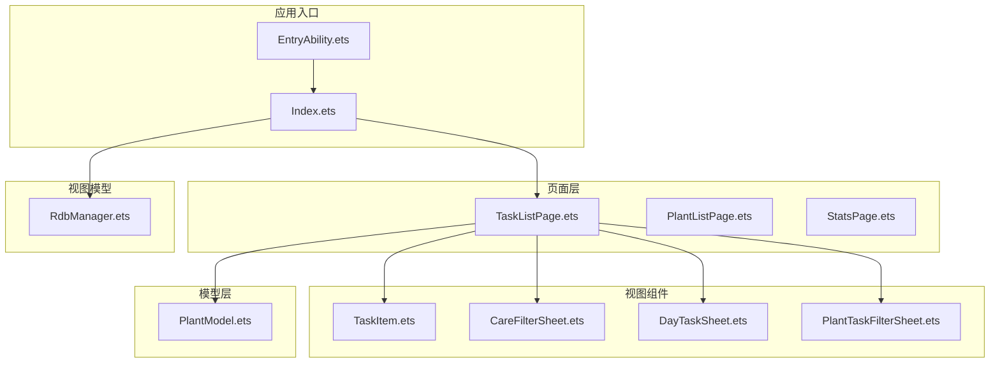
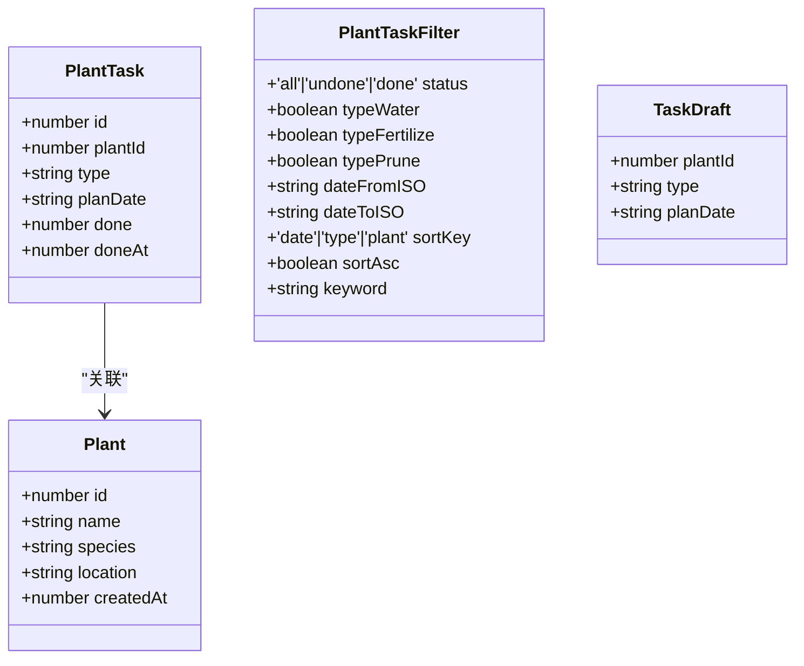
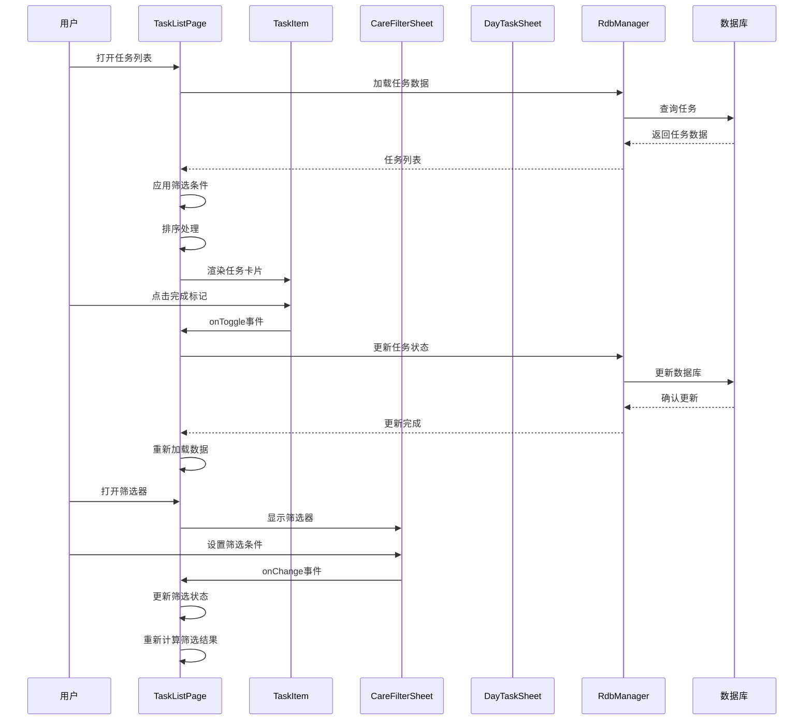
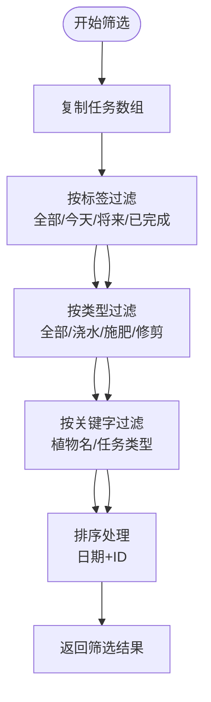
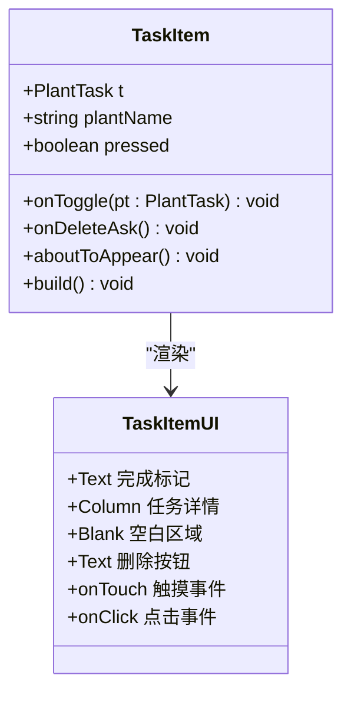
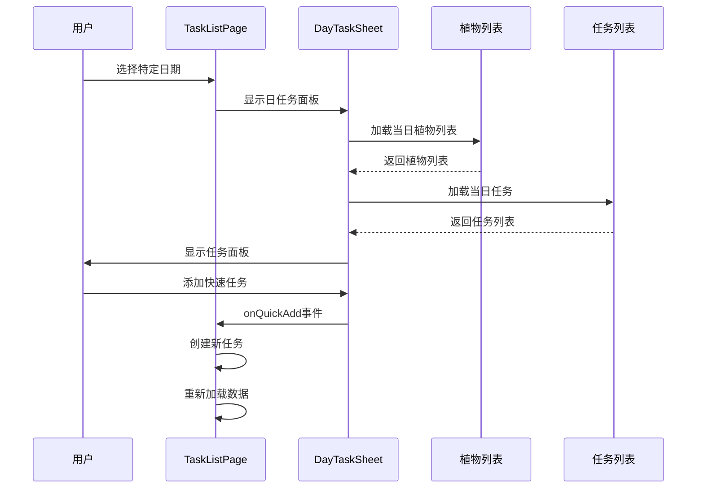
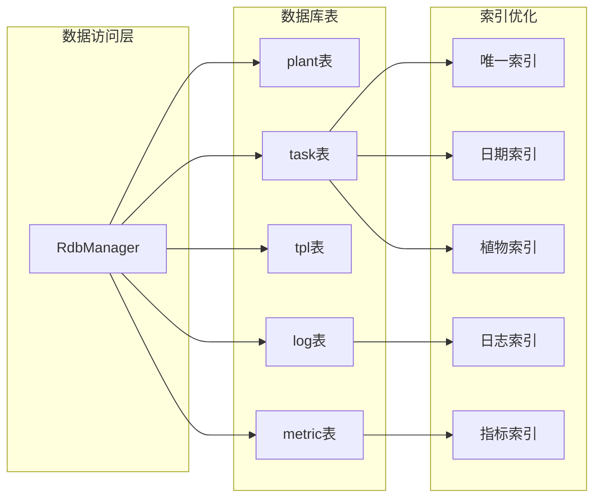
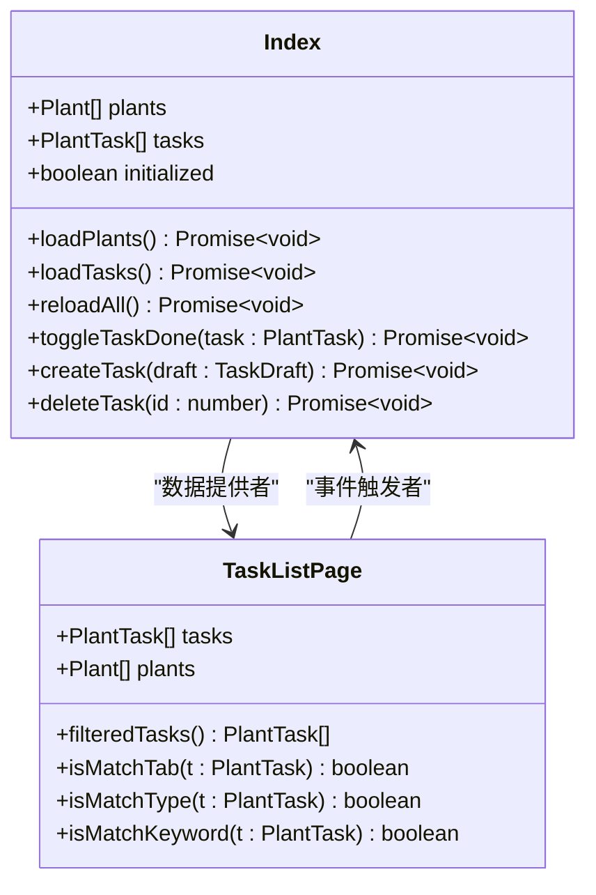

# TaskListPage任务列表API

<cite>
**本文档引用的文件**
- [TaskListPage.ets](file://entry/src/main/ets/pages/TaskListPage.ets)
- [TaskItem.ets](file://entry/src/main/ets/view/TaskItem.ets)
- [PlantTaskFilterSheet.ets](file://entry/src/main/ets/view/PlantTaskFilterSheet.ets)
- [CareFilterSheet.ets](file://entry/src/main/ets/view/CareFilterSheet.ets)
- [DayTaskSheet.ets](file://entry/src/main/ets/view/DayTaskSheet.ets)
- [PlantModel.ets](file://entry/src/main/ets/model/PlantModel.ets)
- [RdbManager.ets](file://entry/src/main/ets/viewmodel/RdbManager.ets)
- [Index.ets](file://entry/src/main/ets/pages/Index.ets)
</cite>

## 目录
1. [简介](#简介)
2. [项目结构](#项目结构)
3. [核心组件](#核心组件)
4. [架构概览](#架构概览)
5. [详细组件分析](#详细组件分析)
6. [依赖关系分析](#依赖关系分析)
7. [性能考虑](#性能考虑)
8. [故障排除指南](#故障排除指南)
9. [结论](#结论)

## 简介

TaskListPage是PlantDiary植物养护应用中的核心任务管理页面，提供了完整的任务列表展示、筛选排序、状态管理等功能。该页面采用ArkTS框架开发，实现了响应式的任务管理界面，支持多种筛选条件、排序规则和批量操作。

## 项目结构

PlantDiary项目采用模块化架构设计，TaskListPage位于以下目录结构中：

**图表来源**
- [TaskListPage.ets:1-463](file://entry/src/main/ets/pages/TaskListPage.ets#L1-L463)
- [Index.ets:1-800](file://entry/src/main/ets/pages/Index.ets#L1-L800)

## 核心组件

### 任务数据模型

系统使用统一的数据模型来管理任务信息：

**图表来源**
- [PlantModel.ets:43-59](file://entry/src/main/ets/model/PlantModel.ets#L43-L59)
- [PlantModel.ets:4-21](file://entry/src/main/ets/model/PlantModel.ets#L4-L21)
- [PlantTaskFilterSheet.ets:4-14](file://entry/src/main/ets/view/PlantTaskFilterSheet.ets#L4-L14)

### 页面状态管理

TaskListPage维护了丰富的状态变量来控制界面行为：

| 状态变量 | 类型 | 默认值 | 用途 |
|---------|------|--------|------|
| viewMode | number | 0 | 视图模式（0=列表，1=日历） |
| currentMonthISO | string | '' | 当前显示的月份（YYYY-MM） |
| filterTab | number | 0 | 筛选标签（0=全部，1=今天，2=将来，3=已完成） |
| typeFilter | string | '全部' | 任务类型过滤 |
| keyword | string | '' | 关键字搜索 |
| filterVisible | boolean | false | 筛选器可见性 |
| sortKey | string | 'data' | 排序键 |
| sortAsc | boolean | false | 排序方向 |

**章节来源**
- [TaskListPage.ets:14-30](file://entry/src/main/ets/pages/TaskListPage.ets#L14-L30)

## 架构概览

TaskListPage采用了MVVM架构模式，实现了清晰的职责分离：

**图表来源**
- [TaskListPage.ets:210-245](file://entry/src/main/ets/pages/TaskListPage.ets#L210-L245)
- [TaskItem.ets:9-11](file://entry/src/main/ets/view/TaskItem.ets#L9-L11)
- [CareFilterSheet.ets:10-18](file://entry/src/main/ets/view/CareFilterSheet.ets#L10-L18)

## 详细组件分析

### TaskListPage 主页面组件

TaskListPage是任务列表的核心组件，提供了完整的任务管理功能：

#### 核心属性和事件

| 属性/事件 | 类型 | 必需 | 描述 |
|----------|------|------|------|
| tasks | Array<PlantTask> | 是 | 任务数据数组 |
| plants | Array<Plant> | 是 | 植物数据数组 |
| onToggle | (pt: PlantTask) => void | 是 | 任务状态切换事件 |
| onDeleteAsk | (taskId: number) => void | 是 | 删除确认事件 |
| onCreateTask | (plantId: number, type: string, dateISO: string) => void | 是 | 创建任务事件 |

#### 筛选和排序逻辑

**图表来源**
- [TaskListPage.ets:135-162](file://entry/src/main/ets/pages/TaskListPage.ets#L135-L162)

#### 任务卡片渲染组件

TaskItem组件负责单个任务的渲染和交互：

**图表来源**
- [TaskItem.ets:6-11](file://entry/src/main/ets/view/TaskItem.ets#L6-L11)

**章节来源**
- [TaskListPage.ets:216-229](file://entry/src/main/ets/pages/TaskListPage.ets#L216-L229)
- [TaskItem.ets:17-65](file://entry/src/main/ets/view/TaskItem.ets#L17-L65)

### 筛选器组件

系统提供了两种筛选器组件，满足不同的使用场景：

#### CareFilterSheet 简化筛选器

适用于TaskListPage的轻量级筛选器：

| 参数 | 类型 | 描述 |
|------|------|------|
| status | number | 状态筛选（0=全部，1=未完成，2=已完成） |
| typeValue | string | 任务类型筛选 |
| fromDate | string | 开始日期（YYYY-MM-DD） |
| toDate | string | 结束日期（YYYY-MM-DD） |
| keyword | string | 关键字搜索 |
| sortKey | string | 排序键（'date' \| 'type' \| 'status' \| 'plant'） |
| sortAsc | boolean | 排序方向 |

#### PlantTaskFilterSheet 高级筛选器

提供更复杂的筛选选项：

| 参数 | 类型 | 描述 |
|------|------|------|
| status | 'all' \| 'undone' \| 'done' | 状态筛选 |
| typeWater | boolean | 是否包含浇水 |
| typeFertilize | boolean | 是否包含施肥 |
| typePrune | boolean | 是否包含修剪 |
| dateFromISO | string | 开始日期 |
| dateToISO | string | 结束日期 |
| sortKey | 'date' \| 'type' \| 'plant' | 排序键 |
| sortAsc | boolean | 排序方向 |
| keyword | string | 关键字搜索 |

**章节来源**
- [CareFilterSheet.ets:3-18](file://entry/src/main/ets/view/CareFilterSheet.ets#L3-L18)
- [PlantTaskFilterSheet.ets:16-22](file://entry/src/main/ets/view/PlantTaskFilterSheet.ets#L16-L22)

### 日任务面板

DayTaskSheet组件提供每日任务的集中管理：

**图表来源**
- [DayTaskSheet.ets:73-158](file://entry/src/main/ets/view/DayTaskSheet.ets#L73-L158)

**章节来源**
- [DayTaskSheet.ets:4-11](file://entry/src/main/ets/view/DayTaskSheet.ets#L4-L11)

## 依赖关系分析

### 数据访问层

RdbManager作为数据访问层的核心组件，提供了统一的数据库操作接口：

**图表来源**
- [RdbManager.ets:4-17](file://entry/src/main/ets/viewmodel/RdbManager.ets#L4-L17)
- [RdbManager.ets:134-146](file://entry/src/main/ets/viewmodel/RdbManager.ets#L134-L146)

### 页面间通信

Index页面作为应用的中央控制器，协调各个页面之间的数据同步：

**图表来源**
- [Index.ets:50-56](file://entry/src/main/ets/pages/Index.ets#L50-L56)
- [TaskListPage.ets:8-12](file://entry/src/main/ets/pages/TaskListPage.ets#L8-L12)

**章节来源**
- [Index.ets:128-184](file://entry/src/main/ets/pages/Index.ets#L128-L184)

## 性能考虑

### 数据库优化策略

1. **索引优化**：为常用查询字段建立索引，提高查询性能
2. **批量操作**：支持批量生成周期任务，减少重复操作
3. **缓存机制**：利用AppStorage缓存避免重复计算

### UI渲染优化

1. **虚拟滚动**：使用List组件实现大数据集的高效渲染
2. **懒加载**：筛选器和面板采用按需加载
3. **动画优化**：合理的动画过渡提升用户体验

### 内存管理

1. **状态隔离**：各组件维护独立状态，避免内存泄漏
2. **事件解绑**：及时清理事件监听器
3. **资源释放**：正确释放数据库连接和文件句柄

## 故障排除指南

### 常见问题及解决方案

#### 任务状态不同步

**问题描述**：任务完成状态在界面和数据库中不一致

**解决方案**：
1. 确保onToggle事件正确调用
2. 检查数据库更新是否成功
3. 验证reloadAll方法是否被调用

#### 筛选结果异常

**问题描述**：筛选条件应用后结果不符合预期

**排查步骤**：
1. 检查filterTab状态变量
2. 验证isMatchTab函数逻辑
3. 确认filteredTasks方法执行顺序

#### 数据库连接问题

**问题描述**：无法连接或操作数据库

**解决方法**：
1. 确认RdbManager实例化成功
2. 检查数据库初始化流程
3. 验证权限配置

**章节来源**
- [TaskListPage.ets:427-437](file://entry/src/main/ets/pages/Index.ets#L427-L437)
- [RdbManager.ets:27-34](file://entry/src/main/ets/viewmodel/RdbManager.ets#L27-L34)

## 结论

TaskListPage任务列表页面展现了现代移动应用的最佳实践，通过清晰的架构设计、完善的组件化开发和高效的性能优化，为用户提供了优秀的任务管理体验。系统的主要优势包括：

1. **模块化设计**：清晰的职责分离和组件边界
2. **响应式更新**：基于状态驱动的UI自动更新
3. **性能优化**：合理的数据访问和UI渲染策略
4. **扩展性强**：易于添加新的筛选条件和功能特性

该系统为植物养护应用的任务管理提供了坚实的技术基础，可以作为其他类似应用的参考实现。