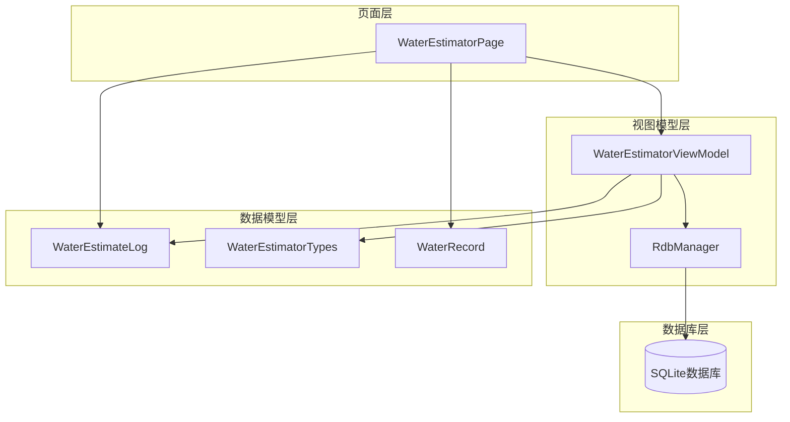
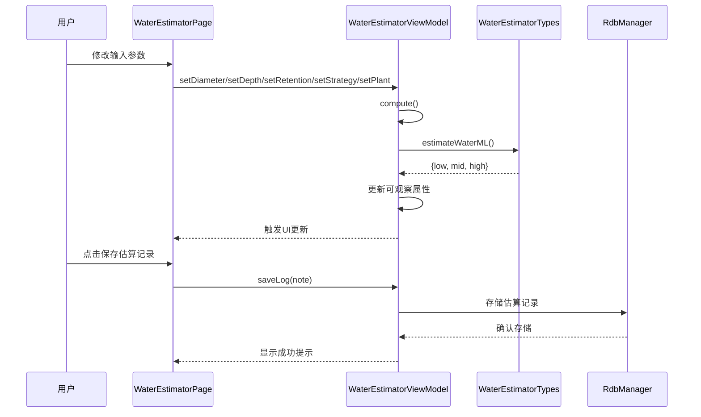
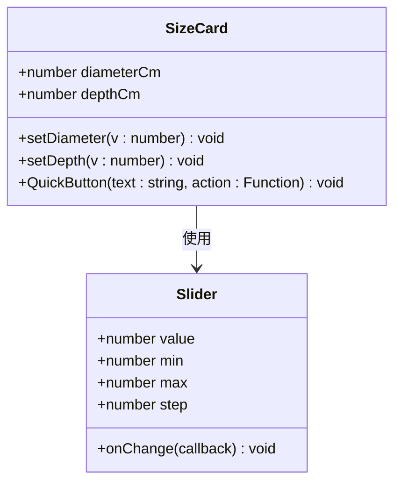
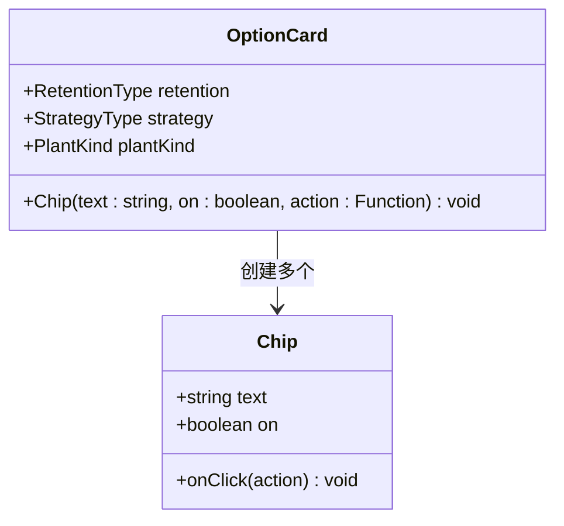
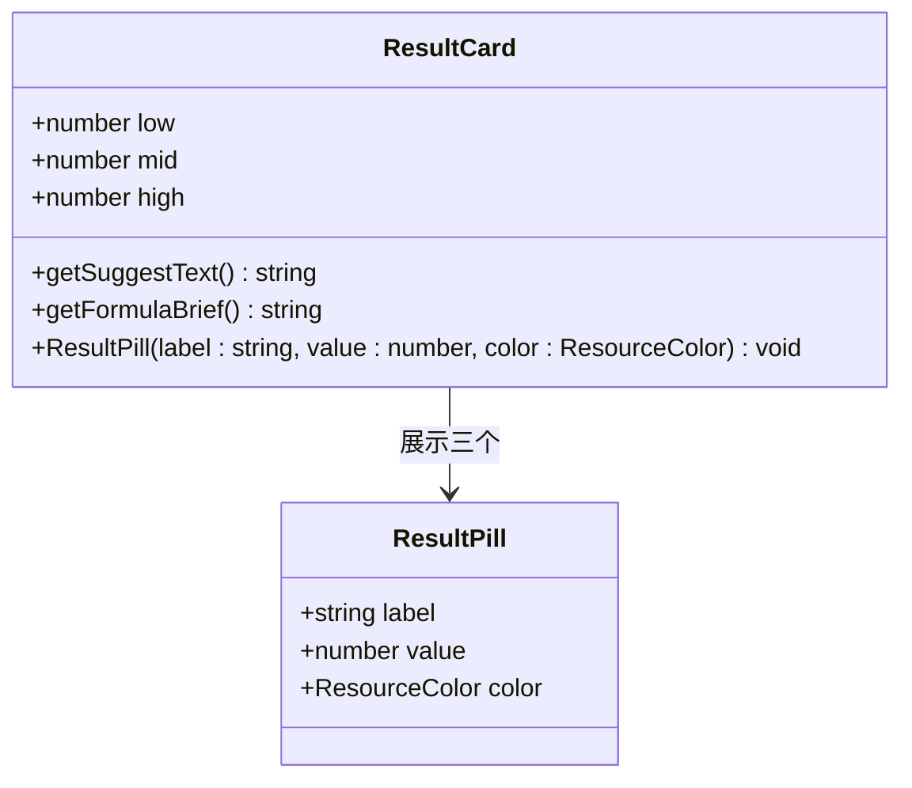
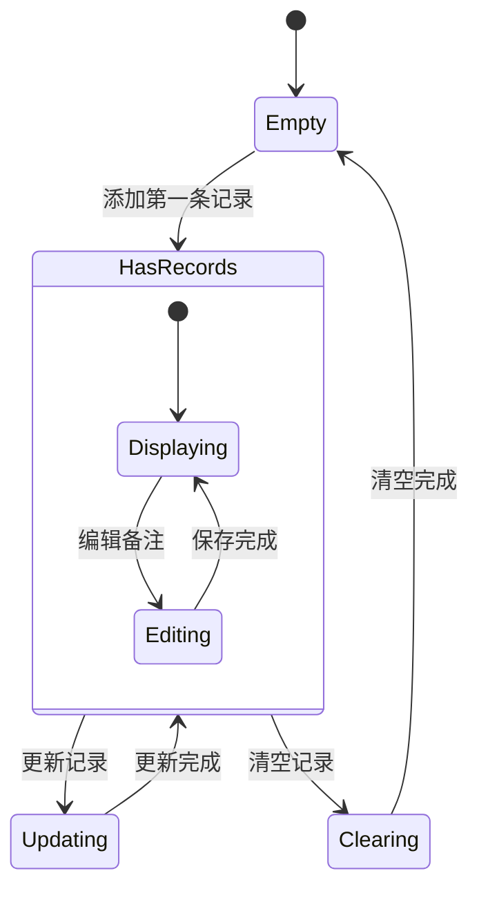
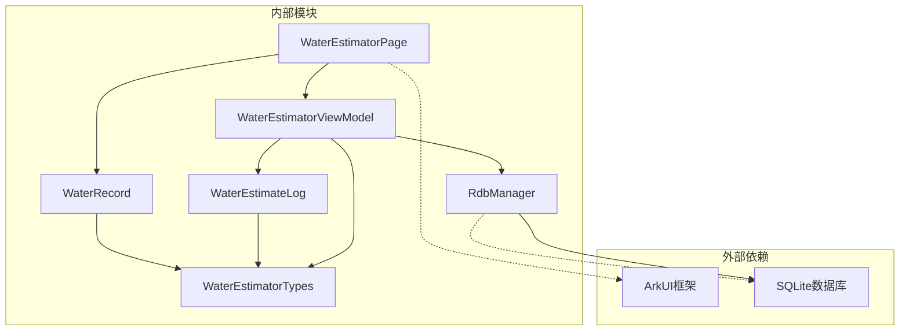
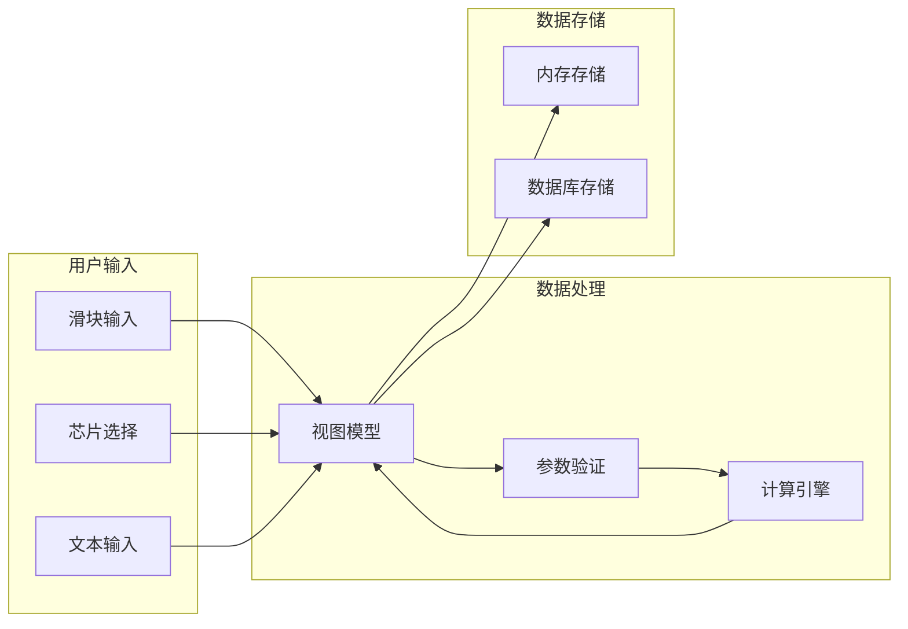

# WaterEstimatorPage浇水估算API

<cite>
**本文档引用的文件**
- [WaterEstimatorPage.ets](file://entry/src/main/ets/pages/WaterEstimatorPage.ets)
- [WaterEstimatorViewModel.ets](file://entry/src/main/ets/viewmodel/WaterEstimatorViewModel.ets)
- [WaterEstimateLog.ets](file://entry/src/main/ets/model/WaterEstimateLog.ets)
- [WaterEstimatorTypes.ets](file://entry/src/main/ets/model/WaterEstimatorTypes.ets)
- [WaterRecord.ets](file://entry/src/main/ets/model/WaterRecord.ets)
- [RdbManager.ets](file://entry/src/main/ets/viewmodel/RdbManager.ets)
</cite>

## 目录
1. [简介](#简介)
2. [项目结构](#项目结构)
3. [核心组件](#核心组件)
4. [架构概览](#架构概览)
5. [详细组件分析](#详细组件分析)
6. [依赖关系分析](#依赖关系分析)
7. [性能考虑](#性能考虑)
8. [故障排除指南](#故障排除指南)
9. [结论](#结论)

## 简介

WaterEstimatorPage是一个基于ArkTS的浇水估算页面，提供了完整的植物水量估算功能。该页面实现了从植物特性输入到最终估算结果展示的全流程，包括植物选择组件、参数输入表单、估算结果显示、历史记录管理等功能。

该系统采用MVVM架构模式，通过WaterEstimatorViewModel管理数据状态，WaterEstimatorPage负责UI渲染，WaterEstimateLog作为数据模型存储估算历史记录。系统集成了多种植物特性数据库、计算模型和用户交互处理机制。

## 项目结构

WaterEstimatorPage位于项目的页面层，与视图模型层和数据模型层协同工作：



**图表来源**
- [WaterEstimatorPage.ets:1-490](file://entry/src/main/ets/pages/WaterEstimatorPage.ets#L1-L490)
- [WaterEstimatorViewModel.ets:1-130](file://entry/src/main/ets/viewmodel/WaterEstimatorViewModel.ets#L1-L130)

**章节来源**
- [WaterEstimatorPage.ets:1-54](file://entry/src/main/ets/pages/WaterEstimatorPage.ets#L1-L54)
- [WaterEstimatorViewModel.ets:16-37](file://entry/src/main/ets/viewmodel/WaterEstimatorViewModel.ets#L16-L37)

## 核心组件

### 页面组件 (WaterEstimatorPage)

WaterEstimatorPage是整个估算功能的UI入口，采用装饰器模式实现响应式更新。页面包含以下主要区域：

- **头部区域**：显示页面标题和重置按钮
- **尺寸输入卡**：盆径和深度滑块输入
- **选项选择卡**：介质类型、浇水策略、植物类型的芯片选择
- **结果展示卡**：估算结果的区间值展示
- **保存操作栏**：估算记录保存和浇水决策记录
- **历史记录列表**：展示过往估算记录

### 视图模型 (WaterEstimatorViewModel)

WaterEstimatorViewModel是核心的状态管理组件，负责：

- 管理所有输入参数（盆径、深度、介质、策略、植物类型）
- 执行实时计算并更新结果
- 提供用户界面所需的标签和建议文本
- 管理历史记录的增删改查操作

### 数据模型 (WaterEstimateLog)

WaterEstimateLog是估算记录的数据模型，包含：

- 基本信息：ID、植物ID、创建时间
- 输入参数：盆径、深度、介质类型、策略、植物类型
- 计算结果：下限、推荐、上限值
- 用户备注：可选的估算说明

**章节来源**
- [WaterEstimatorPage.ets:9-490](file://entry/src/main/ets/pages/WaterEstimatorPage.ets#L9-L490)
- [WaterEstimatorViewModel.ets:16-129](file://entry/src/main/ets/viewmodel/WaterEstimatorViewModel.ets#L16-L129)
- [WaterEstimateLog.ets:6-24](file://entry/src/main/ets/model/WaterEstimateLog.ets#L6-L24)

## 架构概览

系统采用MVVM架构模式，实现了清晰的关注点分离：



**图表来源**
- [WaterEstimatorPage.ets:75-81](file://entry/src/main/ets/pages/WaterEstimatorPage.ets#L75-L81)
- [WaterEstimatorViewModel.ets:41-79](file://entry/src/main/ets/viewmodel/WaterEstimatorViewModel.ets#L41-L79)
- [WaterEstimatorViewModel.ets:105-123](file://entry/src/main/ets/viewmodel/WaterEstimatorViewModel.ets#L105-L123)

## 详细组件分析

### 水量估算计算引擎

水量估算采用多因子加权计算模型：

```mermaid
flowchart TD
Start([开始计算]) --> Input[收集输入参数]
Input --> Diameter[盆径(cm)]
Input --> Depth[深度(cm)]
Input --> Retention[介质系数]
Input --> Strategy[策略系数]
Input --> Plant[植物系数]
Diameter --> Volume[计算体积]
Depth --> Volume
Volume --> BaseVolume[基础体积 = π × (直径/2)² × 深度]
Retention --> Factor1[介质因子]
Strategy --> Factor2[策略因子]
Plant --> Factor3[植物因子]
BaseVolume --> Calc[基础计算]
Factor1 --> Calc
Factor2 --> Calc
Factor3 --> Calc
Calc --> Result[得到估算结果]
Result --> Range[生成区间值]
Range --> Output[输出结果]
```

**图表来源**
- [WaterEstimatorTypes.ets:163-175](file://entry/src/main/ets/model/WaterEstimatorTypes.ets#L163-L175)

#### 计算公式详解

水量估算采用以下公式：

**基础体积计算**：
- V = π × (盆径/2)² × 深度 × 0.55（孔隙率）

**加权系数**：
- 介质系数：根据土壤保水性调整
- 策略系数：根据浇水策略调整
- 植物系数：根据植物类型调整

**区间值生成**：
- 下限 = 基础值 × 0.8
- 推荐值 = 基础值 × 1.0
- 上限 = 基础值 × 1.2

**章节来源**
- [WaterEstimatorViewModel.ets:98-101](file://entry/src/main/ets/viewmodel/WaterEstimatorViewModel.ets#L98-L101)
- [WaterEstimatorTypes.ets:44-84](file://entry/src/main/ets/model/WaterEstimatorTypes.ets#L44-L84)

### 用户界面组件

#### 尺寸输入组件

尺寸输入组件提供直观的滑块和快捷按钮：



**图表来源**
- [WaterEstimatorPage.ets:92-167](file://entry/src/main/ets/pages/WaterEstimatorPage.ets#L92-L167)

#### 参数选择组件

参数选择组件采用芯片式设计，支持多选：



**图表来源**
- [WaterEstimatorPage.ets:181-304](file://entry/src/main/ets/pages/WaterEstimatorPage.ets#L181-L304)

#### 结果展示组件

结果展示组件提供清晰的区间值可视化：



**图表来源**
- [WaterEstimatorPage.ets:307-360](file://entry/src/main/ets/pages/WaterEstimatorPage.ets#L307-L360)

### 历史记录管理系统

历史记录系统采用内存存储和数据库持久化相结合的方式：



**图表来源**
- [WaterEstimatorViewModel.ets:105-123](file://entry/src/main/ets/viewmodel/WaterEstimatorViewModel.ets#L105-L123)
- [WaterEstimateLog.ets:20-23](file://entry/src/main/ets/model/WaterEstimateLog.ets#L20-L23)

**章节来源**
- [WaterEstimatorPage.ets:416-488](file://entry/src/main/ets/pages/WaterEstimatorPage.ets#L416-L488)
- [WaterEstimatorViewModel.ets:32-32](file://entry/src/main/ets/viewmodel/WaterEstimatorViewModel.ets#L32-L32)

## 依赖关系分析

系统各组件之间的依赖关系如下：



**图表来源**
- [WaterEstimatorPage.ets:4-7](file://entry/src/main/ets/pages/WaterEstimatorPage.ets#L4-L7)
- [WaterEstimatorViewModel.ets:4-8](file://entry/src/main/ets/viewmodel/WaterEstimatorViewModel.ets#L4-L8)

### 数据流分析



**图表来源**
- [WaterEstimatorViewModel.ets:41-79](file://entry/src/main/ets/viewmodel/WaterEstimatorViewModel.ets#L41-L79)
- [WaterEstimatorViewModel.ets:105-123](file://entry/src/main/ets/viewmodel/WaterEstimatorViewModel.ets#L105-L123)

**章节来源**
- [WaterEstimatorTypes.ets:8-84](file://entry/src/main/ets/model/WaterEstimatorTypes.ets#L8-L84)
- [RdbManager.ets:4-296](file://entry/src/main/ets/viewmodel/RdbManager.ets#L4-L296)

## 性能考虑

### 计算性能优化

1. **实时计算优化**：采用防抖机制避免频繁重算
2. **内存管理**：使用可观察属性减少不必要的UI重绘
3. **数据缓存**：对计算结果进行缓存，避免重复计算

### 存储性能优化

1. **索引优化**：为常用查询字段建立索引
2. **批量操作**：支持批量插入和查询操作
3. **数据压缩**：对历史记录进行适当的压缩存储

### 用户体验优化

1. **响应式更新**：参数变化立即反映到UI
2. **加载状态**：长时间操作显示加载指示器
3. **错误处理**：提供友好的错误提示和恢复机制

## 故障排除指南

### 常见问题及解决方案

#### 计算结果异常

**问题**：估算结果明显不合理
**可能原因**：
- 输入参数超出合理范围
- 介质类型选择不正确
- 植物类型与实际情况不符

**解决方法**：
1. 检查输入参数的有效性（盆径6-60cm，深度6-60cm）
2. 确认介质类型的选择符合实际使用情况
3. 重新评估植物类型分类

#### 数据存储问题

**问题**：历史记录无法保存或显示异常
**可能原因**：
- 数据库连接失败
- 存储空间不足
- 数据格式不正确

**解决方法**：
1. 检查数据库连接状态
2. 清理存储空间
3. 验证数据格式的正确性

#### UI响应问题

**问题**：页面操作响应迟缓
**可能原因**：
- 计算过于复杂
- 数据量过大
- 内存泄漏

**解决方法**：
1. 优化计算算法
2. 实现数据分页加载
3. 检查内存使用情况

**章节来源**
- [WaterEstimatorViewModel.ets:41-70](file://entry/src/main/ets/viewmodel/WaterEstimatorViewModel.ets#L41-L70)
- [RdbManager.ets:27-34](file://entry/src/main/ets/viewmodel/RdbManager.ets#L27-L34)

## 结论

WaterEstimatorPage浇水估算API提供了一个完整、高效的植物水量估算解决方案。系统采用现代化的MVVM架构，结合直观的用户界面和精确的计算模型，为用户提供了一站式的浇水估算服务。

### 主要优势

1. **用户体验优秀**：直观的滑块输入和芯片选择，实时反馈计算结果
2. **计算准确可靠**：基于多种植物特性和环境因素的综合计算
3. **数据管理完善**：支持历史记录管理和数据持久化
4. **扩展性强**：模块化设计便于功能扩展和维护

### 技术特点

1. **响应式设计**：自动响应参数变化，无需手动触发计算
2. **数据驱动**：基于可观察属性的状态管理
3. **类型安全**：完整的TypeScript类型定义
4. **异步处理**：支持数据库的异步操作

该系统为植物养护管理提供了重要的技术支持，通过科学的水量估算帮助用户更好地照顾植物健康生长。