# 工具页面API

<cite>
**本文档引用的文件**
- [EText.ets](file://entry/src/main/ets/pages/EText.ets)
- [CompareSliderV2.ets](file://entry/src/main/ets/pages/CompareSliderV2.ets)
- [PhotoAttachBar.ets](file://entry/src/main/ets/view/PhotoAttachBar.ets)
- [PhotoPreviewSheet.ets](file://entry/src/main/ets/view/PhotoPreviewSheet.ets)
- [CalendarView.ets](file://entry/src/main/ets/view/CalendarView.ets)
- [CalendarGrid.ets](file://entry/src/main/ets/view/CalendarGrid.ets)
- [WateringViewModel.ets](file://entry/src/main/ets/viewmodel/WateringViewModel.ets)
- [ConfirmDialogSheet.ets](file://entry/src/main/ets/view/ConfirmDialogSheet.ets)
- [EditPlantSheet.ets](file://entry/src/main/ets/view/EditPlantSheet.ets)
</cite>

## 目录
1. [简介](#简介)
2. [项目结构](#项目结构)
3. [核心组件](#核心组件)
4. [架构概览](#架构概览)
5. [详细组件分析](#详细组件分析)
6. [依赖关系分析](#依赖关系分析)
7. [性能考虑](#性能考虑)
8. [故障排除指南](#故障排除指南)
9. [结论](#结论)
10. [附录](#附录)

## 简介

本文档为PlantDiary项目中的工具页面API提供全面的技术文档，重点涵盖以下核心功能模块：

- **EText文本测试页面**：提供智能文本折叠/展开功能，支持二分查找算法进行精确的文本截断
- **CompareSliderV2滑块对比页面**：实现图片对比的多种模式（分割、滑动、淡入淡出），支持手势交互和精确控制
- **图片附件管理**：提供照片上传、预览、删除的完整工作流
- **日历视图组件**：支持抽屉式和内嵌式的日历展示，集成任务管理和筛选功能

本指南详细记录了组件属性配置、事件处理、样式定制等接口，提供组件使用示例、性能优化建议和扩展开发指南，涵盖组件生命周期管理、状态同步、用户交互响应等技术实现。

## 项目结构

PlantDiary项目采用基于功能模块的组织方式，工具页面API主要分布在以下目录结构中：

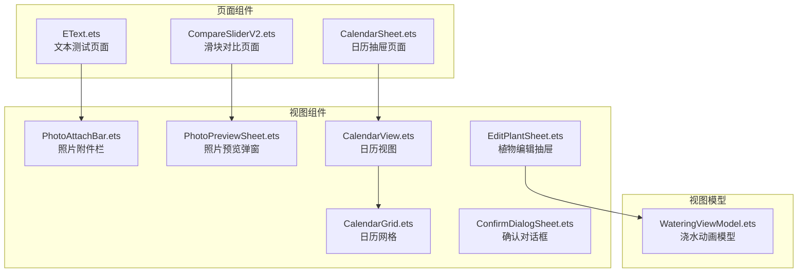

**图表来源**
- [EText.ets:1-128](file://entry/src/main/ets/pages/EText.ets#L1-L128)
- [CompareSliderV2.ets:1-448](file://entry/src/main/ets/pages/CompareSliderV2.ets#L1-L448)
- [PhotoAttachBar.ets:1-100](file://entry/src/main/ets/view/PhotoAttachBar.ets#L1-L100)
- [PhotoPreviewSheet.ets:1-223](file://entry/src/main/ets/view/PhotoPreviewSheet.ets#L1-L223)

**章节来源**
- [EText.ets:1-128](file://entry/src/main/ets/pages/EText.ets#L1-L128)
- [CompareSliderV2.ets:1-448](file://entry/src/main/ets/pages/CompareSliderV2.ets#L1-L448)

## 核心组件

### 文本渲染组件

EText组件提供了智能的文本折叠/展开功能，通过二分查找算法实现精确的文本截断：

**核心特性：**
- 自适应文本测量和截断
- 二分查找算法优化文本长度计算
- 智能展开/折叠切换
- 响应式布局适配

**关键实现机制：**
- 使用UI上下文的测量工具进行文本尺寸计算
- 二分搜索定位恰好适合指定行数的文本长度
- 动态计算文本高度差异决定是否需要处理

**章节来源**
- [EText.ets:23-105](file://entry/src/main/ets/pages/EText.ets#L23-L105)

### 滑块交互组件

CompareSliderV2组件实现了图片对比的多种模式，支持复杂的手势交互：

**核心特性：**
- 三种对比模式：分割、滑动、淡入淡出
- 多点触控手势支持：单指拖动、双指缩放
- 实时对齐模式和网格辅助
- 精确滑杆同步控制

**对比模式详解：**
- **分割模式**：中央拖杆分割图片，支持拖动调整分割比例
- **滑动模式**：左右滑动切换图片，支持手势平移
- **淡入淡出模式**：透明度渐变过渡，支持手势调节

**章节来源**
- [CompareSliderV2.ets:50-448](file://entry/src/main/ets/pages/CompareSliderV2.ets#L50-L448)

### 图片附件管理

PhotoAttachBar组件提供完整的照片附件管理功能：

**核心功能：**
- 横向缩略图滚动展示
- 添加照片按钮交互
- 删除确认机制
- 预览功能集成

**设计特点：**
- 响应式布局适配不同屏幕尺寸
- 圆角卡片设计提升视觉体验
- 事件驱动的交互模式

**章节来源**
- [PhotoAttachBar.ets:17-99](file://entry/src/main/ets/view/PhotoAttachBar.ets#L17-L99)

## 架构概览

系统采用组件化的架构设计，各功能模块相互独立又有机协作：

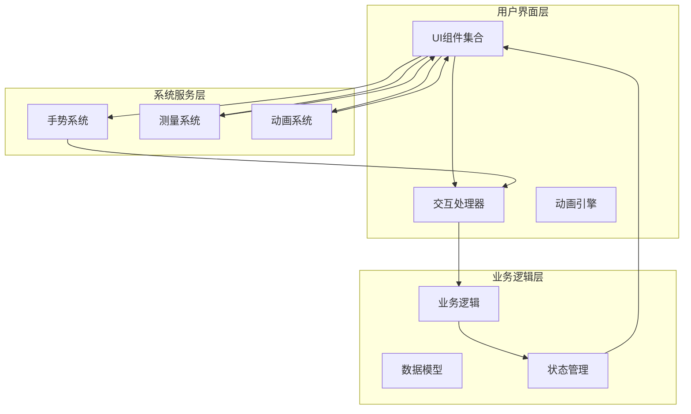

**图表来源**
- [CompareSliderV2.ets:115-135](file://entry/src/main/ets/pages/CompareSliderV2.ets#L115-L135)
- [EText.ets:51-63](file://entry/src/main/ets/pages/EText.ets#L51-L63)

## 详细组件分析

### EText 文本测试组件

#### 组件架构

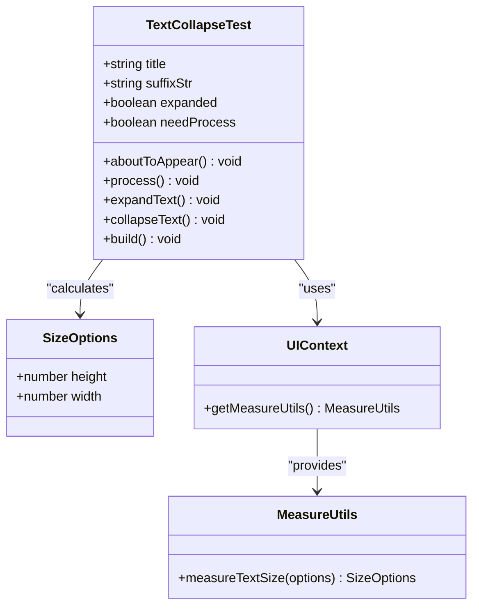

**图表来源**
- [EText.ets:16-128](file://entry/src/main/ets/pages/EText.ets#L16-L128)

#### 文本处理流程

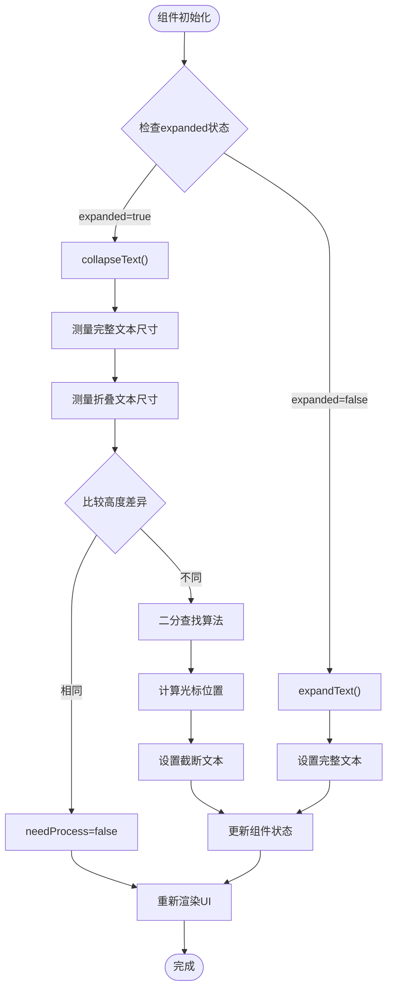

**图表来源**
- [EText.ets:27-105](file://entry/src/main/ets/pages/EText.ets#L27-L105)

#### 关键API接口

**组件属性：**
- `title`: string - 显示的文本内容
- `suffixStr`: string - 后缀字符串（展开/折叠按钮）
- `expanded`: boolean - 当前展开状态
- `needProcess`: boolean - 是否需要处理文本

**事件处理：**
- `process()`: void - 文本处理主函数
- `expandText()`: void - 展开文本
- `collapseText()`: void - 折叠文本

**章节来源**
- [EText.ets:16-128](file://entry/src/main/ets/pages/EText.ets#L16-L128)

### CompareSliderV2 滑块对比组件

#### 组件架构

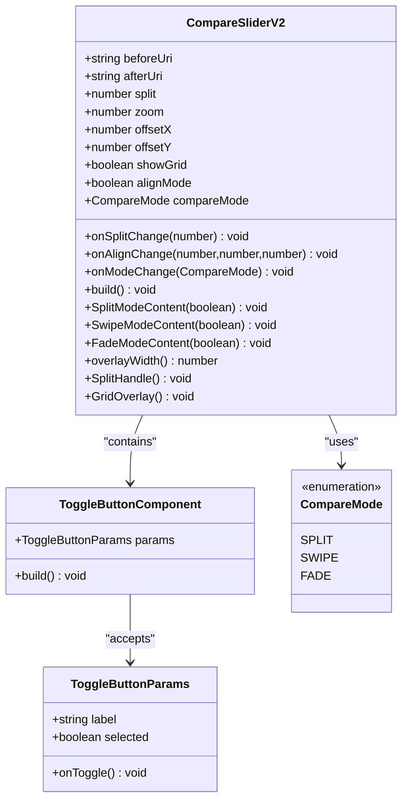

**图表来源**
- [CompareSliderV2.ets:50-448](file://entry/src/main/ets/pages/CompareSliderV2.ets#L50-L448)

#### 手势交互序列

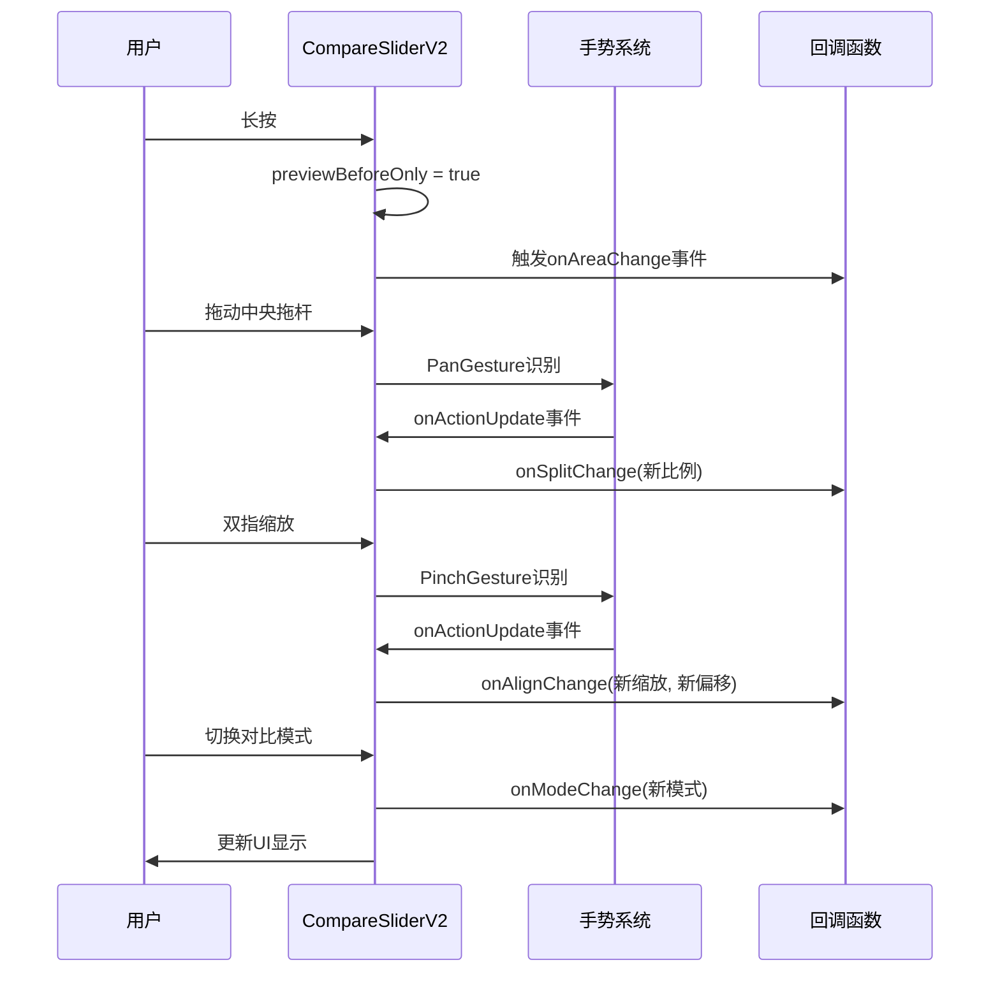

**图表来源**
- [CompareSliderV2.ets:125-135](file://entry/src/main/ets/pages/CompareSliderV2.ets#L125-L135)
- [CompareSliderV2.ets:229-250](file://entry/src/main/ets/pages/CompareSliderV2.ets#L229-L250)

#### 对比模式实现

| 模式 | 主要特征 | 手势支持 | 适用场景 |
|------|----------|----------|----------|
| 分割模式 | 中央拖杆分割 | 拖动、缩放、平移 | 精确对比两个版本 |
| 滑动模式 | 左右滑动切换 | 拖动、缩放 | 快速浏览对比 |
| 淡入淡出模式 | 透明度渐变 | 拖动、缩放 | 观察细节变化 |

**章节来源**
- [CompareSliderV2.ets:9-13](file://entry/src/main/ets/pages/CompareSliderV2.ets#L9-L13)
- [CompareSliderV2.ets:215-330](file://entry/src/main/ets/pages/CompareSliderV2.ets#L215-L330)

### 图片附件管理组件

#### PhotoAttachBar 组件

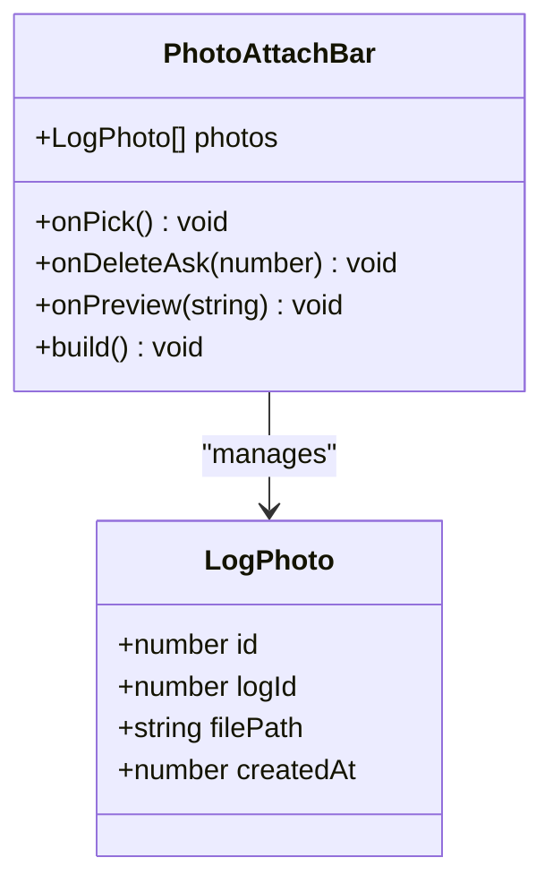

**图表来源**
- [PhotoAttachBar.ets:18-99](file://entry/src/main/ets/view/PhotoAttachBar.ets#L18-L99)

#### PhotoPreviewSheet 组件

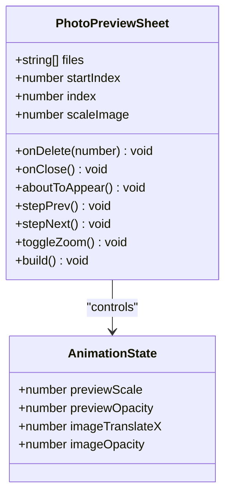

**图表来源**
- [PhotoPreviewSheet.ets:2-223](file://entry/src/main/ets/view/PhotoPreviewSheet.ets#L2-L223)

**章节来源**
- [PhotoAttachBar.ets:17-99](file://entry/src/main/ets/view/PhotoAttachBar.ets#L17-L99)
- [PhotoPreviewSheet.ets:1-223](file://entry/src/main/ets/view/PhotoPreviewSheet.ets#L1-L223)

### 日历视图组件

#### CalendarView 组件

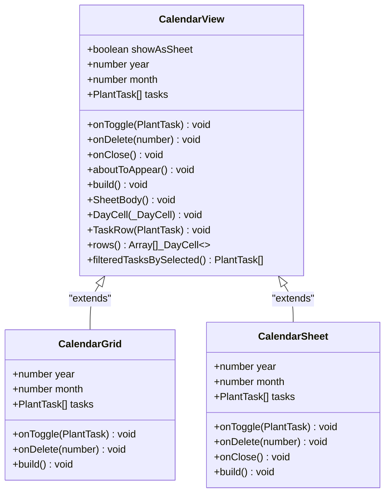

**图表来源**
- [CalendarView.ets:5-566](file://entry/src/main/ets/view/CalendarView.ets#L5-L566)

**章节来源**
- [CalendarView.ets:1-566](file://entry/src/main/ets/view/CalendarView.ets#L1-L566)
- [CalendarGrid.ets:1-351](file://entry/src/main/ets/view/CalendarGrid.ets#L1-L351)

## 依赖关系分析

系统组件之间的依赖关系呈现清晰的层次结构：

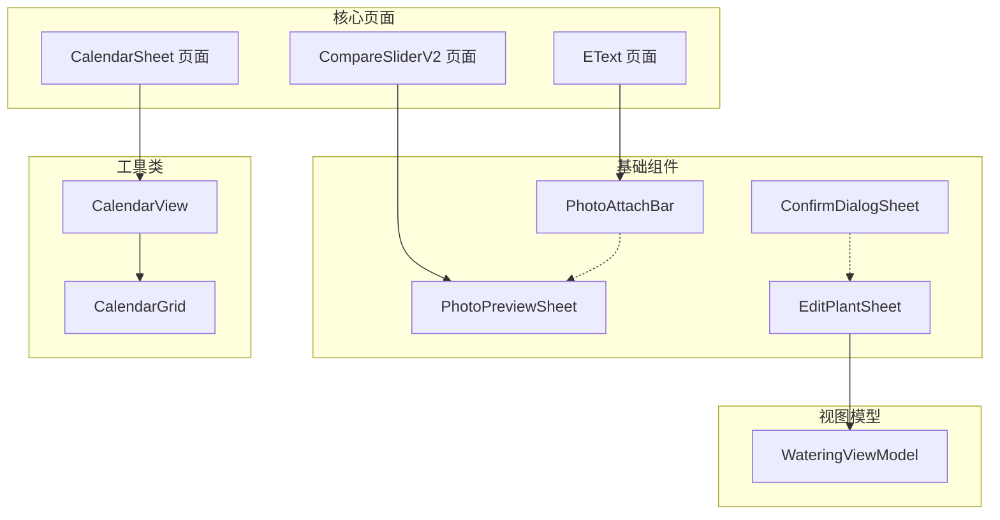

**图表来源**
- [WateringViewModel.ets:11-102](file://entry/src/main/ets/viewmodel/WateringViewModel.ets#L11-L102)

**章节来源**
- [WateringViewModel.ets:1-102](file://entry/src/main/ets/viewmodel/WateringViewModel.ets#L1-L102)

## 性能考虑

### 文本处理优化

EText组件采用了高效的二分查找算法来优化文本截断过程：

**性能优化策略：**
- 使用二分搜索减少文本测量次数
- 缓存测量结果避免重复计算
- 条件渲染减少不必要的DOM更新
- 响应式布局提升适配效率

**优化建议：**
- 对于长文本，考虑分段处理
- 合理设置测量缓存策略
- 避免频繁的状态变更触发重绘

### 图片对比性能

CompareSliderV2组件在手势处理方面进行了多项性能优化：

**性能优化策略：**
- 手势事件节流处理
- 实时缩放计算优化
- 精确滑杆同步控制
- 网格绘制性能优化

**优化建议：**
- 合理设置手势识别阈值
- 优化图像加载和缓存
- 考虑异步处理复杂计算

### 内存管理

组件生命周期管理确保了资源的有效利用：

**内存管理策略：**
- 组件销毁时清理事件监听
- 合理使用@Local状态避免泄漏
- 及时释放大对象引用
- 优化数组和对象的创建销毁

## 故障排除指南

### 文本渲染问题

**常见问题及解决方案：**

1. **文本截断不准确**
   - 检查TEXT_WIDTH常量设置
   - 验证字体大小和样式配置
   - 确认measureTextSize调用参数

2. **折叠功能异常**
   - 检查needProcess标志位状态
   - 验证二分查找算法逻辑
   - 确认容器尺寸测量准确性

**章节来源**
- [EText.ets:27-105](file://entry/src/main/ets/pages/EText.ets#L27-L105)

### 手势交互问题

**常见问题及解决方案：**

1. **滑块拖动不灵敏**
   - 检查overlayWidth计算逻辑
   - 验证容器尺寸获取时机
   - 确认手势事件处理顺序

2. **图片缩放异常**
   - 检查zoom参数范围限制
   - 验证缩放中心点计算
   - 确认平移增量计算

3. **模式切换失效**
   - 检查compareMode状态同步
   - 验证onModeChange回调执行
   - 确认UI重新渲染触发

**章节来源**
- [CompareSliderV2.ets:371-422](file://entry/src/main/ets/pages/CompareSliderV2.ets#L371-L422)

### 图片管理问题

**常见问题及解决方案：**

1. **照片预览失败**
   - 检查文件路径格式
   - 验证文件权限设置
   - 确认图片格式兼容性

2. **附件栏显示异常**
   - 检查photos数组数据结构
   - 验证LogPhoto对象完整性
   - 确认事件回调正确绑定

**章节来源**
- [PhotoPreviewSheet.ets:17-34](file://entry/src/main/ets/view/PhotoPreviewSheet.ets#L17-L34)
- [PhotoAttachBar.ets:19-99](file://entry/src/main/ets/view/PhotoAttachBar.ets#L19-L99)

## 结论

PlantDiary项目的工具页面API展现了现代移动应用开发的最佳实践：

**技术优势：**
- 组件化架构设计清晰，职责分离明确
- 手势交互处理流畅，用户体验优秀
- 性能优化策略完善，运行效率高
- 错误处理机制健全，稳定性良好

**扩展价值：**
- 模块化设计便于功能扩展
- 清晰的API接口支持二次开发
- 完善的文档体系降低维护成本
- 良好的代码结构促进团队协作

该API体系为植物养护应用提供了强大的工具支持，通过智能化的文本处理、直观的图片对比、便捷的照片管理等功能，显著提升了用户的操作体验和工作效率。

## 附录

### 组件生命周期管理

所有组件都遵循ArkTS的生命周期规范：

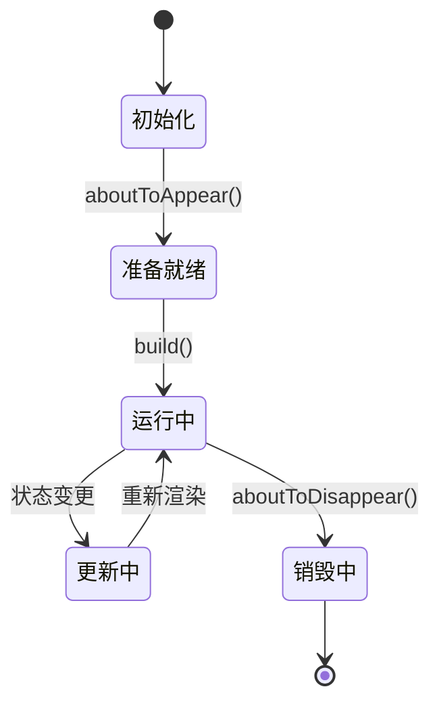

### 状态同步机制

组件间的状态同步通过事件驱动的方式实现：

- **父子组件通信**：通过@Event回调传递状态变化
- **兄弟组件通信**：通过共享的ViewModel进行状态同步
- **全局状态管理**：通过Observable模式实现跨组件状态共享

### 用户交互响应

系统提供了完善的用户交互响应机制：

- **触摸事件**：支持单击、长按、拖拽等多种手势
- **键盘事件**：提供键盘避免模式和输入处理
- **动画反馈**：通过animateTo实现流畅的过渡效果
- **视觉反馈**：通过阴影、圆角等视觉元素增强交互体验