# 页面API

<cite>
**本文档引用的文件**
- [Index.ets](file://entry/src/main/ets/pages/Index.ets)
- [PlantListPage.ets](file://entry/src/main/ets/pages/PlantListPage.ets)
- [StatsPage.ets](file://entry/src/main/ets/pages/StatsPage.ets)
- [PlantDetail.ets](file://entry/src/main/ets/pages/PlantDetail.ets)
- [TaskListPage.ets](file://entry/src/main/ets/pages/TaskListPage.ets)
- [PlantLogPage.ets](file://entry/src/main/ets/pages/PlantLogPage.ets)
- [WaterEstimatorPage.ets](file://entry/src/main/ets/pages/WaterEstimatorPage.ets)
- [LightExposurePage.ets](file://entry/src/main/ets/pages/LightExposurePage.ets)
- [GrowthIndicatorPage.ets](file://entry/src/main/ets/pages/GrowthIndicatorPage.ets)
- [GrowthComparePage.ets](file://entry/src/main/ets/pages/GrowthComparePage.ets)
- [RdbManager.ets](file://entry/src/main/ets/viewmodel/RdbManager.ets)
- [PlantModel.ets](file://entry/src/main/ets/model/PlantModel.ets)
- [PlantLogModel.ets](file://entry/src/main/ets/model/PlantLogModel.ets)
- [WateringViewModel.ets](file://entry/src/main/ets/viewmodel/WateringViewModel.ets)
- [WaterEstimatorViewModel.ets](file://entry/src/main/ets/viewmodel/WaterEstimatorViewModel.ets)
- [PlantCard.ets](file://entry/src/main/ets/view/PlantCard.ets)
- [TaskItem.ets](file://entry/src/main/ets/view/TaskItem.ets)
</cite>

## 目录
1. [简介](#简介)
2. [项目结构](#项目结构)
3. [核心组件](#核心组件)
4. [架构总览](#架构总览)
5. [详细组件分析](#详细组件分析)
6. [依赖关系分析](#依赖关系分析)
7. [性能考虑](#性能考虑)
8. [故障排查指南](#故障排查指南)
9. [结论](#结论)
10. [附录](#附录)

## 简介
本页面API文档面向植物日记项目，聚焦核心页面组件的路由接口、导航方法与状态管理API。涵盖Index主页面、PlantListPage植物列表、StatsPage统计页面等，并提供页面间数据传递机制、导航参数与返回值处理、生命周期钩子与状态持久化接口。文档同时给出路由配置建议、导航示例与用户体验优化建议，帮助开发者快速理解与扩展页面能力。

## 项目结构
项目采用按页面与功能模块分层组织，页面位于pages目录，数据模型位于model目录，视图模型位于viewmodel目录，公共视图组件位于view目录。数据库访问通过RdbManager集中管理，页面通过@Provider/@Consumer注入全局状态与存储实例。

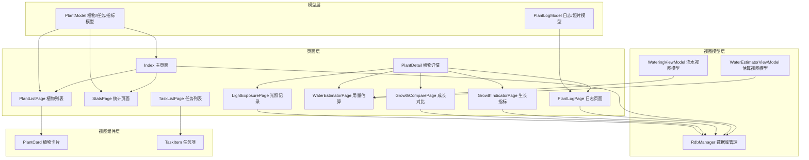

**图表来源**
- [Index.ets:1-1382](file://entry/src/main/ets/pages/Index.ets#L1-L1382)
- [PlantListPage.ets:1-228](file://entry/src/main/ets/pages/PlantListPage.ets#L1-L228)
- [StatsPage.ets:1-442](file://entry/src/main/ets/pages/StatsPage.ets#L1-L442)
- [PlantDetail.ets:1-136](file://entry/src/main/ets/pages/PlantDetail.ets#L1-L136)
- [TaskListPage.ets:1-463](file://entry/src/main/ets/pages/TaskListPage.ets#L1-L463)
- [PlantLogPage.ets:1-1030](file://entry/src/main/ets/pages/PlantLogPage.ets#L1-L1030)
- [WaterEstimatorPage.ets:1-490](file://entry/src/main/ets/pages/WaterEstimatorPage.ets#L1-L490)
- [LightExposurePage.ets:1-806](file://entry/src/main/ets/pages/LightExposurePage.ets#L1-L806)
- [GrowthIndicatorPage.ets:1-605](file://entry/src/main/ets/pages/GrowthIndicatorPage.ets#L1-L605)
- [GrowthComparePage.ets:1-477](file://entry/src/main/ets/pages/GrowthComparePage.ets#L1-L477)
- [RdbManager.ets:1-296](file://entry/src/main/ets/viewmodel/RdbManager.ets#L1-L296)
- [PlantModel.ets:1-166](file://entry/src/main/ets/model/PlantModel.ets#L1-L166)
- [PlantLogModel.ets:1-58](file://entry/src/main/ets/model/PlantLogModel.ets#L1-L58)
- [WateringViewModel.ets:1-102](file://entry/src/main/ets/viewmodel/WateringViewModel.ets#L1-L102)
- [WaterEstimatorViewModel.ets:1-130](file://entry/src/main/ets/viewmodel/WaterEstimatorViewModel.ets#L1-L130)
- [PlantCard.ets:1-326](file://entry/src/main/ets/view/PlantCard.ets#L1-L326)
- [TaskItem.ets:1-67](file://entry/src/main/ets/view/TaskItem.ets#L1-L67)

**章节来源**
- [Index.ets:1-1382](file://entry/src/main/ets/pages/Index.ets#L1-L1382)
- [RdbManager.ets:1-296](file://entry/src/main/ets/viewmodel/RdbManager.ets#L1-L296)

## 核心组件
本节概述各核心页面的职责、参数、事件与状态管理要点，便于快速定位API。

- Index 主页面
  - 职责：应用状态中枢，统一初始化数据库、加载植物/任务/模板等全局数据，提供横纵向筛选、任务过滤、指标/模板/日历等入口。
  - 关键状态：plants、tasks、templates、metrics、banner、筛选/排序状态、日历年月等。
  - 关键方法：initDb、reloadAll、loadPlants、loadTasks、loadTemplates、openMetricChart、cleanupOrphanPhotos、bulkCreateRecurringTasks、generateTemplateTasks、showBanner、openPanel/closePanel、filteredPlants 等。
  - 导航：通过NavPathStack pushPathByName跳转至PlantDetail、Stats、TaskList、PlantLog、WaterEstimator、LightExposure、GrowthIndicator、GrowthCompare、EmergencyAndRotate、MixPlanner等页面。

- PlantListPage 植物列表
  - 参数：plants(Array<Plant>)、allTasks(Array<PlantTask>)。
  - 事件：onOpenDetail、onQuickAdd、onEdit、onDeleteAsk、onOpenTemplate、onOpenTemplatenew、onOpenLogs、onOpenWaterEstimator、onOpenMetrics、onOpenEmergencyAndRotate、onOpenMetric。
  - 状态：selectedSpecies、sortKey、Header(builder)。
  - 方法：filteredAndSortedPlants、speciesChips、plantTaskDone/plantTaskTotal/plantRatePct/ratioString。

- StatsPage 统计页面
  - 参数：plants(Array<Plant>)、tasks(Array<PlantTask>)。
  - 事件：onReloadAll、onOpenMixPlanner。
  - 状态：weekOption(图表配置)。
  - 方法：plantCount/taskCount/doneCount/inProgressCount/overdueCount/next7Count/doneLast7/streakDays/typeCount/topPlantName/topPlantCount/weekLabels/weekDoneCounts/refreshWeekOption。

- PlantDetail 植物详情
  - 参数：pageStack(NavPathStack)。
  - 事件：无。
  - 方法：Header/PlantInfoCard/QuickActionGrid/ActionCard。
  - 导航：pushPathByName跳转至PlantLogPage、LightExposurePage、GrowthIndicatorPage、GrowthComparePage、WaterEstimatorPage、EmergencyAndRotatePage。

- TaskListPage 任务列表
  - 参数：tasks(Array<PlantTask>)、plants(Array<Plant>)。
  - 事件：onToggle、onDeleteAsk、onCreateTask。
  - 状态：viewMode、currentMonthISO、filterTab、typeFilter、keyword、filterVisible、sortKey、sortAsc、daySheetVisible、selectedDateISO。
  - 方法：filteredTasks、tasksOfDate、typesChips、isMatchTab/isMatchType/isMatchKeyword、changeMonth。

- PlantLogPage 日志页面
  - 参数：pageStack、RdbManager、store。
  - 状态：plantName、logs、photos、keyword、logPlantId、noteText、dateISO、sortAsc、selectMode、selected、previewVisible、photoPreviewVisible、bannerMsg/banerType。
  - 方法：loadLogsWithPhotos、onAddLog、onDeleteLog、deleteLogAndPhotos、onBatchDeleteLogs、onPickPhotos、pickAndSavePhotos、ensurePhotosDir、copyImageToAppFiles、insertLogPhoto、deletePhotoByFilePath、openPhotoPreview、bulkDeleteLogsTx。

- WaterEstimatorPage 用量估算
  - 参数：plantId(number)。
  - 状态：vm(WaterEstimatorViewModel)、noteText。
  - 方法：Header/SizeCard/OptionCard/ResultCard/SaveBar/LogList、重置参数、保存日志、记录推荐用量。

- LightExposurePage 光照记录
  - 参数：plant(Plant)。
  - 状态：vm(LightExposureViewModel)、startDlg、instantDlg。
  - 方法：RingAndStatus/ProfileCard/SevenDaysChart、删除会话、定时刷新进度。

- GrowthIndicatorPage 生长指标
  - 参数：pageStack、plant(Plant)。
  - 状态：metrics、store、hStr/wStr/sStr/dateISO、chartKey、sortAsc、showChart、defOption。
  - 方法：loadMetrics/addMetric/deleteMetric/updateChartData/sorted/barHeight/tickLabel/dateFromTs/todayISO/safeNum/clampScore/isoToTs/toXAxis。

- GrowthComparePage 成长对比
  - 参数：pageStack、store、plant(Plant)。
  - 状态：photos、selIdx、picking。
  - 方法：MainSlider/PreviewGrid/TimeTip、loadPhotos/pickAndAddPhoto/ensurePhotosDir/copyImageToAppFiles/insertTemporaryPhoto。

**章节来源**
- [Index.ets:1-1382](file://entry/src/main/ets/pages/Index.ets#L1-L1382)
- [PlantListPage.ets:1-228](file://entry/src/main/ets/pages/PlantListPage.ets#L1-L228)
- [StatsPage.ets:1-442](file://entry/src/main/ets/pages/StatsPage.ets#L1-L442)
- [PlantDetail.ets:1-136](file://entry/src/main/ets/pages/PlantDetail.ets#L1-L136)
- [TaskListPage.ets:1-463](file://entry/src/main/ets/pages/TaskListPage.ets#L1-L463)
- [PlantLogPage.ets:1-1030](file://entry/src/main/ets/pages/PlantLogPage.ets#L1-L1030)
- [WaterEstimatorPage.ets:1-490](file://entry/src/main/ets/pages/WaterEstimatorPage.ets#L1-L490)
- [LightExposurePage.ets:1-806](file://entry/src/main/ets/pages/LightExposurePage.ets#L1-L806)
- [GrowthIndicatorPage.ets:1-605](file://entry/src/main/ets/pages/GrowthIndicatorPage.ets#L1-L605)
- [GrowthComparePage.ets:1-477](file://entry/src/main/ets/pages/GrowthComparePage.ets#L1-L477)

## 架构总览
页面通过@Provider/@Consumer注入全局状态与数据库实例，Index作为状态中枢负责初始化与全局数据同步。页面间通过NavPathStack进行导航，参数通过pushPathByName传递，返回值通过onBackPressed或回调事件处理。数据库操作通过RdbManager集中管理，支持事务与索引优化。

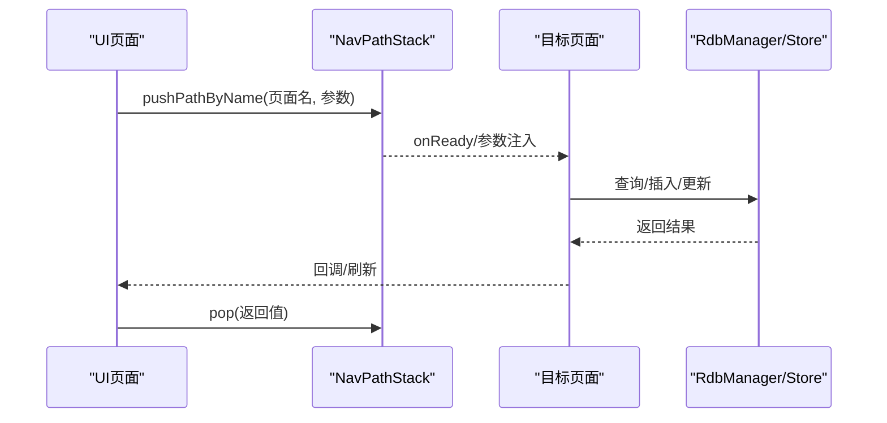

**图表来源**
- [Index.ets:1-1382](file://entry/src/main/ets/pages/Index.ets#L1-L1382)
- [PlantDetail.ets:1-136](file://entry/src/main/ets/pages/PlantDetail.ets#L1-L136)
- [PlantLogPage.ets:1-1030](file://entry/src/main/ets/pages/PlantLogPage.ets#L1-L1030)
- [RdbManager.ets:1-296](file://entry/src/main/ets/viewmodel/RdbManager.ets#L1-L296)

## 详细组件分析

### Index 主页面 API
- 路由与导航
  - 导航入口：通过NavPathStack.pushPathByName跳转至PlantDetail、Stats、TaskList、PlantLog、WaterEstimator、LightExposure、GrowthIndicator、GrowthCompare、EmergencyAndRotate、MixPlanner等页面。
  - 参数传递：Plant对象、plantId、日期字符串等。
- 状态管理
  - 全局状态：plants、tasks、templates、metrics、banner、筛选/排序状态、日历年月等。
  - 生命周期：aboutToAppear中初始化数据库并加载全局数据。
- 数据持久化
  - 数据库初始化：initDb、reloadAll、loadPlants、loadTasks、loadTemplates。
  - 指标管理：loadMetricsByPlant、createMetric、deleteMetric、isoToTs。
  - 植物/任务/模板CRUD：createPlant/updatePlant/deletePlant、createTask/toggleTaskDone/deleteTask、createTpl/updateTpl/deleteTpl、bulkCreateRecurringTasks、applyTplToPlant、generateTemplateTasks。
  - 清理：cleanupOrphanPhotos。
- 用户体验
  - 提示横幅：showBanner。
  - 实时光照状态：refreshActiveSessions通过AppStorage广播卡片层。

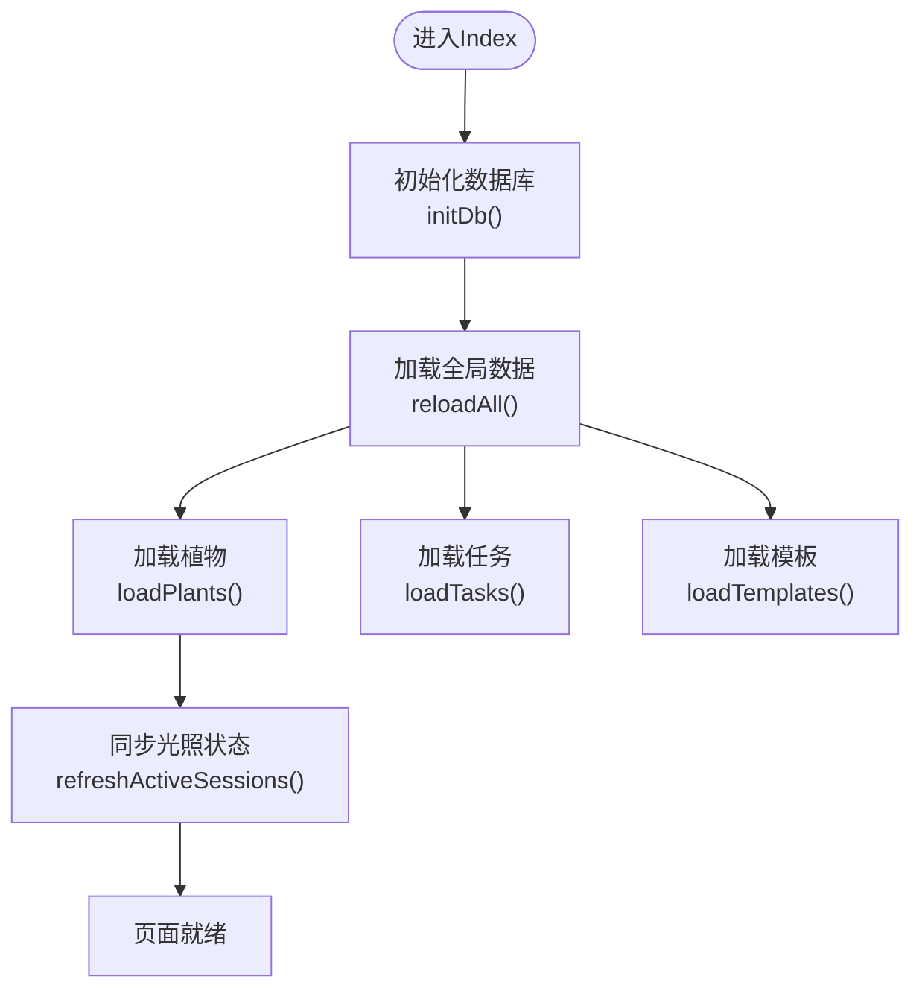

**图表来源**
- [Index.ets:116-141](file://entry/src/main/ets/pages/Index.ets#L116-L141)

**章节来源**
- [Index.ets:116-1382](file://entry/src/main/ets/pages/Index.ets#L116-L1382)

### PlantListPage 植物列表 API
- 参数与事件
  - @Param：plants(Array<Plant>)、allTasks(Array<PlantTask>)。
  - @Event：onOpenDetail、onQuickAdd、onEdit、onDeleteAsk、onOpenTemplate、onOpenTemplatenew、onOpenLogs、onOpenWaterEstimator、onOpenMetrics、onOpenEmergencyAndRotate、onOpenMetric。
- 状态与筛选
  - selectedSpecies、sortKey、Header(builder)。
- 方法
  - filteredAndSortedPlants、speciesChips、plantTaskDone/plantTaskTotal/plantRatePct/ratioString。
- 用户体验
  - 物种芯片与排序芯片，支持本地筛选与排序，避免重复计算。

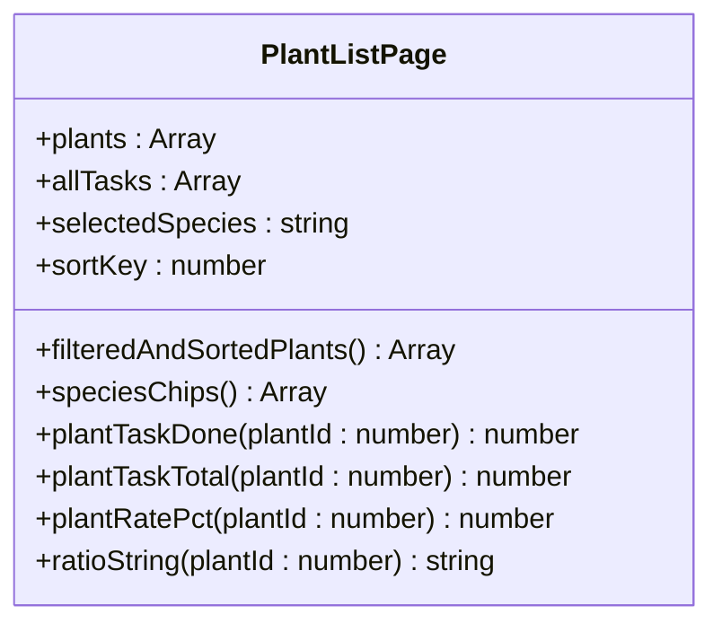

**图表来源**
- [PlantListPage.ets:1-228](file://entry/src/main/ets/pages/PlantListPage.ets#L1-L228)

**章节来源**
- [PlantListPage.ets:1-228](file://entry/src/main/ets/pages/PlantListPage.ets#L1-L228)

### StatsPage 统计页面 API
- 参数与事件
  - @Param：plants(Array<Plant>)、tasks(Array<PlantTask>)。
  - @Event：onReloadAll、onOpenMixPlanner。
- 状态
  - weekOption(图表配置)。
- 方法
  - plantCount/taskCount/doneCount/inProgressCount/overdueCount/next7Count/doneLast7/streakDays/typeCount/topPlantName/topPlantCount/weekLabels/weekDoneCounts/refreshWeekOption。
- 用户体验
  - 刷新入口统一回调Index重载，图表配置按需更新。

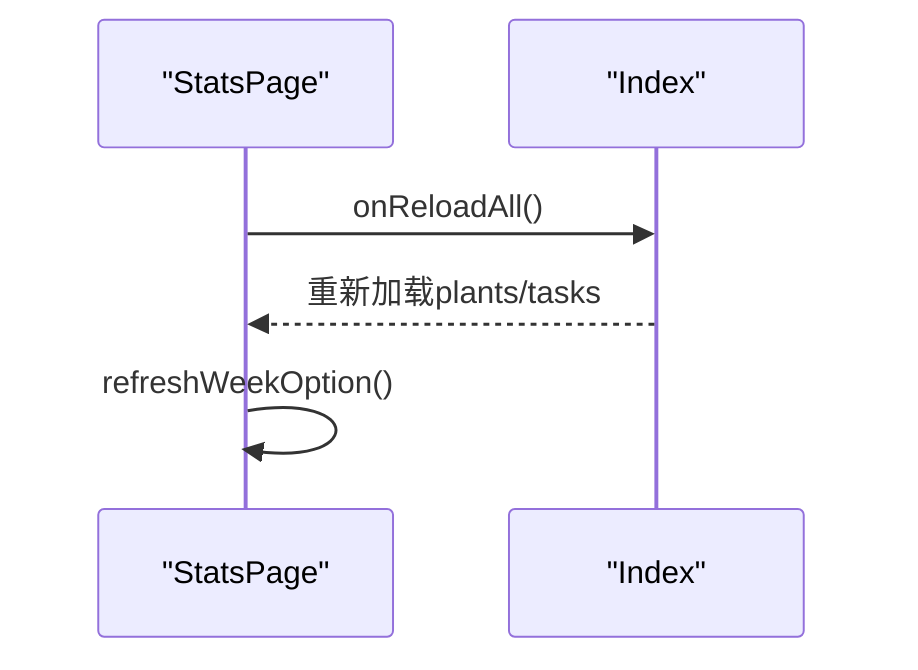

**图表来源**
- [StatsPage.ets:32-38](file://entry/src/main/ets/pages/StatsPage.ets#L32-L38)

**章节来源**
- [StatsPage.ets:1-442](file://entry/src/main/ets/pages/StatsPage.ets#L1-L442)

### PlantDetail 植物详情 API
- 参数
  - @Param：pageStack(NavPathStack)。
- 方法
  - Header/PlantInfoCard/QuickActionGrid/ActionCard。
- 导航
  - pushPathByName跳转至PlantLogPage、LightExposurePage、GrowthIndicatorPage、GrowthComparePage、WaterEstimatorPage、EmergencyAndRotatePage。

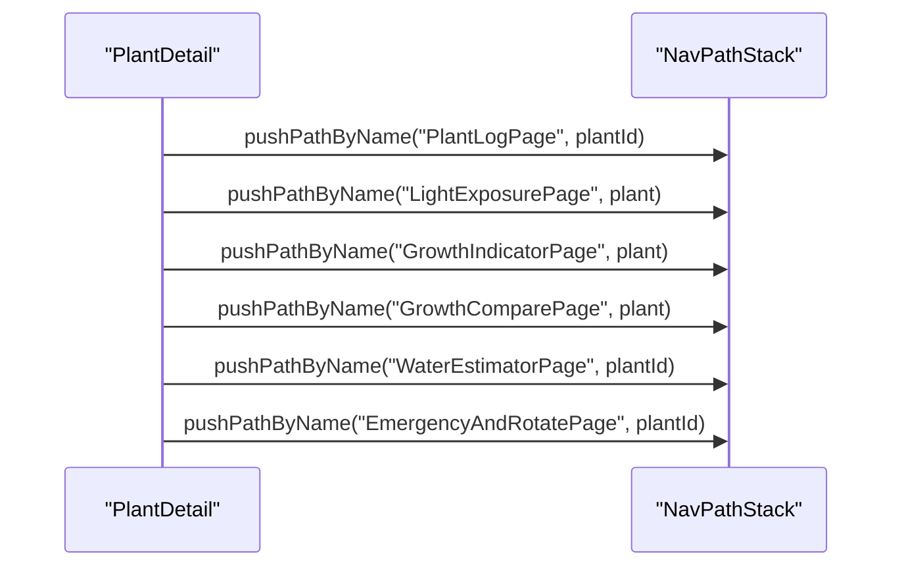

**图表来源**
- [PlantDetail.ets:72-106](file://entry/src/main/ets/pages/PlantDetail.ets#L72-L106)

**章节来源**
- [PlantDetail.ets:1-136](file://entry/src/main/ets/pages/PlantDetail.ets#L1-L136)

### TaskListPage 任务列表 API
- 参数与事件
  - @Param：tasks(Array<PlantTask>)、plants(Array<Plant>)。
  - @Event：onToggle、onDeleteAsk、onCreateTask。
- 状态
  - viewMode、currentMonthISO、filterTab、typeFilter、keyword、filterVisible、sortKey、sortAsc、daySheetVisible、selectedDateISO。
- 方法
  - filteredTasks、tasksOfDate、typesChips、isMatchTab/isMatchType/isMatchKeyword、changeMonth。
- 用户体验
  - 顶部筛选条与搜索，Tab过滤与类型芯片，日视图弹层与列表视图共用过滤结果。

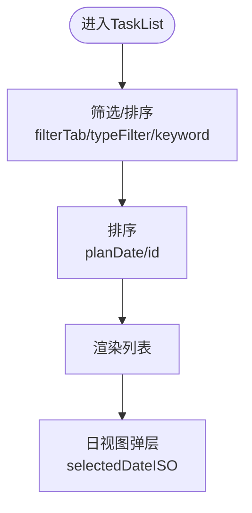

**图表来源**
- [TaskListPage.ets:135-162](file://entry/src/main/ets/pages/TaskListPage.ets#L135-L162)

**章节来源**
- [TaskListPage.ets:1-463](file://entry/src/main/ets/pages/TaskListPage.ets#L1-L463)

### PlantLogPage 日志页面 API
- 参数与状态
  - @Param：pageStack、RdbManager、store。
  - 状态：plantName、logs、photos、keyword、logPlantId、noteText、dateISO、sortAsc、selectMode、selected、previewVisible、photoPreviewVisible、bannerMsg/banerType。
- 方法
  - loadLogsWithPhotos、onAddLog、onDeleteLog、deleteLogAndPhotos、onBatchDeleteLogs、onPickPhotos、pickAndSavePhotos、ensurePhotosDir、copyImageToAppFiles、insertLogPhoto、deletePhotoByFilePath、openPhotoPreview、bulkDeleteLogsTx。
- 用户体验
  - 多选删除、图片预览、批量删除事务处理、防连点控制。

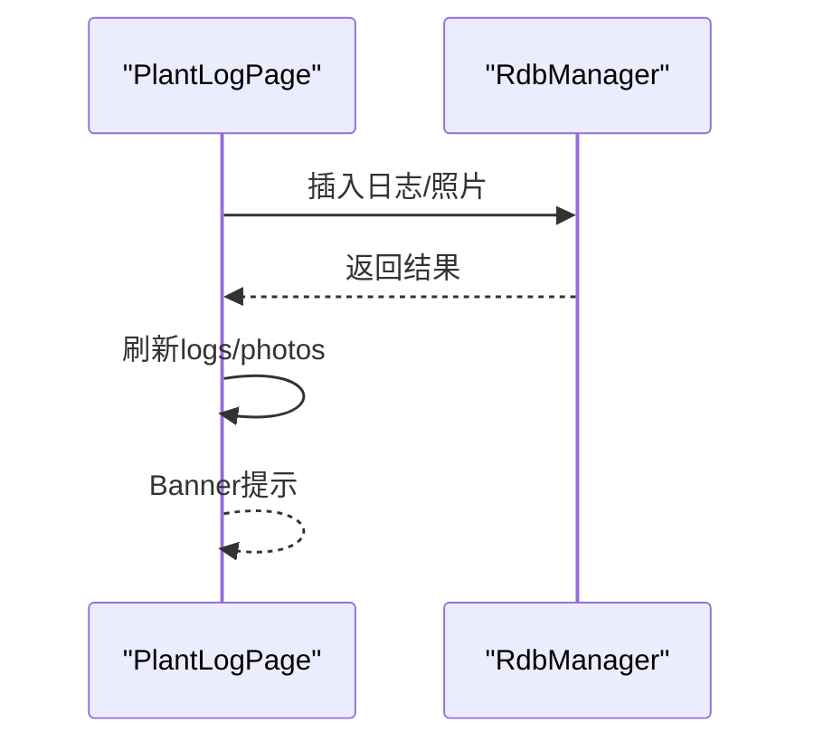

**图表来源**
- [PlantLogPage.ets:66-82](file://entry/src/main/ets/pages/PlantLogPage.ets#L66-L82)

**章节来源**
- [PlantLogPage.ets:1-1030](file://entry/src/main/ets/pages/PlantLogPage.ets#L1-L1030)

### WaterEstimatorPage 用量估算 API
- 参数与状态
  - @Param：plantId(number)。
  - 状态：vm(WaterEstimatorViewModel)、noteText。
- 方法
  - Header/SizeCard/OptionCard/ResultCard/SaveBar/LogList。
  - 重置参数、保存日志、记录推荐用量。
- 用户体验
  - 实时计算结果、建议文案、历史记录展示。

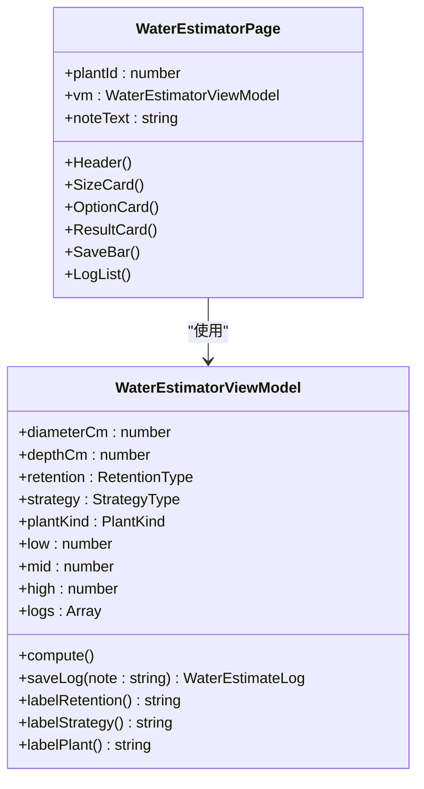

**图表来源**
- [WaterEstimatorPage.ets:1-490](file://entry/src/main/ets/pages/WaterEstimatorPage.ets#L1-L490)
- [WaterEstimatorViewModel.ets:1-130](file://entry/src/main/ets/viewmodel/WaterEstimatorViewModel.ets#L1-L130)

**章节来源**
- [WaterEstimatorPage.ets:1-490](file://entry/src/main/ets/pages/WaterEstimatorPage.ets#L1-L490)
- [WaterEstimatorViewModel.ets:1-130](file://entry/src/main/ets/viewmodel/WaterEstimatorViewModel.ets#L1-L130)

### LightExposurePage 光照记录 API
- 参数与状态
  - @Param：plant(Plant)。
  - 状态：vm(LightExposureViewModel)、startDlg、instantDlg。
- 方法
  - RingAndStatus/ProfileCard/SevenDaysChart、删除会话、定时刷新进度。
- 用户体验
  - 手动开始/结束、手动补记、快速调整偏好、7日条形图。

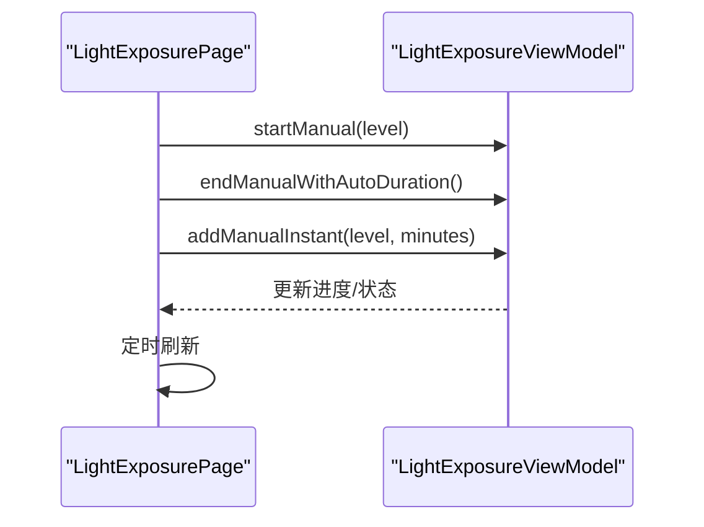

**图表来源**
- [LightExposurePage.ets:214-241](file://entry/src/main/ets/pages/LightExposurePage.ets#L214-L241)

**章节来源**
- [LightExposurePage.ets:1-806](file://entry/src/main/ets/pages/LightExposurePage.ets#L1-L806)

### GrowthIndicatorPage 生长指标 API
- 参数与状态
  - @Param：pageStack、plant(Plant)。
  - 状态：metrics、store、hStr/wStr/sStr/dateISO、chartKey、sortAsc、showChart、defOption。
- 方法
  - loadMetrics/addMetric/deleteMetric/updateChartData/sorted/barHeight/tickLabel/dateFromTs/todayISO/safeNum/clampScore/isoToTs/toXAxis。
- 用户体验
  - 列表/图表切换、时间轴排序、健康度趋势。

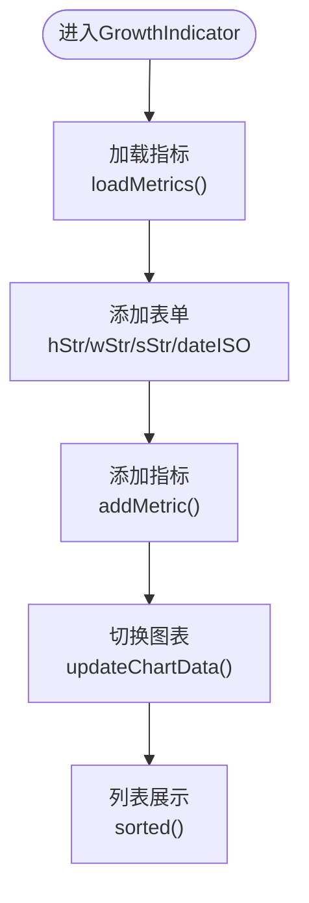

**图表来源**
- [GrowthIndicatorPage.ets:401-420](file://entry/src/main/ets/pages/GrowthIndicatorPage.ets#L401-L420)

**章节来源**
- [GrowthIndicatorPage.ets:1-605](file://entry/src/main/ets/pages/GrowthIndicatorPage.ets#L1-L605)

### GrowthComparePage 成长对比 API
- 参数与状态
  - @Param：pageStack、store、plant(Plant)。
  - 状态：photos、selIdx、picking。
- 方法
  - MainSlider/PreviewGrid/TimeTip、loadPhotos/pickAndAddPhoto/ensurePhotosDir/copyImageToAppFiles/insertTemporaryPhoto。
- 用户体验
  - 主图滑动对比、预览网格、时间跨度提示。

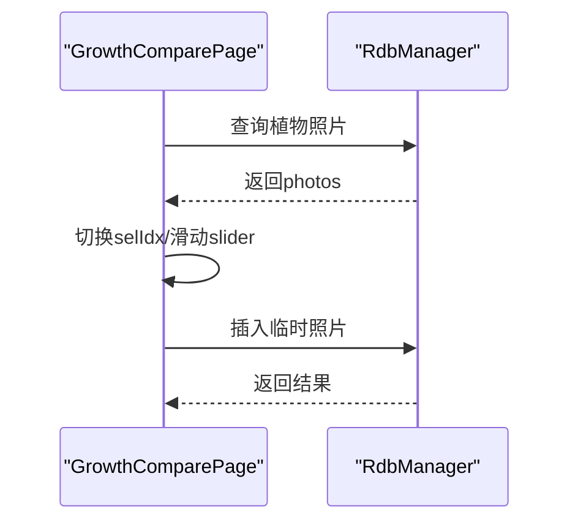

**图表来源**
- [GrowthComparePage.ets:354-374](file://entry/src/main/ets/pages/GrowthComparePage.ets#L354-L374)

**章节来源**
- [GrowthComparePage.ets:1-477](file://entry/src/main/ets/pages/GrowthComparePage.ets#L1-L477)

## 依赖关系分析
- 组件耦合
  - Index与各页面通过NavPathStack解耦导航，参数通过pushPathByName传递。
  - 页面与数据库通过RdbManager集中管理，避免直接耦合ArkTS数据层。
  - PlantCard/TaskItem等子组件仅负责展示与事件回调，具体CRUD由父页面处理。
- 外部依赖
  - @mcui/mccharts用于图表渲染。
  - @ohos.data.relationalStore用于数据库访问。
  - @kit.ArkUI/@kit.LocalizationKit等系统能力。

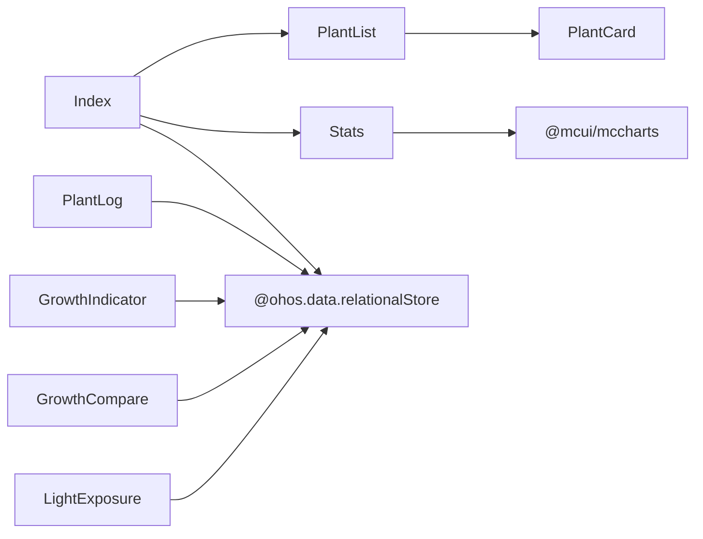

**图表来源**
- [Index.ets:1-1382](file://entry/src/main/ets/pages/Index.ets#L1-L1382)
- [StatsPage.ets:1-442](file://entry/src/main/ets/pages/StatsPage.ets#L1-L442)
- [PlantCard.ets:1-326](file://entry/src/main/ets/view/PlantCard.ets#L1-L326)
- [RdbManager.ets:1-296](file://entry/src/main/ets/viewmodel/RdbManager.ets#L1-L296)

**章节来源**
- [Index.ets:1-1382](file://entry/src/main/ets/pages/Index.ets#L1-L1382)
- [RdbManager.ets:1-296](file://entry/src/main/ets/viewmodel/RdbManager.ets#L1-L296)

## 性能考虑
- 数据加载
  - 首页统一加载植物/任务/模板，避免多页面重复查询。
  - 使用索引优化查询：任务按planDate、plantId；日志按plantId+createdAt；指标按plantId+createdAt。
- 渲染优化
  - 列表使用List/ForEach，避免复杂计算在Builder中进行。
  - 图表仅在切换到全图模式时重建配置，减少频繁更新。
- 事务与一致性
  - 删除日志/照片采用事务，失败回滚，确保数据一致性。
  - 批量删除采用IN子句，减少SQL往返。
- 动画与反馈
  - 使用animateTo提供流畅过渡，避免过度动画影响性能。

## 故障排查指南
- 数据库初始化失败
  - 现象：首页初始化失败横幅。
  - 处理：检查RdbManager.initDb()执行结果，确认数据库文件与权限。
- 删除失败回滚
  - 现象：删除日志失败，提示已回滚。
  - 处理：检查事务执行与异常捕获，确认文件删除权限。
- 光照状态不同步
  - 现象：卡片未显示补光状态。
  - 处理：确认Index.refreshActiveSessions已执行，AppStorage键值正确。
- 图表数据为空
  - 现象：图表无数据。
  - 处理：确认切换到图表模式后调用updateChartData()，检查metrics数据加载。

**章节来源**
- [Index.ets:116-125](file://entry/src/main/ets/pages/Index.ets#L116-L125)
- [PlantLogPage.ets:133-137](file://entry/src/main/ets/pages/PlantLogPage.ets#L133-L137)
- [GrowthIndicatorPage.ets:458-467](file://entry/src/main/ets/pages/GrowthIndicatorPage.ets#L458-L467)

## 结论
本文档系统梳理了植物日记项目核心页面的路由接口、导航方法与状态管理API，明确了页面间数据传递机制、生命周期钩子与状态持久化接口。通过统一的数据库管理与状态中枢设计，项目实现了良好的可维护性与扩展性。建议在新增页面时遵循现有模式，使用NavPathStack进行导航、RdbManager进行数据访问，并通过事件回调与状态管理实现页面解耦。

## 附录
- 路由配置建议
  - 使用pushPathByName进行页面导航，参数通过pathInfo.param传递。
  - 对于需要返回值的页面，使用onBackPressed拦截并返回数据。
- 导航示例
  - 从Index跳转至PlantDetail：pushPathByName("PlantDetail", plant)。
  - 从PlantDetail跳转至PlantLogPage：pushPathByName("PlantLogPage", plantId)。
- 用户体验优化
  - 提示横幅：统一使用showBanner展示操作结果。
  - 列表动画：使用animateTo提供流畅过渡。
  - 图表懒加载：仅在切换到图表模式时构建配置。