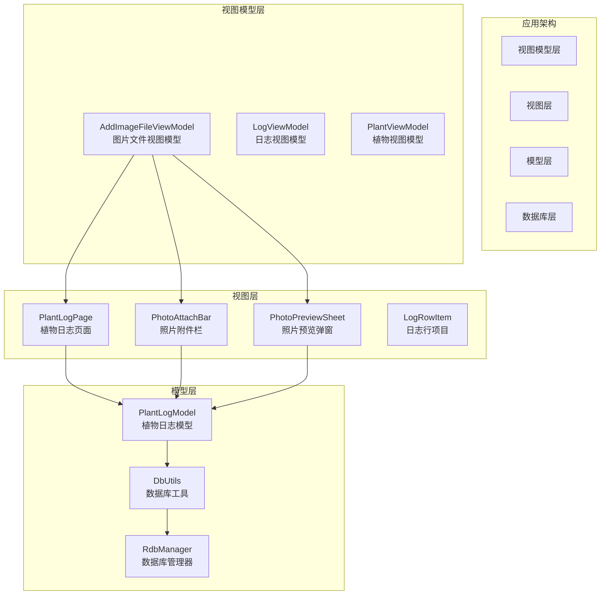
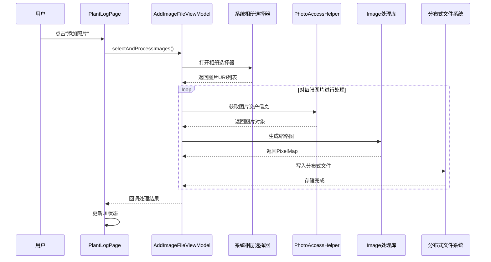
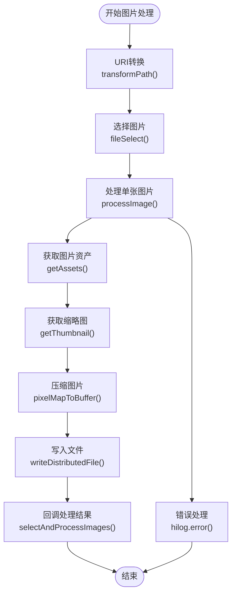
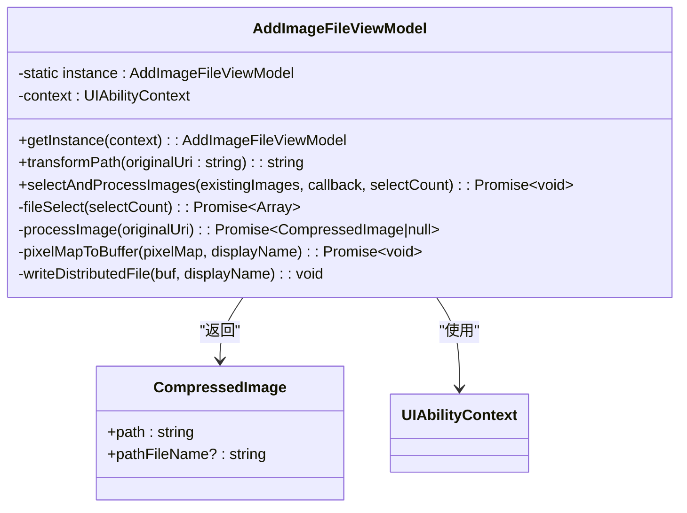
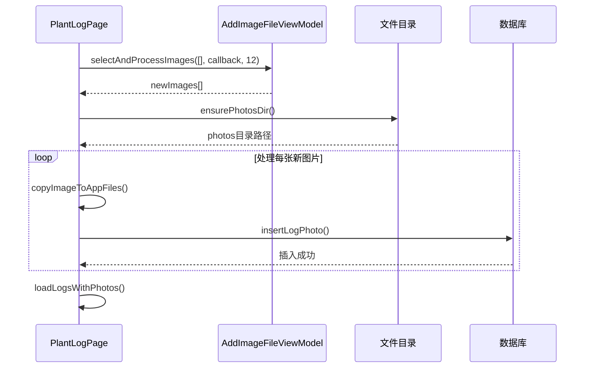
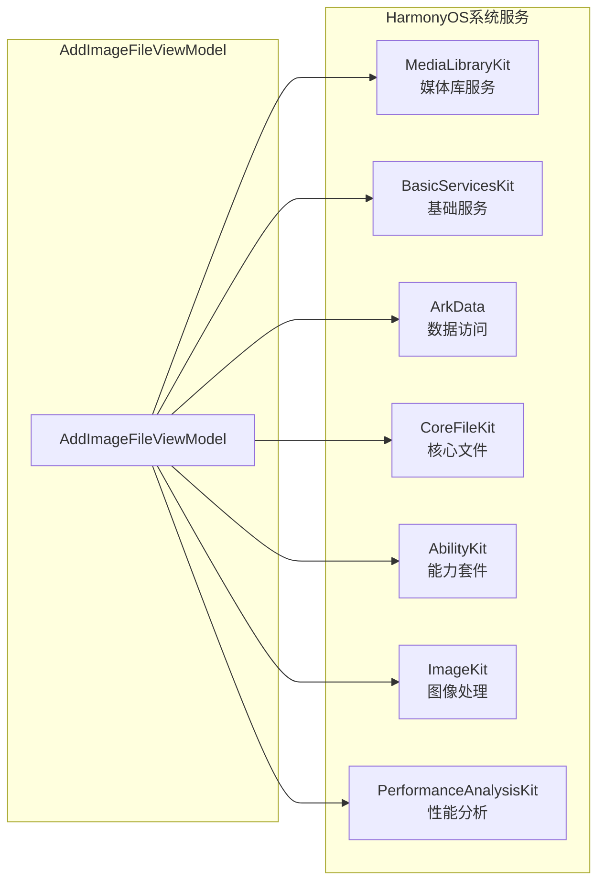
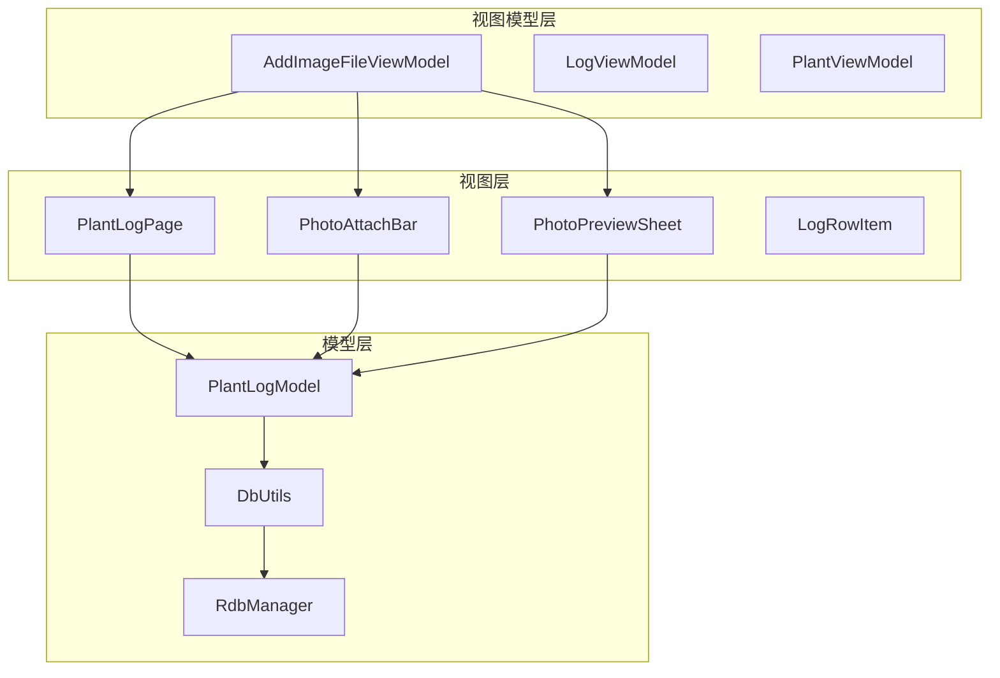

# 添加图片文件视图模型文档

<cite>
**本文档中引用的文件**
- [AddImageFileViewModel.ets](file://entry/src/main/ets/viewmodel/AddImageFileViewModel.ets)
- [PhotoAttachBar.ets](file://entry/src/main/ets/view/PhotoAttachBar.ets)
- [PhotoPreviewSheet.ets](file://entry/src/main/ets/view/PhotoPreviewSheet.ets)
- [PlantLogPage.ets](file://entry/src/main/ets/pages/PlantLogPage.ets)
- [LogRowItem.ets](file://entry/src/main/ets/view/LogRowItem.ets)
- [PlantLogSheet.ets](file://entry/src/main/ets/view/PlantLogSheet.ets)
- [PlantLogModel.ets](file://entry/src/main/ets/model/PlantLogModel.ets)
- [DbUtils.ets](file://entry/src/main/ets/model/DbUtils.ets)
- [RdbManager.ets](file://entry/src/main/ets/viewmodel/RdbManager.ets)
- [build-profile.json5](file://build-profile.json5)
- [entry/build-profile.json5](file://entry/build-profile.json5)
</cite>

## 目录
1. [简介](#简介)
2. [项目结构概览](#项目结构概览)
3. [核心组件分析](#核心组件分析)
4. [架构设计](#架构设计)
5. [详细组件分析](#详细组件分析)
6. [依赖关系分析](#依赖关系分析)
7. [性能考虑](#性能考虑)
8. [故障排除指南](#故障排除指南)
9. [总结](#总结)

## 简介

本文档详细介绍了PlantDiary项目中的"添加图片文件视图模型"（AddImageFileViewModel）组件。这是一个专门负责处理图片选择、处理和存储的核心组件，为植物日记应用提供了完整的图片管理功能。该组件实现了图片从相册选择到本地存储的完整流程，支持多种图片格式处理和分布式文件系统集成。

## 项目结构概览

PlantDiary是一个基于HarmonyOS开发的植物养护管理应用，采用模块化架构设计。项目主要分为以下几个核心部分：

**图表来源**
- [AddImageFileViewModel.ets:1-146](file://entry/src/main/ets/viewmodel/AddImageFileViewModel.ets#L1-L146)
- [PlantLogPage.ets:1-1030](file://entry/src/main/ets/pages/PlantLogPage.ets#L1-L1030)

**章节来源**
- [AddImageFileViewModel.ets:1-146](file://entry/src/main/ets/viewmodel/AddImageFileViewModel.ets#L1-L146)
- [PlantLogPage.ets:1-1030](file://entry/src/main/ets/pages/PlantLogPage.ets#L1-L1030)

## 核心组件分析

### AddImageFileViewModel概述

AddImageFileViewModel是项目中最核心的图片处理组件，采用了单例模式设计，确保在整个应用生命周期内只有一个实例负责处理所有图片相关操作。

#### 主要功能特性

1. **统一URI处理**：将不同来源的图片URI转换为应用内部可处理的路径格式
2. **批量图片选择**：支持从系统相册选择多张图片
3. **智能图片处理**：自动提取缩略图并转换为JPEG格式
4. **分布式文件存储**：将处理后的图片存储到分布式文件目录
5. **错误处理机制**：完善的异常捕获和错误日志记录

#### 设计模式应用

组件采用了以下设计模式：

- **单例模式**：确保全局唯一性
- **工厂模式**：创建和管理图片处理流程
- **回调模式**：异步处理结果通知

**章节来源**
- [AddImageFileViewModel.ets:14-27](file://entry/src/main/ets/viewmodel/AddImageFileViewModel.ets#L14-L27)
- [AddImageFileViewModel.ets:35-55](file://entry/src/main/ets/viewmodel/AddImageFileViewModel.ets#L35-L55)

## 架构设计

### 整体架构图

**图表来源**
- [AddImageFileViewModel.ets:35-55](file://entry/src/main/ets/viewmodel/AddImageFileViewModel.ets#L35-L55)
- [PlantLogPage.ets:210-240](file://entry/src/main/ets/pages/PlantLogPage.ets#L210-L240)

### 数据流架构

**图表来源**
- [AddImageFileViewModel.ets:77-113](file://entry/src/main/ets/viewmodel/AddImageFileViewModel.ets#L77-L113)
- [AddImageFileViewModel.ets:116-144](file://entry/src/main/ets/viewmodel/AddImageFileViewModel.ets#L116-L144)

**章节来源**
- [AddImageFileViewModel.ets:77-144](file://entry/src/main/ets/viewmodel/AddImageFileViewModel.ets#L77-L144)

## 详细组件分析

### AddImageFileViewModel类结构

**图表来源**
- [AddImageFileViewModel.ets:9-146](file://entry/src/main/ets/viewmodel/AddImageFileViewModel.ets#L9-L146)

#### 核心方法详解

**1. selectAndProcessImages方法**

这是组件的核心入口方法，负责协调整个图片处理流程：

- 接受现有图片列表、回调函数和选择数量参数
- 异步调用系统相册选择器获取图片URI
- 逐张处理图片并收集处理结果
- 通过回调函数返回最终的图片列表

**2. processImage方法**

单张图片处理的核心逻辑：

- 使用PhotoAccessHelper获取图片资产信息
- 提取缩略图并转换为PixelMap格式
- 将PixelMap压缩为JPEG格式
- 写入分布式文件系统

**3. pixelMapToBuffer方法**

图片格式转换的关键步骤：

- 创建ImagePacker实例
- 设置JPEG压缩选项（质量100）
- 异步转换PixelMap为ArrayBuffer
- 自动释放PixelMap内存资源

**章节来源**
- [AddImageFileViewModel.ets:35-144](file://entry/src/main/ets/viewmodel/AddImageFileViewModel.ets#L35-L144)

### 集成组件分析

#### PlantLogPage集成

PlantLogPage作为主要的业务页面，集成了AddImageFileViewModel来处理图片添加功能：

**图表来源**
- [PlantLogPage.ets:210-240](file://entry/src/main/ets/pages/PlantLogPage.ets#L210-L240)
- [PlantLogPage.ets:267-304](file://entry/src/main/ets/pages/PlantLogPage.ets#L267-L304)

#### UI组件集成

**PhotoAttachBar组件**

提供直观的照片附件界面，包含：

- 照片标题显示
- 添加照片按钮
- 缩略图横向滚动展示
- 删除和预览功能

**PhotoPreviewSheet组件**

实现全屏照片预览功能：

- 支持左右滑动切换
- 点击放大缩小功能
- 删除和关闭操作
- 平滑的过渡动画效果

**章节来源**
- [PlantLogPage.ets:210-240](file://entry/src/main/ets/pages/PlantLogPage.ets#L210-L240)
- [PhotoAttachBar.ets:17-99](file://entry/src/main/ets/view/PhotoAttachBar.ets#L17-L99)
- [PhotoPreviewSheet.ets:1-223](file://entry/src/main/ets/view/PhotoPreviewSheet.ets#L1-L223)

## 依赖关系分析

### 外部依赖

AddImageFileViewModel依赖于多个HarmonyOS系统服务：

**图表来源**
- [AddImageFileViewModel.ets:1-7](file://entry/src/main/ets/viewmodel/AddImageFileViewModel.ets#L1-L7)

### 内部依赖关系

**图表来源**
- [PlantLogPage.ets:1-12](file://entry/src/main/ets/pages/PlantLogPage.ets#L1-L12)
- [PlantLogModel.ets:1-58](file://entry/src/main/ets/model/PlantLogModel.ets#L1-L58)

**章节来源**
- [AddImageFileViewModel.ets:1-7](file://entry/src/main/ets/viewmodel/AddImageFileViewModel.ets#L1-L7)
- [PlantLogPage.ets:1-12](file://entry/src/main/ets/pages/PlantLogPage.ets#L1-L12)

## 性能考虑

### 内存管理

组件在图片处理过程中实施了严格的内存管理策略：

1. **及时释放资源**：在pixelMapToBuffer方法中确保PixelMap资源被正确释放
2. **异步处理**：使用Promise和async/await避免阻塞主线程
3. **批量处理**：支持多图片同时处理，提高效率

### 文件系统优化

1. **分布式存储**：使用distributedFilesDir确保跨设备兼容性
2. **文件命名规范**：生成唯一的文件名避免冲突
3. **目录结构**：合理的目录组织便于维护和查找

### 错误处理策略

组件实现了多层次的错误处理机制：

1. **异步异常捕获**：使用try-catch处理异步操作异常
2. **日志记录**：详细的错误日志便于调试和问题定位
3. **降级处理**：在网络或系统异常时提供合理的降级方案

## 故障排除指南

### 常见问题及解决方案

**1. 图片无法显示**

可能原因：
- 文件路径格式不正确
- 权限不足
- 文件损坏

解决方法：
- 确保使用ensureFileUri方法处理路径
- 检查应用权限设置
- 验证文件完整性

**2. 图片处理失败**

可能原因：
- 内存不足
- 图片格式不支持
- 系统服务异常

解决方法：
- 监控内存使用情况
- 支持常见的图片格式
- 实现重试机制

**3. 性能问题**

可能原因：
- 图片过大
- 同时处理过多图片
- 内存泄漏

解决方法：
- 实现图片压缩
- 控制并发数量
- 定期检查内存使用

**章节来源**
- [AddImageFileViewModel.ets:52-54](file://entry/src/main/ets/viewmodel/AddImageFileViewModel.ets#L52-L54)
- [AddImageFileViewModel.ets:110-112](file://entry/src/main/ets/viewmodel/AddImageFileViewModel.ets#L110-L112)

## 总结

AddImageFileViewModel组件是PlantDiary项目中图片处理功能的核心，它成功地解决了以下关键问题：

1. **统一接口**：为整个应用提供了统一的图片处理接口
2. **异步处理**：确保用户体验流畅，不阻塞主线程
3. **资源管理**：实现了严格的内存和文件资源管理
4. **错误处理**：提供了完善的异常处理和降级机制

该组件的设计充分体现了现代移动应用开发的最佳实践，包括模块化设计、异步编程、资源管理和错误处理等方面。通过与其他组件的紧密协作，形成了完整的图片管理生态系统，为用户提供了优质的植物养护记录体验。