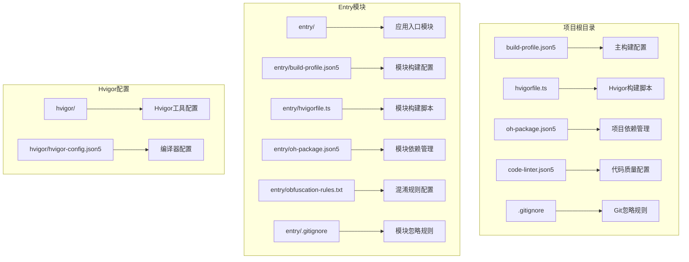
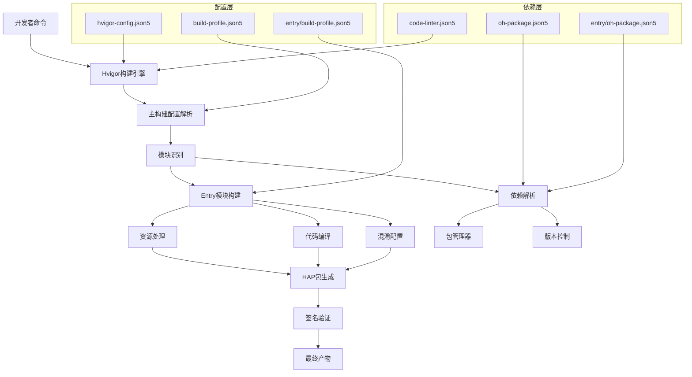
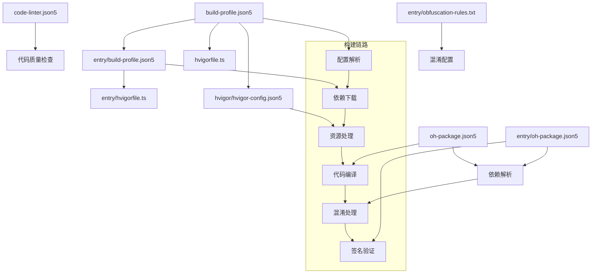

# 构建配置

<cite>
**本文档引用的文件**
- [build-profile.json5](file://build-profile.json5)
- [entry/build-profile.json5](file://entry/build-profile.json5)
- [hvigorfile.ts](file://hvigorfile.ts)
- [entry/hvigorfile.ts](file://entry/hvigorfile.ts)
- [hvigor/hvigor-config.json5](file://hvigor/hvigor-config.json5)
- [oh-package.json5](file://oh-package.json5)
- [entry/oh-package.json5](file://entry/oh-package.json5)
- [entry/obfuscation-rules.txt](file://entry/obfuscation-rules.txt)
- [code-linter.json5](file://code-linter.json5)
- [.gitignore](file://.gitignore)
- [entry/.gitignore](file://entry/.gitignore)
- [PROJECT_GUIDE.md](file://PROJECT_GUIDE.md)
- [CODE_ANNOTATIONS.md](file://CODE_ANNOTATIONS.md)
</cite>

## 目录
1. [简介](#简介)
2. [项目结构](#项目结构)
3. [核心构建组件](#核心构建组件)
4. [架构概览](#架构概览)
5. [详细组件分析](#详细组件分析)
6. [依赖关系分析](#依赖关系分析)
7. [性能考虑](#性能考虑)
8. [故障排除指南](#故障排除指南)
9. [结论](#结论)

## 简介

PlantDiary 是一个基于 HarmonyOS 5.0.5 + ArkTS 开发的植物养护管理应用。该项目采用 MVVM 架构模式，包含完整的植物管理、光照记录、浇水估算、生长指标跟踪等功能。本文件专注于项目的构建配置体系，详细分析了构建系统、依赖管理、代码质量控制等方面的配置。

## 项目结构

项目采用模块化的目录结构，主要包含以下关键目录：



**图表来源**
- [build-profile.json5:1-69](file://build-profile.json5#L1-L69)
- [entry/build-profile.json5:1-33](file://entry/build-profile.json5#L1-L33)
- [hvigorfile.ts:1-6](file://hvigorfile.ts#L1-L6)

**章节来源**
- [build-profile.json5:1-69](file://build-profile.json5#L1-L69)
- [entry/build-profile.json5:1-33](file://entry/build-profile.json5#L1-L33)
- [hvigorfile.ts:1-6](file://hvigorfile.ts#L1-L6)
- [entry/hvigorfile.ts:1-6](file://entry/hvigorfile.ts#L1-L6)

## 核心构建组件

### 主构建配置

项目采用 JSON5 格式的主构建配置文件，定义了应用的整体构建参数：

**签名配置**：项目配置了两套签名方案
- 默认调试签名：用于开发环境的调试构建
- 发布签名：用于生产环境的应用发布

**产品配置**：定义了默认产品配置，包括 SDK 版本兼容性和严格模式检查

**构建模式**：支持 debug 和 release 两种构建模式

**模块配置**：定义了 entry 模块作为应用入口，指向 ./entry 目录

### 模块构建配置

Entry 模块具有独立的构建配置，重点关注：

**API类型**：设置为 stageMode，适用于 Stage 模式开发

**资源选项**：禁用了代码资源复制功能

**构建选项集**：针对 release 模式配置了 ArkTS 混淆选项

### Hvigor构建系统

项目使用 Hvigor 作为构建系统，包含：

**根级配置**：appTasks 作为系统任务，提供标准的应用构建功能

**模块级配置**：hapTasks 专门处理 HAP 包的构建任务

**Hvigor工具配置**：提供了编译器优化、日志级别、调试选项等配置项

**章节来源**
- [build-profile.json5:1-69](file://build-profile.json5#L1-L69)
- [entry/build-profile.json5:1-33](file://entry/build-profile.json5#L1-L33)
- [hvigorfile.ts:1-6](file://hvigorfile.ts#L1-L6)
- [entry/hvigorfile.ts:1-6](file://entry/hvigorfile.ts#L1-L6)
- [hvigor/hvigor-config.json5:1-24](file://hvigor/hvigor-config.json5#L1-L24)

## 架构概览

构建系统的整体架构如下：



**图表来源**
- [build-profile.json5:1-69](file://build-profile.json5#L1-L69)
- [entry/build-profile.json5:1-33](file://entry/build-profile.json5#L1-L33)
- [hvigor/hvigor-config.json5:1-24](file://hvigor/hvigor-config.json5#L1-L24)
- [oh-package.json5:1-12](file://oh-package.json5#L1-L12)

## 详细组件分析

### 依赖管理系统

项目采用多层依赖管理策略：

```mermaid
graph LR
subgraph "开发依赖"
A[@ohos/hypium] --> B[测试框架]
C[@ohos/hamock] --> D[模拟工具]
end
subgraph "运行时依赖"
E[@mcui/mccharts] --> F[图表组件库]
end
subgraph "模块依赖"
G[entry模块] --> H[无特定依赖]
end
subgraph "动态依赖"
I[空配置] --> J[按需加载]
end
```

**图表来源**
- [oh-package.json5:4-12](file://oh-package.json5#L4-L12)
- [entry/oh-package.json5:1-11](file://entry/oh-package.json5#L1-L11)

**章节来源**
- [oh-package.json5:1-12](file://oh-package.json5#L1-L12)
- [entry/oh-package.json5:1-11](file://entry/oh-package.json5#L1-L11)

### 代码混淆配置

项目实现了多层次的代码混淆保护：

**混淆规则文件**：
- 启用属性名混淆：保护内部属性的可见性
- 启用顶级作用域混淆：混淆全局变量和函数名
- 启用文件名混淆：保护源文件结构
- 启用导出混淆：混淆对外暴露的接口

**混淆配置集成**：
- 在 release 构建模式下启用
- 通过 build-profile.json5 配置文件引用
- 支持名称缓存重用和打印功能

### 代码质量控制

项目建立了完善的代码质量控制体系：

**Linter配置**：
- 支持 ETS 文件类型
- 忽略测试、构建、模块化等目录
- 集成性能和 TypeScript ESLint 插件
- 实施安全相关的代码检查规则

**安全规则**：
- AES 加密安全性检查
- 哈希算法安全性评估
- RSA 和 ECDSA 密钥安全验证
- 禁用不安全的加密算法

**章节来源**
- [entry/obfuscation-rules.txt:1-23](file://entry/obfuscation-rules.txt#L1-L23)
- [entry/build-profile.json5:10-24](file://entry/build-profile.json5#L10-L24)
- [code-linter.json5:1-32](file://code-linter.json5#L1-L32)

### 版本控制和构建忽略

项目配置了全面的版本控制忽略规则：

**根级忽略规则**：
- Node.js 模块目录
- 构建输出目录
- IDE 配置文件
- 编译缓存文件

**模块级忽略规则**：
- 专门针对 entry 模块的构建忽略
- 包含测试和预览相关目录

**章节来源**
- [.gitignore:1-12](file://.gitignore#L1-L12)
- [entry/.gitignore:1-6](file://entry/.gitignore#L1-L6)

## 依赖关系分析

构建配置之间的依赖关系如下：



**图表来源**
- [build-profile.json5:55-69](file://build-profile.json5#L55-L69)
- [entry/build-profile.json5:25-33](file://entry/build-profile.json5#L25-L33)
- [hvigorfile.ts:1-6](file://hvigorfile.ts#L1-L6)
- [entry/hvigorfile.ts:1-6](file://entry/hvigorfile.ts#L1-L6)

**章节来源**
- [build-profile.json5:55-69](file://build-profile.json5#L55-L69)
- [entry/build-profile.json5:25-33](file://entry/build-profile.json5#L25-L33)

## 性能考虑

基于构建配置的性能优化建议：

### 编译器优化
- 启用并行编译以提高构建速度
- 启用增量编译减少重复工作
- 配置适当的内存限制避免编译器崩溃

### 资源优化
- 合理配置资源复制选项
- 优化图片和媒体资源的处理流程
- 实施资源压缩和优化策略

### 构建缓存
- 利用 Hvigor 的缓存机制
- 配置合理的缓存清理策略
- 优化依赖解析性能

## 故障排除指南

### 常见构建问题

**签名配置问题**：
- 检查证书文件路径是否正确
- 验证密钥别名和密码配置
- 确认签名算法设置匹配

**依赖解析失败**：
- 检查网络连接状态
- 验证 npm registry 配置
- 清理 node_modules 和重新安装

**混淆配置冲突**：
- 检查混淆规则的兼容性
- 验证保留规则的正确性
- 确认混淆后的代码功能正常

### 调试技巧

**构建日志分析**：
- 使用详细日志级别查看构建过程
- 检查编译器输出的警告信息
- 分析依赖树的解析结果

**性能监控**：
- 监控构建时间变化
- 分析内存使用情况
- 优化大型项目的构建策略

**章节来源**
- [hvigor/hvigor-config.json5:5-23](file://hvigor/hvigor-config.json5#L5-L23)
- [code-linter.json5:14-31](file://code-linter.json5#L14-L31)

## 结论

PlantDiary 项目的构建配置展现了现代移动应用开发的最佳实践。通过模块化的配置管理、完善的依赖控制系统、严格的代码质量保证和灵活的混淆策略，项目建立了一个高效、可维护的构建体系。

关键优势包括：
- 清晰的模块分离和独立配置
- 完善的安全和质量控制机制
- 灵活的构建模式支持
- 可扩展的依赖管理策略

这些配置为项目的长期发展奠定了坚实的基础，支持从开发到生产的完整构建流程。