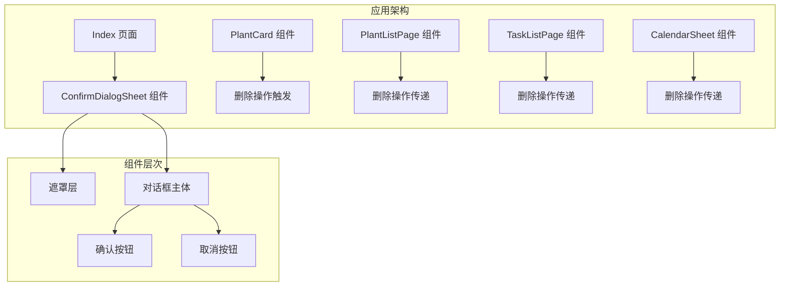
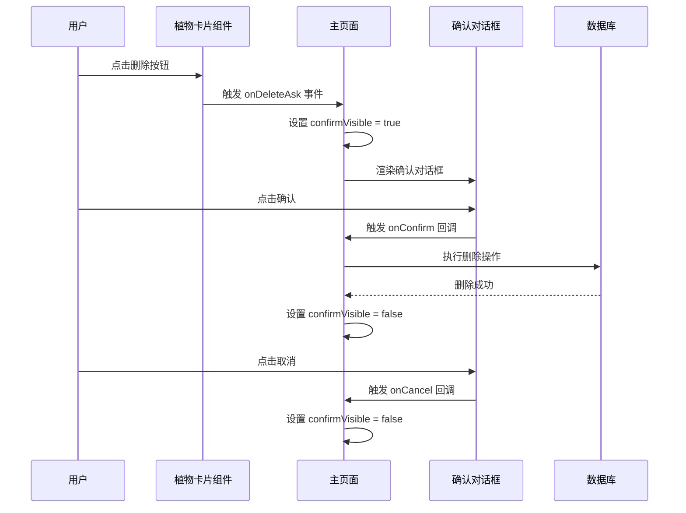
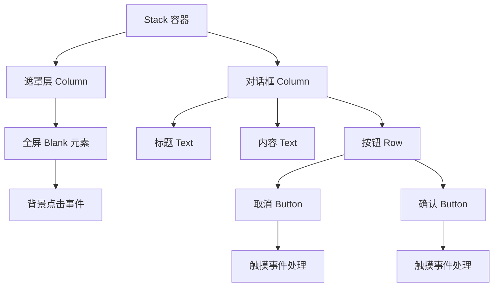
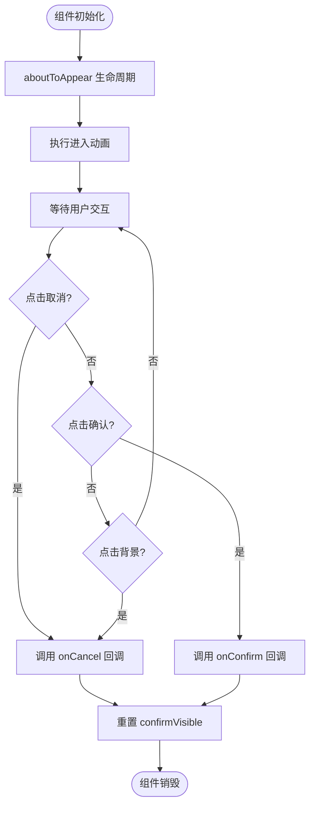
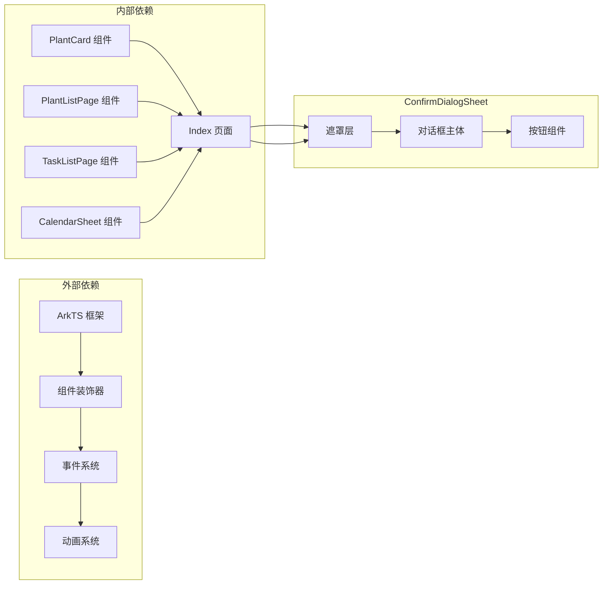

# 确认对话框组件文档

<cite>
**本文档引用的文件**
- [ConfirmDialogSheet.ets](file://entry/src/main/ets/view/ConfirmDialogSheet.ets)
- [Index.ets](file://entry/src/main/ets/pages/Index.ets)
- [PlantCard.ets](file://entry/src/main/ets/view/PlantCard.ets)
- [PlantListPage.ets](file://entry/src/main/ets/pages/PlantListPage.ets)
- [TaskListPage.ets](file://entry/src/main/ets/pages/TaskListPage.ets)
- [CalendarSheet.ets](file://entry/src/main/ets/pages/CalendarSheet.ets)
- [EditPlantSheet.ets](file://entry/src/main/ets/view/EditPlantSheet.ets)
- [PlantModel.ets](file://entry/src/main/ets/model/PlantModel.ets)
</cite>

## 目录
1. [简介](#简介)
2. [项目结构](#项目结构)
3. [核心组件](#核心组件)
4. [架构概览](#架构概览)
5. [详细组件分析](#详细组件分析)
6. [依赖关系分析](#依赖关系分析)
7. [性能考虑](#性能考虑)
8. [故障排除指南](#故障排除指南)
9. [结论](#结论)

## 简介

ConfirmDialogSheet 是 PlantDiary 应用中的一个自定义覆盖式确认对话框组件，用于在用户执行可能产生不可逆操作（如删除植物或任务）时提供安全确认机制。该组件采用 ArkTS 框架开发，具有流畅的动画效果和直观的用户交互体验。

该组件的核心功能包括：
- 提供模态确认对话框界面
- 支持取消和确认两种操作选择
- 实现平滑的进入和退出动画
- 提供触摸反馈效果
- 支持背景点击关闭功能

## 项目结构

ConfirmDialogSheet 组件在整个应用架构中扮演着重要的用户体验控制角色，主要位于以下目录结构中：

**图表来源**
- [ConfirmDialogSheet.ets:1-103](file://entry/src/main/ets/view/ConfirmDialogSheet.ets#L1-L103)
- [Index.ets:1067-1083](file://entry/src/main/ets/pages/Index.ets#L1067-L1083)

**章节来源**
- [ConfirmDialogSheet.ets:1-103](file://entry/src/main/ets/view/ConfirmDialogSheet.ets#L1-L103)
- [Index.ets:1060-1259](file://entry/src/main/ets/pages/Index.ets#L1060-L1259)

## 核心组件

ConfirmDialogSheet 组件是一个基于 @ComponentV2 装饰器的结构体组件，具有以下核心特性：

### 组件属性定义

| 属性名称 | 类型 | 必需 | 描述 |
|---------|------|------|------|
| text | string | 是 | 对话框显示的确认文本内容 |
| onCancel | () => void | 是 | 取消按钮点击回调函数 |
| onConfirm | () => void | 是 | 确认按钮点击回调函数 |

### 状态管理

组件内部维护以下本地状态：

| 状态名称 | 类型 | 默认值 | 描述 |
|---------|------|--------|------|
| cancelPressed | boolean | false | 取消按钮触摸状态 |
| confirmPressed | boolean | false | 确认按钮触摸状态 |
| maskOpacity | number | 0 | 背景遮罩透明度 |

### 动画系统

组件实现了多层次的动画效果：

1. **进入动画**：背景遮罩从透明渐变为半透明（250ms）
2. **对话框动画**：主容器采用摩擦力曲线的进入动画（300ms）
3. **按钮反馈动画**：按钮按下时的缩放反馈（100ms）

**章节来源**
- [ConfirmDialogSheet.ets:2-18](file://entry/src/main/ets/view/ConfirmDialogSheet.ets#L2-L18)

## 架构概览

ConfirmDialogSheet 在整个应用中的集成架构如下：

**图表来源**
- [Index.ets:1067-1083](file://entry/src/main/ets/pages/Index.ets#L1067-L1083)
- [PlantCard.ets:187-196](file://entry/src/main/ets/view/PlantCard.ets#L187-L196)

## 详细组件分析

### 组件结构设计

ConfirmDialogSheet 采用了嵌套的布局结构来实现清晰的视觉层次：

**图表来源**
- [ConfirmDialogSheet.ets:20-101](file://entry/src/main/ets/view/ConfirmDialogSheet.ets#L20-L101)

### 交互流程分析

组件的交互流程遵循标准的确认对话框模式：

**图表来源**
- [ConfirmDialogSheet.ets:13-18](file://entry/src/main/ets/view/ConfirmDialogSheet.ets#L13-L18)
- [ConfirmDialogSheet.ets:27-29](file://entry/src/main/ets/view/ConfirmDialogSheet.ets#L27-L29)
- [ConfirmDialogSheet.ets:38-40](file://entry/src/main/ets/view/ConfirmDialogSheet.ets#L38-L40)
- [ConfirmDialogSheet.ets:61-63](file://entry/src/main/ets/view/ConfirmDialogSheet.ets#L61-L63)

### 状态管理机制

组件的状态管理采用了响应式设计模式：

| 状态类型 | 管理方式 | 动画配置 | 触发条件 |
|---------|----------|----------|----------|
| maskOpacity | animateTo 方法 | duration: 250ms, curve: EaseInOut | aboutToAppear 生命周期 |
| cancelPressed | onTouch 事件 | duration: 100ms, curve: EaseOut | 按钮触摸状态变化 |
| confirmPressed | onTouch 事件 | duration: 100ms, curve: EaseOut | 按钮触摸状态变化 |

**章节来源**
- [ConfirmDialogSheet.ets:13-18](file://entry/src/main/ets/view/ConfirmDialogSheet.ets#L13-L18)
- [ConfirmDialogSheet.ets:52-58](file://entry/src/main/ets/view/ConfirmDialogSheet.ets#L52-L58)
- [ConfirmDialogSheet.ets:76-82](file://entry/src/main/ets/view/ConfirmDialogSheet.ets#L76-L82)

## 依赖关系分析

ConfirmDialogSheet 组件与其他组件之间的依赖关系如下：

**图表来源**
- [Index.ets:14](file://entry/src/main/ets/pages/Index.ets#L14)
- [PlantCard.ets:13-22](file://entry/src/main/ets/view/PlantCard.ets#L13-L22)

### 组件间通信

ConfirmDialogSheet 通过事件驱动的方式与其他组件进行通信：

1. **删除操作触发**：PlantCard 组件通过 onDeleteAsk 事件向 Index 页面传递删除请求
2. **确认对话框显示**：Index 页面根据状态变量 confirmVisible 控制对话框的显示
3. **操作确认**：用户确认后，Index 页面执行相应的删除操作

**章节来源**
- [PlantCard.ets:187-196](file://entry/src/main/ets/view/PlantCard.ets#L187-L196)
- [Index.ets:1067-1083](file://entry/src/main/ets/pages/Index.ets#L1067-L1083)

## 性能考虑

### 动画性能优化

ConfirmDialogSheet 在动画性能方面采用了多项优化策略：

1. **有限的动画数量**：仅在关键状态变化时执行动画
2. **合理的动画时长**：进入动画 250ms，按钮反馈 100ms，确保流畅性同时避免卡顿
3. **硬件加速支持**：利用 ArkTS 的内置动画系统实现 GPU 加速

### 内存管理

组件采用了轻量级的设计原则：

1. **最小状态集**：仅维护必要的本地状态变量
2. **事件委托**：通过回调函数处理用户交互，避免存储复杂的交互状态
3. **生命周期管理**：正确利用 aboutToAppear 和 aboutToDisappear 生命周期钩子

### 渲染优化

1. **条件渲染**：通过状态变量控制组件的显示和隐藏
2. **避免不必要的重绘**：仅在状态变化时触发布局更新
3. **扁平化的布局结构**：减少嵌套层级，提高渲染效率

## 故障排除指南

### 常见问题及解决方案

| 问题类型 | 症状描述 | 可能原因 | 解决方案 |
|---------|----------|----------|----------|
| 对话框不显示 | confirmVisible 设置为 true 但界面无变化 | 状态变量未正确绑定 | 检查 Index 页面的状态管理逻辑 |
| 动画异常 | 进入或退出动画不流畅 | 动画时长设置不当 | 调整动画持续时间和缓动函数 |
| 事件未触发 | 点击按钮无响应 | 回调函数未正确传递 | 检查组件参数绑定和事件处理 |
| 触摸反馈失效 | 按钮按下无缩放效果 | onTouch 事件处理错误 | 验证触摸事件监听和状态更新 |

### 调试建议

1. **状态监控**：使用开发者工具监控 confirmVisible 状态的变化
2. **事件追踪**：检查 onDeleteAsk 事件的传播路径
3. **动画调试**：验证动画配置参数的正确性
4. **内存泄漏检测**：确保组件正确销毁时释放资源

**章节来源**
- [Index.ets:66-70](file://entry/src/main/ets/pages/Index.ets#L66-L70)
- [ConfirmDialogSheet.ets:52-58](file://entry/src/main/ets/view/ConfirmDialogSheet.ets#L52-L58)

## 结论

ConfirmDialogSheet 组件作为 PlantDiary 应用中的重要用户体验组件，成功实现了以下目标：

1. **功能完整性**：提供了完整的确认对话框功能，支持取消和确认两种操作
2. **用户体验优化**：通过流畅的动画效果和直观的交互设计提升了用户满意度
3. **架构合理性**：采用事件驱动的设计模式，与整体应用架构良好集成
4. **性能表现**：通过合理的动画配置和状态管理实现了良好的性能表现

该组件的设计体现了现代移动应用开发的最佳实践，为用户提供了安全可靠的删除操作确认机制，是 PlantDiary 应用用户体验的重要组成部分。