# Edit Plant Sheet 组件文档

<cite>
**本文档引用的文件**
- [EditPlantSheet.ets](file://entry/src/main/ets/view/EditPlantSheet.ets)
- [PlantModel.ets](file://entry/src/main/ets/model/PlantModel.ets)
- [DbUtils.ets](file://entry/src/main/ets/model/DbUtils.ets)
- [RdbManager.ets](file://entry/src/main/ets/viewmodel/RdbManager.ets)
- [Index.ets](file://entry/src/main/ets/pages/Index.ets)
- [PlantDetail.ets](file://entry/src/main/ets/pages/PlantDetail.ets)
- [PlantListPage.ets](file://entry/src/main/ets/pages/PlantListPage.ets)
- [PlantCard.ets](file://entry/src/main/ets/view/PlantCard.ets)
- [PlantLogSheet.ets](file://entry/src/main/ets/view/PlantLogSheet.ets)
- [PlantLogPage.ets](file://entry/src/main/ets/pages/PlantLogPage.ets)
</cite>

## 目录
1. [简介](#简介)
2. [项目结构概述](#项目结构概述)
3. [核心组件架构](#核心组件架构)
4. [EditPlantSheet 组件详解](#editplantsheet-组件详解)
5. [数据模型体系](#数据模型体系)
6. [数据库设计](#数据库设计)
7. [用户界面交互流程](#用户界面交互流程)
8. [组件依赖关系分析](#组件依赖关系分析)
9. [性能优化考虑](#性能优化考虑)
10. [故障排除指南](#故障排除指南)
11. [总结](#总结)

## 简介

Edit Plant Sheet 是 PlantDiary 植物养护应用中的核心编辑组件，采用 ArkTS 架构构建，提供植物信息的创建、编辑、删除和快速操作功能。该组件实现了现代化的抽屉式模态界面，支持植物基本信息管理、周期性任务规划、日志管理和模板应用等功能。

## 项目结构概述

PlantDiary 应用采用模块化的架构设计，主要分为以下几个层次：

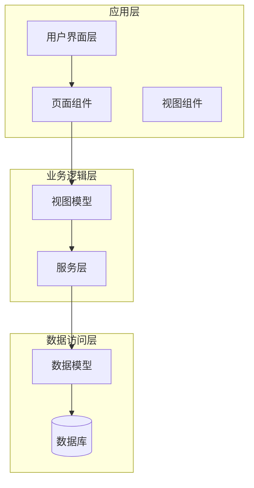

**图表来源**
- [Index.ets:1080-1146](file://entry/src/main/ets/pages/Index.ets#L1080-L1146)
- [EditPlantSheet.ets:1-264](file://entry/src/main/ets/view/EditPlantSheet.ets#L1-L264)

## 核心组件架构

### 组件层次结构

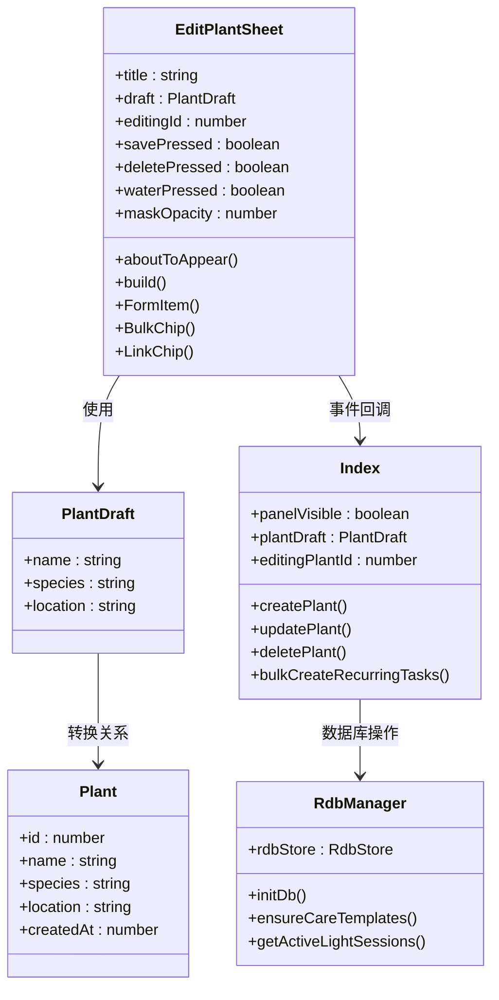

**图表来源**
- [EditPlantSheet.ets:1-264](file://entry/src/main/ets/view/EditPlantSheet.ets#L1-L264)
- [PlantModel.ets:62-75](file://entry/src/main/ets/model/PlantModel.ets#L62-L75)
- [RdbManager.ets:4-295](file://entry/src/main/ets/viewmodel/RdbManager.ets#L4-L295)
- [Index.ets:1080-1146](file://entry/src/main/ets/pages/Index.ets#L1080-L1146)

## EditPlantSheet 组件详解

### 组件特性

EditPlantSheet 是一个基于 ArkTS 的结构化组件，具有以下核心特性：

1. **响应式设计**：支持键盘避让模式，自动适配不同设备
2. **动画效果**：包含淡入淡出、缩放等流畅动画
3. **事件驱动**：通过事件回调实现与父组件的解耦通信
4. **表单验证**：内置基本的数据验证逻辑

### 组件接口

| 属性 | 类型 | 必需 | 描述 |
|------|------|------|------|
| title | string | ✓ | 抽屉标题文本 |
| draft | PlantDraft | ✓ | 植物编辑草稿对象 |
| editingId | number | ✓ | 当前编辑的植物ID（0表示新建） |
| onSave | () => void | ✓ | 保存事件回调 |
| onDelete | () => void | ✓ | 删除事件回调 |
| onClose | () => void | ✓ | 关闭事件回调 |
| onQuickWater | () => void | ✓ | 快速浇水事件回调 |
| onBulkSchedule | (type: string, everyDays: number, times: number) => void | ✓ | 批量计划事件回调 |
| onOpenTpl | () => void | ✓ | 打开模板事件回调 |
| onOpenLogs | () => void | ✓ | 打开日志事件回调 |

### 用户界面布局

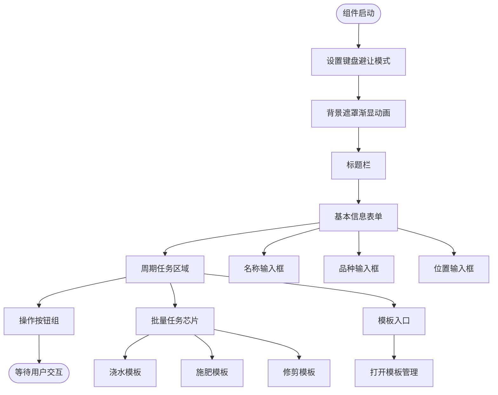

**图表来源**
- [EditPlantSheet.ets:24-206](file://entry/src/main/ets/view/EditPlantSheet.ets#L24-L206)

### 交互流程

#### 保存植物信息流程

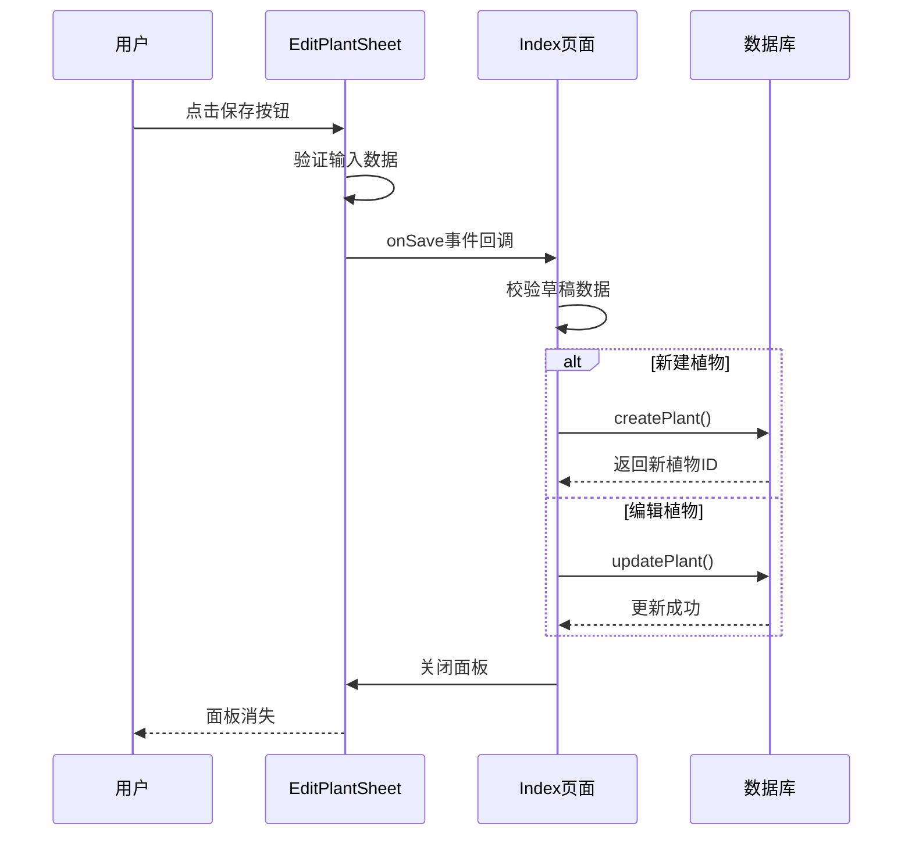

**图表来源**
- [EditPlantSheet.ets:1091-1104](file://entry/src/main/ets/view/EditPlantSheet.ets#L1091-L1104)
- [Index.ets:1091-1104](file://entry/src/main/ets/pages/Index.ets#L1091-L1104)

#### 批量任务生成流程

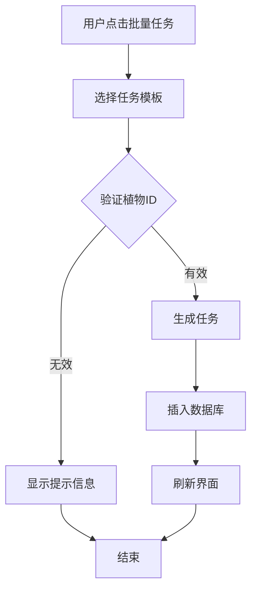

**图表来源**
- [EditPlantSheet.ets:1126-1132](file://entry/src/main/ets/view/EditPlantSheet.ets#L1126-L1132)
- [Index.ets:1126-1132](file://entry/src/main/ets/pages/Index.ets#L1126-L1132)

## 数据模型体系

### 核心数据模型

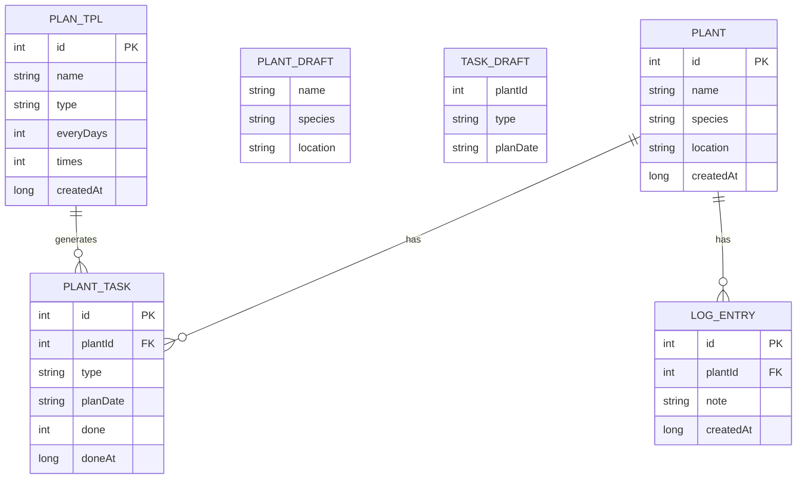

**图表来源**
- [PlantModel.ets:7-147](file://entry/src/main/ets/model/PlantModel.ets#L7-L147)

### 数据模型关系

| 模型 | 描述 | 主要字段 |
|------|------|----------|
| Plant | 植物实体 | id, name, species, location, createdAt |
| PlantDraft | 植物编辑草稿 | name, species, location |
| TaskDraft | 任务编辑草稿 | plantId, type, planDate |
| PlanTpl | 周期模板 | id, name, type, everyDays, times, createdAt |
| PlantTask | 植物任务 | id, plantId, type, planDate, done, doneAt |
| LogEntry | 日志条目 | id, plantId, note, createdAt |

**章节来源**
- [PlantModel.ets:62-90](file://entry/src/main/ets/model/PlantModel.ets#L62-L90)

## 数据库设计

### 数据库架构

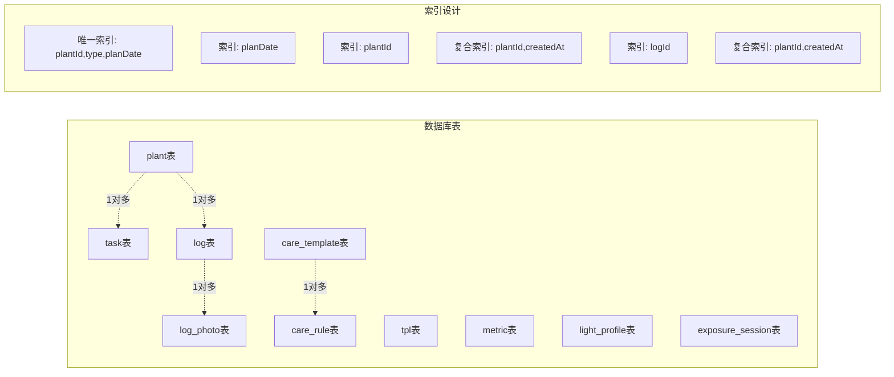

**图表来源**
- [RdbManager.ets:36-170](file://entry/src/main/ets/viewmodel/RdbManager.ets#L36-L170)

### 数据库初始化流程

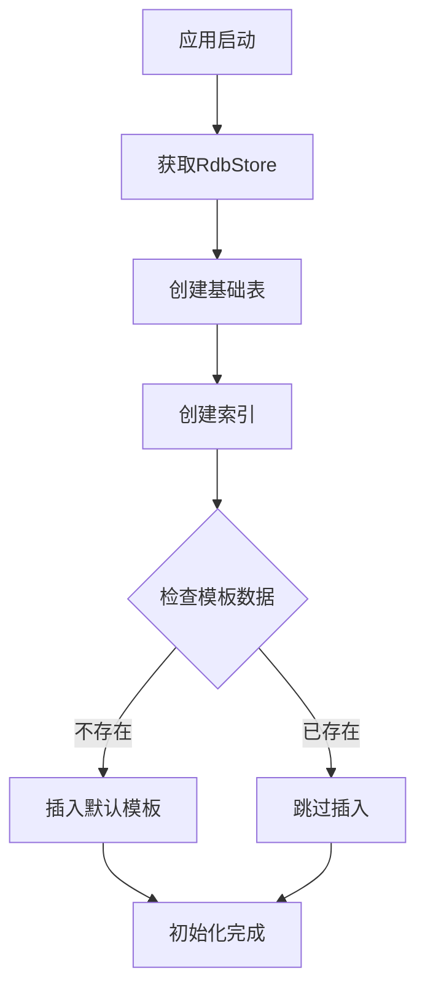

**图表来源**
- [RdbManager.ets:27-170](file://entry/src/main/ets/viewmodel/RdbManager.ets#L27-L170)

## 用户界面交互流程

### 完整工作流程

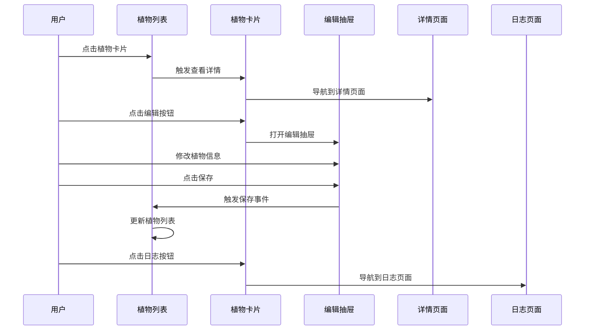

**图表来源**
- [PlantCard.ets:169-209](file://entry/src/main/ets/view/PlantCard.ets#L169-L209)
- [EditPlantSheet.ets:1086-1146](file://entry/src/main/ets/view/EditPlantSheet.ets#L1086-L1146)
- [PlantDetail.ets:78-81](file://entry/src/main/ets/pages/PlantDetail.ets#L78-L81)

### 模板应用流程

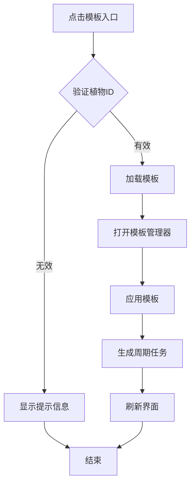

**图表来源**
- [EditPlantSheet.ets:1133-1136](file://entry/src/main/ets/view/EditPlantSheet.ets#L1133-L1136)
- [Index.ets:1133-1136](file://entry/src/main/ets/pages/Index.ets#L1133-L1136)

## 组件依赖关系分析

### 组件间依赖图

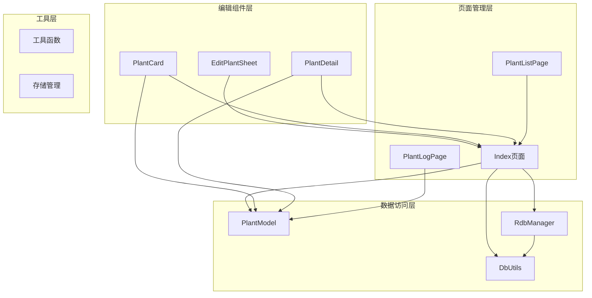

**图表来源**
- [EditPlantSheet.ets:1-10](file://entry/src/main/ets/view/EditPlantSheet.ets#L1-L10)
- [Index.ets:1080-1146](file://entry/src/main/ets/pages/Index.ets#L1080-L1146)
- [PlantCard.ets:1-25](file://entry/src/main/ets/view/PlantCard.ets#L1-L25)

### 事件传播机制

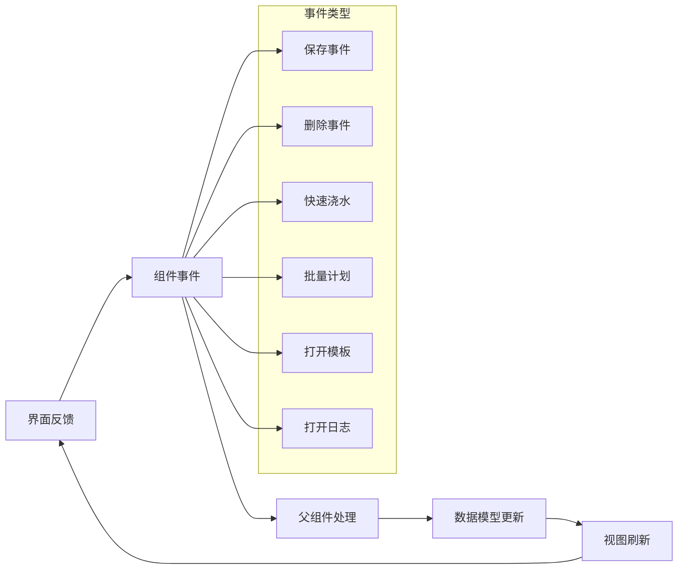

**图表来源**
- [EditPlantSheet.ets:10-16](file://entry/src/main/ets/view/EditPlantSheet.ets#L10-L16)

## 性能优化考虑

### 内存管理策略

1. **响应式数据绑定**：使用 `@ObservedV2` 和 `@Local` 注解优化数据更新性能
2. **懒加载机制**：日志和照片数据按需加载，避免不必要的数据库查询
3. **动画优化**：使用 `animateTo` 方法进行硬件加速的动画渲染

### 数据库性能优化

1. **索引设计**：为常用查询字段建立复合索引
2. **事务处理**：使用 `runInTransaction` 确保数据一致性
3. **批量操作**：支持批量任务生成，减少数据库往返次数

### 界面性能优化

1. **虚拟滚动**：列表组件支持虚拟滚动，提高大数据集渲染性能
2. **按需渲染**：组件仅在必要时重新渲染
3. **资源复用**：图片和图标资源进行缓存复用

## 故障排除指南

### 常见问题及解决方案

#### 数据库连接问题

**问题症状**：组件无法正常加载或保存数据
**可能原因**：
- 数据库初始化失败
- 权限不足
- 存储空间不足

**解决步骤**：
1. 检查数据库连接状态
2. 验证应用权限
3. 确认存储空间充足
4. 重启应用重新初始化数据库

#### 动画异常问题

**问题症状**：抽屉动画卡顿或不显示
**可能原因**：
- 动画参数配置错误
- 设备性能不足
- 内存泄漏

**解决步骤**：
1. 检查动画配置参数
2. 降低动画复杂度
3. 监控内存使用情况
4. 优化组件生命周期

#### 数据同步问题

**问题症状**：界面显示与数据库状态不一致
**可能原因**：
- 事件回调未正确触发
- 数据模型更新延迟
- 组件状态管理混乱

**解决步骤**：
1. 验证事件回调链路
2. 检查数据模型更新逻辑
3. 确保组件状态同步
4. 实施数据一致性检查

**章节来源**
- [DbUtils.ets:12-21](file://entry/src/main/ets/model/DbUtils.ets#L12-L21)
- [RdbManager.ets:173-276](file://entry/src/main/ets/viewmodel/RdbManager.ets#L173-L276)

## 总结

Edit Plant Sheet 组件作为 PlantDiary 应用的核心编辑界面，展现了现代移动应用开发的最佳实践：

### 技术亮点

1. **架构清晰**：采用分层架构，职责分离明确
2. **用户体验优秀**：流畅的动画效果和直观的操作界面
3. **数据安全可靠**：完善的事务处理和数据验证机制
4. **性能优化到位**：合理的内存管理和数据库优化策略

### 设计优势

1. **组件化设计**：高度模块化的组件结构，便于维护和扩展
2. **事件驱动**：松耦合的事件通信机制，提高代码可测试性
3. **响应式编程**：自动化的数据绑定和界面更新
4. **错误处理完善**：全面的异常捕获和用户反馈机制

### 发展建议

1. **功能扩展**：可考虑添加植物图片上传、地理位置标记等功能
2. **个性化定制**：支持用户自定义植物分类和标签系统
3. **智能提醒**：集成智能提醒功能，根据植物需求自动推送提醒
4. **数据分析**：增强数据分析功能，帮助用户更好地了解植物健康状况

通过持续的优化和功能扩展，Edit Plant Sheet 组件将继续为用户提供优质的植物养护管理体验。