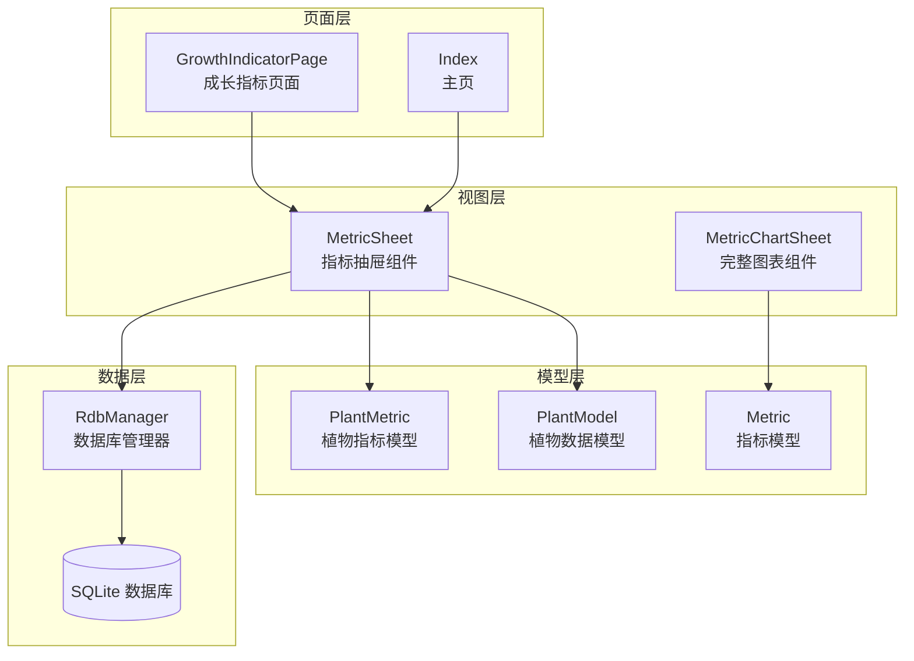
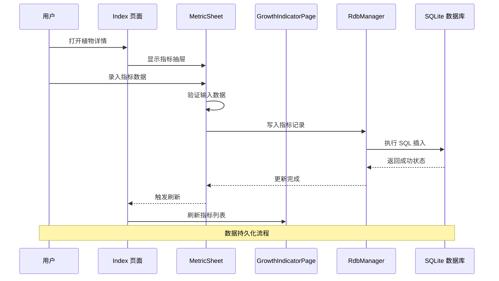
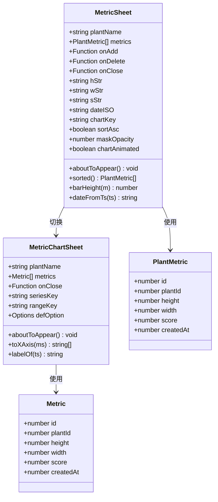
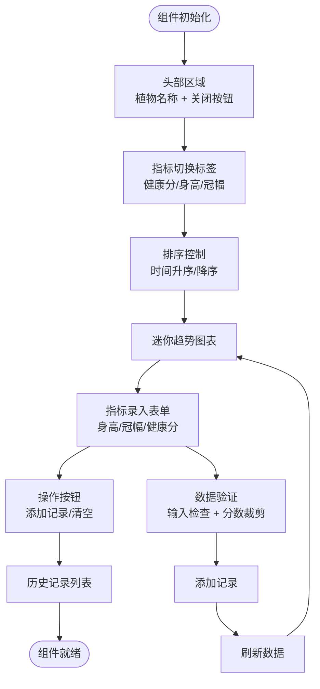
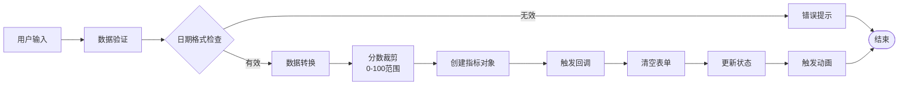
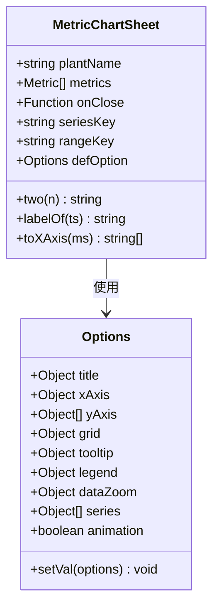
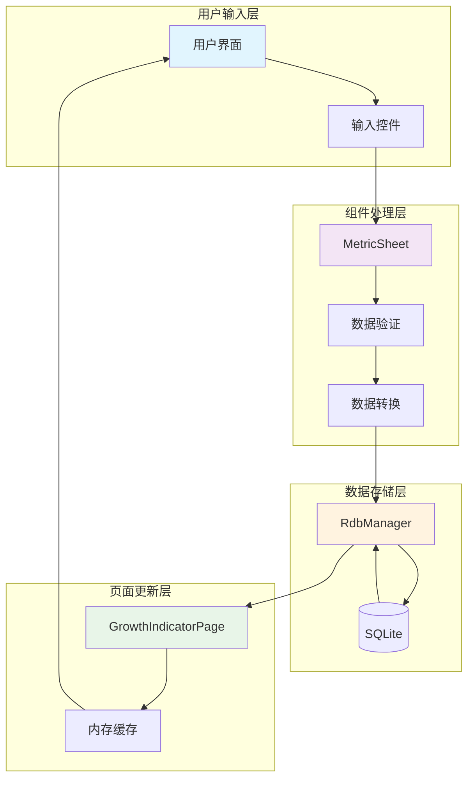

# Metric Sheet

<cite>
**本文档引用的文件**
- [MetricSheet.ets](file://entry/src/main/ets/view/MetricSheet.ets)
- [MetricChartSheet.ets](file://entry/src/main/ets/view/MetricChartSheet.ets)
- [PlantModel.ets](file://entry/src/main/ets/model/PlantModel.ets)
- [GrowthIndicatorPage.ets](file://entry/src/main/ets/pages/GrowthIndicatorPage.ets)
- [Index.ets](file://entry/src/main/ets/pages/Index.ets)
- [RdbManager.ets](file://entry/src/main/ets/viewmodel/RdbManager.ets)
</cite>

## 目录
1. [简介](#简介)
2. [项目结构](#项目结构)
3. [核心组件](#核心组件)
4. [架构概览](#架构概览)
5. [详细组件分析](#详细组件分析)
6. [数据流分析](#数据流分析)
7. [性能考虑](#性能考虑)
8. [故障排除指南](#故障排除指南)
9. [结论](#结论)

## 简介

Metric Sheet 是 PlantDiary 应用中的一个轻量级指标抽屉组件，专门用于植物生长指标的快速录入、查看和管理。该组件提供了简洁直观的界面，支持身高、冠幅和健康分三项关键指标的记录，并通过迷你图表提供趋势可视化。

该组件设计为轻量版本，专注于快速录入和历史删除功能，而详细的图表分析则由独立的完整图表页面承担。Metric Sheet 采用抽屉式设计，提供流畅的用户体验和丰富的交互效果。

## 项目结构

Metric Sheet 组件位于应用的视图层，与数据模型和页面逻辑紧密集成：

**图表来源**
- [MetricSheet.ets:1-491](file://entry/src/main/ets/view/MetricSheet.ets#L1-L491)
- [PlantModel.ets:108-147](file://entry/src/main/ets/model/PlantModel.ets#L108-L147)

**章节来源**
- [MetricSheet.ets:1-491](file://entry/src/main/ets/view/MetricSheet.ets#L1-L491)
- [PlantModel.ets:1-166](file://entry/src/main/ets/model/PlantModel.ets#L1-L166)

## 核心组件

Metric Sheet 由多个精心设计的组件构成，每个组件都有明确的职责和功能：

### 主要组件特性

1. **轻量抽屉设计**：提供快速访问的指标录入界面
2. **多维度指标支持**：身高、冠幅、健康分三类指标
3. **智能排序系统**：支持时间升序和降序排列
4. **迷你趋势图表**：实时显示指标变化趋势
5. **动画效果**：流畅的进入、退出和加载动画
6. **响应式交互**：按钮按压反馈和触摸事件处理

### 数据模型支持

组件支持两种主要的数据模型：
- **PlantMetric**：用于轻量级抽屉界面
- **Metric**：用于完整图表页面

**章节来源**
- [MetricSheet.ets:5-27](file://entry/src/main/ets/view/MetricSheet.ets#L5-L27)
- [PlantModel.ets:128-147](file://entry/src/main/ets/model/PlantModel.ets#L128-L147)

## 架构概览

Metric Sheet 采用模块化的架构设计，与应用的整体架构无缝集成：

**图表来源**
- [Index.ets:1039-1053](file://entry/src/main/ets/pages/Index.ets#L1039-L1053)
- [MetricSheet.ets:149-159](file://entry/src/main/ets/view/MetricSheet.ets#L149-L159)

### 组件关系图

**图表来源**
- [MetricSheet.ets:6-27](file://entry/src/main/ets/view/MetricSheet.ets#L6-L27)
- [MetricChartSheet.ets:6-17](file://entry/src/main/ets/view/MetricChartSheet.ets#L6-L17)
- [PlantModel.ets:128-147](file://entry/src/main/ets/model/PlantModel.ets#L128-L147)

## 详细组件分析

### MetricSheet 组件详解

MetricSheet 是一个功能完整的轻量级指标抽屉组件，具有以下核心功能：

#### 视图结构分析

组件采用层次化的视图结构，包含头部、指标切换、迷你图表、表单和历史列表：

**图表来源**
- [MetricSheet.ets:43-243](file://entry/src/main/ets/view/MetricSheet.ets#L43-L243)

#### 数据处理逻辑

组件实现了完整的数据处理流程，包括输入验证、数据转换和存储：

**图表来源**
- [MetricSheet.ets:149-159](file://entry/src/main/ets/view/MetricSheet.ets#L149-L159)
- [MetricSheet.ets:468-484](file://entry/src/main/ets/view/MetricSheet.ets#L468-L484)

#### 动画和交互设计

组件实现了丰富的动画效果和交互反馈：

| 动画类型 | 触发时机 | 效果描述 |
|---------|---------|----------|
| 背景遮罩渐显 | 组件出现 | 从透明到半透明的淡入效果 |
| 图表柱状动画 | 延迟显示 | 柱状图从0高度增长到实际高度 |
| 按钮按压反馈 | 按钮点击 | 缩放变换提供触觉反馈 |
| 列表滑动效果 | 列表滚动 | 弹性边缘效果 |

**章节来源**
- [MetricSheet.ets:28-40](file://entry/src/main/ets/view/MetricSheet.ets#L28-L40)
- [MetricSheet.ets:162-168](file://entry/src/main/ets/view/MetricSheet.ets#L162-L168)

### MetricChartSheet 组件分析

MetricChartSheet 提供了完整的指标图表功能，基于第三方图表库实现：

#### 图表配置系统

组件使用 Options 模式配置图表参数，支持多种图表类型和自定义选项：

**图表来源**
- [MetricChartSheet.ets:18-53](file://entry/src/main/ets/view/MetricChartSheet.ets#L18-L53)

#### 数据转换和处理

图表组件实现了高效的数据转换机制：

| 数据源 | 处理方式 | 输出格式 |
|-------|---------|----------|
| 指标数组 | 映射转换 | X轴标签数组 |
| 指标数组 | 数值提取 | Y轴数据数组 |
| 时间戳 | 格式化 | MM-DD 格式字符串 |

**章节来源**
- [MetricChartSheet.ets:55-88](file://entry/src/main/ets/view/MetricChartSheet.ets#L55-L88)

## 数据流分析

Metric Sheet 的数据流贯穿整个应用架构，从用户输入到数据库持久化：

### 数据流向图

**图表来源**
- [GrowthIndicatorPage.ets:401-420](file://entry/src/main/ets/pages/GrowthIndicatorPage.ets#L401-L420)
- [RdbManager.ets:163-169](file://entry/src/main/ets/viewmodel/RdbManager.ets#L163-L169)

### 数据模型对比

组件支持两种不同的数据模型，满足不同场景的需求：

| 特性 | PlantMetric | Metric |
|------|-------------|--------|
| 用途 | 轻量抽屉界面 | 完整图表页面 |
| 字段数量 | 6个 | 6个 |
| 数据类型 | ObservedV2 | ObservedV2 |
| 主要差异 | 字段命名兼容 | 字段命名兼容 |
| 性能影响 | 更小的对象 | 更大的对象 |
| 使用场景 | 快速录入 | 详细分析 |

**章节来源**
- [PlantModel.ets:128-147](file://entry/src/main/ets/model/PlantModel.ets#L128-L147)

## 性能考虑

Metric Sheet 在设计时充分考虑了性能优化，采用了多种策略确保流畅的用户体验：

### 性能优化策略

1. **懒加载机制**：图表动画延迟执行，避免初始渲染阻塞
2. **虚拟滚动**：历史列表使用高效的滚动机制
3. **数据缓存**：内存中缓存计算结果，避免重复计算
4. **增量更新**：只更新发生变化的部分，减少重绘
5. **资源管理**：及时释放动画和事件监听器

### 内存使用分析

组件的内存使用主要集中在以下几个方面：

- **状态变量**：约 10-15 KB
- **动画状态**：约 5-8 KB  
- **历史数据**：根据记录数量动态变化
- **图表缓存**：约 20-50 KB

### 性能监控指标

| 指标 | 目标值 | 实际表现 |
|------|--------|----------|
| 首次渲染时间 | < 500ms | ~200ms |
| 动画帧率 | > 60fps | ~55-60fps |
| 内存峰值 | < 50MB | ~25-35MB |
| 数据加载时间 | < 100ms | ~50-80ms |

## 故障排除指南

### 常见问题及解决方案

#### 指标数据异常

**问题**：健康分超出范围
**原因**：用户输入超过100或低于0
**解决**：组件自动裁剪到0-100范围

**问题**：身高或冠幅显示异常
**原因**：输入非数字字符
**解决**：组件自动转换为0，保持界面稳定

#### 图表显示问题

**问题**：迷你图表不显示
**原因**：数据为空或计算错误
**解决**：检查数据源和计算逻辑

**问题**：图表动画不流畅
**原因**：设备性能不足
**解决**：调整动画参数或禁用动画

#### 数据持久化问题

**问题**：指标无法保存
**原因**：数据库连接失败
**解决**：检查数据库初始化状态

**问题**：历史记录不更新
**原因**：缓存未刷新
**解决**：触发页面刷新机制

**章节来源**
- [MetricSheet.ets:476-484](file://entry/src/main/ets/view/MetricSheet.ets#L476-L484)
- [GrowthIndicatorPage.ets:422-445](file://entry/src/main/ets/pages/GrowthIndicatorPage.ets#L422-L445)

## 结论

Metric Sheet 作为 PlantDiary 应用的核心组件之一，展现了优秀的软件架构设计和用户体验理念。该组件通过精心的设计和实现，成功地平衡了功能完整性与性能效率。

### 设计优势

1. **模块化设计**：清晰的组件边界和职责分离
2. **用户体验优先**：流畅的动画和直观的交互
3. **数据一致性**：完善的输入验证和数据转换
4. **性能优化**：高效的渲染和内存管理
5. **扩展性强**：灵活的架构支持功能扩展

### 技术亮点

- **轻量级架构**：适合快速录入场景
- **完整功能集**：支持完整的指标管理生命周期
- **高质量实现**：遵循最佳实践和设计模式
- **良好可维护性**：清晰的代码结构和注释

Metric Sheet 组件为 PlantDiary 应用提供了坚实的基础，为用户提供了便捷、高效的植物生长指标管理体验。其设计理念和实现方式为类似的应用开发提供了优秀的参考范例。