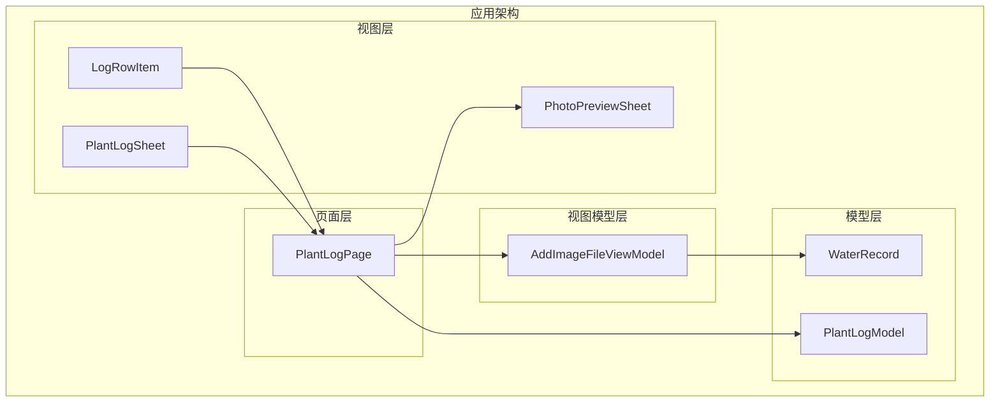
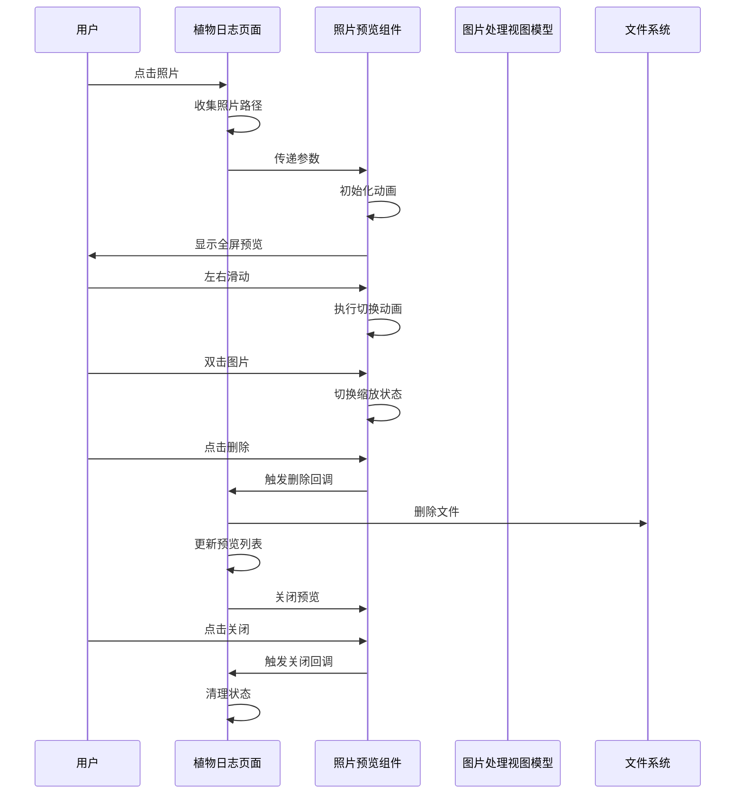
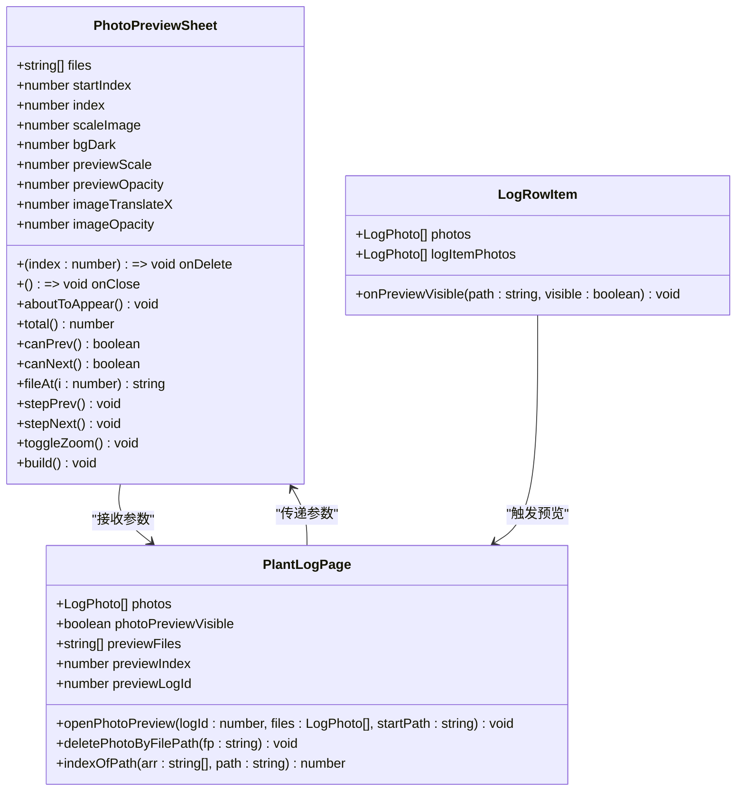
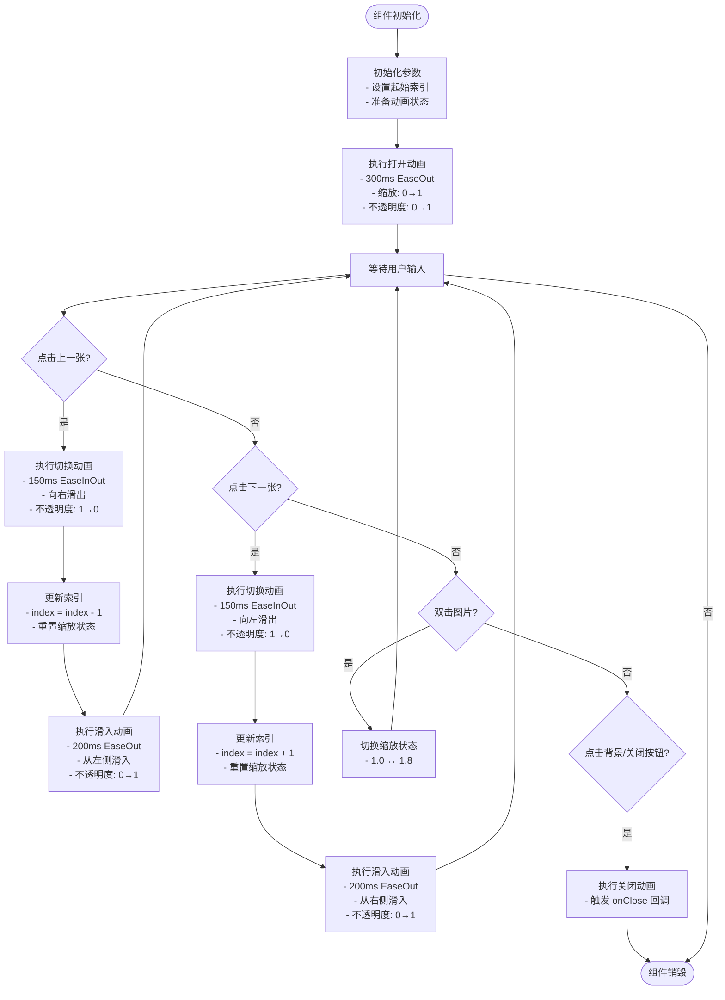
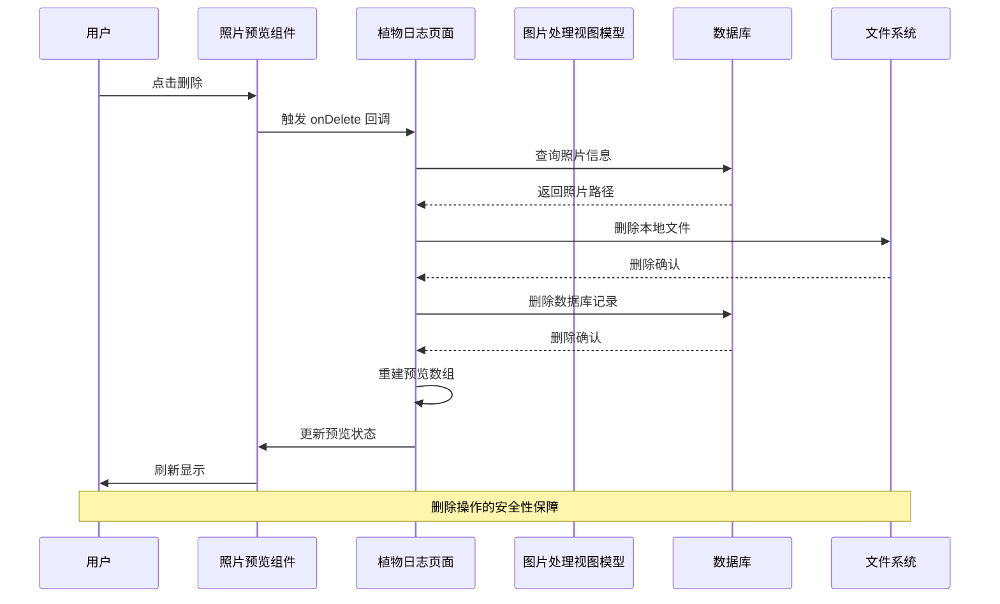
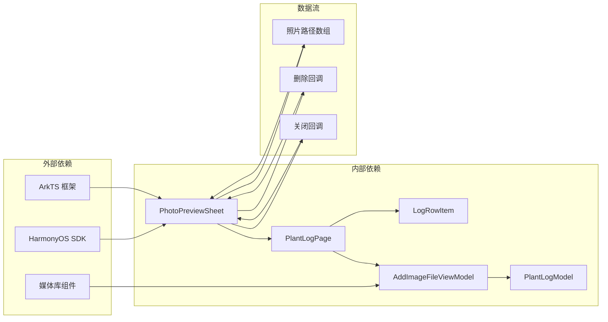

# Photo Preview Sheet

<cite>
**本文档引用的文件**
- [PhotoPreviewSheet.ets](file://entry/src/main/ets/view/PhotoPreviewSheet.ets)
- [AddImageFileViewModel.ets](file://entry/src/main/ets/viewmodel/AddImageFileViewModel.ets)
- [PlantLogPage.ets](file://entry/src/main/ets/pages/PlantLogPage.ets)
- [LogRowItem.ets](file://entry/src/main/ets/view/LogRowItem.ets)
- [PlantLogSheet.ets](file://entry/src/main/ets/view/PlantLogSheet.ets)
- [WaterRecord.ets](file://entry/src/main/ets/model/WaterRecord.ets)
- [PlantLogModel.ets](file://entry/src/main/ets/model/PlantLogModel.ets)
- [build-profile.json5](file://entry/build-profile.json5)
</cite>

## 目录
1. [简介](#简介)
2. [项目结构](#项目结构)
3. [核心组件](#核心组件)
4. [架构概览](#架构概览)
5. [详细组件分析](#详细组件分析)
6. [依赖关系分析](#依赖关系分析)
7. [性能考虑](#性能考虑)
8. [故障排除指南](#故障排除指南)
9. [结论](#结论)

## 简介

Photo Preview Sheet 是 PlantDiary 应用中的一个关键组件，用于提供植物照片的全屏预览功能。该组件实现了现代化的图片浏览体验，包括图片缩放、滑动切换、删除操作和流畅的动画效果。作为应用的核心功能之一，它为用户提供了直观便捷的照片管理界面。

该组件采用 ArkTS 框架开发，充分利用了 HarmonyOS 的 UI 组件系统和响应式编程特性。通过精心设计的动画效果和交互逻辑，为用户提供了流畅自然的使用体验。

## 项目结构

PlantDiary 项目采用模块化的架构设计，Photo Preview Sheet 组件位于视图层的合适位置，与其他组件形成了清晰的层次结构。

**图表来源**
- [PhotoPreviewSheet.ets:1-223](file://entry/src/main/ets/view/PhotoPreviewSheet.ets#L1-L223)
- [PlantLogPage.ets:1-1030](file://entry/src/main/ets/pages/PlantLogPage.ets#L1-L1030)

**章节来源**
- [PhotoPreviewSheet.ets:1-223](file://entry/src/main/ets/view/PhotoPreviewSheet.ets#L1-L223)
- [PlantLogPage.ets:1-1030](file://entry/src/main/ets/pages/PlantLogPage.ets#L1-L1030)

## 核心组件

Photo Preview Sheet 组件是整个照片预览功能的核心，具有以下关键特性：

### 主要功能特性

1. **全屏预览模式** - 提供沉浸式的图片浏览体验
2. **多图片导航** - 支持左右滑动切换不同图片
3. **缩放控制** - 支持双击放大/缩小功能
4. **删除操作** - 提供安全的图片删除机制
5. **动画过渡** - 流畅的切换和关闭动画效果
6. **响应式设计** - 适配不同屏幕尺寸和方向

### 核心参数

| 参数名称 | 类型 | 必需 | 描述 |
|---------|------|------|------|
| files | Array<string> | 是 | 图片文件路径数组 |
| startIndex | number | 是 | 初始显示的图片索引 |
| onDelete | (index: number) => void | 是 | 删除回调函数 |
| onClose | () => void | 是 | 关闭回调函数 |

**章节来源**
- [PhotoPreviewSheet.ets:4-8](file://entry/src/main/ets/view/PhotoPreviewSheet.ets#L4-L8)

## 架构概览

Photo Preview Sheet 在 PlantDiary 应用中的架构位置体现了清晰的分层设计原则。

**图表来源**
- [PlantLogPage.ets:612-636](file://entry/src/main/ets/pages/PlantLogPage.ets#L612-L636)
- [PhotoPreviewSheet.ets:102-221](file://entry/src/main/ets/view/PhotoPreviewSheet.ets#L102-L221)

## 详细组件分析

### PhotoPreviewSheet 组件架构

PhotoPreviewSheet 采用了组件化的设计模式，通过参数传递和事件回调实现与父组件的通信。

**图表来源**
- [PhotoPreviewSheet.ets:3-100](file://entry/src/main/ets/view/PhotoPreviewSheet.ets#L3-L100)
- [PlantLogPage.ets:751-762](file://entry/src/main/ets/pages/PlantLogPage.ets#L751-L762)
- [LogRowItem.ets:167-169](file://entry/src/main/ets/view/LogRowItem.ets#L167-L169)

### 动画系统设计

Photo Preview Sheet 实现了复杂的动画系统，确保用户获得流畅的交互体验。

**图表来源**
- [PhotoPreviewSheet.ets:17-92](file://entry/src/main/ets/view/PhotoPreviewSheet.ets#L17-L92)

### 图片管理流程

Photo Preview Sheet 与 AddImageFileViewModel 协作，实现完整的图片管理功能。

**图表来源**
- [PlantLogPage.ets:616-631](file://entry/src/main/ets/pages/PlantLogPage.ets#L616-L631)
- [AddImageFileViewModel.ets:35-55](file://entry/src/main/ets/viewmodel/AddImageFileViewModel.ets#L35-L55)

**章节来源**
- [PhotoPreviewSheet.ets:102-221](file://entry/src/main/ets/view/PhotoPreviewSheet.ets#L102-L221)
- [PlantLogPage.ets:612-636](file://entry/src/main/ets/pages/PlantLogPage.ets#L612-L636)

## 依赖关系分析

Photo Preview Sheet 组件在整个应用生态系统中扮演着重要的桥梁角色，连接着不同的功能模块。

**图表来源**
- [PhotoPreviewSheet.ets:1-223](file://entry/src/main/ets/view/PhotoPreviewSheet.ets#L1-L223)
- [AddImageFileViewModel.ets:1-146](file://entry/src/main/ets/viewmodel/AddImageFileViewModel.ets#L1-L146)

### 组件耦合度分析

Photo Preview Sheet 与 PlantLogPage 之间建立了松耦合的关系，通过参数传递和事件回调实现通信，降低了组件间的依赖程度。

| 分析维度 | 评估结果 | 说明 |
|---------|----------|------|
| 耦合度 | 低 | 通过参数和回调通信，无直接依赖 |
| 内聚性 | 高 | 专注于图片预览功能，职责明确 |
| 可测试性 | 良好 | 参数驱动，易于单元测试 |
| 可维护性 | 良好 | 结构清晰，接口稳定 |
| 可扩展性 | 良好 | 支持自定义回调和参数扩展 |

**章节来源**
- [PlantLogPage.ets:612-636](file://entry/src/main/ets/pages/PlantLogPage.ets#L612-L636)
- [PhotoPreviewSheet.ets:4-8](file://entry/src/main/ets/view/PhotoPreviewSheet.ets#L4-L8)

## 性能考虑

Photo Preview Sheet 在设计时充分考虑了性能优化，特别是在图片渲染和内存管理方面。

### 性能优化策略

1. **懒加载机制** - 图片仅在需要时加载，减少内存占用
2. **动画优化** - 使用硬件加速的动画属性，确保流畅度
3. **状态管理** - 合理的状态更新策略，避免不必要的重绘
4. **生命周期管理** - 在组件销毁时清理资源和事件监听器

### 内存管理

组件实现了智能的内存管理策略，包括：
- 图片缩放状态的动态切换
- 动画完成后的状态清理
- 事件监听器的及时移除

### 用户体验优化

- **响应式设计** - 适配不同屏幕尺寸和分辨率
- **流畅动画** - 150-300ms 的动画时长提供自然的过渡效果
- **触摸反馈** - 提供即时的触摸响应和视觉反馈

## 故障排除指南

### 常见问题及解决方案

#### 1. 图片无法显示

**症状**: 预览界面显示空白或加载失败

**可能原因**:
- 文件路径无效或不存在
- 权限不足访问文件
- 文件格式不受支持

**解决步骤**:
1. 验证文件路径的有效性
2. 检查应用的文件访问权限
3. 确认图片格式的兼容性

#### 2. 动画卡顿

**症状**: 图片切换或缩放动画不流畅

**可能原因**:
- 设备性能不足
- 图片尺寸过大
- 同时运行的动画过多

**解决步骤**:
1. 优化图片尺寸和质量
2. 减少同时运行的动画数量
3. 考虑降低动画复杂度

#### 3. 删除功能异常

**症状**: 删除操作无法正常工作或出现数据不一致

**可能原因**:
- 数据库操作失败
- 文件删除失败
- 状态更新延迟

**解决步骤**:
1. 检查数据库连接状态
2. 验证文件系统权限
3. 实施重试机制和错误处理

**章节来源**
- [PlantLogPage.ets:722-749](file://entry/src/main/ets/pages/PlantLogPage.ets#L722-L749)
- [AddImageFileViewModel.ets:130-144](file://entry/src/main/ets/viewmodel/AddImageFileViewModel.ets#L130-L144)

## 结论

Photo Preview Sheet 组件是 PlantDiary 应用中一个设计精良的功能模块，展现了现代移动应用开发的最佳实践。通过合理的架构设计、完善的动画系统和健壮的错误处理机制，为用户提供了优质的图片预览体验。

该组件的主要优势包括：
- **模块化设计**: 清晰的职责分离和接口定义
- **性能优化**: 智能的资源管理和动画优化
- **用户体验**: 流畅的交互和直观的操作方式
- **可维护性**: 良好的代码结构和文档支持

在未来的发展中，可以考虑进一步增强的功能包括：
- 支持更多的图片格式
- 添加手势识别的扩展功能
- 实现离线缓存机制
- 增强图片编辑能力

总体而言，Photo Preview Sheet 组件为 PlantDiary 应用的成功奠定了坚实的技术基础，是应用生态系统中不可或缺的重要组成部分。