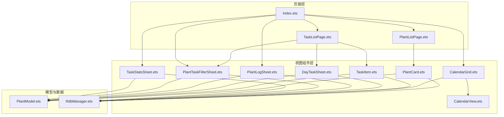
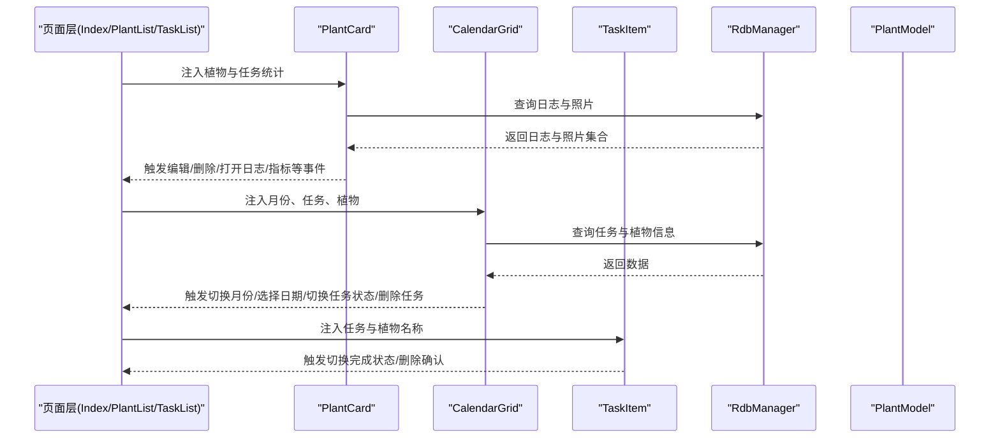
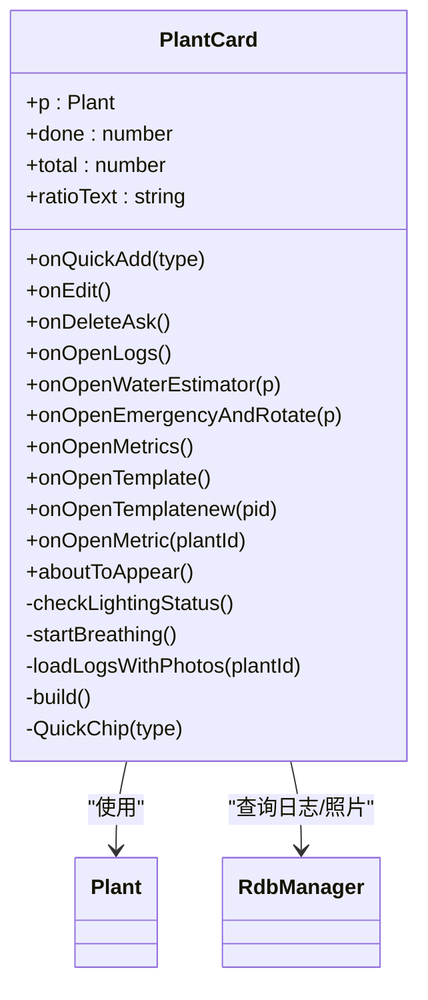
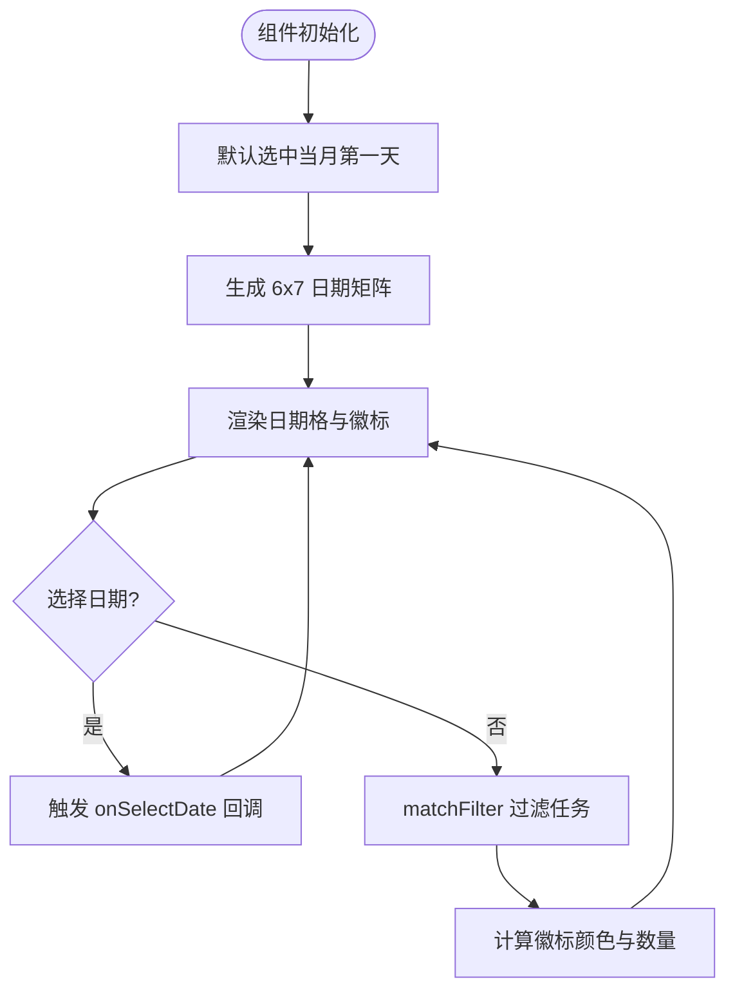
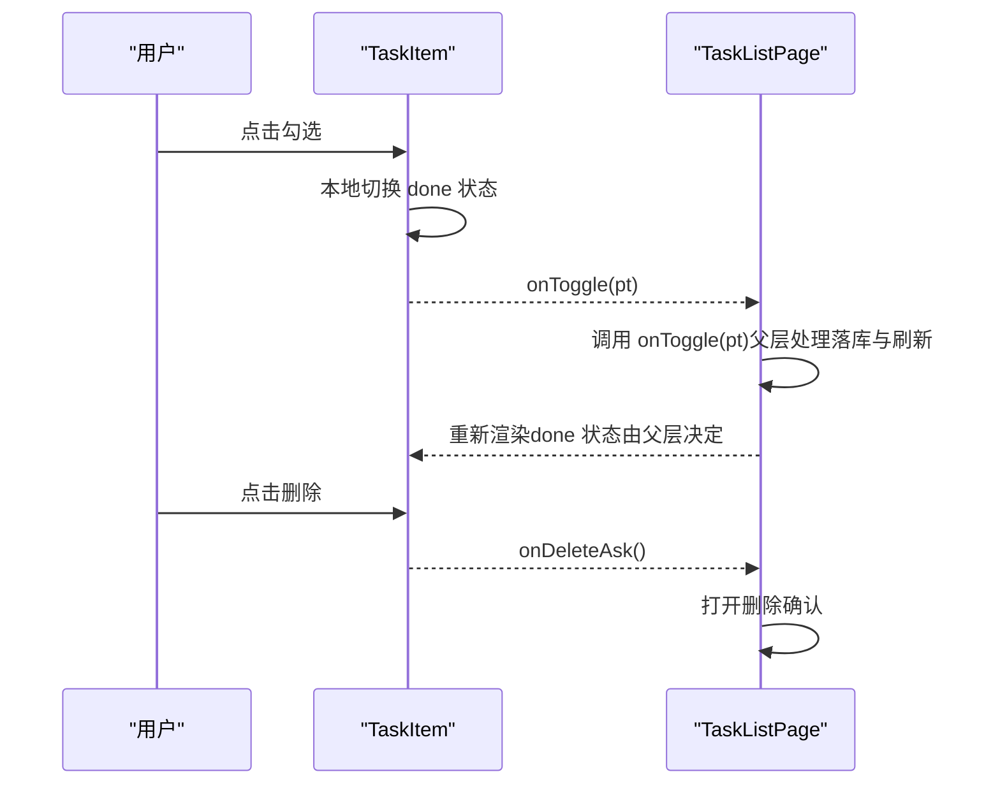
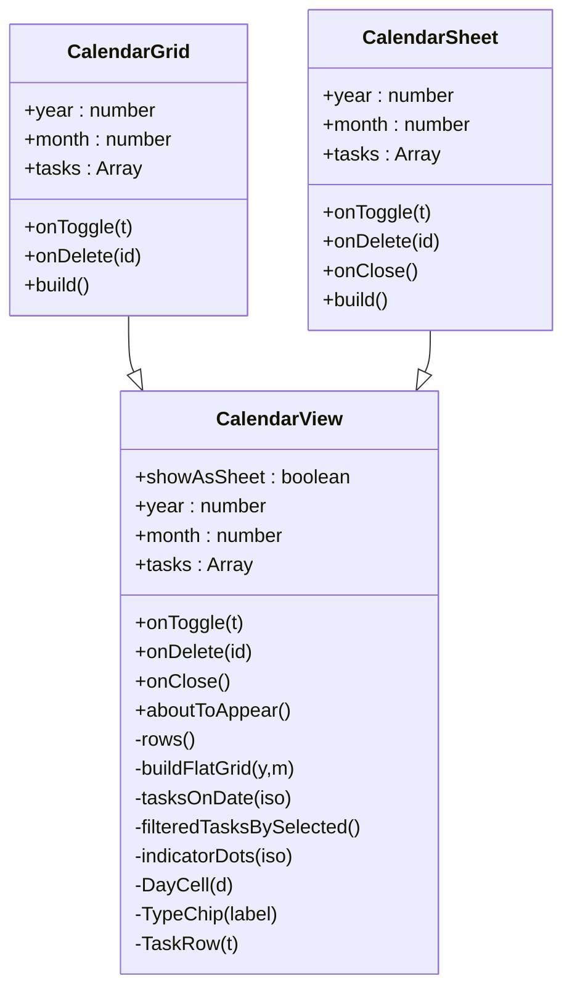
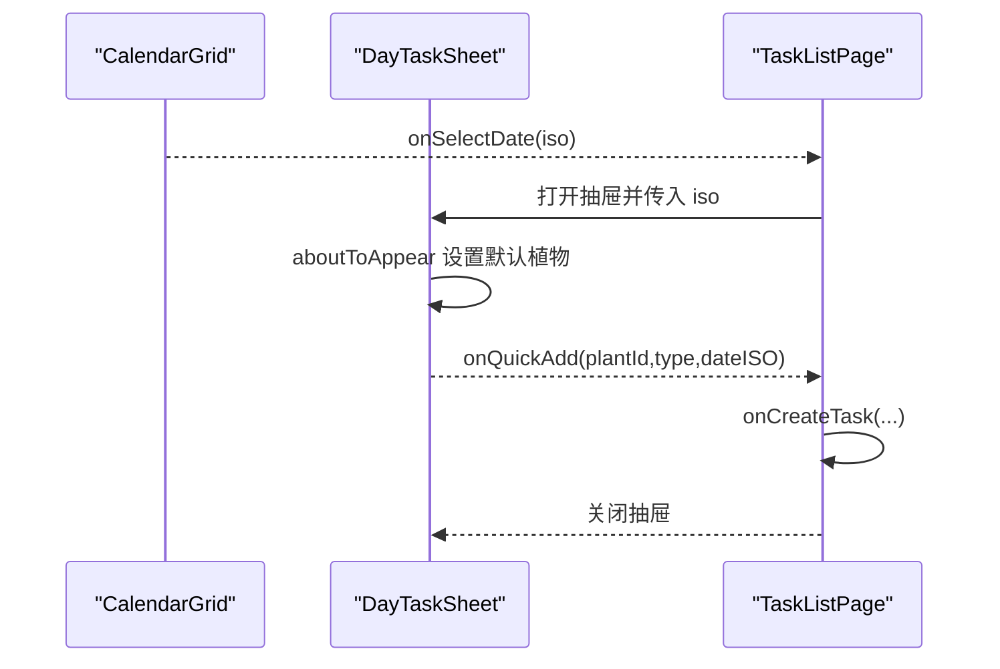
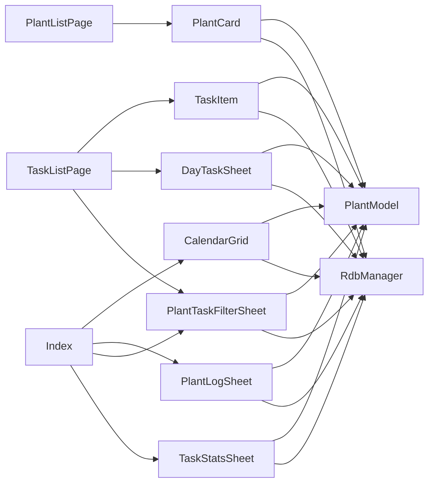

# UI组件

<cite>
**本文引用的文件**
- [PlantCard.ets](file://entry/src/main/ets/view/PlantCard.ets)
- [CalendarGrid.ets](file://entry/src/main/ets/view/CalendarGrid.ets)
- [TaskItem.ets](file://entry/src/main/ets/view/TaskItem.ets)
- [CalendarView.ets](file://entry/src/main/ets/view/CalendarView.ets)
- [DayTaskSheet.ets](file://entry/src/main/ets/view/DayTaskSheet.ets)
- [PlantLogSheet.ets](file://entry/src/main/ets/view/PlantLogSheet.ets)
- [PlantTaskFilterSheet.ets](file://entry/src/main/ets/view/PlantTaskFilterSheet.ets)
- [TaskStatsSheet.ets](file://entry/src/main/ets/view/TaskStatsSheet.ets)
- [PlantModel.ets](file://entry/src/main/ets/model/PlantModel.ets)
- [RdbManager.ets](file://entry/src/main/ets/viewmodel/RdbManager.ets)
- [Index.ets](file://entry/src/main/ets/pages/Index.ets)
- [PlantListPage.ets](file://entry/src/main/ets/pages/PlantListPage.ets)
- [TaskListPage.ets](file://entry/src/main/ets/pages/TaskListPage.ets)
</cite>

## 目录
1. [简介](#简介)
2. [项目结构](#项目结构)
3. [核心组件](#核心组件)
4. [架构总览](#架构总览)
5. [组件详解](#组件详解)
6. [依赖关系分析](#依赖关系分析)
7. [性能考量](#性能考量)
8. [故障排查指南](#故障排查指南)
9. [结论](#结论)
10. [附录](#附录)

## 简介
本文件面向植物日记项目的UI组件，系统性梳理可复用组件的设计理念、实现方式与使用规范。重点覆盖以下核心组件：
- 植物卡片：PlantCard
- 月历网格：CalendarGrid（及通用日历视图：CalendarView）
- 任务项：TaskItem
- 日任务抽屉：DayTaskSheet
- 日志抽屉：PlantLogSheet
- 任务筛选抽屉：PlantTaskFilterSheet
- 任务统计抽屉：TaskStatsSheet

文档将从组件属性配置、事件处理、样式定制、生命周期管理、状态更新、性能优化策略、使用示例与集成指南、组合模式与布局策略、主题适配与响应式设计、无障碍支持等方面进行全面说明，并提供API参考与最佳实践建议。

## 项目结构
UI组件主要位于 entry/src/main/ets/view 目录，配合 model 与 viewmodel 层的数据模型与数据库管理，页面层（pages）负责编排与状态协调。

图表来源
- [Index.ets:855-1198](file://entry/src/main/ets/pages/Index.ets#L855-L1198)
- [PlantListPage.ets:116-199](file://entry/src/main/ets/pages/PlantListPage.ets#L116-L199)
- [TaskListPage.ets:165-337](file://entry/src/main/ets/pages/TaskListPage.ets#L165-L337)
- [PlantCard.ets:1-326](file://entry/src/main/ets/view/PlantCard.ets#L1-L326)
- [CalendarGrid.ets:1-351](file://entry/src/main/ets/view/CalendarGrid.ets#L1-L351)
- [CalendarView.ets:1-566](file://entry/src/main/ets/view/CalendarView.ets#L1-L566)
- [TaskItem.ets:1-67](file://entry/src/main/ets/view/TaskItem.ets#L1-L67)
- [DayTaskSheet.ets:1-228](file://entry/src/main/ets/view/DayTaskSheet.ets#L1-L228)
- [PlantLogSheet.ets:1-384](file://entry/src/main/ets/view/PlantLogSheet.ets#L1-L384)
- [PlantTaskFilterSheet.ets:1-374](file://entry/src/main/ets/view/PlantTaskFilterSheet.ets#L1-L374)
- [TaskStatsSheet.ets:1-273](file://entry/src/main/ets/view/TaskStatsSheet.ets#L1-L273)
- [PlantModel.ets:1-166](file://entry/src/main/ets/model/PlantModel.ets#L1-L166)
- [RdbManager.ets:1-296](file://entry/src/main/ets/viewmodel/RdbManager.ets#L1-L296)

章节来源
- [Index.ets:855-1198](file://entry/src/main/ets/pages/Index.ets#L855-L1198)
- [PlantListPage.ets:116-199](file://entry/src/main/ets/pages/PlantListPage.ets#L116-L199)
- [TaskListPage.ets:165-337](file://entry/src/main/ets/pages/TaskListPage.ets#L165-L337)

## 核心组件
本节概述三大核心组件的设计目标与职责边界：
- PlantCard：聚合展示植物概览、任务进度、快捷操作入口，承载补光状态动画与图标交互反馈。
- CalendarGrid：月历网格组件，提供日期选择、任务徽标统计、当日任务列表联动。
- TaskItem：单条任务项，仅负责展示与交互回调，状态以父层重载为准，强调轻量与可复用。

章节来源
- [PlantCard.ets:6-326](file://entry/src/main/ets/view/PlantCard.ets#L6-L326)
- [CalendarGrid.ets:3-351](file://entry/src/main/ets/view/CalendarGrid.ets#L3-L351)
- [TaskItem.ets:4-67](file://entry/src/main/ets/view/TaskItem.ets#L4-L67)

## 架构总览
组件间通过参数传递与事件回调解耦，页面层统一管理状态与数据加载，组件层专注UI与交互。数据库通过 RdbManager 提供统一接入，模型层定义跨页面共享的数据结构。

图表来源
- [Index.ets:855-1198](file://entry/src/main/ets/pages/Index.ets#L855-L1198)
- [PlantListPage.ets:154-182](file://entry/src/main/ets/pages/PlantListPage.ets#L154-L182)
- [TaskListPage.ets:215-245](file://entry/src/main/ets/pages/TaskListPage.ets#L215-L245)
- [PlantCard.ets:80-111](file://entry/src/main/ets/view/PlantCard.ets#L80-L111)
- [CalendarGrid.ets:19-30](file://entry/src/main/ets/view/CalendarGrid.ets#L19-L30)
- [TaskItem.ets:13-15](file://entry/src/main/ets/view/TaskItem.ets#L13-L15)
- [RdbManager.ets:1-296](file://entry/src/main/ets/viewmodel/RdbManager.ets#L1-L296)
- [PlantModel.ets:1-166](file://entry/src/main/ets/model/PlantModel.ets#L1-L166)

## 组件详解

### PlantCard 组件
- 设计理念
  - 聚合展示：植物头像/名称、种类与位置、补光状态、任务进度、快捷入口。
  - 轻交互：通过事件回调将操作交由父页面统一处理，组件内部仅做本地反馈与动画。
- 关键属性
  - p: Plant（必填）
  - done: number（必填）
  - total: number（必填）
  - ratioText: string（必填）
- 事件
  - onQuickAdd(type: string): 触发快速创建今日任务
  - onEdit(): 打开编辑抽屉
  - onDeleteAsk(): 请求删除确认
  - onOpenLogs(): 打开日志抽屉
  - onOpenWaterEstimator(p: Plant): 打开用量估算器
  - onOpenEmergencyAndRotate(p: Plant): 打开应急与换盆页面
  - onOpenMetrics(): 打开指标抽屉
  - onOpenTemplate(): 打开模板管理
  - onOpenTemplatenew(pid: number): 打开模板新建
  - onOpenMetric(plantId: number): 打开指标图表
- 生命周期与状态
  - aboutToAppear: 异步加载最近日志与照片，检查补光状态并启动呼吸动画。
  - 本地状态：pressed、logs、photos、isLighting、lightOpacity、图标按压状态等。
- 性能优化
  - 使用 AppStorage 同步补光状态，避免每次重载丢失视觉反馈。
  - 动画采用 animateTo 控制，避免频繁重绘。
  - 仅在 build 中渲染UI，计算逻辑集中在非 @Builder 方法。
- 样式与主题
  - 使用圆角、阴影、渐变背景与透明度控制，适配浅色/深色主题。
  - 补光状态通过边框、阴影与呼吸动画增强视觉反馈。
- 无障碍与响应式
  - 使用触摸反馈与缩放动画提升可感知性。
  - 响应式布局通过宽度百分比与弹性排列实现。
- 使用示例与集成
  - 在 PlantListPage 中遍历植物，为每个 PlantCard 注入 done/total/ratioText 与事件回调。
  - 事件回调统一回到页面层处理数据库写入与导航。
- 最佳实践
  - 将“状态变更”与“持久化”分离：组件内做本地反馈，父层负责落库与刷新。
  - 对补光状态使用 AppStorage 广播，确保卡片重载后状态一致。
  - 避免在 @Builder 中执行复杂计算，保持渲染函数简洁。

章节来源
- [PlantCard.ets:6-326](file://entry/src/main/ets/view/PlantCard.ets#L6-L326)
- [PlantListPage.ets:154-182](file://entry/src/main/ets/pages/PlantListPage.ets#L154-L182)
- [Index.ets:865-927](file://entry/src/main/ets/pages/Index.ets#L865-L927)
- [RdbManager.ets:277-294](file://entry/src/main/ets/viewmodel/RdbManager.ets#L277-L294)

#### PlantCard 类图

图表来源
- [PlantCard.ets:6-326](file://entry/src/main/ets/view/PlantCard.ets#L6-L326)
- [PlantModel.ets:6-21](file://entry/src/main/ets/model/PlantModel.ets#L6-L21)
- [RdbManager.ets:1-296](file://entry/src/main/ets/viewmodel/RdbManager.ets#L1-L296)

### CalendarGrid 组件
- 设计理念
  - 月历网格 + 当日任务联动，形成轻量 master-detail 结构。
  - 支持过滤（状态/类型）、徽标统计（完成/未完成/部分完成）与日期选择。
- 关键属性
  - monthISO: string（必填，YYYY-MM）
  - tasks: Array<PlantTask>（必填）
  - plants: Array<Plant>（必填）
  - allItems: Array<PlantTask>（必填，用于徽标统计）
  - filterStatus: number（必填，0/1/2）
  - filterType: string（必填，'' 或具体类型）
- 事件
  - onPrev(): 切换至上一月
  - onNext(): 切换至下一月
  - onToggle(t: PlantTask): 切换任务完成状态
  - onDeleteAsk(taskId: number): 请求删除任务
  - onSelectDate(iso: string): 选择日期
- 生命周期与状态
  - aboutToAppear: 默认选中当月第一天，保证“当日任务”区有稳定初始值。
  - 本地状态：selectedDateISO。
- 核心算法
  - monthMatrix(): 生成 6x7 的日期矩阵，空白位用 0 占位。
  - badgeColor(): 根据当日任务完成情况返回徽标颜色。
  - matchFilter(): 综合过滤条件判断任务是否命中。
- 性能优化
  - 计算逻辑集中在非 @Builder 方法，避免在渲染层重复计算。
  - 使用 ForEach 渲染，减少不必要的重组。
- 样式与主题
  - 日期格高亮选中状态，徽标按完成比例着色。
- 使用示例与集成
  - 在 TaskListPage 中作为日历模式使用，绑定 tasks/plants/allItems/filter*。
  - 通过 onSelectDate 回调打开 DayTaskSheet。
- 最佳实践
  - 将“过滤条件”与“排序”放在页面层统一处理，组件仅负责展示与交互。
  - 徽标颜色与统计逻辑保持一致口径，避免视觉误导。

章节来源
- [CalendarGrid.ets:3-351](file://entry/src/main/ets/view/CalendarGrid.ets#L3-L351)
- [TaskListPage.ets:247-269](file://entry/src/main/ets/pages/TaskListPage.ets#L247-L269)

#### CalendarGrid 流程图

图表来源
- [CalendarGrid.ets:19-30](file://entry/src/main/ets/view/CalendarGrid.ets#L19-L30)
- [CalendarGrid.ets:88-109](file://entry/src/main/ets/view/CalendarGrid.ets#L88-L109)
- [CalendarGrid.ets:150-163](file://entry/src/main/ets/view/CalendarGrid.ets#L150-L163)
- [CalendarGrid.ets:32-43](file://entry/src/main/ets/view/CalendarGrid.ets#L32-L43)

### TaskItem 组件
- 设计理念
  - 任务项保持极简：仅展示与交互回调，状态以父层重载为准。
- 关键属性
  - t: PlantTask（必填）
  - plantName: string（必填）
- 事件
  - onToggle(pt: PlantTask): 切换完成状态
  - onDeleteAsk(): 请求删除确认
- 生命周期与状态
  - aboutToAppear: 输出调试信息（性能分析工具）。
  - 本地状态：pressed。
- 性能优化
  - 本地切换完成状态仅做即时反馈，最终以父层 reload 校正。
  - 使用动画与透明度变化提升可感知性。
- 样式与主题
  - 完成状态文本带删除线与透明度变化。
- 使用示例与集成
  - 在 TaskListPage 中遍历 filteredTasks()，为每个任务渲染 TaskItem。
- 最佳实践
  - 严格区分“本地反馈”与“持久化状态”，避免状态漂移。

章节来源
- [TaskItem.ets:4-67](file://entry/src/main/ets/view/TaskItem.ets#L4-L67)
- [TaskListPage.ets:215-245](file://entry/src/main/ets/pages/TaskListPage.ets#L215-L245)

#### TaskItem 交互序列

图表来源
- [TaskItem.ets:13-27](file://entry/src/main/ets/view/TaskItem.ets#L13-L27)
- [TaskListPage.ets:218-227](file://entry/src/main/ets/pages/TaskListPage.ets#L218-L227)

### CalendarView 与 CalendarGrid
- 设计理念
  - CalendarView 为核心日历视图，支持 sheet 与内嵌两种模式。
  - CalendarGrid 为内嵌模式包装，CalendarSheet 为抽屉模式包装。
- 关键属性
  - CalendarView: showAsSheet, year, month, tasks, onToggle, onDelete, onClose
  - CalendarGrid: year, month, tasks, onToggle, onDelete
  - CalendarSheet: year, month, tasks, onToggle, onDelete, onClose
- 生命周期与状态
  - aboutToAppear: 初始化年月与选中日期。
  - 本地状态：y, m, selectedISO, typeFilter, pressedCellISO。
- 核心算法
  - rows()/buildFlatGrid(): 生成 6x7 日历网格。
  - tasksOnDate()/filteredTasksBySelected(): 按日期筛选任务。
  - indicatorDots(): 为日期格绘制任务指示点。
- 性能优化
  - 将计算逻辑与渲染分离，避免重复计算。
  - 使用 ForEach 渲染网格，减少重组。
- 样式与主题
  - 今日高亮、选中日期阴影、类型筛选芯片。
- 使用示例与集成
  - 在 Index 中作为日历页使用，绑定 tasks/plants。
  - 通过 onQuickAdd/onToggle/onDelete 回调与页面层协作。
- 最佳实践
  - 保持“筛选条件”与“排序”在页面层统一处理，组件仅负责渲染与交互。

章节来源
- [CalendarView.ets:5-566](file://entry/src/main/ets/view/CalendarView.ets#L5-L566)
- [Index.ets:952-977](file://entry/src/main/ets/pages/Index.ets#L952-L977)

#### CalendarView 类图

图表来源
- [CalendarView.ets:5-566](file://entry/src/main/ets/view/CalendarView.ets#L5-L566)
- [CalendarView.ets:513-536](file://entry/src/main/ets/view/CalendarView.ets#L513-L536)
- [CalendarView.ets:538-565](file://entry/src/main/ets/view/CalendarView.ets#L538-L565)

### DayTaskSheet 组件
- 设计理念
  - 抽屉式展示当日任务，支持植物筛选、快捷创建、删除确认。
- 关键属性
  - dateISO: string（必填）
  - tasks: Array<PlantTask>（必填，当日任务）
  - plants: Array<Plant>（必填）
- 事件
  - onToggle(t: PlantTask)
  - onDeleteAsk(taskId: number)
  - onQuickAdd(plantId: number, type: string, dateISO: string)
  - onClose()
- 生命周期与状态
  - aboutToAppear: 默认选中当日任务的第一个植物。
  - 本地状态：selectedPlantId。
- 核心算法
  - uniquePlantIdsOfDay(): 去重获取当日出现的植物ID。
  - typeColor(): 依据任务类型返回颜色。
- 性能优化
  - 仅在 @Builder 中渲染，计算逻辑集中在非 @Builder 方法。
- 样式与主题
  - 抽屉顶部日期与植物筛选、快捷创建按钮、任务列表。
- 使用示例与集成
  - 由 CalendarGrid/TaskListPage 通过 onSelectDate 打开。
- 最佳实践
  - 快捷创建前校验选中植物，避免无效操作。

章节来源
- [DayTaskSheet.ets:3-228](file://entry/src/main/ets/view/DayTaskSheet.ets#L3-L228)
- [CalendarGrid.ets:200-236](file://entry/src/main/ets/view/CalendarGrid.ets#L200-L236)
- [TaskListPage.ets:316-334](file://entry/src/main/ets/pages/TaskListPage.ets#L316-L334)

#### DayTaskSheet 交互序列

图表来源
- [CalendarGrid.ets:342-348](file://entry/src/main/ets/view/CalendarGrid.ets#L342-L348)
- [DayTaskSheet.ets:14-21](file://entry/src/main/ets/view/DayTaskSheet.ets#L14-L21)
- [TaskListPage.ets:316-334](file://entry/src/main/ets/pages/TaskListPage.ets#L316-L334)

### PlantLogSheet 组件
- 设计理念
  - 植物日志抽屉，支持新增日志、图片管理、排序与多选删除。
- 关键属性
  - plantName: string（必填）
  - logs: Array<PlantLog>（必填）
  - photos: Array<LogPhoto>（必填）
  - keyword: string（可选）
- 事件
  - onAddLog(note, dateISO)
  - onDeleteLog(logId)
  - onBatchDeleteLogs(ids)
  - onPickPhotos(logId)
  - onCapturePhoto(logId)
  - onDeletePhoto(photoId)
  - onPreviewPhoto(fp)
  - onClose()
- 生命周期与状态
  - aboutToAppear: 初始化日期为今天。
  - 本地状态：noteText, dateISO, sortAsc, selectMode, selected, previewVisible, previewPath。
- 核心算法
  - sorted(): 基于 sortAsc 排序日志。
  - toggleSelect()/isSelected(): 多选状态管理。
- 性能优化
  - 仅在 @Builder 中渲染，避免在渲染层执行复杂逻辑。
- 样式与主题
  - 抽屉顶部操作区、新增表单、日志列表与图片预览。
- 使用示例与集成
  - 由 PlantCard/PlantListPage 打开，传入植物名称与日志/照片数据。
- 最佳实践
  - 多选删除前确认选中项，避免误删。

章节来源
- [PlantLogSheet.ets:35-384](file://entry/src/main/ets/view/PlantLogSheet.ets#L35-L384)
- [PlantCard.ets:113-111](file://entry/src/main/ets/view/PlantCard.ets#L113-L111)
- [PlantListPage.ets:171-178](file://entry/src/main/ets/pages/PlantListPage.ets#L171-L178)

### PlantTaskFilterSheet 组件
- 设计理念
  - 任务筛选与排序抽屉，支持状态、类型、日期范围、关键词与排序键。
- 关键属性
  - filter: PlantTaskFilter（必填）
  - plants: Array<Plant>（必填）
- 事件
  - onApply(f: PlantTaskFilter)
  - onReset()
  - onClose()
- 生命周期与状态
  - 本地状态：filter（通过克隆传递给父层）。
- 核心算法
  - cloneFilter(): 深拷贝筛选条件。
  - typeOn()/toggleType(): 类型开关映射。
- 性能优化
  - 仅在 @Builder 中渲染，计算逻辑集中在非 @Builder 方法。
- 样式与主题
  - 状态芯片、类型开关、日期输入、关键词输入、排序控制。
- 使用示例与集成
  - 由 TaskListPage 打开，传入 filter 与 plants。
- 最佳实践
  - 重置筛选时清空所有条件，避免遗留状态影响。

章节来源
- [PlantTaskFilterSheet.ets:16-374](file://entry/src/main/ets/view/PlantTaskFilterSheet.ets#L16-L374)
- [TaskListPage.ets:271-314](file://entry/src/main/ets/pages/TaskListPage.ets#L271-L314)

### TaskStatsSheet 组件
- 设计理念
  - 任务统计抽屉，提供完成率趋势与类型占比图表。
- 关键属性
  - items: Array<PlantTask>（必填）
- 事件
  - onClose()
- 生命周期与状态
  - aboutToAppear: 初始化并刷新图表数据。
  - 本地状态：rangeKey、lineOpt、barOpt。
- 核心算法
  - collectDatesAsc()/doneOfDay()/totalOfDay(): 按日期聚合完成率。
  - refreshLine()/refreshBar(): 刷新折线与柱状图选项。
- 性能优化
  - 图表选项对象复用，避免重复创建。
- 样式与主题
  - 顶部范围切换芯片、上下两张图表。
- 使用示例与集成
  - 由 StatsPage 打开，传入 tasks。
- 最佳实践
  - 图表数据按天补齐，避免断层导致趋势失真。

章节来源
- [TaskStatsSheet.ets:4-273](file://entry/src/main/ets/view/TaskStatsSheet.ets#L4-L273)
- [Index.ets:981-996](file://entry/src/main/ets/pages/Index.ets#L981-L996)

## 依赖关系分析
- 组件与模型
  - PlantCard/TaskItem/CalendarGrid/DayTaskSheet/PlantLogSheet/PlantTaskFilterSheet/TaskStatsSheet 均依赖 PlantModel 中的 Plant、PlantTask、PlantLog、LogPhoto 等类型。
- 组件与数据库
  - PlantCard/CalendarGrid/TaskItem/DayTaskSheet/PlantLogSheet/PlantTaskFilterSheet/TaskStatsSheet 通过 RdbManager 获取 RdbStore，执行查询与更新。
- 页面与组件
  - Index/PlantListPage/TaskListPage 作为编排者，负责状态管理、事件转发与导航。
- 依赖可视化

图表来源
- [PlantCard.ets:1-25](file://entry/src/main/ets/view/PlantCard.ets#L1-L25)
- [CalendarGrid.ets:1-18](file://entry/src/main/ets/view/CalendarGrid.ets#L1-L18)
- [TaskItem.ets:1-11](file://entry/src/main/ets/view/TaskItem.ets#L1-L11)
- [DayTaskSheet.ets:1-11](file://entry/src/main/ets/view/DayTaskSheet.ets#L1-L11)
- [PlantLogSheet.ets:1-50](file://entry/src/main/ets/view/PlantLogSheet.ets#L1-L50)
- [PlantTaskFilterSheet.ets:1-22](file://entry/src/main/ets/view/PlantTaskFilterSheet.ets#L1-L22)
- [TaskStatsSheet.ets:1-8](file://entry/src/main/ets/view/TaskStatsSheet.ets#L1-L8)
- [PlantModel.ets:1-166](file://entry/src/main/ets/model/PlantModel.ets#L1-L166)
- [RdbManager.ets:1-296](file://entry/src/main/ets/viewmodel/RdbManager.ets#L1-L296)
- [Index.ets:855-1198](file://entry/src/main/ets/pages/Index.ets#L855-L1198)
- [PlantListPage.ets:116-199](file://entry/src/main/ets/pages/PlantListPage.ets#L116-L199)
- [TaskListPage.ets:165-337](file://entry/src/main/ets/pages/TaskListPage.ets#L165-L337)

章节来源
- [PlantModel.ets:1-166](file://entry/src/main/ets/model/PlantModel.ets#L1-L166)
- [RdbManager.ets:1-296](file://entry/src/main/ets/viewmodel/RdbManager.ets#L1-L296)
- [Index.ets:855-1198](file://entry/src/main/ets/pages/Index.ets#L855-L1198)
- [PlantListPage.ets:116-199](file://entry/src/main/ets/pages/PlantListPage.ets#L116-L199)
- [TaskListPage.ets:165-337](file://entry/src/main/ets/pages/TaskListPage.ets#L165-L337)

## 性能考量
- 渲染与计算分离
  - 所有 @Builder 中仅做渲染，复杂计算移至非 @Builder 方法，减少重复计算与重绘。
- 动画与过渡
  - 使用 animateTo 控制关键动画，避免过度动画造成卡顿。
- 数据查询与索引
  - RdbManager 提供统一建表与索引，如唯一索引、组合索引，降低查询成本。
- 状态同步
  - 使用 AppStorage 同步补光状态等跨页面状态，避免重复查询。
- 列表渲染
  - 使用 ForEach 渲染，合理设置 key，减少重组与滚动抖动。

## 故障排查指南
- 补光状态不生效
  - 检查 RdbManager.getActiveLightSessions 是否正确返回活动会话。
  - 确认 AppStorage 中是否存在 lighting_{id} 键。
- 日历徽标颜色异常
  - 检查 matchFilter 与 total/done 计算逻辑，确保过滤条件一致。
- 任务切换无效
  - 确认 TaskItem 的本地切换仅为即时反馈，最终以父层 onToggle 处理落库。
- 日志抽屉无法打开
  - 检查 PlantCard 事件回调是否正确传递到页面层。
- 图表数据不显示
  - 确认 TaskStatsSheet 的 items 是否包含有效数据，日期聚合是否正确。

章节来源
- [RdbManager.ets:277-294](file://entry/src/main/ets/viewmodel/RdbManager.ets#L277-L294)
- [CalendarGrid.ets:32-43](file://entry/src/main/ets/view/CalendarGrid.ets#L32-L43)
- [TaskItem.ets:23-27](file://entry/src/main/ets/view/TaskItem.ets#L23-L27)
- [PlantCard.ets:16-18](file://entry/src/main/ets/view/PlantCard.ets#L16-L18)
- [TaskStatsSheet.ets:135-148](file://entry/src/main/ets/view/TaskStatsSheet.ets#L135-L148)

## 结论
植物日记项目的UI组件遵循“轻组件、强页面”的设计原则：组件专注展示与交互，页面统一管理状态与数据，数据库通过 RdbManager 提供稳定接入。通过合理的属性配置、事件处理、样式定制与性能优化策略，组件实现了良好的复用性与扩展性。建议在后续迭代中持续关注动画与渲染性能、状态一致性与错误处理，进一步提升用户体验。

## 附录
- 组件 API 参考（简要）
  - PlantCard
    - 属性：p, done, total, ratioText
    - 事件：onQuickAdd, onEdit, onDeleteAsk, onOpenLogs, onOpenWaterEstimator, onOpenEmergencyAndRotate, onOpenMetrics, onOpenTemplate, onOpenTemplatenew, onOpenMetric
  - CalendarGrid
    - 属性：monthISO, tasks, plants, allItems, filterStatus, filterType
    - 事件：onPrev, onNext, onToggle, onDeleteAsk, onSelectDate
  - TaskItem
    - 属性：t, plantName
    - 事件：onToggle, onDeleteAsk
  - CalendarView/CalendarGrid/CalendarSheet
    - 属性：year, month, tasks, showAsSheet
    - 事件：onToggle, onDelete, onClose
  - DayTaskSheet
    - 属性：dateISO, tasks, plants
    - 事件：onToggle, onDeleteAsk, onQuickAdd, onClose
  - PlantLogSheet
    - 属性：plantName, logs, photos, keyword
    - 事件：onAddLog, onDeleteLog, onBatchDeleteLogs, onPickPhotos, onCapturePhoto, onDeletePhoto, onPreviewPhoto, onClose
  - PlantTaskFilterSheet
    - 属性：filter, plants
    - 事件：onApply, onReset, onClose
  - TaskStatsSheet
    - 属性：items
    - 事件：onClose

章节来源
- [PlantCard.ets:6-326](file://entry/src/main/ets/view/PlantCard.ets#L6-L326)
- [CalendarGrid.ets:3-351](file://entry/src/main/ets/view/CalendarGrid.ets#L3-L351)
- [TaskItem.ets:4-67](file://entry/src/main/ets/view/TaskItem.ets#L4-L67)
- [CalendarView.ets:5-566](file://entry/src/main/ets/view/CalendarView.ets#L5-L566)
- [DayTaskSheet.ets:3-228](file://entry/src/main/ets/view/DayTaskSheet.ets#L3-L228)
- [PlantLogSheet.ets:35-384](file://entry/src/main/ets/view/PlantLogSheet.ets#L35-L384)
- [PlantTaskFilterSheet.ets:16-374](file://entry/src/main/ets/view/PlantTaskFilterSheet.ets#L16-L374)
- [TaskStatsSheet.ets:4-273](file://entry/src/main/ets/view/TaskStatsSheet.ets#L4-L273)