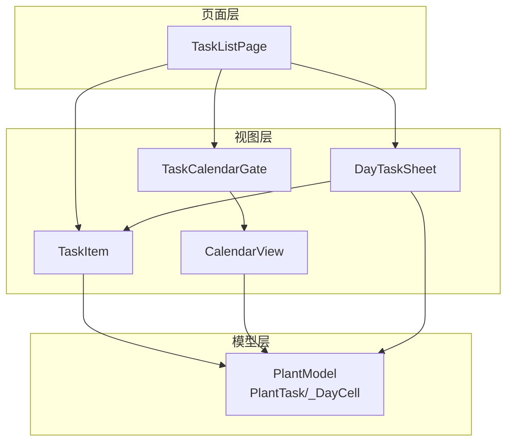
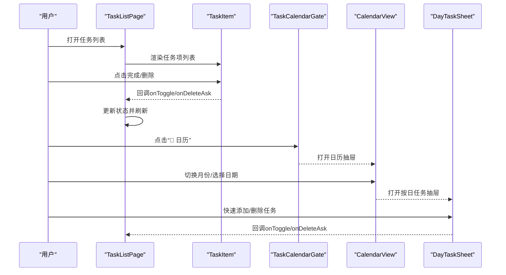
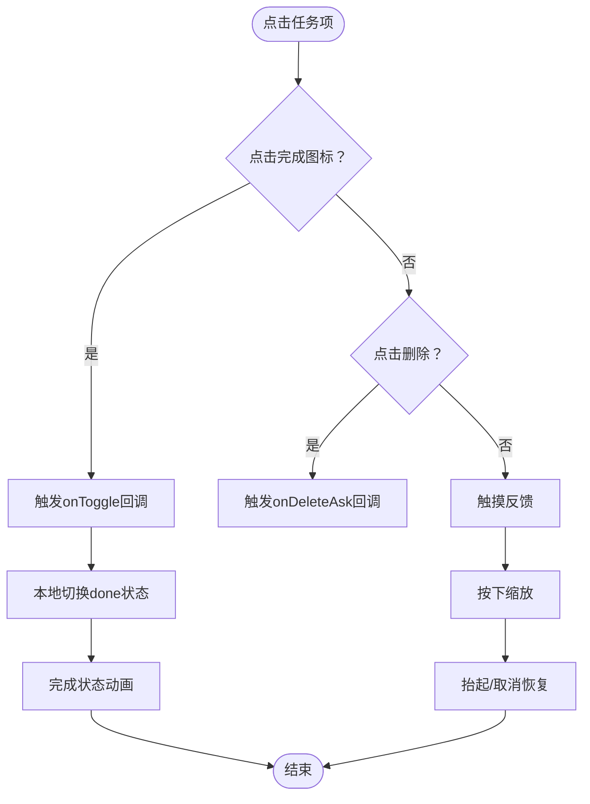
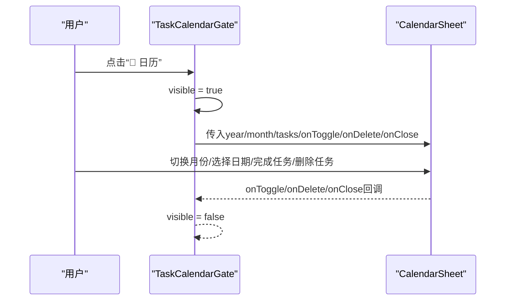
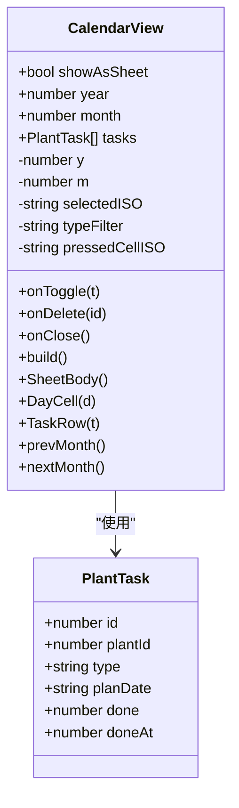
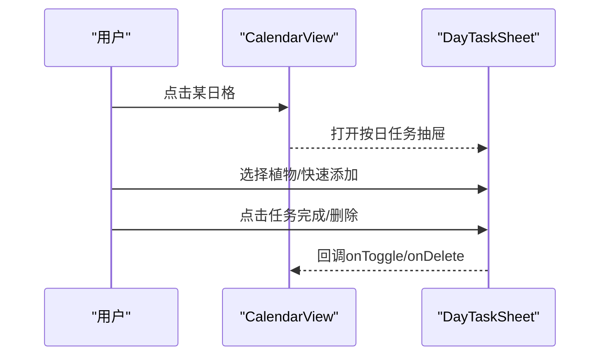
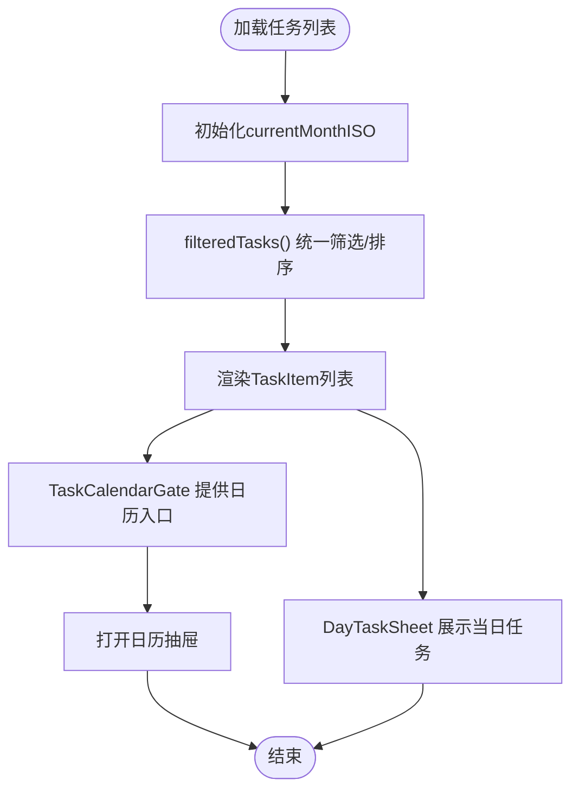
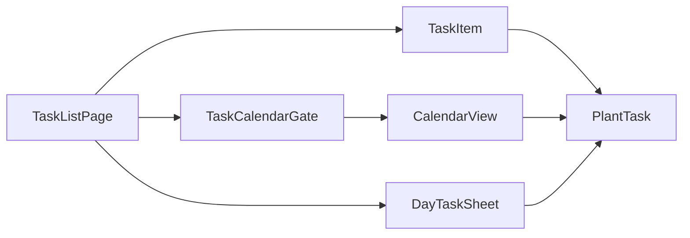

# 任务组件

<cite>
**本文引用的文件**
- [TaskItem.ets](file://entry/src/main/ets/view/TaskItem.ets)
- [TaskCalendarGate.ets](file://entry/src/main/ets/view/TaskCalendarGate.ets)
- [TaskListPage.ets](file://entry/src/main/ets/pages/TaskListPage.ets)
- [CalendarView.ets](file://entry/src/main/ets/view/CalendarView.ets)
- [DayTaskSheet.ets](file://entry/src/main/ets/view/DayTaskSheet.ets)
- [PlantModel.ets](file://entry/src/main/ets/model/PlantModel.ets)
- [color.json](file://entry/src/main/resources/base/element/color.json)
</cite>

## 目录
1. [简介](#简介)
2. [项目结构](#项目结构)
3. [核心组件](#核心组件)
4. [架构总览](#架构总览)
5. [详细组件分析](#详细组件分析)
6. [依赖关系分析](#依赖关系分析)
7. [性能考虑](#性能考虑)
8. [故障排除指南](#故障排除指南)
9. [结论](#结论)
10. [附录](#附录)

## 简介
本文件聚焦于PlantDiary项目中的任务相关组件，系统性地介绍TaskItem任务项组件与TaskCalendarGate任务日历门组件的设计与实现。内容涵盖：
- 任务项的显示格式、状态管理与交互行为
- 完成状态的视觉反馈、任务类型标识与截止日期呈现
- 任务日历门组件的日历集成功能与日期导航机制
- 事件处理与数据绑定方式
- 在任务列表页面与日历视图中的使用场景与最佳实践

## 项目结构
任务组件主要分布在以下模块：
- 页面层：TaskListPage负责任务列表的筛选、排序与展示，并承载日历门入口
- 视图层：TaskItem用于单条任务项的展示与交互；CalendarView提供完整的日历视图能力；DayTaskSheet提供按日的任务抽屉面板
- 模型层：PlantModel定义PlantTask等数据结构，确保跨页面与组件间的数据一致性

图表来源
- [TaskListPage.ets:1-463](file://entry/src/main/ets/pages/TaskListPage.ets#L1-L463)
- [TaskItem.ets:1-67](file://entry/src/main/ets/view/TaskItem.ets#L1-L67)
- [TaskCalendarGate.ets:1-81](file://entry/src/main/ets/view/TaskCalendarGate.ets#L1-L81)
- [CalendarView.ets:1-566](file://entry/src/main/ets/view/CalendarView.ets#L1-L566)
- [DayTaskSheet.ets:1-228](file://entry/src/main/ets/view/DayTaskSheet.ets#L1-L228)
- [PlantModel.ets:1-166](file://entry/src/main/ets/model/PlantModel.ets#L1-L166)

章节来源
- [TaskListPage.ets:1-463](file://entry/src/main/ets/pages/TaskListPage.ets#L1-L463)
- [TaskItem.ets:1-67](file://entry/src/main/ets/view/TaskItem.ets#L1-L67)
- [TaskCalendarGate.ets:1-81](file://entry/src/main/ets/view/TaskCalendarGate.ets#L1-L81)
- [CalendarView.ets:1-566](file://entry/src/main/ets/view/CalendarView.ets#L1-L566)
- [DayTaskSheet.ets:1-228](file://entry/src/main/ets/view/DayTaskSheet.ets#L1-L228)
- [PlantModel.ets:1-166](file://entry/src/main/ets/model/PlantModel.ets#L1-L166)

## 核心组件
- PlantTask数据模型：包含任务标识、关联植物、任务类型、计划日期、完成状态与完成时间戳等字段，作为所有任务相关组件的数据基础
- TaskItem任务项组件：负责单条任务的展示与交互，支持完成状态切换、删除询问与触摸反馈
- TaskCalendarGate任务日历门组件：提供从任务列表进入日历视图的入口，封装日历抽屉的打开与关闭逻辑
- CalendarView日历核心组件：提供完整的日历网格、日期导航、类型筛选、当日任务清单与交互
- DayTaskSheet按日任务抽屉：在日历视图中展示某一天的任务清单，支持快速添加与删除

章节来源
- [PlantModel.ets:43-59](file://entry/src/main/ets/model/PlantModel.ets#L43-L59)
- [TaskItem.ets:5-67](file://entry/src/main/ets/view/TaskItem.ets#L5-L67)
- [TaskCalendarGate.ets:6-81](file://entry/src/main/ets/view/TaskCalendarGate.ets#L6-L81)
- [CalendarView.ets:5-510](file://entry/src/main/ets/view/CalendarView.ets#L5-L510)
- [DayTaskSheet.ets:3-228](file://entry/src/main/ets/view/DayTaskSheet.ets#L3-L228)

## 架构总览
任务组件采用“页面-视图-模型”的分层设计：
- 页面层负责业务逻辑与状态管理（如筛选、排序、视图切换）
- 视图层负责UI展示与用户交互（如点击、触摸反馈、动画）
- 模型层提供稳定的数据结构（PlantTask/_DayCell）

图表来源
- [TaskListPage.ets:165-337](file://entry/src/main/ets/pages/TaskListPage.ets#L165-L337)
- [TaskItem.ets:17-65](file://entry/src/main/ets/view/TaskItem.ets#L17-L65)
- [TaskCalendarGate.ets:22-61](file://entry/src/main/ets/view/TaskCalendarGate.ets#L22-L61)
- [CalendarView.ets:31-210](file://entry/src/main/ets/view/CalendarView.ets#L31-L210)
- [DayTaskSheet.ets:73-158](file://entry/src/main/ets/view/DayTaskSheet.ets#L73-L158)

## 详细组件分析

### TaskItem任务项组件
- 设计目标：轻量展示与交互，仅负责UI与回调，状态以父层重载为准
- 显示格式
  - 完成状态图标：根据done字段显示勾选或空心圆，支持缩放与过渡动画
  - 文本信息：任务类型与植物名称组合显示，已完成时文本带删除线并降低透明度
  - 截止日期：已完成显示“YYYY-MM-DD · 已完成”，否则仅显示日期
- 交互行为
  - 点击完成图标触发onToggle回调，并立即本地切换done以提供即时反馈
  - 点击删除按钮触发onDeleteAsk回调
  - 支持触摸按下时的轻微缩放与抬起/取消时恢复
- 视觉反馈
  - 完成状态：透明度降低、文本删除线、图标放大
  - 删除按钮：红色强调色
  - 整体卡片：圆角、阴影、背景色与按下缩放

图表来源
- [TaskItem.ets:17-65](file://entry/src/main/ets/view/TaskItem.ets#L17-L65)

章节来源
- [TaskItem.ets:5-67](file://entry/src/main/ets/view/TaskItem.ets#L5-L67)
- [PlantModel.ets:43-59](file://entry/src/main/ets/model/PlantModel.ets#L43-L59)

### TaskCalendarGate任务日历门组件
- 设计目标：为任务列表提供日历入口，封装日历抽屉的打开/关闭与初始日期设置
- 功能特性
  - 初始化：aboutToAppear中设置当前年月为今日所在年月
  - 入口：顶部“📅 日历”链接芯片，点击后显示日历抽屉
  - 日历抽屉：传入tasks、onToggle、onDelete、onClose等参数
  - 内嵌网格：注释保留了CalendarGrid的使用位置，便于后续恢复
- 交互流程
  - 点击入口 -> 设置visible为true -> 渲染CalendarSheet
  - 日历内部操作完成后通过回调通知父层

图表来源
- [TaskCalendarGate.ets:15-61](file://entry/src/main/ets/view/TaskCalendarGate.ets#L15-L61)
- [CalendarView.ets:539-565](file://entry/src/main/ets/view/CalendarView.ets#L539-L565)

章节来源
- [TaskCalendarGate.ets:6-81](file://entry/src/main/ets/view/TaskCalendarGate.ets#L6-L81)

### CalendarView日历核心组件
- 设计目标：提供完整的日历网格、日期导航、类型筛选与当日任务清单
- 结构组成
  - 标题与切月：左右箭头切换月份，居中显示年月标题
  - 周标题：显示日/一/二/三/四/五/六
  - 日格网格：6×7网格，每个单元格包含日期数字与当天标记点
  - 类型筛选：支持“全部/浇水/施肥/修剪”等类型筛选
  - 当日任务清单：根据selectedISO与typeFilter过滤并展示任务
- 交互与状态
  - 选中日期：点击日格更新selectedISO，高亮显示
  - 类型筛选：点击类型芯片切换typeFilter
  - 月份导航：prevMonth/nextMonth更新年月并重置选中日期
  - 任务操作：点击任务完成图标触发onToggle，点击删除触发onDelete
- 视觉反馈
  - 选中日格：背景色高亮、轻微阴影与缩放
  - 今日标记：绿色小点
  - 任务行：完成状态图标、文本与删除按钮

图表来源
- [CalendarView.ets:5-510](file://entry/src/main/ets/view/CalendarView.ets#L5-L510)
- [PlantModel.ets:43-59](file://entry/src/main/ets/model/PlantModel.ets#L43-L59)

章节来源
- [CalendarView.ets:5-566](file://entry/src/main/ets/view/CalendarView.ets#L5-L566)

### DayTaskSheet按日任务抽屉
- 设计目标：在日历视图中展示某一天的任务清单，并提供快速添加功能
- 功能特性
  - 顶部：显示所选日期与关闭按钮
  - 植物选择：列出当日出现过的植物，支持选中
  - 快速添加：基于选中植物快速添加“浇水/施肥/修剪”任务
  - 任务列表：展示当日任务，支持完成切换与删除
- 交互流程
  - 用户在日历中选择某日 -> 打开DayTaskSheet
  - 选择植物 -> 快速添加任务
  - 点击任务完成/删除 -> 回调父层

图表来源
- [CalendarView.ets:277-282](file://entry/src/main/ets/view/CalendarView.ets#L277-L282)
- [DayTaskSheet.ets:73-158](file://entry/src/main/ets/view/DayTaskSheet.ets#L73-L158)

章节来源
- [DayTaskSheet.ets:3-228](file://entry/src/main/ets/view/DayTaskSheet.ets#L3-L228)

### TaskListPage任务列表页面
- 设计目标：提供任务列表视图，包含筛选、排序与日历门入口
- 功能特性
  - 视图模式：当前默认列表视图，注释保留日历视图切换位置
  - 筛选与搜索：标签页筛选（全部/今天/将来/已完成）、任务类型筛选、关键字搜索
  - 列表渲染：使用TaskItem展示任务项，绑定onToggle与onDeleteAsk回调
  - 日历门：TaskCalendarGate提供“📅 日历”入口
  - 按日抽屉：DayTaskSheet用于展示某日任务与快速添加
- 交互与数据流
  - 筛选与排序：filteredTasks统一串联tab、类型与关键字
  - 事件回调：onToggle/onDeleteAsk/onCreateTask向上冒泡至父层
  - 日期导航：changeMonth用于日历视图切换月份（当前注释保留）

图表来源
- [TaskListPage.ets:31-162](file://entry/src/main/ets/pages/TaskListPage.ets#L31-L162)
- [TaskListPage.ets:165-337](file://entry/src/main/ets/pages/TaskListPage.ets#L165-L337)

章节来源
- [TaskListPage.ets:6-463](file://entry/src/main/ets/pages/TaskListPage.ets#L6-L463)

## 依赖关系分析
- 组件耦合
  - TaskListPage依赖TaskItem、TaskCalendarGate、DayTaskSheet
  - TaskCalendarGate依赖CalendarView（抽屉模式）
  - CalendarView依赖PlantTask与内部_dayCell数据结构
  - DayTaskSheet依赖PlantTask与Plant模型
- 数据绑定
  - 通过@Param/@Event进行父子组件通信
  - PlantTask作为跨组件共享的数据载体
- 外部依赖
  - 性能分析工具：TaskItem中使用hilog进行调试输出

图表来源
- [TaskListPage.ets:1-463](file://entry/src/main/ets/pages/TaskListPage.ets#L1-L463)
- [TaskItem.ets:1-67](file://entry/src/main/ets/view/TaskItem.ets#L1-L67)
- [TaskCalendarGate.ets:1-81](file://entry/src/main/ets/view/TaskCalendarGate.ets#L1-L81)
- [CalendarView.ets:1-566](file://entry/src/main/ets/view/CalendarView.ets#L1-L566)
- [DayTaskSheet.ets:1-228](file://entry/src/main/ets/view/DayTaskSheet.ets#L1-L228)
- [PlantModel.ets:1-166](file://entry/src/main/ets/model/PlantModel.ets#L1-L166)

章节来源
- [TaskListPage.ets:1-463](file://entry/src/main/ets/pages/TaskListPage.ets#L1-L463)
- [TaskItem.ets:1-67](file://entry/src/main/ets/view/TaskItem.ets#L1-L67)
- [TaskCalendarGate.ets:1-81](file://entry/src/main/ets/view/TaskCalendarGate.ets#L1-L81)
- [CalendarView.ets:1-566](file://entry/src/main/ets/view/CalendarView.ets#L1-L566)
- [DayTaskSheet.ets:1-228](file://entry/src/main/ets/view/DayTaskSheet.ets#L1-L228)
- [PlantModel.ets:1-166](file://entry/src/main/ets/model/PlantModel.ets#L1-L166)

## 性能考虑
- 列表渲染优化
  - 使用ForEach与ListItem减少不必要的重建
  - 列表滚动禁用滚动条、使用边缘效果提升流畅度
- 动画与反馈
  - 任务项与日格的缩放与透明度变化均设置合理动画时长与曲线
  - 按下反馈使用短时动画，避免阻塞用户操作
- 数据过滤与排序
  - filteredTasks一次性复制数组并执行多维过滤与排序，建议在数据量较大时考虑缓存策略
- 日历网格
  - 42个日格的固定网格结构，避免动态尺寸计算带来的重排

## 故障排除指南
- 任务项点击无效
  - 检查TaskItem的onToggle回调是否正确传递到父层
  - 确认父层TaskListPage的onToggle实现是否更新状态并触发重新渲染
- 完成状态不一致
  - TaskItem本地切换done仅提供即时反馈，最终应以父层reload后的结果为准
  - 若出现闪烁，检查父层状态更新时机与动画时序
- 日历抽屉无法关闭
  - 确认TaskCalendarGate的visible状态与CalendarSheet的onClose回调
  - 检查点击蒙层区域是否正确触发onClose
- 日期导航异常
  - CalendarView的prevMonth/nextMonth会重置selectedISO为当月1日，确认该行为符合预期
  - TaskListPage的changeMonth方法用于日历视图切换月份（当前注释保留）

章节来源
- [TaskItem.ets:17-65](file://entry/src/main/ets/view/TaskItem.ets#L17-L65)
- [TaskCalendarGate.ets:15-61](file://entry/src/main/ets/view/TaskCalendarGate.ets#L15-L61)
- [CalendarView.ets:480-502](file://entry/src/main/ets/view/CalendarView.ets#L480-L502)
- [TaskListPage.ets:375-384](file://entry/src/main/ets/pages/TaskListPage.ets#L375-L384)

## 结论
任务组件体系以简洁、解耦为核心设计原则：
- TaskItem专注于单条任务的展示与交互，状态管理交由上层
- TaskCalendarGate提供统一的日历入口，便于扩展日历视图
- CalendarView提供完整的日历能力，支持日期导航、类型筛选与任务操作
- DayTaskSheet完善了按日任务的展示与快速添加体验
- PlantTask作为共享数据结构，贯穿整个任务体系，保证数据一致性

在实际使用中，建议遵循以下最佳实践：
- 在父层集中处理任务状态更新与持久化，子组件仅负责UI与回调
- 合理利用筛选与排序逻辑，避免在大量数据场景下重复计算
- 为日历与任务项的交互提供明确的视觉反馈，提升用户体验
- 对动画时长与曲线进行统一配置，确保整体动效一致

## 附录
- 颜色配置参考：项目资源中包含基础颜色配置，可在组件中按需引用
- 数据模型：PlantTask包含任务标识、植物关联、类型、计划日期与完成状态等关键字段

章节来源
- [color.json:1-8](file://entry/src/main/resources/base/element/color.json#L1-L8)
- [PlantModel.ets:43-59](file://entry/src/main/ets/model/PlantModel.ets#L43-L59)