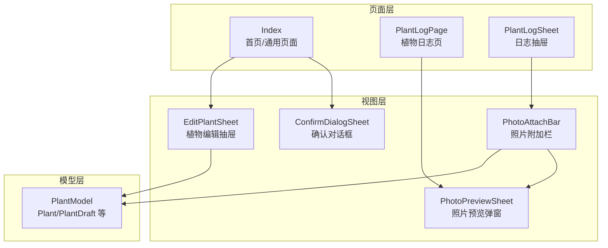
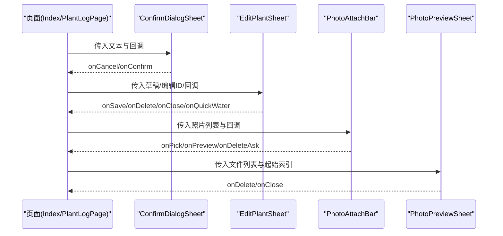
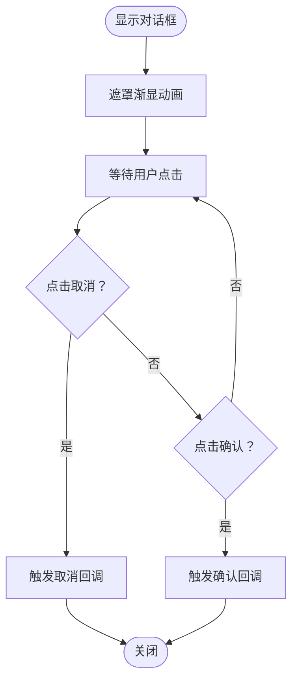
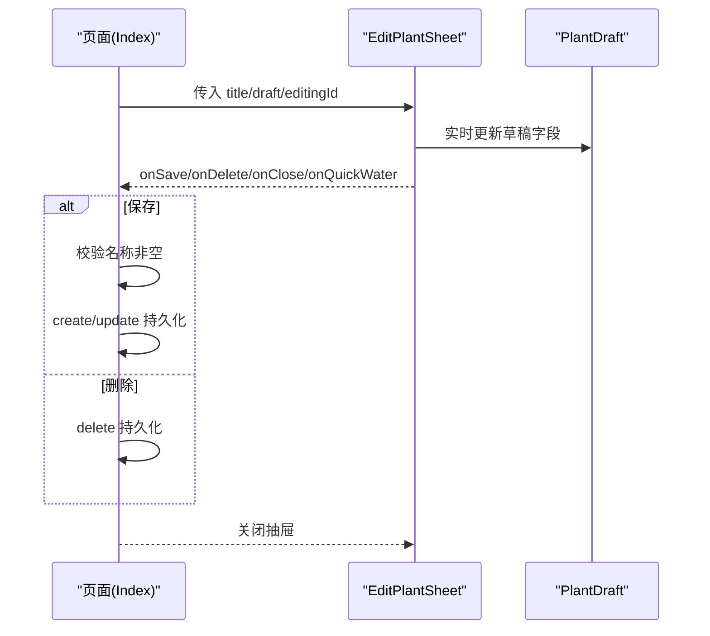
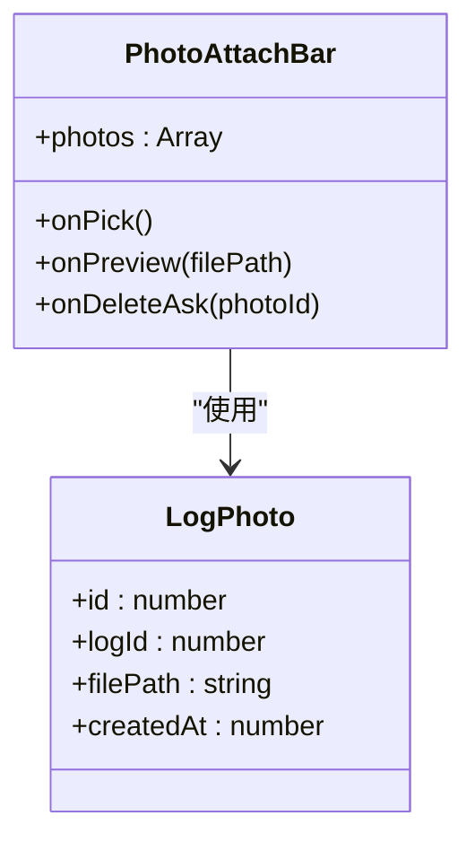
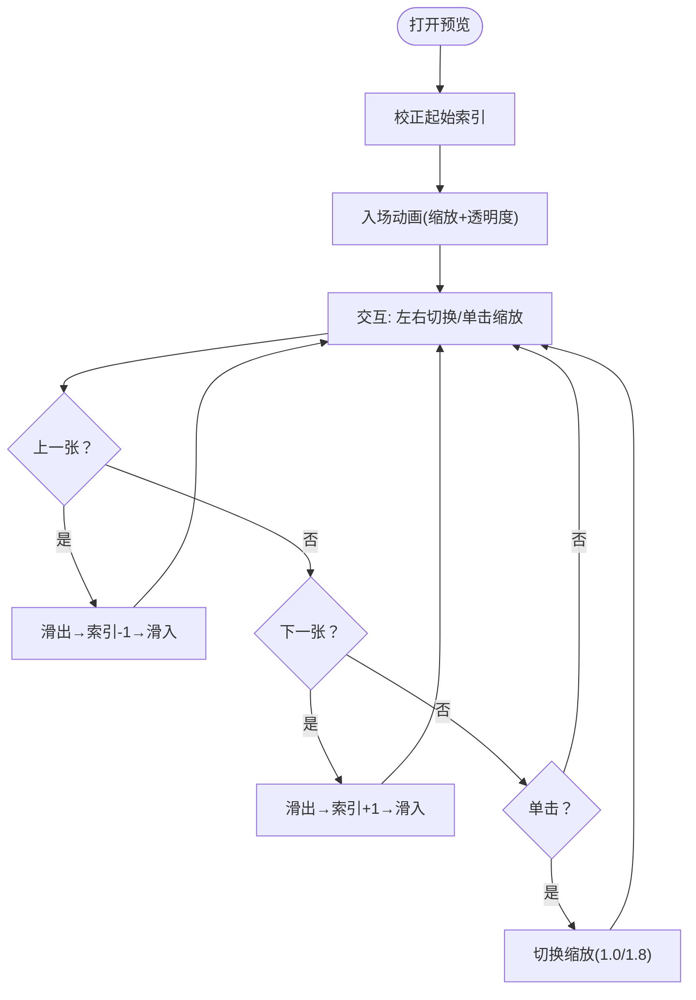
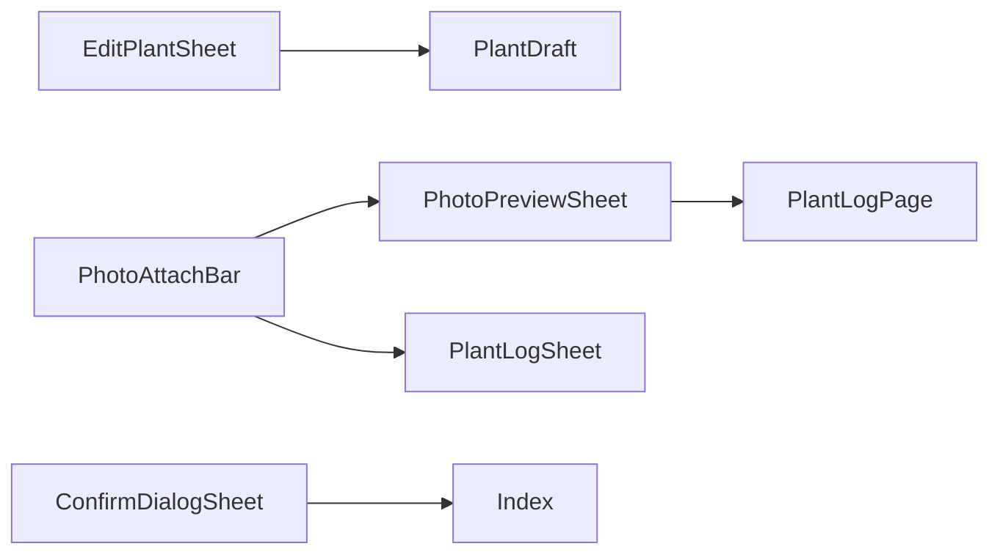

# 对话框组件

<cite>
**本文档引用的文件**
- [ConfirmDialogSheet.ets](file://entry/src/main/ets/view/ConfirmDialogSheet.ets)
- [EditPlantSheet.ets](file://entry/src/main/ets/view/EditPlantSheet.ets)
- [PhotoAttachBar.ets](file://entry/src/main/ets/view/PhotoAttachBar.ets)
- [PhotoPreviewSheet.ets](file://entry/src/main/ets/view/PhotoPreviewSheet.ets)
- [PlantModel.ets](file://entry/src/main/ets/model/PlantModel.ets)
- [Index.ets](file://entry/src/main/ets/pages/Index.ets)
- [PlantLogPage.ets](file://entry/src/main/ets/pages/PlantLogPage.ets)
- [PlantLogSheet.ets](file://entry/src/main/ets/view/PlantLogSheet.ets)
</cite>

## 目录
1. [简介](#简介)
2. [项目结构](#项目结构)
3. [核心组件](#核心组件)
4. [架构总览](#架构总览)
5. [详细组件分析](#详细组件分析)
6. [依赖关系分析](#依赖关系分析)
7. [性能考量](#性能考量)
8. [故障排查指南](#故障排查指南)
9. [结论](#结论)
10. [附录](#附录)

## 简介
本文件系统性梳理并说明四类对话框与弹窗组件：确认对话框、植物编辑抽屉、照片附加栏与照片预览弹窗。重点涵盖以下方面：
- 模态显示与隐藏机制、背景遮罩与焦点管理
- 编辑弹窗的数据绑定、表单验证与提交处理
- 照片附加与预览功能的文件选择、上传与展示机制
- 动画与过渡效果
- 在植物管理、数据编辑与媒体处理中的具体应用场景

## 项目结构
四个组件均位于应用主模块的视图层，分别承担确认交互、底部抽屉编辑、照片附件条与全屏预览的功能。它们通过参数与事件与上层页面进行解耦协作。

图表来源
- [ConfirmDialogSheet.ets:1-103](file://entry/src/main/ets/view/ConfirmDialogSheet.ets#L1-L103)
- [EditPlantSheet.ets:1-264](file://entry/src/main/ets/view/EditPlantSheet.ets#L1-L264)
- [PhotoAttachBar.ets:1-100](file://entry/src/main/ets/view/PhotoAttachBar.ets#L1-L100)
- [PhotoPreviewSheet.ets:1-223](file://entry/src/main/ets/view/PhotoPreviewSheet.ets#L1-L223)
- [PlantModel.ets:62-75](file://entry/src/main/ets/model/PlantModel.ets#L62-L75)
- [Index.ets:1473-1522](file://entry/src/main/ets/pages/Index.ets#L1473-L1522)
- [PlantLogPage.ets:880-1030](file://entry/src/main/ets/pages/PlantLogPage.ets#L880-L1030)
- [PlantLogSheet.ets:185-384](file://entry/src/main/ets/view/PlantLogSheet.ets#L185-L384)

章节来源
- [ConfirmDialogSheet.ets:1-103](file://entry/src/main/ets/view/ConfirmDialogSheet.ets#L1-L103)
- [EditPlantSheet.ets:1-264](file://entry/src/main/ets/view/EditPlantSheet.ets#L1-L264)
- [PhotoAttachBar.ets:1-100](file://entry/src/main/ets/view/PhotoAttachBar.ets#L1-L100)
- [PhotoPreviewSheet.ets:1-223](file://entry/src/main/ets/view/PhotoPreviewSheet.ets#L1-L223)
- [PlantModel.ets:62-75](file://entry/src/main/ets/model/PlantModel.ets#L62-L75)
- [Index.ets:1473-1522](file://entry/src/main/ets/pages/Index.ets#L1473-L1522)
- [PlantLogPage.ets:880-1030](file://entry/src/main/ets/pages/PlantLogPage.ets#L880-L1030)
- [PlantLogSheet.ets:185-384](file://entry/src/main/ets/view/PlantLogSheet.ets#L185-L384)

## 核心组件
- 确认对话框 ConfirmDialogSheet：覆盖式模态，支持文本提示、取消/确认回调、背景遮罩渐显与按钮按压反馈。
- 植物编辑抽屉 EditPlantSheet：底部抽屉，承载植物信息编辑、周期任务快捷入口、保存/删除/快速浇水等操作，并管理键盘避让。
- 照片附加栏 PhotoAttachBar：横向缩略图条 + 添加按钮，负责照片选择、预览与删除询问事件的转发。
- 照片预览弹窗 PhotoPreviewSheet：全屏预览，支持左右切换、单击缩放、删除与关闭。

章节来源
- [ConfirmDialogSheet.ets:1-103](file://entry/src/main/ets/view/ConfirmDialogSheet.ets#L1-L103)
- [EditPlantSheet.ets:1-264](file://entry/src/main/ets/view/EditPlantSheet.ets#L1-L264)
- [PhotoAttachBar.ets:1-100](file://entry/src/main/ets/view/PhotoAttachBar.ets#L1-L100)
- [PhotoPreviewSheet.ets:1-223](file://entry/src/main/ets/view/PhotoPreviewSheet.ets#L1-L223)

## 架构总览
四个组件通过参数与事件与页面解耦，形成“视图组件 + 页面控制”的协作模式。页面负责状态管理、业务逻辑与数据持久化，组件负责呈现与交互。

图表来源
- [Index.ets:1473-1522](file://entry/src/main/ets/pages/Index.ets#L1473-L1522)
- [EditPlantSheet.ets:10-16](file://entry/src/main/ets/view/EditPlantSheet.ets#L10-L16)
- [PhotoAttachBar.ets:20-23](file://entry/src/main/ets/view/PhotoAttachBar.ets#L20-L23)
- [PhotoPreviewSheet.ets:4-7](file://entry/src/main/ets/view/PhotoPreviewSheet.ets#L4-L7)

## 详细组件分析

### 确认对话框 ConfirmDialogSheet
- 显示机制
  - 打开时通过动画将遮罩透明度从0渐变到1，营造柔和入场感。
  - 点击背景空白区域触发取消回调，实现“点击外部关闭”。
- 交互细节
  - 取消/确认按钮支持按压反馈（scale缩放与动画），提升触控反馈。
  - 对话框主体采用圆角与阴影，配合入场动画（摩擦曲线）增强层次感。
- 适用场景
  - 删除植物/任务等危险操作前的二次确认。
  - 批量操作、数据变更等需要用户明确同意的场景。

图表来源
- [ConfirmDialogSheet.ets:13-18](file://entry/src/main/ets/view/ConfirmDialogSheet.ets#L13-L18)
- [ConfirmDialogSheet.ets:27-29](file://entry/src/main/ets/view/ConfirmDialogSheet.ets#L27-L29)
- [ConfirmDialogSheet.ets:36-82](file://entry/src/main/ets/view/ConfirmDialogSheet.ets#L36-L82)

章节来源
- [ConfirmDialogSheet.ets:1-103](file://entry/src/main/ets/view/ConfirmDialogSheet.ets#L1-L103)
- [Index.ets:1473-1522](file://entry/src/main/ets/pages/Index.ets#L1473-L1522)

### 植物编辑抽屉 EditPlantSheet
- 数据绑定与草稿
  - 使用 PlantDraft 作为编辑态载体，避免直接修改列表实体，便于校验与回滚。
- 表单与验证
  - 名称必填校验在保存时执行；通过横幅提示反馈错误。
- 操作流程
  - 保存：根据编辑ID判断新建或更新，调用页面提供的持久化方法。
  - 删除：仅在编辑态存在ID时允许删除。
  - 快速浇水：触发页面的快速任务插入。
  - 关闭：关闭抽屉并恢复键盘避让模式。
- 键盘管理
  - 打开时设置键盘避让模式为 RESIZE，关闭时恢复 NONE，避免键盘遮挡输入框。

图表来源
- [EditPlantSheet.ets:6-16](file://entry/src/main/ets/view/EditPlantSheet.ets#L6-L16)
- [EditPlantSheet.ets:102-177](file://entry/src/main/ets/view/EditPlantSheet.ets#L102-L177)
- [Index.ets:1599-1619](file://entry/src/main/ets/pages/Index.ets#L1599-L1619)
- [PlantModel.ets:62-75](file://entry/src/main/ets/model/PlantModel.ets#L62-L75)

章节来源
- [EditPlantSheet.ets:1-264](file://entry/src/main/ets/view/EditPlantSheet.ets#L1-L264)
- [Index.ets:1599-1619](file://entry/src/main/ets/pages/Index.ets#L1599-L1619)
- [PlantModel.ets:62-75](file://entry/src/main/ets/model/PlantModel.ets#L62-L75)

### 照片附加栏 PhotoAttachBar
- 结构组成
  - 标题“照片”与“添加”链接按钮。
  - 横向滚动缩略图区域，每个缩略图包含删除按钮。
- 事件转发
  - onPick：触发外部执行文件选择。
  - onPreview：点击缩略图进入预览。
  - onDeleteAsk：点击删除按钮请求删除确认。
- 数据模型
  - LogPhoto：包含本地文件路径、所属日志ID与创建时间等。

图表来源
- [PhotoAttachBar.ets:19-23](file://entry/src/main/ets/view/PhotoAttachBar.ets#L19-L23)
- [PhotoAttachBar.ets:3-15](file://entry/src/main/ets/view/PhotoAttachBar.ets#L3-L15)

章节来源
- [PhotoAttachBar.ets:1-100](file://entry/src/main/ets/view/PhotoAttachBar.ets#L1-L100)
- [PlantLogSheet.ets:216-246](file://entry/src/main/ets/view/PlantLogSheet.ets#L216-L246)

### 照片预览弹窗 PhotoPreviewSheet
- 显示与动画
  - 打开时延迟后执行缩放与透明度动画，营造自然入场。
  - 支持左右滑动切换图片，切换时先滑出再滑入，配合透明度过渡。
- 交互能力
  - 顶部工具栏：显示当前索引/总数、删除与关闭。
  - 中部图片区域：单击切换缩放（1.0/1.8倍）。
  - 两侧区域：点击切换上一张/下一张。
- 安全边界
  - 起始索引越界保护，确保安全显示。

图表来源
- [PhotoPreviewSheet.ets:17-34](file://entry/src/main/ets/view/PhotoPreviewSheet.ets#L17-L34)
- [PhotoPreviewSheet.ets:52-92](file://entry/src/main/ets/view/PhotoPreviewSheet.ets#L52-L92)
- [PhotoPreviewSheet.ets:186-196](file://entry/src/main/ets/view/PhotoPreviewSheet.ets#L186-L196)

章节来源
- [PhotoPreviewSheet.ets:1-223](file://entry/src/main/ets/view/PhotoPreviewSheet.ets#L1-L223)
- [PlantLogPage.ets:900-922](file://entry/src/main/ets/pages/PlantLogPage.ets#L900-L922)

## 依赖关系分析
- 组件间依赖
  - PhotoAttachBar 与 PhotoPreviewSheet：通过 onPick/onPreview/onDeleteAsk 与 onDelete/onClose 事件协作，形成“附件→预览→删除”的闭环。
  - EditPlantSheet 与 PlantModel：依赖 PlantDraft 作为编辑态数据结构。
  - ConfirmDialogSheet 与页面：通过回调与页面状态联动，实现确认/取消操作。
- 页面与组件
  - Index 与 PlantLogPage 分别在不同场景下创建并管理上述组件，体现“按需渲染”。

图表来源
- [PhotoAttachBar.ets:20-23](file://entry/src/main/ets/view/PhotoAttachBar.ets#L20-L23)
- [PhotoPreviewSheet.ets:6-7](file://entry/src/main/ets/view/PhotoPreviewSheet.ets#L6-L7)
- [EditPlantSheet.ets:8-8](file://entry/src/main/ets/view/EditPlantSheet.ets#L8-L8)
- [PlantModel.ets:62-75](file://entry/src/main/ets/model/PlantModel.ets#L62-L75)
- [Index.ets:1473-1522](file://entry/src/main/ets/pages/Index.ets#L1473-L1522)
- [PlantLogPage.ets:900-922](file://entry/src/main/ets/pages/PlantLogPage.ets#L900-L922)
- [PlantLogSheet.ets:216-246](file://entry/src/main/ets/view/PlantLogSheet.ets#L216-L246)

章节来源
- [PhotoAttachBar.ets:1-100](file://entry/src/main/ets/view/PhotoAttachBar.ets#L1-L100)
- [PhotoPreviewSheet.ets:1-223](file://entry/src/main/ets/view/PhotoPreviewSheet.ets#L1-L223)
- [EditPlantSheet.ets:1-264](file://entry/src/main/ets/view/EditPlantSheet.ets#L1-L264)
- [PlantModel.ets:62-75](file://entry/src/main/ets/model/PlantModel.ets#L62-L75)
- [Index.ets:1473-1522](file://entry/src/main/ets/pages/Index.ets#L1473-L1522)
- [PlantLogPage.ets:900-922](file://entry/src/main/ets/pages/PlantLogPage.ets#L900-L922)
- [PlantLogSheet.ets:216-246](file://entry/src/main/ets/view/PlantLogSheet.ets#L216-L246)

## 性能考量
- 动画与过渡
  - 使用 animateTo 控制遮罩与组件入场动画，建议在低端设备上适当降低动画时长或曲线强度。
- 列表与滚动
  - 照片缩略图采用横向滚动容器，注意在大量图片时限制一次性渲染数量，避免内存峰值过高。
- 文件操作
  - 预览与删除涉及文件系统读写，应避免在主线程执行耗时操作，必要时使用后台任务或异步队列。

## 故障排查指南
- 确认对话框无法关闭
  - 检查背景点击回调是否正确绑定，以及页面状态是否及时更新。
- 编辑抽屉键盘遮挡
  - 确认打开/关闭时是否正确设置/恢复键盘避让模式。
- 照片预览闪烁或跳帧
  - 检查切换动画时长与曲线，必要时减少动画复杂度或延迟触发。
- 删除日志与照片不一致
  - 确保先删除数据库记录，再删除文件；失败时回滚事务并提示用户。

章节来源
- [ConfirmDialogSheet.ets:27-29](file://entry/src/main/ets/view/ConfirmDialogSheet.ets#L27-L29)
- [EditPlantSheet.ets:24-34](file://entry/src/main/ets/view/EditPlantSheet.ets#L24-L34)
- [PhotoPreviewSheet.ets:52-92](file://entry/src/main/ets/view/PhotoPreviewSheet.ets#L52-L92)
- [PlantLogPage.ets:880-922](file://entry/src/main/ets/pages/PlantLogPage.ets#L880-L922)

## 结论
四个组件围绕“确认、编辑、附件、预览”四大交互场景构建，通过参数与事件实现清晰的职责分离。确认对话框与编辑抽屉强调交互反馈与数据安全，照片附加与预览则关注媒体处理的易用性与流畅性。结合页面的状态管理与业务逻辑，可稳定支撑植物管理与日志记录的核心流程。

## 附录
- 应用场景建议
  - 确认对话框：删除植物/任务、批量清理等高风险操作。
  - 植物编辑抽屉：日常新增/编辑植物信息、快速安排周期任务。
  - 照片附加栏：日志记录时的照片采集与管理。
  - 照片预览弹窗：查看与删除日志配图，支持缩放与切换。