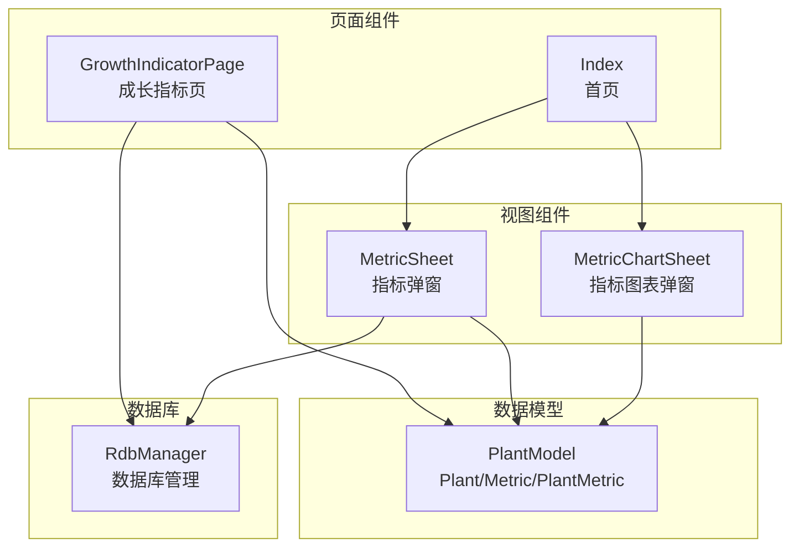
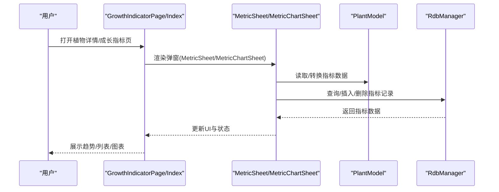
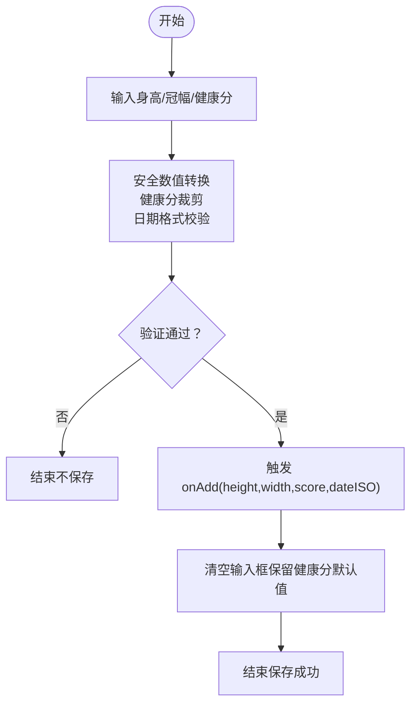
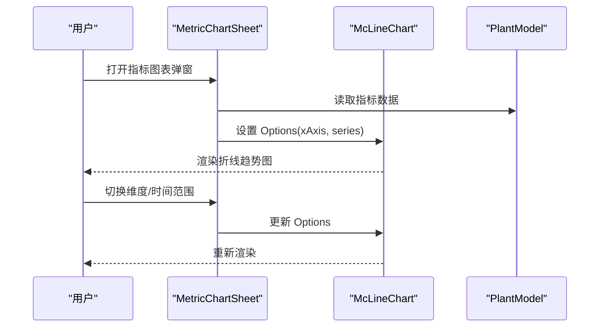
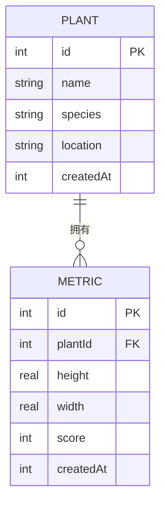
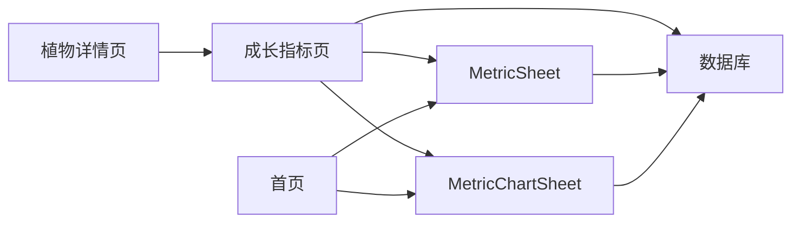
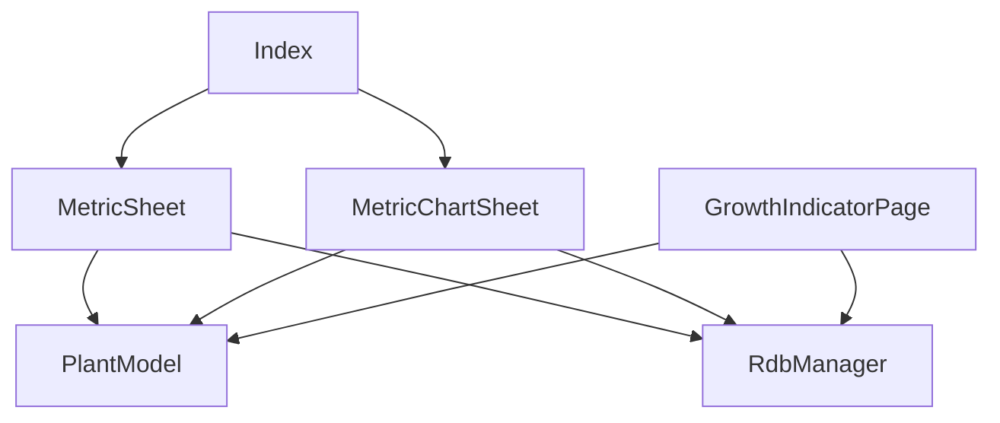

# 指标组件

<cite>
**本文档引用的文件**
- [MetricSheet.ets](file://entry/src/main/ets/view/MetricSheet.ets)
- [MetricChartSheet.ets](file://entry/src/main/ets/view/MetricChartSheet.ets)
- [PlantModel.ets](file://entry/src/main/ets/model/PlantModel.ets)
- [GrowthIndicatorPage.ets](file://entry/src/main/ets/pages/GrowthIndicatorPage.ets)
- [Index.ets](file://entry/src/main/ets/pages/Index.ets)
- [RdbManager.ets](file://entry/src/main/ets/viewmodel/RdbManager.ets)
</cite>

## 目录
1. [简介](#简介)
2. [项目结构](#项目结构)
3. [核心组件](#核心组件)
4. [架构总览](#架构总览)
5. [详细组件分析](#详细组件分析)
6. [依赖关系分析](#依赖关系分析)
7. [性能考虑](#性能考虑)
8. [故障排除指南](#故障排除指南)
9. [结论](#结论)
10. [附录](#附录)

## 简介
本文件系统性梳理 PlantDiary 应用中的指标相关组件，重点围绕以下两个弹窗组件：
- MetricSheet 指标弹窗组件：轻量级指标录入与历史记录管理，支持快速添加、迷你趋势感知与历史删除。
- MetricChartSheet 指标图表弹窗组件：全屏折线趋势图，展示植物的身高、冠幅与健康分随时间的变化。

文档将从系统架构、组件职责、数据流、验证与保存机制、图表绘制与趋势分析、与数据模型的集成、交互设计与用户体验优化，以及在植物详情页与统计分析页的使用场景等方面进行全面阐述。

## 项目结构
指标组件主要分布在以下位置：
- 视图组件：entry/src/main/ets/view/MetricSheet.ets、entry/src/main/ets/view/MetricChartSheet.ets
- 页面组件：entry/src/main/ets/pages/GrowthIndicatorPage.ets、entry/src/main/ets/pages/Index.ets
- 数据模型：entry/src/main/ets/model/PlantModel.ets
- 数据库管理：entry/src/main/ets/viewmodel/RdbManager.ets

**图表来源**
- [MetricSheet.ets:1-491](file://entry/src/main/ets/view/MetricSheet.ets#L1-L491)
- [MetricChartSheet.ets:1-181](file://entry/src/main/ets/view/MetricChartSheet.ets#L1-L181)
- [GrowthIndicatorPage.ets:1-605](file://entry/src/main/ets/pages/GrowthIndicatorPage.ets#L1-L605)
- [Index.ets:1039-1064](file://entry/src/main/ets/pages/Index.ets#L1039-L1064)
- [PlantModel.ets:109-147](file://entry/src/main/ets/model/PlantModel.ets#L109-L147)
- [RdbManager.ets:1-200](file://entry/src/main/ets/viewmodel/RdbManager.ets#L1-L200)

**章节来源**
- [MetricSheet.ets:1-491](file://entry/src/main/ets/view/MetricSheet.ets#L1-L491)
- [MetricChartSheet.ets:1-181](file://entry/src/main/ets/view/MetricChartSheet.ets#L1-L181)
- [GrowthIndicatorPage.ets:1-605](file://entry/src/main/ets/pages/GrowthIndicatorPage.ets#L1-L605)
- [Index.ets:1039-1064](file://entry/src/main/ets/pages/Index.ets#L1039-L1064)
- [PlantModel.ets:109-147](file://entry/src/main/ets/model/PlantModel.ets#L109-L147)
- [RdbManager.ets:1-200](file://entry/src/main/ets/viewmodel/RdbManager.ets#L1-L200)

## 核心组件
- MetricSheet 指标弹窗
  - 轻量级指标录入与历史记录管理，支持快速添加、迷你趋势感知与历史删除。
  - 提供维度切换（健康分/身高/冠幅）、时间排序（升序/降序）与动画效果。
- MetricChartSheet 指标图表弹窗
  - 全屏折线趋势图，展示植物的身高、冠幅与健康分随时间的变化。
  - 支持时间范围与系列切换，内置数据缩放与提示框。

**章节来源**
- [MetricSheet.ets:4-244](file://entry/src/main/ets/view/MetricSheet.ets#L4-L244)
- [MetricChartSheet.ets:4-146](file://entry/src/main/ets/view/MetricChartSheet.ets#L4-L146)

## 架构总览
指标组件采用“页面+弹窗”的分层设计：
- 页面层：GrowthIndicatorPage 提供完整的指标录入、列表与图表功能；Index 作为入口页，负责条件渲染 MetricSheet 与 MetricChartSheet。
- 弹窗层：MetricSheet 与 MetricChartSheet 分别承担轻量录入与全屏图表展示。
- 数据层：PlantModel 定义指标数据结构；RdbManager 负责数据库初始化与指标表的查询/插入/删除。

**图表来源**
- [GrowthIndicatorPage.ets:62-101](file://entry/src/main/ets/pages/GrowthIndicatorPage.ets#L62-L101)
- [Index.ets:1039-1064](file://entry/src/main/ets/pages/Index.ets#L1039-L1064)
- [MetricSheet.ets:28-40](file://entry/src/main/ets/view/MetricSheet.ets#L28-L40)
- [MetricChartSheet.ets:55-64](file://entry/src/main/ets/view/MetricChartSheet.ets#L55-L64)
- [RdbManager.ets:71-78](file://entry/src/main/ets/viewmodel/RdbManager.ets#L71-L78)

## 详细组件分析

### MetricSheet 指标弹窗组件
- 设计目标
  - 快速录入身高、冠幅与健康分，支持历史删除。
  - 提供迷你趋势图，感知健康分/身高/冠幅变化。
  - 支持时间升序/降序排序，提升阅读体验。
- 输入界面
  - 身高、冠幅、健康分输入框，数字类型限制。
  - 日期选择器，默认今日，支持“今天”快捷设置。
  - 添加记录与清空按钮，带按压反馈与动画。
- 数值验证与保存机制
  - 安全数值转换：非数字转为 0。
  - 健康分裁剪：确保在 0~100 范围内，向下取整。
  - 日期格式校验：YYYY-MM-DD 长度检查。
  - 回调触发：onAdd/onDelete/onClose 事件驱动父组件执行保存/删除/关闭。
- 迷你趋势图
  - 横向列表绘制柱状图，按最大值归一化高度，动画呈现。
  - 支持维度切换与标签简化策略。
- 交互与动画
  - 背景遮罩渐显、图表柱状图生长动画。
  - 按钮按压缩放与触控反馈。
- 与数据模型集成
  - 使用 PlantMetric 作为内部数据结构，与 Metric 的字段保持一致。
  - 通过事件回调与父组件协作，实现数据持久化。

**图表来源**
- [MetricSheet.ets:105-168](file://entry/src/main/ets/view/MetricSheet.ets#L105-L168)
- [MetricSheet.ets:468-484](file://entry/src/main/ets/view/MetricSheet.ets#L468-L484)

**章节来源**
- [MetricSheet.ets:4-244](file://entry/src/main/ets/view/MetricSheet.ets#L4-L244)
- [MetricSheet.ets:246-491](file://entry/src/main/ets/view/MetricSheet.ets#L246-L491)

### MetricChartSheet 指标图表弹窗组件
- 设计目标
  - 全屏展示植物指标趋势，支持多序列对比与时间范围筛选。
  - 使用 mccharts 折线图组件，提供数据缩放、提示框与图例。
- 图表绘制
  - X 轴：按采集时间生成标签（MM-DD）。
  - Y 轴：三组序列（身高、冠幅、健康度），分别映射不同单位。
  - 选项配置：标题、网格、提示框、图例、数据缩放与动画。
- 数据可视化与趋势分析
  - 通过 series 与 xAxis 动态更新，实现全屏趋势图。
  - 支持维度切换与时间范围切换（近30天/近90天/全部）。
- 与数据模型集成
  - 使用 Metric 作为数据源，与 PlantModel 的指标结构一致。
  - 通过参数传递与 onClose 事件，实现弹窗关闭与状态同步。

**图表来源**
- [MetricChartSheet.ets:55-64](file://entry/src/main/ets/view/MetricChartSheet.ets#L55-L64)
- [MetricChartSheet.ets:118-128](file://entry/src/main/ets/view/MetricChartSheet.ets#L118-L128)

**章节来源**
- [MetricChartSheet.ets:4-181](file://entry/src/main/ets/view/MetricChartSheet.ets#L4-L181)

### 指标数据模型与数据库集成
- 数据模型
  - Metric：指标记录，包含身高、冠幅、健康分与创建时间。
  - PlantMetric：兼容页面命名的指标记录，字段与 Metric 几乎一致。
- 数据库表结构
  - 指标表 metric：包含自增 id、plantId、height、width、score、createdAt。
  - 索引：按 plantId + createdAt 排序，满足典型查询需求。
- 页面与弹窗的数据流
  - GrowthIndicatorPage：直接使用 RdbManager 的 RDB Store，按 plantId 查询指标并按时间升序展示。
  - Index：作为入口页，根据条件渲染 MetricSheet 与 MetricChartSheet，并通过事件回调与数据库交互。

**图表来源**
- [RdbManager.ets:71-78](file://entry/src/main/ets/viewmodel/RdbManager.ets#L71-L78)
- [PlantModel.ets:109-125](file://entry/src/main/ets/model/PlantModel.ets#L109-L125)

**章节来源**
- [PlantModel.ets:109-147](file://entry/src/main/ets/model/PlantModel.ets#L109-L147)
- [RdbManager.ets:71-78](file://entry/src/main/ets/viewmodel/RdbManager.ets#L71-L78)

### 指标组件在植物详情页与统计分析页的使用场景
- 植物详情页（PlantDetail）
  - 通过快捷功能导航至“成长指标”页面，进入 GrowthIndicatorPage。
  - 在该页面内，用户可直接录入指标、查看迷你趋势与历史列表。
- 统计分析页（StatsPage）
  - 专注于任务与整体统计，不直接修改指标数据。
  - 指标数据的维护与查看主要在 GrowthIndicatorPage 与弹窗组件中完成。
- 首页（Index）
  - 作为入口页，根据条件渲染 MetricSheet 与 MetricChartSheet。
  - 通过事件回调与数据库交互，实现指标的新增与删除。

**图表来源**
- [PlantDetail.ets:88-91](file://entry/src/main/ets/pages/PlantDetail.ets#L88-L91)
- [GrowthIndicatorPage.ets:62-101](file://entry/src/main/ets/pages/GrowthIndicatorPage.ets#L62-L101)
- [Index.ets:1039-1064](file://entry/src/main/ets/pages/Index.ets#L1039-L1064)

**章节来源**
- [PlantDetail.ets:88-91](file://entry/src/main/ets/pages/PlantDetail.ets#L88-L91)
- [GrowthIndicatorPage.ets:62-101](file://entry/src/main/ets/pages/GrowthIndicatorPage.ets#L62-L101)
- [Index.ets:1039-1064](file://entry/src/main/ets/pages/Index.ets#L1039-L1064)

## 依赖关系分析
- 组件耦合
  - MetricSheet 与 MetricChartSheet 依赖 PlantModel 的指标数据结构。
  - 两者均通过事件回调与父组件协作，降低直接耦合。
- 外部依赖
  - 使用 mccharts 折线图组件进行图表渲染。
  - 依赖 RdbManager 进行数据库初始化与指标表的查询/插入/删除。
- 可能的循环依赖
  - 页面与弹窗通过事件回调解耦，未发现循环依赖迹象。

**图表来源**
- [MetricSheet.ets:1-10](file://entry/src/main/ets/view/MetricSheet.ets#L1-L10)
- [MetricChartSheet.ets:1-3](file://entry/src/main/ets/view/MetricChartSheet.ets#L1-L3)
- [GrowthIndicatorPage.ets:1-5](file://entry/src/main/ets/pages/GrowthIndicatorPage.ets#L1-L5)
- [Index.ets:1039-1064](file://entry/src/main/ets/pages/Index.ets#L1039-L1064)

**章节来源**
- [MetricSheet.ets:1-10](file://entry/src/main/ets/view/MetricSheet.ets#L1-L10)
- [MetricChartSheet.ets:1-3](file://entry/src/main/ets/view/MetricChartSheet.ets#L1-L3)
- [GrowthIndicatorPage.ets:1-5](file://entry/src/main/ets/pages/GrowthIndicatorPage.ets#L1-L5)
- [Index.ets:1039-1064](file://entry/src/main/ets/pages/Index.ets#L1039-L1064)

## 性能考虑
- 列表与图表分离渲染
  - GrowthIndicatorPage 在列表/图表模式间切换时，仅在进入图表模式时重建图表数据，避免频繁更新图表配置。
- 迷你趋势图优化
  - MetricSheet 的迷你图按最大值归一化高度，动画呈现，减少视觉负担。
- 数据库查询优化
  - 指标表建立复合索引（plantId + createdAt），满足按植物与时间范围的查询需求。
- 输入验证与保存
  - 在前端进行安全数值转换与健康分裁剪，减少无效请求与数据库异常。

**章节来源**
- [GrowthIndicatorPage.ets:457-467](file://entry/src/main/ets/pages/GrowthIndicatorPage.ets#L457-L467)
- [MetricSheet.ets:426-434](file://entry/src/main/ets/view/MetricSheet.ets#L426-L434)
- [RdbManager.ets:163-169](file://entry/src/main/ets/viewmodel/RdbManager.ets#L163-L169)

## 故障排除指南
- 指标保存失败
  - 检查日期格式是否为 YYYY-MM-DD。
  - 确认输入框为数字类型，非数字将被转换为 0。
  - 健康分超出范围将被裁剪至 0~100。
- 图表不显示
  - 确认已进入图表模式（GrowthIndicatorPage 或 MetricChartSheet）。
  - 检查指标数据是否存在，确保数据库查询返回有效数据。
- 数据库异常
  - 确认 RdbManager 初始化成功，指标表存在且索引已创建。
  - 检查 RDB Store 是否可用，避免空指针异常。

**章节来源**
- [GrowthIndicatorPage.ets:422-445](file://entry/src/main/ets/pages/GrowthIndicatorPage.ets#L422-L445)
- [MetricSheet.ets:150-159](file://entry/src/main/ets/view/MetricSheet.ets#L150-L159)
- [RdbManager.ets:71-78](file://entry/src/main/ets/viewmodel/RdbManager.ets#L71-L78)

## 结论
指标组件通过 MetricSheet 与 MetricChartSheet 实现了从轻量录入到全屏趋势分析的完整闭环。组件以 PlantModel 为核心数据结构，结合 RdbManager 的数据库能力，提供了稳定、直观且高效的指标管理体验。页面与弹窗通过事件回调解耦，既保证了功能完整性，又提升了可维护性与扩展性。

## 附录
- 术语
  - 指标：植物的身高、冠幅与健康分。
  - 迷你趋势图：轻量级趋势感知，不追求完整坐标轴。
  - 全屏图表：提供详细分析的折线图，支持多序列对比与时间范围筛选。
- 最佳实践
  - 在前端进行输入验证与裁剪，减少无效请求。
  - 合理使用动画与过渡，提升用户体验。
  - 保持数据模型与数据库表结构的一致性，避免字段不匹配。