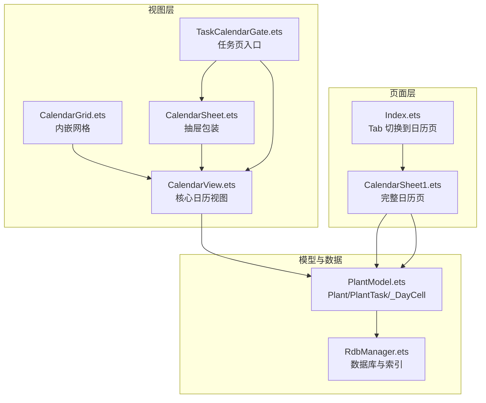
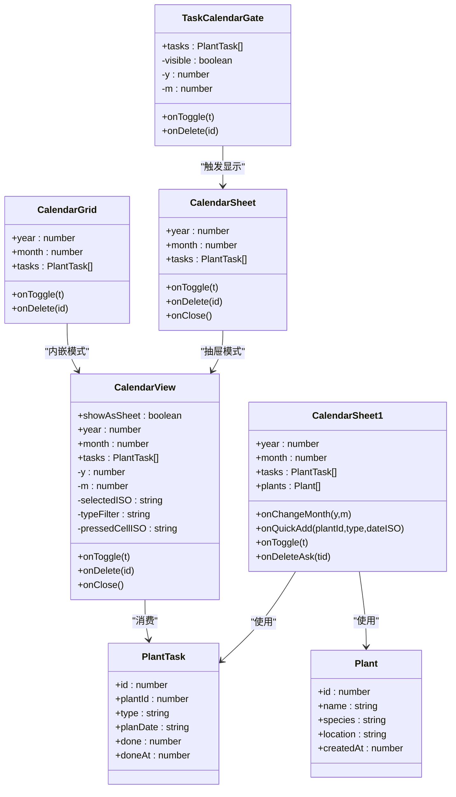
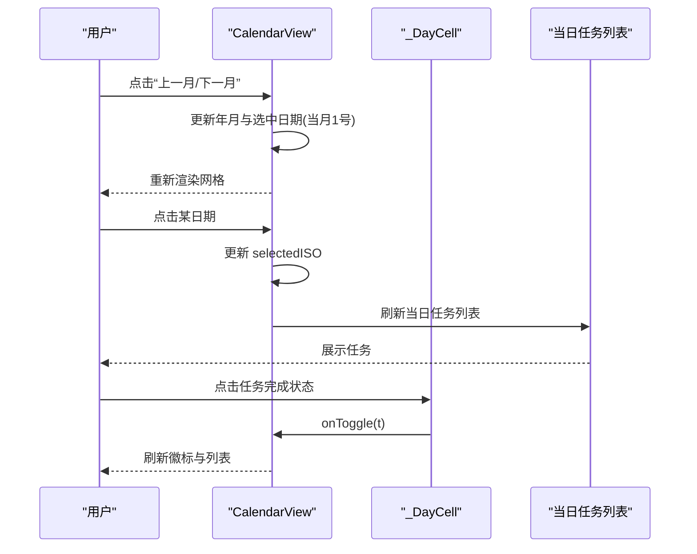
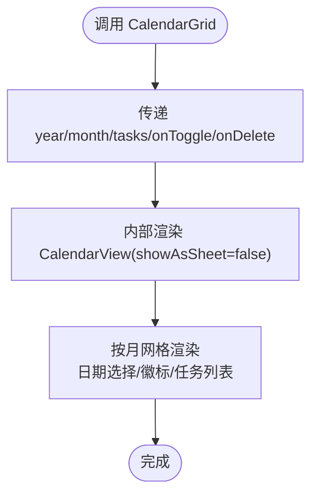
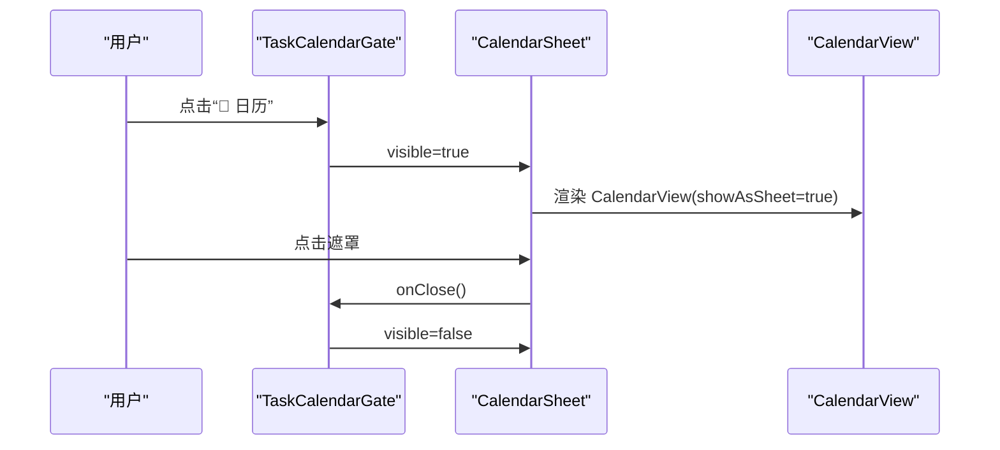
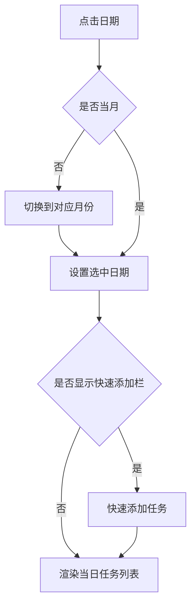
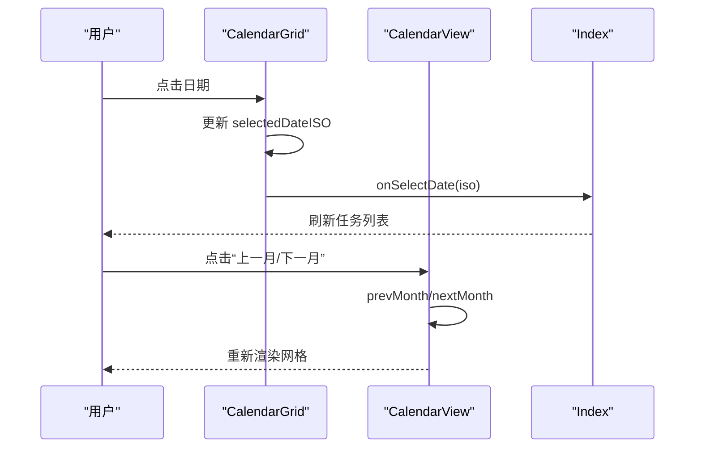
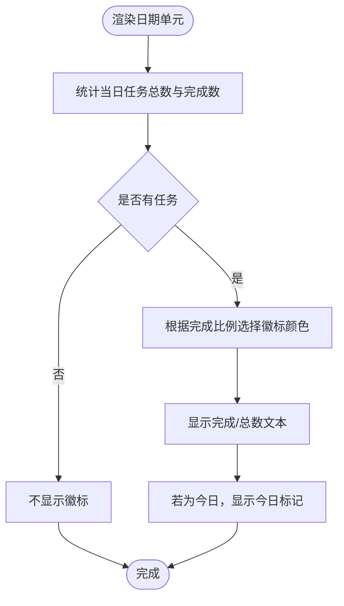
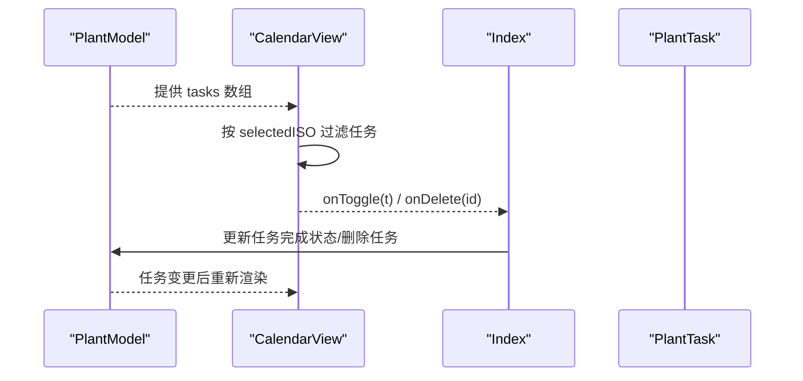
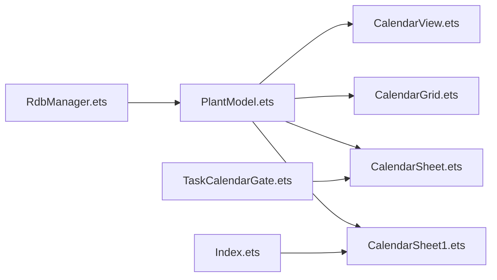

# 日历组件

<cite>
**本文引用的文件**   
- [CalendarGrid.ets](file://entry/src/main/ets/view/CalendarGrid.ets)
- [CalendarView.ets](file://entry/src/main/ets/view/CalendarView.ets)
- [CalendarSheet.ets](file://entry/src/main/ets/pages/CalendarSheet.ets)
- [TaskCalendarGate.ets](file://entry/src/main/ets/view/TaskCalendarGate.ets)
- [Index.ets](file://entry/src/main/ets/pages/Index.ets)
- [PlantModel.ets](file://entry/src/main/ets/model/PlantModel.ets)
- [RdbManager.ets](file://entry/src/main/ets/viewmodel/RdbManager.ets)
</cite>

## 目录
1. [简介](#简介)
2. [项目结构](#项目结构)
3. [核心组件](#核心组件)
4. [架构总览](#架构总览)
5. [详细组件分析](#详细组件分析)
6. [依赖关系分析](#依赖关系分析)
7. [性能考量](#性能考量)
8. [故障排查指南](#故障排查指南)
9. [结论](#结论)
10. [附录](#附录)

## 简介
本文件系统性梳理植物日记应用中的日历相关组件，重点覆盖以下内容：
- CalendarGrid 日历网格组件与 CalendarView 日历视图组件的设计与实现
- 日期选择机制、月份切换、特殊日期标记与徽标统计
- 布局设计、响应式适配与触摸交互处理
- 与任务系统的集成方式及任务完成状态可视化
- 组件配置项与自定义样式指南
- 在植物日记应用中的具体场景与使用示例

## 项目结构
日历相关代码主要分布在以下模块：
- 视图层：CalendarView（核心）、CalendarGrid（内嵌包装）、CalendarSheet（抽屉包装）
- 页面层：CalendarSheet1（完整日历页，含快速添加与筛选）
- 集成门面：TaskCalendarGate（任务列表中的日历入口）
- 应用入口：Index（Tab 切换到日历页）
- 数据模型：PlantModel（Plant、PlantTask、_DayCell 等）
- 数据库：RdbManager（任务与日志存储）

**图表来源**
- [Index.ets:951-978](file://entry/src/main/ets/pages/Index.ets#L951-L978)
- [CalendarSheet.ets:1-504](file://entry/src/main/ets/pages/CalendarSheet.ets#L1-L504)
- [CalendarView.ets:1-566](file://entry/src/main/ets/view/CalendarView.ets#L1-L566)
- [CalendarGrid.ets:1-351](file://entry/src/main/ets/view/CalendarGrid.ets#L1-L351)
- [TaskCalendarGate.ets:1-81](file://entry/src/main/ets/view/TaskCalendarGate.ets#L1-L81)
- [PlantModel.ets:1-166](file://entry/src/main/ets/model/PlantModel.ets#L1-L166)
- [RdbManager.ets:1-296](file://entry/src/main/ets/viewmodel/RdbManager.ets#L1-L296)

**章节来源**
- [Index.ets:951-978](file://entry/src/main/ets/pages/Index.ets#L951-L978)
- [CalendarSheet.ets:1-504](file://entry/src/main/ets/pages/CalendarSheet.ets#L1-L504)
- [CalendarView.ets:1-566](file://entry/src/main/ets/view/CalendarView.ets#L1-L566)
- [CalendarGrid.ets:1-351](file://entry/src/main/ets/view/CalendarGrid.ets#L1-L351)
- [TaskCalendarGate.ets:1-81](file://entry/src/main/ets/view/TaskCalendarGate.ets#L1-L81)
- [PlantModel.ets:1-166](file://entry/src/main/ets/model/PlantModel.ets#L1-L166)
- [RdbManager.ets:1-296](file://entry/src/main/ets/viewmodel/RdbManager.ets#L1-L296)

## 核心组件
- CalendarView：日历核心视图，支持“抽屉模式”和“内嵌模式”，提供月份切换、日期选择、类型筛选、当日任务列表等能力。
- CalendarGrid：内嵌网格包装器，直接复用 CalendarView 的逻辑，简化在其他页面中的使用。
- CalendarSheet：抽屉式日历包装器，提供遮罩背景与底部弹出动画。
- CalendarSheet1：完整日历页，整合月视图、快速添加、筛选、当日任务列表，适合独立页面使用。
- TaskCalendarGate：任务列表中的日历入口，控制抽屉式日历的显隐与初始年月。

**章节来源**
- [CalendarView.ets:5-566](file://entry/src/main/ets/view/CalendarView.ets#L5-L566)
- [CalendarGrid.ets:513-536](file://entry/src/main/ets/view/CalendarGrid.ets#L513-L536)
- [CalendarSheet.ets:539-565](file://entry/src/main/ets/view/CalendarView.ets#L539-L565)
- [CalendarSheet.ets:17-504](file://entry/src/main/ets/pages/CalendarSheet.ets#L17-L504)
- [TaskCalendarGate.ets:6-81](file://entry/src/main/ets/view/TaskCalendarGate.ets#L6-L81)

## 架构总览
CalendarView 是日历的核心，CalendarGrid 与 CalendarSheet 分别以“内嵌”和“抽屉”两种模式复用其逻辑。CalendarSheet1 提供完整的日历页面体验，TaskCalendarGate 将日历入口接入任务列表。PlantModel 定义了 Plant、PlantTask、_DayCell 等数据结构，RdbManager 负责数据库初始化与索引。

**图表来源**
- [CalendarView.ets:5-566](file://entry/src/main/ets/view/CalendarView.ets#L5-L566)
- [CalendarGrid.ets:513-536](file://entry/src/main/ets/view/CalendarGrid.ets#L513-L536)
- [CalendarSheet.ets:539-565](file://entry/src/main/ets/view/CalendarView.ets#L539-L565)
- [CalendarSheet.ets:17-504](file://entry/src/main/ets/pages/CalendarSheet.ets#L17-L504)
- [TaskCalendarGate.ets:6-81](file://entry/src/main/ets/view/TaskCalendarGate.ets#L6-L81)
- [PlantModel.ets:43-59](file://entry/src/main/ets/model/PlantModel.ets#L43-L59)
- [PlantModel.ets:7-21](file://entry/src/main/ets/model/PlantModel.ets#L7-L21)

## 详细组件分析

### CalendarView：日历核心视图
- 功能要点
  - 两种显示模式：抽屉（带遮罩、底部弹出）与内嵌（直接铺在父布局）
  - 月份切换：上一月/下一月，自动将选中日期重置为切换后当月1号
  - 日期选择：点击日期更新选中 ISO，支持触摸按下缩放反馈
  - 特殊日期标记：今日标记、任务数量徽标、完成度徽标颜色
  - 类型筛选：按“全部/浇水/施肥/修剪”筛选当日任务
  - 当日任务列表：支持完成状态切换与删除
- 关键算法
  - 月网格生成：根据年月生成 42 个单元（含上月/下月补位），并标注是否为当月与今日
  - 徽标统计：按日期统计任务总数与已完成数，决定徽标颜色与文本
  - 选中状态：通过 selectedISO 控制选中日期的高亮与阴影
- 交互细节
  - 抽屉模式：遮罩点击关闭；底部弹出动画
  - 内嵌模式：圆角、阴影、边距统一风格
  - 触摸反馈：按下缩放、抬起恢复，提升触控体验

**图表来源**
- [CalendarView.ets:480-510](file://entry/src/main/ets/view/CalendarView.ets#L480-L510)
- [CalendarView.ets:218-283](file://entry/src/main/ets/view/CalendarView.ets#L218-L283)
- [CalendarView.ets:464-478](file://entry/src/main/ets/view/CalendarView.ets#L464-L478)

**章节来源**
- [CalendarView.ets:5-566](file://entry/src/main/ets/view/CalendarView.ets#L5-L566)

### CalendarGrid：内嵌网格
- 设计目标：在其他页面中以“内嵌”形式复用日历核心逻辑，避免重复实现
- 关键点
  - 通过 CalendarView 的内嵌模式参数化渲染
  - 事件透传：onToggle、onDelete、onClose（内嵌模式下 onClose 为空）
- 使用建议
  - 适用于需要在页面中部嵌入日历网格的场景，如任务详情页或植物详情页

**图表来源**
- [CalendarGrid.ets:513-536](file://entry/src/main/ets/view/CalendarGrid.ets#L513-L536)
- [CalendarView.ets:521-536](file://entry/src/main/ets/view/CalendarView.ets#L521-L536)

**章节来源**
- [CalendarGrid.ets:513-536](file://entry/src/main/ets/view/CalendarGrid.ets#L513-L536)
- [CalendarView.ets:521-536](file://entry/src/main/ets/view/CalendarView.ets#L521-L536)

### CalendarSheet：抽屉式日历
- 设计目标：在抽屉中展示完整日历，带遮罩与底部弹出动画
- 关键点
  - showAsSheet=true，遮罩点击触发 onClose
  - 事件透传：onToggle、onDelete、onClose
- 使用建议
  - 适用于从任务列表或导航入口快速打开日历查看与操作

**图表来源**
- [TaskCalendarGate.ets:22-61](file://entry/src/main/ets/view/TaskCalendarGate.ets#L22-L61)
- [CalendarSheet.ets:539-565](file://entry/src/main/ets/view/CalendarView.ets#L539-L565)
- [CalendarView.ets:31-80](file://entry/src/main/ets/view/CalendarView.ets#L31-L80)

**章节来源**
- [TaskCalendarGate.ets:22-61](file://entry/src/main/ets/view/TaskCalendarGate.ets#L22-L61)
- [CalendarSheet.ets:539-565](file://entry/src/main/ets/view/CalendarView.ets#L539-L565)
- [CalendarView.ets:31-80](file://entry/src/main/ets/view/CalendarView.ets#L31-L80)

### CalendarSheet1：完整日历页
- 设计目标：在一个页面中整合月视图、快速添加、筛选、当日任务列表
- 关键点
  - 月视图网格：固定 42 个格子，包含上月/下月补位
  - 快速添加：点击某天进入“快速添加”栏，选择植物与类型创建任务
  - 筛选：完成状态（全部/未完成/已完成）与类型（全部/浇水/施肥/修剪）
  - 当日任务列表：支持完成状态切换与删除
- 交互细节
  - 长按进入“专注模式”，仅显示该天任务
  - 点击非当月日期自动切换月份并选中对应日期

**图表来源**
- [CalendarSheet.ets:255-261](file://entry/src/main/ets/pages/CalendarSheet.ets#L255-L261)
- [CalendarSheet.ets:133-135](file://entry/src/main/ets/pages/CalendarSheet.ets#L133-L135)
- [CalendarSheet.ets:476-492](file://entry/src/main/ets/pages/CalendarSheet.ets#L476-L492)

**章节来源**
- [CalendarSheet.ets:17-504](file://entry/src/main/ets/pages/CalendarSheet.ets#L17-L504)

### 日期选择机制与月份切换
- 日期选择
  - CalendarView：点击日期更新 selectedISO，并触发任务列表刷新
  - CalendarGrid：内部维护 selectedDateISO，点击日期更新并回调 onSelectDate
  - CalendarSheet1：点击日期设置 quickDate 或 focusDate，支持快速添加与专注模式
- 月份切换
  - CalendarView：prevMonth/nextMonth 计算年月边界，必要时跨年；切换后将选中日期重置为当月1号
  - CalendarSheet1：点击头部左右箭头切换年月，同时更新 quickDate

**图表来源**
- [CalendarGrid.ets:343-348](file://entry/src/main/ets/view/CalendarGrid.ets#L343-L348)
- [CalendarView.ets:480-502](file://entry/src/main/ets/view/CalendarView.ets#L480-L502)
- [Index.ets:951-978](file://entry/src/main/ets/pages/Index.ets#L951-L978)

**章节来源**
- [CalendarGrid.ets:343-348](file://entry/src/main/ets/view/CalendarGrid.ets#L343-L348)
- [CalendarView.ets:480-502](file://entry/src/main/ets/view/CalendarView.ets#L480-L502)
- [CalendarSheet.ets:343-349](file://entry/src/main/ets/pages/CalendarSheet.ets#L343-L349)
- [Index.ets:951-978](file://entry/src/main/ets/pages/Index.ets#L951-L978)

### 特殊日期标记与徽标统计
- 标记策略
  - 今日标记：在日期单元右侧显示小点，标识当天
  - 任务徽标：显示“已完成/总数”的徽标，颜色区分“未完成/完成/部分完成”
  - 专注模式：聚焦某天时，仅该天背景高亮
- 统计逻辑
  - 按日期聚合任务总数与完成数
  - 支持按类型与完成状态筛选
  - 支持按植物 ID 过滤（在 CalendarGrid 中体现）

**图表来源**
- [CalendarView.ets:437-449](file://entry/src/main/ets/view/CalendarView.ets#L437-L449)
- [CalendarView.ets:359-370](file://entry/src/main/ets/view/CalendarView.ets#L359-L370)
- [CalendarGrid.ets:150-163](file://entry/src/main/ets/view/CalendarGrid.ets#L150-L163)
- [CalendarSheet.ets:403-415](file://entry/src/main/ets/pages/CalendarSheet.ets#L403-L415)

**章节来源**
- [CalendarView.ets:437-449](file://entry/src/main/ets/view/CalendarView.ets#L437-L449)
- [CalendarView.ets:359-370](file://entry/src/main/ets/view/CalendarView.ets#L359-L370)
- [CalendarGrid.ets:150-163](file://entry/src/main/ets/view/CalendarGrid.ets#L150-L163)
- [CalendarSheet.ets:403-415](file://entry/src/main/ets/pages/CalendarSheet.ets#L403-L415)

### 布局设计、响应式适配与触摸交互
- 布局设计
  - 采用百分比宽度与固定高度的网格布局，保证在不同屏幕尺寸下的稳定性
  - 内嵌模式提供圆角、阴影与边距，抽屉模式提供遮罩与底部弹出动画
- 响应式适配
  - 使用百分比宽度（约 14.28%）适配 7 列网格
  - 通过 padding/margin 控制行列间距，避免拥挤
- 触摸交互
  - 按下缩放（scale）与抬起恢复，提升点击反馈
  - 遮罩点击关闭抽屉，提升可用性

**章节来源**
- [CalendarView.ets:266-282](file://entry/src/main/ets/view/CalendarView.ets#L266-L282)
- [CalendarView.ets:42-80](file://entry/src/main/ets/view/CalendarView.ets#L42-L80)
- [CalendarGrid.ets:334-348](file://entry/src/main/ets/view/CalendarGrid.ets#L334-L348)

### 与任务系统的集成与可视化
- 数据模型
  - PlantTask：任务实体，包含 plantId、type、planDate、done 等
  - Plant：植物实体，用于任务行展示植物名称
- 集成方式
  - CalendarView/CalendarGrid/CalendarSheet1 接收 tasks 参数，按日期聚合任务
  - 支持 onToggle 与 onDelete 事件，驱动任务完成状态切换与删除
  - Index 中将日历页与任务列表联动，实现“点击日期跳转到日历页并选中日期”
- 可视化
  - 任务行左侧显示完成状态图标，点击切换
  - 任务行右侧显示删除按钮
  - 当日任务列表按完成状态排序（未完成在前）

**图表来源**
- [PlantModel.ets:43-59](file://entry/src/main/ets/model/PlantModel.ets#L43-L59)
- [CalendarView.ets:464-478](file://entry/src/main/ets/view/CalendarView.ets#L464-L478)
- [Index.ets:961-977](file://entry/src/main/ets/pages/Index.ets#L961-L977)

**章节来源**
- [PlantModel.ets:43-59](file://entry/src/main/ets/model/PlantModel.ets#L43-L59)
- [CalendarView.ets:464-478](file://entry/src/main/ets/view/CalendarView.ets#L464-L478)
- [Index.ets:961-977](file://entry/src/main/ets/pages/Index.ets#L961-L977)

## 依赖关系分析
- 组件耦合
  - CalendarGrid 与 CalendarSheet 均依赖 CalendarView，降低重复逻辑
  - CalendarSheet1 独立于 CalendarView，但复用 PlantModel 与任务交互
  - TaskCalendarGate 仅负责抽屉显隐与初始年月
- 外部依赖
  - PlantModel 提供 PlantTask、Plant、_DayCell 等数据结构
  - RdbManager 提供数据库初始化与索引，支撑任务与日志持久化

**图表来源**
- [PlantModel.ets:1-166](file://entry/src/main/ets/model/PlantModel.ets#L1-L166)
- [RdbManager.ets:1-296](file://entry/src/main/ets/viewmodel/RdbManager.ets#L1-L296)
- [CalendarView.ets:1-566](file://entry/src/main/ets/view/CalendarView.ets#L1-L566)
- [CalendarGrid.ets:1-351](file://entry/src/main/ets/view/CalendarGrid.ets#L1-L351)
- [CalendarSheet.ets:1-566](file://entry/src/main/ets/view/CalendarView.ets#L1-L566)
- [CalendarSheet.ets:1-504](file://entry/src/main/ets/pages/CalendarSheet.ets#L1-L504)
- [TaskCalendarGate.ets:1-81](file://entry/src/main/ets/view/TaskCalendarGate.ets#L1-L81)
- [Index.ets:951-978](file://entry/src/main/ets/pages/Index.ets#L951-L978)

**章节来源**
- [PlantModel.ets:1-166](file://entry/src/main/ets/model/PlantModel.ets#L1-L166)
- [RdbManager.ets:1-296](file://entry/src/main/ets/viewmodel/RdbManager.ets#L1-L296)
- [CalendarView.ets:1-566](file://entry/src/main/ets/view/CalendarView.ets#L1-L566)
- [CalendarGrid.ets:1-351](file://entry/src/main/ets/view/CalendarGrid.ets#L1-L351)
- [CalendarSheet.ets:1-566](file://entry/src/main/ets/view/CalendarView.ets#L1-L566)
- [CalendarSheet.ets:1-504](file://entry/src/main/ets/pages/CalendarSheet.ets#L1-L504)
- [TaskCalendarGate.ets:1-81](file://entry/src/main/ets/view/TaskCalendarGate.ets#L1-L81)
- [Index.ets:951-978](file://entry/src/main/ets/pages/Index.ets#L951-L978)

## 性能考量
- 渲染优化
  - 月网格固定 42 个单元，避免动态长度导致的重排
  - 使用 ForEach 渲染，减少不必要的虚拟节点
- 事件处理
  - 通过 selectedISO 与 filteredTasksBySelected 减少列表重算
  - 类型筛选与完成状态筛选在渲染前完成过滤
- 数据访问
  - 任务按日期聚合统计，避免在渲染过程中频繁遍历
  - 使用唯一索引与组合索引（计划日期、植物 ID）提升查询效率

[本节为通用指导，不直接分析具体文件]

## 故障排查指南
- 日期未正确选中
  - 检查 onToggle/onDelete 是否正确传递至 CalendarView/CalendarGrid
  - 确认 selectedISO 与 selectedDateISO 的更新逻辑
- 徽标颜色异常
  - 校验 done 与 total 的统计逻辑，确保完成比例计算正确
  - 确认颜色映射规则与任务 done 状态一致
- 抽屉无法关闭
  - 检查 onClose 回调是否正确设置 visible=false
  - 确认遮罩点击事件绑定
- 快速添加无效
  - 确认 quickDate 设置与 onQuickAdd 回调链路
  - 校验 plantId 与 type 的选择状态

**章节来源**
- [CalendarView.ets:480-510](file://entry/src/main/ets/view/CalendarView.ets#L480-L510)
- [CalendarGrid.ets:343-348](file://entry/src/main/ets/view/CalendarGrid.ets#L343-L348)
- [CalendarSheet.ets:255-261](file://entry/src/main/ets/pages/CalendarSheet.ets#L255-L261)
- [TaskCalendarGate.ets:46-49](file://entry/src/main/ets/view/TaskCalendarGate.ets#L46-L49)

## 结论
日历组件通过 CalendarView 实现核心逻辑，CalendarGrid 与 CalendarSheet 提供内嵌与抽屉两种使用形态，CalendarSheet1 则在完整页面中整合快速添加与筛选。组件围绕 PlantTask 与 Plant 的数据模型构建，结合 RdbManager 的数据库能力，实现了从日期选择、任务筛选到完成状态切换的闭环。整体设计注重可复用性、交互反馈与性能优化，适合在植物日记应用中广泛使用。

[本节为总结性内容，不直接分析具体文件]

## 附录

### 组件配置选项与自定义样式指南
- CalendarView
  - 参数：showAsSheet、year、month、tasks、onToggle、onDelete、onClose
  - 自定义：可通过调整圆角、阴影、边距与颜色资源实现主题化
- CalendarGrid
  - 参数：year、month、tasks、onToggle、onDelete
  - 自定义：复用 CalendarView 的样式参数
- CalendarSheet
  - 参数：year、month、tasks、onToggle、onDelete、onClose
  - 自定义：抽屉背景与动画参数可按需调整
- CalendarSheet1
  - 参数：year、month、tasks、plants、onChangeMonth、onQuickAdd、onToggle、onDeleteAsk
  - 自定义：快速添加栏、筛选栏与任务行样式可按需定制

**章节来源**
- [CalendarView.ets:5-566](file://entry/src/main/ets/view/CalendarView.ets#L5-L566)
- [CalendarGrid.ets:513-536](file://entry/src/main/ets/view/CalendarGrid.ets#L513-L536)
- [CalendarSheet.ets:539-565](file://entry/src/main/ets/view/CalendarView.ets#L539-L565)
- [CalendarSheet.ets:17-504](file://entry/src/main/ets/pages/CalendarSheet.ets#L17-L504)

### 在植物日记应用中的应用场景与使用示例
- 任务列表入口
  - 通过 TaskCalendarGate 打开抽屉式日历，便于从任务页快速查看与管理日程
- 主页日历页
  - Index 中将日历页作为 Tab 之一，支持快速切换到日历视图
- 完整日历页
  - CalendarSheet1 提供“快速添加”、“筛选”、“专注模式”等完整体验，适合深度使用

**章节来源**
- [TaskCalendarGate.ets:22-61](file://entry/src/main/ets/view/TaskCalendarGate.ets#L22-L61)
- [Index.ets:951-978](file://entry/src/main/ets/pages/Index.ets#L951-L978)
- [CalendarSheet.ets:17-504](file://entry/src/main/ets/pages/CalendarSheet.ets#L17-L504)