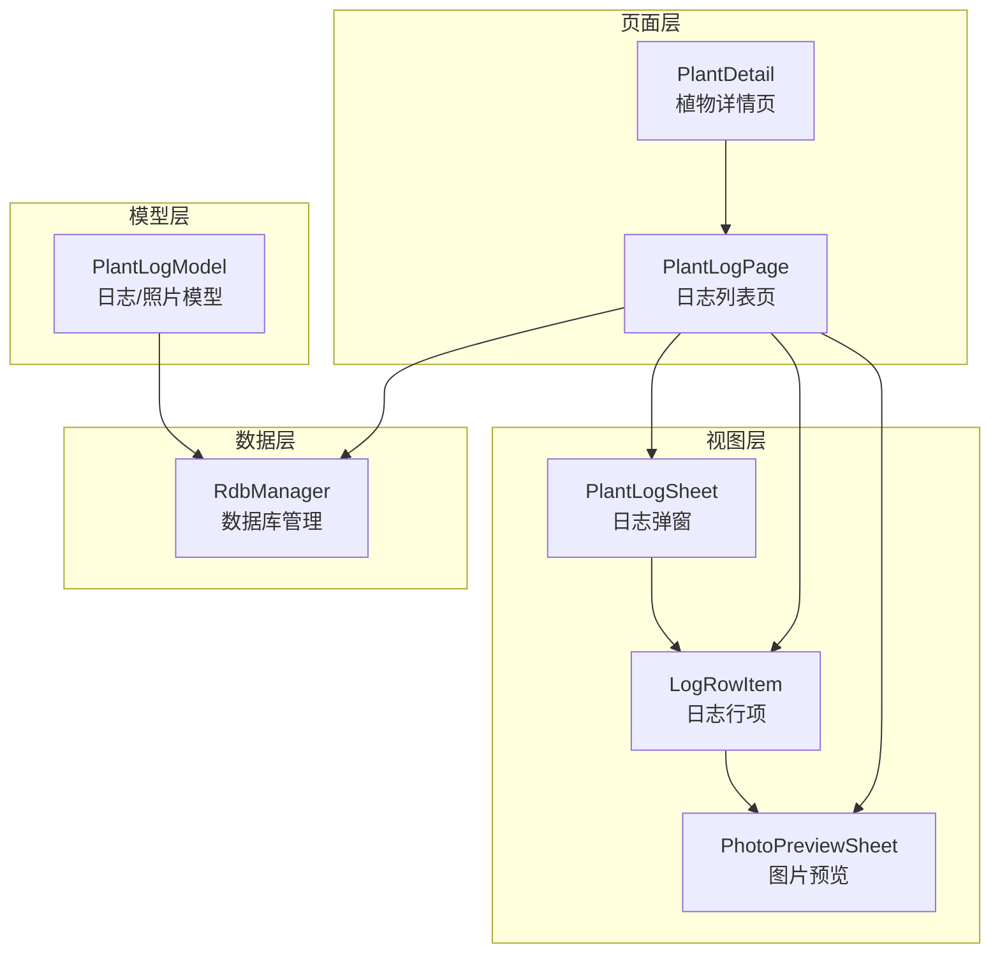
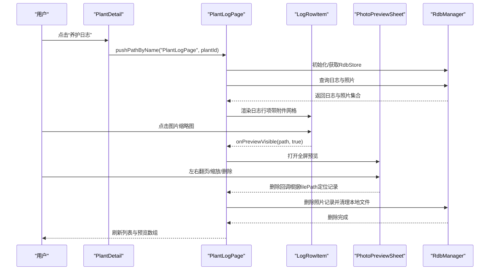
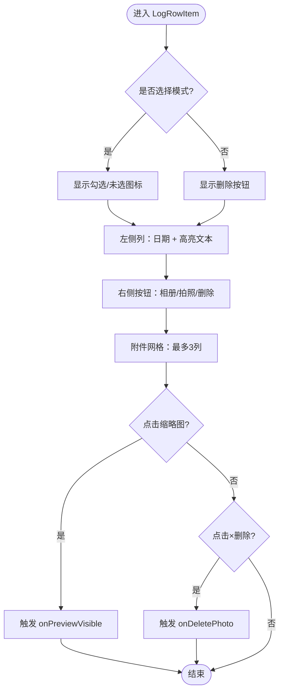
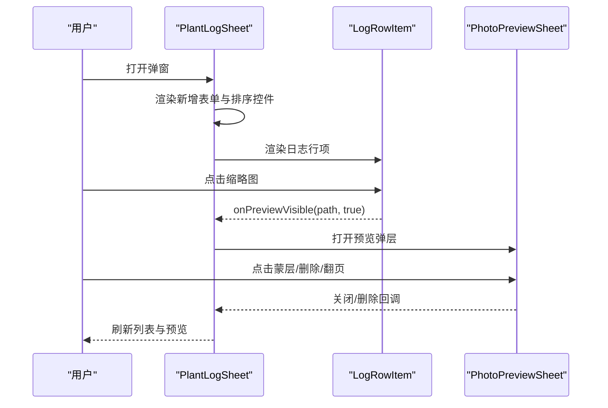
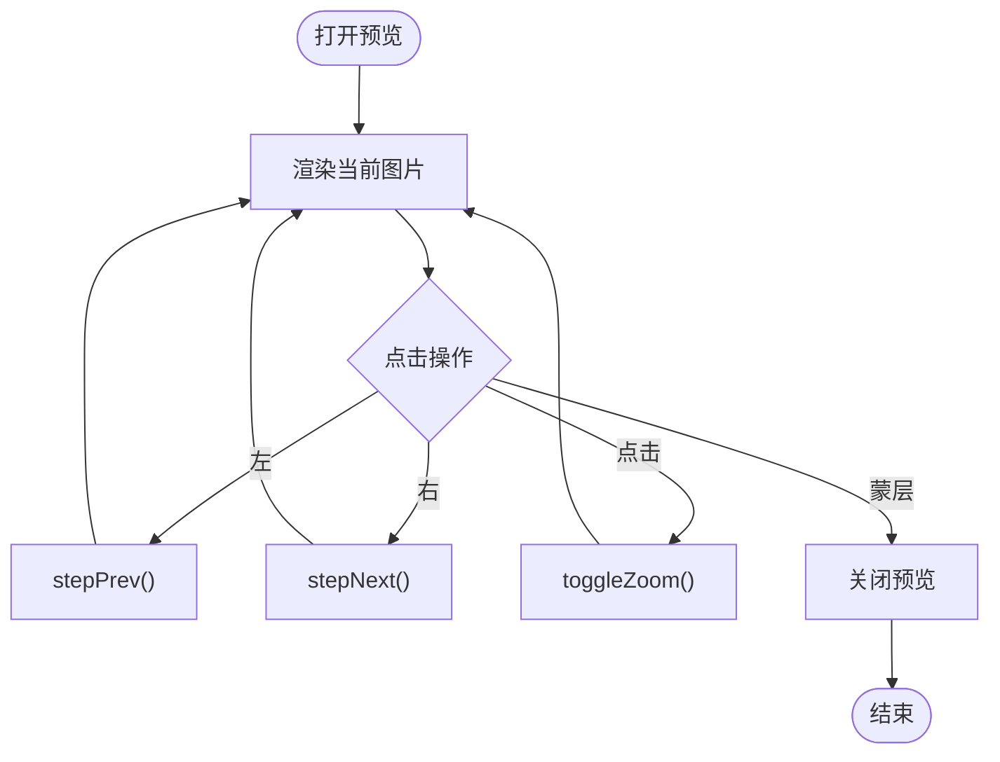
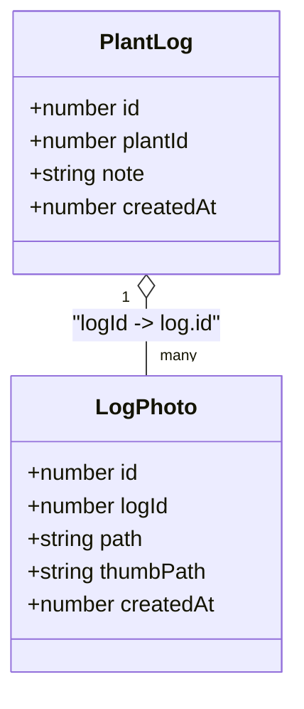
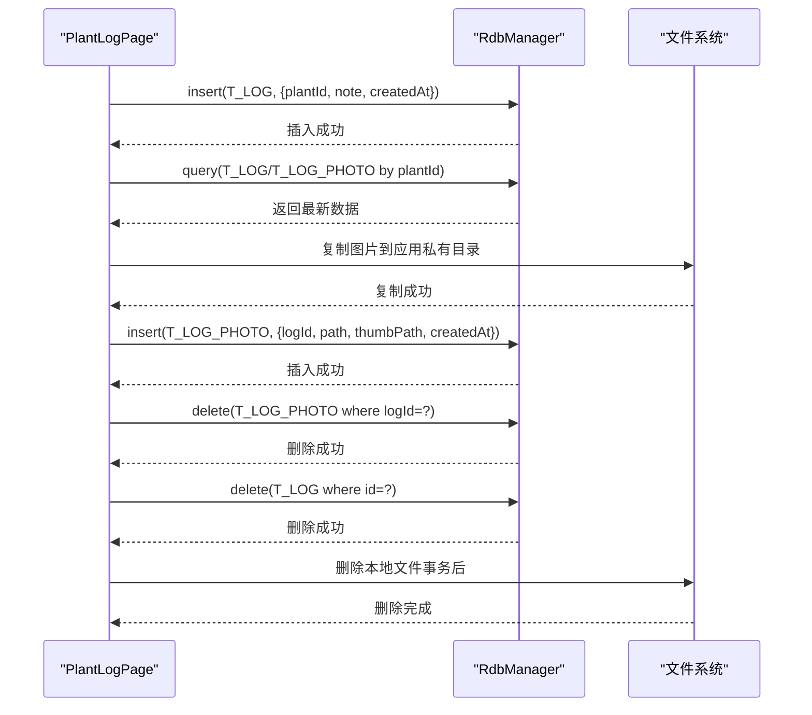
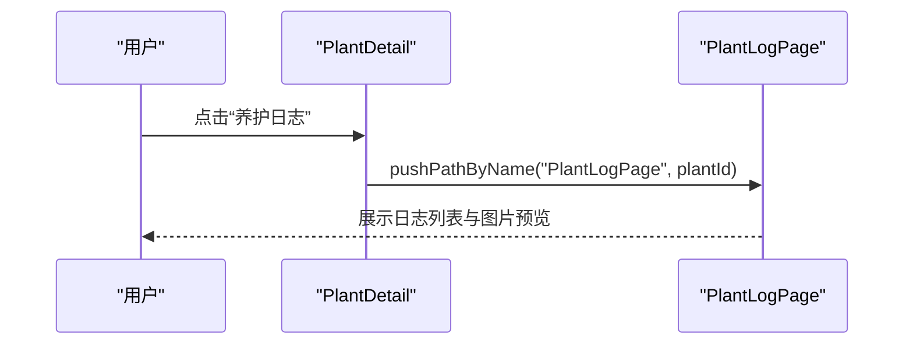
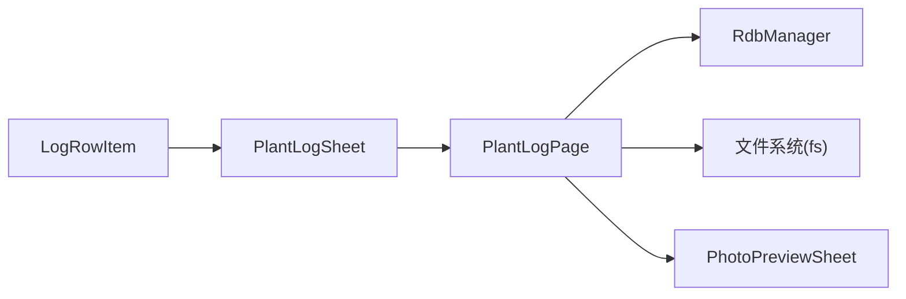

# 日志组件

<cite>
**本文引用的文件**
- [LogRowItem.ets](file://entry/src/main/ets/view/LogRowItem.ets)
- [PlantLogSheet.ets](file://entry/src/main/ets/view/PlantLogSheet.ets)
- [PlantLogModel.ets](file://entry/src/main/ets/model/PlantLogModel.ets)
- [PhotoPreviewSheet.ets](file://entry/src/main/ets/view/PhotoPreviewSheet.ets)
- [PlantLogPage.ets](file://entry/src/main/ets/pages/PlantLogPage.ets)
- [PlantDetail.ets](file://entry/src/main/ets/pages/PlantDetail.ets)
- [RdbManager.ets](file://entry/src/main/ets/viewmodel/RdbManager.ets)
</cite>

## 目录
1. [简介](#简介)
2. [项目结构](#项目结构)
3. [核心组件](#核心组件)
4. [架构总览](#架构总览)
5. [组件详解](#组件详解)
6. [依赖关系分析](#依赖关系分析)
7. [性能考量](#性能考量)
8. [故障排查指南](#故障排查指南)
9. [结论](#结论)
10. [附录](#附录)

## 简介
本文件系统性梳理日志相关组件，重点覆盖以下内容：
- LogRowItem 日志行项组件：负责单条日志的展示、关键字高亮、附件缩略图网格、图片预览触发、多选与删除交互。
- PlantLogSheet 植物日志弹窗组件：负责日志列表的模态展示、新增日志、排序、多选批量删除、图片预览等。
- 数据模型：PlantLog 与 LogPhoto 的字段定义与用途。
- 数据库交互：日志与照片的加载、插入、删除流程及事务策略。
- 样式与主题：颜色、阴影、圆角、动画等视觉规范。
- 应用场景：植物详情页与日志列表页的具体集成方式。

## 项目结构
日志相关代码主要分布在以下模块：
- 视图层：LogRowItem、PlantLogSheet、PhotoPreviewSheet
- 页面层：PlantLogPage（日志列表页）、PlantDetail（植物详情页）
- 模型层：PlantLogModel（日志与照片模型）
- 数据层：RdbManager（数据库初始化与索引）

**图表来源**
- [PlantLogPage.ets:13-662](file://entry/src/main/ets/pages/PlantLogPage.ets#L13-L662)
- [LogRowItem.ets:1-272](file://entry/src/main/ets/view/LogRowItem.ets#L1-L272)
- [PlantLogSheet.ets:35-367](file://entry/src/main/ets/view/PlantLogSheet.ets#L35-L367)
- [PhotoPreviewSheet.ets:1-223](file://entry/src/main/ets/view/PhotoPreviewSheet.ets#L1-L223)
- [PlantLogModel.ets:8-57](file://entry/src/main/ets/model/PlantLogModel.ets#L8-L57)
- [RdbManager.ets:4-170](file://entry/src/main/ets/viewmodel/RdbManager.ets#L4-L170)

**章节来源**
- [PlantLogPage.ets:13-662](file://entry/src/main/ets/pages/PlantLogPage.ets#L13-L662)
- [LogRowItem.ets:1-272](file://entry/src/main/ets/view/LogRowItem.ets#L1-L272)
- [PlantLogSheet.ets:35-367](file://entry/src/main/ets/view/PlantLogSheet.ets#L35-L367)
- [PhotoPreviewSheet.ets:1-223](file://entry/src/main/ets/view/PhotoPreviewSheet.ets#L1-L223)
- [PlantLogModel.ets:8-57](file://entry/src/main/ets/model/PlantLogModel.ets#L8-L57)
- [RdbManager.ets:4-170](file://entry/src/main/ets/viewmodel/RdbManager.ets#L4-L170)

## 核心组件
- LogRowItem：单条日志卡片，支持关键字高亮、附件网格、图片点击预览、长按进入选择模式、删除按钮等。
- PlantLogSheet：日志弹窗容器，包含新增表单、排序控制、多选/取消选择、列表渲染、图片预览弹层。
- PhotoPreviewSheet：全屏图片预览，支持左右翻页、缩放、删除与关闭。
- PlantLogPage：日志列表页，负责数据库读写、事务删除、照片复制与入库、Banner提示等。
- PlantLogModel：日志与照片的数据模型，定义字段与构造函数。
- RdbManager：数据库初始化、建表与索引、常用查询接口。

**章节来源**
- [LogRowItem.ets:4-134](file://entry/src/main/ets/view/LogRowItem.ets#L4-L134)
- [PlantLogSheet.ets:35-367](file://entry/src/main/ets/view/PlantLogSheet.ets#L35-L367)
- [PhotoPreviewSheet.ets:2-223](file://entry/src/main/ets/view/PhotoPreviewSheet.ets#L2-L223)
- [PlantLogPage.ets:13-662](file://entry/src/main/ets/pages/PlantLogPage.ets#L13-L662)
- [PlantLogModel.ets:8-57](file://entry/src/main/ets/model/PlantLogModel.ets#L8-L57)
- [RdbManager.ets:4-170](file://entry/src/main/ets/viewmodel/RdbManager.ets#L4-L170)

## 架构总览
日志组件采用“页面层 + 视图层 + 模型层 + 数据层”的分层设计：
- 页面层（PlantLogPage/PlantDetail）负责导航、状态管理与数据库交互。
- 视图层（LogRowItem/PlantLogSheet/PhotoPreviewSheet）负责UI渲染与用户交互。
- 模型层（PlantLogModel）提供数据结构定义。
- 数据层（RdbManager）负责数据库初始化、建表、索引与SQL执行。

**图表来源**
- [PlantDetail.ets:79-81](file://entry/src/main/ets/pages/PlantDetail.ets#L79-L81)
- [PlantLogPage.ets:58-662](file://entry/src/main/ets/pages/PlantLogPage.ets#L58-L662)
- [LogRowItem.ets:154-205](file://entry/src/main/ets/view/LogRowItem.ets#L154-L205)
- [PhotoPreviewSheet.ets:102-223](file://entry/src/main/ets/view/PhotoPreviewSheet.ets#L102-L223)
- [RdbManager.ets:27-170](file://entry/src/main/ets/viewmodel/RdbManager.ets#L27-L170)

## 组件详解

### LogRowItem 日志行项组件
- 展示格式
  - 顶部显示“是否处于选择模式”，选择模式下显示勾选/未选图标。
  - 左侧列：日期（由时间戳转换为“年-月-日”）、高亮显示的关键字文本（支持前缀、命中词、后缀三段拼接）。
  - 右侧三按钮：相册选取、拍照、删除（非选择模式）。
  - 底部附件网格：最多3列，按数量动态计算高度；支持点击缩略图预览、点击“×”删除照片。
- 关键交互
  - 长按触发选择模式，点击卡片切换选择状态。
  - 点击“📤/📲”触发父页的相册选取或拍照回调。
  - 点击“🗏”在选择模式下切换选择，在非选择模式下删除日志。
  - 点击缩略图触发 onPreviewVisible 回调，父页控制预览弹层。
  - 点击缩略图右上角“×”删除照片。
- 性能与复杂度
  - 附件网格按数量动态布局，时间复杂度 O(n)。
  - 高亮逻辑按关键字拆分为三段文本，时间复杂度 O(m)（m为文本长度）。
- 样式与主题
  - 白色卡片背景、圆角、阴影；按下缩放动画；触摸反馈。
  - 文本颜色与尺寸遵循统一规范；缩略图圆角与尺寸固定。

**图表来源**
- [LogRowItem.ets:72-134](file://entry/src/main/ets/view/LogRowItem.ets#L72-L134)
- [LogRowItem.ets:154-205](file://entry/src/main/ets/view/LogRowItem.ets#L154-L205)
- [LogRowItem.ets:207-222](file://entry/src/main/ets/view/LogRowItem.ets#L207-L222)
- [LogRowItem.ets:29-57](file://entry/src/main/ets/view/LogRowItem.ets#L29-L57)

**章节来源**
- [LogRowItem.ets:4-134](file://entry/src/main/ets/view/LogRowItem.ets#L4-L134)
- [LogRowItem.ets:136-152](file://entry/src/main/ets/view/LogRowItem.ets#L136-L152)
- [LogRowItem.ets:154-205](file://entry/src/main/ets/view/LogRowItem.ets#L154-L205)
- [LogRowItem.ets:207-222](file://entry/src/main/ets/view/LogRowItem.ets#L207-L222)
- [LogRowItem.ets:29-57](file://entry/src/main/ets/view/LogRowItem.ets#L29-L57)

### PlantLogSheet 植物日志弹窗组件
- 功能概览
  - 顶部标题与关闭按钮；排序控制（升序/降序）；多选删除与取消选择。
  - 新增日志表单：内容输入、日期选择（今日快捷）、添加按钮。
  - 日志列表：按排序渲染，每条日志由 LogRowItem 渲染。
  - 图片预览弹层：点击任意图片全屏预览，点击蒙层关闭。
- 关键交互
  - 排序切换：sortAsc 控制排序方向。
  - 多选：长按进入选择模式，点击删除按钮批量删除。
  - 新增：校验内容非空后触发 onAddLog。
  - 预览：接收 onPreviewVisible 回调，设置 previewVisible 与 previewPath。
- 样式与主题
  - 弹窗底部圆角、阴影、动画入场；半透明遮罩；预览层居中显示。

**图表来源**
- [PlantLogSheet.ets:65-283](file://entry/src/main/ets/view/PlantLogSheet.ets#L65-L283)
- [PlantLogSheet.ets:212-252](file://entry/src/main/ets/view/PlantLogSheet.ets#L212-L252)
- [PlantLogSheet.ets:272-282](file://entry/src/main/ets/view/PlantLogSheet.ets#L272-L282)

**章节来源**
- [PlantLogSheet.ets:35-367](file://entry/src/main/ets/view/PlantLogSheet.ets#L35-L367)
- [PlantLogSheet.ets:65-283](file://entry/src/main/ets/view/PlantLogSheet.ets#L65-L283)
- [PlantLogSheet.ets:212-252](file://entry/src/main/ets/view/PlantLogSheet.ets#L212-L252)
- [PlantLogSheet.ets:272-282](file://entry/src/main/ets/view/PlantLogSheet.ets#L272-L282)

### PhotoPreviewSheet 图片预览组件
- 功能概览
  - 全屏显示当前图片，支持左右翻页、点击缩放、顶部工具栏（计数、删除、关闭）。
  - 切换时使用平移动画与透明度过渡，缩放通过 scale 切换。
- 关键交互
  - canPrev/canNext 控制翻页按钮可用性。
  - stepPrev/stepNext 实现切换动画与下标更新。
  - toggleZoom 在 1.0 与 1.8 之间切换缩放级别。
- 性能与复杂度
  - 翻页动画采用轻量过渡，时间复杂度 O(1)。

**图表来源**
- [PhotoPreviewSheet.ets:102-223](file://entry/src/main/ets/view/PhotoPreviewSheet.ets#L102-L223)
- [PhotoPreviewSheet.ets:52-92](file://entry/src/main/ets/view/PhotoPreviewSheet.ets#L52-L92)
- [PhotoPreviewSheet.ets:94-100](file://entry/src/main/ets/view/PhotoPreviewSheet.ets#L94-L100)

**章节来源**
- [PhotoPreviewSheet.ets:2-223](file://entry/src/main/ets/view/PhotoPreviewSheet.ets#L2-L223)
- [PhotoPreviewSheet.ets:52-92](file://entry/src/main/ets/view/PhotoPreviewSheet.ets#L52-L92)
- [PhotoPreviewSheet.ets:94-100](file://entry/src/main/ets/view/PhotoPreviewSheet.ets#L94-L100)

### 数据模型 PlantLog 与 LogPhoto
- PlantLog
  - 字段：id、plantId、note、createdAt
  - 用途：记录植物的养护记录与观察笔记
- LogPhoto
  - 字段：id、logId、path（原图）、thumbPath（缩略图）、createdAt
  - 用途：记录与日志关联的照片，支持原图与缩略图分离存储

**图表来源**
- [PlantLogModel.ets:8-57](file://entry/src/main/ets/model/PlantLogModel.ets#L8-L57)

**章节来源**
- [PlantLogModel.ets:8-57](file://entry/src/main/ets/model/PlantLogModel.ets#L8-L57)

### 数据库交互与事务策略
- 数据库初始化与建表
  - RdbManager 负责创建数据库、建表与索引（日志、日志照片、任务、指标等）。
  - 为日志与照片建立组合索引，优化按植物与时间的查询。
- 日志与照片加载
  - PlantLogPage 并行加载日志与照片，按 plantId 与 createdAt 排序。
- 新增日志与照片
  - 新增日志后统一重新加载，保证列表与附件同步刷新。
  - 照片通过 AddImageFileViewModel 选择并复制到应用私有目录，插入 log_photo 表。
- 删除策略
  - 单条日志删除：先查出所有关联文件路径，事务删除子表与日志表，事务成功后再删除本地文件。
  - 批量删除：先删除日志，再删除照片，最后刷新。
  - 通过 filePath 定位删除，避免在子组件中传递 photoId。

**图表来源**
- [PlantLogPage.ets:66-152](file://entry/src/main/ets/pages/PlantLogPage.ets#L66-L152)
- [PlantLogPage.ets:180-304](file://entry/src/main/ets/pages/PlantLogPage.ets#L180-L304)
- [PlantLogPage.ets:87-137](file://entry/src/main/ets/pages/PlantLogPage.ets#L87-L137)
- [RdbManager.ets:27-170](file://entry/src/main/ets/viewmodel/RdbManager.ets#L27-L170)

**章节来源**
- [PlantLogPage.ets:66-152](file://entry/src/main/ets/pages/PlantLogPage.ets#L66-L152)
- [PlantLogPage.ets:180-304](file://entry/src/main/ets/pages/PlantLogPage.ets#L180-L304)
- [PlantLogPage.ets:87-137](file://entry/src/main/ets/pages/PlantLogPage.ets#L87-L137)
- [RdbManager.ets:27-170](file://entry/src/main/ets/viewmodel/RdbManager.ets#L27-L170)

### 样式与主题适配
- 颜色体系
  - 文本颜色：深灰（正文）、中灰（辅助信息）、蓝（操作）、橙红（强调/删除）。
  - 背景颜色：卡片白、蒙层半透明白、预览背景深灰。
- 形状与阴影
  - 圆角：卡片、按钮、缩略图统一使用圆角。
  - 阴影：卡片与按钮使用阴影增强层级感。
- 动画与交互
  - 按下缩放、排序按钮触发动画、预览弹层入场动画、翻页过渡动画。
- 主题适配建议
  - 使用资源占位符（如 $r('app.integer.add_image_area_size')）统一尺寸与间距。
  - 通过颜色资源与暗色模式适配文件实现明暗主题切换。

**章节来源**
- [LogRowItem.ets:108-134](file://entry/src/main/ets/view/LogRowItem.ets#L108-L134)
- [PlantLogSheet.ets:263-269](file://entry/src/main/ets/view/PlantLogSheet.ets#L263-L269)
- [PhotoPreviewSheet.ets:106-114](file://entry/src/main/ets/view/PhotoPreviewSheet.ets#L106-L114)

### 应用场景
- 植物详情页（PlantDetail）
  - 在“快捷功能”区域提供“养护日志”入口，点击后导航至 PlantLogPage，并传入 plantId。
- 日志列表页（PlantLogPage）
  - 作为日志列表与图片预览的主要承载页面，负责数据库读写、事务删除、Banner提示与图片预览。

**图表来源**
- [PlantDetail.ets:79-81](file://entry/src/main/ets/pages/PlantDetail.ets#L79-L81)
- [PlantLogPage.ets:639-648](file://entry/src/main/ets/pages/PlantLogPage.ets#L639-L648)

**章节来源**
- [PlantDetail.ets:79-81](file://entry/src/main/ets/pages/PlantDetail.ets#L79-L81)
- [PlantLogPage.ets:639-648](file://entry/src/main/ets/pages/PlantLogPage.ets#L639-L648)

## 依赖关系分析
- 组件耦合
  - LogRowItem 仅负责展示与交互，不直接持有数据库状态，通过事件回调与父页通信。
  - PlantLogSheet 作为容器，聚合日志列表、新增表单与预览弹层。
  - PlantLogPage 负责数据库交互与状态管理，是日志组件的核心协调者。
- 外部依赖
  - ArkData 关系型数据库（relationalStore）用于日志与照片的持久化。
  - 文件系统（fs）用于图片复制与删除。
  - 资源系统（$r）用于统一尺寸与媒体资源访问。

**图表来源**
- [LogRowItem.ets:1-18](file://entry/src/main/ets/view/LogRowItem.ets#L1-L18)
- [PlantLogSheet.ets:1-2](file://entry/src/main/ets/view/PlantLogSheet.ets#L1-L2)
- [PlantLogPage.ets:1-11](file://entry/src/main/ets/pages/PlantLogPage.ets#L1-L11)

**章节来源**
- [LogRowItem.ets:1-18](file://entry/src/main/ets/view/LogRowItem.ets#L1-L18)
- [PlantLogSheet.ets:1-2](file://entry/src/main/ets/view/PlantLogSheet.ets#L1-L2)
- [PlantLogPage.ets:1-11](file://entry/src/main/ets/pages/PlantLogPage.ets#L1-L11)

## 性能考量
- 列表渲染
  - 使用 List + ListItem 渲染日志，减少不必要的重绘。
  - 附件网格按数量动态计算高度，避免过度布局。
- 数据加载
  - 并行加载日志与照片，降低首屏等待时间。
  - 通过索引优化按 plantId 与 createdAt 的查询。
- 图片处理
  - 缩略图与原图分离存储，优先使用缩略图提升加载速度。
  - 删除照片时先删数据库记录，再删本地文件，避免数据不一致。
- 动画与交互
  - 使用轻量动画与过渡，避免卡顿；预览弹层采用淡入淡出与平移过渡。

## 故障排查指南
- 无法打开日志弹窗
  - 检查导航参数是否正确传入 plantId。
  - 确认 RdbStore 是否初始化成功。
- 照片无法显示
  - 确认 path 以 file:// 前缀返回，Image 组件可正常解析。
  - 检查应用私有目录是否存在，照片是否成功复制。
- 删除失败或回滚
  - 检查事务是否成功提交，异常时会回滚并提示。
  - 确认本地文件删除成功，避免残留。
- 预览无法关闭或翻页异常
  - 检查 onPreviewVisible 回调是否正确设置 previewVisible 与 previewPath。
  - 确认 startIndex 越界保护逻辑生效。

**章节来源**
- [PlantLogPage.ets:133-137](file://entry/src/main/ets/pages/PlantLogPage.ets#L133-L137)
- [PlantLogPage.ets:186-191](file://entry/src/main/ets/pages/PlantLogPage.ets#L186-L191)
- [PlantLogPage.ets:317-318](file://entry/src/main/ets/pages/PlantLogPage.ets#L317-L318)
- [PhotoPreviewSheet.ets:17-34](file://entry/src/main/ets/view/PhotoPreviewSheet.ets#L17-L34)

## 结论
日志组件通过清晰的分层设计与事件驱动的交互方式，实现了日志与照片的高效管理。LogRowItem 注重展示与交互体验，PlantLogSheet 提供完整的弹窗式日志管理界面，PlantLogPage 负责数据库与文件系统的协调，配合 RdbManager 的索引与事务策略，确保数据一致性与性能表现。通过资源化与主题适配，组件具备良好的可扩展性与可维护性。

## 附录
- 关键字段说明
  - PlantLog：id、plantId、note、createdAt
  - LogPhoto：id、logId、path、thumbPath、createdAt
- 常用操作
  - 新增日志：onAddLog
  - 删除日志：onDeleteLog（含事务与文件清理）
  - 批量删除：onBatchDeleteLogs
  - 添加照片：onPickPhotos（相册选取）/ onCapturePhoto（拍照）
  - 删除照片：onDeletePhoto
  - 图片预览：onPreviewPhoto（弹窗）/ onPreviewVisible（行项）