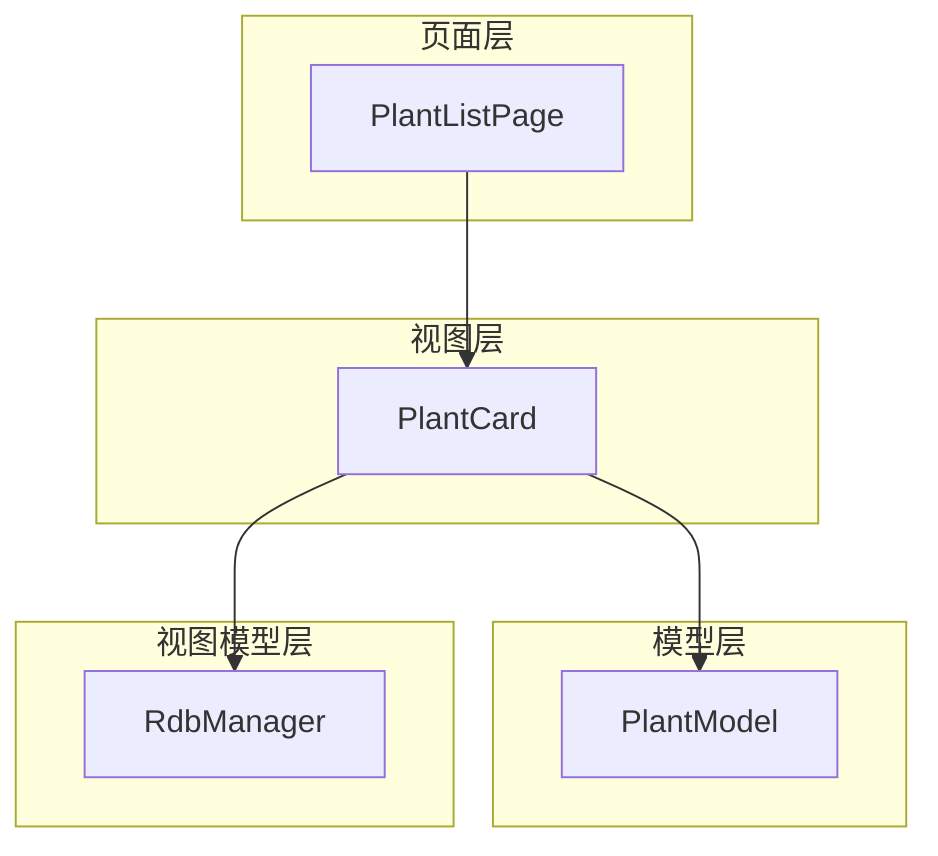
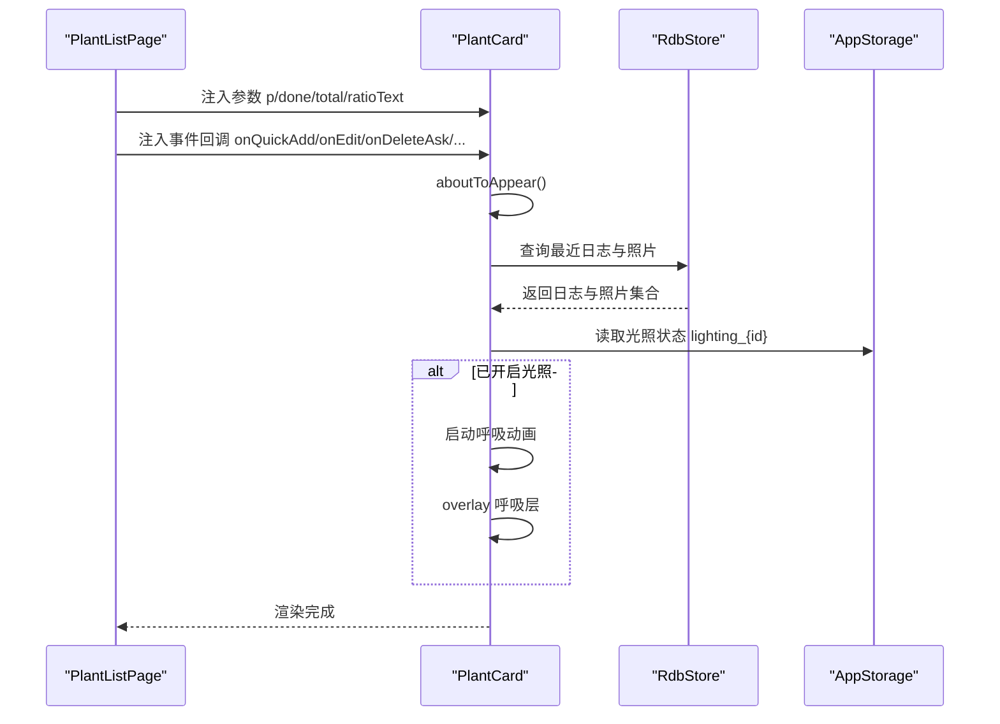
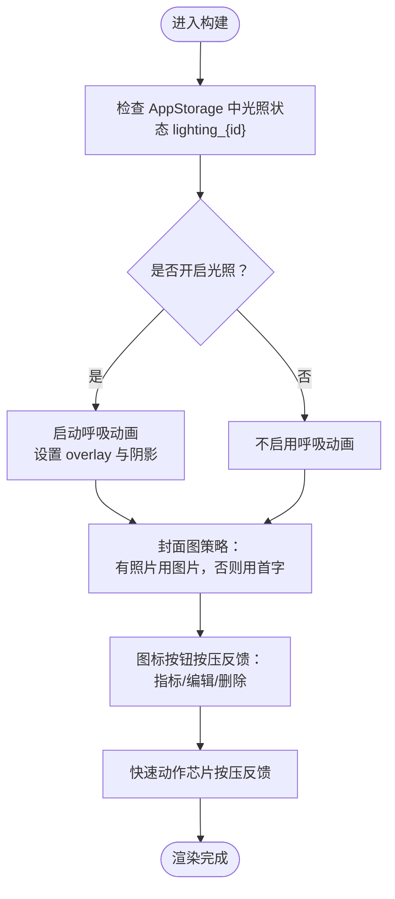
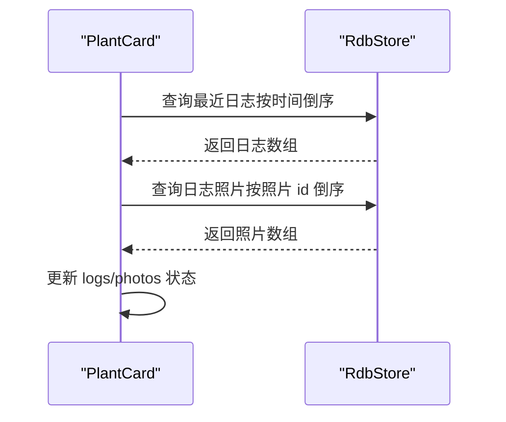
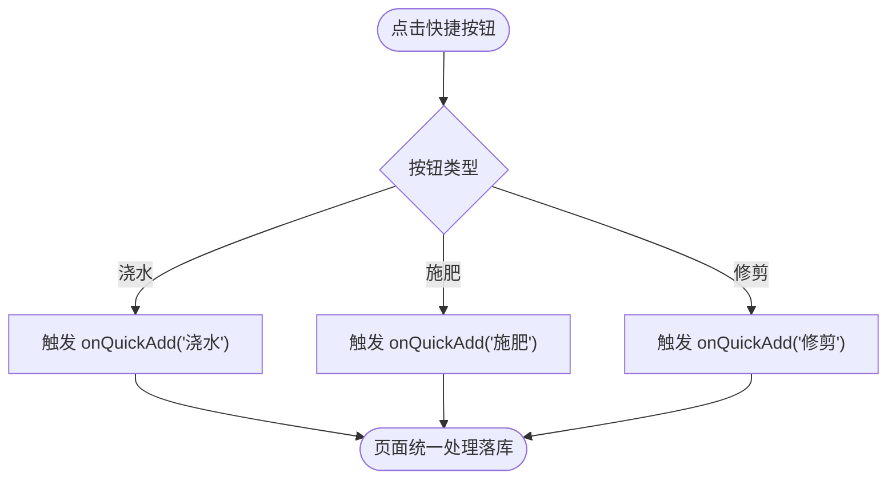
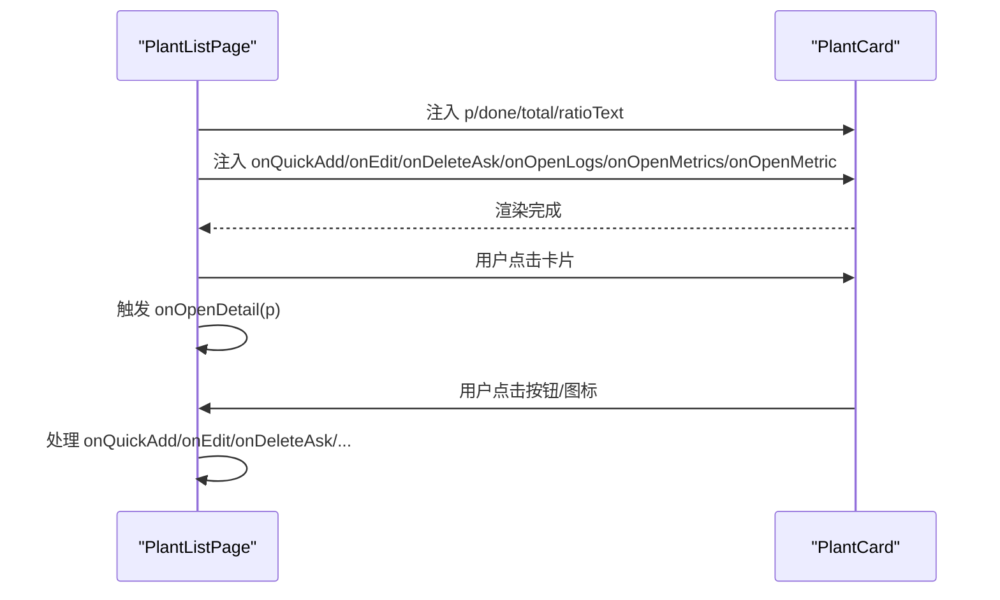
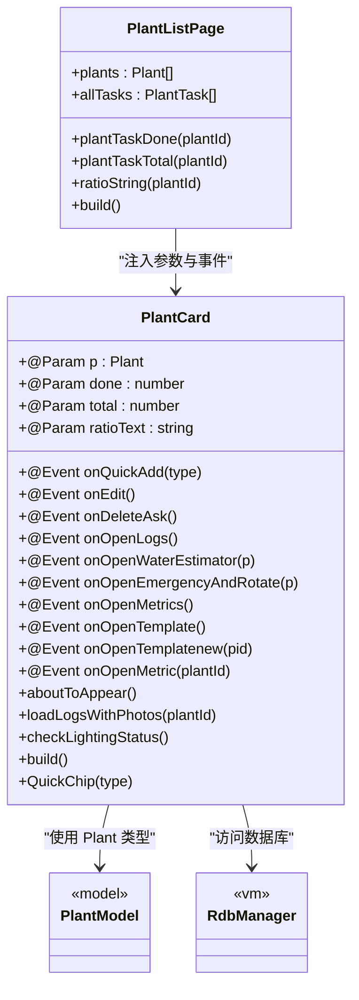

# 植物卡片组件 PlantCard

<cite>
**本文档引用的文件**
- [PlantCard.ets](file://entry/src/main/ets/view/PlantCard.ets)
- [PlantListPage.ets](file://entry/src/main/ets/pages/PlantListPage.ets)
- [PlantModel.ets](file://entry/src/main/ets/model/PlantModel.ets)
- [PlantLogPage.ets](file://entry/src/main/ets/pages/PlantLogPage.ets)
- [RdbManager.ets](file://entry/src/main/ets/viewmodel/RdbManager.ets)
</cite>

## 更新摘要
**变更内容**
- 新增图标按钮按压动画反馈系统（指标查看、编辑、删除）
- 扩展快速动作芯片组件，支持按压动画与触摸事件
- 增强整体交互体验，提供更丰富的视觉反馈
- 优化按压状态管理，支持多元素独立按压反馈

## 目录
1. [简介](#简介)
2. [项目结构](#项目结构)
3. [核心组件](#核心组件)
4. [架构总览](#架构总览)
5. [详细组件分析](#详细组件分析)
6. [依赖关系分析](#依赖关系分析)
7. [性能考量](#性能考量)
8. [故障排查指南](#故障排查指南)
9. [结论](#结论)
10. [附录](#附录)

## 简介
PlantCard 是一个用于展示植物信息、任务进度与快捷操作的复合型卡片组件。它既承担植物概览职责，也作为多个功能入口的聚合导航节点，支持光照状态的呼吸动画、阴影与按压反馈、日志照片封面、任务完成进度展示以及一键快速操作等能力。组件通过参数注入与事件回调的方式与宿主页面解耦，便于在植物列表等场景中复用。

**更新** 新版本增强了交互体验，新增图标按钮按压动画反馈和快速动作芯片组件，提供更丰富的视觉反馈和操作体验。

## 项目结构
PlantCard 位于应用的视图层，与页面、模型、视图模型共同协作：
- 视图层：PlantCard 组件负责 UI 构建与交互反馈
- 页面层：PlantListPage 负责数据聚合与事件转发
- 模型层：PlantModel 提供植物与日志等数据结构
- 视图模型层：RdbManager 提供数据库访问能力

**图表来源**
- [PlantCard.ets:1-326](file://entry/src/main/ets/view/PlantCard.ets#L1-L326)
- [PlantListPage.ets:1-228](file://entry/src/main/ets/pages/PlantListPage.ets#L1-L228)
- [PlantModel.ets:1-166](file://entry/src/main/ets/model/PlantModel.ets#L1-L166)
- [RdbManager.ets](file://entry/src/main/ets/viewmodel/RdbManager.ets)

**章节来源**
- [PlantCard.ets:1-326](file://entry/src/main/ets/view/PlantCard.ets#L1-L326)
- [PlantListPage.ets:1-228](file://entry/src/main/ets/pages/PlantListPage.ets#L1-L228)

## 核心组件
- 组件定位：植物卡片，承载植物头像/照片、名称、任务进度、快捷操作与功能入口
- 关键特性：
  - 任务进度条与完成率文本
  - 快速操作按钮（浇水/施肥/修剪）
  - 功能入口网格（日志、指标、模板、盆栽、用量估算器等）
  - 光照状态检测与呼吸动画叠加
  - **新增** 图标按钮按压动画反馈（指标查看、编辑、删除）
  - **新增** 快速动作芯片组件，支持按压动画与触摸事件
  - 按压反馈与图标交互动画
  - 日志照片封面与首字头像回退策略

**更新** 新增了图标按钮按压动画反馈系统和快速动作芯片组件，显著提升了交互体验。

**章节来源**
- [PlantCard.ets:113-326](file://entry/src/main/ets/view/PlantCard.ets#L113-L326)

## 架构总览
PlantCard 的运行时架构围绕"参数注入 + 事件回调 + 数据加载 + 视觉反馈"展开。页面层负责聚合任务统计与事件转发，组件内部负责 UI 构建与交互动画，并在出现时异步加载日志与照片数据以完善封面与状态。

**图表来源**
- [PlantCard.ets:35-111](file://entry/src/main/ets/view/PlantCard.ets#L35-L111)
- [PlantListPage.ets:157-178](file://entry/src/main/ets/pages/PlantListPage.ets#L157-L178)

## 详细组件分析

### 组件属性与事件
- 参数（@Param）：
  - p: 植物对象（Plant）
  - done: 该植物已完成的任务数
  - total: 该植物任务总数
  - ratioText: 完成率字符串（如"xx%"）
- 事件（@Event）：
  - onQuickAdd: 快速添加任务（type: string）
  - onEdit: 编辑植物
  - onDeleteAsk: 删除确认
  - onOpenLogs: 打开日志页面
  - onOpenWaterEstimator: 打开水量估算器
  - onOpenEmergencyAndRotate: 打开应急与转盆页面
  - onOpenMetrics: 打开指标页面
  - onOpenTemplate: 打开模板页面
  - onOpenTemplatenew: 打开新建模板页面
  - onOpenMetric: 打开指标详情（plantId）

**更新** 新增了 onOpenMetric 事件，用于打开植物指标详情页面。

这些参数与事件在页面层被注入到组件实例，组件仅负责展示与交互，具体落库与导航由页面处理。

**章节来源**
- [PlantCard.ets:53-72](file://entry/src/main/ets/view/PlantCard.ets#L53-L72)
- [PlantListPage.ets:157-178](file://entry/src/main/ets/pages/PlantListPage.ets#L157-L178)

### 视觉效果与交互
- 呼吸动画与光照状态：
  - 通过 AppStorage 读取光照状态 lighting_{id}，若为真则启动呼吸动画，叠加黄色半透明覆盖层并增加阴影
  - 呼吸动画采用无限往返播放，透明度在 0.3 与 1.0 间交替
- **新增** 图标按钮按压动画反馈：
  - 指标查看（📱）、编辑（✏️）、删除（🗏）三个图标按钮均支持按压缩放动画
  - 按压时触发 scale 缩放与触摸事件监听，动画持续时间 120ms
  - 每个图标维护独立的按压状态变量（metricPressed、editPressed、deletePressed）
- **新增** 快速动作芯片组件：
  - QuickChip 组件支持按压动画反馈，按压时触发动画但不改变状态
  - 按压动画持续时间 80ms，使用 EaseOut 曲线
  - 支持点击事件和触摸事件处理
- 按压反馈：
  - 整体卡片与功能图标均支持按压缩放与动画过渡
  - 图标按下时触发 scale 缩放与触摸事件监听
- 阴影与背景：
  - 卡片背景使用线性渐变与阴影增强立体感
  - 按压时轻微缩小以提供触觉反馈
- 封面图策略：
  - 优先使用日志中的第一张照片作为封面
  - 若无照片，则使用植物名首字的大号文字作为头像

**图表来源**
- [PlantCard.ets:42-64](file://entry/src/main/ets/view/PlantCard.ets#L42-L64)
- [PlantCard.ets:118-135](file://entry/src/main/ets/view/PlantCard.ets#L118-L135)
- [PlantCard.ets:154-197](file://entry/src/main/ets/view/PlantCard.ets#L154-L197)
- [PlantCard.ets:305-324](file://entry/src/main/ets/view/PlantCard.ets#L305-L324)

**章节来源**
- [PlantCard.ets:49-64](file://entry/src/main/ets/view/PlantCard.ets#L49-L64)
- [PlantCard.ets:118-135](file://entry/src/main/ets/view/PlantCard.ets#L118-L135)
- [PlantCard.ets:154-197](file://entry/src/main/ets/view/PlantCard.ets#L154-L197)
- [PlantCard.ets:305-324](file://entry/src/main/ets/view/PlantCard.ets#L305-L324)

### 数据加载机制
- 异步加载：
  - 在组件出现时，通过 RdbStore 查询最近日志与日志照片，填充 logs 与 photos 列表
  - 使用 SQL 查询保证数据一致性与性能
- 状态管理：
  - 通过 @Local 管理组件内部状态（pressed、logs、photos、isLighting、lightOpacity 等）
  - **新增** 图标按钮按压状态（metricPressed、editPressed、deletePressed）
  - 通过 AppStorage 与外部状态联动（光照状态、按压状态）

**图表来源**
- [PlantCard.ets:80-111](file://entry/src/main/ets/view/PlantCard.ets#L80-L111)

**章节来源**
- [PlantCard.ets:35-39](file://entry/src/main/ets/view/PlantCard.ets#L35-L39)
- [PlantCard.ets:80-111](file://entry/src/main/ets/view/PlantCard.ets#L80-L111)

### 任务进度与快捷操作
- 任务进度：
  - 使用线性进度条展示 done/total，颜色与背景可自定义
  - 右侧显示完成数与百分比文本
- **更新** 快速操作：
  - 提供"浇水/施肥/修剪"三类快捷按钮，点击后触发 onQuickAdd 回调
  - **新增** QuickChip 组件支持按压动画反馈
  - 按钮颜色根据类型区分，支持按压缩放与动画过渡

**图表来源**
- [PlantCard.ets:282-324](file://entry/src/main/ets/view/PlantCard.ets#L282-L324)

**章节来源**
- [PlantCard.ets:268-285](file://entry/src/main/ets/view/PlantCard.ets#L268-L285)
- [PlantCard.ets:282-324](file://entry/src/main/ets/view/PlantCard.ets#L282-L324)

### 功能入口网格
- 支持的功能入口：
  - 日志、指标、模板、新模板、盆栽、用量估算器
- 点击行为：
  - 每个入口对应一个 @Event 回调，页面负责导航与数据准备
- 样式：
  - 统一字号、内边距、圆角与背景色，支持点击与按压反馈

**章节来源**
- [PlantCard.ets:200-266](file://entry/src/main/ets/view/PlantCard.ets#L200-L266)

### 图标按钮交互系统
**新增** PlantCard 现在包含三个专门的图标按钮，提供更直观的操作入口：

- **指标查看（📱）**：
  - 触发 onOpenMetric 事件，打开植物指标详情页面
  - 支持按压动画反馈，按压时缩放 0.85 倍
  - 使用 120ms 动画时长，EaseInOut 曲线
- **编辑（✏️）**：
  - 触发 onEdit 事件，打开植物编辑页面
  - 支持独立的按压状态管理
  - 按压时缩放 0.85 倍
- **删除（🗏）**：
  - 触发 onDeleteAsk 事件，打开删除确认对话框
  - 支持独立的按压状态管理
  - 按压时缩放 0.85 倍

每个图标都维护独立的状态变量，确保按压反馈不会相互干扰。

**章节来源**
- [PlantCard.ets:154-197](file://entry/src/main/ets/view/PlantCard.ets#L154-L197)

### 组件在植物列表中的使用
- 页面层聚合任务统计：
  - 计算每个植物的 done/total/ratioText，避免每个卡片重复查询
- 组件实例化：
  - 通过 ForEach 渲染 PlantCard，注入参数与事件回调
  - **更新** 新增 onOpenMetric 事件回调
- 点击行为：
  - 列表项点击触发 onOpenDetail，卡片内图标与按钮通过事件回调与页面交互

**图表来源**
- [PlantListPage.ets:157-182](file://entry/src/main/ets/pages/PlantListPage.ets#L157-L182)
- [PlantCard.ets:113-326](file://entry/src/main/ets/view/PlantCard.ets#L113-L326)

**章节来源**
- [PlantListPage.ets:26-63](file://entry/src/main/ets/pages/PlantListPage.ets#L26-L63)
- [PlantListPage.ets:157-182](file://entry/src/main/ets/pages/PlantListPage.ets#L157-L182)

## 依赖关系分析
- 组件依赖：
  - PlantModel：使用 Plant 类型与日志相关接口
  - RdbManager：通过 RdbStore 访问数据库
  - AppStorage：读取光照状态 lighting_{id}
- 组件耦合：
  - 与页面通过 @Param/@Event 解耦，降低耦合度
  - 数据加载集中在组件内部，减少页面负担

**图表来源**
- [PlantCard.ets:1-326](file://entry/src/main/ets/view/PlantCard.ets#L1-L326)
- [PlantListPage.ets:1-228](file://entry/src/main/ets/pages/PlantListPage.ets#L1-L228)
- [PlantModel.ets:1-166](file://entry/src/main/ets/model/PlantModel.ets#L1-L166)
- [RdbManager.ets](file://entry/src/main/ets/viewmodel/RdbManager.ets)

**章节来源**
- [PlantCard.ets:1-326](file://entry/src/main/ets/view/PlantCard.ets#L1-L326)
- [PlantListPage.ets:1-228](file://entry/src/main/ets/pages/PlantListPage.ets#L1-L228)

## 性能考量
- 数据加载：
  - 在组件出现时进行一次性异步查询，避免在每次渲染中重复查询
  - 使用 SQL 查询并逐行遍历，减少内存占用
- 事件处理：
  - 事件回调在页面层集中处理，组件仅负责触发，降低渲染压力
- 动画与阴影：
  - 呼吸动画与按压反馈使用轻量动画，避免过度消耗资源
  - **新增** 图标按钮按压动画使用 80-120ms 短时动画，响应迅速
- 列表渲染：
  - 页面层预先计算任务统计，避免每个卡片重复计算
- **新增** 状态管理优化：
  - 图标按钮按压状态独立管理，避免不必要的重渲染
  - QuickChip 组件按压时仅触发动画，不改变状态变量

## 故障排查指南
- 无日志照片封面：
  - 检查数据库中是否存在日志照片记录，确认 querySql 返回结果
  - 确认 photos 数组非空后再使用图片路径
- 光照状态不生效：
  - 检查 AppStorage 中 lighting_{id} 是否正确设置
  - 确认组件在 aboutToAppear 中调用 checkLightingStatus
- 事件未触发：
  - 确认页面层是否正确注入事件回调
  - 检查组件内 onClick/onTouch 事件绑定是否正确
  - **新增** 检查图标按钮的按压状态变量是否正确更新
- 数据库连接失败：
  - 确认 RdbStore 实例可用，避免 store 为空导致查询失败
- **新增** 按压动画问题：
  - 检查按压状态变量（metricPressed、editPressed、deletePressed）是否正确初始化
  - 确认 onTouch 事件处理逻辑是否正确更新按压状态
  - 验证动画配置（duration、curve）是否符合预期

**章节来源**
- [PlantCard.ets:35-39](file://entry/src/main/ets/view/PlantCard.ets#L35-L39)
- [PlantCard.ets:80-111](file://entry/src/main/ets/view/PlantCard.ets#L80-L111)
- [PlantCard.ets:42-47](file://entry/src/main/ets/view/PlantCard.ets#L42-L47)
- [PlantCard.ets:154-197](file://entry/src/main/ets/view/PlantCard.ets#L154-L197)

## 结论
PlantCard 通过清晰的参数与事件设计，实现了植物信息展示、任务进度呈现与快捷操作入口的统一。其数据加载与光照动画增强了用户体验，同时与页面层解耦，便于在植物列表等场景中复用与扩展。

**更新** 新版本通过新增图标按钮按压动画反馈和快速动作芯片组件，显著提升了交互体验和操作效率。组件现在提供了更丰富、更直观的用户界面，支持多种交互方式，包括传统的按钮点击和现代的按压反馈。

建议在集成时关注事件回调的完整性与数据库查询的健壮性，同时充分利用新增的按压动画反馈功能，以提供更好的用户体验。

## 附录

### 使用示例与集成指南
- 在 PlantListPage 中渲染 PlantCard：
  - 计算每个植物的 done/total/ratioText
  - 注入 p、done、total、ratioText
  - 注入 onQuickAdd/onEdit/onDeleteAsk/onOpenLogs/onOpenMetrics/onOpenMetric 等事件
  - 为每个 PlantCard 提供独立的事件处理逻辑
- **新增** 在其他页面中复用：
  - 可直接引入 PlantCard 并注入相同参数与事件
  - 注意在宿主页面中实现事件回调的具体业务逻辑
  - 特别注意 onOpenMetric 事件的实现，用于打开植物指标详情页面

**章节来源**
- [PlantListPage.ets:157-178](file://entry/src/main/ets/pages/PlantListPage.ets#L157-L178)

### 样式定制与主题适配
- 背景色与渐变：
  - 卡片背景使用线性渐变与阴影，可通过调整颜色与半径适配主题
- 按钮与图标：
  - 快捷按钮颜色按类型区分，可在 typeColor 方法中统一调整
  - **新增** 图标按钮支持按压缩放动画，可在 scale 属性中调整按压程度
  - 图标按压缩放与动画时长可按需修改
- 光照状态：
  - 呼吸动画的颜色与透明度可通过 lightOpacity 与 BreathingOverlay 调整
- 阴影与边框：
  - 卡片阴影与边框颜色可按主题色系替换，确保在深浅色模式下可读性良好
- **新增** 按压动画定制：
  - 图标按钮按压动画时长可在 animation 配置中调整
  - QuickChip 按压动画时长和曲线可根据需求修改
  - 按压缩放比例可在 scale 属性中自定义

**章节来源**
- [PlantCard.ets:289-293](file://entry/src/main/ets/view/PlantCard.ets#L289-L293)
- [PlantCard.ets:66-77](file://entry/src/main/ets/view/PlantCard.ets#L66-L77)
- [PlantCard.ets:56-64](file://entry/src/main/ets/view/PlantCard.ets#L56-L64)
- [PlantCard.ets:154-197](file://entry/src/main/ets/view/PlantCard.ets#L154-L197)
- [PlantCard.ets:305-324](file://entry/src/main/ets/view/PlantCard.ets#L305-L324)