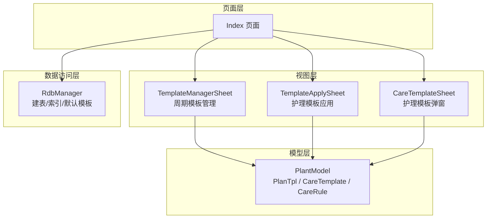
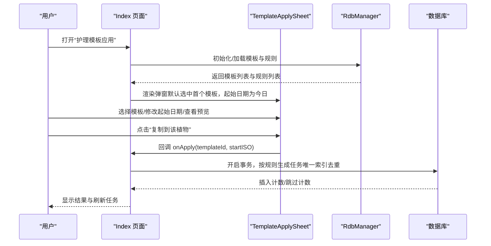
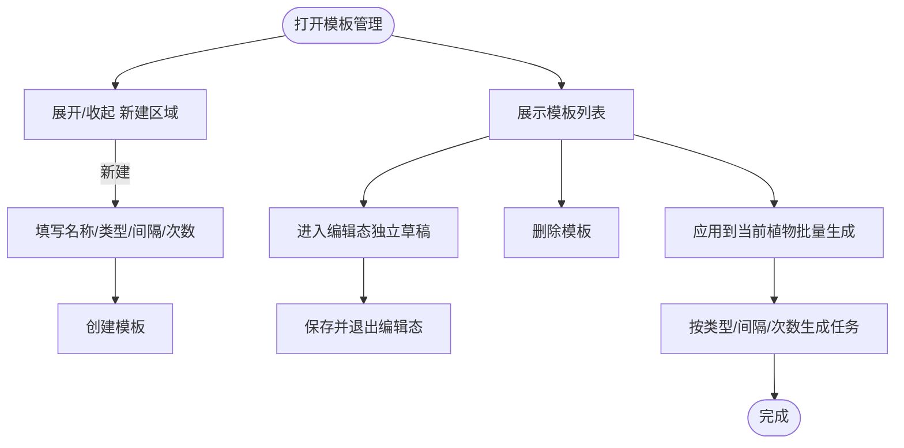
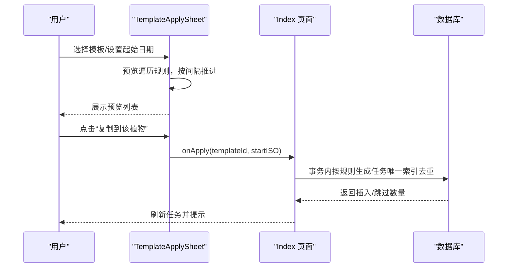
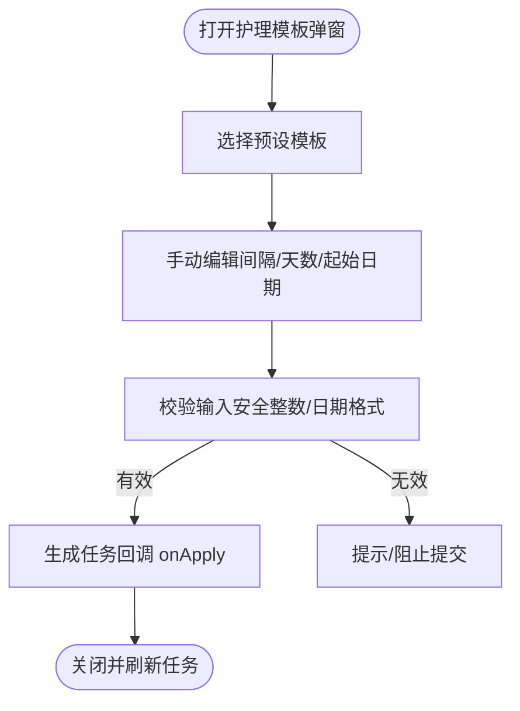
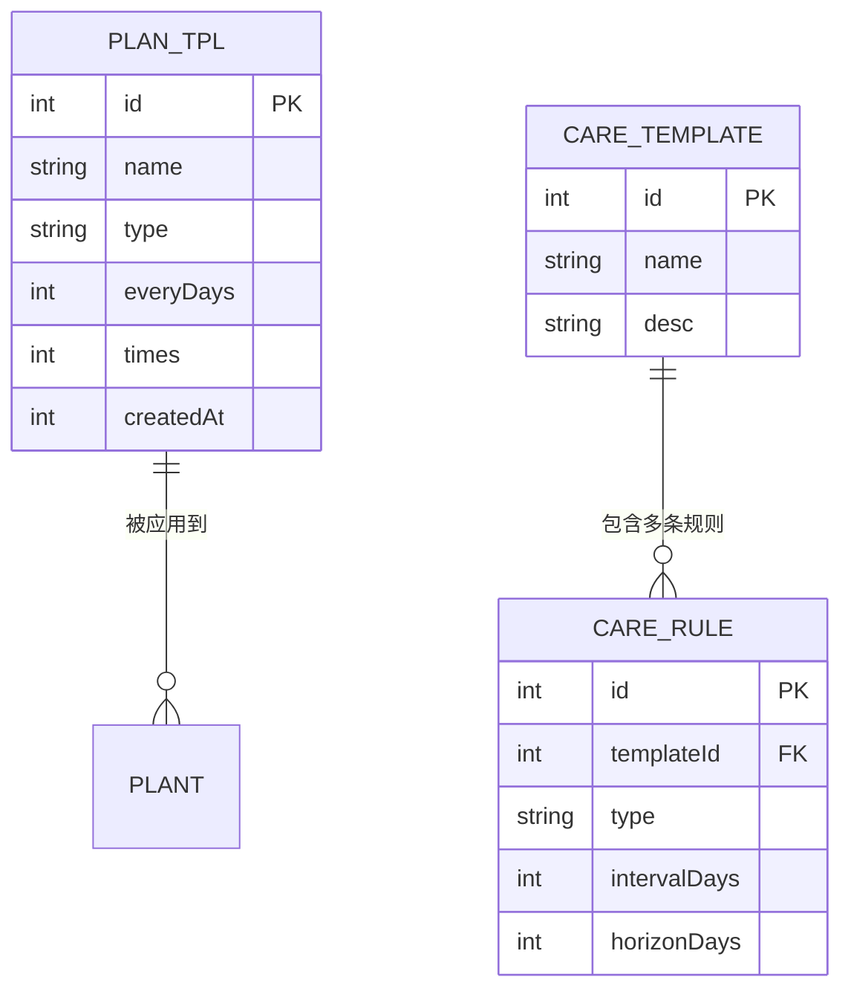
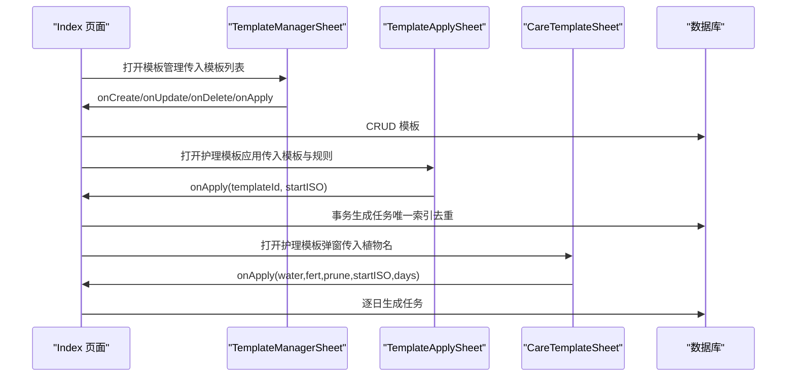

# 模板组件

<cite>
**本文引用的文件**
- [TemplateManagerSheet.ets](file://entry/src/main/ets/view/TemplateManagerSheet.ets)
- [TemplateApplySheet.ets](file://entry/src/main/ets/view/TemplateApplySheet.ets)
- [CareTemplateSheet.ets](file://entry/src/main/ets/view/CareTemplateSheet.ets)
- [PlantModel.ets](file://entry/src/main/ets/model/PlantModel.ets)
- [Index.ets](file://entry/src/main/ets/pages/Index.ets)
- [RdbManager.ets](file://entry/src/main/ets/viewmodel/RdbManager.ets)
</cite>

## 目录
1. [简介](#简介)
2. [项目结构](#项目结构)
3. [核心组件](#核心组件)
4. [架构总览](#架构总览)
5. [组件详解](#组件详解)
6. [依赖关系分析](#依赖关系分析)
7. [性能考量](#性能考量)
8. [故障排查指南](#故障排查指南)
9. [结论](#结论)
10. [附录](#附录)

## 简介
本文件系统性梳理 PlantDiary 应用中的模板相关组件，围绕以下三个弹窗组件展开：
- TemplateManagerSheet：周期模板管理弹窗（旧版 PlanTpl）
- TemplateApplySheet：护理模板应用弹窗（新版 CareTemplate + CareRule）
- CareTemplateSheet：护理模板弹窗（用于快速生成任务）

文档将从设计与实现、数据结构与存储、继承与版本管理、与植物信息的关联、批量应用流程、UI 与交互、以及在植物管理和任务生成中的应用场景等方面进行全面说明。

## 项目结构
模板组件位于页面层与视图层之间，通过事件回调与页面 ViewModel 协作完成数据加载、持久化与任务生成。数据库层面由 RdbManager 统一初始化与维护，包含两类模板体系：
- 旧版周期模板：PlanTpl（tpl 表）
- 新版护理模板：CareTemplate + CareRule（care_template 与 care_rule 表）

**图表来源**
- [Index.ets](file://entry/src/main/ets/pages/Index.ets)
- [TemplateManagerSheet.ets](file://entry/src/main/ets/view/TemplateManagerSheet.ets)
- [TemplateApplySheet.ets](file://entry/src/main/ets/view/TemplateApplySheet.ets)
- [CareTemplateSheet.ets](file://entry/src/main/ets/view/CareTemplateSheet.ets)
- [PlantModel.ets](file://entry/src/main/ets/model/PlantModel.ets)
- [RdbManager.ets](file://entry/src/main/ets/viewmodel/RdbManager.ets)

**章节来源**
- [Index.ets](file://entry/src/main/ets/pages/Index.ets)
- [RdbManager.ets](file://entry/src/main/ets/viewmodel/RdbManager.ets)

## 核心组件
- TemplateManagerSheet：支持新建、编辑、删除、应用旧版周期模板（PlanTpl），并与当前编辑植物绑定。
- TemplateApplySheet：基于新版护理模板（CareTemplate + CareRule）进行模板选择、起始日期调整、预览生成的任务清单，并最终应用到目标植物。
- CareTemplateSheet：面向快速生成任务的弹窗，输入浇水/施肥/修剪间隔与生成天数，触发任务生成。

这些组件均采用底部抽屉式弹层设计，具备蒙层点击关闭、预设模板、数值输入校验与安全转换等交互与健壮性保障。

**章节来源**
- [TemplateManagerSheet.ets](file://entry/src/main/ets/view/TemplateManagerSheet.ets)
- [TemplateApplySheet.ets](file://entry/src/main/ets/view/TemplateApplySheet.ets)
- [CareTemplateSheet.ets](file://entry/src/main/ets/view/CareTemplateSheet.ets)

## 架构总览
模板体系分为两套：
- 旧版：PlanTpl（模板名、类型、间隔天数、次数）+ 任务生成逻辑（批量生成）
- 新版：CareTemplate（模板主表）+ CareRule（规则：类型、间隔天数、生成范围天数）+ 预览与应用

Index 页面作为协调者，负责：
- 加载模板与规则数据
- 打开模板弹窗
- 执行模板应用（事务插入，唯一索引去重）
- 生成快速任务（按间隔与天数逐日生成）

**图表来源**
- [Index.ets](file://entry/src/main/ets/pages/Index.ets)
- [TemplateApplySheet.ets](file://entry/src/main/ets/view/TemplateApplySheet.ets)
- [RdbManager.ets](file://entry/src/main/ets/viewmodel/RdbManager.ets)

## 组件详解

### TemplateManagerSheet（周期模板管理弹窗）
- 功能
  - 新建：名称、类型、间隔天数、次数
  - 编辑：单项编辑态，独立草稿避免污染列表
  - 删除：删除模板
  - 应用：将模板应用到当前编辑植物（批量生成任务）
- 关键点
  - 使用 parsePosInt 对输入进行安全解析，保证正整数
  - 编辑态与展示态互斥，提升列表渲染稳定性
  - 与 PlantModel.PlanTpl 结构一致，兼容旧版任务生成逻辑

**图表来源**
- [TemplateManagerSheet.ets](file://entry/src/main/ets/view/TemplateManagerSheet.ets)
- [Index.ets](file://entry/src/main/ets/pages/Index.ets)

**章节来源**
- [TemplateManagerSheet.ets](file://entry/src/main/ets/view/TemplateManagerSheet.ets)
- [Index.ets](file://entry/src/main/ets/pages/Index.ets)

### TemplateApplySheet（护理模板应用弹窗）
- 功能
  - 选择模板（CareTemplate）
  - 修改起始日期（YYYY-MM-DD）
  - 预览：按 CareRule 生成未来若干天的任务清单
  - 应用：将模板规则应用到目标植物，生成任务（事务 + 去重）
- 关键点
  - 预览仅本地展开，不落库，便于用户确认
  - 预览算法：遍历规则，按模板 id 匹配，按间隔天数推进，排序输出
  - 应用时开启事务，逐条规则生成任务，利用唯一索引避免重复

**图表来源**
- [TemplateApplySheet.ets](file://entry/src/main/ets/view/TemplateApplySheet.ets)
- [Index.ets](file://entry/src/main/ets/pages/Index.ets)

**章节来源**
- [TemplateApplySheet.ets](file://entry/src/main/ets/view/TemplateApplySheet.ets)
- [Index.ets](file://entry/src/main/ets/pages/Index.ets)

### CareTemplateSheet（护理模板弹窗）
- 功能
  - 快速生成任务：输入浇水/施肥/修剪间隔（0 表示不生成）、起始日期、生成天数
  - 预设模板：内置常见植物类型的间隔组合
  - 应用：回调 onApply，触发任务生成
- 关键点
  - 输入校验：safeInt 将字符串转为非负整数
  - 日期格式：ISO（YYYY-MM-DD），默认今天
  - 交互：蒙层点击关闭、清空按钮一键置零

**图表来源**
- [CareTemplateSheet.ets](file://entry/src/main/ets/view/CareTemplateSheet.ets)
- [Index.ets](file://entry/src/main/ets/pages/Index.ets)

**章节来源**
- [CareTemplateSheet.ets](file://entry/src/main/ets/view/CareTemplateSheet.ets)
- [Index.ets](file://entry/src/main/ets/pages/Index.ets)

## 依赖关系分析
- 模板数据结构
  - 旧版：PlanTpl（id, name, type, everyDays, times, createdAt）
  - 新版：CareTemplate（id, name, desc）+ CareRule（id, templateId, type, intervalDays, horizonDays）
- 存储与索引
  - tpl 表：旧版周期模板
  - care_template 表：模板主表
  - care_rule 表：模板规则
  - 唯一索引：task(planDate, type, plantId) 保证任务不重复
- 默认模板
  - 启动时若为空库，插入多类植物的默认模板与规则

**图表来源**
- [PlantModel.ets](file://entry/src/main/ets/model/PlantModel.ets)
- [RdbManager.ets](file://entry/src/main/ets/viewmodel/RdbManager.ets)

**章节来源**
- [PlantModel.ets](file://entry/src/main/ets/model/PlantModel.ets)
- [RdbManager.ets](file://entry/src/main/ets/viewmodel/RdbManager.ets)

## 性能考量
- 预览生成
  - TemplateApplySheet 的预览仅在内存中展开，避免频繁 IO；当规则较多时建议限制预览天数或分页展示。
- 任务生成
  - Index 页面应用模板时使用事务，逐条规则生成任务；利用唯一索引去重，避免重复插入带来的失败与回滚成本。
- 输入校验
  - CareTemplateSheet 与 TemplateManagerSheet 均对输入进行安全转换，减少异常分支与重渲染。
- 列表渲染
  - TemplateManagerSheet 使用独立编辑草稿，避免列表项状态混乱导致的重绘。

[本节为通用性能建议，无需特定文件来源]

## 故障排查指南
- 模板应用无任务生成
  - 检查 CareRule 是否存在对应模板 id 的规则；确认起始日期格式是否为 ISO（YYYY-MM-DD）。
  - 确认数据库唯一索引是否生效，避免因重复而被跳过。
- 预览为空
  - 检查模板是否选择正确、起始日期是否合法、规则的 horizonDays 是否大于 0。
- 旧版模板无法应用
  - 确认当前编辑植物是否已保存（需要 plantId）；检查批量生成逻辑是否被调用。
- 输入异常
  - CareTemplateSheet 的间隔与天数应为非负整数；TemplateManagerSheet 的间隔与次数应为正整数。

**章节来源**
- [TemplateApplySheet.ets](file://entry/src/main/ets/view/TemplateApplySheet.ets)
- [TemplateManagerSheet.ets](file://entry/src/main/ets/view/TemplateManagerSheet.ets)
- [Index.ets](file://entry/src/main/ets/pages/Index.ets)

## 结论
PlantDiary 的模板体系通过两套模板与规则模型，分别满足快速任务生成与长期规范化管理的需求。TemplateManagerSheet、TemplateApplySheet 与 CareTemplateSheet 形成完整的模板生命周期闭环：创建/编辑/删除 → 预览 → 应用到植物 → 任务生成与去重。配合 RdbManager 的建表、索引与默认模板初始化，系统在可用性与性能之间取得平衡。

[本节为总结性内容，无需特定文件来源]

## 附录

### 数据流与控制流（代码级）

**图表来源**
- [Index.ets](file://entry/src/main/ets/pages/Index.ets)
- [TemplateManagerSheet.ets](file://entry/src/main/ets/view/TemplateManagerSheet.ets)
- [TemplateApplySheet.ets](file://entry/src/main/ets/view/TemplateApplySheet.ets)
- [CareTemplateSheet.ets](file://entry/src/main/ets/view/CareTemplateSheet.ets)