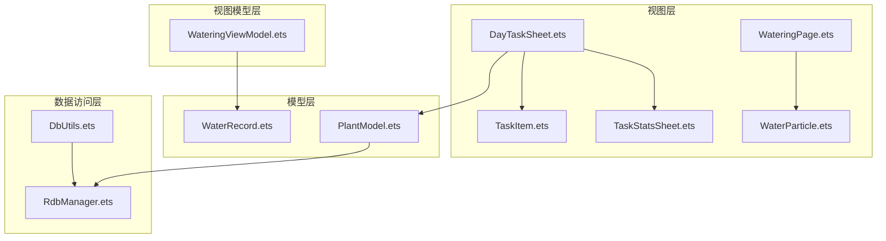
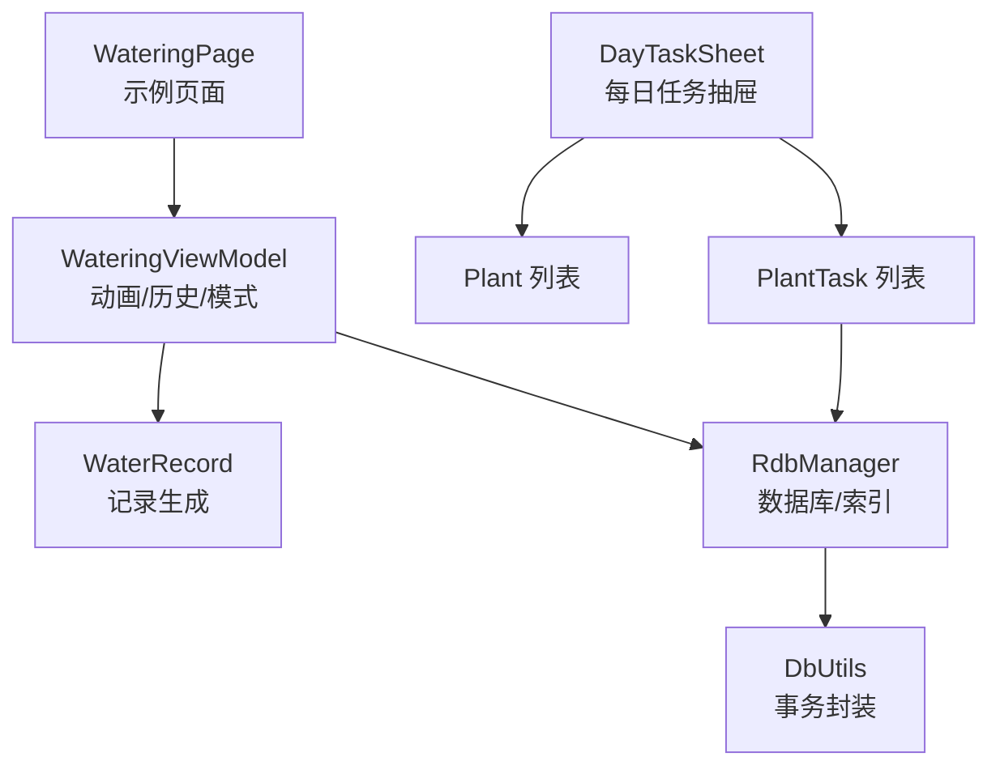
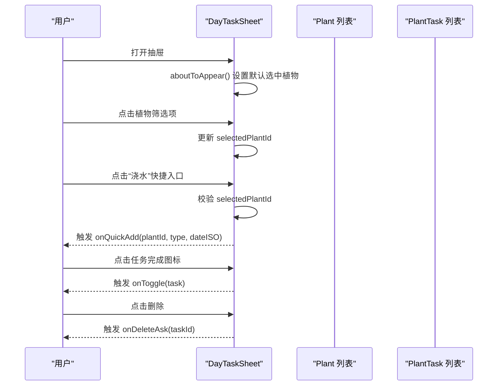
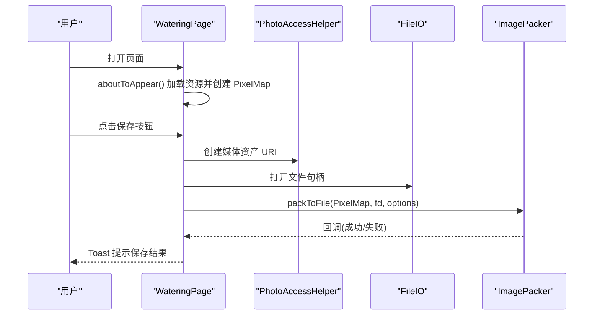
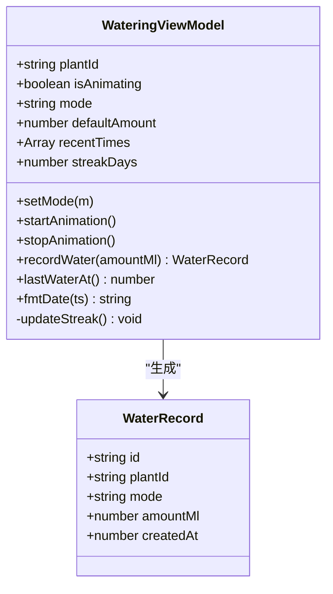
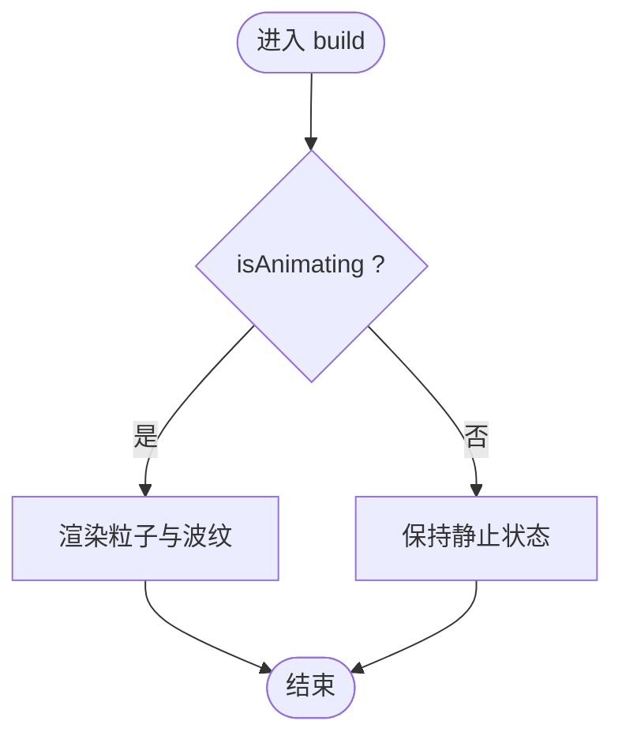
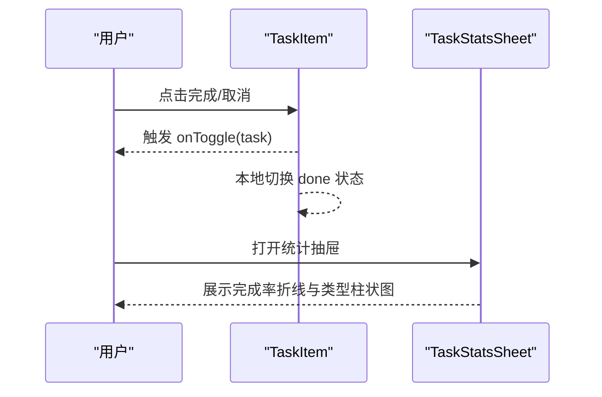
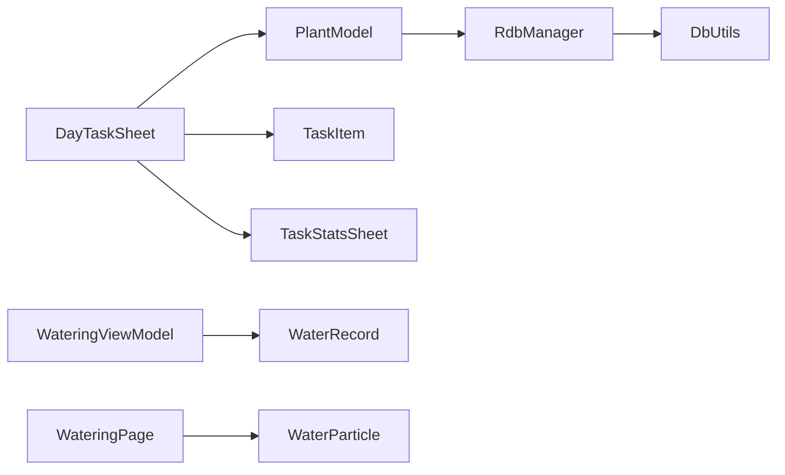

# 浇水组件

<cite>
**本文引用的文件**
- [DayTaskSheet.ets](file://entry/src/main/ets/view/DayTaskSheet.ets)
- [WateringPage.ets](file://entry/src/main/ets/pages/WateringPage.ets)
- [WateringViewModel.ets](file://entry/src/main/ets/viewmodel/WateringViewModel.ets)
- [WaterRecord.ets](file://entry/src/main/ets/model/WaterRecord.ets)
- [PlantModel.ets](file://entry/src/main/ets/model/PlantModel.ets)
- [RdbManager.ets](file://entry/src/main/ets/viewmodel/RdbManager.ets)
- [DbUtils.ets](file://entry/src/main/ets/model/DbUtils.ets)
- [WaterParticle.ets](file://entry/src/main/ets/component/WaterParticle.ets)
- [TaskItem.ets](file://entry/src/main/ets/view/TaskItem.ets)
- [TaskStatsSheet.ets](file://entry/src/main/ets/view/TaskStatsSheet.ets)
</cite>

## 目录
1. [简介](#简介)
2. [项目结构](#项目结构)
3. [核心组件](#核心组件)
4. [架构总览](#架构总览)
5. [详细组件分析](#详细组件分析)
6. [依赖分析](#依赖分析)
7. [性能考虑](#性能考虑)
8. [故障排查指南](#故障排查指南)
9. [结论](#结论)
10. [附录](#附录)

## 简介
本文件聚焦于“浇水”相关组件的设计与实现，涵盖以下内容：
- 每日任务弹窗 DayTaskSheet 的界面与交互、任务筛选与快速新建、完成状态切换与删除确认。
- 浇水页面 WateringPage 的功能定位与媒体保存示例。
- 浇水 ViewModel 与 WaterRecord 的数据模型、动画状态管理、历史记录与连击天数计算。
- 浇水组件与植物信息、任务系统、数据库的集成关系。
- 在日常养护流程中的应用场景与使用指南。

## 项目结构
围绕“浇水”的主要文件分布如下：
- 视图层：DayTaskSheet（每日任务抽屉）、WateringPage（示例页面）、WaterParticle（动画组件）
- 视图模型层：WateringViewModel（浇水状态与历史）
- 模型层：PlantModel（Plant、PlantTask 等）、WaterRecord（浇水记录）
- 数据访问层：RdbManager（数据库初始化与索引）、DbUtils（事务封装）

**图表来源**
- [DayTaskSheet.ets:1-228](file://entry/src/main/ets/view/DayTaskSheet.ets#L1-L228)
- [WateringPage.ets:1-78](file://entry/src/main/ets/pages/WateringPage.ets#L1-L78)
- [WateringViewModel.ets:1-102](file://entry/src/main/ets/viewmodel/WateringViewModel.ets#L1-L102)
- [WaterRecord.ets:1-18](file://entry/src/main/ets/model/WaterRecord.ets#L1-L18)
- [PlantModel.ets:1-166](file://entry/src/main/ets/model/PlantModel.ets#L1-L166)
- [RdbManager.ets:1-296](file://entry/src/main/ets/viewmodel/RdbManager.ets#L1-L296)
- [DbUtils.ets:1-22](file://entry/src/main/ets/model/DbUtils.ets#L1-L22)
- [WaterParticle.ets:1-61](file://entry/src/main/ets/component/WaterParticle.ets#L1-L61)
- [TaskItem.ets:1-67](file://entry/src/main/ets/view/TaskItem.ets#L1-L67)
- [TaskStatsSheet.ets:1-273](file://entry/src/main/ets/view/TaskStatsSheet.ets#L1-L273)

**章节来源**
- [DayTaskSheet.ets:1-228](file://entry/src/main/ets/view/DayTaskSheet.ets#L1-L228)
- [WateringPage.ets:1-78](file://entry/src/main/ets/pages/WateringPage.ets#L1-L78)
- [WateringViewModel.ets:1-102](file://entry/src/main/ets/viewmodel/WateringViewModel.ets#L1-L102)
- [WaterRecord.ets:1-18](file://entry/src/main/ets/model/WaterRecord.ets#L1-L18)
- [PlantModel.ets:1-166](file://entry/src/main/ets/model/PlantModel.ets#L1-L166)
- [RdbManager.ets:1-296](file://entry/src/main/ets/viewmodel/RdbManager.ets#L1-L296)
- [DbUtils.ets:1-22](file://entry/src/main/ets/model/DbUtils.ets#L1-L22)
- [WaterParticle.ets:1-61](file://entry/src/main/ets/component/WaterParticle.ets#L1-L61)
- [TaskItem.ets:1-67](file://entry/src/main/ets/view/TaskItem.ets#L1-L67)
- [TaskStatsSheet.ets:1-273](file://entry/src/main/ets/view/TaskStatsSheet.ets#L1-L273)

## 核心组件
- 每日任务弹窗 DayTaskSheet：承载当日任务列表、植物筛选、快速新建、完成状态切换与删除确认。
- 浇水页面 WateringPage：示例页面，演示将 PixelMap 保存到系统相册的流程（与“浇水动画/记录”解耦）。
- 浇水视图模型 WateringViewModel：管理动画状态、模式(light/deep)、默认水量、最近浇水时间与连击天数，并生成 WaterRecord。
- 浇水记录 WaterRecord：轻量实体，记录模式、用量与创建时间。
- 植物与任务模型 PlantModel：Plant、PlantTask 等，用于任务与植物信息的共享与展示。
- 数据库与事务 RdbManager、DbUtils：负责建表、索引、默认模板与事务封装。

**章节来源**
- [DayTaskSheet.ets:1-228](file://entry/src/main/ets/view/DayTaskSheet.ets#L1-L228)
- [WateringPage.ets:1-78](file://entry/src/main/ets/pages/WateringPage.ets#L1-L78)
- [WateringViewModel.ets:1-102](file://entry/src/main/ets/viewmodel/WateringViewModel.ets#L1-L102)
- [WaterRecord.ets:1-18](file://entry/src/main/ets/model/WaterRecord.ets#L1-L18)
- [PlantModel.ets:1-166](file://entry/src/main/ets/model/PlantModel.ets#L1-L166)
- [RdbManager.ets:1-296](file://entry/src/main/ets/viewmodel/RdbManager.ets#L1-L296)
- [DbUtils.ets:1-22](file://entry/src/main/ets/model/DbUtils.ets#L1-L22)

## 架构总览
浇水相关组件在应用中的位置与交互如下：

**图表来源**
- [DayTaskSheet.ets:1-228](file://entry/src/main/ets/view/DayTaskSheet.ets#L1-L228)
- [WateringPage.ets:1-78](file://entry/src/main/ets/pages/WateringPage.ets#L1-L78)
- [WateringViewModel.ets:1-102](file://entry/src/main/ets/viewmodel/WateringViewModel.ets#L1-L102)
- [WaterRecord.ets:1-18](file://entry/src/main/ets/model/WaterRecord.ets#L1-L18)
- [PlantModel.ets:1-166](file://entry/src/main/ets/model/PlantModel.ets#L1-L166)
- [RdbManager.ets:1-296](file://entry/src/main/ets/viewmodel/RdbManager.ets#L1-L296)
- [DbUtils.ets:1-22](file://entry/src/main/ets/model/DbUtils.ets#L1-L22)

## 详细组件分析

### 每日任务弹窗 DayTaskSheet
- 设计要点
  - 顶部显示日期与关闭按钮；底部抽屉式布局，支持蒙层点击关闭。
  - 植物筛选：根据当日出现的任务自动汇总植物 ID，点击切换选中植物。
  - 快速新建：在选中植物后，提供“浇水/施肥/修剪”快捷入口，触发 onQuickAdd 回调。
  - 任务列表：支持勾选完成与删除；完成状态通过 done 字段与 doneAt 时间记录。
- 关键交互
  - 选中植物后才允许快捷新建。
  - 点击完成图标切换任务完成状态，触发 onToggle 回调。
  - 删除按钮触发 onDeleteAsk 回调，提示确认删除。
- 数据来源
  - 输入参数包含 dateISO、tasks（当日 PlantTask 列表）、plants（Plant 列表）。
  - 通过 plantNameById 映射植物名称，typeColor 为不同类型任务设置颜色。

**图表来源**
- [DayTaskSheet.ets:1-228](file://entry/src/main/ets/view/DayTaskSheet.ets#L1-L228)
- [PlantModel.ets:1-166](file://entry/src/main/ets/model/PlantModel.ets#L1-L166)

**章节来源**
- [DayTaskSheet.ets:1-228](file://entry/src/main/ets/view/DayTaskSheet.ets#L1-L228)
- [PlantModel.ets:1-166](file://entry/src/main/ets/model/PlantModel.ets#L1-L166)

### 浇水页面 WateringPage
- 功能定位
  - 作为示例页面，演示如何将 PixelMap 保存到系统相册，包括申请媒体资产 URI、编码写入与提示。
  - 页面本身不直接参与“浇水动画/记录”的业务逻辑，但展示了媒体保存的完整流程。
- 使用建议
  - 将保存按钮事件与业务动作解耦，避免在 UI 层直接处理业务状态。
  - 如需集成“浇水动画”，可在页面中引入 WaterParticle 并绑定 WateringViewModel 的动画状态。

**图表来源**
- [WateringPage.ets:1-78](file://entry/src/main/ets/pages/WateringPage.ets#L1-L78)

**章节来源**
- [WateringPage.ets:1-78](file://entry/src/main/ets/pages/WateringPage.ets#L1-L78)

### 浇水视图模型 WateringViewModel 与 WaterRecord
- WateringViewModel
  - 状态管理：isAnimating、mode（light/deep）、defaultAmount。
  - 历史记录：recentTimes（最近 10 次时间戳，降序），streakDays（连击天数）。
  - 方法：recordWater(amountMl) 生成 WaterRecord 并更新历史与连击天数；lastWaterAt() 返回最近浇水时间；fmtDate() 格式化时间。
  - 连击天数算法：容忍跨天误差（最多 36 小时），按自然日判断连续性。
- WaterRecord
  - 轻量实体：包含 id、plantId、mode、amountMl、createdAt，构造时填充当前时间戳。

**图表来源**
- [WateringViewModel.ets:1-102](file://entry/src/main/ets/viewmodel/WateringViewModel.ets#L1-L102)
- [WaterRecord.ets:1-18](file://entry/src/main/ets/model/WaterRecord.ets#L1-L18)

**章节来源**
- [WateringViewModel.ets:1-102](file://entry/src/main/ets/viewmodel/WateringViewModel.ets#L1-L102)
- [WaterRecord.ets:1-18](file://entry/src/main/ets/model/WaterRecord.ets#L1-L18)

### 动画组件 WaterParticle
- 作用：以简单 UI 元素模拟“水滴粒子”和“波纹扩散”的视觉效果。
- 参数：isAnimating 控制动画开关，intensity 控制强度（1..3），onAnimationEnd 回调。
- 实现：Stack 层叠容器内包含粒子列与波纹列，通过 opacity 与 translate 实现基础动画位移与透明度变化。

**图表来源**
- [WaterParticle.ets:1-61](file://entry/src/main/ets/component/WaterParticle.ets#L1-L61)

**章节来源**
- [WaterParticle.ets:1-61](file://entry/src/main/ets/component/WaterParticle.ets#L1-L61)

### 任务系统与统计组件
- 任务项 TaskItem：展示任务类型与植物名、计划日期，支持勾选完成与删除操作；本地状态切换用于即时反馈，最终以父层刷新为准。
- 任务统计 TaskStatsSheet：提供完成率趋势与类型占比统计，支持时间范围（30/90/全部）切换。

**图表来源**
- [TaskItem.ets:1-67](file://entry/src/main/ets/view/TaskItem.ets#L1-L67)
- [TaskStatsSheet.ets:1-273](file://entry/src/main/ets/view/TaskStatsSheet.ets#L1-L273)

**章节来源**
- [TaskItem.ets:1-67](file://entry/src/main/ets/view/TaskItem.ets#L1-L67)
- [TaskStatsSheet.ets:1-273](file://entry/src/main/ets/view/TaskStatsSheet.ets#L1-L273)

## 依赖分析
- 组件耦合
  - DayTaskSheet 依赖 PlantModel（Plant、PlantTask）与 TaskItem、TaskStatsSheet。
  - WateringViewModel 依赖 WaterRecord，用于生成记录并维护历史。
  - WateringPage 与 WaterParticle 解耦，前者专注媒体保存流程，后者专注动画表现。
- 数据库与事务
  - RdbManager 负责建表、索引与默认模板注入；DbUtils 提供事务封装，保证批量写入一致性。
- 外部依赖
  - WateringPage 使用系统媒体能力进行图片保存；WaterParticle 使用 ArkUI 基础元素实现动画。

**图表来源**
- [DayTaskSheet.ets:1-228](file://entry/src/main/ets/view/DayTaskSheet.ets#L1-L228)
- [WateringViewModel.ets:1-102](file://entry/src/main/ets/viewmodel/WateringViewModel.ets#L1-L102)
- [WaterRecord.ets:1-18](file://entry/src/main/ets/model/WaterRecord.ets#L1-L18)
- [PlantModel.ets:1-166](file://entry/src/main/ets/model/PlantModel.ets#L1-L166)
- [RdbManager.ets:1-296](file://entry/src/main/ets/viewmodel/RdbManager.ets#L1-L296)
- [DbUtils.ets:1-22](file://entry/src/main/ets/model/DbUtils.ets#L1-L22)
- [WaterParticle.ets:1-61](file://entry/src/main/ets/component/WaterParticle.ets#L1-L61)
- [TaskItem.ets:1-67](file://entry/src/main/ets/view/TaskItem.ets#L1-L67)
- [TaskStatsSheet.ets:1-273](file://entry/src/main/ets/view/TaskStatsSheet.ets#L1-L273)

**章节来源**
- [RdbManager.ets:1-296](file://entry/src/main/ets/viewmodel/RdbManager.ets#L1-L296)
- [DbUtils.ets:1-22](file://entry/src/main/ets/model/DbUtils.ets#L1-L22)

## 性能考虑
- 列表渲染
  - DayTaskSheet 使用 List + ForEach 渲染任务项，注意 key 使用 PlantTask.id，避免重复渲染。
  - TaskItem 对完成状态使用局部动画与透明度过渡，减少重绘成本。
- 动画与状态
  - WaterParticle 通过 opacity 与 translate 实现基础动画，避免复杂物理计算；动画结束后通过回调通知上层。
  - WateringViewModel 的 recentTimes 限制长度为 10，降低内存占用与计算量。
- 数据库写入
  - 使用 DbUtils.runInTransaction 包裹批量写入，确保原子性与一致性，减少异常回滚成本。

[本节为通用指导，无需特定文件引用]

## 故障排查指南
- 保存图片失败
  - 检查 PhotoAccessHelper 创建资产与 FileIO 打开句柄的流程是否成功；关注回调错误码与消息。
  - 确认 ImagePacker 的格式与质量参数正确。
- 连击天数异常
  - 检查 recentTimes 是否按时间降序排列；确认跨天边界判断逻辑（容忍 36 小时误差）。
- 任务完成状态不同步
  - 确保 DayTaskSheet 与 TaskItem 的本地切换仅为即时反馈，最终以父层重新加载为准。
- 数据库初始化失败
  - 检查 RdbManager 初始化 SQL 与索引创建是否执行成功；确认权限与安全级别配置。

**章节来源**
- [WateringPage.ets:1-78](file://entry/src/main/ets/pages/WateringPage.ets#L1-L78)
- [WateringViewModel.ets:1-102](file://entry/src/main/ets/viewmodel/WateringViewModel.ets#L1-L102)
- [TaskItem.ets:1-67](file://entry/src/main/ets/view/TaskItem.ets#L1-L67)
- [RdbManager.ets:1-296](file://entry/src/main/ets/viewmodel/RdbManager.ets#L1-L296)

## 结论
- DayTaskSheet 提供了完整的“当日任务”可视化与交互入口，配合 Plant 与 PlantTask 模型实现任务筛选、快速新建与完成状态管理。
- WateringViewModel 与 WaterRecord 将“浇水记录”抽象为轻量实体，便于在页面或服务层决定持久化时机。
- WateringPage 作为媒体保存示例，展示了系统能力的正确使用方式；WaterParticle 则提供了可复用的动画组件。
- RdbManager 与 DbUtils 保障了任务与日志等数据的可靠存储与事务一致性。

[本节为总结，无需特定文件引用]

## 附录
- 功能扩展建议
  - 浇水页面：接入 WaterParticle 与 WateringViewModel，实现“点击开始动画 -> 记录 WaterRecord -> 更新数据库”的闭环。
  - 任务系统：在 DayTaskSheet 中增加“批量完成/删除”与“导出当日任务清单”等能力。
  - 统计增强：TaskStatsSheet 支持按植物维度聚合，或增加“浇水频次趋势”等图表。
- 自定义配置
  - WateringViewModel.defaultAmount 可按植物类型或用户偏好调整。
  - DayTaskSheet 的 typeColor 可扩展更多任务类型的颜色映射。
- 应用场景
  - 日常养护：打开 DayTaskSheet 查看当日任务，完成一项即记录一次 WaterRecord。
  - 周期回顾：使用 TaskStatsSheet 分析近 30/90 天的完成率与类型分布。
  - 成长记录：结合 PlantModel 与日志表，形成“任务-记录-指标”的闭环。

[本节为概念性内容，无需特定文件引用]