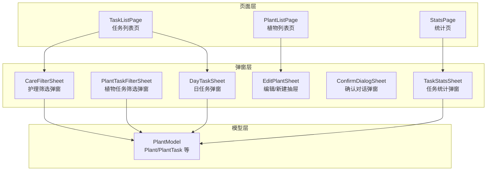
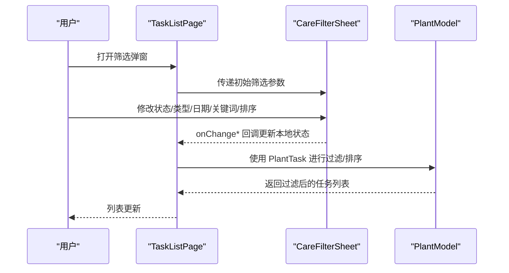
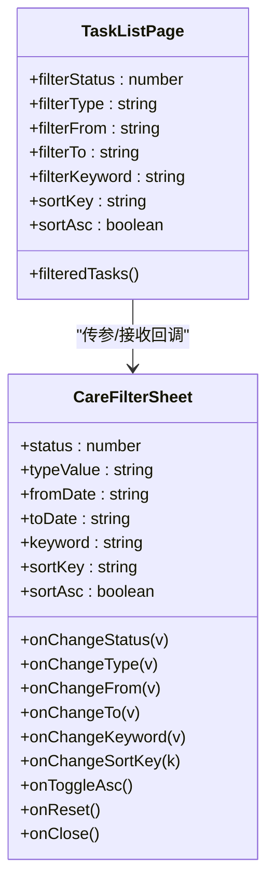
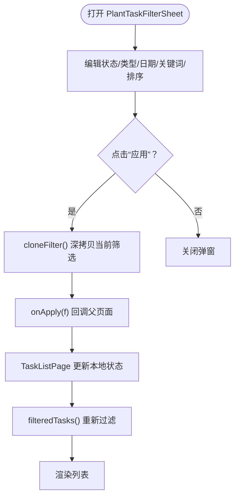
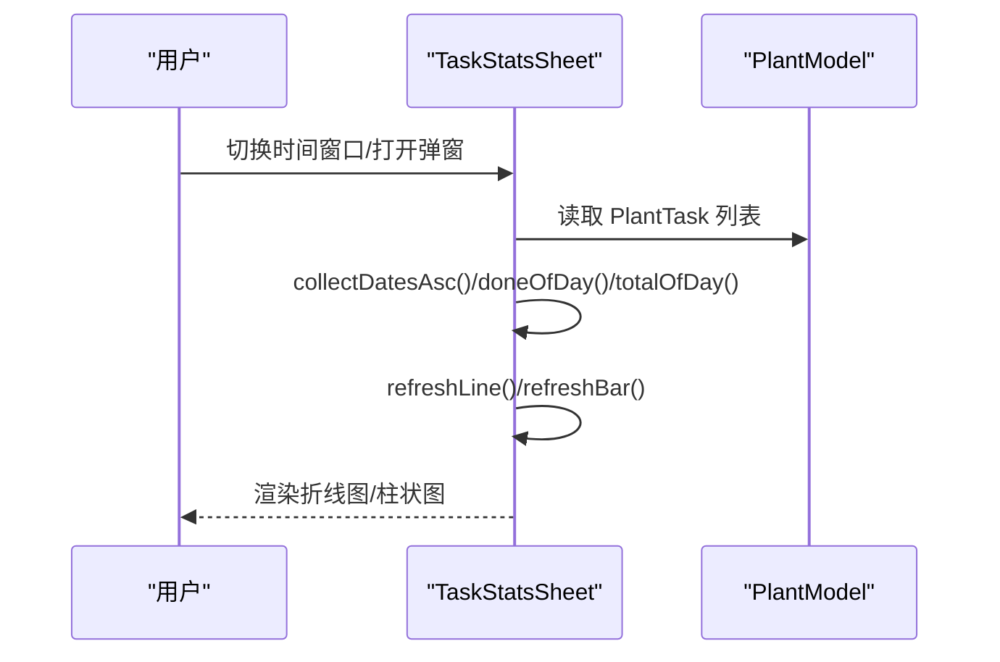
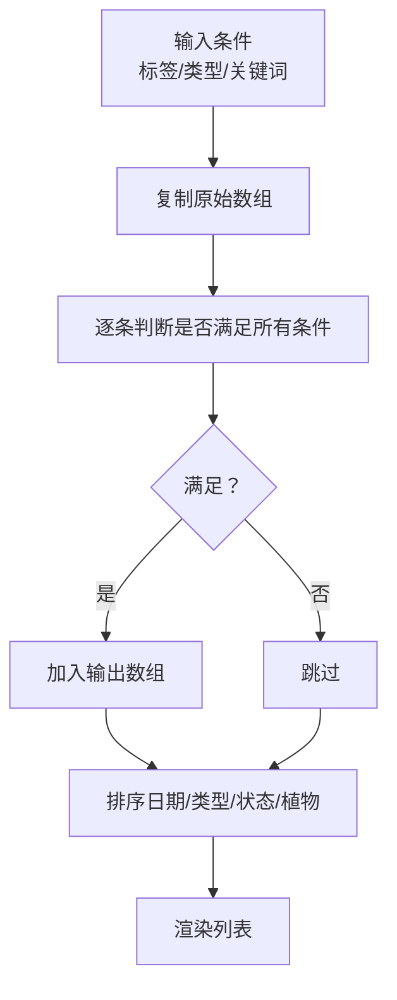
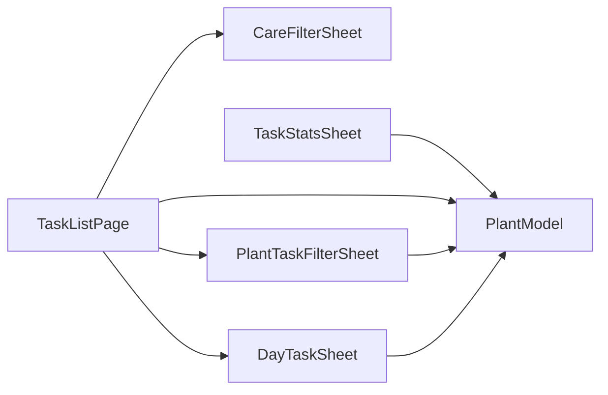

# 筛选组件

<cite>
**本文引用的文件**
- [CareFilterSheet.ets](file://entry/src/main/ets/view/CareFilterSheet.ets)
- [PlantTaskFilterSheet.ets](file://entry/src/main/ets/view/PlantTaskFilterSheet.ets)
- [TaskStatsSheet.ets](file://entry/src/main/ets/view/TaskStatsSheet.ets)
- [TaskListPage.ets](file://entry/src/main/ets/pages/TaskListPage.ets)
- [PlantListPage.ets](file://entry/src/main/ets/pages/PlantListPage.ets)
- [StatsPage.ets](file://entry/src/main/ets/pages/StatsPage.ets)
- [PlantModel.ets](file://entry/src/main/ets/model/PlantModel.ets)
- [TaskItem.ets](file://entry/src/main/ets/view/TaskItem.ets)
- [DayTaskSheet.ets](file://entry/src/main/ets/view/DayTaskSheet.ets)
- [ConfirmDialogSheet.ets](file://entry/src/main/ets/view/ConfirmDialogSheet.ets)
- [EditPlantSheet.ets](file://entry/src/main/ets/view/EditPlantSheet.ets)
</cite>

## 目录
1. [简介](#简介)
2. [项目结构](#项目结构)
3. [核心组件](#核心组件)
4. [架构总览](#架构总览)
5. [详细组件分析](#详细组件分析)
6. [依赖关系分析](#依赖关系分析)
7. [性能考量](#性能考量)
8. [故障排查指南](#故障排查指南)
9. [结论](#结论)
10. [附录](#附录)

## 简介
本文件系统性梳理并说明植物日记应用中的筛选与统计组件，重点覆盖：
- 护理筛选弹窗 CareFilterSheet
- 植物任务筛选弹窗 PlantTaskFilterSheet
- 任务统计弹窗 TaskStatsSheet

内容涵盖筛选条件设置、多条件组合与实时过滤、统计弹窗的数据汇总与图表展示、与数据查询的集成方式、性能优化策略、用户界面设计与交互体验优化，以及在数据浏览、任务管理与统计分析中的应用场景。

## 项目结构
筛选与统计相关代码主要分布在以下模块：
- 页面层：TaskListPage、PlantListPage、StatsPage
- 弹窗层：CareFilterSheet、PlantTaskFilterSheet、TaskStatsSheet、DayTaskSheet、ConfirmDialogSheet、EditPlantSheet
- 模型层：PlantModel（Plant、PlantTask 等）

**图表来源**
- [TaskListPage.ets:1-463](file://entry/src/main/ets/pages/TaskListPage.ets#L1-L463)
- [PlantListPage.ets:1-228](file://entry/src/main/ets/pages/PlantListPage.ets#L1-L228)
- [StatsPage.ets:1-442](file://entry/src/main/ets/pages/StatsPage.ets#L1-L442)
- [CareFilterSheet.ets:1-212](file://entry/src/main/ets/view/CareFilterSheet.ets#L1-L212)
- [PlantTaskFilterSheet.ets:1-374](file://entry/src/main/ets/view/PlantTaskFilterSheet.ets#L1-L374)
- [TaskStatsSheet.ets:1-273](file://entry/src/main/ets/view/TaskStatsSheet.ets#L1-L273)
- [DayTaskSheet.ets:1-228](file://entry/src/main/ets/view/DayTaskSheet.ets#L1-L228)
- [ConfirmDialogSheet.ets:1-103](file://entry/src/main/ets/view/ConfirmDialogSheet.ets#L1-L103)
- [EditPlantSheet.ets:1-264](file://entry/src/main/ets/view/EditPlantSheet.ets#L1-L264)
- [PlantModel.ets:1-166](file://entry/src/main/ets/model/PlantModel.ets#L1-L166)

**章节来源**
- [TaskListPage.ets:1-463](file://entry/src/main/ets/pages/TaskListPage.ets#L1-L463)
- [PlantListPage.ets:1-228](file://entry/src/main/ets/pages/PlantListPage.ets#L1-L228)
- [StatsPage.ets:1-442](file://entry/src/main/ets/pages/StatsPage.ets#L1-L442)
- [CareFilterSheet.ets:1-212](file://entry/src/main/ets/view/CareFilterSheet.ets#L1-L212)
- [PlantTaskFilterSheet.ets:1-374](file://entry/src/main/ets/view/PlantTaskFilterSheet.ets#L1-L374)
- [TaskStatsSheet.ets:1-273](file://entry/src/main/ets/view/TaskStatsSheet.ets#L1-L273)
- [DayTaskSheet.ets:1-228](file://entry/src/main/ets/view/DayTaskSheet.ets#L1-L228)
- [ConfirmDialogSheet.ets:1-103](file://entry/src/main/ets/view/ConfirmDialogSheet.ets#L1-L103)
- [EditPlantSheet.ets:1-264](file://entry/src/main/ets/view/EditPlantSheet.ets#L1-L264)
- [PlantModel.ets:1-166](file://entry/src/main/ets/model/PlantModel.ets#L1-L166)

## 核心组件
- 护理筛选弹窗 CareFilterSheet：面向任务列表页的快速筛选与排序，支持状态、类型、日期范围、关键词与排序键/方向的组合。
- 植物任务筛选弹窗 PlantTaskFilterSheet：面向植物任务的完整筛选与排序，支持状态、类型开关、日期范围、关键词、排序键/方向，并提供“应用/重置/关闭”操作。
- 任务统计弹窗 TaskStatsSheet：对任务进行聚合统计，展示完成率趋势与类型占比，支持时间窗口切换（近30天/近90天/全部）。

**章节来源**
- [CareFilterSheet.ets:1-212](file://entry/src/main/ets/view/CareFilterSheet.ets#L1-L212)
- [PlantTaskFilterSheet.ets:1-374](file://entry/src/main/ets/view/PlantTaskFilterSheet.ets#L1-L374)
- [TaskStatsSheet.ets:1-273](file://entry/src/main/ets/view/TaskStatsSheet.ets#L1-L273)

## 架构总览
筛选与统计组件通过页面层的本地状态驱动弹窗，弹窗通过事件回调更新页面状态，页面再对数据进行过滤与排序，最终渲染到列表或图表。

**图表来源**
- [TaskListPage.ets:271-314](file://entry/src/main/ets/pages/TaskListPage.ets#L271-L314)
- [CareFilterSheet.ets:20-178](file://entry/src/main/ets/view/CareFilterSheet.ets#L20-L178)
- [PlantModel.ets:43-59](file://entry/src/main/ets/model/PlantModel.ets#L43-L59)

## 详细组件分析

### 护理筛选弹窗 CareFilterSheet
- 功能要点
  - 状态筛选：全部/未完成/已完成
  - 类型筛选：全部/浇水/施肥/修剪
  - 日期范围：起始与结束（YYYY-MM-DD）
  - 关键词：类型/植物名
  - 排序：日期/类型/状态/植物，升序/降序
  - 提供“重置”与“关闭”操作
- 交互与样式
  - 抽屉式弹窗，蒙层点击关闭
  - 使用 Chip 与 TextInput 组合，视觉清晰
  - 支持实时变更并通过事件回调通知父页面
- 与页面集成
  - TaskListPage 作为父页面，通过 props 传入初始值，通过 onChange* 回调更新本地状态，再触发 filteredTasks 的重新计算与渲染

**图表来源**
- [TaskListPage.ets:16-314](file://entry/src/main/ets/pages/TaskListPage.ets#L16-L314)
- [CareFilterSheet.ets:2-18](file://entry/src/main/ets/view/CareFilterSheet.ets#L2-L18)

**章节来源**
- [CareFilterSheet.ets:1-212](file://entry/src/main/ets/view/CareFilterSheet.ets#L1-L212)
- [TaskListPage.ets:271-314](file://entry/src/main/ets/pages/TaskListPage.ets#L271-L314)

### 植物任务筛选弹窗 PlantTaskFilterSheet
- 功能要点
  - 状态：全部/未完成/已完成
  - 类型：浇水/施肥/修剪（开关）
  - 日期范围：起始/结束（YYYY-MM-DD），支持“今天/清空”
  - 关键词：匹配“植物名/类型”
  - 排序：按日期/类型/植物，升序/降序
  - 提供“应用/重置/关闭”操作
- 交互与样式
  - ObservedV2 状态管理，内部 filter 对象响应式变化
  - 提供工具函数：todayISO、typeOn/toggleType、typeColor、cloneFilter
  - 应用按钮克隆当前 filter 并通过 onApply 回调返回给父页面
- 与页面集成
  - TaskListPage 通过 PlantTaskFilterSheet 的 onApply 接收筛选结果，统一更新本地状态并触发重新过滤

**图表来源**
- [PlantTaskFilterSheet.ets:16-374](file://entry/src/main/ets/view/PlantTaskFilterSheet.ets#L16-L374)
- [TaskListPage.ets:271-314](file://entry/src/main/ets/pages/TaskListPage.ets#L271-L314)

**章节来源**
- [PlantTaskFilterSheet.ets:1-374](file://entry/src/main/ets/view/PlantTaskFilterSheet.ets#L1-L374)
- [TaskListPage.ets:271-314](file://entry/src/main/ets/pages/TaskListPage.ets#L271-L314)

### 任务统计弹窗 TaskStatsSheet
- 功能要点
  - 完成率趋势：按日期聚合完成率（折线图）
  - 类型占比：按类型统计次数（柱状图）
  - 时间窗口：近30天/近90天/全部
- 数据聚合算法
  - 日期序列：收集计划日期并按升序排列；若选择近N天，则生成最近N天序列
  - 完成率：对每一天统计完成数/总数，计算百分比
  - 类型占比：在选定区间内统计各类任务次数
- 图表配置
  - 使用 mccharts 的 Options 配置标题、坐标轴、网格、提示、系列等
  - 通过 refreshAll/refreshLine/refreshBar 刷新图表数据

**图表来源**
- [TaskStatsSheet.ets:48-189](file://entry/src/main/ets/view/TaskStatsSheet.ets#L48-L189)
- [PlantModel.ets:43-59](file://entry/src/main/ets/model/PlantModel.ets#L43-L59)

**章节来源**
- [TaskStatsSheet.ets:1-273](file://entry/src/main/ets/view/TaskStatsSheet.ets#L1-L273)
- [PlantModel.ets:43-59](file://entry/src/main/ets/model/PlantModel.ets#L43-L59)

### 与数据查询的集成与过滤流程
- 任务列表页 TaskListPage
  - 顶部标签：全部/今天/将来/已完成
  - 类型芯片：动态聚合任务类型
  - 关键词：匹配植物名与任务类型
  - 过滤与排序：filteredTasks() 统一串联多个维度，最后按日期与 id 排序
- 植物列表页 PlantListPage
  - 物种筛选与排序：先过滤再排序，最终渲染列表
- 日任务弹窗 DayTaskSheet
  - 基于所选日期筛选 PlantTask，支持快速添加与删除

**图表来源**
- [TaskListPage.ets:135-162](file://entry/src/main/ets/pages/TaskListPage.ets#L135-L162)
- [PlantListPage.ets:93-114](file://entry/src/main/ets/pages/PlantListPage.ets#L93-L114)

**章节来源**
- [TaskListPage.ets:135-162](file://entry/src/main/ets/pages/TaskListPage.ets#L135-L162)
- [PlantListPage.ets:93-114](file://entry/src/main/ets/pages/PlantListPage.ets#L93-L114)
- [DayTaskSheet.ets:35-57](file://entry/src/main/ets/view/DayTaskSheet.ets#L35-L57)

## 依赖关系分析
- 组件耦合
  - TaskListPage 与 CareFilterSheet/PlantTaskFilterSheet/DayTaskSheet 通过事件回调解耦
  - TaskStatsSheet 与 PlantModel 解耦，仅消费 PlantTask 数据
- 外部依赖
  - 图表库 mccharts：Options 配置与图表渲染
  - PlantModel：Plant/PlantTask 数据结构

**图表来源**
- [TaskListPage.ets:271-314](file://entry/src/main/ets/pages/TaskListPage.ets#L271-L314)
- [PlantTaskFilterSheet.ets:16-374](file://entry/src/main/ets/view/PlantTaskFilterSheet.ets#L16-L374)
- [TaskStatsSheet.ets:1-273](file://entry/src/main/ets/view/TaskStatsSheet.ets#L1-L273)
- [PlantModel.ets:43-59](file://entry/src/main/ets/model/PlantModel.ets#L43-L59)

**章节来源**
- [TaskListPage.ets:271-314](file://entry/src/main/ets/pages/TaskListPage.ets#L271-L314)
- [PlantTaskFilterSheet.ets:16-374](file://entry/src/main/ets/view/PlantTaskFilterSheet.ets#L16-L374)
- [TaskStatsSheet.ets:1-273](file://entry/src/main/ets/view/TaskStatsSheet.ets#L1-L273)
- [PlantModel.ets:43-59](file://entry/src/main/ets/model/PlantModel.ets#L43-L59)

## 性能考量
- 过滤与排序
  - 在 TaskListPage 中，filteredTasks() 先复制数组再过滤与排序，避免直接修改原数组
  - 排序使用 ISO 字符串比较日期，减少额外转换成本
- 图表渲染
  - TaskStatsSheet 在 aboutToAppear/刷新时才重新聚合数据，避免在渲染过程中重复计算
  - 使用 Options 缓存配置，仅更新数据部分
- 交互反馈
  - 弹窗内部状态即时更新，父页面统一刷新，减少不必要的重渲染
- 建议
  - 对高频过滤场景可考虑建立索引或缓存中间结果
  - 图表数据量较大时，可采用分页或采样策略

**章节来源**
- [TaskListPage.ets:135-162](file://entry/src/main/ets/pages/TaskListPage.ets#L135-L162)
- [TaskStatsSheet.ets:48-189](file://entry/src/main/ets/view/TaskStatsSheet.ets#L48-L189)

## 故障排查指南
- 筛选条件无效
  - 检查父页面是否正确接收并应用 onChange* 回调
  - 确认 filteredTasks() 的过滤逻辑是否覆盖所有条件
- 日期格式问题
  - CareFilterSheet 与 PlantTaskFilterSheet 均使用 YYYY-MM-DD 格式，确保输入与比较一致
- 图表数据异常
  - 检查 collectDatesAsc 是否正确生成日期序列
  - 确认 doneOfDay/totalOfDay 的边界条件（空数据、跨区间）
- 交互卡顿
  - 避免在渲染过程中执行复杂计算，将计算移至非 Builder 方法
  - 控制列表渲染数量，必要时启用虚拟列表

**章节来源**
- [CareFilterSheet.ets:93-127](file://entry/src/main/ets/view/CareFilterSheet.ets#L93-L127)
- [PlantTaskFilterSheet.ets:88-115](file://entry/src/main/ets/view/PlantTaskFilterSheet.ets#L88-L115)
- [TaskStatsSheet.ets:84-184](file://entry/src/main/ets/view/TaskStatsSheet.ets#L84-L184)

## 结论
- CareFilterSheet 与 PlantTaskFilterSheet 提供了灵活的筛选与排序能力，结合 TaskListPage 的统一过滤逻辑，实现了高效的数据浏览体验
- TaskStatsSheet 通过完成率趋势与类型占比，帮助用户进行统计分析
- 组件间通过事件回调解耦，数据流清晰，便于扩展与维护
- 建议持续关注性能与交互体验，针对大数据量场景进一步优化

## 附录
- 应用场景
  - 数据浏览：通过标签/类型/关键词快速定位任务
  - 任务管理：按日期/类型/植物排序，提升执行效率
  - 统计分析：通过时间窗口切换与图表可视化，洞察完成情况与偏好分布