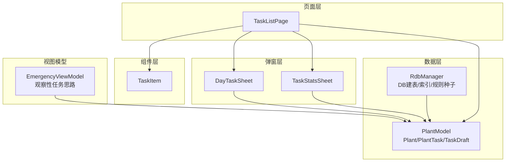
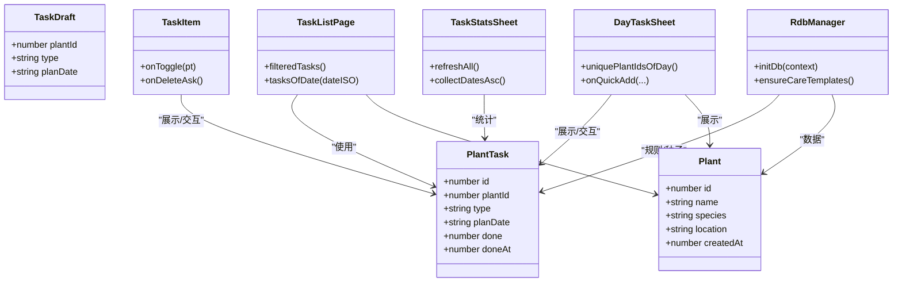
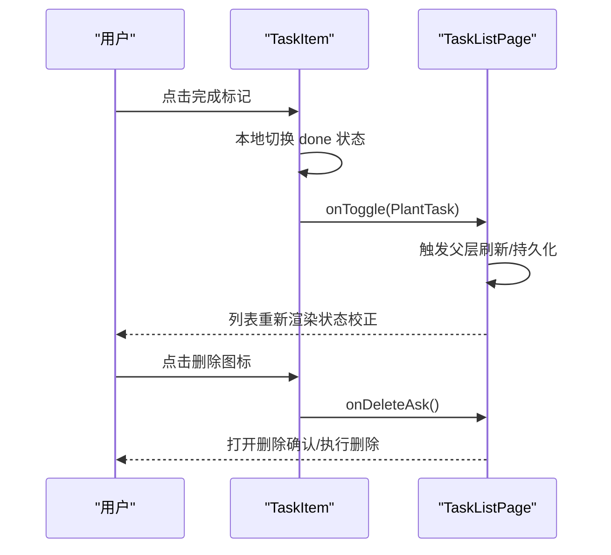
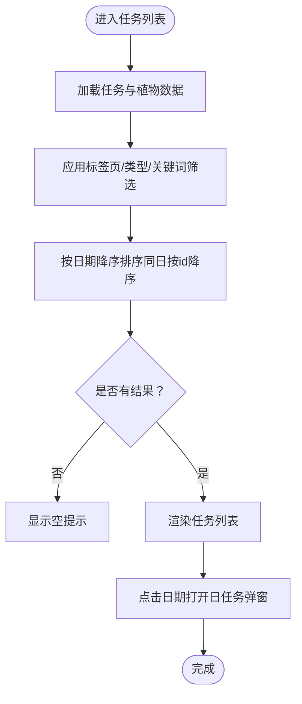
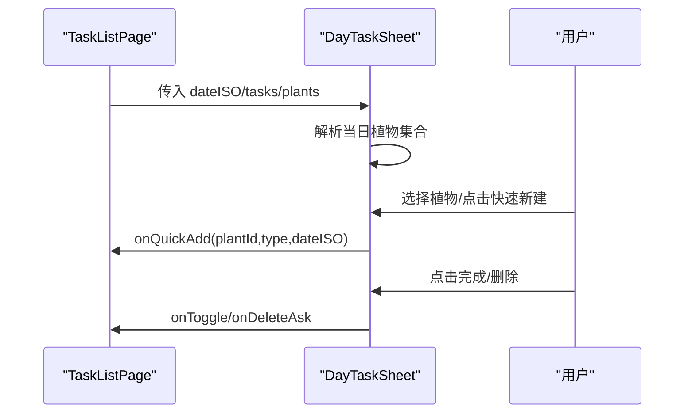
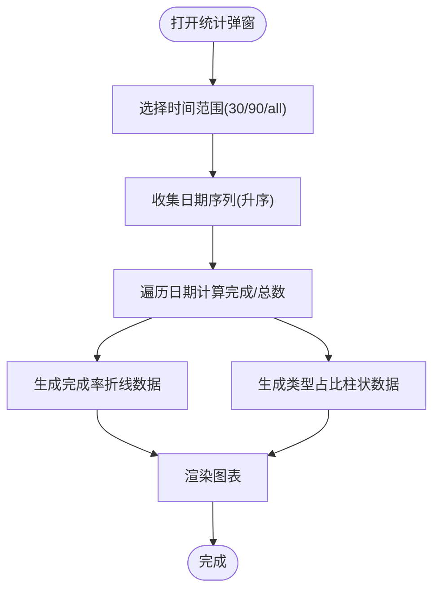
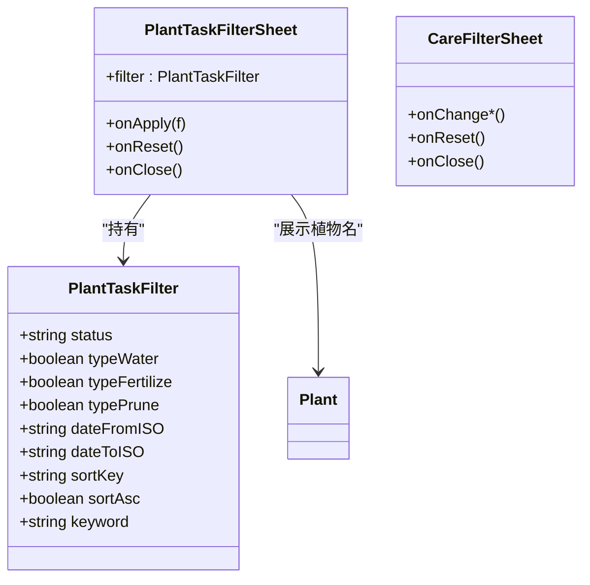
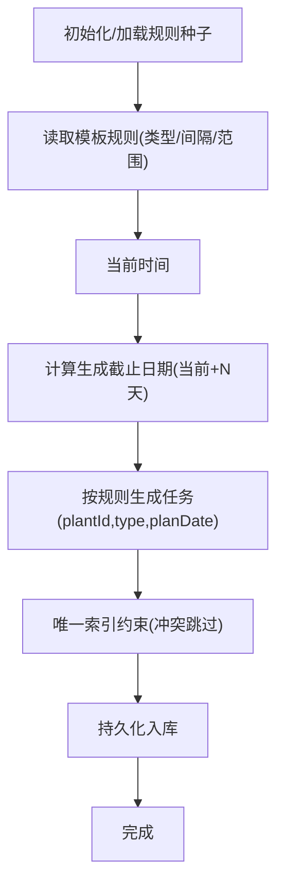
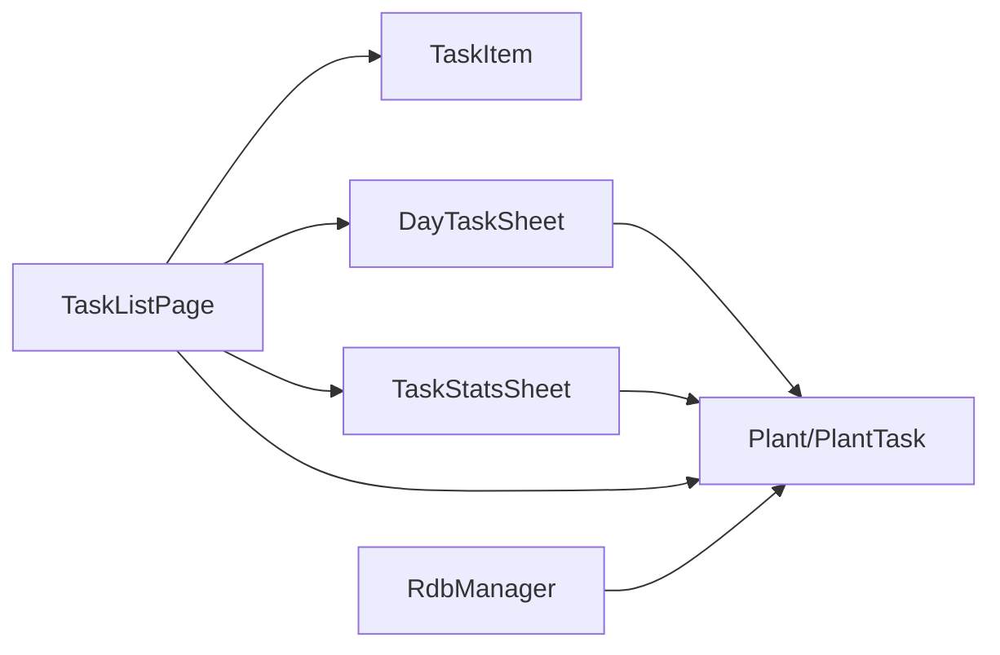

# 任务管理模块

<cite>
**本文引用的文件**
- [TaskItem.ets](file://entry/src/main/ets/view/TaskItem.ets)
- [TaskListPage.ets](file://entry/src/main/ets/pages/TaskListPage.ets)
- [DayTaskSheet.ets](file://entry/src/main/ets/view/DayTaskSheet.ets)
- [TaskStatsSheet.ets](file://entry/src/main/ets/view/TaskStatsSheet.ets)
- [PlantTaskFilterSheet.ets](file://entry/src/main/ets/view/PlantTaskFilterSheet.ets)
- [CareFilterSheet.ets](file://entry/src/main/ets/view/CareFilterSheet.ets)
- [PlantModel.ets](file://entry/src/main/ets/model/PlantModel.ets)
- [RdbManager.ets](file://entry/src/main/ets/viewmodel/RdbManager.ets)
- [EmergencyViewModel.ets](file://entry/src/main/ets/viewmodel/EmergencyViewModel.ets)
</cite>

## 目录
1. [简介](#简介)
2. [项目结构](#项目结构)
3. [核心组件](#核心组件)
4. [架构总览](#架构总览)
5. [详细组件分析](#详细组件分析)
6. [依赖关系分析](#依赖关系分析)
7. [性能考量](#性能考量)
8. [故障排查指南](#故障排查指南)
9. [结论](#结论)
10. [附录](#附录)

## 简介
本文件面向任务管理模块，系统性梳理植物养护任务的自动化生成、跟踪与管理能力。重点覆盖以下方面：
- 任务项组件 TaskItem 的设计与交互实现（状态显示、完成标记、删除交互）
- 任务列表页面 TaskListPage 的筛选、排序与批量操作逻辑
- 每日任务弹窗 DayTaskSheet 与任务统计弹窗 TaskStatsSheet 的技术实现
- 任务生成算法（基于植物特性、周期性任务与紧急任务处理）
- 任务提醒机制、完成记录管理与历史追踪
- 开发者指南：任务规则定制、新增任务类型与通知系统集成

## 项目结构
任务管理模块采用“页面 + 弹窗 + 数据模型 + 数据访问”的分层组织方式：
- 页面层：TaskListPage 负责任务列表与筛选/排序入口
- 弹窗层：DayTaskSheet 提供按日任务查看与快速新建；TaskStatsSheet 提供完成率与类型分布统计
- 组件层：TaskItem 作为最小可复用任务项展示与交互单元
- 数据层：PlantModel 定义 Plant、PlantTask 等数据模型；RdbManager 负责数据库初始化、索引与任务规则种子数据
- 视图模型：EmergencyViewModel 展示了基于规则生成的“观察性任务”思路，可借鉴到常规任务生成

**图表来源**
- [TaskListPage.ets:1-463](file://entry/src/main/ets/pages/TaskListPage.ets#L1-L463)
- [TaskItem.ets:1-67](file://entry/src/main/ets/view/TaskItem.ets#L1-L67)
- [DayTaskSheet.ets:1-228](file://entry/src/main/ets/view/DayTaskSheet.ets#L1-L228)
- [TaskStatsSheet.ets:1-273](file://entry/src/main/ets/view/TaskStatsSheet.ets#L1-L273)
- [PlantModel.ets:1-166](file://entry/src/main/ets/model/PlantModel.ets#L1-L166)
- [RdbManager.ets:1-296](file://entry/src/main/ets/viewmodel/RdbManager.ets#L1-L296)
- [EmergencyViewModel.ets:1-115](file://entry/src/main/ets/viewmodel/EmergencyViewModel.ets#L1-L115)

**章节来源**
- [TaskListPage.ets:1-463](file://entry/src/main/ets/pages/TaskListPage.ets#L1-L463)
- [TaskItem.ets:1-67](file://entry/src/main/ets/view/TaskItem.ets#L1-L67)
- [DayTaskSheet.ets:1-228](file://entry/src/main/ets/view/DayTaskSheet.ets#L1-L228)
- [TaskStatsSheet.ets:1-273](file://entry/src/main/ets/view/TaskStatsSheet.ets#L1-L273)
- [PlantModel.ets:1-166](file://entry/src/main/ets/model/PlantModel.ets#L1-L166)
- [RdbManager.ets:1-296](file://entry/src/main/ets/viewmodel/RdbManager.ets#L1-L296)
- [EmergencyViewModel.ets:1-115](file://entry/src/main/ets/viewmodel/EmergencyViewModel.ets#L1-L115)

## 核心组件
- PlantTask 数据模型：承载任务标识、关联植物、任务类型、计划日期、完成状态与完成时间戳
- TaskItem 任务项组件：负责任务项的视觉呈现与交互回调（完成切换、删除弹窗）
- TaskListPage 任务列表页：提供筛选（状态/类型/日期/关键词）、排序与列表展示，支持按日弹窗
- DayTaskSheet 每日任务弹窗：按日展示任务、植物选择、快速新建与删除
- TaskStatsSheet 任务统计弹窗：按时间窗口计算完成率趋势与任务类型占比
- PlantTaskFilterSheet/CareFilterSheet 筛选弹窗：提供更细粒度的筛选与排序控制
- RdbManager 数据访问：数据库初始化、索引与任务规则种子数据
- EmergencyViewModel 观察性任务思路：可迁移至常规任务生成流程

**章节来源**
- [PlantModel.ets:42-59](file://entry/src/main/ets/model/PlantModel.ets#L42-L59)
- [TaskItem.ets:4-67](file://entry/src/main/ets/view/TaskItem.ets#L4-L67)
- [TaskListPage.ets:6-337](file://entry/src/main/ets/pages/TaskListPage.ets#L6-L337)
- [DayTaskSheet.ets:3-228](file://entry/src/main/ets/view/DayTaskSheet.ets#L3-L228)
- [TaskStatsSheet.ets:4-273](file://entry/src/main/ets/view/TaskStatsSheet.ets#L4-L273)
- [PlantTaskFilterSheet.ets:16-374](file://entry/src/main/ets/view/PlantTaskFilterSheet.ets#L16-L374)
- [CareFilterSheet.ets:1-212](file://entry/src/main/ets/view/CareFilterSheet.ets#L1-L212)
- [RdbManager.ets:4-296](file://entry/src/main/ets/viewmodel/RdbManager.ets#L4-L296)
- [EmergencyViewModel.ets:13-115](file://entry/src/main/ets/viewmodel/EmergencyViewModel.ets#L13-L115)

## 架构总览
任务管理模块围绕 PlantTask 数据模型展开，页面与弹窗通过事件回调与参数传递实现数据驱动的交互。数据库层提供任务规则种子与唯一索引约束，确保任务生成的幂等与一致性。

**图表来源**
- [PlantModel.ets:6-76](file://entry/src/main/ets/model/PlantModel.ets#L6-L76)
- [RdbManager.ets:19-276](file://entry/src/main/ets/viewmodel/RdbManager.ets#L19-L276)
- [TaskListPage.ets:8-337](file://entry/src/main/ets/pages/TaskListPage.ets#L8-L337)
- [TaskItem.ets:5-67](file://entry/src/main/ets/view/TaskItem.ets#L5-L67)
- [DayTaskSheet.ets:4-228](file://entry/src/main/ets/view/DayTaskSheet.ets#L4-L228)
- [TaskStatsSheet.ets:5-273](file://entry/src/main/ets/view/TaskStatsSheet.ets#L5-L273)

## 详细组件分析

### TaskItem 任务项组件
- 设计要点
  - 轻量职责：仅负责展示与交互回调，状态以父层刷新为准
  - 完成态视觉反馈：通过文本符号、缩放与装饰线实现
  - 交互反馈：触摸按下缩放、点击切换完成状态并触发父层回调
- 关键交互
  - 完成切换：onToggle 回调 + 本地瞬时切换，等待父层 reload 校正
  - 删除弹窗：onDeleteAsk 回调
- 视觉与动画
  - 使用动画过渡提升交互体验
  - 透明度与阴影增强层级感

**图表来源**
- [TaskItem.ets:17-67](file://entry/src/main/ets/view/TaskItem.ets#L17-L67)
- [TaskListPage.ets:216-229](file://entry/src/main/ets/pages/TaskListPage.ets#L216-L229)

**章节来源**
- [TaskItem.ets:4-67](file://entry/src/main/ets/view/TaskItem.ets#L4-L67)

### TaskListPage 任务列表页面
- 筛选与搜索
  - 标签页筛选：全部/今天/将来/已完成
  - 类型筛选：自动聚合“浇水/施肥/修剪/…”
  - 关键词搜索：匹配“任务类型/植物名”
- 排序策略
  - 优先按计划日期降序；日期相同时按 id 降序
- 视图与弹窗
  - 列表视图为主；日视图代码保留，便于后续恢复
  - 支持打开 DayTaskSheet 查看当日任务
- 事件回调
  - onToggle/onDeleteAsk/onCreateTask 与父层解耦

**图表来源**
- [TaskListPage.ets:135-162](file://entry/src/main/ets/pages/TaskListPage.ets#L135-L162)
- [TaskListPage.ets:190-337](file://entry/src/main/ets/pages/TaskListPage.ets#L190-L337)

**章节来源**
- [TaskListPage.ets:6-337](file://entry/src/main/ets/pages/TaskListPage.ets#L6-L337)

### DayTaskSheet 每日任务弹窗
- 功能要点
  - 默认选中当日首个植物；若无任务则置空
  - 按日聚合任务，支持植物切换与快速新建
  - 支持完成切换与删除回调
- 颜色与交互
  - 任务类型颜色映射（如“浇水/施肥/修剪”）
  - 交互反馈与抽屉式布局

**图表来源**
- [DayTaskSheet.ets:14-228](file://entry/src/main/ets/view/DayTaskSheet.ets#L14-L228)
- [TaskListPage.ets:316-334](file://entry/src/main/ets/pages/TaskListPage.ets#L316-L334)

**章节来源**
- [DayTaskSheet.ets:3-228](file://entry/src/main/ets/view/DayTaskSheet.ets#L3-L228)

### TaskStatsSheet 任务统计弹窗
- 统计维度
  - 完成率趋势：按日期聚合，支持“近30天/近90天/全部”
  - 类型占比：统计“浇水/施肥/修剪/其他”次数
- 数据处理
  - collectDatesAsc：按日期升序生成时间轴
  - doneOfDay/totalOfDay：按日统计完成数量与总数
  - refreshAll：统一刷新折线与柱状图配置

**图表来源**
- [TaskStatsSheet.ets:83-189](file://entry/src/main/ets/view/TaskStatsSheet.ets#L83-L189)
- [TaskStatsSheet.ets:192-273](file://entry/src/main/ets/view/TaskStatsSheet.ets#L192-L273)

**章节来源**
- [TaskStatsSheet.ets:4-273](file://entry/src/main/ets/view/TaskStatsSheet.ets#L4-L273)

### 筛选弹窗：PlantTaskFilterSheet 与 CareFilterSheet
- PlantTaskFilterSheet（类 + 结构体）
  - 状态：全部/未完成/已完成
  - 类型：浇水/施肥/修剪 开关
  - 日期范围：起止日期输入
  - 关键词：匹配植物名/类型
  - 排序：日期/类型/植物，支持升/降序
- CareFilterSheet（结构体）
  - 提供与 TaskListPage 一致的筛选维度与交互样式

**图表来源**
- [PlantTaskFilterSheet.ets:3-374](file://entry/src/main/ets/view/PlantTaskFilterSheet.ets#L3-L374)
- [CareFilterSheet.ets:1-212](file://entry/src/main/ets/view/CareFilterSheet.ets#L1-L212)

**章节来源**
- [PlantTaskFilterSheet.ets:16-374](file://entry/src/main/ets/view/PlantTaskFilterSheet.ets#L16-L374)
- [CareFilterSheet.ets:1-212](file://entry/src/main/ets/view/CareFilterSheet.ets#L1-L212)

### 任务生成算法与规则
- 数据库与规则种子
  - RdbManager 初始化任务相关表与索引，建立唯一索引避免重复任务
  - ensureCareTemplates 插入植物模板与规则：每种植物对应若干“任务类型 + 间隔天数 + 生成范围”
- 生成策略（基于 PlantModel 与 RdbManager）
  - 输入：植物模板、当前时间、规则（intervalDays、horizonDays）
  - 输出：未来 N 天内的任务清单（按 plantId/type/planDate 唯一）
  - 幂等性：利用唯一索引“尝试插入，冲突即跳过”
- 紧急任务处理思路
  - EmergencyViewModel 展示“开始观察”生成带复查时间的记录，可迁移到常规任务生成流程中，作为“观察性任务”的起点

**图表来源**
- [RdbManager.ets:173-276](file://entry/src/main/ets/viewmodel/RdbManager.ets#L173-L276)
- [PlantModel.ets:150-163](file://entry/src/main/ets/model/PlantModel.ets#L150-L163)
- [EmergencyViewModel.ets:60-75](file://entry/src/main/ets/viewmodel/EmergencyViewModel.ets#L60-L75)

**章节来源**
- [RdbManager.ets:19-170](file://entry/src/main/ets/viewmodel/RdbManager.ets#L19-L170)
- [PlantModel.ets:150-163](file://entry/src/main/ets/model/PlantModel.ets#L150-L163)
- [EmergencyViewModel.ets:13-115](file://entry/src/main/ets/viewmodel/EmergencyViewModel.ets#L13-L115)

## 依赖关系分析
- 组件耦合
  - TaskListPage 与 TaskItem：通过参数与回调解耦，便于复用与测试
  - DayTaskSheet 与 TaskListPage：通过 onToggle/onDeleteAsk/onQuickAdd 事件通信
  - TaskStatsSheet 与 PlantTask：纯数据驱动，无副作用
- 外部依赖
  - 数据库：RdbManager 提供建表、索引与规则种子
  - 图表组件：TaskStatsSheet 使用 McLineChart/McBarChart 渲染统计

**图表来源**
- [TaskListPage.ets:1-463](file://entry/src/main/ets/pages/TaskListPage.ets#L1-L463)
- [DayTaskSheet.ets:1-228](file://entry/src/main/ets/view/DayTaskSheet.ets#L1-L228)
- [TaskStatsSheet.ets:1-273](file://entry/src/main/ets/view/TaskStatsSheet.ets#L1-L273)
- [PlantModel.ets:1-166](file://entry/src/main/ets/model/PlantModel.ets#L1-L166)
- [RdbManager.ets:1-296](file://entry/src/main/ets/viewmodel/RdbManager.ets#L1-L296)

**章节来源**
- [TaskListPage.ets:1-463](file://entry/src/main/ets/pages/TaskListPage.ets#L1-L463)
- [DayTaskSheet.ets:1-228](file://entry/src/main/ets/view/DayTaskSheet.ets#L1-L228)
- [TaskStatsSheet.ets:1-273](file://entry/src/main/ets/view/TaskStatsSheet.ets#L1-L273)
- [PlantModel.ets:1-166](file://entry/src/main/ets/model/PlantModel.ets#L1-L166)
- [RdbManager.ets:1-296](file://entry/src/main/ets/viewmodel/RdbManager.ets#L1-L296)

## 性能考量
- 列表渲染
  - 使用 List + ForEach 渲染任务项，减少不必要的重绘
  - 对于大量任务场景，建议在 TaskListPage 中引入虚拟列表或分页
- 过滤与排序
  - filteredTasks 在内存中复制数组并排序，注意大数据量时的复杂度
  - 可考虑将排序键与过滤条件缓存，避免重复计算
- 图表渲染
  - TaskStatsSheet 的折线/柱状图数据在每次刷新时全量更新，建议在数据变化较小时进行增量更新
- 数据库
  - 唯一索引与复合索引已建立，插入任务时冲突即跳过，降低重复任务风险

[本节为通用指导，无需具体文件引用]

## 故障排查指南
- 任务未显示或显示异常
  - 检查 TaskListPage 的筛选条件与排序键，确认是否被关键词/类型/日期范围过滤
  - 确认 Plant 与 PlantTask 数据是否正确传入
- 完成状态不同步
  - TaskItem 本地切换仅为即时反馈，需等待父层刷新；检查 onToggle 回调是否正确触发
- 重复任务生成
  - 确认数据库唯一索引是否存在；检查规则生成逻辑是否正确使用“尝试插入/冲突跳过”
- 统计异常
  - 检查时间范围选择与日期序列生成；确认 doneOfDay/totalOfDay 的统计逻辑

**章节来源**
- [TaskListPage.ets:135-162](file://entry/src/main/ets/pages/TaskListPage.ets#L135-L162)
- [TaskItem.ets:23-27](file://entry/src/main/ets/view/TaskItem.ets#L23-L27)
- [RdbManager.ets:134-146](file://entry/src/main/ets/viewmodel/RdbManager.ets#L134-L146)
- [TaskStatsSheet.ets:135-148](file://entry/src/main/ets/view/TaskStatsSheet.ets#L135-L148)

## 结论
任务管理模块通过清晰的分层设计与数据驱动的交互，实现了从任务生成、筛选排序到统计可视化的完整闭环。组件职责明确、事件解耦，便于扩展新的任务类型与筛选维度。结合数据库的唯一索引与规则种子，系统具备良好的幂等性与可维护性。

[本节为总结性内容，无需具体文件引用]

## 附录

### 开发者指南：任务规则定制
- 新增规则
  - 在 RdbManager.ensureCareTemplates 中为模板添加新的规则项（type、intervalDays、horizonDays）
- 生成流程
  - 依据规则计算未来任务日期，使用唯一索引插入，冲突即跳过
- 紧急任务
  - 可参考 EmergencyViewModel 的“开始观察”流程，生成带复查时间的记录

**章节来源**
- [RdbManager.ets:173-276](file://entry/src/main/ets/viewmodel/RdbManager.ets#L173-L276)
- [EmergencyViewModel.ets:60-75](file://entry/src/main/ets/viewmodel/EmergencyViewModel.ets#L60-L75)

### 开发者指南：新增任务类型
- 修改点
  - PlantTaskFilterSheet/PlantModel 中新增类型开关与颜色映射
  - RdbManager 种子规则中增加对应规则
  - TaskStatsSheet 中扩展类型占比统计
- 注意事项
  - 保持类型字符串一致性，避免大小写与空格差异导致匹配失败

**章节来源**
- [PlantTaskFilterSheet.ets:319-358](file://entry/src/main/ets/view/PlantTaskFilterSheet.ets#L319-L358)
- [RdbManager.ets:196-275](file://entry/src/main/ets/viewmodel/RdbManager.ets#L196-L275)
- [TaskStatsSheet.ets:151-184](file://entry/src/main/ets/view/TaskStatsSheet.ets#L151-L184)

### 开发者指南：通知系统集成
- 建议方案
  - 在任务完成或即将到期时触发系统通知
  - 使用 doneAt 字段记录完成时间，便于统计与提醒
- 实现要点
  - 与系统通知服务对接，设置定时器或基于时间窗口的扫描
  - 保持通知内容简洁，引导用户进入 TaskListPage 或 DayTaskSheet

[本节为概念性指导，无需具体文件引用]