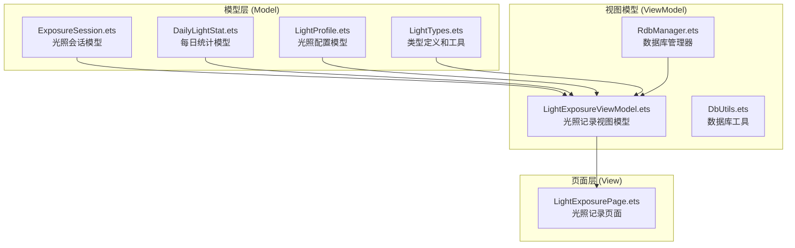
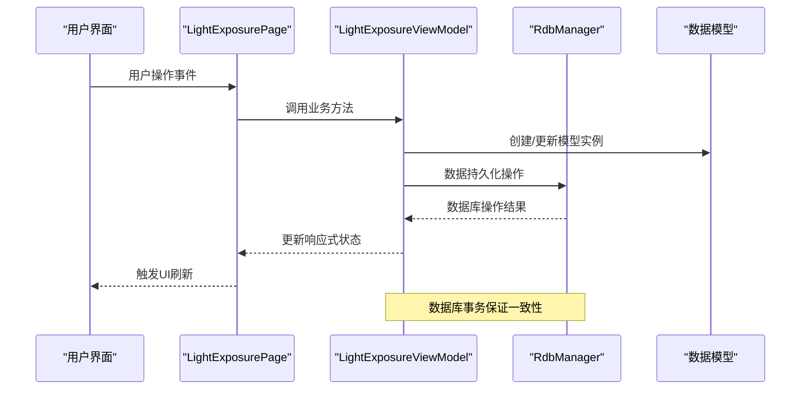
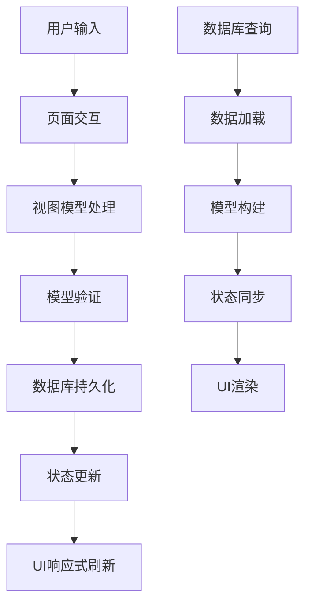
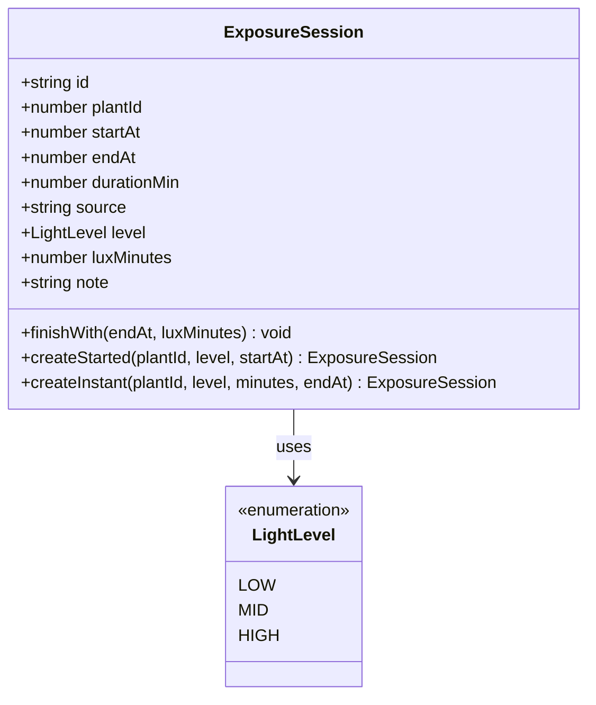
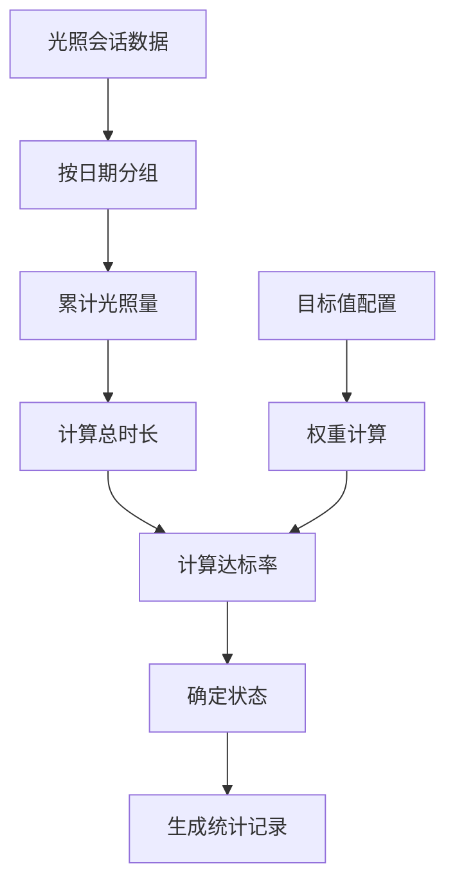
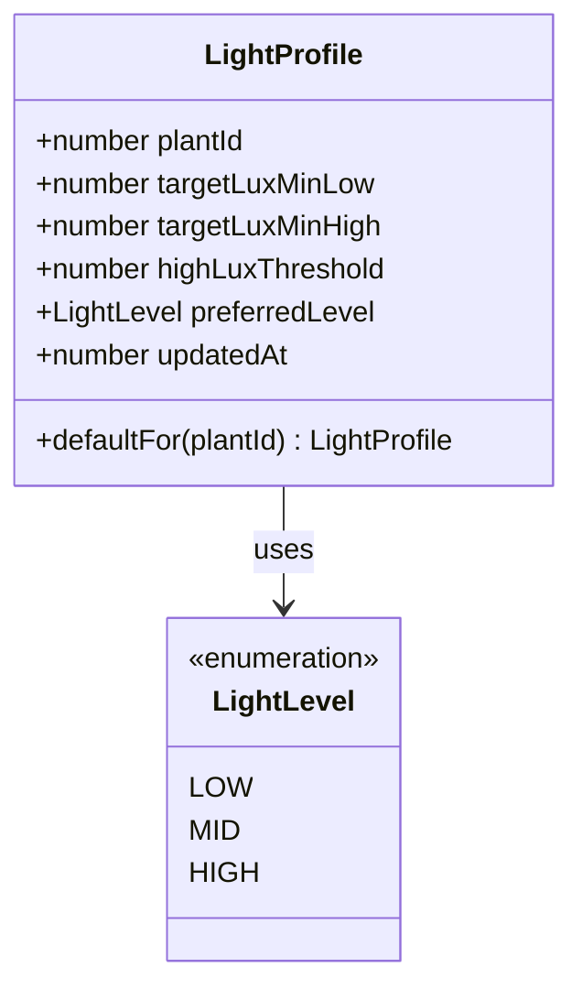
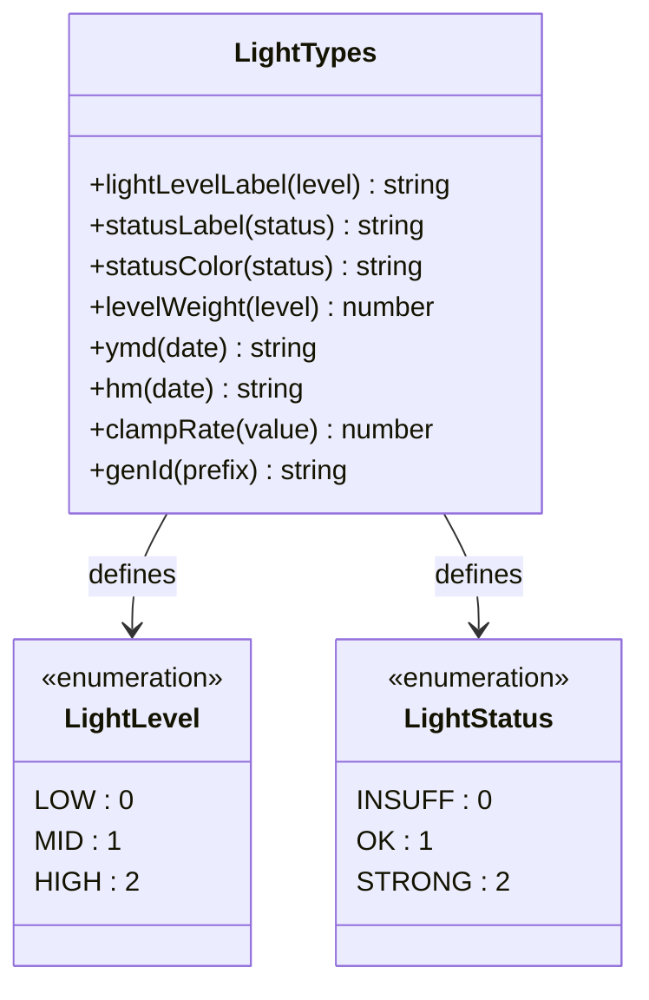
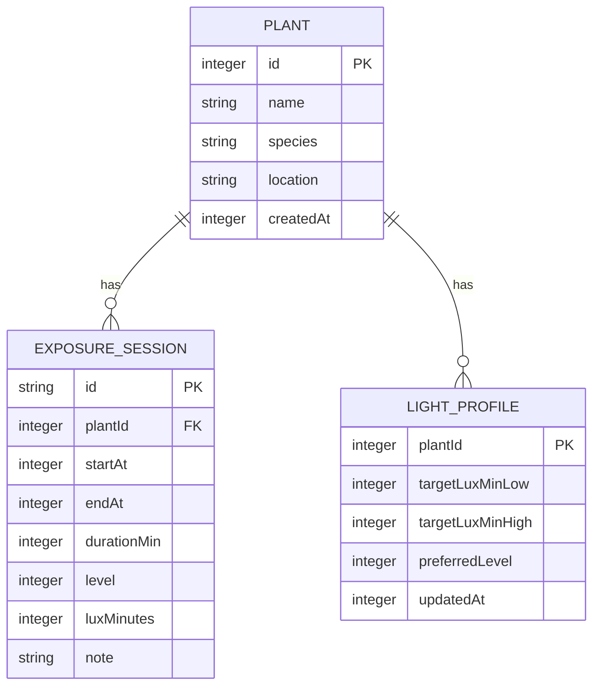
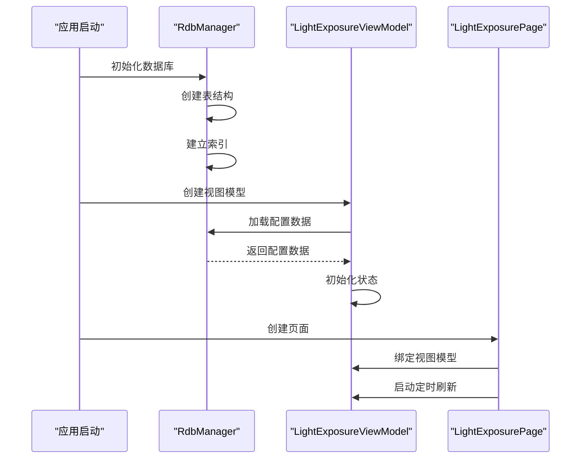

# 光照记录模块

<cite>
**本文档引用的文件**
- [ExposureSession.ets](file://entry/src/main/ets/model/ExposureSession.ets)
- [DailyLightStat.ets](file://entry/src/main/ets/model/DailyLightStat.ets)
- [LightProfile.ets](file://entry/src/main/ets/model/LightProfile.ets)
- [LightTypes.ets](file://entry/src/main/ets/model/LightTypes.ets)
- [LightExposureViewModel.ets](file://entry/src/main/ets/viewmodel/LightExposureViewModel.ets)
- [LightExposurePage.ets](file://entry/src/main/ets/pages/LightExposurePage.ets)
- [RdbManager.ets](file://entry/src/main/ets/viewmodel/RdbManager.ets)
- [DbUtils.ets](file://entry/src/main/ets/model/DbUtils.ets)
</cite>

## 目录
1. [简介](#简介)
2. [项目结构](#项目结构)
3. [核心组件](#核心组件)
4. [架构概览](#架构概览)
5. [详细组件分析](#详细组件分析)
6. [依赖关系分析](#依赖关系分析)
7. [性能考量](#性能考量)
8. [故障排除指南](#故障排除指南)
9. [结论](#结论)
10. [附录](#附录)

## 简介
光照记录模块是 PlantDiary 应用中的核心功能之一，专注于植物光照管理。该模块提供了完整的光照监测和记录解决方案，包括：
- 实时光照监测：支持开始/结束模式的实时会话跟踪
- 手动记录：提供补记功能，支持历史数据录入
- 会话管理：完整的光照会话生命周期管理
- 统计分析：每日光照统计、达标率计算和可视化展示
- 偏好配置：个性化的光照目标设置和强度偏好

该模块采用 MVVM 架构设计，通过响应式数据绑定实现 UI 与业务逻辑的解耦，支持离线数据存储和实时状态同步。

## 项目结构
光照记录模块主要分布在以下目录结构中：

**图表来源**
- [ExposureSession.ets:1-84](file://entry/src/main/ets/model/ExposureSession.ets#L1-L84)
- [DailyLightStat.ets:1-30](file://entry/src/main/ets/model/DailyLightStat.ets#L1-L30)
- [LightProfile.ets:1-41](file://entry/src/main/ets/model/LightProfile.ets#L1-L41)
- [LightTypes.ets:1-124](file://entry/src/main/ets/model/LightTypes.ets#L1-L124)
- [LightExposureViewModel.ets:1-554](file://entry/src/main/ets/viewmodel/LightExposureViewModel.ets#L1-L554)
- [RdbManager.ets:1-296](file://entry/src/main/ets/viewmodel/RdbManager.ets#L1-L296)
- [LightExposurePage.ets:1-806](file://entry/src/main/ets/pages/LightExposurePage.ets#L1-L806)

**章节来源**
- [LightExposureViewModel.ets:1-554](file://entry/src/main/ets/viewmodel/LightExposureViewModel.ets#L1-L554)
- [RdbManager.ets:1-296](file://entry/src/main/ets/viewmodel/RdbManager.ets#L1-L296)

## 核心组件
光照记录模块包含四个核心数据模型，每个模型都有明确的职责分工：

### ExposureSession - 光照会话模型
负责记录一次完整的光照过程，支持两种记录模式：
- **开始/结束模式**：用户点击开始和结束按钮的实时记录
- **即时记录模式**：用户直接输入时长的手动补记

### DailyLightStat - 每日统计模型
记录植物每日的光照情况，包括累积光照量、总时长、达标率等关键指标。

### LightProfile - 光照配置模型
记录植物的光照偏好和目标设置，支持个性化配置和自动调整。

### LightTypes - 类型定义和工具
提供光照级别、状态枚举以及相关的工具函数，包括颜色映射、标签转换等。

**章节来源**
- [ExposureSession.ets:14-84](file://entry/src/main/ets/model/ExposureSession.ets#L14-L84)
- [DailyLightStat.ets:11-30](file://entry/src/main/ets/model/DailyLightStat.ets#L11-L30)
- [LightProfile.ets:11-41](file://entry/src/main/ets/model/LightProfile.ets#L11-L41)
- [LightTypes.ets:5-124](file://entry/src/main/ets/model/LightTypes.ets#L5-L124)

## 架构概览
光照记录模块采用 MVVM 架构模式，实现了清晰的关注点分离：

**图表来源**
- [LightExposurePage.ets:210-384](file://entry/src/main/ets/pages/LightExposurePage.ets#L210-L384)
- [LightExposureViewModel.ets:16-554](file://entry/src/main/ets/viewmodel/LightExposureViewModel.ets#L16-L554)
- [RdbManager.ets:4-296](file://entry/src/main/ets/viewmodel/RdbManager.ets#L4-L296)

### 数据流架构
模块内部的数据流向清晰明确：

**图表来源**
- [LightExposureViewModel.ets:43-113](file://entry/src/main/ets/viewmodel/LightExposureViewModel.ets#L43-L113)
- [RdbManager.ets:27-170](file://entry/src/main/ets/viewmodel/RdbManager.ets#L27-L170)

## 详细组件分析

### ExposureSession 会话模型
ExposureSession 是光照记录的核心数据结构，采用装饰器模式实现响应式更新。

#### 数据结构设计

**图表来源**
- [ExposureSession.ets:14-84](file://entry/src/main/ets/model/ExposureSession.ets#L14-L84)
- [LightTypes.ets:9-13](file://entry/src/main/ets/model/LightTypes.ets#L9-L13)

#### 生命周期管理
会话生命周期包含三个关键阶段：
1. **创建阶段**：生成唯一ID和初始状态
2. **进行阶段**：实时更新持续时间和光照量
3. **结束阶段**：计算最终数据并持久化

#### 会话创建策略
- **开始会话**：`createStarted()` 方法创建进行中会话
- **即时会话**：`createInstant()` 方法创建补记会话
- **异常处理**：自动清理多个进行中的异常会话

**章节来源**
- [ExposureSession.ets:14-84](file://entry/src/main/ets/model/ExposureSession.ets#L14-L84)
- [LightExposureViewModel.ets:129-156](file://entry/src/main/ets/viewmodel/LightExposureViewModel.ets#L129-L156)

### DailyLightStat 每日统计
DailyLightStat 负责计算和存储每日光照统计信息。

#### 统计计算逻辑

**图表来源**
- [LightExposureViewModel.ets:298-385](file://entry/src/main/ets/viewmodel/LightExposureViewModel.ets#L298-L385)
- [DailyLightStat.ets:12-30](file://entry/src/main/ets/model/DailyLightStat.ets#L12-L30)

#### 状态判定标准
- **不足状态**：达标率 < 60%
- **适中状态**：达标率 60%-100%
- **过强状态**：达标率 > 100%

#### 性能优化策略
- **增量更新**：仅更新受影响的日期统计
- **缓存机制**：内存中维护统计缓存
- **批量处理**：支持批量重建和增量更新

**章节来源**
- [DailyLightStat.ets:11-30](file://entry/src/main/ets/model/DailyLightStat.ets#L11-L30)
- [LightExposureViewModel.ets:334-385](file://entry/src/main/ets/viewmodel/LightExposureViewModel.ets#L334-L385)

### LightProfile 光照偏好配置
LightProfile 提供植物光照目标的个性化配置。

#### 配置参数

**图表来源**
- [LightProfile.ets:11-41](file://entry/src/main/ets/model/LightProfile.ets#L11-L41)
- [LightTypes.ets:9-13](file://entry/src/main/ets/model/LightTypes.ets#L9-L13)

#### 自动调整机制
系统根据目标下限自动推荐合适的光照偏好：
- **低光照需求**：< 10,000 lux-min → 弱光
- **中等光照需求**：< 15,000 lux-min → 中光  
- **高光照需求**：≥ 15,000 lux-min → 强光

#### 配置持久化
- **数据库存储**：每株植物一条配置记录
- **自动初始化**：首次使用时自动生成默认配置
- **版本控制**：记录最后更新时间

**章节来源**
- [LightProfile.ets:11-41](file://entry/src/main/ets/model/LightProfile.ets#L11-L41)
- [LightExposureViewModel.ets:515-552](file://entry/src/main/ets/viewmodel/LightExposureViewModel.ets#L515-L552)

### LightTypes 类型系统
LightTypes 提供完整的类型定义和工具函数支持。

#### 枚举类型定义

**图表来源**
- [LightTypes.ets:5-124](file://entry/src/main/ets/model/LightTypes.ets#L5-L124)

#### 工具函数功能
- **标签转换**：中文标签与枚举值的双向映射
- **颜色映射**：状态到视觉颜色的映射
- **权重计算**：不同光照级别的影响权重
- **日期处理**：标准化日期格式化
- **ID生成**：唯一标识符生成

**章节来源**
- [LightTypes.ets:5-124](file://entry/src/main/ets/model/LightTypes.ets#L5-L124)

## 依赖关系分析

### 数据库架构
光照记录模块使用关系型数据库存储所有数据，采用单一数据库文件管理所有表。

#### 表结构设计

**图表来源**
- [RdbManager.ets:108-129](file://entry/src/main/ets/viewmodel/RdbManager.ets#L108-L129)

#### 索引策略
- **唯一索引**：任务表的复合唯一索引防止重复
- **查询优化**：常用查询字段建立索引提升性能
- **数据完整性**：外键约束保证数据一致性

### 依赖注入和生命周期

**图表来源**
- [RdbManager.ets:27-170](file://entry/src/main/ets/viewmodel/RdbManager.ets#L27-L170)
- [LightExposureViewModel.ets:33-113](file://entry/src/main/ets/viewmodel/LightExposureViewModel.ets#L33-L113)

**章节来源**
- [RdbManager.ets:1-296](file://entry/src/main/ets/viewmodel/RdbManager.ets#L1-L296)
- [LightExposureViewModel.ets:16-554](file://entry/src/main/ets/viewmodel/LightExposureViewModel.ets#L16-L554)

## 性能考量
光照记录模块在设计时充分考虑了性能优化：

### 内存管理
- **响应式更新**：使用装饰器实现细粒度的状态更新
- **增量计算**：仅更新受影响的数据区域
- **缓存策略**：内存中维护热点数据的缓存

### 数据库优化
- **批量操作**：支持批量插入和更新减少IO操作
- **事务管理**：使用事务确保数据一致性
- **索引优化**：针对查询模式建立优化索引

### UI性能
- **定时刷新**：1秒精度的UI刷新频率平衡流畅度和性能
- **懒加载**：列表项采用懒加载减少内存占用
- **状态缓存**：避免重复计算相同的统计结果

## 故障排除指南

### 常见问题诊断
1. **会话状态异常**
   - 检查是否存在多个进行中的会话
   - 验证数据库连接状态
   - 确认AppStorage同步状态

2. **统计数据不准确**
   - 检查目标值配置是否合理
   - 验证光照量计算公式
   - 确认日期分组逻辑

3. **UI更新延迟**
   - 检查定时器是否正常运行
   - 验证响应式状态更新
   - 确认tick信号传递

### 调试工具
- **日志输出**：关键操作添加详细日志
- **状态监控**：实时监控各组件状态
- **性能分析**：定期检查内存和CPU使用

**章节来源**
- [LightExposureViewModel.ets:227-251](file://entry/src/main/ets/viewmodel/LightExposureViewModel.ets#L227-L251)
- [LightExposurePage.ets:235-241](file://entry/src/main/ets/pages/LightExposurePage.ets#L235-L241)

## 结论
光照记录模块通过精心设计的架构和完善的实现，为植物光照管理提供了全面的解决方案。模块具有以下特点：

### 设计优势
- **模块化设计**：清晰的职责分离便于维护和扩展
- **响应式架构**：自动状态同步提升用户体验
- **数据一致性**：事务管理确保数据完整性
- **性能优化**：多种优化策略保证运行效率

### 功能完整性
- **实时监测**：支持开始/结束模式的实时会话跟踪
- **历史记录**：完整的补记功能支持历史数据录入
- **统计分析**：多维度的统计和可视化展示
- **个性化配置**：灵活的光照偏好设置

### 扩展性考虑
模块设计充分考虑了未来的功能扩展需求，包括：
- 新的光照级别定义
- 自定义统计指标
- 多设备同步支持
- 高级分析功能

## 附录

### API 文档

#### LightExposureViewModel 主要接口
- `init()` - 初始化模块，加载配置和历史数据
- `startManual(level)` - 开始新的光照会话
- `endManualWithAutoDuration()` - 结束当前会话
- `addManualInstant(level, minutes)` - 创建补记会话
- `deleteSession(id)` - 删除指定会话
- `updateProfile(low, high, preferred)` - 更新光照配置
- `todayRatePercent` - 获取今日达标率
- `todayStatus` - 获取今日光照状态
- `sevenDays` - 获取最近7天统计数据

#### 数据模型接口
- **ExposureSession**：会话创建、结束、状态管理
- **DailyLightStat**：统计计算、状态判定
- **LightProfile**：配置管理、自动调整
- **LightTypes**：类型定义、工具函数

### 集成指南
1. **基础集成**：导入 LightExposureViewModel 并初始化
2. **UI绑定**：将响应式属性绑定到页面组件
3. **事件处理**：实现用户交互事件的处理逻辑
4. **数据持久化**：确保数据库操作的事务性
5. **错误处理**：实现完善的异常处理机制

### 自定义扩展
模块支持多种自定义扩展：
- **光照级别扩展**：添加新的光照强度等级
- **统计指标扩展**：自定义统计计算逻辑
- **UI主题扩展**：支持不同的视觉风格
- **数据源扩展**：集成外部光照传感器数据