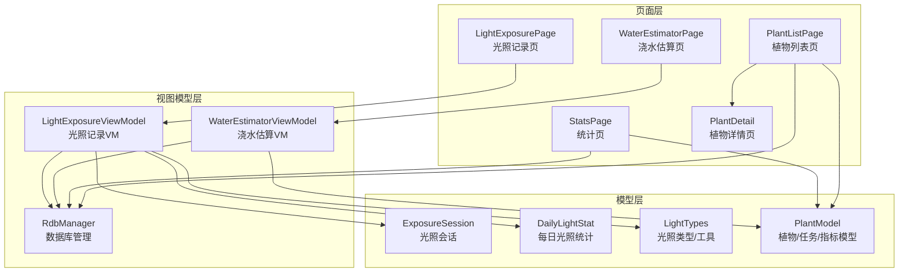
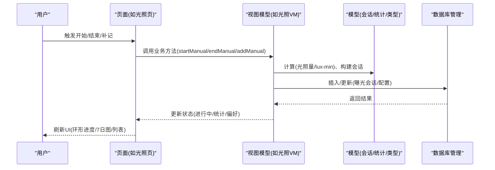
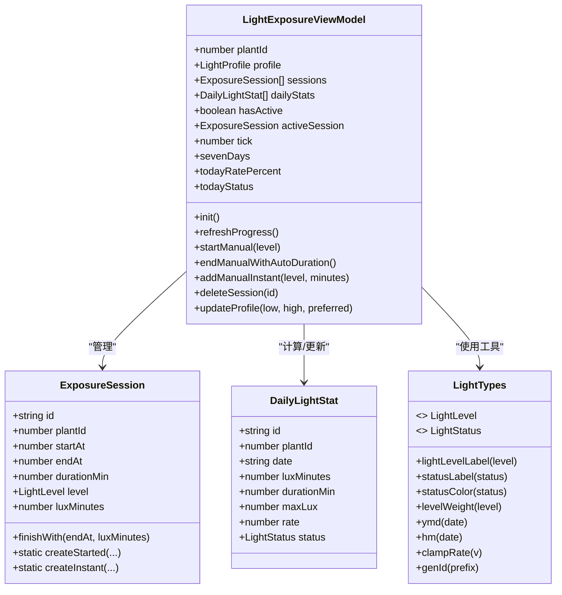
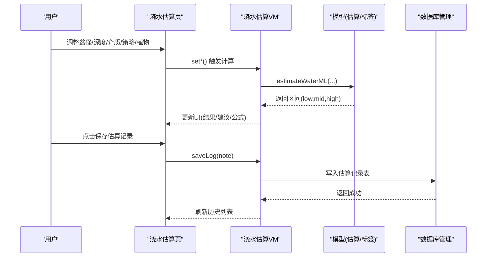
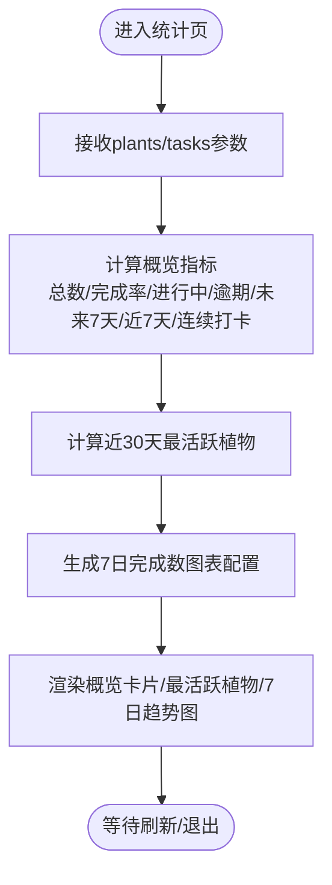
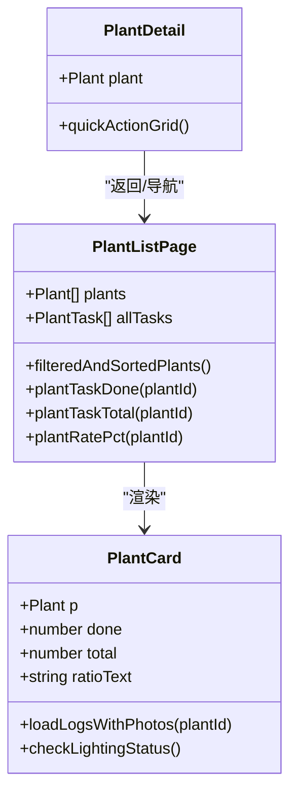
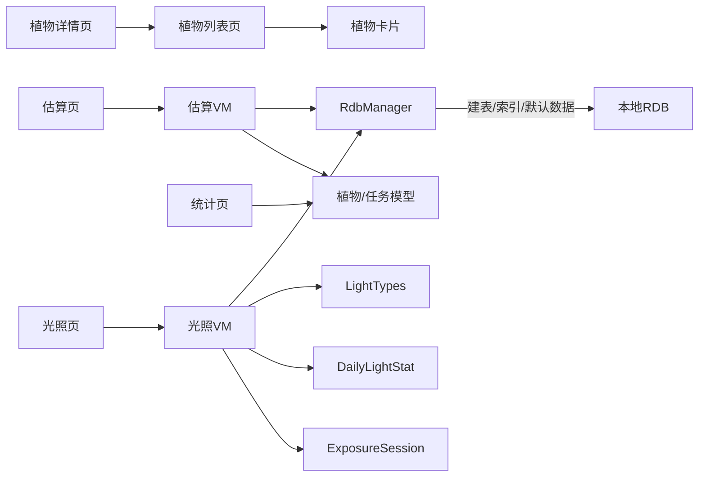

# 功能模块

<cite>
**本文引用的文件**
- [LightExposurePage.ets](file://entry/src/main/ets/pages/LightExposurePage.ets)
- [LightExposureViewModel.ets](file://entry/src/main/ets/viewmodel/LightExposureViewModel.ets)
- [DailyLightStat.ets](file://entry/src/main/ets/model/DailyLightStat.ets)
- [ExposureSession.ets](file://entry/src/main/ets/model/ExposureSession.ets)
- [LightTypes.ets](file://entry/src/main/ets/model/LightTypes.ets)
- [WaterEstimatorPage.ets](file://entry/src/main/ets/pages/WaterEstimatorPage.ets)
- [WaterEstimatorViewModel.ets](file://entry/src/main/ets/viewmodel/WaterEstimatorViewModel.ets)
- [WaterRecord.ets](file://entry/src/main/ets/model/WaterRecord.ets)
- [WaterEstimateLog.ets](file://entry/src/main/ets/model/WaterEstimateLog.ets)
- [StatsPage.ets](file://entry/src/main/ets/pages/StatsPage.ets)
- [PlantListPage.ets](file://entry/src/main/ets/pages/PlantListPage.ets)
- [PlantDetail.ets](file://entry/src/main/ets/pages/PlantDetail.ets)
- [PlantCard.ets](file://entry/src/main/ets/view/PlantCard.ets)
- [RdbManager.ets](file://entry/src/main/ets/viewmodel/RdbManager.ets)
- [PlantModel.ets](file://entry/src/main/ets/model/PlantModel.ets)
</cite>

## 目录
1. [简介](#简介)
2. [项目结构](#项目结构)
3. [核心组件](#核心组件)
4. [架构总览](#架构总览)
5. [详细组件分析](#详细组件分析)
6. [依赖分析](#依赖分析)
7. [性能考量](#性能考量)
8. [故障排查指南](#故障排查指南)
9. [结论](#结论)
10. [附录](#附录)

## 简介
本文件面向植物日记项目的功能模块，系统梳理光照记录、浇水估算、统计分析、植物管理等核心模块的设计与实现，覆盖业务逻辑、用户界面与数据处理流程，解释模块间依赖与协作机制，并提供配置选项、参数设置、使用方法、扩展与定制建议，以及完整的API与集成指南，帮助开发者快速理解与二次开发。

## 项目结构
项目采用“页面-视图模型-模型-数据库管理”的分层组织方式：
- 页面层（Page）：负责用户交互与视图渲染，如光照记录页、浇水估算页、统计页、植物列表页等。
- 视图模型层（ViewModel）：封装业务逻辑与状态管理，如光照记录VM、浇水估算VM、数据库管理VM等。
- 模型层（Model）：定义数据结构与工具函数，如光照会话、每日统计、光照类型、植物与任务模型等。
- 数据库管理（RdbManager）：统一负责数据库初始化、建表、索引与默认数据注入。

**图表来源**
- [LightExposurePage.ets](file://entry/src/main/ets/pages/LightExposurePage.ets)
- [LightExposureViewModel.ets](file://entry/src/main/ets/viewmodel/LightExposureViewModel.ets)
- [WaterEstimatorPage.ets](file://entry/src/main/ets/pages/WaterEstimatorPage.ets)
- [WaterEstimatorViewModel.ets](file://entry/src/main/ets/viewmodel/WaterEstimatorViewModel.ets)
- [StatsPage.ets](file://entry/src/main/ets/pages/StatsPage.ets)
- [PlantListPage.ets](file://entry/src/main/ets/pages/PlantListPage.ets)
- [PlantDetail.ets](file://entry/src/main/ets/pages/PlantDetail.ets)
- [RdbManager.ets](file://entry/src/main/ets/viewmodel/RdbManager.ets)
- [PlantModel.ets](file://entry/src/main/ets/model/PlantModel.ets)

**章节来源**
- [LightExposurePage.ets](file://entry/src/main/ets/pages/LightExposurePage.ets)
- [WaterEstimatorPage.ets](file://entry/src/main/ets/pages/WaterEstimatorPage.ets)
- [StatsPage.ets](file://entry/src/main/ets/pages/StatsPage.ets)
- [PlantListPage.ets](file://entry/src/main/ets/pages/PlantListPage.ets)
- [PlantDetail.ets](file://entry/src/main/ets/pages/PlantDetail.ets)
- [RdbManager.ets](file://entry/src/main/ets/viewmodel/RdbManager.ets)
- [PlantModel.ets](file://entry/src/main/ets/model/PlantModel.ets)

## 核心组件
- 光照记录模块：提供手动开始/结束光照、即时补记、偏好配置、实时达标率与7日统计展示。
- 浇水估算模块：输入盆径、深度、介质、策略、植物类型，输出用量区间与建议，支持保存估算记录。
- 统计分析模块：基于任务与植物数据，计算概览指标、活跃植物、7日趋势等。
- 植物管理模块：植物列表、详情、卡片快捷入口、任务完成统计与筛选排序。

**章节来源**
- [LightExposurePage.ets](file://entry/src/main/ets/pages/LightExposurePage.ets)
- [LightExposureViewModel.ets](file://entry/src/main/ets/viewmodel/LightExposureViewModel.ets)
- [WaterEstimatorPage.ets](file://entry/src/main/ets/pages/WaterEstimatorPage.ets)
- [WaterEstimatorViewModel.ets](file://entry/src/main/ets/viewmodel/WaterEstimatorViewModel.ets)
- [StatsPage.ets](file://entry/src/main/ets/pages/StatsPage.ets)
- [PlantListPage.ets](file://entry/src/main/ets/pages/PlantListPage.ets)
- [PlantDetail.ets](file://entry/src/main/ets/pages/PlantDetail.ets)
- [PlantCard.ets](file://entry/src/main/ets/view/PlantCard.ets)

## 架构总览
模块间通过页面-VM-模型-数据库的分层解耦协作，页面仅负责UI与事件，VM负责状态与业务，模型提供数据结构与工具，数据库管理负责持久化与索引。

**图表来源**
- [LightExposurePage.ets](file://entry/src/main/ets/pages/LightExposurePage.ets)
- [LightExposureViewModel.ets](file://entry/src/main/ets/viewmodel/LightExposureViewModel.ets)
- [ExposureSession.ets](file://entry/src/main/ets/model/ExposureSession.ets)
- [DailyLightStat.ets](file://entry/src/main/ets/model/DailyLightStat.ets)
- [LightTypes.ets](file://entry/src/main/ets/model/LightTypes.ets)
- [RdbManager.ets](file://entry/src/main/ets/viewmodel/RdbManager.ets)

## 详细组件分析

### 光照记录模块
- 业务逻辑
  - 支持手动开始/结束光照，自动计算时长与等效光照量（lux-min）。
  - 支持即时补记，无需进入“进行中”状态。
  - 偏好配置包含目标下限/上限与偏好光照级别，自动切换与快速调整。
  - 实时统计当日达标率与状态，7日条形图展示。
  - 异常进行中会话清理与历史记录删除联动修正统计。
- 用户界面
  - 顶部聚合卡片：今日达标率、状态、目标、主操作按钮。
  - 偏好卡片：强度偏好与目标上下限调节。
  - 历史会话列表：支持滑动删除。
  - 7日条形图：按最大值归一化绘制。
- 数据处理
  - 会话模型包含开始/结束时间、时长、级别、等效光照量。
  - 每日统计模型包含累计lux-min、总时长、达标率与状态。
  - 通过数据库表 light_profile/exposure_session 持久化。
- 关键API与事件
  - startManual(level)
  - endManualWithAutoDuration()
  - addManualInstant(level, minutes)
  - updateProfile(low, high, preferred)
  - deleteSession(id)
  - sevenDays/todayRatePercent/todayStatus 计算属性

**图表来源**
- [LightExposureViewModel.ets](file://entry/src/main/ets/viewmodel/LightExposureViewModel.ets)
- [ExposureSession.ets](file://entry/src/main/ets/model/ExposureSession.ets)
- [DailyLightStat.ets](file://entry/src/main/ets/model/DailyLightStat.ets)
- [LightTypes.ets](file://entry/src/main/ets/model/LightTypes.ets)

**章节来源**
- [LightExposurePage.ets](file://entry/src/main/ets/pages/LightExposurePage.ets)
- [LightExposureViewModel.ets](file://entry/src/main/ets/viewmodel/LightExposureViewModel.ets)
- [ExposureSession.ets](file://entry/src/main/ets/model/ExposureSession.ets)
- [DailyLightStat.ets](file://entry/src/main/ets/model/DailyLightStat.ets)
- [LightTypes.ets](file://entry/src/main/ets/model/LightTypes.ets)

### 浇水估算模块
- 业务逻辑
  - 输入：盆径(cm)、深度(cm)、介质类型、浇水策略、植物类型。
  - 输出：用量区间（下限/推荐/上限）与建议文案。
  - 保存：将当前输入与结果打包为估算记录，支持备注。
- 用户界面
  - 盆器尺寸滑块与快捷按钮。
  - 介质/策略/植物类型芯片选择。
  - 估算结果三栏展示与公式简述。
  - 保存按钮与历史记录列表。
- 数据处理
  - 估算结果由模型层公式计算，VM负责同步与保存。
  - 估算记录模型包含输入参数、区间值与创建时间。
- 关键API与事件
  - setDiameter/setDepth/setRetention/setStrategy/setPlant
  - compute()/getSuggestText()/getFormulaBrief()
  - saveLog(note)

**图表来源**
- [WaterEstimatorPage.ets](file://entry/src/main/ets/pages/WaterEstimatorPage.ets)
- [WaterEstimatorViewModel.ets](file://entry/src/main/ets/viewmodel/WaterEstimatorViewModel.ets)
- [WaterRecord.ets](file://entry/src/main/ets/model/WaterRecord.ets)
- [WaterEstimateLog.ets](file://entry/src/main/ets/model/WaterEstimateLog.ets)
- [RdbManager.ets](file://entry/src/main/ets/viewmodel/RdbManager.ets)

**章节来源**
- [WaterEstimatorPage.ets](file://entry/src/main/ets/pages/WaterEstimatorPage.ets)
- [WaterEstimatorViewModel.ets](file://entry/src/main/ets/viewmodel/WaterEstimatorViewModel.ets)
- [WaterRecord.ets](file://entry/src/main/ets/model/WaterRecord.ets)
- [WaterEstimateLog.ets](file://entry/src/main/ets/model/WaterEstimateLog.ets)

### 统计分析模块
- 业务逻辑
  - 基于内存中的植物与任务数据即时计算概览指标（总数、完成率、进行中、逾期、未来7天、近7天、连续打卡）。
  - 识别近30天最活跃植物。
  - 生成7日完成数柱状图。
- 用户界面
  - 概览卡片网格、最活跃植物展示、7日趋势图。
  - 刷新按钮回调首页重载数据。
- 数据处理
  - 通过日期工具函数与ISO字符串进行时间窗口聚合。
  - 图表配置对象Options在页面渲染时动态刷新。

**图表来源**
- [StatsPage.ets](file://entry/src/main/ets/pages/StatsPage.ets)

**章节来源**
- [StatsPage.ets](file://entry/src/main/ets/pages/StatsPage.ets)

### 植物管理模块
- 业务逻辑
  - 植物列表：按物种筛选、排序（创建时间/名称/完成率）。
  - 植物卡片：展示封面图（优先日志首图）、补光呼吸动画、任务完成进度、快捷入口。
  - 植物详情：快捷功能入口直达各子功能页。
- 用户界面
  - 列表页筛选与排序芯片、卡片网格布局。
  - 卡片内日志/指标/模板/盆栽/用量估算器等快捷入口。
  - 详情页快捷功能九宫格。
- 数据处理
  - 列表页对任务列表进行本地聚合计算完成数/总数/完成率。
  - 卡片通过AppStorage广播补光状态，实现跨页面视觉反馈。

**图表来源**
- [PlantListPage.ets](file://entry/src/main/ets/pages/PlantListPage.ets)
- [PlantCard.ets](file://entry/src/main/ets/view/PlantCard.ets)
- [PlantDetail.ets](file://entry/src/main/ets/pages/PlantDetail.ets)

**章节来源**
- [PlantListPage.ets](file://entry/src/main/ets/pages/PlantListPage.ets)
- [PlantCard.ets](file://entry/src/main/ets/view/PlantCard.ets)
- [PlantDetail.ets](file://entry/src/main/ets/pages/PlantDetail.ets)

## 依赖分析
- 页面与VM：页面仅通过VM暴露的方法与属性交互，降低耦合。
- VM与模型：VM依赖模型提供的数据结构与工具函数（如光照级别/状态、日期工具、会话/统计模型）。
- VM与数据库：通过RdbManager统一访问，页面不直接操作数据库。
- 模块内聚：光照模块围绕ExposureSession/DailyLightStat/LightTypes；估算模块围绕WaterEstimatorViewModel与WaterEstimateLog；统计模块围绕Plant/Task；植物管理围绕Plant/Task/Log。

**图表来源**
- [LightExposurePage.ets](file://entry/src/main/ets/pages/LightExposurePage.ets)
- [LightExposureViewModel.ets](file://entry/src/main/ets/viewmodel/LightExposureViewModel.ets)
- [WaterEstimatorPage.ets](file://entry/src/main/ets/pages/WaterEstimatorPage.ets)
- [WaterEstimatorViewModel.ets](file://entry/src/main/ets/viewmodel/WaterEstimatorViewModel.ets)
- [StatsPage.ets](file://entry/src/main/ets/pages/StatsPage.ets)
- [PlantListPage.ets](file://entry/src/main/ets/pages/PlantListPage.ets)
- [PlantDetail.ets](file://entry/src/main/ets/pages/PlantDetail.ets)
- [PlantCard.ets](file://entry/src/main/ets/view/PlantCard.ets)
- [RdbManager.ets](file://entry/src/main/ets/viewmodel/RdbManager.ets)
- [PlantModel.ets](file://entry/src/main/ets/model/PlantModel.ets)

**章节来源**
- [RdbManager.ets](file://entry/src/main/ets/viewmodel/RdbManager.ets)
- [PlantModel.ets](file://entry/src/main/ets/model/PlantModel.ets)

## 性能考量
- 响应式更新：光照VM通过tick驱动UI刷新，避免频繁重算；7日统计在有进行中会话时临时叠加实时值，兼顾一致性与流畅性。
- 计算优化：每日统计增量更新（仅更新指定日期），避免全量扫描历史。
- 列表渲染：植物列表与卡片均采用本地聚合与轻量渲染，减少重复计算。
- 数据库：建立常用查询索引（任务唯一索引、日志/指标复合索引），降低查询成本。

[本节为通用指导，无需特定文件引用]

## 故障排查指南
- 光照异常进行中
  - 现象：多个进行中会话或状态不一致。
  - 处理：VM内部强制关闭多余进行中会话，更新AppStorage补光状态。
  - 参考路径：[LightExposureViewModel.ets](file://entry/src/main/ets/viewmodel/LightExposureViewModel.ets)
- 删除记录后统计偏差
  - 现象：删除会话后当日统计未更新。
  - 处理：删除后调用按日增量更新，确保统计正确。
  - 参考路径：[LightExposureViewModel.ets](file://entry/src/main/ets/viewmodel/LightExposureViewModel.ets)
- 估算记录无法保存
  - 现象：保存后历史列表未更新。
  - 处理：确认VM保存逻辑已将新记录插入到列表头部并触发响应式更新。
  - 参考路径：[WaterEstimatorViewModel.ets](file://entry/src/main/ets/viewmodel/WaterEstimatorViewModel.ets)
- 数据库初始化失败
  - 现象：页面无法读取/写入数据。
  - 处理：检查RdbManager初始化与建表、索引执行结果，确认上下文有效。
  - 参考路径：[RdbManager.ets](file://entry/src/main/ets/viewmodel/RdbManager.ets)

**章节来源**
- [LightExposureViewModel.ets](file://entry/src/main/ets/viewmodel/LightExposureViewModel.ets)
- [WaterEstimatorViewModel.ets](file://entry/src/main/ets/viewmodel/WaterEstimatorViewModel.ets)
- [RdbManager.ets](file://entry/src/main/ets/viewmodel/RdbManager.ets)

## 结论
本项目通过清晰的页面-VM-模型-数据库分层，实现了光照记录、浇水估算、统计分析与植物管理的模块化设计。模块间职责明确、依赖稳定，具备良好的扩展性与定制空间。开发者可在不破坏现有结构的前提下，新增参数、调整算法或接入外部服务，满足多样化的植物养护需求。

[本节为总结，无需特定文件引用]

## 附录

### 配置选项与参数设置
- 光照偏好
  - 目标下限/上限（lux-min）
  - 偏好光照级别（弱光/中光/强光）
  - 快速调整：根据偏好自动建议目标区间
  - 参考路径：[LightExposureViewModel.ets](file://entry/src/main/ets/viewmodel/LightExposureViewModel.ets)
- 浇水估算
  - 盆径：6–60 cm
  - 深度：6–60 cm
  - 介质类型：砂砾/通用/泥炭/兰花/椰糠
  - 策略：彻底浸润/日常保养
  - 植物类型：多肉/观叶/开花/兰花/果类
  - 参考路径：[WaterEstimatorViewModel.ets](file://entry/src/main/ets/viewmodel/WaterEstimatorViewModel.ets)

### 使用场景与操作示例
- 光照记录
  - 场景：每日补光后记录时长与强度。
  - 步骤：打开光照页→选择强度→点击开始→结束时自动计算→查看7日统计。
  - 参考路径：[LightExposurePage.ets](file://entry/src/main/ets/pages/LightExposurePage.ets)
- 浇水估算
  - 场景：根据盆器与介质估算用水量。
  - 步骤：打开估算页→调整尺寸/介质/策略/植物→查看区间与建议→保存记录。
  - 参考路径：[WaterEstimatorPage.ets](file://entry/src/main/ets/pages/WaterEstimatorPage.ets)
- 统计分析
  - 场景：查看整体完成情况与活跃植物。
  - 步骤：打开统计页→刷新数据→查看概览与7日趋势。
  - 参考路径：[StatsPage.ets](file://entry/src/main/ets/pages/StatsPage.ets)
- 植物管理
  - 场景：查看植物列表、筛选与排序、快速创建任务。
  - 步骤：打开植物列表→筛选/排序→点击卡片快捷入口→进入对应功能页。
  - 参考路径：[PlantListPage.ets](file://entry/src/main/ets/pages/PlantListPage.ets)

### 扩展与定制建议
- 新增光照级别/状态：在类型枚举与工具函数中扩展，VM与UI同步适配。
- 自定义估算公式：在模型层新增估算函数，VM调用并更新UI。
- 增加图表维度：在统计页扩展聚合逻辑与图表配置。
- 数据迁移：通过RdbManager新增表与索引，保持向后兼容。

[本节为通用指导，无需特定文件引用]