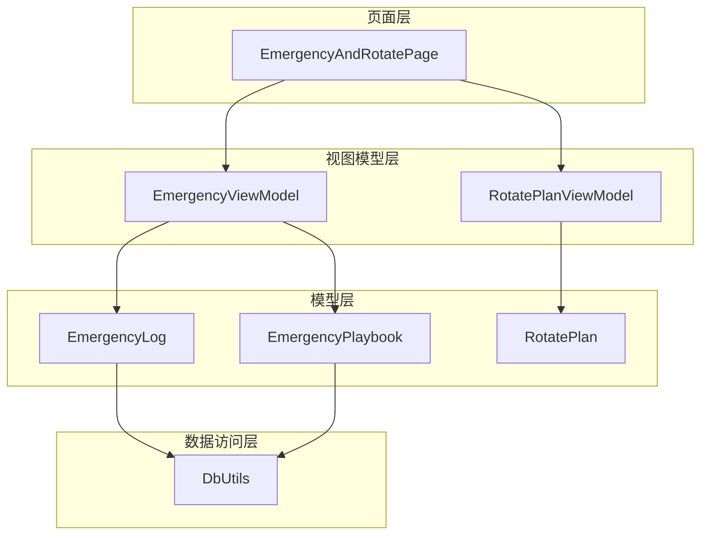
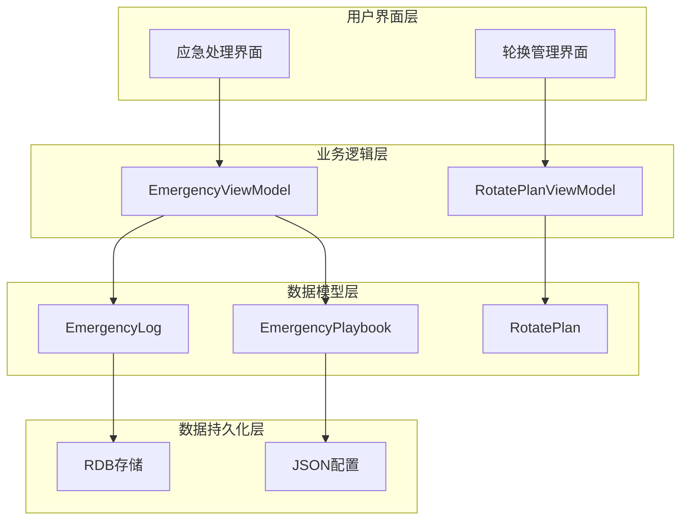
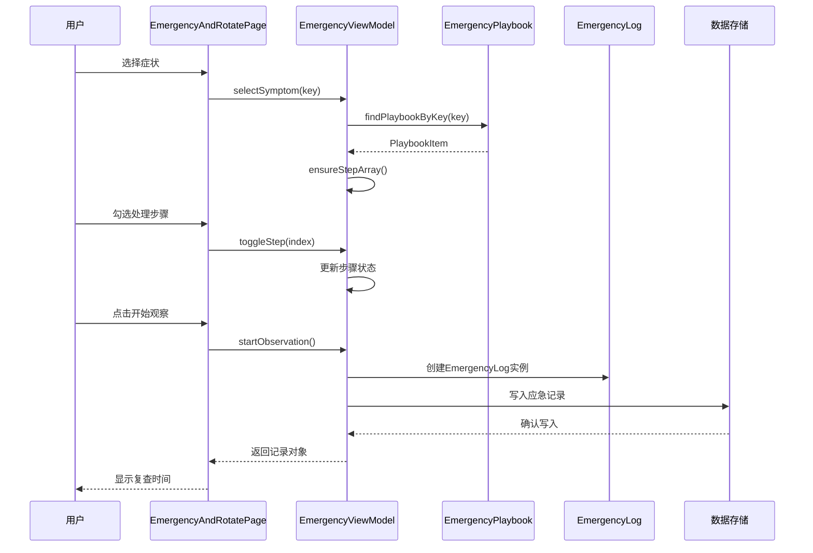
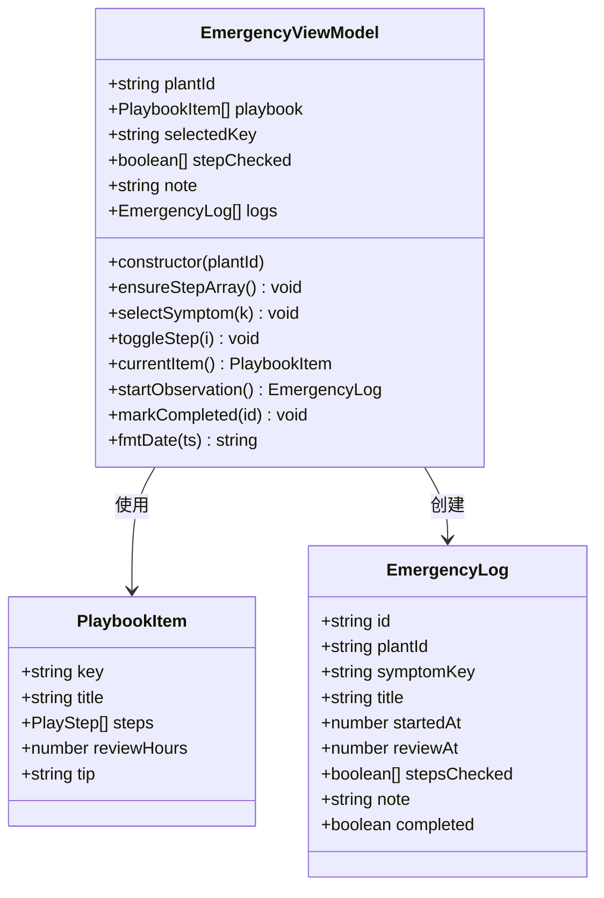
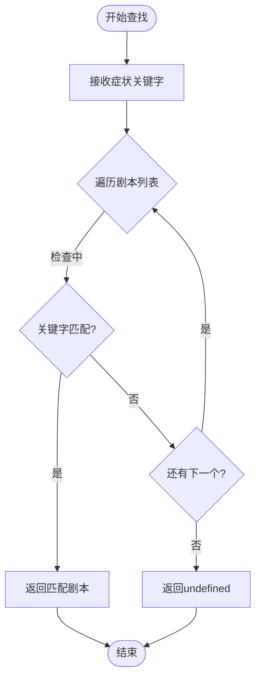
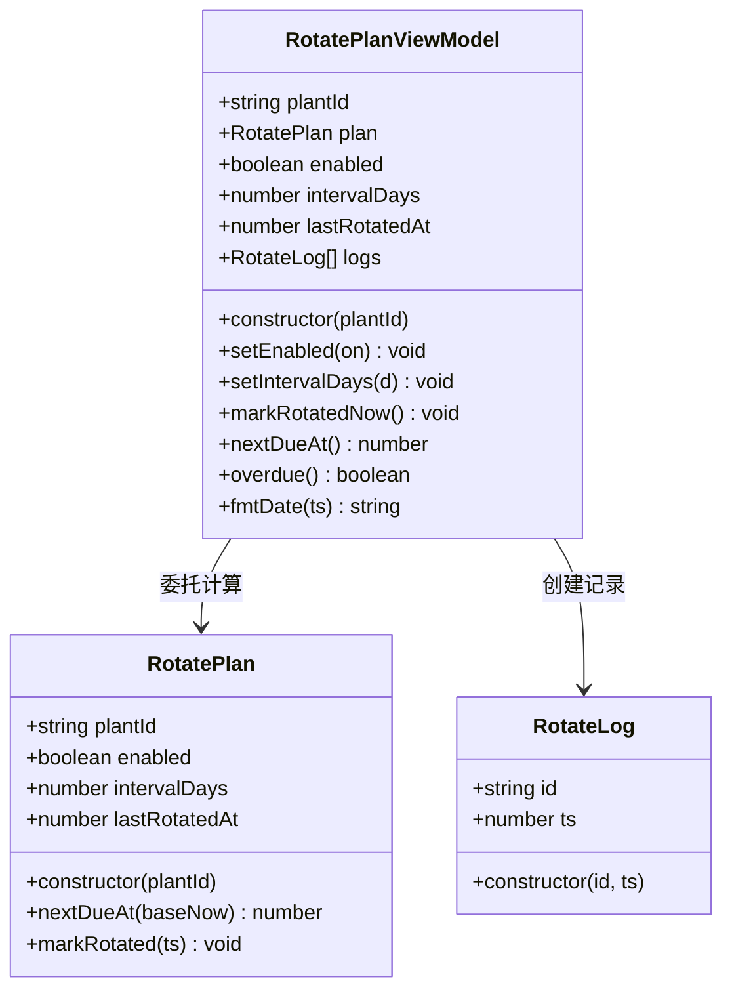
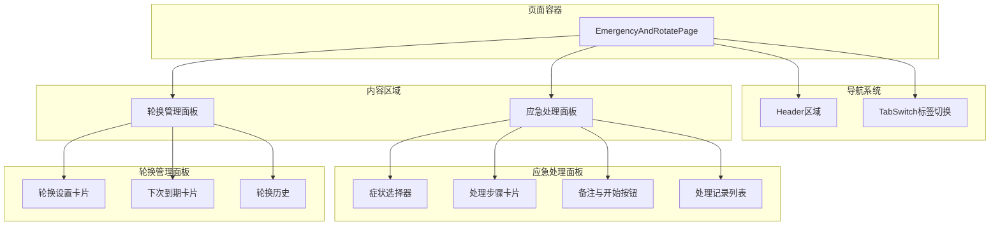
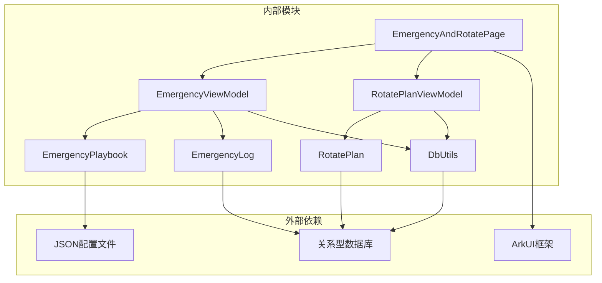

# 应急处理与轮换模块

<cite>
**本文档引用的文件**
- [EmergencyViewModel.ets](file://entry/src/main/ets/viewmodel/EmergencyViewModel.ets)
- [EmergencyPlaybook.ets](file://entry/src/main/ets/model/EmergencyPlaybook.ets)
- [EmergencyLog.ets](file://entry/src/main/ets/model/EmergencyLog.ets)
- [RotatePlanViewModel.ets](file://entry/src/main/ets/viewmodel/RotatePlanViewModel.ets)
- [RotatePlan.ets](file://entry/src/main/ets/model/RotatePlan.ets)
- [EmergencyAndRotatePage.ets](file://entry/src/main/ets/pages/EmergencyAndRotatePage.ets)
- [PlantModel.ets](file://entry/src/main/ets/model/PlantModel.ets)
- [DbUtils.ets](file://entry/src/main/ets/model/DbUtils.ets)
</cite>

## 目录
1. [简介](#简介)
2. [项目结构](#项目结构)
3. [核心组件](#核心组件)
4. [架构概览](#架构概览)
5. [详细组件分析](#详细组件分析)
6. [依赖关系分析](#依赖关系分析)
7. [性能考虑](#性能考虑)
8. [故障排除指南](#故障排除指南)
9. [开发指南](#开发指南)
10. [结论](#结论)

## 简介

应急处理与轮换模块是植物日记应用中的关键功能模块，旨在为用户提供植物突发状况的应急处理流程和自动化轮换管理功能。该模块包含两个主要子系统：

- **应急处理系统**：基于预定义的应急剧本，提供症状识别、处理方案推荐和执行跟踪功能
- **轮换管理系统**：自动化植物位置轮换提醒和历史记录管理

该模块采用MVVM架构模式，通过ViewModel分离业务逻辑和UI展示，确保代码的可维护性和可扩展性。

## 项目结构

应急处理与轮换模块位于应用的主入口目录中，采用清晰的分层组织结构：



**图表来源**
- [EmergencyAndRotatePage.ets:1-557](file://entry/src/main/ets/pages/EmergencyAndRotatePage.ets#L1-L557)
- [EmergencyViewModel.ets:1-115](file://entry/src/main/ets/viewmodel/EmergencyViewModel.ets#L1-L115)
- [RotatePlanViewModel.ets:1-88](file://entry/src/main/ets/viewmodel/RotatePlanViewModel.ets#L1-L88)

**章节来源**
- [EmergencyAndRotatePage.ets:1-557](file://entry/src/main/ets/pages/EmergencyAndRotatePage.ets#L1-L557)
- [EmergencyViewModel.ets:1-115](file://entry/src/main/ets/viewmodel/EmergencyViewModel.ets#L1-L115)
- [RotatePlanViewModel.ets:1-88](file://entry/src/main/ets/viewmodel/RotatePlanViewModel.ets#L1-L88)

## 核心组件

### 应急处理系统

应急处理系统包含以下核心组件：

- **EmergencyPlaybook**：应急剧本清单，定义各种植物症状及其对应的处理方案
- **EmergencyLog**：应急处理记录实体，存储每次处理的详细信息
- **EmergencyViewModel**：应急处理业务逻辑控制器，管理症状选择、步骤勾选和记录生成

### 轮换管理系统

轮换管理系统包含以下核心组件：

- **RotatePlan**：轮换计划模型，负责计算下次轮换时间和到期判断
- **RotateLog**：轮换历史记录，追踪每次轮换操作的时间戳
- **RotatePlanViewModel**：轮换管理业务逻辑控制器，提供用户界面交互功能

**章节来源**
- [EmergencyPlaybook.ets:1-81](file://entry/src/main/ets/model/EmergencyPlaybook.ets#L1-L81)
- [EmergencyLog.ets:1-20](file://entry/src/main/ets/model/EmergencyLog.ets#L1-L20)
- [EmergencyViewModel.ets:1-115](file://entry/src/main/ets/viewmodel/EmergencyViewModel.ets#L1-L115)
- [RotatePlan.ets:1-25](file://entry/src/main/ets/model/RotatePlan.ets#L1-L25)
- [RotatePlanViewModel.ets:1-88](file://entry/src/main/ets/viewmodel/RotatePlanViewModel.ets#L1-L88)

## 架构概览

应急处理与轮换模块采用MVVM架构模式，实现了清晰的关注点分离：



**图表来源**
- [EmergencyAndRotatePage.ets:100-358](file://entry/src/main/ets/pages/EmergencyAndRotatePage.ets#L100-L358)
- [EmergencyViewModel.ets:14-29](file://entry/src/main/ets/viewmodel/EmergencyViewModel.ets#L14-L29)
- [RotatePlanViewModel.ets:18-31](file://entry/src/main/ets/viewmodel/RotatePlanViewModel.ets#L18-L31)

### 数据流分析

应急处理的数据流展示了从用户输入到数据持久化的完整过程：



**图表来源**
- [EmergencyAndRotatePage.ets:235-243](file://entry/src/main/ets/pages/EmergencyAndRotatePage.ets#L235-L243)
- [EmergencyViewModel.ets:60-75](file://entry/src/main/ets/viewmodel/EmergencyViewModel.ets#L60-L75)
- [EmergencyPlaybook.ets:75-80](file://entry/src/main/ets/model/EmergencyPlaybook.ets#L75-L80)

**章节来源**
- [EmergencyAndRotatePage.ets:17-22](file://entry/src/main/ets/pages/EmergencyAndRotatePage.ets#L17-L22)
- [EmergencyViewModel.ets:25-29](file://entry/src/main/ets/viewmodel/EmergencyViewModel.ets#L25-L29)

## 详细组件分析

### EmergencyViewModel 应急处理业务逻辑

EmergencyViewModel 是应急处理系统的核心业务逻辑控制器，负责管理整个应急处理流程：

#### 核心属性和方法



**图表来源**
- [EmergencyViewModel.ets:14-115](file://entry/src/main/ets/viewmodel/EmergencyViewModel.ets#L14-L115)
- [EmergencyPlaybook.ets:9-23](file://entry/src/main/ets/model/EmergencyPlaybook.ets#L9-L23)
- [EmergencyLog.ets:4-19](file://entry/src/main/ets/model/EmergencyLog.ets#L4-L19)

#### 应急处理流程

应急处理遵循严格的三步流程：

1. **症状选择阶段**：用户从预定义的症状列表中选择植物的异常表现
2. **处理方案阶段**：根据症状匹配相应的应急剧本，显示具体的处理步骤
3. **观察记录阶段**：用户勾选已完成的步骤，生成应急记录并安排复查时间

#### 实现细节

- **步骤状态管理**：通过布尔数组精确跟踪每个处理步骤的完成状态
- **时间管理**：自动计算复查时间，支持自定义复查间隔
- **数据持久化**：采用不可变更新模式，确保UI正确响应数据变化

**章节来源**
- [EmergencyViewModel.ets:31-52](file://entry/src/main/ets/viewmodel/EmergencyViewModel.ets#L31-L52)
- [EmergencyViewModel.ets:58-75](file://entry/src/main/ets/viewmodel/EmergencyViewModel.ens#L58-L75)
- [EmergencyViewModel.ets:77-98](file://entry/src/main/ets/viewmodel/EmergencyViewModel.ets#L77-L98)

### EmergencyPlaybook 应急剧本系统

EmergencyPlaybook 定义了植物应急处理的标准剧本库，包含五种常见植物症状及其对应处理方案：

#### 剧本类型和处理方案

| 症状类型 | 关键字 | 处理步骤 | 复查间隔 |
|---------|--------|----------|----------|
| 日灼 | SCORCH | 移至散射光、剪除受损叶片、减少浇水量 | 72小时 |
| 急性萎蔫 | WILT | 检查介质湿度、移至阴凉处、逐步恢复原位 | 48小时 |
| 黄化发黄 | YELLOW | 增加光照、薄肥勤施、排查积水 | 96小时 |
| 叶片黑斑 | SPOT | 剪除感染叶片、加强通风、使用杀菌剂 | 72小时 |
| 烂根 | ROOTROT | 停止浇水、检查根系、更换介质 | 48小时 |

#### 剧本查找机制



**图表来源**
- [EmergencyPlaybook.ets:75-80](file://entry/src/main/ets/model/EmergencyPlaybook.ets#L75-L80)

**章节来源**
- [EmergencyPlaybook.ets:25-73](file://entry/src/main/ets/model/EmergencyPlaybook.ets#L25-L73)
- [EmergencyPlaybook.ets:75-80](file://entry/src/main/ets/model/EmergencyPlaybook.ets#L75-L80)

### RotatePlanViewModel 轮换管理实现

RotatePlanViewModel 负责植物位置轮换的自动化管理和用户交互：

#### 核心功能特性



**图表来源**
- [RotatePlanViewModel.ets:18-87](file://entry/src/main/ets/viewmodel/RotatePlanViewModel.ets#L18-L87)
- [RotatePlan.ets:4-24](file://entry/src/main/ets/model/RotatePlan.ets#L4-L24)
- [RotatePlanViewModel.ets:12-16](file://entry/src/main/ets/viewmodel/RotatePlanViewModel.ets#L12-L16)

#### 轮换调度算法

轮换计划采用简单的周期性调度机制：

1. **启用控制**：用户可以启用或禁用轮换提醒功能
2. **周期设置**：支持3-60天的轮换周期范围设置
3. **到期计算**：基于最近一次轮换时间计算下次到期时间
4. **过期检测**：实时判断当前是否需要进行轮换

#### 历史记录管理

轮换历史采用先进先出的队列管理方式，确保最新的记录显示在最前面：

**章节来源**
- [RotatePlanViewModel.ets:33-38](file://entry/src/main/ets/viewmodel/RotatePlanViewModel.ets#L33-L38)
- [RotatePlanViewModel.ets:53-62](file://entry/src/main/ets/viewmodel/RotatePlanViewModel.ets#L53-L62)
- [RotatePlanViewModel.ets:64-72](file://entry/src/main/ets/viewmodel/RotatePlanViewModel.ets#L64-L72)

### EmergencyAndRotatePage 应急处理页面

EmergencyAndRotatePage 是应急处理与轮换管理的统一用户界面，采用标签页设计实现双功能合一：

#### 页面布局结构



**图表来源**
- [EmergencyAndRotatePage.ets:24-55](file://entry/src/main/ets/pages/EmergencyAndRotatePage.ets#L24-L55)
- [EmergencyAndRotatePage.ets:100-108](file://entry/src/main/ets/pages/EmergencyAndRotatePage.ets#L100-L108)
- [EmergencyAndRotatePage.ets:360-367](file://entry/src/main/ets/pages/EmergencyAndRotatePage.ets#L360-L367)

#### 用户交互流程

应急处理页面提供了直观的用户体验设计：

1. **症状识别**：通过图标化的症状卡片快速选择植物异常
2. **处理方案**：自动显示匹配的应急处理步骤和建议复查时间
3. **执行确认**：用户勾选已完成的步骤，一键生成处理记录
4. **历史跟踪**：完整的处理记录列表支持状态管理和效果评估

**章节来源**
- [EmergencyAndRotatePage.ets:110-136](file://entry/src/main/ets/pages/EmergencyAndRotatePage.ets#L110-L136)
- [EmergencyAndRotatePage.ets:155-188](file://entry/src/main/ets/pages/EmergencyAndRotatePage.ets#L155-L188)
- [EmergencyAndRotatePage.ets:211-261](file://entry/src/main/ets/pages/EmergencyAndRotatePage.ets#L211-L261)

## 依赖关系分析

应急处理与轮换模块的依赖关系体现了清晰的分层架构：



**图表来源**
- [EmergencyAndRotatePage.ets:4-8](file://entry/src/main/ets/pages/EmergencyAndRotatePage.ets#L4-L8)
- [EmergencyViewModel.ets:4-5](file://entry/src/main/ets/viewmodel/EmergencyViewModel.ets#L4-L5)
- [RotatePlanViewModel.ets:4](file://entry/src/main/ets/viewmodel/RotatePlanViewModel.ets#L4)

### 模块耦合度分析

- **低耦合设计**：页面、视图模型和数据模型之间保持清晰的职责分离
- **单向依赖**：UI层只依赖视图模型，视图模型依赖数据模型，避免循环依赖
- **可测试性**：每个组件都可以独立测试，便于单元测试和集成测试

**章节来源**
- [EmergencyViewModel.ets:13](file://entry/src/main/ets/viewmodel/EmergencyViewModel.ets#L13)
- [RotatePlanViewModel.ets:18](file://entry/src/main/ets/viewmodel/RotatePlanViewModel.ets#L18)

## 性能考虑

### 内存管理

应急处理与轮换模块采用了高效的内存管理策略：

- **不可变更新**：所有数据更新都通过创建新对象的方式实现，确保UI正确响应
- **数组管理**：使用固定大小的布尔数组跟踪步骤状态，避免动态扩容开销
- **时间缓存**：到期时间计算结果缓存，减少重复计算

### UI渲染优化

- **局部更新**：@ObservedV2装饰器确保只有相关UI组件重新渲染
- **懒加载**：症状选择器和轮换设置采用条件渲染，减少初始加载负担
- **虚拟滚动**：历史记录列表使用虚拟滚动技术，支持大量数据的高效显示

### 数据持久化策略

- **批量写入**：使用事务包装确保数据一致性
- **增量更新**：只更新必要的字段，减少存储开销
- **索引优化**：关键查询字段建立适当索引

## 故障排除指南

### 常见问题及解决方案

#### 应急处理功能异常

**问题**：症状选择后处理步骤不显示
**可能原因**：
- 剧本数据加载失败
- 症状关键字不匹配
- UI状态同步问题

**解决步骤**：
1. 检查剧本数据完整性
2. 验证症状关键字正确性
3. 重新初始化ViewModel

#### 轮换提醒失效

**问题**：轮换提醒不准确或不显示
**可能原因**：
- 时间计算错误
- 存储数据损坏
- UI状态不同步

**解决步骤**：
1. 验证轮换周期设置
2. 检查最近轮换时间
3. 重新计算到期时间

#### 数据持久化问题

**问题**：应急记录或轮换历史丢失
**可能原因**：
- 事务提交失败
- 存储权限问题
- 数据库连接异常

**解决步骤**：
1. 检查数据库连接状态
2. 验证事务完整性
3. 重新尝试数据写入

**章节来源**
- [EmergencyViewModel.ets:31-38](file://entry/src/main/ets/viewmodel/EmergencyViewModel.ets#L31-L38)
- [RotatePlanViewModel.ets:64-72](file://entry/src/main/ets/viewmodel/RotatePlanViewModel.ets#L64-L72)
- [DbUtils.ets:12-21](file://entry/src/main/ets/model/DbUtils.ets#L12-L21)

## 开发指南

### 添加新的应急场景

要为应急处理系统添加新的症状场景，需要按照以下步骤进行：

#### 步骤1：定义新的症状类型

在 EmergencyPlaybook 中添加新的 PlaybookItem：

```typescript
// 在 getBuiltinPlaybook 函数中添加
list.push(new PlaybookItem(
  'NEW_SYMPTOM',           // 唯一关键字
  '新症状名称',             // 用户可见标题
  [                       // 处理步骤数组
    new PlayStep('步骤1'),
    new PlayStep('步骤2'),
    new PlayStep('步骤3')
  ],
  72,                     // 复查间隔（小时）
  '处理建议'              // 补充提示
));
```

#### 步骤2：更新UI界面

在 EmergencyAndRotatePage 中添加对应的症状卡片：

```typescript
// 在症状选择器中添加
this.SymChip("🆕 新症状", "NEW_SYMPTOM")
```

#### 步骤3：测试验证

1. 验证症状选择功能
2. 测试处理步骤显示
3. 确认应急记录生成
4. 验证复查时间计算

### 自定义处理流程

应急处理流程的定制主要通过以下方式进行：

#### 修改处理步骤

调整现有症状的处理步骤顺序或内容：

```typescript
// 修改现有症状的步骤数组
new PlaybookItem(
  'SCORCH',
  '疑似日灼',
  [ 
    new PlayStep('新的处理步骤'),  // 替换原有步骤
    new PlayStep('剪除严重灼伤叶片的 30%~50%'),
    new PlayStep('减少浇水量，1 周后逐步恢复')
  ],
  72,
  '后续 1 周内增加通风，避免午后强光直射。'
)
```

#### 调整复查间隔

根据不同症状的严重程度调整复查时间：

```typescript
// 严重症状缩短复查间隔
new PlaybookItem('SEVERE_WILT', '严重萎蔫', steps, 24, tip)

// 轻微症状延长复查间隔
new PlaybookItem('MILD_YELLOW', '轻微黄化', steps, 120, tip)
```

### 轮换策略优化

轮换管理系统的优化可以从以下几个方面入手：

#### 轮换周期调优

根据植物种类和生长环境调整轮换周期：

```typescript
// 设置合理的轮换周期范围
setIntervalDays(d: number): void {
  let nv: number = d;
  if (nv < 3) { nv = 3; }    // 最短3天
  if (nv > 60) { nv = 60; }  // 最长60天
  this.intervalDays = nv;
  this.plan.intervalDays = nv;
}
```

#### 智能提醒机制

增强轮换提醒的智能化程度：

```typescript
// 添加环境因素影响
nextDueAt(baseNow: number): number {
  const base: number = this.lastRotatedAt > 0 ? this.lastRotatedAt : baseNow;
  let next: number = base + this.intervalDays * 24 * 60 * 60 * 1000;
  
  // 根据光照强度调整提醒时间
  if (this.environment.lightIntensity > 80) {
    next -= 24 * 60 * 60 * 1000; // 提前一天提醒
  }
  
  return next;
}
```

#### 批量操作功能

为轮换管理添加批量操作支持：

```typescript
// 批量标记多个植物轮换
batchMarkRotated(plantIds: string[]): void {
  plantIds.forEach(id => {
    const vm = new RotatePlanViewModel(id);
    vm.markRotatedNow();
  });
}
```

### 数据迁移和备份

为了确保数据安全，建议实现以下功能：

#### 应急记录备份

```typescript
// 导出应急记录
exportEmergencyLogs(): string {
  return JSON.stringify(this.logs);
}

// 导入应急记录
importEmergencyLogs(data: string): void {
  const parsed = JSON.parse(data);
  this.logs = parsed.map(item => new EmergencyLog(item));
}
```

#### 轮换历史同步

```typescript
// 同步轮换历史到云端
async syncRotateHistory(): Promise<void> {
  const history = this.logs.map(log => ({
    id: log.id,
    ts: log.ts,
    plantId: this.plantId
  }));
  
  await this.cloudService.uploadRotateHistory(history);
}
```

**章节来源**
- [EmergencyPlaybook.ets:25-73](file://entry/src/main/ets/model/EmergencyPlaybook.ets#L25-L73)
- [EmergencyAndRotatePage.ets:120-125](file://entry/src/main/ets/pages/EmergencyAndRotatePage.ets#L120-L125)
- [RotatePlanViewModel.ets:45-51](file://entry/src/main/ets/viewmodel/RotatePlanViewModel.ets#L45-L51)

## 结论

应急处理与轮换模块通过精心设计的MVVM架构，成功实现了植物突发状况的应急处理和自动化轮换管理。该模块具有以下显著特点：

### 技术优势

- **清晰的架构分离**：页面、视图模型和数据模型职责明确，便于维护和扩展
- **高效的性能表现**：采用不可变更新和局部渲染优化，确保流畅的用户体验
- **完善的错误处理**：提供完整的异常处理和数据恢复机制

### 功能特色

- **灵活的应急处理**：支持多种植物症状的快速识别和处理
- **智能的轮换提醒**：基于植物需求的个性化轮换管理
- **直观的用户界面**：简洁明了的操作流程和丰富的视觉反馈

### 扩展潜力

模块设计充分考虑了未来的功能扩展需求，开发者可以轻松添加新的应急场景、定制处理流程和优化轮换策略。通过标准化的接口和清晰的架构，该模块为植物护理应用提供了坚实的技术基础。