# 植物管理模块

<cite>
**本文档引用的文件**
- [PlantModel.ets](file://entry/src/main/ets/model/PlantModel.ets)
- [PlantListPage.ets](file://entry/src/main/ets/pages/PlantListPage.ets)
- [PlantCard.ets](file://entry/src/main/ets/view/PlantCard.ets)
- [PlantDetail.ets](file://entry/src/main/ets/pages/PlantDetail.ets)
- [EditPlantSheet.ets](file://entry/src/main/ets/view/EditPlantSheet.ets)
- [PlantLogSheet.ets](file://entry/src/main/ets/view/PlantLogSheet.ets)
- [RdbManager.ets](file://entry/src/main/ets/viewmodel/RdbManager.ets)
- [Index.ets](file://entry/src/main/ets/pages/Index.ets)
- [CareFilterSheet.ets](file://entry/src/main/ets/view/CareFilterSheet.ets)
- [ConfirmDialogSheet.ets](file://entry/src/main/ets/view/ConfirmDialogSheet.ets)
</cite>

## 目录
1. [简介](#简介)
2. [项目结构](#项目结构)
3. [核心组件](#核心组件)
4. [架构总览](#架构总览)
5. [详细组件分析](#详细组件分析)
6. [依赖关系分析](#依赖关系分析)
7. [性能考量](#性能考量)
8. [故障排查指南](#故障排查指南)
9. [结论](#结论)
10. [附录](#附录)

## 简介
本文件面向植物管理模块的完整技术文档，涵盖植物信息全生命周期管理、数据模型设计、页面与组件实现、照片与日志管理、任务生成与删除确认、分类与搜索过滤、以及扩展与定制指南。目标读者既包括一线开发者，也包括需要理解整体架构的产品与测试人员。

## 项目结构
植物管理模块位于 entry/src/main/ets 目录下，采用按职责分层的组织方式：
- model 层：定义 Plant、PlantTask、LogEntry 等数据模型与草稿对象
- pages 层：页面容器，如 PlantListPage、PlantDetail、Index 等
- view 层：可复用组件，如 PlantCard、EditPlantSheet、PlantLogSheet、CareFilterSheet 等
- viewmodel 层：数据库与业务逻辑支撑，如 RdbManager
- resources：资源与样式定义

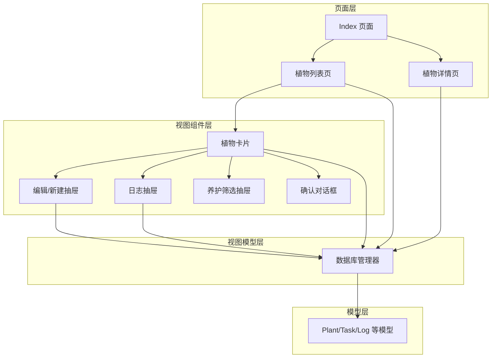

**图表来源**
- [Index.ets:1-200](file://entry/src/main/ets/pages/Index.ets#L1-L200)
- [PlantListPage.ets:1-228](file://entry/src/main/ets/pages/PlantListPage.ets#L1-L228)
- [PlantCard.ets:1-326](file://entry/src/main/ets/view/PlantCard.ets#L1-L326)
- [EditPlantSheet.ets:1-264](file://entry/src/main/ets/view/EditPlantSheet.ets#L1-L264)
- [PlantLogSheet.ets:1-384](file://entry/src/main/ets/view/PlantLogSheet.ets#L1-L384)
- [RdbManager.ets:1-296](file://entry/src/main/ets/viewmodel/RdbManager.ets#L1-L296)

**章节来源**
- [Index.ets:1-200](file://entry/src/main/ets/pages/Index.ets#L1-L200)
- [PlantListPage.ets:1-228](file://entry/src/main/ets/pages/PlantListPage.ets#L1-L228)
- [PlantCard.ets:1-326](file://entry/src/main/ets/view/PlantCard.ets#L1-L326)
- [EditPlantSheet.ets:1-264](file://entry/src/main/ets/view/EditPlantSheet.ets#L1-L264)
- [PlantLogSheet.ets:1-384](file://entry/src/main/ets/view/PlantLogSheet.ets#L1-L384)
- [RdbManager.ets:1-296](file://entry/src/main/ets/viewmodel/RdbManager.ets#L1-L296)

## 核心组件
- 数据模型 PlantModel：定义植物、任务、日志、指标等核心数据结构，并提供草稿对象用于表单编辑态
- 页面 PlantListPage：负责植物列表展示、筛选与排序、任务统计展示
- 组件 PlantCard：单个植物卡片，承载快速操作、进度展示、日志/指标/模板入口
- 页面 PlantDetail：植物详情页，提供快捷功能入口
- 组件 EditPlantSheet：底部抽屉，支持新建/编辑植物、批量生成周期任务、快速浇水
- 组件 PlantLogSheet：日志与照片管理抽屉，支持新增、删除、预览、多选批量删除
- 视图模型 RdbManager：数据库初始化、建表与索引、默认模板注入、活跃光照会话查询

**章节来源**
- [PlantModel.ets:1-166](file://entry/src/main/ets/model/PlantModel.ets#L1-L166)
- [PlantListPage.ets:1-228](file://entry/src/main/ets/pages/PlantListPage.ets#L1-L228)
- [PlantCard.ets:1-326](file://entry/src/main/ets/view/PlantCard.ets#L1-L326)
- [PlantDetail.ets:1-136](file://entry/src/main/ets/pages/PlantDetail.ets#L1-L136)
- [EditPlantSheet.ets:1-264](file://entry/src/main/ets/view/EditPlantSheet.ets#L1-L264)
- [PlantLogSheet.ets:1-384](file://entry/src/main/ets/view/PlantLogSheet.ets#L1-L384)
- [RdbManager.ets:1-296](file://entry/src/main/ets/viewmodel/RdbManager.ets#L1-L296)

## 架构总览
植物管理模块遵循“页面-组件-模型-视图模型”的分层架构：
- 页面层负责路由与状态编排，如 Index 负责数据库初始化与全局状态
- 组件层提供可复用 UI 与交互，如 PlantCard、EditPlantSheet
- 模型层提供数据结构与草稿对象，确保编辑态与持久态分离
- 视图模型层封装数据库访问与业务规则，如 RdbManager

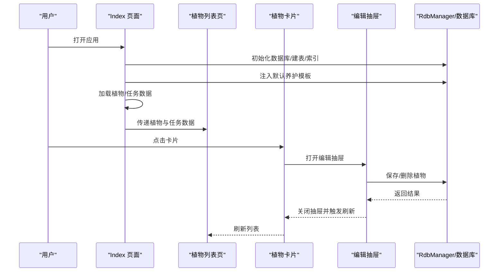

**图表来源**
- [Index.ets:128-141](file://entry/src/main/ets/pages/Index.ets#L128-L141)
- [PlantListPage.ets:153-182](file://entry/src/main/ets/pages/PlantListPage.ets#L153-L182)
- [PlantCard.ets:160-196](file://entry/src/main/ets/view/PlantCard.ets#L160-L196)
- [EditPlantSheet.ets:102-151](file://entry/src/main/ets/view/EditPlantSheet.ets#L102-L151)
- [RdbManager.ets:27-170](file://entry/src/main/ets/viewmodel/RdbManager.ets#L27-L170)

## 详细组件分析

### 数据模型 PlantModel 设计
PlantModel 定义了植物、任务、日志、指标等核心数据结构，并提供草稿对象以隔离编辑态与持久态，降低耦合风险。

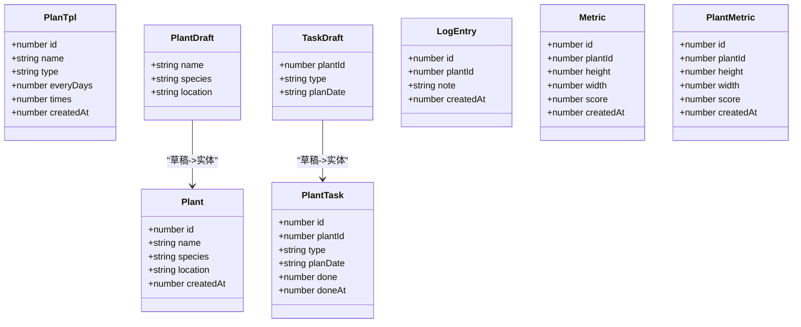

- 字段设计要点
  - 基础信息：id、name、species、location、createdAt
  - 任务信息：plantId、type、planDate、done、doneAt
  - 日志与照片：LogEntry、LogPhoto
  - 指标：Metric/PlantMetric（身高、冠幅、健康分）
- 草稿对象：PlantDraft、TaskDraft 用于表单编辑态，避免直接修改列表实体
- 兼容性：PlantMetric 与 Metric 字段一致，便于页面命名兼容

**图表来源**
- [PlantModel.ets:6-147](file://entry/src/main/ets/model/PlantModel.ets#L6-L147)

**章节来源**
- [PlantModel.ets:1-166](file://entry/src/main/ets/model/PlantModel.ets#L1-L166)

### 植物列表页面 PlantListPage
PlantListPage 负责：
- 接收植物与任务数据，计算每株植物的任务完成数/总数与完成率
- 提供“物种筛选芯片”与“排序芯片”，支持按创建时间、名称、完成率排序
- 将事件向上抛出，由上层页面统一处理保存、删除、打开日志等操作

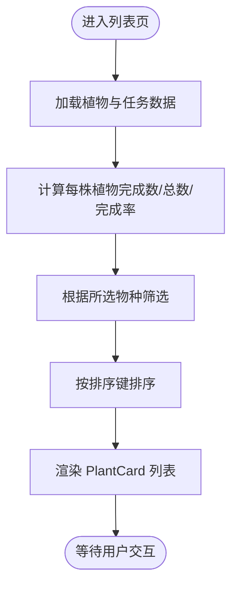

**图表来源**
- [PlantListPage.ets:27-114](file://entry/src/main/ets/pages/PlantListPage.ets#L27-L114)

**章节来源**
- [PlantListPage.ets:1-228](file://entry/src/main/ets/pages/PlantListPage.ets#L1-L228)

### 植物卡片组件 PlantCard
PlantCard 是植物概览与功能入口的聚合节点，具备以下能力：
- 展示植物头像（优先使用日志首图，否则使用首字）、名称、物种与位置
- 显示补光状态与呼吸动画
- 展示任务进度与完成率
- 提供日志、指标、模板、新模板、盆栽、用量估算器等快捷入口
- 支持快速创建今日任务（浇水/施肥/修剪）

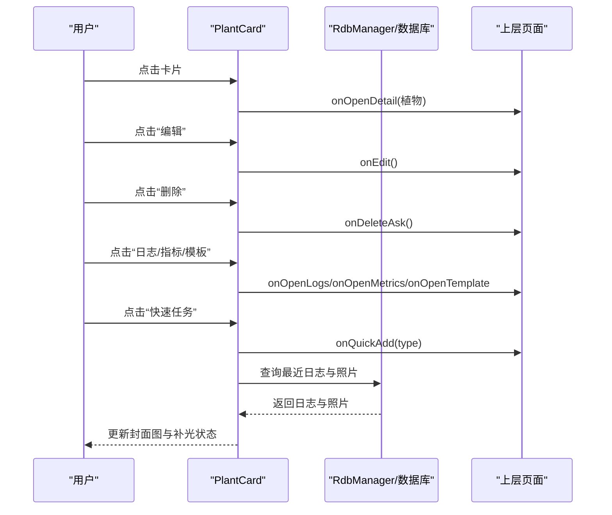

**图表来源**
- [PlantCard.ets:35-111](file://entry/src/main/ets/view/PlantCard.ets#L35-L111)
- [PlantCard.ets:155-196](file://entry/src/main/ets/view/PlantCard.ets#L155-L196)
- [PlantCard.ets:200-266](file://entry/src/main/ets/view/PlantCard.ets#L200-L266)
- [PlantCard.ets:282-324](file://entry/src/main/ets/view/PlantCard.ets#L282-L324)

**章节来源**
- [PlantCard.ets:1-326](file://entry/src/main/ets/view/PlantCard.ets#L1-L326)

### 植物详情页面 PlantDetail
PlantDetail 提供植物详情展示与快捷功能入口：
- 展示植物名称、物种、位置与创建时间
- 提供“养护日志”“光照记录”“生长指标”“成长对比”“浇水估算”“应急与轮换”等快捷卡片

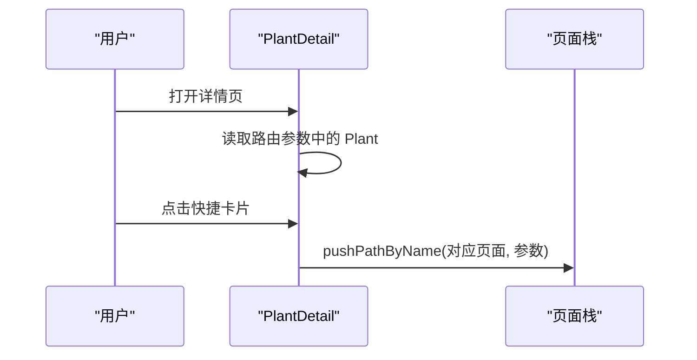

**图表来源**
- [PlantDetail.ets:32-36](file://entry/src/main/ets/pages/PlantDetail.ets#L32-L36)
- [PlantDetail.ets:78-107](file://entry/src/main/ets/pages/PlantDetail.ets#L78-L107)

**章节来源**
- [PlantDetail.ets:1-136](file://entry/src/main/ets/pages/PlantDetail.ets#L1-L136)

### 编辑弹窗 EditPlantSheet
EditPlantSheet 是底部抽屉，支持：
- 表单字段：名称、品种、位置
- 周期任务快捷：每7天×4次(浇水)、每3天×6次(施肥)、每14天×3次(修剪)
- 模板入口、保存、删除、添加今日浇水等操作
- 表单草稿对象与按键动画反馈

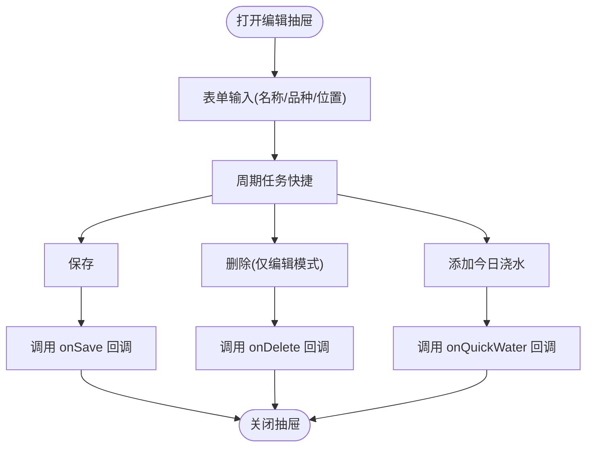

**图表来源**
- [EditPlantSheet.ets:65-73](file://entry/src/main/ets/view/EditPlantSheet.ets#L65-L73)
- [EditPlantSheet.ets:77-88](file://entry/src/main/ets/view/EditPlantSheet.ets#L77-L88)
- [EditPlantSheet.ets:102-151](file://entry/src/main/ets/view/EditPlantSheet.ets#L102-L151)

**章节来源**
- [EditPlantSheet.ets:1-264](file://entry/src/main/ets/view/EditPlantSheet.ets#L1-L264)

### 日志与照片管理 PlantLogSheet
PlantLogSheet 提供日志与照片管理能力：
- 新增日志：支持内容输入与日期选择，默认今天
- 日志列表：支持升序/降序、多选批量删除
- 照片管理：支持选取/拍摄、删除、预览大图
- 与 PlantCard 协作：加载最近日志与照片作为卡片封面

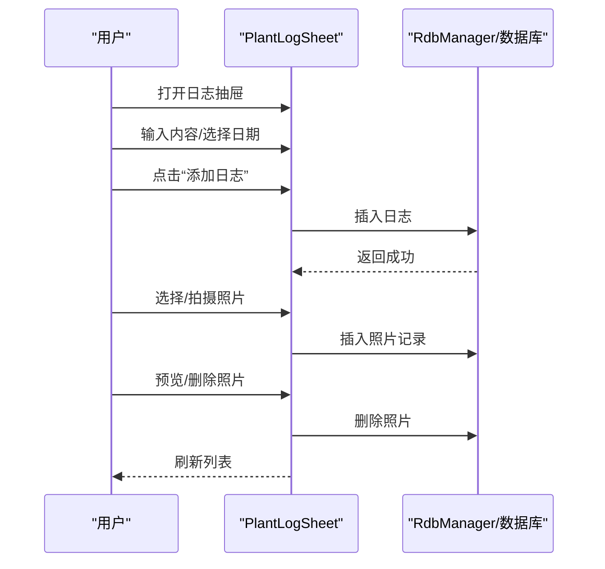

**图表来源**
- [PlantLogSheet.ets:157-203](file://entry/src/main/ets/view/PlantLogSheet.ets#L157-L203)
- [PlantLogSheet.ets:212-248](file://entry/src/main/ets/view/PlantLogSheet.ets#L212-L248)
- [PlantLogSheet.ets:272-282](file://entry/src/main/ets/view/PlantLogSheet.ets#L272-L282)

**章节来源**
- [PlantLogSheet.ets:1-384](file://entry/src/main/ets/view/PlantLogSheet.ets#L1-L384)

### 数据库与索引 RdbManager
RdbManager 负责：
- 数据库初始化与建表：plant、task、tpl、log、metric、log_photo、care_template、care_rule、light_profile、exposure_session
- 索引优化：任务唯一索引、常用查询索引
- 默认养护模板注入：首次空库时写入多类模板与规则
- 活跃光照会话查询：供首页同步补光状态

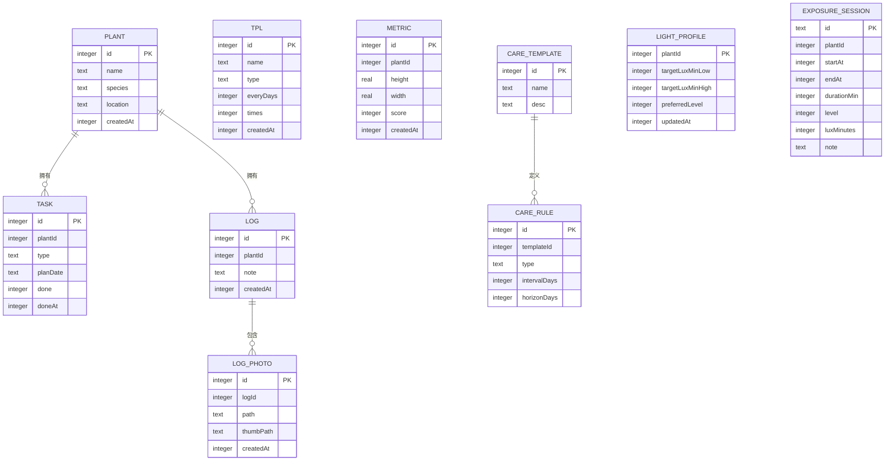

**图表来源**
- [RdbManager.ets:36-129](file://entry/src/main/ets/viewmodel/RdbManager.ets#L36-L129)
- [RdbManager.ets:173-276](file://entry/src/main/ets/viewmodel/RdbManager.ets#L173-L276)

**章节来源**
- [RdbManager.ets:1-296](file://entry/src/main/ets/viewmodel/RdbManager.ets#L1-L296)

### 分类管理、标签系统与搜索过滤
- 物种筛选：列表页根据植物 species 字段动态生成筛选芯片，支持“全部”与具体物种
- 排序策略：按创建时间、名称、完成率排序
- 养护筛选抽屉：支持状态（全部/未完成/已完成）、类型（浇水/施肥/修剪）、日期范围、关键词、排序键与升降序
- 搜索关键词：Index 页面提供全局关键字搜索，匹配植物名称、种类与位置

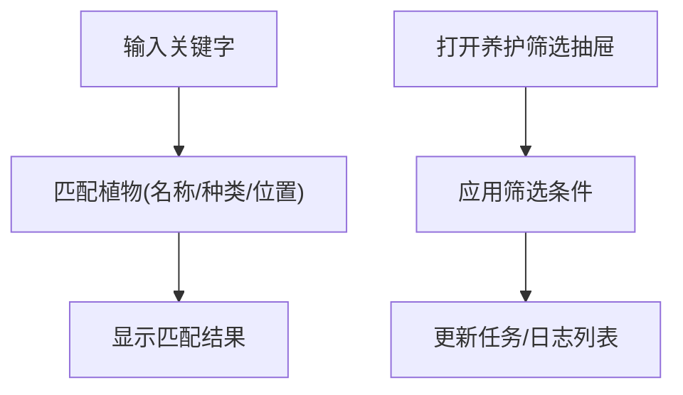

**图表来源**
- [PlantListPage.ets:67-89](file://entry/src/main/ets/pages/PlantListPage.ets#L67-L89)
- [PlantListPage.ets:105-114](file://entry/src/main/ets/pages/PlantListPage.ets#L105-L114)
- [CareFilterSheet.ets:58-86](file://entry/src/main/ets/view/CareFilterSheet.ets#L58-L86)
- [Index.ets:826-834](file://entry/src/main/ets/pages/Index.ets#L826-L834)

**章节来源**
- [PlantListPage.ets:1-228](file://entry/src/main/ets/pages/PlantListPage.ets#L1-L228)
- [CareFilterSheet.ets:1-212](file://entry/src/main/ets/view/CareFilterSheet.ets#L1-L212)
- [Index.ets:826-834](file://entry/src/main/ets/pages/Index.ets#L826-L834)

### 删除确认与安全交互
- 删除确认弹窗 ConfirmDialogSheet 提供统一的确认对话框，支持取消与确认按钮的按压反馈
- PlantCard 在删除时触发 onDeleteAsk 事件，由上层页面决定是否弹出确认对话框并执行删除

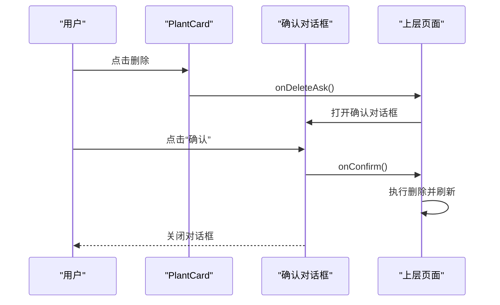

**图表来源**
- [PlantCard.ets:183-196](file://entry/src/main/ets/view/PlantCard.ets#L183-L196)
- [ConfirmDialogSheet.ets:20-84](file://entry/src/main/ets/view/ConfirmDialogSheet.ets#L20-L84)

**章节来源**
- [ConfirmDialogSheet.ets:1-103](file://entry/src/main/ets/view/ConfirmDialogSheet.ets#L1-L103)

## 依赖关系分析
- PlantListPage 依赖 PlantCard 与 RdbManager，负责数据计算与事件转发
- PlantCard 依赖 RdbManager 与 AppStorage，负责状态同步与本地查询
- EditPlantSheet 依赖 PlantDraft 与 RdbManager，负责表单校验与持久化
- PlantLogSheet 依赖 LogEntry/LogPhoto 与 RdbManager，负责日志与照片管理
- Index 作为中枢，协调数据库初始化、数据加载与全局状态

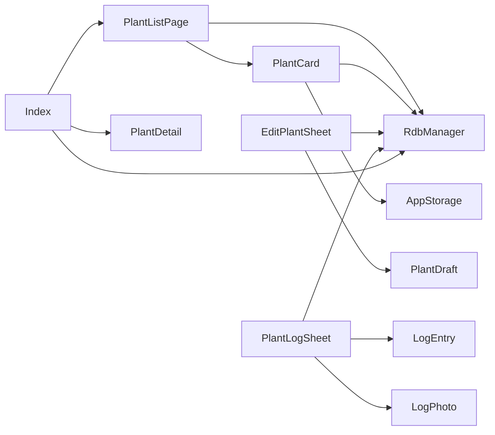

**图表来源**
- [PlantListPage.ets:1-228](file://entry/src/main/ets/pages/PlantListPage.ets#L1-L228)
- [PlantCard.ets:1-326](file://entry/src/main/ets/view/PlantCard.ets#L1-L326)
- [EditPlantSheet.ets:1-264](file://entry/src/main/ets/view/EditPlantSheet.ets#L1-L264)
- [PlantLogSheet.ets:1-384](file://entry/src/main/ets/view/PlantLogSheet.ets#L1-L384)
- [Index.ets:1-200](file://entry/src/main/ets/pages/Index.ets#L1-L200)

**章节来源**
- [PlantListPage.ets:1-228](file://entry/src/main/ets/pages/PlantListPage.ets#L1-L228)
- [PlantCard.ets:1-326](file://entry/src/main/ets/view/PlantCard.ets#L1-L326)
- [EditPlantSheet.ets:1-264](file://entry/src/main/ets/view/EditPlantSheet.ets#L1-L264)
- [PlantLogSheet.ets:1-384](file://entry/src/main/ets/view/PlantLogSheet.ets#L1-L384)
- [Index.ets:1-200](file://entry/src/main/ets/pages/Index.ets#L1-L200)

## 性能考量
- 列表计算与渲染分离：PlantListPage 在页面层计算任务完成率与排序，避免每个卡片重复查询
- 本地状态与动画：PlantCard 使用 AppStorage 与动画提升交互体验，同时减少不必要的重绘
- 数据库索引：RdbManager 为常用查询建立索引，降低查询成本
- 草稿对象：EditPlantSheet 使用 PlantDraft 避免直接修改实体，减少副作用与重绘

[本节为通用性能建议，无需特定文件引用]

## 故障排查指南
- 数据库初始化失败：检查 RdbManager.initDb 是否正确执行，确认上下文与权限
- 列表为空：确认 Index.reloadAll 是否成功加载植物与任务数据
- 日志/照片无法加载：检查 PlantCard 的数据库查询与 RdbManager 表结构
- 删除确认无效：确认 PlantCard 的 onDeleteAsk 事件是否正确传递至上层页面

**章节来源**
- [RdbManager.ets:27-170](file://entry/src/main/ets/viewmodel/RdbManager.ets#L27-L170)
- [Index.ets:138-141](file://entry/src/main/ets/pages/Index.ets#L138-L141)
- [PlantCard.ets:80-111](file://entry/src/main/ets/view/PlantCard.ets#L80-L111)
- [ConfirmDialogSheet.ets:1-103](file://entry/src/main/ets/view/ConfirmDialogSheet.ets#L1-L103)

## 结论
植物管理模块通过清晰的分层设计与组件化实现，提供了完整的植物信息全生命周期管理能力。PlantModel 的草稿对象与 PlantListPage 的本地计算策略提升了交互流畅性；PlantCard 的聚合入口与 PlantLogSheet 的照片管理增强了用户体验；RdbManager 的索引与默认模板注入保障了性能与可用性。该架构易于扩展与定制，适合进一步引入更多养护场景与数据分析能力。

[本节为总结性内容，无需特定文件引用]

## 附录

### 开发者扩展与定制指南
- 扩展 PlantModel 字段
  - 在 Plant/PlantDraft 中添加新字段，确保与数据库表字段一致
  - 若涉及草稿对象，同步更新草稿类
  - 更新 RdbManager 的建表语句与索引
- 新增页面与组件
  - 在 pages 或 view 目录下新增页面/组件，遵循 ObservedV2 与 ComponentV2 约定
  - 通过事件回调与 Provider 注入实现解耦
- 界面定制
  - 使用 AppStorage 控制卡片状态（如补光），并通过动画提升反馈
  - 通过 Builder 子块分离展示与逻辑，避免重复计算

[本节为通用开发指导，无需特定文件引用]