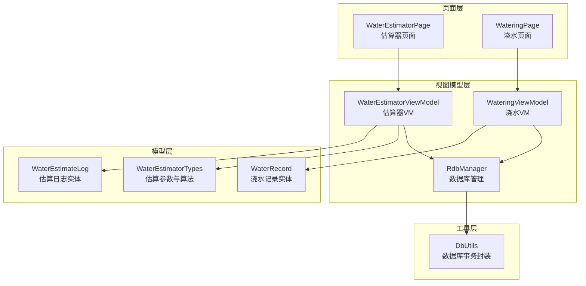
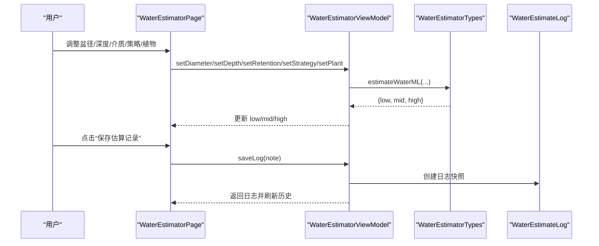
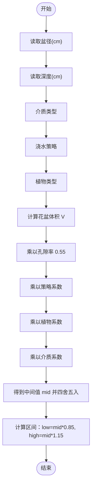
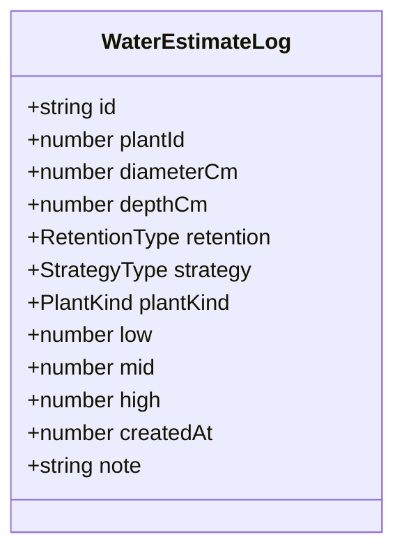
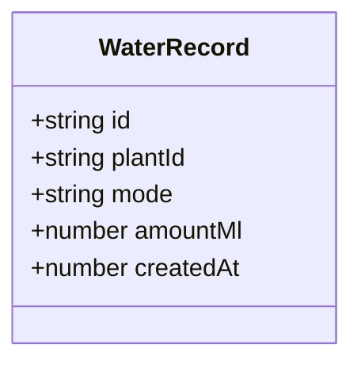
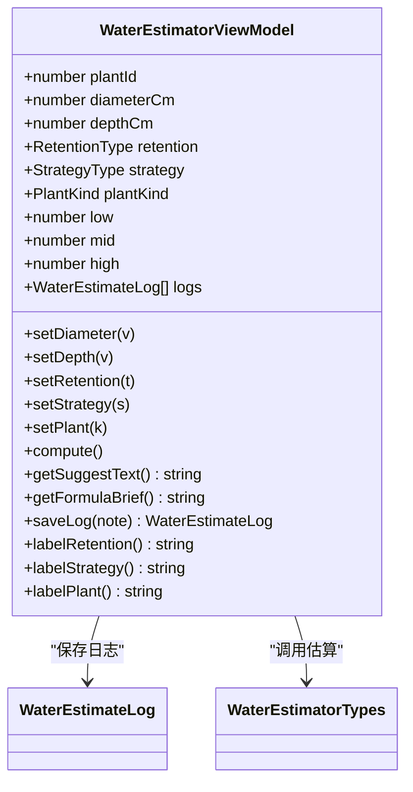
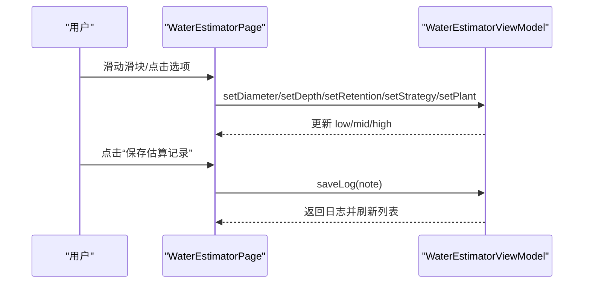
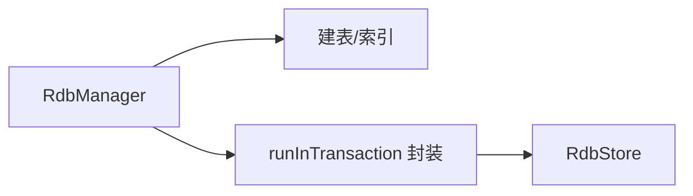
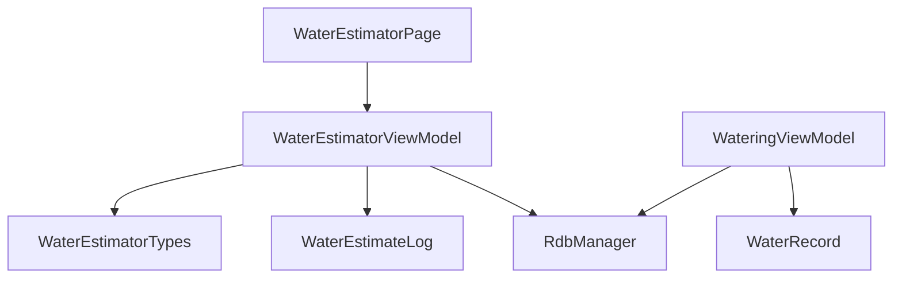

# 浇水估算模块

<cite>
**本文档引用的文件**
- [WaterEstimatorTypes.ts](file://entry/build/default/cache/default/default@CompileArkTS/esmodule/debug/entry/src/main/ets/model/WaterEstimatorTypes.ts)
- [WaterEstimateLog.ets](file://entry/src/main/ets/model/WaterEstimateLog.ets)
- [WaterRecord.ets](file://entry/src/main/ets/model/WaterRecord.ets)
- [WaterEstimatorViewModel.ets](file://entry/src/main/ets/viewmodel/WaterEstimatorViewModel.ets)
- [WaterEstimatorPage.ets](file://entry/src/main/ets/pages/WaterEstimatorPage.ets)
- [WateringViewModel.ets](file://entry/src/main/ets/viewmodel/WateringViewModel.ets)
- [RdbManager.ets](file://entry/src/main/ets/viewmodel/RdbManager.ets)
- [DbUtils.ets](file://entry/src/main/ets/model/DbUtils.ets)
</cite>

## 目录
1. [简介](#简介)
2. [项目结构](#项目结构)
3. [核心组件](#核心组件)
4. [架构总览](#架构总览)
5. [详细组件分析](#详细组件分析)
6. [依赖关系分析](#依赖关系分析)
7. [性能考量](#性能考量)
8. [故障排查指南](#故障排查指南)
9. [结论](#结论)
10. [附录](#附录)

## 简介
本模块提供基于植物特性的智能浇水估算能力，通过输入花盆尺寸、介质类型、浇水策略与植物类型，实时计算出一个安全的用水量区间（下限-推荐-上限），并配套估算日志与浇水记录管理，帮助用户科学、可追溯地进行浇水决策。

## 项目结构
围绕“浇水估算”主题，相关代码分布在以下层次：
- 模型层：估算参数与算法、估算日志与浇水记录实体
- 视图模型层：估算器 VM、浇水 VM、数据库管理
- 页面层：估算器页面、浇水页面
- 工具层：数据库事务封装

**图表来源**
- [WaterEstimatorPage.ets](file://entry/src/main/ets/pages/WaterEstimatorPage.ets)
- [WaterEstimatorViewModel.ets](file://entry/src/main/ets/viewmodel/WaterEstimatorViewModel.ets)
- [WateringViewModel.ets](file://entry/src/main/ets/viewmodel/WateringViewModel.ets)
- [WaterEstimateLog.ets](file://entry/src/main/ets/model/WaterEstimateLog.ets)
- [WaterRecord.ets](file://entry/src/main/ets/model/WaterRecord.ets)
- [WaterEstimatorTypes.ts](file://entry/build/default/cache/default/default@CompileArkTS/esmodule/debug/entry/src/main/ets/model/WaterEstimatorTypes.ts)
- [RdbManager.ets](file://entry/src/main/ets/viewmodel/RdbManager.ets)
- [DbUtils.ets](file://entry/src/main/ets/model/DbUtils.ets)

**章节来源**
- [WaterEstimatorPage.ets](file://entry/src/main/ets/pages/WaterEstimatorPage.ets)
- [WaterEstimatorViewModel.ets](file://entry/src/main/ets/viewmodel/WaterEstimatorViewModel.ets)
- [WateringViewModel.ets](file://entry/src/main/ets/viewmodel/WateringViewModel.ets)
- [WaterEstimateLog.ets](file://entry/src/main/ets/model/WaterEstimateLog.ets)
- [WaterRecord.ets](file://entry/src/main/ets/model/WaterRecord.ets)
- [WaterEstimatorTypes.ts](file://entry/build/default/cache/default/default@CompileArkTS/esmodule/debug/entry/src/main/ets/model/WaterEstimatorTypes.ts)
- [RdbManager.ets](file://entry/src/main/ets/viewmodel/RdbManager.ets)
- [DbUtils.ets](file://entry/src/main/ets/model/DbUtils.ets)

## 核心组件
- 估算参数与算法
  - 介质类型（保水系数）
  - 浇水策略（用水量系数）
  - 植物类型（需水系数）
  - 估算公式：V≈π*(盆径/2)^2*深度 × 孔隙率 × 策略系数 × 植物系数 × 介质系数
  - 结果区间：mid 的 85%~115%
- 估算日志（WaterEstimateLog）
  - 记录输入参数与结果快照，便于历史回溯
- 浇水记录（WaterRecord）
  - 轻量记录，支持页面调用后由上层决定是否持久化
- 估算器 VM（WaterEstimatorViewModel）
  - 维护输入参数、计算结果、估算日志列表
  - 提供建议文案与公式简述
- 估算器页面（WaterEstimatorPage）
  - 提供尺寸滑块、介质/策略/植物类型选择、结果区间展示、保存日志与历史记录查看
- 浇水 VM（WateringViewModel）
  - 管理浇水动画状态、最近浇水时间与连续天数、生成 WaterRecord
- 数据库管理（RdbManager）
  - 统一建表、索引与事务封装，支持估算日志持久化

**章节来源**
- [WaterEstimatorTypes.ts](file://entry/build/default/cache/default/default@CompileArkTS/esmodule/debug/entry/src/main/ets/model/WaterEstimatorTypes.ts)
- [WaterEstimateLog.ets](file://entry/src/main/ets/model/WaterEstimateLog.ets)
- [WaterRecord.ets](file://entry/src/main/ets/model/WaterRecord.ets)
- [WaterEstimatorViewModel.ets](file://entry/src/main/ets/viewmodel/WaterEstimatorViewModel.ets)
- [WaterEstimatorPage.ets](file://entry/src/main/ets/pages/WaterEstimatorPage.ets)
- [WateringViewModel.ets](file://entry/src/main/ets/viewmodel/WateringViewModel.ets)
- [RdbManager.ets](file://entry/src/main/ets/viewmodel/RdbManager.ets)

## 架构总览
估算流程从页面输入开始，VM 实时计算并展示区间值，用户可选择保存估算记录或以“推荐值”记一笔浇水。估算日志目前为内存态，后续可通过数据库管理器持久化。

**图表来源**
- [WaterEstimatorPage.ets](file://entry/src/main/ets/pages/WaterEstimatorPage.ets)
- [WaterEstimatorViewModel.ets](file://entry/src/main/ets/viewmodel/WaterEstimatorViewModel.ets)
- [WaterEstimatorTypes.ts](file://entry/build/default/cache/default/default@CompileArkTS/esmodule/debug/entry/src/main/ets/model/WaterEstimatorTypes.ts)
- [WaterEstimateLog.ets](file://entry/src/main/ets/model/WaterEstimateLog.ets)

## 详细组件分析

### 估算参数与算法
- 介质类型（RetentionType）
  - 砂砾/透水、通用介质、泥炭/保水、兰花介质、椰糠
  - 对应保水系数（0.7~1.2）
- 浇水策略（StrategyType）
  - 彻底浸润（用水量较大）、日常保养（用水量较小）
  - 对应策略系数（0.2~0.35）
- 植物类型（PlantKind）
  - 多肉、观叶、开花植物、兰花、果类植物
  - 对应需水系数（0.7~1.2）
- 估算公式
  - V≈π*(盆径/2)^2*深度 × 孔隙率 × 策略系数 × 植物系数 × 介质系数
  - 结果区间：low=mid×0.85，high=mid×1.15，mid 四舍五入到整数
- 标签转换
  - 提供中文标签用于 UI 展示

**图表来源**
- [WaterEstimatorTypes.ts](file://entry/build/default/cache/default/default@CompileArkTS/esmodule/debug/entry/src/main/ets/model/WaterEstimatorTypes.ts)

**章节来源**
- [WaterEstimatorTypes.ts](file://entry/build/default/cache/default/default@CompileArkTS/esmodule/debug/entry/src/main/ets/model/WaterEstimatorTypes.ts)

### 估算日志（WaterEstimateLog）
- 数据结构
  - id、plantId、diameterCm、depthCm、retention、strategy、plantKind、low、mid、high、createdAt、note
- 存储机制
  - 当前为内存态，保存时将当前输入与结果打包为快照，插入到日志列表首位
  - 建议后续接入数据库，使用统一事务封装保证一致性

**图表来源**
- [WaterEstimateLog.ets](file://entry/src/main/ets/model/WaterEstimateLog.ets)

**章节来源**
- [WaterEstimateLog.ets](file://entry/src/main/ets/model/WaterEstimateLog.ets)

### 浇水记录（WaterRecord）
- 数据结构
  - id、plantId、mode（light/deep）、amountMl、createdAt
- 管理方式
  - 由 VM 在执行浇水时生成 WaterRecord，更新最近浇水时间数组与连续天数
  - 是否持久化由上层决定

**图表来源**
- [WaterRecord.ets](file://entry/src/main/ets/model/WaterRecord.ets)

**章节来源**
- [WaterRecord.ets](file://entry/src/main/ets/model/WaterRecord.ets)
- [WateringViewModel.ets](file://entry/src/main/ets/viewmodel/WateringViewModel.ets)

### 估算器 VM（WaterEstimatorViewModel）
- 输入参数
  - plantId、diameterCm、depthCm、retention、strategy、plantKind
- 计算逻辑
  - 调用模型层估算函数，将结果同步到 low/mid/high
- 建议文案
  - 基于策略与植物类型生成简要建议
- 日志保存
  - 生成日志快照并插入到列表首位
- 标签显示
  - 提供介质、策略、植物类型的中文标签

**图表来源**
- [WaterEstimatorViewModel.ets](file://entry/src/main/ets/viewmodel/WaterEstimatorViewModel.ets)
- [WaterEstimateLog.ets](file://entry/src/main/ets/model/WaterEstimateLog.ets)
- [WaterEstimatorTypes.ts](file://entry/build/default/cache/default/default@CompileArkTS/esmodule/debug/entry/src/main/ets/model/WaterEstimatorTypes.ts)

**章节来源**
- [WaterEstimatorViewModel.ets](file://entry/src/main/ets/viewmodel/WaterEstimatorViewModel.ets)

### 估算器页面（WaterEstimatorPage）
- 用户界面
  - 盆径/深度滑块与快捷按钮
  - 介质类型、浇水策略、植物类型选择
  - 估算结果区间展示与建议文案
  - 备注输入与保存按钮（保存估算记录/以推荐值记一笔）
  - 历史记录列表展示
- 控制流
  - 输入变更自动触发 VM 重新计算
  - 保存后刷新历史列表

**图表来源**
- [WaterEstimatorPage.ets](file://entry/src/main/ets/pages/WaterEstimatorPage.ets)
- [WaterEstimatorViewModel.ets](file://entry/src/main/ets/viewmodel/WaterEstimatorViewModel.ets)

**章节来源**
- [WaterEstimatorPage.ets](file://entry/src/main/ets/pages/WaterEstimatorPage.ets)

### 数据库管理（RdbManager）与事务封装（DbUtils）
- 数据库管理
  - 统一初始化数据库、建表、索引
  - 提供日志表（T_LOG）等结构，支持按 plantId+createdAt 组合索引
- 事务封装
  - runInTransaction 确保批量写入原子性

**图表来源**
- [RdbManager.ets](file://entry/src/main/ets/viewmodel/RdbManager.ets)
- [DbUtils.ets](file://entry/src/main/ets/model/DbUtils.ets)

**章节来源**
- [RdbManager.ets](file://entry/src/main/ets/viewmodel/RdbManager.ets)
- [DbUtils.ets](file://entry/src/main/ets/model/DbUtils.ets)

## 依赖关系分析
- 页面依赖 VM，VM 依赖模型层的估算函数与实体
- VM 与数据库管理器解耦，便于后续接入持久化
- 估算日志与浇水记录均为轻量实体，便于扩展与迁移

**图表来源**
- [WaterEstimatorPage.ets](file://entry/src/main/ets/pages/WaterEstimatorPage.ets)
- [WaterEstimatorViewModel.ets](file://entry/src/main/ets/viewmodel/WaterEstimatorViewModel.ets)
- [WateringViewModel.ets](file://entry/src/main/ets/viewmodel/WateringViewModel.ets)
- [WaterEstimatorTypes.ts](file://entry/build/default/cache/default/default@CompileArkTS/esmodule/debug/entry/src/main/ets/model/WaterEstimatorTypes.ts)
- [WaterEstimateLog.ets](file://entry/src/main/ets/model/WaterEstimateLog.ets)
- [WaterRecord.ets](file://entry/src/main/ets/model/WaterRecord.ets)
- [RdbManager.ets](file://entry/src/main/ets/viewmodel/RdbManager.ets)

**章节来源**
- [WaterEstimatorPage.ets](file://entry/src/main/ets/pages/WaterEstimatorPage.ets)
- [WaterEstimatorViewModel.ets](file://entry/src/main/ets/viewmodel/WaterEstimatorViewModel.ets)
- [WateringViewModel.ets](file://entry/src/main/ets/viewmodel/WateringViewModel.ets)
- [WaterEstimatorTypes.ts](file://entry/build/default/cache/default/default@CompileArkTS/esmodule/debug/entry/src/main/ets/model/WaterEstimatorTypes.ts)
- [WaterEstimateLog.ets](file://entry/src/main/ets/model/WaterEstimateLog.ets)
- [WaterRecord.ets](file://entry/src/main/ets/model/WaterRecord.ets)
- [RdbManager.ets](file://entry/src/main/ets/viewmodel/RdbManager.ets)

## 性能考量
- 计算复杂度
  - 估算函数为 O(1)，滑块与选项切换即时响应，用户体验流畅
- 内存占用
  - 估算日志与浇水记录为轻量对象，列表长度有限，内存压力可控
- 数据持久化
  - 建议将估算日志迁移至数据库，利用索引提升查询效率

[本节为通用指导，无需列出具体文件来源]

## 故障排查指南
- 估算结果异常
  - 检查输入参数范围（盆径/深度限制在 6~60）
  - 确认介质/策略/植物类型选择正确
- 保存日志失败
  - 确认 VM 已实例化且未被销毁
  - 如需持久化，检查数据库初始化与事务封装
- 历史记录不显示
  - 确认 logs 列表非空，页面已刷新

**章节来源**
- [WaterEstimatorViewModel.ets](file://entry/src/main/ets/viewmodel/WaterEstimatorViewModel.ets)
- [WaterEstimatorPage.ets](file://entry/src/main/ets/pages/WaterEstimatorPage.ets)
- [RdbManager.ets](file://entry/src/main/ets/viewmodel/RdbManager.ets)
- [DbUtils.ets](file://entry/src/main/ets/model/DbUtils.ets)

## 结论
本模块通过简洁明确的参数体系与直观的 UI，实现了高效的浇水估算与可追溯的日志管理。建议后续将估算日志接入数据库，并完善用户反馈与精度优化机制，持续提升估算准确性与用户体验。

[本节为总结性内容，无需列出具体文件来源]

## 附录

### 用户界面设计说明
- 植物选择
  - 通过植物类型卡片选择（多肉、观叶、开花植物、兰花、果类植物）
- 估算结果展示
  - 展示下限、推荐、上限三个数值，辅以建议文案与公式简述
- 手动调整功能
  - 盆径/深度滑块与快捷加减按钮，支持快速微调
- 历史记录查看
  - 列表展示每次估算的输入与结果快照，支持备注查看

**章节来源**
- [WaterEstimatorPage.ets](file://entry/src/main/ets/pages/WaterEstimatorPage.ets)

### 浇水建议生成流程
- 策略与植物类型组合生成建议文案
- 建议仅作操作提示，不替代专业园艺诊断

**章节来源**
- [WaterEstimatorViewModel.ets](file://entry/src/main/ets/viewmodel/WaterEstimatorViewModel.ets)

### 精确度控制与用户反馈
- 精确度控制
  - 使用孔隙率与系数组合，结果区间提供安全边界
- 用户反馈
  - 保存估算记录与以推荐值记一笔两种方式，便于后续追踪

**章节来源**
- [WaterEstimatorTypes.ts](file://entry/build/default/cache/default/default@CompileArkTS/esmodule/debug/entry/src/main/ets/model/WaterEstimatorTypes.ts)
- [WaterEstimatorPage.ets](file://entry/src/main/ets/pages/WaterEstimatorPage.ets)

### 开发者指南
- 算法参数配置
  - 在模型层调整介质/策略/植物系数与孔隙率
- 估算精度优化
  - 引入更多环境因素（温度、湿度、光照）与季节性因子
- 扩展新植物类型
  - 在枚举与系数映射中新增类型与系数
- 数据持久化
  - 使用数据库管理器与事务封装，将估算日志写入数据库

**章节来源**
- [WaterEstimatorTypes.ts](file://entry/build/default/cache/default/default@CompileArkTS/esmodule/debug/entry/src/main/ets/model/WaterEstimatorTypes.ts)
- [RdbManager.ets](file://entry/src/main/ets/viewmodel/RdbManager.ets)
- [DbUtils.ets](file://entry/src/main/ets/model/DbUtils.ets)