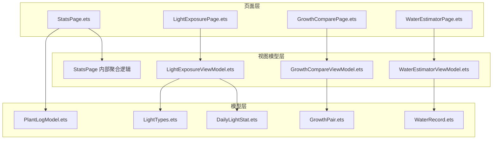
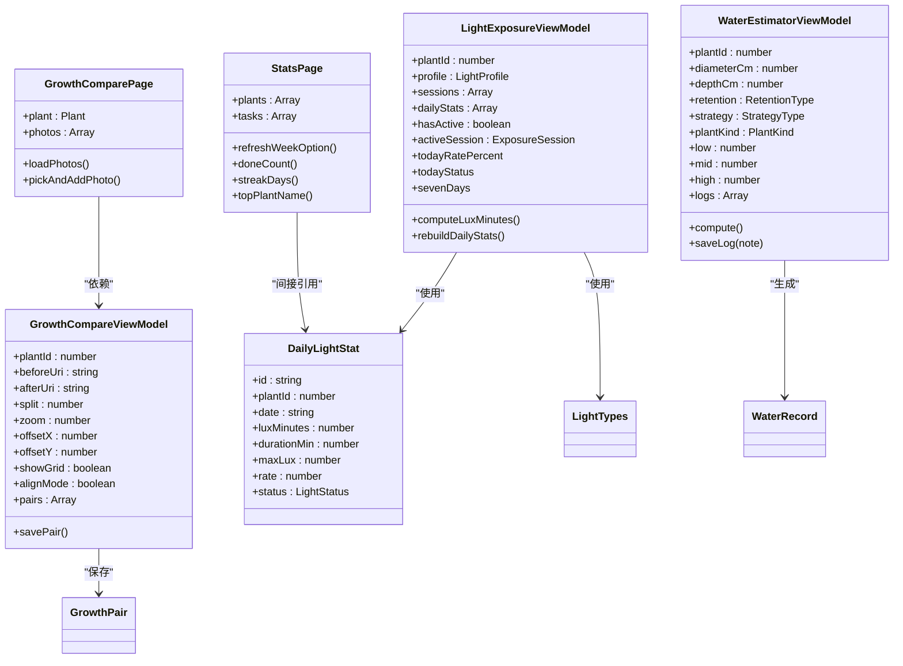
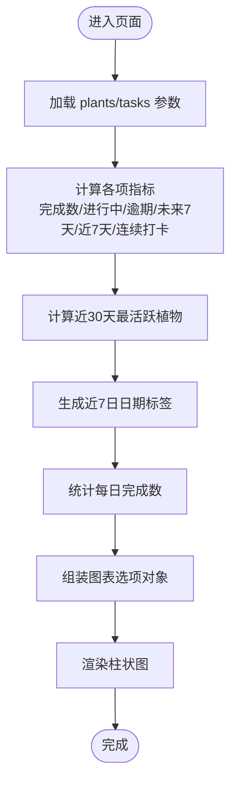
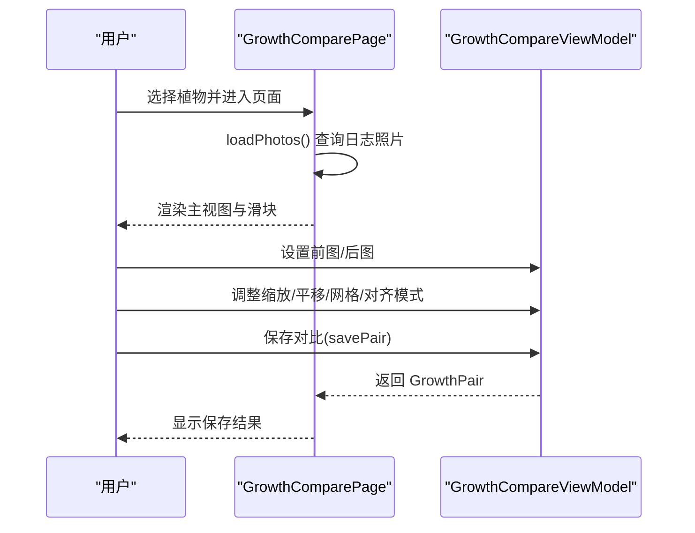
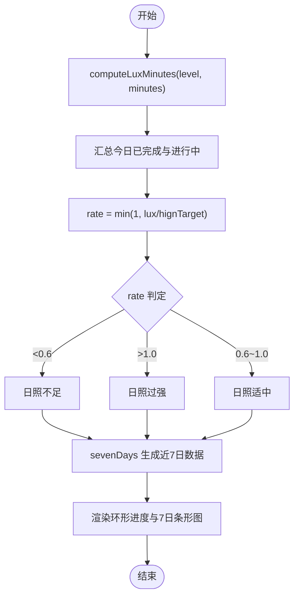
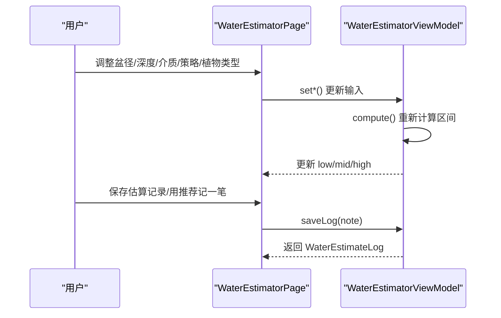
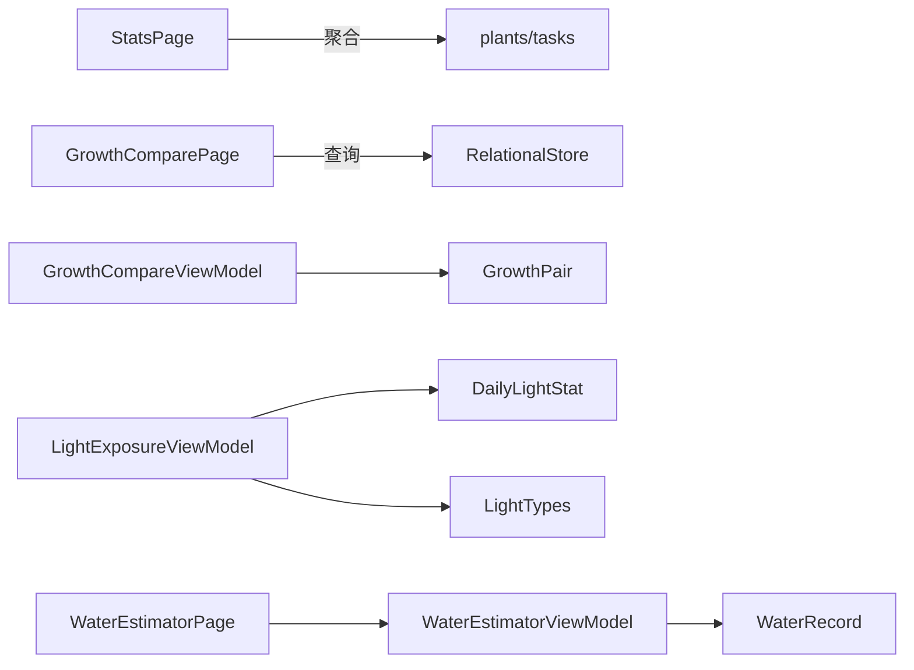

# 统计分析模块

<cite>
**本文档引用的文件**
- [GrowthCompareViewModel.ets](file://entry/src/main/ets/viewmodel/GrowthCompareViewModel.ets)
- [GrowthComparePage.ets](file://entry/src/main/ets/pages/GrowthComparePage.ets)
- [GrowthPair.ets](file://entry/src/main/ets/model/GrowthPair.ets)
- [StatsPage.ets](file://entry/src/main/ets/pages/StatsPage.ets)
- [LightExposureViewModel.ets](file://entry/src/main/ets/viewmodel/LightExposureViewModel.ets)
- [LightExposurePage.ets](file://entry/src/main/ets/pages/LightExposurePage.ets)
- [DailyLightStat.ets](file://entry/src/main/ets/model/DailyLightStat.ets)
- [LightTypes.ets](file://entry/src/main/ets/model/LightTypes.ets)
- [PlantLogModel.ets](file://entry/src/main/ets/model/PlantLogModel.ets)
- [WaterRecord.ets](file://entry/src/main/ets/model/WaterRecord.ets)
- [WaterEstimatorViewModel.ets](file://entry/src/main/ets/viewmodel/WaterEstimatorViewModel.ets)
- [WaterEstimatorPage.ets](file://entry/src/main/ets/pages/WaterEstimatorPage.ets)
</cite>

## 目录
1. [简介](#简介)
2. [项目结构](#项目结构)
3. [核心组件](#核心组件)
4. [架构总览](#架构总览)
5. [详细组件分析](#详细组件分析)
6. [依赖分析](#依赖分析)
7. [性能考量](#性能考量)
8. [故障排查指南](#故障排查指南)
9. [结论](#结论)
10. [附录](#附录)

## 简介
本模块聚焦植物养护数据的统计分析与可视化展示，覆盖以下能力：
- 生长对比分析：基于时间序列的照片对比与浏览，支持前后图对齐与标注。
- 统计页面：任务完成度、活跃度、连续打卡等多维指标聚合与7日趋势展示。
- 光照统计：每日光照达标率、状态分布与7日条形图展示。
- 浇水估算：基于盆器尺寸、介质、策略与植物类型的区间估算与历史记录。

## 项目结构
围绕统计分析的关键文件组织如下：
- 视图模型层：负责数据聚合、状态管理与计算逻辑（如光照、统计、生长对比）。
- 页面层：承载UI与交互，绑定视图模型，驱动图表渲染。
- 模型层：描述数据结构与类型（如光照统计、生长配对、日志与照片等）。

**图表来源**
- [StatsPage.ets:1-442](file://entry/src/main/ets/pages/StatsPage.ets#L1-L442)
- [LightExposureViewModel.ets:1-554](file://entry/src/main/ets/viewmodel/LightExposureViewModel.ets#L1-L554)
- [GrowthCompareViewModel.ets:1-109](file://entry/src/main/ets/viewmodel/GrowthCompareViewModel.ets#L1-L109)
- [WaterEstimatorViewModel.ets:1-130](file://entry/src/main/ets/viewmodel/WaterEstimatorViewModel.ets#L1-L130)
- [DailyLightStat.ets:1-30](file://entry/src/main/ets/model/DailyLightStat.ets#L1-L30)
- [LightTypes.ets:1-124](file://entry/src/main/ets/model/LightTypes.ets#L1-L124)
- [GrowthPair.ets:1-22](file://entry/src/main/ets/model/GrowthPair.ets#L1-L22)
- [PlantLogModel.ets:1-58](file://entry/src/main/ets/model/PlantLogModel.ets#L1-L58)
- [WaterRecord.ets:1-18](file://entry/src/main/ets/model/WaterRecord.ets#L1-L18)

**章节来源**
- [StatsPage.ets:1-442](file://entry/src/main/ets/pages/StatsPage.ets#L1-L442)
- [LightExposureViewModel.ets:1-554](file://entry/src/main/ets/viewmodel/LightExposureViewModel.ets#L1-L554)
- [GrowthCompareViewModel.ets:1-109](file://entry/src/main/ets/viewmodel/GrowthCompareViewModel.ets#L1-L109)
- [WaterEstimatorViewModel.ets:1-130](file://entry/src/main/ets/viewmodel/WaterEstimatorViewModel.ets#L1-L130)

## 核心组件
- 统计页面（StatsPage）
  - 聚合任务健康指标：总数、完成率、进行中、逾期、未来7天、近7天完成、连续打卡。
  - 近7日趋势：基于每日完成数的柱状图展示。
  - 近30天最活跃植物：按完成次数排行。
- 生长对比（GrowthComparePage + GrowthCompareViewModel）
  - 时间序列照片浏览：滑块、网格预览、时间跨度提示。
  - 对齐与标注：前后图对齐、缩放、平移、网格开关、对齐模式。
- 光照统计（LightExposureViewModel + DailyLightStat + LightTypes）
  - 每日光照达标率与状态：基于lux-min与目标上下限计算。
  - 近7日条形图：包含进行中会话的实时叠加。
- 浇水估算（WaterEstimatorViewModel + WaterRecord）
  - 区间估算：基于盆径、深度、介质、策略、植物类型。
  - 历史记录：保存估算快照与建议文案。

**章节来源**
- [StatsPage.ets:64-236](file://entry/src/main/ets/pages/StatsPage.ets#L64-L236)
- [GrowthComparePage.ets:97-374](file://entry/src/main/ets/pages/GrowthComparePage.ets#L97-L374)
- [GrowthCompareViewModel.ets:12-108](file://entry/src/main/ets/viewmodel/GrowthCompareViewModel.ets#L12-L108)
- [LightExposureViewModel.ets:286-506](file://entry/src/main/ets/viewmodel/LightExposureViewModel.ets#L286-L506)
- [DailyLightStat.ets:11-29](file://entry/src/main/ets/model/DailyLightStat.ets#L11-L29)
- [LightTypes.ets:5-124](file://entry/src/main/ets/model/LightTypes.ets#L5-L124)
- [WaterEstimatorViewModel.ets:16-129](file://entry/src/main/ets/viewmodel/WaterEstimatorViewModel.ets#L16-L129)
- [WaterRecord.ets:3-17](file://entry/src/main/ets/model/WaterRecord.ets#L3-L17)

## 架构总览
统计分析采用“页面-视图模型-模型”的分层设计：
- 页面负责UI与交互，绑定参数与事件。
- 视图模型负责数据聚合、状态管理与计算。
- 模型负责数据结构与类型定义。

**图表来源**
- [StatsPage.ets:4-30](file://entry/src/main/ets/pages/StatsPage.ets#L4-L30)
- [GrowthComparePage.ets:10-20](file://entry/src/main/ets/pages/GrowthComparePage.ets#L10-L20)
- [GrowthCompareViewModel.ets:12-27](file://entry/src/main/ets/viewmodel/GrowthCompareViewModel.ets#L12-L27)
- [LightExposureViewModel.ets:16-25](file://entry/src/main/ets/viewmodel/LightExposureViewModel.ets#L16-L25)
- [DailyLightStat.ets:11-29](file://entry/src/main/ets/model/DailyLightStat.ets#L11-L29)
- [LightTypes.ets:5-124](file://entry/src/main/ets/model/LightTypes.ets#L5-L124)
- [WaterEstimatorViewModel.ets:16-37](file://entry/src/main/ets/viewmodel/WaterEstimatorViewModel.ets#L16-L37)
- [WaterRecord.ets:3-17](file://entry/src/main/ets/model/WaterRecord.ets#L3-L17)

## 详细组件分析

### 统计页面（StatsPage）数据聚合与可视化
- 指标聚合
  - 总体概览：植物数、任务数、完成率、进行中、逾期、未来7天、近7天完成、连续打卡。
  - 近30天最活跃植物：按完成次数排行，返回植物名与次数。
- 近7日趋势
  - 日期标签与完成数数组一一对应，通过图表选项对象驱动渲染。
- 刷新机制
  - 提供刷新入口，调用回调后重新聚合并更新图表配置。

**图表来源**
- [StatsPage.ets:64-290](file://entry/src/main/ets/pages/StatsPage.ets#L64-L290)

**章节来源**
- [StatsPage.ets:64-290](file://entry/src/main/ets/pages/StatsPage.ets#L64-L290)

### 生长对比分析（GrowthComparePage + GrowthCompareViewModel）
- 功能要点
  - 时间序列照片浏览：主视图突出当前照片，底部滑块与网格预览支持快速跳转。
  - 对齐与标注：支持前后图对齐、缩放、平移、网格开关与对齐模式。
  - 保存对比：生成对比对并持久化（内存版，后续可替换为RDB）。
- 数据流
  - 页面加载照片并渲染；用户操作对齐参数；保存时固化图片关系与备注。

**图表来源**
- [GrowthComparePage.ets:354-374](file://entry/src/main/ets/pages/GrowthComparePage.ets#L354-L374)
- [GrowthCompareViewModel.ets:33-107](file://entry/src/main/ets/viewmodel/GrowthCompareViewModel.ets#L33-L107)

**章节来源**
- [GrowthComparePage.ets:97-374](file://entry/src/main/ets/pages/GrowthComparePage.ets#L97-L374)
- [GrowthCompareViewModel.ets:12-108](file://entry/src/main/ets/viewmodel/GrowthCompareViewModel.ets#L12-L108)
- [GrowthPair.ets:4-21](file://entry/src/main/ets/model/GrowthPair.ets#L4-L21)

### 光照统计（LightExposureViewModel + DailyLightStat + LightTypes）
- 计算逻辑
  - 光照量（lux-min）：基于光照级别权重与时长计算。
  - 达标率与状态：基于目标上限与累计lux-min计算达标率并判定状态。
  - 近7日统计：包含进行中会话的实时叠加，确保图表一致性。
- 类型与工具
  - 光照级别与状态枚举、标签与颜色映射、日期格式化与比率限制等工具函数。

**图表来源**
- [LightExposureViewModel.ets:286-506](file://entry/src/main/ets/viewmodel/LightExposureViewModel.ets#L286-L506)
- [DailyLightStat.ets:11-29](file://entry/src/main/ets/model/DailyLightStat.ets#L11-L29)
- [LightTypes.ets:58-124](file://entry/src/main/ets/model/LightTypes.ets#L58-L124)

**章节来源**
- [LightExposureViewModel.ets:286-506](file://entry/src/main/ets/viewmodel/LightExposureViewModel.ets#L286-L506)
- [DailyLightStat.ets:11-29](file://entry/src/main/ets/model/DailyLightStat.ets#L11-L29)
- [LightTypes.ets:58-124](file://entry/src/main/ets/model/LightTypes.ets#L58-L124)

### 浇水估算（WaterEstimatorViewModel + WaterRecord）
- 计算与建议
  - 基于盆径、深度、介质、策略、植物类型计算区间（低/中/高）。
  - 生成建议文案与简要公式说明。
- 历史记录
  - 保存估算快照，包含输入参数与结果，支持备注。

**图表来源**
- [WaterEstimatorPage.ets:10-22](file://entry/src/main/ets/pages/WaterEstimatorPage.ets#L10-L22)
- [WaterEstimatorViewModel.ets:34-123](file://entry/src/main/ets/viewmodel/WaterEstimatorViewModel.ets#L34-L123)
- [WaterRecord.ets:3-17](file://entry/src/main/ets/model/WaterRecord.ets#L3-L17)

**章节来源**
- [WaterEstimatorViewModel.ets:16-129](file://entry/src/main/ets/viewmodel/WaterEstimatorViewModel.ets#L16-L129)
- [WaterEstimatorPage.ets:10-490](file://entry/src/main/ets/pages/WaterEstimatorPage.ets#L10-L490)
- [WaterRecord.ets:3-17](file://entry/src/main/ets/model/WaterRecord.ets#L3-L17)

## 依赖分析
- 组件耦合
  - StatsPage 依赖 plants/tasks 参数进行聚合，内部通过方法计算指标并驱动图表。
  - GrowthComparePage 依赖 RdbManager 查询日志照片，ViewModel 负责对齐与保存。
  - LightExposureViewModel 依赖 DailyLightStat 与 LightTypes 进行统计与状态计算。
  - WaterEstimatorViewModel 依赖 WaterRecord 生成估算快照。
- 外部依赖
  - 图表库：McBarChart 用于柱状图渲染。
  - 数据库：RelationalStore 用于光照与日志数据持久化。

**图表来源**
- [StatsPage.ets:7-11](file://entry/src/main/ets/pages/StatsPage.ets#L7-L11)
- [GrowthComparePage.ets:3-9](file://entry/src/main/ets/pages/GrowthComparePage.ets#L3-L9)
- [GrowthCompareViewModel.ets:4-27](file://entry/src/main/ets/viewmodel/GrowthCompareViewModel.ets#L4-L27)
- [LightExposureViewModel.ets:5-10](file://entry/src/main/ets/viewmodel/LightExposureViewModel.ets#L5-L10)
- [DailyLightStat.ets:5-29](file://entry/src/main/ets/model/DailyLightStat.ets#L5-L29)
- [LightTypes.ets:5-124](file://entry/src/main/ets/model/LightTypes.ets#L5-L124)
- [WaterEstimatorViewModel.ets:4-8](file://entry/src/main/ets/viewmodel/WaterEstimatorViewModel.ets#L4-L8)
- [WaterRecord.ets:3-17](file://entry/src/main/ets/model/WaterRecord.ets#L3-L17)

**章节来源**
- [StatsPage.ets:1-442](file://entry/src/main/ets/pages/StatsPage.ets#L1-L442)
- [GrowthComparePage.ets:1-477](file://entry/src/main/ets/pages/GrowthComparePage.ets#L1-L477)
- [LightExposureViewModel.ets:1-554](file://entry/src/main/ets/viewmodel/LightExposureViewModel.ets#L1-L554)
- [WaterEstimatorViewModel.ets:1-130](file://entry/src/main/ets/viewmodel/WaterEstimatorViewModel.ets#L1-L130)

## 性能考量
- 数据聚合
  - StatsPage 的聚合逻辑在页面进入与刷新时执行，建议在数据量较大时采用分页或延迟计算。
- 图表渲染
  - 近7日趋势使用静态选项对象，避免在渲染过程中频繁重组数据。
- 实时更新
  - 光照页面通过定时器驱动 tick 更新，确保进行中会话的达标率与状态实时变化。
- I/O 优化
  - 生长对比新增照片时先确保应用私有目录存在，减少失败重试与IO开销。

[本节为通用指导，无需特定文件引用]

## 故障排查指南
- 光照统计异常
  - 检查目标上限是否为0，避免除零风险；确认进行中会话是否正确结束。
  - 参考：达标率计算与状态判定逻辑。
- 生长对比保存失败
  - 确认前后图URI非空；检查对齐参数范围限制。
  - 参考：canSave/savePair 与对齐参数约束。
- 统计页面指标异常
  - 核对日期边界与计划日期比较逻辑；确认完成时间戳格式。
  - 参考：近7天完成、连续打卡与最活跃植物计算。
- 浇水估算结果异常
  - 检查输入参数范围与单位；确认策略与植物类型映射。
  - 参考：估算区间计算与建议文案生成。

**章节来源**
- [LightExposureViewModel.ets:372-444](file://entry/src/main/ets/viewmodel/LightExposureViewModel.ets#L372-L444)
- [GrowthCompareViewModel.ets:89-107](file://entry/src/main/ets/viewmodel/GrowthCompareViewModel.ets#L89-L107)
- [StatsPage.ets:117-207](file://entry/src/main/ets/pages/StatsPage.ets#L117-L207)
- [WaterEstimatorViewModel.ets:74-96](file://entry/src/main/ets/viewmodel/WaterEstimatorViewModel.ets#L74-L96)

## 结论
统计分析模块通过清晰的分层设计实现了多维度数据的聚合与可视化：
- StatsPage 提供任务健康指标与7日趋势。
- GrowthCompareViewModel/页面支持时间序列照片对比与对齐。
- LightExposureViewModel 提供光照达标率与7日统计。
- WaterEstimatorViewModel 提供浇水估算与历史记录。
模块具备良好的扩展性，便于新增指标与图表样式定制。

[本节为总结，无需特定文件引用]

## 附录
- 开发指南
  - 新增指标：在 StatsPage 中新增聚合方法与UI卡片；在 LightExposureViewModel 中扩展 DailyLightStat 字段并在 sevenDays 中处理。
  - 图表样式定制：通过 McBarChart 的 Options 对象调整标题、坐标轴、图例、动画与系列数据。
  - 数据过滤：在聚合方法中增加日期范围、植物ID等过滤条件；确保边界日期处理一致。
  - 算法扩展：在 LightExposureViewModel 中扩展 computeLuxMinutes 或引入新的状态枚举；在 WaterEstimatorViewModel 中扩展估算公式与系数。

[本节为通用指导，无需特定文件引用]