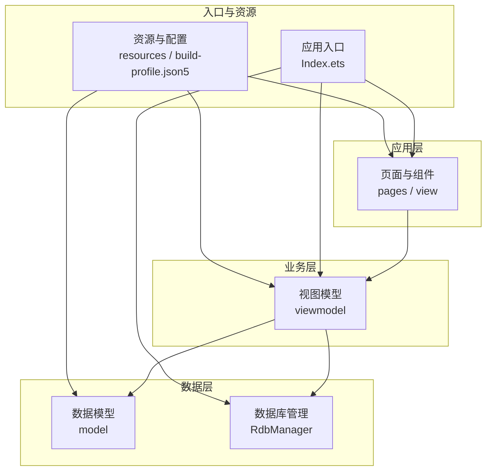
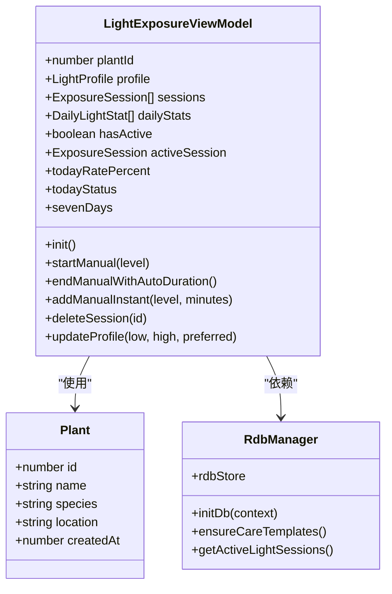
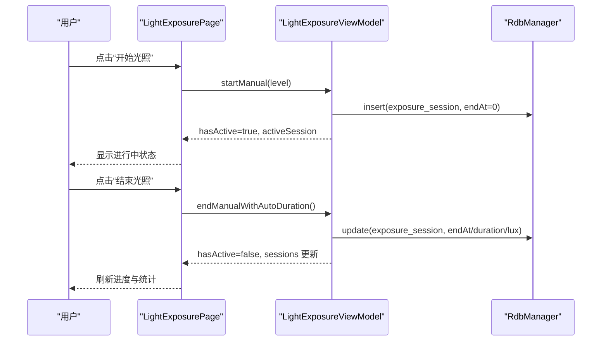
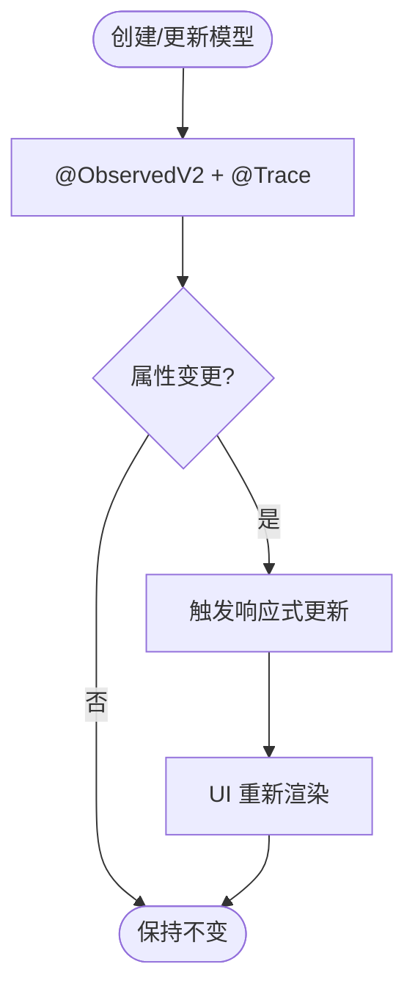
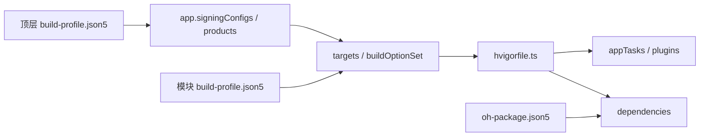
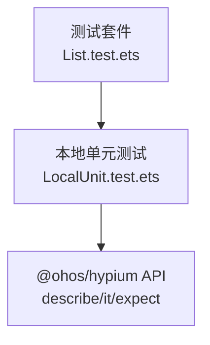

# 开发指南

<cite>
**本文引用的文件**
- [PROJECT_GUIDE.md](file://PROJECT_GUIDE.md)
- [CODE_ANNOTATIONS.md](file://CODE_ANNOTATIONS.md)
- [build-profile.json5](file://build-profile.json5)
- [entry/build-profile.json5](file://entry/build-profile.json5)
- [hvigorfile.ts](file://hvigorfile.ts)
- [entry/src/main/ets/pages/Index.ets](file://entry/src/main/ets/pages/Index.ets)
- [entry/src/main/ets/viewmodel/LightExposureViewModel.ets](file://entry/src/main/ets/viewmodel/LightExposureViewModel.ets)
- [entry/src/main/ets/model/PlantModel.ets](file://entry/src/main/ets/model/PlantModel.ets)
- [entry/src/main/ets/viewmodel/RdbManager.ets](file://entry/src/main/ets/viewmodel/RdbManager.ets)
- [entry/src/main/ets/pages/LightExposurePage.ets](file://entry/src/main/ets/pages/LightExposurePage.ets)
- [entry/src/test/List.test.ets](file://entry/src/test/List.test.ets)
- [entry/src/test/LocalUnit.test.ets](file://entry/src/test/LocalUnit.test.ets)
- [entry/oh-package.json5](file://entry/oh-package.json5)
- [code-linter.json5](file://code-linter.json5)
</cite>

## 目录
1. [简介](#简介)
2. [项目结构](#项目结构)
3. [核心组件](#核心组件)
4. [架构总览](#架构总览)
5. [详细组件分析](#详细组件分析)
6. [依赖关系分析](#依赖关系分析)
7. [性能与内存优化](#性能与内存优化)
8. [调试与排错](#调试与排错)
9. [测试体系](#测试体系)
10. [版本控制与CI流程](#版本控制与ci流程)
11. [开发环境与工作流](#开发环境与工作流)
12. [结论](#结论)

## 简介
本指南面向植物日记项目（HarmonyOS + ArkTS）的开发者，系统阐述开发规范、编码标准、最佳实践与工程化流程。内容涵盖：
- ArkTS 语言与装饰器使用规范
- MVVM 架构下的响应式编程模式
- 代码组织结构、文件命名与模块导入规则
- 调试技巧、性能优化与内存管理策略
- 单元测试、集成测试与自动化测试
- 版本控制、代码评审与持续集成流程
- 新人入职的环境配置与工作流说明

## 项目结构
项目采用分层清晰的目录组织：AppScope、entry 模块、资源与构建配置分离。核心目录与职责如下：
- AppScope：应用级资源配置与字符串、媒体资源
- entry/src/main/ets：
  - model：数据模型层（响应式装饰器标注）
  - viewmodel：业务逻辑层（ViewModel + 数据库管理）
  - view：可复用 UI 组件
  - pages：页面层（导航与交互）
  - utils：工具模块
  - resources：页面级资源（颜色、尺寸、媒体、页面配置）
- entry/ohosTest：设备端测试
- entry/test：本地测试套件
- 构建与打包：build-profile.json5、hvigorfile.ts、oh-package.json5

**图表来源**
- [entry/src/main/ets/pages/Index.ets](file://entry/src/main/ets/pages/Index.ets)
- [entry/src/main/ets/viewmodel/LightExposureViewModel.ets](file://entry/src/main/ets/viewmodel/LightExposureViewModel.ets)
- [entry/src/main/ets/viewmodel/RdbManager.ets](file://entry/src/main/ets/viewmodel/RdbManager.ets)
- [entry/src/main/ets/model/PlantModel.ets](file://entry/src/main/ets/model/PlantModel.ets)

**章节来源**
- [PROJECT_GUIDE.md](file://PROJECT_GUIDE.md)
- [entry/src/main/ets/pages/Index.ets](file://entry/src/main/ets/pages/Index.ets)

## 核心组件
- 数据模型（Model）：使用 @ObservedV2 + @Trace 装饰器实现响应式更新，典型如 Plant、PlantTask、Metric 等。
- 视图模型（ViewModel）：封装业务逻辑与数据持久化，如 LightExposureViewModel、RdbManager。
- 页面（Pages）：承载 UI 与交互，如 LightExposurePage。
- 应用入口（Index）：集中初始化数据库、全局状态与导航栈。

**章节来源**
- [PROJECT_GUIDE.md](file://PROJECT_GUIDE.md)
- [entry/src/main/ets/model/PlantModel.ets](file://entry/src/main/ets/model/PlantModel.ets)
- [entry/src/main/ets/viewmodel/LightExposureViewModel.ets](file://entry/src/main/ets/viewmodel/LightExposureViewModel.ets)
- [entry/src/main/ets/viewmodel/RdbManager.ets](file://entry/src/main/ets/viewmodel/RdbManager.ets)
- [entry/src/main/ets/pages/LightExposurePage.ets](file://entry/src/main/ets/pages/LightExposurePage.ets)
- [entry/src/main/ets/pages/Index.ets](file://entry/src/main/ets/pages/Index.ets)

## 架构总览
项目采用 MVVM 架构，页面仅与 ViewModel 交互，ViewModel 负责数据加载、业务计算与数据库操作，Model 作为纯数据载体参与响应式更新。

**图表来源**
- [entry/src/main/ets/model/PlantModel.ets](file://entry/src/main/ets/model/PlantModel.ets)
- [entry/src/main/ets/viewmodel/LightExposureViewModel.ets](file://entry/src/main/ets/viewmodel/LightExposureViewModel.ets)
- [entry/src/main/ets/viewmodel/RdbManager.ets](file://entry/src/main/ets/viewmodel/RdbManager.ets)

## 详细组件分析

### 光照记录模块（页面 + ViewModel + 数据库）
- 页面：LightExposurePage 提供开始/结束光照、手动补记、实时进度与 7 日统计展示。
- ViewModel：LightExposureViewModel 负责会话管理、统计计算、目标配置更新与数据库交互。
- 数据库：RdbManager 统一建表、索引与默认数据，提供 getActiveLightSessions 等查询。

**图表来源**
- [entry/src/main/ets/pages/LightExposurePage.ets](file://entry/src/main/ets/pages/LightExposurePage.ets)
- [entry/src/main/ets/viewmodel/LightExposureViewModel.ets](file://entry/src/main/ets/viewmodel/LightExposureViewModel.ets)
- [entry/src/main/ets/viewmodel/RdbManager.ets](file://entry/src/main/ets/viewmodel/RdbManager.ets)

**章节来源**
- [entry/src/main/ets/pages/LightExposurePage.ets](file://entry/src/main/ets/pages/LightExposurePage.ets)
- [entry/src/main/ets/viewmodel/LightExposureViewModel.ets](file://entry/src/main/ets/viewmodel/LightExposureViewModel.ets)
- [entry/src/main/ets/viewmodel/RdbManager.ets](file://entry/src/main/ets/viewmodel/RdbManager.ets)

### 数据模型与状态装饰器
- @ObservedV2：类级响应式装饰器，使模型具备自动更新能力。
- @Trace：属性级装饰器，精确追踪变化以驱动 UI 更新。
- @State/@Prop/@Link/@Local/@Consumer：页面状态管理装饰器，分别用于组件内部、父子传递、双向绑定、页面间共享与消费全局状态。

**图表来源**
- [entry/src/main/ets/model/PlantModel.ets](file://entry/src/main/ets/model/PlantModel.ets)
- [PROJECT_GUIDE.md](file://PROJECT_GUIDE.md)

**章节来源**
- [entry/src/main/ets/model/PlantModel.ets](file://entry/src/main/ets/model/PlantModel.ets)
- [PROJECT_GUIDE.md](file://PROJECT_GUIDE.md)

### 应用入口与全局状态
- Index 作为应用状态中枢，负责数据库初始化、全局数据加载与导航栈管理。
- 通过 @Provider 注入 RdbManager、store、pageStack 等全局依赖，供各页面共享。

**章节来源**
- [entry/src/main/ets/pages/Index.ets](file://entry/src/main/ets/pages/Index.ets)

## 依赖关系分析
- 构建与产品配置：顶层与模块级 build-profile.json5 控制签名、目标 SDK、构建选项与产物配置。
- 依赖声明：entry/oh-package.json5 声明模块依赖。
- 插件与任务：hvigorfile.ts 使用内置 appTasks，支持扩展插件。

**图表来源**
- [build-profile.json5](file://build-profile.json5)
- [entry/build-profile.json5](file://entry/build-profile.json5)
- [hvigorfile.ts](file://hvigorfile.ts)
- [entry/oh-package.json5](file://entry/oh-package.json5)

**章节来源**
- [build-profile.json5](file://build-profile.json5)
- [entry/build-profile.json5](file://entry/build-profile.json5)
- [hvigorfile.ts](file://hvigorfile.ts)
- [entry/oh-package.json5](file://entry/oh-package.json5)

## 性能与内存优化
- 避免在 build() 中执行复杂计算，将耗时逻辑移至 ViewModel 或后台任务。
- 使用 @ObservedV2 精准追踪数据变化，减少不必要的 UI 重绘。
- 大数据列表优先使用 LazyForEach 与虚拟滚动。
- 数据库查询使用参数化 SQL 与索引优化，避免全表扫描。
- 合理使用定时器刷新（如光照页每秒刷新），注意销毁时机防止内存泄漏。

**章节来源**
- [PROJECT_GUIDE.md](file://PROJECT_GUIDE.md)
- [entry/src/main/ets/pages/LightExposurePage.ets](file://entry/src/main/ets/pages/LightExposurePage.ets)
- [entry/src/main/ets/viewmodel/RdbManager.ets](file://entry/src/main/ets/viewmodel/RdbManager.ets)

## 调试与排错
- 日志输出：使用 hilog.info 输出关键信息，console.error 输出错误。
- 用户提示：使用 prompt.showToast 提示用户操作结果。
- 状态追踪：利用 @Trace 装饰器观察属性变化，结合定时刷新保证实时性。
- 数据一致性：数据库事务与批量删除需保证原子性，失败回滚并提示。

**章节来源**
- [CODE_ANNOTATIONS.md](file://CODE_ANNOTATIONS.md)
- [entry/src/main/ets/pages/LightExposurePage.ets](file://entry/src/main/ets/pages/LightExposurePage.ets)
- [entry/src/main/ets/pages/Index.ets](file://entry/src/main/ets/pages/Index.ets)

## 测试体系
- 单元测试：使用 @ohos/hypium 框架，提供 describe/it/assert 等 API。
- 测试套件：entry/src/test/List.test.ets 聚合本地测试。
- 设备端测试：entry/ohosTest 目录用于设备端测试。

**图表来源**
- [entry/src/test/List.test.ets](file://entry/src/test/List.test.ets)
- [entry/src/test/LocalUnit.test.ets](file://entry/src/test/LocalUnit.test.ets)

**章节来源**
- [entry/src/test/List.test.ets](file://entry/src/test/List.test.ets)
- [entry/src/test/LocalUnit.test.ets](file://entry/src/test/LocalUnit.test.ets)

## 版本控制与CI流程
- 版本控制：遵循 Git 工作流，分支策略建议采用 feature/bugfix/release 等命名规范。
- 代码评审：PR 必须通过静态检查与单元测试，至少一名 reviewer 通过。
- 持续集成：结合构建配置与 hvigor 任务，自动化执行 lint、编译与测试。

**章节来源**
- [code-linter.json5](file://code-linter.json5)
- [build-profile.json5](file://build-profile.json5)
- [hvigorfile.ts](file://hvigorfile.ts)

## 开发环境与工作流
- 环境准备：安装 DevEco Studio、HarmonyOS SDK、ArkTS 工具链。
- 项目导入：打开仓库根目录，系统自动识别 hvigor 与模块配置。
- 本地运行：使用 DevEco Studio 的预览或真机调试。
- 构建发布：根据 build-profile.json5 配置签名与产物，执行 release 构建。
- 代码规范：遵循 @typescript-eslint 与 @performance 插件规则，启用安全规则集。

**章节来源**
- [build-profile.json5](file://build-profile.json5)
- [entry/build-profile.json5](file://entry/build-profile.json5)
- [hvigorfile.ts](file://hvigorfile.ts)
- [code-linter.json5](file://code-linter.json5)

## 结论
本指南总结了植物日记项目在 ArkTS + HarmonyOS 环境下的开发规范与工程化实践。建议团队在日常开发中严格遵循：
- 响应式装饰器与 MVVM 分层
- 数据库建模与索引优化
- 测试先行与自动化保障
- 版本控制与 CI 流程
- 性能与内存优化策略

通过以上规范与流程，可显著提升开发效率与代码质量，降低维护成本。