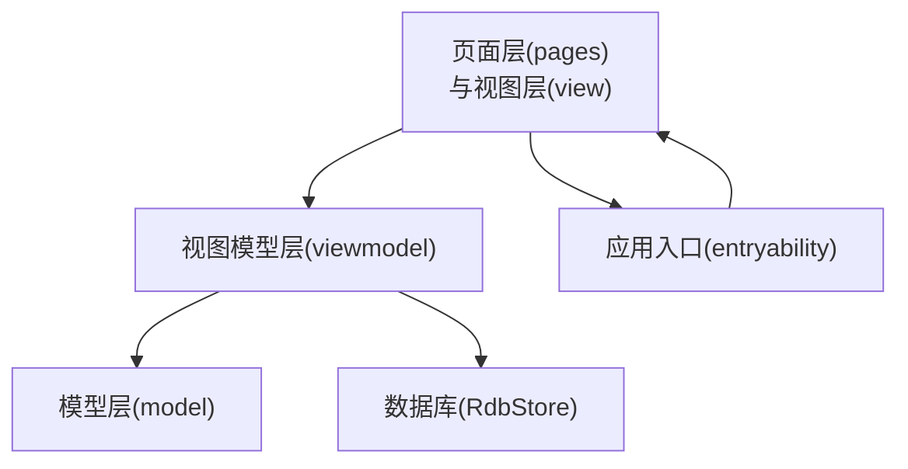
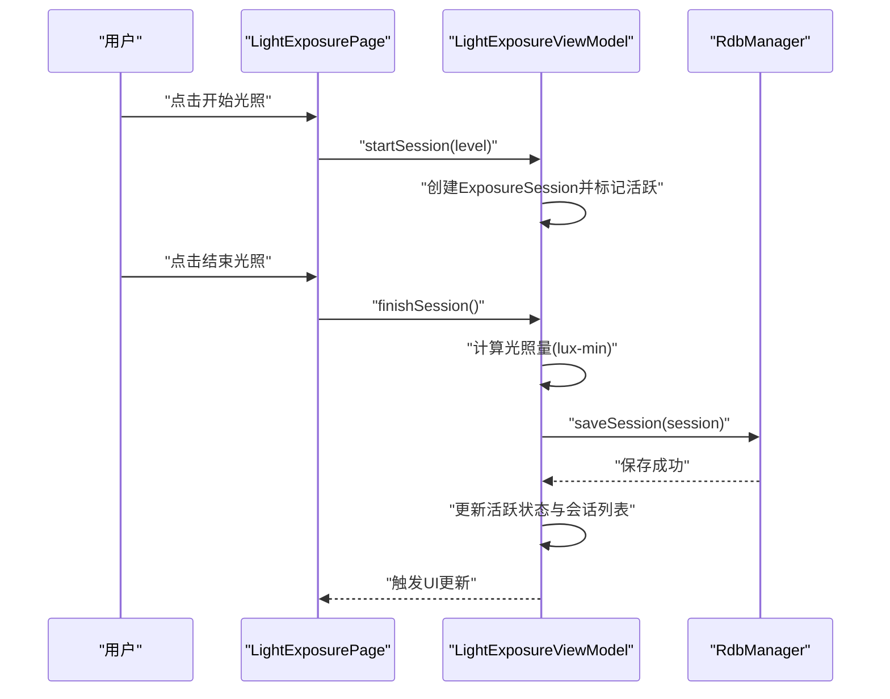
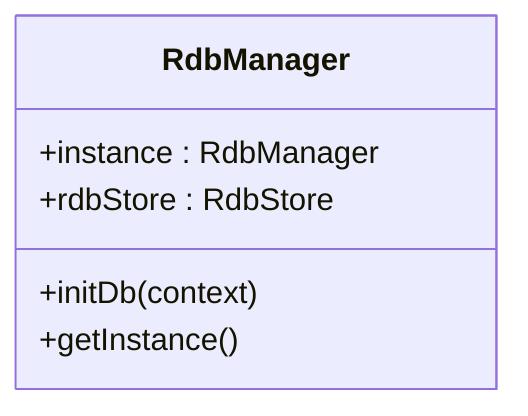
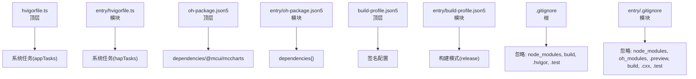

# 开发流程

<cite>
**本文引用的文件**   
- [PROJECT_GUIDE.md](file://PROJECT_GUIDE.md)
- [CODE_ANNOTATIONS.md](file://CODE_ANNOTATIONS.md)
- [build-profile.json5](file://build-profile.json5)
- [entry/build-profile.json5](file://entry/build-profile.json5)
- [hvigorfile.ts](file://hvigorfile.ts)
- [entry/hvigorfile.ts](file://entry/hvigorfile.ts)
- [oh-package.json5](file://oh-package.json5)
- [entry/oh-package.json5](file://entry/oh-package.json5)
- [entry/.gitignore](file://entry/.gitignore)
- [.gitignore](file://.gitignore)
- [AppScope/app.json5](file://AppScope/app.json5)
- [entry/src/main/module.json5](file://entry/src/main/module.json5)
- [entry/src/main/resources/base/profile/main_pages.json](file://entry/src/main/resources/base/profile/main_pages.json)
- [entry/src/main/resources/base/profile/backup_config.json](file://entry/src/main/resources/base/profile/backup_config.json)
- [entry/src/main/resources/base/media/layered_image.json](file://entry/src/main/resources/base/media/layered_image.json)
- [entry/src/main/resources/base/element/string.json](file://entry/src/main/resources/base/element/string.json)
- [entry/src/main/resources/dark/element/color.json](file://entry/src/main/resources/dark/element/color.json)
- [entry/src/main/resources/rawfile/](file://entry/src/main/resources/rawfile/)
- [entry/src/main/ets/pages/Index.ets](file://entry/src/main/ets/pages/Index.ets)
- [entry/src/main/ets/pages/LightExposurePage.ets](file://entry/src/main/ets/pages/LightExposurePage.ets)
- [entry/src/main/ets/pages/WaterEstimatorPage.ets](file://entry/src/main/ets/pages/WaterEstimatorPage.ets)
- [entry/src/main/ets/pages/EmergencyAndRotatePage.ets](file://entry/src/main/ets/pages/EmergencyAndRotatePage.ets)
- [entry/src/main/ets/pages/GrowthComparePage.ets](file://entry/src/main/ets/pages/GrowthComparePage.ets)
- [entry/src/main/ets/pages/GrowthIndicatorPage.ets](file://entry/src/main/ets/pages/GrowthIndicatorPage.ets)
- [entry/src/main/ets/viewmodel/LightExposureViewModel.ets](file://entry/src/main/ets/viewmodel/LightExposureViewModel.ets)
- [entry/src/main/ets/viewmodel/RdbManager.ets](file://entry/src/main/ets/viewmodel/RdbManager.ets)
- [entry/src/main/ets/model/ExposureSession.ets](file://entry/src/main/ets/model/ExposureSession.ets)
- [entry/src/main/ets/model/LightTypes.ets](file://entry/src/main/ets/model/LightTypes.ets)
- [entry/src/main/ets/model/PlantModel.ets](file://entry/src/main/ets/model/PlantModel.ets)
- [entry/src/main/ets/entryability/EntryAbility.ets](file://entry/src/main/ets/entryability/EntryAbility.ets)
- [entry/src/main/ets/entrybackupability/EntryBackupAbility.ets](file://entry/src/main/ets/entrybackupability/EntryBackupAbility.ets)
- [entry/src/main/ets/view/PlantCard.ets](file://entry/src/main/ets/view/PlantCard.ets)
- [entry/src/main/ets/view/CalendarGrid.ets](file://entry/src/main/ets/view/CalendarGrid.ets)
- [entry/src/main/ets/view/CalendarView.ets](file://entry/src/main/ets/view/CalendarView.ets)
- [entry/src/main/ets/view/TaskItem.ets](file://entry/src/main/ets/view/TaskItem.ets)
- [entry/src/main/ets/view/LogRowItem.ets](file://entry/src/main/ets/view/LogRowItem.ets)
- [entry/src/main/ets/view/PhotoAttachBar.ets](file://entry/src/main/ets/view/PhotoAttachBar.ets)
- [entry/src/main/ets/view/TemplateManagerSheet.ets](file://entry/src/main/ets/view/TemplateManagerSheet.ets)
- [entry/src/main/ets/view/TemplateApplySheet.ets](file://entry/src/main/ets/view/TemplateApplySheet.ets)
- [entry/src/main/ets/view/MetricSheet.ets](file://entry/src/main/ets/view/MetricSheet.ets)
- [entry/src/main/ets/view/MetricChartSheet.ets](file://entry/src/main/ets/view/MetricChartSheet.ets)
- [entry/src/main/ets/view/ConfirmDialogSheet.ets](file://entry/src/main/ets/view/ConfirmDialogSheet.ets)
- [entry/src/main/ets/view/EditPlantSheet.ets](file://entry/src/main/ets/view/EditPlantSheet.ets)
- [entry/src/main/ets/view/DayTaskSheet.ets](file://entry/src/main/ets/view/DayTaskSheet.ets)
- [entry/src/main/ets/view/TaskCalendarGate.ets](file://entry/src/main/ets/view/TaskCalendarGate.ets)
- [entry/src/main/ets/view/PlantLogSheet.ets](file://entry/src/main/ets/view/PlantLogSheet.ets)
- [entry/src/main/ets/view/CareTemplateSheet.ets](file://entry/src/main/ets/view/CareTemplateSheet.ets)
- [entry/src/main/ets/view/CareFilterSheet.ets](file://entry/src/main/ets/view/CareFilterSheet.ets)
- [entry/src/main/ets/view/TaskStatsSheet.ets](file://entry/src/main/ets/view/TaskStatsSheet.ets)
- [entry/src/main/ets/view/PhotoPreviewSheet.ets](file://entry/src/main/ets/view/PhotoPreviewSheet.ets)
- [entry/src/main/ets/view/EnvSimulatorPage.ets](file://entry/src/main/ets/view/EnvSimulatorPage.ets)
- [entry/src/main/ets/view/EnvSimulatorViewModel.ets](file://entry/src/main/ets/view/EnvSimulatorViewModel.ets)
- [entry/src/main/ets/view/EnvSimulatorTypes.ets](file://entry/src/main/ets/view/EnvSimulatorTypes.ets)
- [entry/src/main/ets/view/PlantDetail.ets](file://entry/src/main/ets/view/PlantDetail.ets)
- [entry/src/main/ets/view/PlantListPage.ets](file://entry/src/main/ets/view/PlantListPage.ets)
- [entry/src/main/ets/view/PlantLogPage.ets](file://entry/src/main/ets/view/PlantLogPage.ets)
- [entry/src/main/ets/view/StatsPage.ets](file://entry/src/main/ets/view/StatsPage.ets)
- [entry/src/main/ets/view/TaskListPage.ets](file://entry/src/main/ets/view/TaskListPage.ets)
- [entry/src/main/ets/view/WateringPage.ets](file://entry/src/main/ets/view/WateringPage.ets)
- [entry/src/main/ets/view/WaterEstimatorPage.ets](file://entry/src/main/ets/view/WaterEstimatorPage.ets)
- [entry/src/main/ets/view/MixPlannerPage.ets](file://entry/src/main/ets/view/MixPlannerPage.ets)
- [entry/src/main/ets/view/GrowthComparePage.ets](file://entry/src/main/ets/view/GrowthComparePage.ets)
- [entry/src/main/ets/view/GrowthIndicatorPage.ets](file://entry/src/main/ets/view/GrowthIndicatorPage.ets)
- [entry/src/main/ets/view/EmergencyAndRotatePage.ets](file://entry/src/main/ets/view/EmergencyAndRotatePage.ets)
- [entry/src/main/ets/view/CalendarSheet.ets](file://entry/src/main/ets/view/CalendarSheet.ets)
- [entry/src/main/ets/view/CompareSliderV2.ets](file://entry/src/main/ets/view/CompareSliderV2.ets)
- [entry/src/main/ets/view/EText.ets](file://entry/src/main/ets/view/EText.ets)
- [entry/src/main/ets/view/PlantRenderer.ets](file://entry/src/main/ets/view/PlantRenderer.ets)
- [entry/src/main/ets/view/WaterParticle.ets](file://entry/src/main/ets/view/WaterParticle.ets)
- [entry/src/main/ets/viewmodel/AddImageFileViewModel.ets](file://entry/src/main/ets/viewmodel/AddImageFileViewModel.ets)
- [entry/src/main/ets/viewmodel/EmergencyViewModel.ets](file://entry/src/main/ets/viewmodel/EmergencyViewModel.ets)
- [entry/src/main/ets/viewmodel/GrowthCompareViewModel.ets](file://entry/src/main/ets/viewmodel/GrowthCompareViewModel.ets)
- [entry/src/main/ets/viewmodel/LightExposureViewModel.ets](file://entry/src/main/ets/viewmodel/LightExposureViewModel.ets)
- [entry/src/main/ets/viewmodel/RotatePlanViewModel.ets](file://entry/src/main/ets/viewmodel/RotatePlanViewModel.ets)
- [entry/src/main/ets/viewmodel/WaterEstimatorViewModel.ets](file://entry/src/main/ets/viewmodel/WaterEstimatorViewModel.ets)
- [entry/src/main/ets/viewmodel/WateringViewModel.ets](file://entry/src/main/ets/viewmodel/WateringViewModel.ets)
- [entry/src/main/ets/viewmodel/MixPlannerViewModel.ets](file://entry/src/main/ets/viewmodel/MixPlannerViewModel.ets)
- [entry/src/main/ets/viewmodel/RdbManager.ets](file://entry/src/main/ets/viewmodel/RdbManager.ets)
- [entry/src/main/ets/viewmodel/err.ets](file://entry/src/main/ets/viewmodel/err.ets)
- [entry/src/main/ets/utils/](file://entry/src/main/ets/utils/)
- [entry/src/main/ets/component/PlantRenderer.ets](file://entry/src/main/ets/component/PlantRenderer.ets)
- [entry/src/main/ets/component/WaterParticle.ets](file://entry/src/main/ets/component/WaterParticle.ets)
</cite>

## 目录
1. [简介](#简介)
2. [项目结构](#项目结构)
3. [核心组件](#核心组件)
4. [架构总览](#架构总览)
5. [详细组件分析](#详细组件分析)
6. [依赖分析](#依赖分析)
7. [性能考虑](#性能考虑)
8. [故障排除指南](#故障排除指南)
9. [结论](#结论)
10. [附录](#附录)

## 简介
本文件面向植物日记项目的开发团队，提供从开发环境搭建到应用发布的完整开发流程说明。内容涵盖版本控制策略、分支管理、提交规范与代码审查流程；持续集成与持续部署的配置思路；开发环境配置（DevEco Studio 设置、模拟器与真机调试）；功能开发标准流程（需求分析、设计评审、编码实现、测试验证）；团队协作最佳实践（任务分配、进度跟踪、质量保证）；以及故障排除与回滚策略，确保开发过程的稳定性与可靠性。

## 项目结构
项目采用模块化与分层架构组织，主体位于 entry 模块，采用 MVVM 架构模式，目录结构清晰，便于扩展与维护。

- 应用级配置与签名
  - 应用级构建配置与签名信息位于根目录与 entry 目录的构建配置文件中，分别定义了 debug/release 构建模式与签名材料。
- 模块与页面
  - 模块清单与页面路由配置位于模块资源 profile 中，首页路由在主页面配置中定义。
- 资源与主题
  - 基础元素、媒体资源与深色主题颜色资源位于模块资源目录中，支持多套资源与主题切换。
- 代码分层
  - model 层：数据模型与工具类型，负责数据结构与状态装饰。
  - viewmodel 层：业务逻辑与数据持久化，负责状态管理与数据库交互。
  - view 层：可复用 UI 组件与页面，负责界面展示与交互。
  - pages 层：页面入口与业务页面，负责页面导航与业务流程。
  - component 层：基础组件，负责通用 UI 元素封装。
  - entryability/entrybackupability：应用入口与备用入口，负责应用生命周期与启动流程。

```mermaid
graph TB
subgraph "应用层"
AB["EntryAbility<br/>应用入口"]
BA["EntryBackupAbility<br/>备用入口"]
end
subgraph "页面层(pages)"
IDX["Index<br/>首页"]
LEP["LightExposurePage<br/>光照记录页"]
WEP["WaterEstimatorPage<br/>浇水估算页"]
ERP["EmergencyAndRotatePage<br/>急救与转盆页"]
GCP["GrowthComparePage<br/>生长对比页"]
GIP["GrowthIndicatorPage<br/>生长指标页"]
end
subgraph "视图层(view)"
PC["PlantCard<br/>植物卡片"]
CG["CalendarGrid<br/>日历网格"]
CV["CalendarView<br/>日历视图"]
TI["TaskItem<br/>任务项"]
LR["LogRowItem<br/>日志行"]
PAB["PhotoAttachBar<br/>照片附件栏"]
TM["TemplateManagerSheet<br/>模板管理"]
TA["TemplateApplySheet<br/>模板应用"]
MS["MetricSheet<br/>指标表"]
MCS["MetricChartSheet<br/>指标图表"]
CDS["ConfirmDialogSheet<br/>确认对话框"]
EPS["EditPlantSheet<br/>编辑植物"]
DTS["DayTaskSheet<br/>当日任务"]
TCG["TaskCalendarGate<br/>任务日历门"]
PLS["PlantLogSheet<br/>植物日志"]
CTS["CareTemplateSheet<br/>养护模板"]
CFS["CareFilterSheet<br/>养护筛选"]
TSS["TaskStatsSheet<br/>任务统计"]
PPP["PhotoPreviewSheet<br/>照片预览"]
ESP["EnvSimulatorPage<br/>环境模拟器页"]
end
subgraph "视图模型层(viewmodel)"
LVM["LightExposureViewModel<br/>光照记录VM"]
RDB["RdbManager<br/>数据库管理"]
WEM["WaterEstimatorViewModel<br/>浇水估算VM"]
GCV["GrowthCompareViewModel<br/>生长对比VM"]
EM["EmergencyViewModel<br/>急救VM"]
RPM["RotatePlanViewModel<br/>转盆计划VM"]
WVM["WateringViewModel<br/>浇水VM"]
MPVM["MixPlannerViewModel<br/>配土VM"]
ERR["err<br/>错误处理"]
end
subgraph "模型层(model)"
ES["ExposureSession<br/>光照会话"]
LT["LightTypes<br/>光照类型"]
PM["PlantModel<br/>植物模型"]
end
AB --> IDX
BA --> IDX
IDX --> LEP
IDX --> WEP
IDX --> ERP
IDX --> GCP
IDX --> GIP
LEP --> LVM
WEP --> WEM
ERP --> EM
GCP --> GCV
GIP --> GCV
LVM --> RDB
WEM --> RDB
GCV --> RDB
EM --> RDB
RPM --> RDB
WVM --> RDB
MPVM --> RDB
LVM --> ES
LVM --> LT
LVM --> PM
WEM --> PM
GCV --> PM
EM --> PM
RPM --> PM
WVM --> PM
MPVM --> PM
PC --> PM
CG --> PM
CV --> PM
TI --> PM
LR --> PM
PAB --> PM
TM --> PM
TA --> PM
MS --> PM
MCS --> PM
CDS --> PM
EPS --> PM
```

**图表来源**
- [entry/src/main/ets/pages/Index.ets](file://entry/src/main/ets/pages/Index.ets)
- [entry/src/main/ets/pages/LightExposurePage.ets](file://entry/src/main/ets/pages/LightExposurePage.ets)
- [entry/src/main/ets/pages/WaterEstimatorPage.ets](file://entry/src/main/ets/pages/WaterEstimatorPage.ets)
- [entry/src/main/ets/pages/EmergencyAndRotatePage.ets](file://entry/src/main/ets/pages/EmergencyAndRotatePage.ets)
- [entry/src/main/ets/pages/GrowthComparePage.ets](file://entry/src/main/ets/pages/GrowthComparePage.ets)
- [entry/src/main/ets/pages/GrowthIndicatorPage.ets](file://entry/src/main/ets/pages/GrowthIndicatorPage.ets)
- [entry/src/main/ets/viewmodel/LightExposureViewModel.ets](file://entry/src/main/ets/viewmodel/LightExposureViewModel.ets)
- [entry/src/main/ets/viewmodel/RdbManager.ets](file://entry/src/main/ets/viewmodel/RdbManager.ets)
- [entry/src/main/ets/viewmodel/WaterEstimatorViewModel.ets](file://entry/src/main/ets/viewmodel/WaterEstimatorViewModel.ets)
- [entry/src/main/ets/viewmodel/GrowthCompareViewModel.ets](file://entry/src/main/ets/viewmodel/GrowthCompareViewModel.ets)
- [entry/src/main/ets/viewmodel/EmergencyViewModel.ets](file://entry/src/main/ets/viewmodel/EmergencyViewModel.ets)
- [entry/src/main/ets/viewmodel/RotatePlanViewModel.ets](file://entry/src/main/ets/viewmodel/RotatePlanViewModel.ets)
- [entry/src/main/ets/viewmodel/WateringViewModel.ets](file://entry/src/main/ets/viewmodel/WateringViewModel.ets)
- [entry/src/main/ets/viewmodel/MixPlannerViewModel.ets](file://entry/src/main/ets/viewmodel/MixPlannerViewModel.ets)
- [entry/src/main/ets/viewmodel/err.ets](file://entry/src/main/ets/viewmodel/err.ets)
- [entry/src/main/ets/model/ExposureSession.ets](file://entry/src/main/ets/model/ExposureSession.ets)
- [entry/src/main/ets/model/LightTypes.ets](file://entry/src/main/ets/model/LightTypes.ets)
- [entry/src/main/ets/model/PlantModel.ets](file://entry/src/main/ets/model/PlantModel.ets)
- [entry/src/main/ets/entryability/EntryAbility.ets](file://entry/src/main/ets/entryability/EntryAbility.ets)
- [entry/src/main/ets/entrybackupability/EntryBackupAbility.ets](file://entry/src/main/ets/entrybackupability/EntryBackupAbility.ets)

**章节来源**
- [PROJECT_GUIDE.md:1-38](file://PROJECT_GUIDE.md#L1-L38)
- [entry/src/main/resources/base/profile/main_pages.json](file://entry/src/main/resources/base/profile/main_pages.json)
- [entry/src/main/resources/base/profile/backup_config.json](file://entry/src/main/resources/base/profile/backup_config.json)

## 核心组件
- 数据模型（Model）
  - 使用响应式装饰器进行状态追踪，确保数据变化时 UI 自动更新。
  - 核心模型包括植物、光照会话、光照类型、每日光照统计等。
- 视图模型（ViewModel）
  - 负责业务逻辑处理、数据持久化与状态管理。
  - 包括光照记录、浇水估算、数据库管理、生长对比、急救与转盆、配土计划等。
- 视图（View）
  - 可复用组件与页面，负责界面展示与交互。
  - 包括植物卡片、日历网格、任务项、日志行、照片附件栏、模板管理、指标表与图表、对话框、编辑面板、任务统计、照片预览、环境模拟器等。
- 页面（Pages）
  - 页面入口与业务页面，负责页面导航与业务流程。
  - 包括首页、光照记录页、浇水估算页、急救与转盆页、生长对比页、生长指标页等。
- 基础组件（Component）
  - 基础 UI 元素封装，如植物渲染器与水粒子效果。
- 应用入口（EntryAbility/EntryBackupAbility）
  - 应用生命周期与启动流程，负责应用初始化与备用入口。

**章节来源**
- [PROJECT_GUIDE.md:42-82](file://PROJECT_GUIDE.md#L42-L82)
- [CODE_ANNOTATIONS.md:13-141](file://CODE_ANNOTATIONS.md#L13-L141)
- [CODE_ANNOTATIONS.md:143-201](file://CODE_ANNOTATIONS.md#L143-L201)
- [CODE_ANNOTATIONS.md:271-326](file://CODE_ANNOTATIONS.md#L271-L326)

## 架构总览
系统采用 MVVM 架构，页面通过 ViewModel 与模型层交互，ViewModel 负责业务逻辑与数据持久化，模型层提供响应式数据结构。页面层与视图层解耦，组件可复用，便于扩展与维护。

**图表来源**
- [entry/src/main/ets/pages/LightExposurePage.ets](file://entry/src/main/ets/pages/LightExposurePage.ets)
- [entry/src/main/ets/viewmodel/LightExposureViewModel.ets](file://entry/src/main/ets/viewmodel/LightExposureViewModel.ets)
- [entry/src/main/ets/viewmodel/RdbManager.ets](file://entry/src/main/ets/viewmodel/RdbManager.ets)
- [entry/src/main/ets/model/ExposureSession.ets](file://entry/src/main/ets/model/ExposureSession.ets)
- [entry/src/main/ets/entryability/EntryAbility.ets](file://entry/src/main/ets/entryability/EntryAbility.ets)

## 详细组件分析

### 光照记录模块
- 页面职责
  - 实时光照进度显示、开始/结束光照、手动补记、历史记录查看。
- 核心流程
  - 用户选择光照级别，点击开始创建会话；结束时计算光照量并保存至数据库；更新 UI 显示。
- 关键实现
  - 页面通过 ViewModel 管理状态与业务逻辑，使用响应式装饰器确保 UI 自动更新。
  - ViewModel 负责会话创建、结束、计算光照量与数据库保存。

**图表来源**
- [entry/src/main/ets/pages/LightExposurePage.ets](file://entry/src/main/ets/pages/LightExposurePage.ets)
- [entry/src/main/ets/viewmodel/LightExposureViewModel.ets](file://entry/src/main/ets/viewmodel/LightExposureViewModel.ets)
- [entry/src/main/ets/viewmodel/RdbManager.ets](file://entry/src/main/ets/viewmodel/RdbManager.ets)
- [entry/src/main/ets/model/ExposureSession.ets](file://entry/src/main/ets/model/ExposureSession.ets)

**章节来源**
- [PROJECT_GUIDE.md:126-143](file://PROJECT_GUIDE.md#L126-L143)
- [CODE_ANNOTATIONS.md:273-326](file://CODE_ANNOTATIONS.md#L273-L326)
- [CODE_ANNOTATIONS.md:145-201](file://CODE_ANNOTATIONS.md#L145-L201)

### 数据库管理模块
- 职责
  - 数据库初始化、表结构创建、索引管理、默认数据种子。
- 关键实现
  - 单例模式管理数据库实例，异步初始化数据库连接。
  - 使用 SQL 建表与索引优化查询性能。

**图表来源**
- [entry/src/main/ets/viewmodel/RdbManager.ets](file://entry/src/main/ets/viewmodel/RdbManager.ets)

**章节来源**
- [CODE_ANNOTATIONS.md:204-268](file://CODE_ANNOTATIONS.md#L204-L268)
- [PROJECT_GUIDE.md:187-205](file://PROJECT_GUIDE.md#L187-L205)

### 状态管理与响应式更新
- 状态装饰器
  - 使用 @State、@Prop、@Link、@Local、@Consumer、@ObservedV2、@Trace 等装饰器进行状态管理。
- 响应式更新
  - 数据变化时 UI 自动更新，提升开发效率与用户体验。

**章节来源**
- [PROJECT_GUIDE.md:71-82](file://PROJECT_GUIDE.md#L71-L82)
- [CODE_ANNOTATIONS.md:352-375](file://CODE_ANNOTATIONS.md#L352-L375)

### 页面与组件
- 页面
  - 首页、光照记录页、浇水估算页、急救与转盆页、生长对比页、生长指标页等。
- 组件
  - 植物卡片、日历网格、日历视图、任务项、日志行、照片附件栏、模板管理、指标表与图表、对话框、编辑面板、任务统计、照片预览、环境模拟器等。
- 页面路由
  - 首页路由在模块资源 profile 中定义，页面间通过导航栈进行跳转。

**章节来源**
- [PROJECT_GUIDE.md:124-186](file://PROJECT_GUIDE.md#L124-L186)
- [entry/src/main/resources/base/profile/main_pages.json](file://entry/src/main/resources/base/profile/main_pages.json)

## 依赖分析
- 构建工具与插件
  - 顶层与模块级 hvigorfile.ts 定义了系统任务与插件扩展点。
- 依赖管理
  - 顶层与模块级包管理文件定义了依赖、开发依赖与动态依赖。
- 构建配置
  - 根目录与模块级构建配置文件定义了签名、产品配置、构建模式与严格模式选项。
- 版本控制忽略
  - 根目录与模块级 .gitignore 定义了构建产物与缓存目录的忽略规则。

**图表来源**
- [hvigorfile.ts](file://hvigorfile.ts)
- [entry/hvigorfile.ts](file://entry/hvigorfile.ts)
- [oh-package.json5](file://oh-package.json5)
- [entry/oh-package.json5](file://entry/oh-package.json5)
- [build-profile.json5](file://build-profile.json5)
- [entry/build-profile.json5](file://entry/build-profile.json5)
- [.gitignore](file://.gitignore)
- [entry/.gitignore](file://entry/.gitignore)

**章节来源**
- [hvigorfile.ts:1-6](file://hvigorfile.ts#L1-L6)
- [entry/hvigorfile.ts:1-6](file://entry/hvigorfile.ts#L1-L6)
- [oh-package.json5:1-12](file://oh-package.json5#L1-L12)
- [entry/oh-package.json5:1-11](file://entry/oh-package.json5#L1-L11)
- [build-profile.json5:1-69](file://build-profile.json5#L1-L69)
- [entry/build-profile.json5:1-33](file://entry/build-profile.json5#L1-L33)
- [.gitignore:1-12](file://.gitignore#L1-L12)
- [entry/.gitignore:1-6](file://entry/.gitignore#L1-L6)

## 性能考虑
- 避免在 build() 中执行复杂计算，减少不必要的重渲染。
- 使用 @ObservedV2 精确跟踪数据变化，降低响应式开销。
- 大数据列表使用 LazyForEach 提升渲染性能。
- 合理使用状态装饰器，避免过度响应式导致的性能问题。

**章节来源**
- [PROJECT_GUIDE.md:221-226](file://PROJECT_GUIDE.md#L221-L226)

## 故障排除指南
- 调试技巧
  - 使用 hilog.info 输出日志，使用 console.error 输出错误，使用 prompt.showToast 显示用户提示。
- 状态管理
  - 使用 @Trace 追踪属性变化，确保数据变化时 UI 自动更新。
- 数据库查询
  - 使用参数化查询防止 SQL 注入，确保查询安全与性能。
- 常见问题
  - 如何添加新的数据表：在数据库管理器的 onCreate 方法中添加 SQL 建表语句。
  - 如何在页面间传递数据：使用 @Param 装饰器接收参数，通过 NavPathStack 进行导航。
  - 如何实现实时数据更新：使用 @Trace 装饰属性，数据变化时 UI 会自动更新。

**章节来源**
- [PROJECT_GUIDE.md:215-243](file://PROJECT_GUIDE.md#L215-L243)
- [CODE_ANNOTATIONS.md:352-384](file://CODE_ANNOTATIONS.md#L352-L384)

## 结论
本开发流程文档从架构、组件、构建配置、依赖管理、性能与故障排除等方面，为植物日记项目的开发提供了系统化的指导。遵循本文档的流程与规范，可有效提升开发效率、保障代码质量，并确保应用的稳定性与可维护性。

## 附录

### 版本控制策略
- 分支管理
  - 主分支：用于发布稳定版本，合并前需通过代码审查与测试。
  - 开发分支：用于日常功能开发，定期与主分支同步。
  - 功能分支：按功能或页面拆分，完成后合并至开发分支。
- 提交规范
  - 提交信息应清晰描述变更内容，遵循“类型: 内容”的格式。
  - 重要变更需附带影响范围与测试结果。
- 代码审查
  - 所有功能分支合并前需进行代码审查，确保代码质量与一致性。
  - 审查要点包括：代码风格、性能影响、安全性、可维护性与测试覆盖。

### 持续集成与持续部署
- 自动化构建
  - 使用构建配置文件定义构建模式与签名，确保构建一致性。
- 自动化测试
  - 在模块级测试目录中编写单元测试与集成测试，确保功能正确性。
- 自动化发布
  - 通过构建配置中的签名信息完成应用签名，确保发布安全。
  - 发布前进行全量回归测试，确保无破坏性变更。

### 开发环境配置
- DevEco Studio 设置
  - 导入项目后，检查构建配置与签名信息，确保编译与签名正常。
- 模拟器配置
  - 在模拟器中安装应用，验证页面与功能的可用性。
- 真机调试准备
  - 准备真机设备，开启开发者选项与 USB 调试，确保设备可被识别与调试。

### 功能开发标准流程
- 需求分析
  - 明确功能目标与用户场景，输出需求文档。
- 设计评审
  - 评审页面结构、组件设计与数据流，形成设计稿。
- 编码实现
  - 按照 MVVM 架构进行分层开发，确保代码可维护性。
- 测试验证
  - 编写单元测试与集成测试，进行端到端验证。

### 团队协作最佳实践
- 任务分配
  - 按功能模块划分任务，明确负责人与截止时间。
- 进度跟踪
  - 使用任务看板跟踪任务状态，定期同步进展。
- 质量保证
  - 严格执行代码审查与测试流程，确保交付质量。