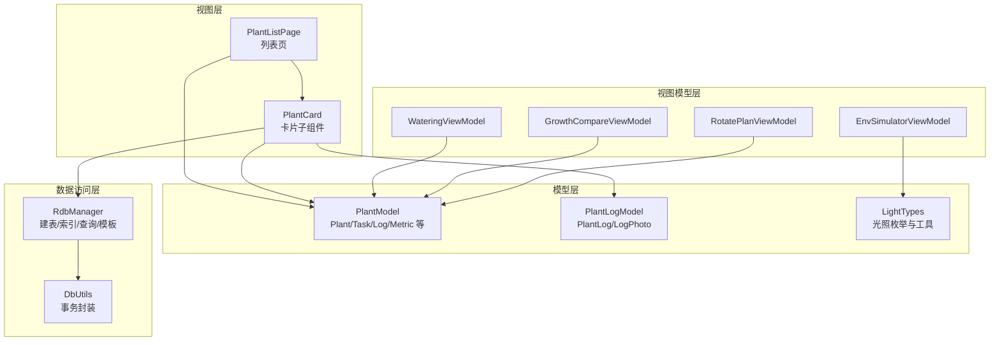
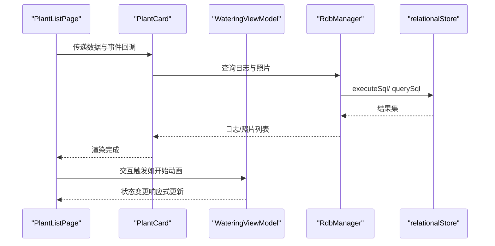
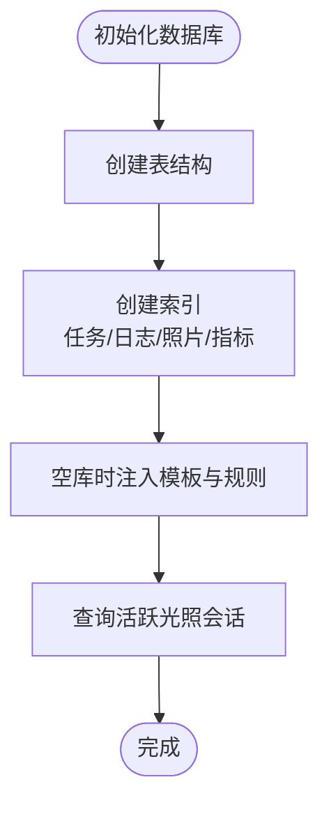
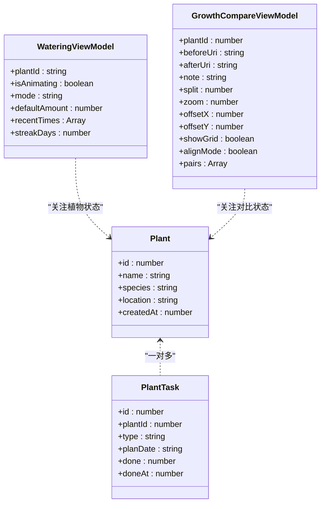
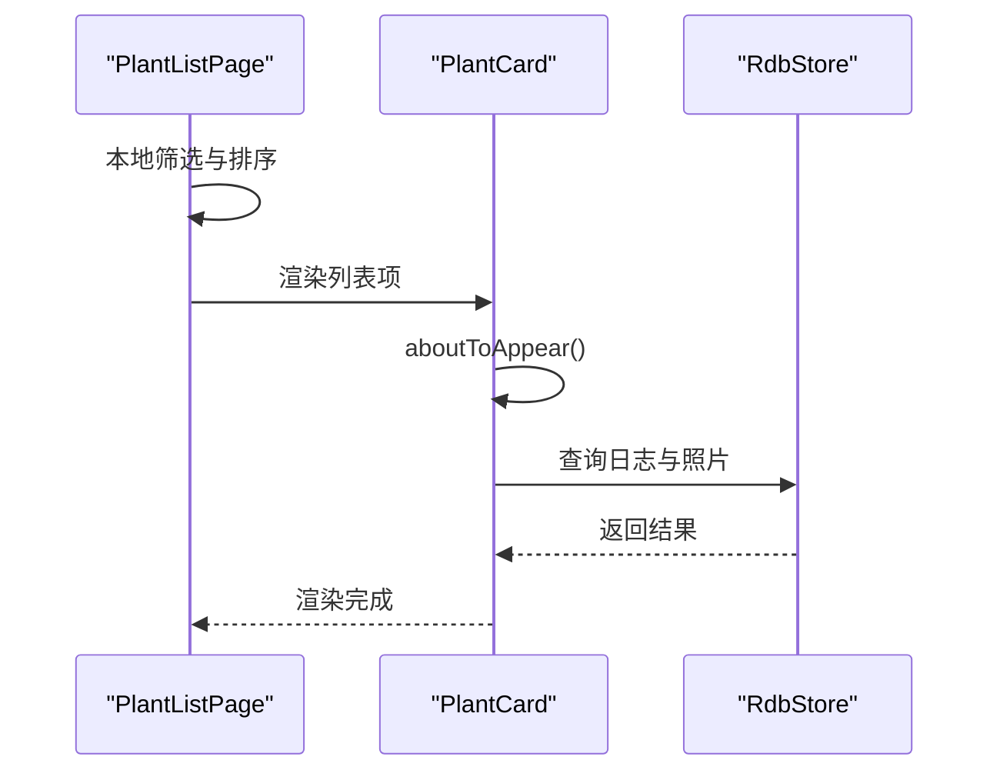
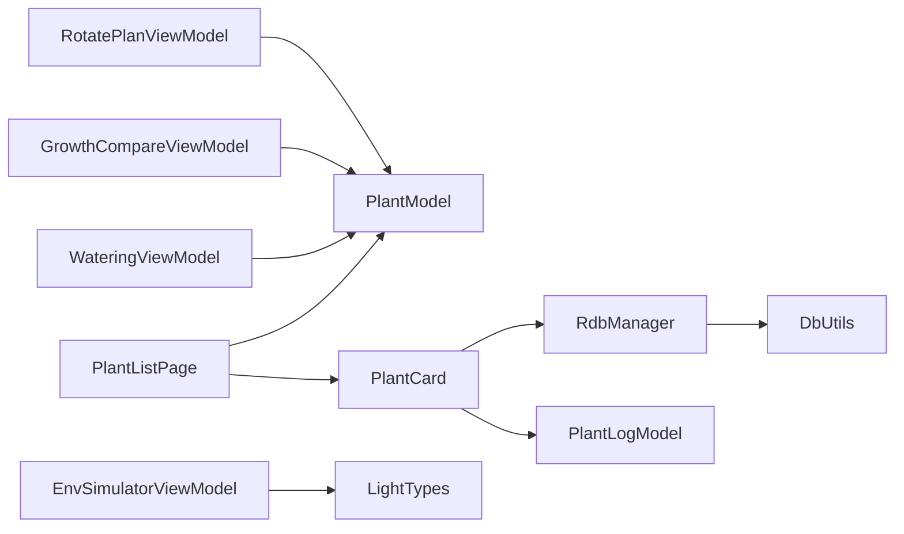

# 性能优化

<cite>
**本文引用的文件**
- [RdbManager.ets](file://entry/src/main/ets/viewmodel/RdbManager.ets)
- [DbUtils.ets](file://entry/src/main/ets/model/DbUtils.ets)
- [PlantModel.ets](file://entry/src/main/ets/model/PlantModel.ets)
- [PlantLogModel.ets](file://entry/src/main/ets/model/PlantLogModel.ets)
- [PlantListPage.ets](file://entry/src/main/ets/pages/PlantListPage.ets)
- [PlantCard.ets](file://entry/src/main/ets/view/PlantCard.ets)
- [WateringViewModel.ets](file://entry/src/main/ets/viewmodel/WateringViewModel.ets)
- [GrowthCompareViewModel.ets](file://entry/src/main/ets/viewmodel/GrowthCompareViewModel.ets)
- [EnvSimulatorViewModel.ets](file://entry/src/main/ets/viewmodel/EnvSimulatorViewModel.ets)
- [LightTypes.ets](file://entry/src/main/ets/model/LightTypes.ets)
- [RotatePlanViewModel.ets](file://entry/src/main/ets/viewmodel/RotatePlanViewModel.ets)
</cite>

## 目录
1. [简介](#简介)
2. [项目结构](#项目结构)
3. [核心组件](#核心组件)
4. [架构总览](#架构总览)
5. [详细组件分析](#详细组件分析)
6. [依赖分析](#依赖分析)
7. [性能考虑](#性能考虑)
8. [故障排查指南](#故障排查指南)
9. [结论](#结论)
10. [附录](#附录)

## 简介
本文件面向植物日记项目的 ArkTS 应用，系统性梳理并给出性能优化策略，涵盖内存管理、UI 渲染优化、数据库查询优化与事务处理、响应式数据绑定（@ObservedV2 与 @Trace）的正确使用方式，以及性能分析工具与测试方法。文档以仓库现有实现为依据，结合可落地的优化建议与案例，帮助开发者在保证功能正确性的前提下提升应用运行效率与用户体验。

## 项目结构
植物日记采用分层清晰的组织方式：
- Model 层：数据模型与类型定义，承载轻量数据结构与少量构造逻辑，便于跨页面/弹层共享。
- ViewModel 层：V2 可观测对象，封装业务状态与交互逻辑，减少页面负担。
- View 层：页面与子组件，负责 UI 渲染与事件分发。
- 数据访问层：RdbManager 统一封装数据库初始化、建表与索引、常用查询与模板数据注入；DbUtils 提供事务封装。

**图表来源**
- [PlantListPage.ets](file://entry/src/main/ets/pages/PlantListPage.ets)
- [PlantCard.ets](file://entry/src/main/ets/view/PlantCard.ets)
- [WateringViewModel.ets](file://entry/src/main/ets/viewmodel/WateringViewModel.ets)
- [GrowthCompareViewModel.ets](file://entry/src/main/ets/viewmodel/GrowthCompareViewModel.ets)
- [EnvSimulatorViewModel.ets](file://entry/src/main/ets/viewmodel/EnvSimulatorViewModel.ets)
- [PlantModel.ets](file://entry/src/main/ets/model/PlantModel.ets)
- [PlantLogModel.ets](file://entry/src/main/ets/model/PlantLogModel.ets)
- [LightTypes.ets](file://entry/src/main/ets/model/LightTypes.ets)
- [RdbManager.ets](file://entry/src/main/ets/viewmodel/RdbManager.ets)
- [DbUtils.ets](file://entry/src/main/ets/model/DbUtils.ets)

**章节来源**
- [PlantListPage.ets](file://entry/src/main/ets/pages/PlantListPage.ets)
- [PlantCard.ets](file://entry/src/main/ets/view/PlantCard.ets)
- [RdbManager.ets](file://entry/src/main/ets/viewmodel/RdbManager.ets)

## 核心组件
- 数据库管理器 RdbManager：集中负责数据库初始化、建表、索引创建与模板数据注入，提供常用查询接口。
- 事务工具 DbUtils：统一事务封装，确保批量写入原子性。
- V2 可观测模型与视图模型：通过 @ObservedV2 与 @Trace 实现响应式绑定，降低页面与组件的重复渲染与计算。
- 列表页与卡片组件：列表页承担筛选与排序的本地计算，卡片组件负责局部状态与数据库查询。

**章节来源**
- [RdbManager.ets](file://entry/src/main/ets/viewmodel/RdbManager.ets)
- [DbUtils.ets](file://entry/src/main/ets/model/DbUtils.ets)
- [PlantModel.ets](file://entry/src/main/ets/model/PlantModel.ets)
- [PlantListPage.ets](file://entry/src/main/ets/pages/PlantListPage.ets)
- [PlantCard.ets](file://entry/src/main/ets/view/PlantCard.ets)

## 架构总览
应用采用“页面/组件 → 视图模型 → 模型/数据库”的分层架构。页面与组件通过 V2 可观测对象驱动 UI 更新，数据库访问集中在 RdbManager，事务操作通过 DbUtils 统一封装。

**图表来源**
- [PlantListPage.ets](file://entry/src/main/ets/pages/PlantListPage.ets)
- [PlantCard.ets](file://entry/src/main/ets/view/PlantCard.ets)
- [WateringViewModel.ets](file://entry/src/main/ets/viewmodel/WateringViewModel.ets)
- [RdbManager.ets](file://entry/src/main/ets/viewmodel/RdbManager.ets)

## 详细组件分析

### 数据库性能优化（RdbManager 与 DbUtils）
- 建表与索引设计
  - 任务表：唯一索引约束（plantId, type, planDate），避免重复任务；常用查询建立索引（planDate、plantId）。
  - 日志表：按 plantId + createdAt 组合索引，满足“按植物查询并按时间倒序”的典型场景。
  - 日志照片表：按 logId 建立索引，支持日志到照片的连接查询。
  - 成长指标表：按 plantId + createdAt 组合索引，支撑按植物与时间范围的查询。
- 模板数据注入：空库时一次性插入模板与规则，避免频繁写入。
- 常用查询：首页快速同步“正在补光”状态，使用 DISTINCT 与 endAt=0 条件过滤，减少扫描范围。
- 事务封装：批量写入统一使用事务，失败回滚，保证一致性与性能。

**图表来源**
- [RdbManager.ets](file://entry/src/main/ets/viewmodel/RdbManager.ets)

**章节来源**
- [RdbManager.ets](file://entry/src/main/ets/viewmodel/RdbManager.ets)
- [DbUtils.ets](file://entry/src/main/ets/model/DbUtils.ets)

### 响应式数据绑定与内存管理（@ObservedV2 与 @Trace）
- 使用规范
  - @ObservedV2：用于页面、视图模型与子组件的状态容器，开启细粒度响应式更新。
  - @Trace：标注具体字段，使变更可追踪，避免不必要的全量重渲染。
  - 示例：Plant、PlantTask、PlantLog、LogPhoto、WateringViewModel、GrowthCompareViewModel 等均采用该模式。
- 内存管理要点
  - 列表页对任务统计采用“共享 allTasks 列表现算”，避免每个卡片单独拉取数据导致重复计算与内存占用。
  - 卡片内部缓存最近日志与照片，避免重复查询；同时在 aboutToAppear 生命周期内按需加载。
  - 视图模型中的数组仅维护必要长度（如 recentTimes 最多保留近期若干条），防止无限增长。
- 优化收益
  - 减少无效渲染：仅当 @Trace 字段变更时触发对应组件更新。
  - 降低内存峰值：避免在 UI 层重复持有大量中间计算结果。

**图表来源**
- [PlantModel.ets](file://entry/src/main/ets/model/PlantModel.ets)
- [WateringViewModel.ets](file://entry/src/main/ets/viewmodel/WateringViewModel.ets)
- [GrowthCompareViewModel.ets](file://entry/src/main/ets/viewmodel/GrowthCompareViewModel.ets)

**章节来源**
- [PlantModel.ets](file://entry/src/main/ets/model/PlantModel.ets)
- [PlantListPage.ets](file://entry/src/main/ets/pages/PlantListPage.ets)
- [PlantCard.ets](file://entry/src/main/ets/view/PlantCard.ets)
- [WateringViewModel.ets](file://entry/src/main/ets/viewmodel/WateringViewModel.ets)
- [GrowthCompareViewModel.ets](file://entry/src/main/ets/viewmodel/GrowthCompareViewModel.ets)

### UI 渲染优化（列表、组件与布局）
- 列表与筛选排序
  - 列表页在本地完成筛选与排序，避免在子组件中重复计算，减少渲染抖动。
  - 使用 ForEach 渲染列表项，配合 ListItem 包裹，提升滚动性能。
- 子组件优化
  - PlantCard 在 aboutToAppear 生命周期内异步加载日志与照片，避免阻塞首屏。
  - 使用 @Local 管理局部状态（如 pressed、logs、photos、lightOpacity），避免跨组件共享导致的全局重绘。
  - 通过 AppStorage 读取补光状态，实现跨生命周期与跨页面的即时视觉反馈。
- 布局与动画
  - 列表设置滚动条关闭与边缘效果，减少无关绘制。
  - 组件内使用短时动画与过渡，避免长时间动画影响滚动流畅度。
- 建议
  - 对于超长列表，优先采用虚拟滚动或懒加载策略（如仓库未实现，可在后续版本引入）。
  - 控制阴影、渐变与圆角半径的复杂度，避免过度合成。

**图表来源**
- [PlantListPage.ets](file://entry/src/main/ets/pages/PlantListPage.ets)
- [PlantCard.ets](file://entry/src/main/ets/view/PlantCard.ets)

**章节来源**
- [PlantListPage.ets](file://entry/src/main/ets/pages/PlantListPage.ets)
- [PlantCard.ets](file://entry/src/main/ets/view/PlantCard.ets)

### 数据库查询优化与事务处理
- 查询优化
  - 任务表：利用唯一索引与复合索引，避免全表扫描；查询计划日期与植物维度的场景具备良好性能。
  - 日志与照片：通过组合索引按 plantId + createdAt 排序，满足“按植物查看日志并倒序”的典型需求。
  - 指标表：同样采用组合索引，支持按植物与时间范围查询。
- 事务处理
  - 批量写入统一包裹在事务中，失败自动回滚，保证一致性与吞吐。
- 建议
  - 对高频查询建立合适的复合索引，避免过多二级索引带来的写入成本。
  - 对大结果集查询增加分页或 LIMIT，避免一次性加载过多数据。

**章节来源**
- [RdbManager.ets](file://entry/src/main/ets/viewmodel/RdbManager.ets)
- [DbUtils.ets](file://entry/src/main/ets/model/DbUtils.ets)

### 光照与环境模拟的性能考量
- LightTypes：提供光照级别、状态枚举与工具函数，避免在 UI 层重复计算。
- EnvSimulatorViewModel：纯计算型 VM，参数变化即刷新派生状态，不依赖数据库，减少 IO 压力。
- 建议
  - 将计算密集型逻辑集中在 VM 层，UI 仅消费派生状态。
  - 对动画期间的交互进行开关控制，避免频繁重算。

**章节来源**
- [LightTypes.ets](file://entry/src/main/ets/model/LightTypes.ets)
- [EnvSimulatorViewModel.ets](file://entry/src/main/ets/viewmodel/EnvSimulatorViewModel.ets)

## 依赖分析
- 组件耦合
  - PlantListPage 依赖 PlantModel 与 PlantCard，通过事件回调与数据透传解耦。
  - PlantCard 依赖 RdbManager 与 PlantLogModel，负责局部查询与状态管理。
  - 视图模型（Watering/GrowthCompare/EnvSimulator/RotatePlan）依赖相应模型与工具，保持纯计算与轻状态。
- 外部依赖
  - relationalStore：数据库访问与事务。
  - AppStorage：跨生命周期的状态缓存与广播。

**图表来源**
- [PlantListPage.ets](file://entry/src/main/ets/pages/PlantListPage.ets)
- [PlantCard.ets](file://entry/src/main/ets/view/PlantCard.ets)
- [PlantModel.ets](file://entry/src/main/ets/model/PlantModel.ets)
- [PlantLogModel.ets](file://entry/src/main/ets/model/PlantLogModel.ets)
- [RdbManager.ets](file://entry/src/main/ets/viewmodel/RdbManager.ets)
- [DbUtils.ets](file://entry/src/main/ets/model/DbUtils.ets)
- [WateringViewModel.ets](file://entry/src/main/ets/viewmodel/WateringViewModel.ets)
- [GrowthCompareViewModel.ets](file://entry/src/main/ets/viewmodel/GrowthCompareViewModel.ets)
- [EnvSimulatorViewModel.ets](file://entry/src/main/ets/viewmodel/EnvSimulatorViewModel.ets)
- [LightTypes.ets](file://entry/src/main/ets/model/LightTypes.ets)
- [RotatePlanViewModel.ets](file://entry/src/main/ets/viewmodel/RotatePlanViewModel.ets)

**章节来源**
- [PlantListPage.ets](file://entry/src/main/ets/pages/PlantListPage.ets)
- [PlantCard.ets](file://entry/src/main/ets/view/PlantCard.ets)
- [RdbManager.ets](file://entry/src/main/ets/viewmodel/RdbManager.ets)
- [DbUtils.ets](file://entry/src/main/ets/model/DbUtils.ets)

## 性能考虑
- 内存管理
  - 避免在 UI 层持有大对象与长数组；必要时采用分页或懒加载。
  - 控制组件局部状态数量与生命周期，及时释放不再使用的资源。
- UI 渲染
  - 使用 @ObservedV2 与 @Trace 精准驱动更新；避免在 UI 层进行复杂计算。
  - 列表滚动时减少阴影、渐变与圆角半径的过度使用。
- 数据库
  - 为高频查询建立复合索引；批量写入使用事务；避免全表扫描。
- 响应式绑定
  - 仅对必要字段添加 @Trace；避免在组件中重复计算同一数据。

[本节为通用指导，无需列出具体文件来源]

## 故障排查指南
- 数据库异常
  - 现象：查询失败或索引未生效。
  - 排查：确认 RdbManager 初始化顺序与索引创建语句执行；检查事务包裹范围与错误捕获。
- 列表渲染卡顿
  - 现象：滚动时掉帧或闪烁。
  - 排查：检查列表项是否包含复杂计算；确认是否使用了不必要的动画；核对 ForEach 的 key 是否稳定。
- 组件状态不同步
  - 现象：补光状态或按钮按下态不一致。
  - 排查：确认 AppStorage 的键名与读写时机；检查组件局部状态与父组件状态的同步逻辑。

**章节来源**
- [RdbManager.ets](file://entry/src/main/ets/viewmodel/RdbManager.ets)
- [DbUtils.ets](file://entry/src/main/ets/model/DbUtils.ets)
- [PlantListPage.ets](file://entry/src/main/ets/pages/PlantListPage.ets)
- [PlantCard.ets](file://entry/src/main/ets/view/PlantCard.ets)

## 结论
通过合理的数据库索引设计、统一的事务封装、V2 响应式绑定与局部状态管理，植物日记项目在 ArkTS 上实现了较好的性能基础。后续可在长列表虚拟化、图片懒加载与更精细的动画控制方面进一步优化，持续提升用户体验。

[本节为总结性内容，无需列出具体文件来源]

## 附录

### 性能分析工具与使用建议
- 性能分析 Kit
  - 使用设备侧性能分析工具采集 CPU、内存与帧时长数据，定位渲染与 IO 瓶颈。
- 内存分析工具
  - 关注组件实例数量与数组容量，避免内存泄漏与峰值过高。
- 建议流程
  - 在关键路径（列表滚动、卡片加载、数据库写入）前后采集数据，对比优化前后的差异。

[本节为通用指导，无需列出具体文件来源]

### 性能测试与基准测试标准
- 测试场景
  - 列表滚动：1000+ 项滚动，记录平均帧时长与掉帧次数。
  - 卡片加载：首次进入与再次进入的耗时对比。
  - 数据写入：批量插入与事务插入的吞吐对比。
- 指标建议
  - 帧时长 P90 ≤ 16ms（约 60fps）；掉帧次数为 0。
  - 卡片首次加载 ≤ 300ms；再次进入 ≤ 100ms。
  - 批量写入（100 条）事务耗时 ≤ 500ms。

[本节为通用指导，无需列出具体文件来源]