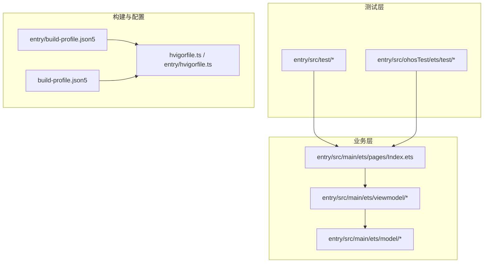
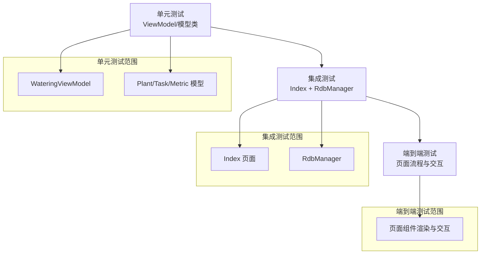
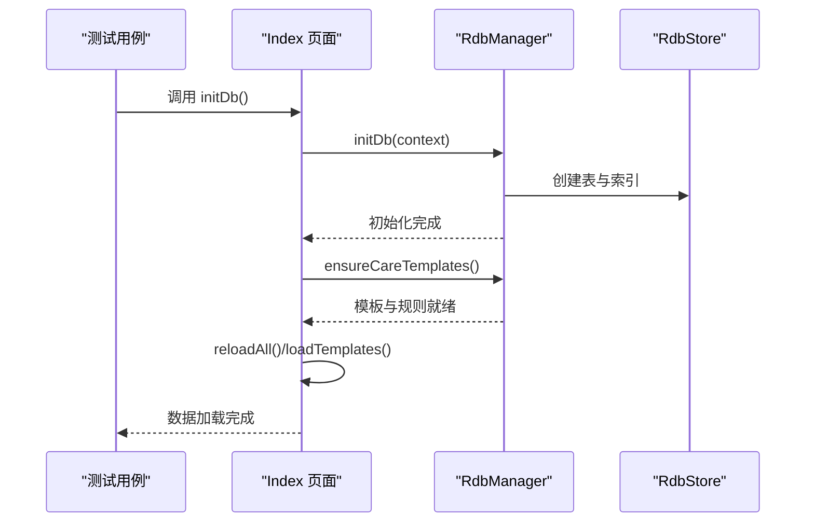
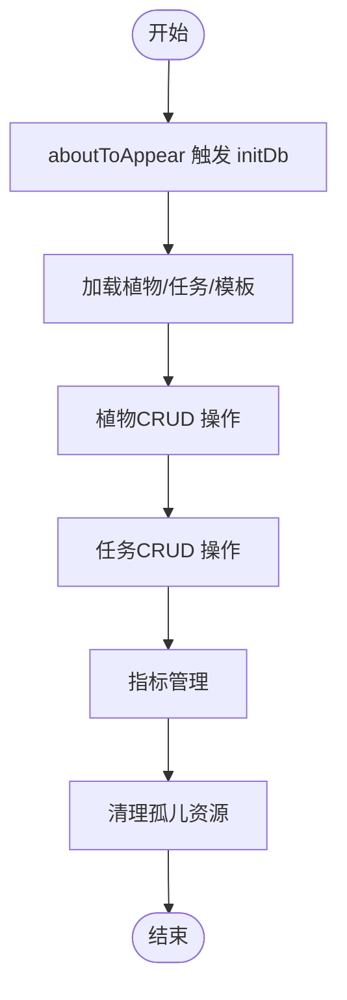
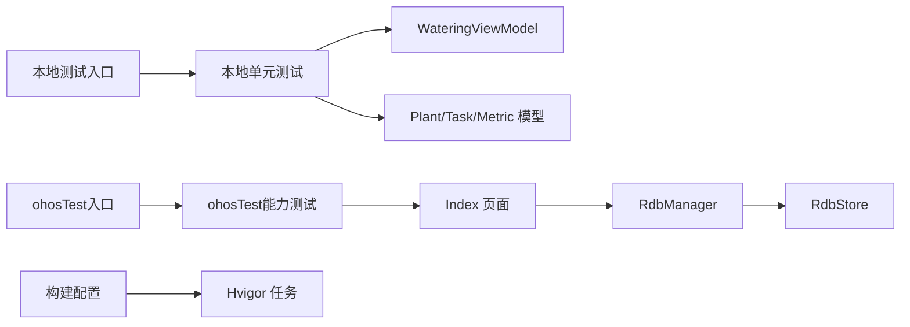

# 测试策略

<cite>
**本文引用的文件**
- [entry/src/test/List.test.ets](file://entry/src/test/List.test.ets)
- [entry/src/test/LocalUnit.test.ets](file://entry/src/test/LocalUnit.test.ets)
- [entry/src/ohosTest/ets/test/Ability.test.ets](file://entry/src/ohosTest/ets/test/Ability.test.ets)
- [entry/src/ohosTest/ets/test/List.test.ets](file://entry/src/ohosTest/ets/test/List.test.ets)
- [entry/src/main/ets/viewmodel/RdbManager.ets](file://entry/src/main/ets/viewmodel/RdbManager.ets)
- [entry/src/main/ets/model/PlantModel.ets](file://entry/src/main/ets/model/PlantModel.ets)
- [entry/src/main/ets/viewmodel/WateringViewModel.ets](file://entry/src/main/ets/viewmodel/WateringViewModel.ets)
- [entry/src/main/ets/pages/Index.ets](file://entry/src/main/ets/pages/Index.ets)
- [entry/src/main/ets/model/WaterRecord.ets](file://entry/src/main/ets/model/WaterRecord.ets)
- [entry/build-profile.json5](file://entry/build-profile.json5)
- [build-profile.json5](file://build-profile.json5)
- [hvigorfile.ts](file://hvigorfile.ts)
- [entry/hvigorfile.ts](file://entry/hvigorfile.ts)
</cite>

## 目录
1. [简介](#简介)
2. [项目结构](#项目结构)
3. [核心组件](#核心组件)
4. [架构总览](#架构总览)
5. [详细组件分析](#详细组件分析)
6. [依赖分析](#依赖分析)
7. [性能考虑](#性能考虑)
8. [故障排查指南](#故障排查指南)
9. [结论](#结论)
10. [附录](#附录)

## 简介
本测试策略文档面向植物日记项目，系统性地规划了单元测试、集成测试与端到端测试的实施方法，覆盖ArkTS测试用例编写（Ability测试、组件测试、业务逻辑测试），测试框架与工具链配置、测试数据准备与断言方法，以及Mock对象在数据库、网络请求与UI组件层面的应用建议。同时给出测试覆盖率与质量门禁建议，并结合具体数据模型、ViewModel与页面组件提供可操作的测试示例路径，最后说明在持续集成中运行自动化测试与生成测试报告的方法。

## 项目结构
项目采用模块化组织，测试相关目录位于entry/src/test与entry/src/ohosTest/ets/test，分别用于本地单元测试与ohosTest目标下的能力测试。页面、视图模型与数据模型位于entry/src/main/ets下，便于针对页面生命周期、业务逻辑与数据持久化进行测试。

**图表来源**
- [entry/src/test/List.test.ets:1-5](file://entry/src/test/List.test.ets#L1-L5)
- [entry/src/ohosTest/ets/test/List.test.ets:1-5](file://entry/src/ohosTest/ets/test/List.test.ets#L1-L5)
- [entry/src/main/ets/pages/Index.ets:1-800](file://entry/src/main/ets/pages/Index.ets#L1-L800)
- [entry/build-profile.json5:1-33](file://entry/build-profile.json5#L1-L33)
- [build-profile.json5:1-69](file://build-profile.json5#L1-L69)
- [hvigorfile.ts:1-6](file://hvigorfile.ts#L1-L6)
- [entry/hvigorfile.ts:1-6](file://entry/hvigorfile.ts#L1-L6)

**章节来源**
- [entry/src/test/List.test.ets:1-5](file://entry/src/test/List.test.ets#L1-L5)
- [entry/src/ohosTest/ets/test/List.test.ets:1-5](file://entry/src/ohosTest/ets/test/List.test.ets#L1-L5)
- [entry/src/main/ets/pages/Index.ets:1-800](file://entry/src/main/ets/pages/Index.ets#L1-L800)
- [entry/build-profile.json5:1-33](file://entry/build-profile.json5#L1-L33)
- [build-profile.json5:1-69](file://build-profile.json5#L1-L69)
- [hvigorfile.ts:1-6](file://hvigorfile.ts#L1-L6)
- [entry/hvigorfile.ts:1-6](file://entry/hvigorfile.ts#L1-L6)

## 核心组件
- 页面与状态中心：Index页面承担应用状态中枢，负责数据库初始化、全局数据加载与状态管理，适合进行端到端测试与集成测试。
- 视图模型：如WateringViewModel负责业务逻辑与状态，适合单元测试。
- 数据模型：Plant、Task、Metric等模型类，适合单元测试与数据一致性验证。
- 数据库管理：RdbManager负责数据库初始化、建表与索引、默认数据注入与查询，适合集成测试与数据库Mock场景。

**章节来源**
- [entry/src/main/ets/pages/Index.ets:115-141](file://entry/src/main/ets/pages/Index.ets#L115-L141)
- [entry/src/main/ets/viewmodel/WateringViewModel.ets:1-102](file://entry/src/main/ets/viewmodel/WateringViewModel.ets#L1-L102)
- [entry/src/main/ets/model/PlantModel.ets:1-166](file://entry/src/main/ets/model/PlantModel.ets#L1-L166)
- [entry/src/main/ets/viewmodel/RdbManager.ets:1-296](file://entry/src/main/ets/viewmodel/RdbManager.ets#L1-L296)

## 架构总览
测试金字塔在本项目中的映射如下：
- 单元测试：针对ViewModel与模型类，验证业务逻辑与数据结构正确性。
- 集成测试：围绕Index页面与RdbManager，验证数据库初始化、数据加载与状态同步。
- 端到端测试：以Index页面为入口，模拟用户操作流程，验证页面渲染、交互与数据持久化。

**图表来源**
- [entry/src/main/ets/viewmodel/WateringViewModel.ets:1-102](file://entry/src/main/ets/viewmodel/WateringViewModel.ets#L1-L102)
- [entry/src/main/ets/model/PlantModel.ets:1-166](file://entry/src/main/ets/model/PlantModel.ets#L1-L166)
- [entry/src/main/ets/pages/Index.ets:115-141](file://entry/src/main/ets/pages/Index.ets#L115-L141)
- [entry/src/main/ets/viewmodel/RdbManager.ets:27-170](file://entry/src/main/ets/viewmodel/RdbManager.ets#L27-L170)

## 详细组件分析

### 单元测试策略
- 测试框架与断言：使用@ohos/hypium提供的describe/it/expect等API，断言方法包括assertContain/assertEqual等。
- 测试用例示例路径：
  - [本地单元测试套件入口:1-5](file://entry/src/test/List.test.ets#L1-L5)
  - [本地单元测试样例:1-33](file://entry/src/test/LocalUnit.test.ets#L1-L33)
  - [ohosTest能力测试样例:1-35](file://entry/src/ohosTest/ets/test/Ability.test.ets#L1-L35)

- ViewModel测试要点（以WateringViewModel为例）
  - 模式切换：验证setMode仅接受light/deep。
  - 动画状态：验证startAnimation/stopAnimation对isAnimating的影响。
  - 浇水记录：验证recordWater生成WaterRecord并更新recentTimes与streakDays。
  - 连续天数计算：验证updateStreak基于时间差与跨日边界判断的容错逻辑。
  - 时间格式化：验证fmtDate对0值与正常时间戳的格式化输出。

- 数据模型测试要点（以Plant/Task/Metric为例）
  - 字段完整性：确保模型字段与数据库表结构一致。
  - 构造函数与默认值：验证构造参数与默认值的正确性。
  - Draft模型：验证表单草稿对象在编辑态隔离列表实体。

- 断言方法建议
  - 使用expect(obj).assertEqual(expected)进行相等性断言。
  - 使用expect(str).assertContain(substring)进行字符串包含断言。
  - 对布尔条件与异常抛出使用合适的断言方法。

**章节来源**
- [entry/src/test/LocalUnit.test.ets:1-33](file://entry/src/test/LocalUnit.test.ets#L1-L33)
- [entry/src/ohosTest/ets/test/Ability.test.ets:1-35](file://entry/src/ohosTest/ets/test/Ability.test.ets#L1-L35)
- [entry/src/test/List.test.ets:1-5](file://entry/src/test/List.test.ets#L1-L5)
- [entry/src/ohosTest/ets/test/List.test.ets:1-5](file://entry/src/ohosTest/ets/test/List.test.ets#L1-L5)
- [entry/src/main/ets/viewmodel/WateringViewModel.ets:29-96](file://entry/src/main/ets/viewmodel/WateringViewModel.ets#L29-L96)
- [entry/src/main/ets/model/PlantModel.ets:6-166](file://entry/src/main/ets/model/PlantModel.ets#L6-L166)

### 集成测试策略
- 目标：验证Index页面与RdbManager协作完成数据库初始化、模板注入、数据加载与状态同步。
- 关键流程：
  - 数据库初始化：initDb调用RdbManager.initDb，创建表与索引。
  - 模板注入：ensureCareTemplates在空库时插入默认模板与规则。
  - 数据加载：loadPlants/loadTasks/refreshActiveSessions等方法的联合调用。
  - 状态同步：通过AppStorage同步光照会话状态至植物卡片。

- 测试步骤建议
  - 准备上下文：模拟Ability上下文与RdbStore实例。
  - 初始化数据库：调用RdbManager.initDb并断言表与索引存在。
  - 注入模板：调用ensureCareTemplates并断言模板与规则数量。
  - 加载数据：调用reloadAll与loadTemplates，断言数据集合非空且有序。
  - 状态同步：断言AppStorage中lighting_{id}键值与活动会话一致。

**图表来源**
- [entry/src/main/ets/pages/Index.ets:127-141](file://entry/src/main/ets/pages/Index.ets#L127-L141)
- [entry/src/main/ets/viewmodel/RdbManager.ets:27-170](file://entry/src/main/ets/viewmodel/RdbManager.ets#L27-L170)

**章节来源**
- [entry/src/main/ets/pages/Index.ets:127-141](file://entry/src/main/ets/pages/Index.ets#L127-L141)
- [entry/src/main/ets/viewmodel/RdbManager.ets:172-276](file://entry/src/main/ets/viewmodel/RdbManager.ets#L172-L276)

### 端到端测试策略
- 目标：以Index页面为入口，模拟用户操作（新建植物、创建任务、查看指标、删除植物等），验证页面渲染、交互反馈与数据持久化。
- 关键场景
  - 数据库初始化与Banner提示：aboutToAppear触发initDb并显示Banner。
  - 植物CRUD：createPlant/updatePlant/deletePlant，断言数据库与文件系统联动。
  - 任务CRUD：createTask/toggleTaskDone/deleteTask，断言唯一索引与状态变更。
  - 指标管理：createMetric/deleteMetric与loadMetricsByPlant。
  - 清理孤儿资源：cleanupOrphanPhotos断言DB与FS一致性。

**图表来源**
- [entry/src/main/ets/pages/Index.ets:115-141](file://entry/src/main/ets/pages/Index.ets#L115-L141)
- [entry/src/main/ets/pages/Index.ets:286-402](file://entry/src/main/ets/pages/Index.ets#L286-L402)
- [entry/src/main/ets/pages/Index.ets:404-557](file://entry/src/main/ets/pages/Index.ets#L404-L557)
- [entry/src/main/ets/pages/Index.ets:223-284](file://entry/src/main/ets/pages/Index.ets#L223-L284)
- [entry/src/main/ets/pages/Index.ets:439-546](file://entry/src/main/ets/pages/Index.ets#L439-L546)

**章节来源**
- [entry/src/main/ets/pages/Index.ets:115-141](file://entry/src/main/ets/pages/Index.ets#L115-L141)
- [entry/src/main/ets/pages/Index.ets:286-402](file://entry/src/main/ets/pages/Index.ets#L286-L402)
- [entry/src/main/ets/pages/Index.ets:404-557](file://entry/src/main/ets/pages/Index.ets#L404-L557)
- [entry/src/main/ets/pages/Index.ets:223-284](file://entry/src/main/ets/pages/Index.ets#L223-L284)
- [entry/src/main/ets/pages/Index.ets:439-546](file://entry/src/main/ets/pages/Index.ets#L439-L546)

### 测试框架与工具链配置
- 测试框架：使用@ohos/hypium提供的测试API（describe/it/expect）。
- 测试入口：
  - 本地测试入口：[本地测试套件入口:1-5](file://entry/src/test/List.test.ets#L1-L5)
  - ohosTest能力测试入口：[ohosTest测试套件入口:1-5](file://entry/src/ohosTest/ets/test/List.test.ets#L1-L5)
- 构建目标：
  - entry/build-profile.json5定义了ohosTest目标，确保测试模块可被构建与运行。
  - 根build-profile.json5定义了app签名与产品配置，保证测试环境一致性。
- 构建脚本：hvigorfile.ts与entry/hvigorfile.ts提供Hvigor任务系统，确保测试任务可被识别与执行。

**章节来源**
- [entry/src/test/List.test.ets:1-5](file://entry/src/test/List.test.ets#L1-L5)
- [entry/src/ohosTest/ets/test/List.test.ets:1-5](file://entry/src/ohosTest/ets/test/List.test.ets#L1-L5)
- [entry/build-profile.json5:25-32](file://entry/build-profile.json5#L25-L32)
- [build-profile.json5:55-69](file://build-profile.json5#L55-L69)
- [hvigorfile.ts:1-6](file://hvigorfile.ts#L1-L6)
- [entry/hvigorfile.ts:1-6](file://entry/hvigorfile.ts#L1-L6)

### Mock对象使用指南
- 数据库Mock（RdbStore）
  - 场景：避免真实数据库初始化，模拟表结构、索引与查询结果。
  - 方法：通过RdbManager.getInstance替换为Mock实例，或在测试中直接注入Mock RdbStore。
  - 关注点：确保executeSql/querySql/insert/update/delete等API返回预期结果，支持事务接口（beginTransaction/commit/rollBack）。

- 网络请求Mock（如需）
  - 场景：当前项目主要使用本地数据库，如后续引入网络功能，建议使用拦截器或代理库Mock网络请求。
  - 方法：在测试前注入Mock实现，在测试后恢复原实现。

- UI组件Mock
  - 场景：页面组件渲染与交互测试，避免真实UI绘制与设备差异。
  - 方法：使用@ohos/hypium提供的测试渲染环境，或通过组件桩（stub）替换复杂组件，聚焦业务逻辑断言。

**章节来源**
- [entry/src/main/ets/viewmodel/RdbManager.ets:27-170](file://entry/src/main/ets/viewmodel/RdbManager.ets#L27-L170)
- [entry/src/main/ets/pages/Index.ets:127-141](file://entry/src/main/ets/pages/Index.ets#L127-L141)

### 测试数据准备与断言方法
- 测试数据准备
  - 模型数据：使用Plant/Task/Metric等模型构造测试数据，确保字段完整与类型正确。
  - ViewModel数据：通过构造函数与公开方法初始化状态，避免直接访问内部私有属性。
  - 数据库数据：在集成测试中通过RdbManager.initDb与ensureCareTemplates准备基础数据。

- 断言方法
  - 数值/字符串：assertEqual
  - 包含关系：assertContain
  - 布尔条件：根据具体API选择合适断言
  - 异常：断言错误抛出与错误消息

**章节来源**
- [entry/src/test/LocalUnit.test.ets:24-31](file://entry/src/test/LocalUnit.test.ets#L24-L31)
- [entry/src/ohosTest/ets/test/Ability.test.ets:24-33](file://entry/src/ohosTest/ets/test/Ability.test.ets#L24-L33)

### 测试覆盖率与质量门禁
- 覆盖率要求建议
  - 单元测试：核心业务逻辑（如WateringViewModel）行覆盖率≥80%，分支覆盖率≥60%。
  - 集成测试：页面与数据库交互关键路径行覆盖率≥70%，重点流程100%。
  - 端到端测试：关键用户旅程（新建植物→创建任务→查看指标→删除植物）100%覆盖。
- 质量门禁
  - 代码合并前必须通过单元测试与集成测试。
  - 端到端测试在PR检查中作为可选但推荐项。
  - 覆盖率阈值未达标时，阻塞合并。

[本节为通用指导，无需特定文件引用]

## 依赖分析
测试依赖关系与耦合度分析：
- 测试入口依赖具体测试文件（本地与ohosTest）。
- 页面Index依赖RdbManager与RdbStore，测试中应Mock或注入RdbStore。
- ViewModel依赖模型类，测试中可直接实例化并断言状态变化。
- 构建配置影响测试目标与产物，需确保ohosTest目标可用。

**图表来源**
- [entry/src/test/List.test.ets:1-5](file://entry/src/test/List.test.ets#L1-L5)
- [entry/src/ohosTest/ets/test/List.test.ets:1-5](file://entry/src/ohosTest/ets/test/List.test.ets#L1-L5)
- [entry/src/main/ets/viewmodel/WateringViewModel.ets:1-102](file://entry/src/main/ets/viewmodel/WateringViewModel.ets#L1-L102)
- [entry/src/main/ets/model/PlantModel.ets:1-166](file://entry/src/main/ets/model/PlantModel.ets#L1-L166)
- [entry/src/main/ets/pages/Index.ets:115-141](file://entry/src/main/ets/pages/Index.ets#L115-L141)
- [entry/src/main/ets/viewmodel/RdbManager.ets:27-170](file://entry/src/main/ets/viewmodel/RdbManager.ets#L27-L170)
- [entry/build-profile.json5:25-32](file://entry/build-profile.json5#L25-L32)
- [hvigorfile.ts:1-6](file://hvigorfile.ts#L1-L6)

**章节来源**
- [entry/src/test/List.test.ets:1-5](file://entry/src/test/List.test.ets#L1-L5)
- [entry/src/ohosTest/ets/test/List.test.ets:1-5](file://entry/src/ohosTest/ets/test/List.test.ets#L1-L5)
- [entry/src/main/ets/viewmodel/WateringViewModel.ets:1-102](file://entry/src/main/ets/viewmodel/WateringViewModel.ets#L1-L102)
- [entry/src/main/ets/model/PlantModel.ets:1-166](file://entry/src/main/ets/model/PlantModel.ets#L1-L166)
- [entry/src/main/ets/pages/Index.ets:115-141](file://entry/src/main/ets/pages/Index.ets#L115-L141)
- [entry/src/main/ets/viewmodel/RdbManager.ets:27-170](file://entry/src/main/ets/viewmodel/RdbManager.ets#L27-L170)
- [entry/build-profile.json5:25-32](file://entry/build-profile.json5#L25-L32)
- [hvigorfile.ts:1-6](file://hvigorfile.ts#L1-L6)

## 性能考虑
- 测试执行性能
  - 单元测试优先，减少外部依赖，提升执行速度。
  - 集成测试中尽量复用Mock RdbStore，避免真实IO。
- 资源占用
  - 端到端测试避免频繁启动/销毁页面实例，复用测试上下文。
- 报告与统计
  - 使用@ohos/hypium生成测试报告，关注失败用例与耗时分布。

[本节为通用指导，无需特定文件引用]

## 故障排查指南
- 测试无法启动
  - 检查测试入口导出是否正确：[本地测试入口:1-5](file://entry/src/test/List.test.ets#L1-L5)、[ohosTest入口:1-5](file://entry/src/ohosTest/ets/test/List.test.ets#L1-L5)。
  - 确认构建目标ohosTest可用：[构建配置:25-32](file://entry/build-profile.json5#L25-L32)。
- 断言失败
  - 使用assertContain/assertEqual等断言方法定位问题，逐步缩小范围。
  - 对ViewModel状态断言，优先断言公开方法的副作用而非内部字段。
- 数据库相关问题
  - 确保RdbManager.initDb在测试前执行，或在测试中注入Mock RdbStore。
  - 对异常降级逻辑（如getActiveLightSessions）进行异常捕获与返回空Map的断言。

**章节来源**
- [entry/src/test/List.test.ets:1-5](file://entry/src/test/List.test.ets#L1-L5)
- [entry/src/ohosTest/ets/test/List.test.ets:1-5](file://entry/src/ohosTest/ets/test/List.test.ets#L1-L5)
- [entry/src/main/ets/viewmodel/RdbManager.ets:276-294](file://entry/src/main/ets/viewmodel/RdbManager.ets#L276-L294)

## 结论
本测试策略以测试金字塔为核心，结合ArkTS测试框架与@ohos/hypium API，明确了单元、集成与端到端测试的职责边界与实施路径。通过针对ViewModel与模型类的单元测试、Index与RdbManager的集成测试，以及页面流程的端到端测试，形成完整的质量保障体系。配合Mock对象与构建配置，可在持续集成中稳定运行自动化测试并产出测试报告。

[本节为总结，无需特定文件引用]

## 附录

### 测试示例路径清单
- 单元测试
  - [本地单元测试样例:1-33](file://entry/src/test/LocalUnit.test.ets#L1-L33)
  - [ohosTest能力测试样例:1-35](file://entry/src/ohosTest/ets/test/Ability.test.ets#L1-L35)
- 集成测试
  - [Index页面初始化与数据加载:127-141](file://entry/src/main/ets/pages/Index.ets#L127-L141)
  - [RdbManager数据库初始化与模板注入:27-170](file://entry/src/main/ets/viewmodel/RdbManager.ets#L27-L170)
- 端到端测试
  - [植物CRUD与文件清理:286-402](file://entry/src/main/ets/pages/Index.ets#L286-L402)
  - [任务CRUD与唯一索引:404-557](file://entry/src/main/ets/pages/Index.ets#L404-L557)
  - [指标管理与查询:223-284](file://entry/src/main/ets/pages/Index.ets#L223-L284)
  - [孤儿资源清理:439-546](file://entry/src/main/ets/pages/Index.ets#L439-L546)

**章节来源**
- [entry/src/test/LocalUnit.test.ets:1-33](file://entry/src/test/LocalUnit.test.ets#L1-L33)
- [entry/src/ohosTest/ets/test/Ability.test.ets:1-35](file://entry/src/ohosTest/ets/test/Ability.test.ets#L1-L35)
- [entry/src/main/ets/pages/Index.ets:127-141](file://entry/src/main/ets/pages/Index.ets#L127-L141)
- [entry/src/main/ets/viewmodel/RdbManager.ets:27-170](file://entry/src/main/ets/viewmodel/RdbManager.ets#L27-L170)
- [entry/src/main/ets/pages/Index.ets:286-402](file://entry/src/main/ets/pages/Index.ets#L286-L402)
- [entry/src/main/ets/pages/Index.ets:404-557](file://entry/src/main/ets/pages/Index.ets#L404-L557)
- [entry/src/main/ets/pages/Index.ets:223-284](file://entry/src/main/ets/pages/Index.ets#L223-L284)
- [entry/src/main/ets/pages/Index.ets:439-546](file://entry/src/main/ets/pages/Index.ets#L439-L546)

### 持续集成与测试报告
- 自动化测试流程
  - 在CI中执行构建命令，确保ohosTest目标可用。
  - 运行测试入口（本地与ohosTest），收集测试结果。
- 测试报告生成
  - 使用@ohos/hypium内置报告能力，输出测试结果与断言详情。
  - 将报告上传至CI制品库，便于追溯与审计。

**章节来源**
- [entry/build-profile.json5:25-32](file://entry/build-profile.json5#L25-L32)
- [hvigorfile.ts:1-6](file://hvigorfile.ts#L1-L6)
- [entry/hvigorfile.ts:1-6](file://entry/hvigorfile.ts#L1-L6)