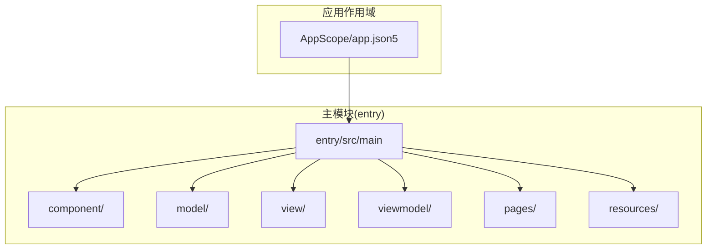
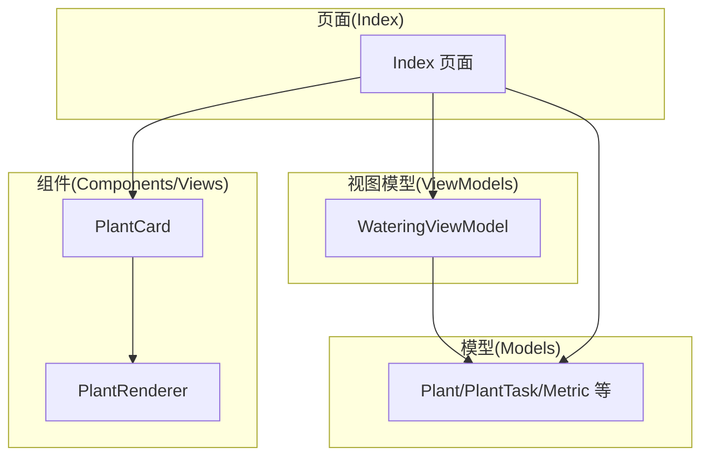
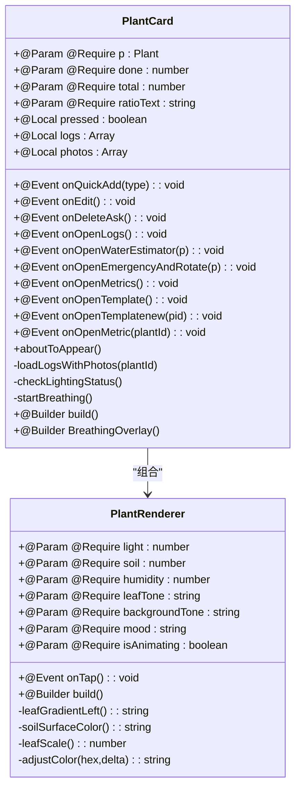
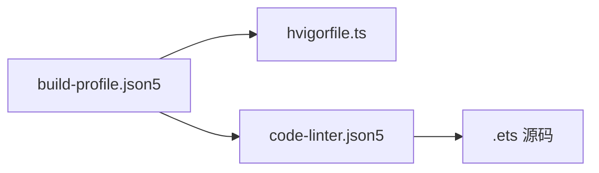

# 编码规范

<cite>
**本文引用的文件**
- [AppScope/app.json5](file://AppScope/app.json5)
- [entry/src/main/resources/base/element/color.json](file://entry/src/main/resources/base/element/color.json)
- [entry/src/main/resources/dark/element/color.json](file://entry/src/main/resources/dark/element/color.json)
- [entry/src/main/resources/base/element/float.json](file://entry/src/main/resources/base/element/float.json)
- [entry/src/main/resources/base/element/string.json](file://entry/src/main/resources/base/element/string.json)
- [build-profile.json5](file://build-profile.json5)
- [code-linter.json5](file://code-linter.json5)
- [hvigorfile.ts](file://hvigorfile.ts)
- [entry/src/main/ets/component/PlantRenderer.ets](file://entry/src/main/ets/component/PlantRenderer.ets)
- [entry/src/main/ets/view/PlantCard.ets](file://entry/src/main/ets/view/PlantCard.ets)
- [entry/src/main/ets/model/PlantModel.ets](file://entry/src/main/ets/model/PlantModel.ets)
- [entry/src/main/ets/viewmodel/WateringViewModel.ets](file://entry/src/main/ets/viewmodel/WateringViewModel.ets)
- [entry/src/main/ets/pages/Index.ets](file://entry/src/main/ets/pages/Index.ets)
</cite>

## 目录
1. 引言
2. 项目结构
3. 核心组件
4. 架构总览
5. 详细组件分析
6. 依赖分析
7. 性能考虑
8. 故障排查指南
9. 结论
10. 附录

## 引言
本规范面向“植物日记”项目，系统化阐述 ArkTS 编码规范与最佳实践，涵盖以下要点：
- ArkTS 语言使用规范与装饰器应用
- 响应式编程模式（ObservedV2、@Trace、@Param/@Require、@Event、@Local、@Builder）
- 类型安全：接口定义、泛型使用、类型推导
- 组件规范：命名约定、build 函数要求、装饰器使用规则
- 资源规范：颜色资源格式、尺寸单位、媒体文件命名
- 代码组织结构：文件命名、模块导入、分层原则
- 具体示例：正确范式与常见反模式
- 初学者建议：ArkTS 基础知识与最佳实践

## 项目结构
项目采用“模块化 + 分层”的组织方式：
- AppScope：应用级资源配置与入口声明
- entry/src/main：主模块源码，按职责划分为 component、model、view、viewmodel、pages、resources 等目录
- 构建与质量工具：build-profile.json5、code-linter.json5、hvigorfile.ts

图表来源
- [AppScope/app.json5:1-11](file://AppScope/app.json5#L1-L11)
- [entry/src/main/ets/component/PlantRenderer.ets:1-169](file://entry/src/main/ets/component/PlantRenderer.ets#L1-L169)
- [entry/src/main/ets/model/PlantModel.ets:1-166](file://entry/src/main/ets/model/PlantModel.ets#L1-L166)
- [entry/src/main/ets/view/PlantCard.ets:1-326](file://entry/src/main/ets/view/PlantCard.ets#L1-L326)
- [entry/src/main/ets/viewmodel/WateringViewModel.ets:1-102](file://entry/src/main/ets/viewmodel/WateringViewModel.ets#L1-L102)
- [entry/src/main/ets/pages/Index.ets:1-800](file://entry/src/main/ets/pages/Index.ets#L1-L800)

章节来源
- [AppScope/app.json5:1-11](file://AppScope/app.json5#L1-L11)
- [build-profile.json5:1-69](file://build-profile.json5#L1-L69)
- [code-linter.json5:1-32](file://code-linter.json5#L1-L32)
- [hvigorfile.ts:1-6](file://hvigorfile.ts#L1-L6)

## 核心组件
- 组件层（component/view）：以结构体组件为主，使用 @Builder 定义 UI 构建逻辑，参数通过 @Param/@Require 注入，事件通过 @Event 回调
- 模型层（model）：使用 @ObservedV2 + @Trace 实现响应式数据，定义轻量数据结构与接口
- 视图模型层（viewmodel）：封装业务状态与交互逻辑，暴露可观测属性与方法
- 页面层（pages）：应用入口与状态中枢，负责数据加载、事务处理与导航

章节来源
- [entry/src/main/ets/component/PlantRenderer.ets:7-101](file://entry/src/main/ets/component/PlantRenderer.ets#L7-L101)
- [entry/src/main/ets/view/PlantCard.ets:7-325](file://entry/src/main/ets/view/PlantCard.ets#L7-L325)
- [entry/src/main/ets/model/PlantModel.ets:6-166](file://entry/src/main/ets/model/PlantModel.ets#L6-L166)
- [entry/src/main/ets/viewmodel/WateringViewModel.ets:11-96](file://entry/src/main/ets/viewmodel/WateringViewModel.ets#L11-L96)
- [entry/src/main/ets/pages/Index.ets:39-141](file://entry/src/main/ets/pages/Index.ets#L39-L141)

## 架构总览
整体采用“组件-模型-视图模型-页面”的分层架构，数据流自下而上驱动 UI 更新。

图表来源
- [entry/src/main/ets/pages/Index.ets:39-141](file://entry/src/main/ets/pages/Index.ets#L39-L141)
- [entry/src/main/ets/viewmodel/WateringViewModel.ets:11-96](file://entry/src/main/ets/viewmodel/WateringViewModel.ets#L11-L96)
- [entry/src/main/ets/model/PlantModel.ets:6-166](file://entry/src/main/ets/model/PlantModel.ets#L6-L166)
- [entry/src/main/ets/component/PlantRenderer.ets:7-101](file://entry/src/main/ets/component/PlantRenderer.ets#L7-L101)
- [entry/src/main/ets/view/PlantCard.ets:7-325](file://entry/src/main/ets/view/PlantCard.ets#L7-L325)

## 详细组件分析

### 组件规范：命名约定、build 函数与装饰器
- 命名约定
  - 组件类名使用结构体组件（struct）或类组件（class），首字母大写，语义清晰
  - 文件名与组件名一致，如 PlantRenderer.ets、PlantCard.ets
- build 函数要求
  - 结构体组件必须实现 @Builder build()，所有 UI 在其中声明
  - 使用 @Builder 子构建器组织复杂 UI 片段
- 装饰器使用规则
  - @Param/@Require：必需输入参数，支持默认值
  - @Event：事件回调，用于父子通信
  - @Local：组件内部状态，驱动局部重绘
  - @Builder：声明 UI 构建器
  - @ComponentV2：组件声明
  - @Provider/@Consumer：跨层级状态注入与消费
  - @ObservedV2 + @Trace：响应式数据声明

章节来源
- [entry/src/main/ets/component/PlantRenderer.ets:7-101](file://entry/src/main/ets/component/PlantRenderer.ets#L7-L101)
- [entry/src/main/ets/view/PlantCard.ets:7-325](file://entry/src/main/ets/view/PlantCard.ets#L7-L325)
- [entry/src/main/ets/pages/Index.ets:44-47](file://entry/src/main/ets/pages/Index.ets#L44-L47)

### 响应式编程模式
- 数据声明
  - 使用 @ObservedV2 包裹类，字段配合 @Trace 标注，实现细粒度变更通知
- 状态管理
  - 页面与组件使用 @Local 管理本地状态；通过 @Provider/@Consumer 在树间传递
- 动画与过渡
  - 使用 animateTo、animation、scale、shadow 等 API 实现流畅交互

图表来源
- [entry/src/main/ets/component/PlantRenderer.ets:7-154](file://entry/src/main/ets/component/PlantRenderer.ets#L7-L154)
- [entry/src/main/ets/view/PlantCard.ets:7-325](file://entry/src/main/ets/view/PlantCard.ets#L7-L325)

章节来源
- [entry/src/main/ets/component/PlantRenderer.ets:7-154](file://entry/src/main/ets/component/PlantRenderer.ets#L7-L154)
- [entry/src/main/ets/view/PlantCard.ets:7-325](file://entry/src/main/ets/view/PlantCard.ets#L7-L325)

### 类型安全：接口、泛型与推导
- 接口定义
  - 使用 export interface 定义契约，字段明确且最小化
  - 示例：CareTemplate、CareRule 等
- 泛型使用
  - 在数组与查询结果中使用明确类型，避免 any
  - 示例：Array<Plant>、Array<PlantTask>、Array<Metric>
- 类型推导
  - 优先显式标注关键变量类型，减少隐式 any
  - 对返回值与参数进行严格约束，确保跨模块调用一致性

章节来源
- [entry/src/main/ets/model/PlantModel.ets:150-163](file://entry/src/main/ets/model/PlantModel.ets#L150-L163)
- [entry/src/main/ets/view/PlantCard.ets:1-5](file://entry/src/main/ets/view/PlantCard.ets#L1-L5)
- [entry/src/main/ets/pages/Index.ets:3-12](file://entry/src/main/ets/pages/Index.ets#L3-L12)

### 资源规范：颜色、尺寸与媒体
- 颜色资源
  - 使用 JSON 资源文件定义颜色，遵循 base/dark 两套主题
  - 值格式建议使用十六进制（如 #RRGGBB 或带透明度的 #AARRGGBB）
- 尺寸单位
  - 文本字号使用 fp（字体像素）单位
- 媒体文件命名
  - 媒体资源使用统一前缀与语义化命名，便于检索与维护

章节来源
- [entry/src/main/resources/base/element/color.json:1-8](file://entry/src/main/resources/base/element/color.json#L1-L8)
- [entry/src/main/resources/dark/element/color.json:1-8](file://entry/src/main/resources/dark/element/color.json#L1-L8)
- [entry/src/main/resources/base/element/float.json:1-9](file://entry/src/main/resources/base/element/float.json#L1-L9)
- [AppScope/app.json5:7-8](file://AppScope/app.json5#L7-L8)

### 代码组织结构：命名、导入与分层
- 文件命名
  - 组件与页面以名词命名，首字母大写；功能模块按职责划分目录
- 模块导入
  - 按层次导入：页面导入 ViewModel，组件导入 Model；避免循环依赖
- 分层原则
  - 页面负责状态与流程；ViewModel 负责业务状态；Model 负责数据结构；组件负责 UI 表达

章节来源
- [entry/src/main/ets/view/PlantCard.ets:1-5](file://entry/src/main/ets/view/PlantCard.ets#L1-L5)
- [entry/src/main/ets/pages/Index.ets:1-37](file://entry/src/main/ets/pages/Index.ets#L1-L37)

### 具体示例与反模式
- 正确范式
  - 组件使用 @Builder build() 组织 UI，参数通过 @Param/@Require 明确输入
  - 使用 @ObservedV2 + @Trace 实现响应式更新
  - 页面通过 @Provider/@Consumer 注入全局状态
- 常见反模式
  - 在组件中直接操作全局状态而不通过 ViewModel
  - 忽略类型标注，导致跨模块调用风险
  - 在 build 中执行耗时逻辑，影响渲染性能

章节来源
- [entry/src/main/ets/component/PlantRenderer.ets:23-101](file://entry/src/main/ets/component/PlantRenderer.ets#L23-L101)
- [entry/src/main/ets/view/PlantCard.ets:113-303](file://entry/src/main/ets/view/PlantCard.ets#L113-L303)
- [entry/src/main/ets/viewmodel/WateringViewModel.ets:11-96](file://entry/src/main/ets/viewmodel/WateringViewModel.ets#L11-L96)
- [entry/src/main/ets/pages/Index.ets:44-47](file://entry/src/main/ets/pages/Index.ets#L44-L47)

## 依赖分析
- 构建与运行时
  - build-profile.json5 配置签名、产品与构建模式
  - hvigorfile.ts 提供构建任务与插件扩展
- 质量与安全
  - code-linter.json5 启用 TypeScript ESLint 与性能规则，强调安全规则

图表来源
- [build-profile.json5:1-69](file://build-profile.json5#L1-L69)
- [hvigorfile.ts:1-6](file://hvigorfile.ts#L1-L6)
- [code-linter.json5:1-32](file://code-linter.json5#L1-L32)

章节来源
- [build-profile.json5:38-43](file://build-profile.json5#L38-L43)
- [code-linter.json5:14-31](file://code-linter.json5#L14-L31)

## 性能考虑
- 避免在 UI 构建阶段执行 IO 或复杂计算
- 合理使用 @Local 与 @Builder 子构建器，降低重绘范围
- 使用 animateTo、animation 等 API 优化交互体验
- 严格类型约束减少运行时错误与分支判断

## 故障排查指南
- 数据库初始化失败
  - 检查 RdbManager 初始化流程与权限
  - 关注异常日志输出，定位具体失败步骤
- 事务一致性
  - 使用事务包裹多表删除与文件清理，失败回滚
- 资源访问
  - 确认资源路径与主题配置一致，避免运行时找不到资源

章节来源
- [entry/src/main/ets/pages/Index.ets:116-125](file://entry/src/main/ets/pages/Index.ets#L116-L125)
- [entry/src/main/ets/pages/Index.ets:358-382](file://entry/src/main/ets/pages/Index.ets#L358-L382)
- [entry/src/main/resources/base/element/color.json:1-8](file://entry/src/main/resources/base/element/color.json#L1-L8)

## 结论
本规范总结了“植物日记”项目在 ArkTS 编码中的关键实践：以组件为中心、以响应式数据为驱动、以类型安全为保障、以资源与结构化组织为支撑。遵循上述规范有助于提升代码可维护性、可读性与性能表现。

## 附录
- 初学者建议
  - 先掌握 @ComponentV2、@Builder、@Param/@Require、@Event、@Local、@ObservedV2/@Trace 的基本用法
  - 从简单组件开始，逐步引入 ViewModel 与页面状态管理
  - 重视资源与命名规范，形成团队统一风格
- 参考文件
  - 组件与页面示例：PlantRenderer.ets、PlantCard.ets、Index.ets
  - 模型与视图模型：PlantModel.ets、WateringViewModel.ets
  - 资源与构建：color.json、float.json、string.json、build-profile.json5、code-linter.json5