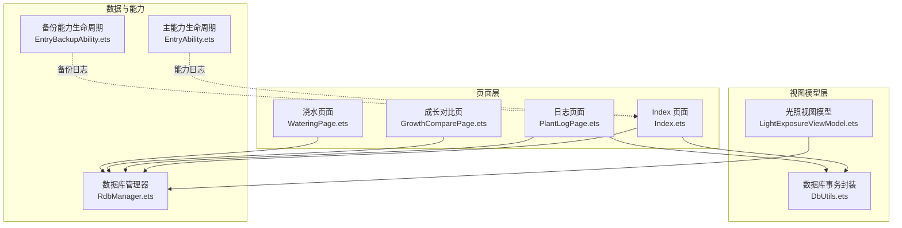
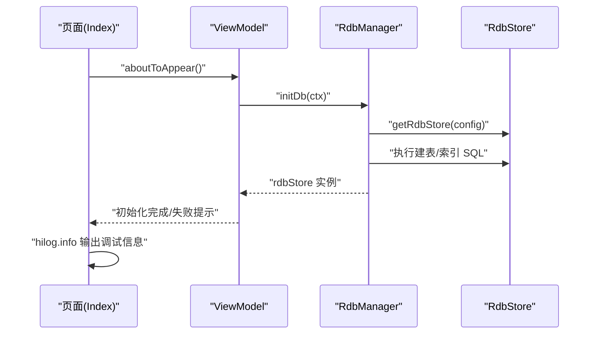
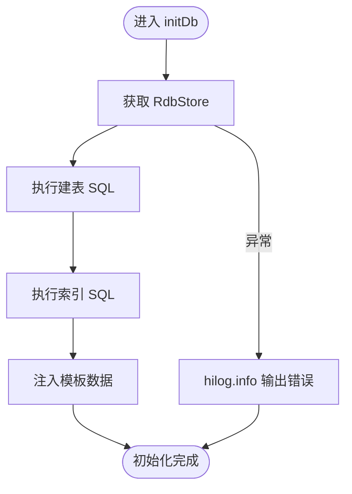
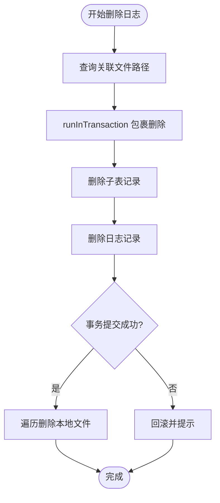
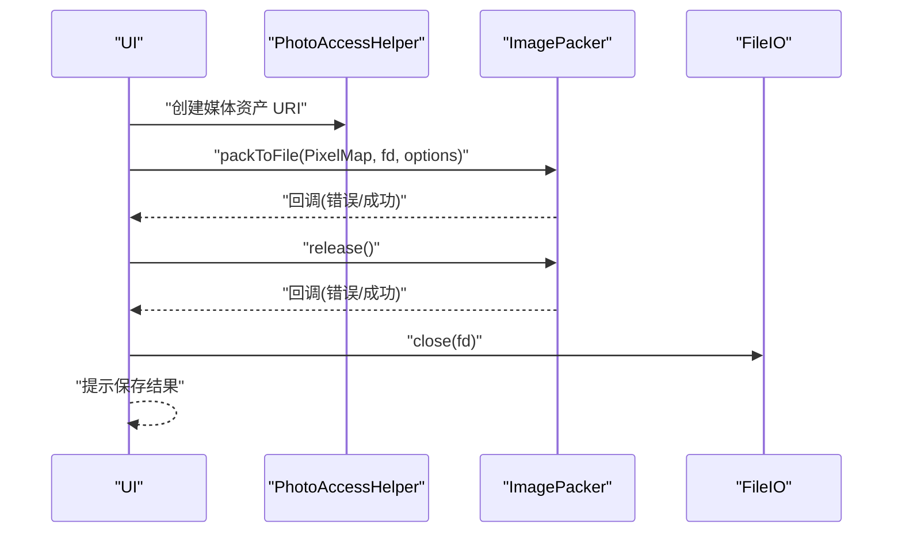
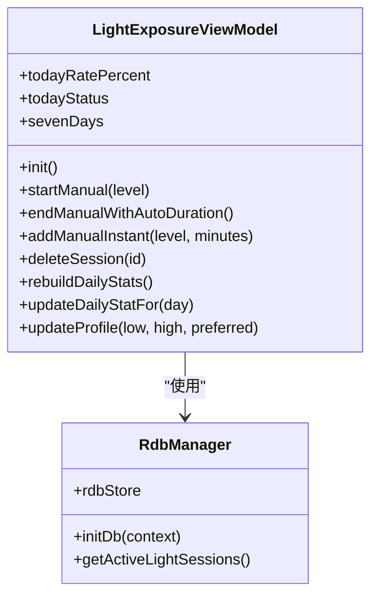
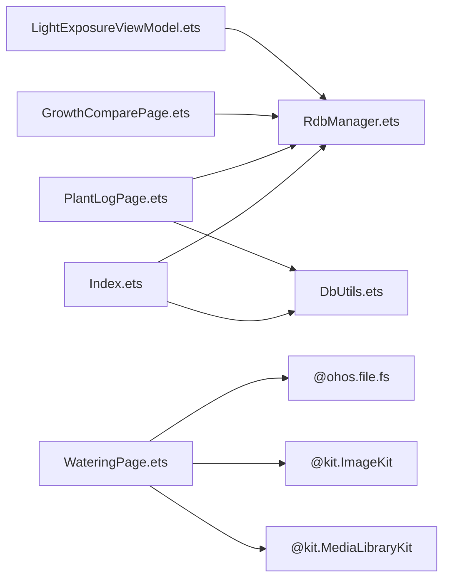

# 调试技巧

<cite>
**本文引用的文件**
- [Index.ets](file://entry/src/main/ets/pages/Index.ets)
- [RdbManager.ets](file://entry/src/main/ets/viewmodel/RdbManager.ets)
- [DbUtils.ets](file://entry/src/main/ets/model/DbUtils.ets)
- [WateringPage.ets](file://entry/src/main/ets/pages/WateringPage.ets)
- [PlantLogPage.ets](file://entry/src/main/ets/pages/PlantLogPage.ets)
- [GrowthComparePage.ets](file://entry/src/main/ets/pages/GrowthComparePage.ets)
- [LightExposureViewModel.ets](file://entry/src/main/ets/viewmodel/LightExposureViewModel.ets)
- [EntryAbility.ets](file://entry/src/main/ets/entryability/EntryAbility.ets)
- [EntryBackupAbility.ets](file://entry/src/main/ets/entrybackupability/EntryBackupAbility.ets)
- [PlantModel.ets](file://entry/src/main/ets/model/PlantModel.ets)
</cite>

## 目录
1. [简介](#简介)
2. [项目结构](#项目结构)
3. [核心组件](#核心组件)
4. [架构总览](#架构总览)
5. [详细组件分析](#详细组件分析)
6. [依赖分析](#依赖分析)
7. [性能考量](#性能考量)
8. [故障排查指南](#故障排查指南)
9. [结论](#结论)
10. [附录](#附录)

## 简介
本篇调试技巧文档面向在 HarmonyOS 上开发“植物日记”项目的工程师，聚焦于 ArkTS/JS 在 DevEco Studio 中的调试方法与最佳实践。内容涵盖断点调试、日志输出、性能分析、数据库与文件系统问题定位、网络请求异常排查、UI 渲染问题诊断，以及内存泄漏、CPU 使用率与 UI 流畅度优化策略。文中结合项目源码中的实际位置，给出可操作的调试流程与案例。

## 项目结构
项目采用页面-视图模型-数据模型分层组织，数据库通过统一的 RdbManager 管理，页面通过 ViewModel 与数据库交互，模型类承载轻量数据结构。关键调试点分布在页面生命周期、数据库事务、文件系统操作、媒体库集成与能力生命周期回调中。

**图示来源**
- [Index.ets:116-125](file://entry/src/main/ets/pages/Index.ets#L116-L125)
- [RdbManager.ets:19-34](file://entry/src/main/ets/viewmodel/RdbManager.ets#L19-L34)
- [DbUtils.ets:12-21](file://entry/src/main/ets/model/DbUtils.ets#L12-L21)
- [WateringPage.ets:31-55](file://entry/src/main/ets/pages/WateringPage.ets#L31-L55)
- [PlantLogPage.ets:66-82](file://entry/src/main/ets/pages/PlantLogPage.ets#L66-L82)
- [GrowthComparePage.ets:21-60](file://entry/src/main/ets/pages/GrowthComparePage.ets#L21-L60)
- [LightExposureViewModel.ets:43-113](file://entry/src/main/ets/viewmodel/LightExposureViewModel.ets#L43-L113)
- [EntryAbility.ets:12-30](file://entry/src/main/ets/entryability/EntryAbility.ets#L12-L30)
- [EntryBackupAbility.ets:102-130](file://entry/src/main/ets/entrybackupability/EntryBackupAbility.ets#L102-L130)

**章节来源**
- [Index.ets:116-125](file://entry/src/main/ets/pages/Index.ets#L116-L125)
- [RdbManager.ets:19-34](file://entry/src/main/ets/viewmodel/RdbManager.ets#L19-L34)

## 核心组件
- 数据库管理器 RdbManager：负责数据库初始化、建表与索引、模板数据注入、活动光照会话查询等。
- 数据库事务封装 runInTransaction：确保批量写入的原子性。
- 页面与 ViewModel：在生命周期钩子中进行数据库初始化与状态恢复；在业务操作中使用 hilog/console 输出调试信息。
- 能力生命周期：EntryAbility/EntryBackupAbility 提供应用与备份过程中的日志输出，便于定位启动、窗口阶段、备份等环节的问题。

**章节来源**
- [RdbManager.ets:19-170](file://entry/src/main/ets/viewmodel/RdbManager.ets#L19-L170)
- [DbUtils.ets:12-21](file://entry/src/main/ets/model/DbUtils.ets#L12-L21)
- [EntryAbility.ets:12-30](file://entry/src/main/ets/entryability/EntryAbility.ets#L12-L30)
- [EntryBackupAbility.ets:102-130](file://entry/src/main/ets/entrybackupability/EntryBackupAbility.ets#L102-L130)

## 架构总览
页面通过 Provider/Consumer 注入 RdbManager 与 store，ViewModel 负责业务逻辑与数据持久化，数据库通过统一配置创建并建立索引，页面在 aboutToAppear 中初始化数据库并在失败时输出 hilog 信息。

**图示来源**
- [Index.ets:116-125](file://entry/src/main/ets/pages/Index.ets#L116-L125)
- [RdbManager.ets:27-170](file://entry/src/main/ets/viewmodel/RdbManager.ets#L27-L170)

**章节来源**
- [Index.ets:116-125](file://entry/src/main/ets/pages/Index.ets#L116-L125)
- [RdbManager.ets:27-170](file://entry/src/main/ets/viewmodel/RdbManager.ets#L27-L170)

## 详细组件分析

### 数据库初始化与事务调试
- 初始化流程：页面在 aboutToAppear 中调用 initDb，内部通过 RdbManager 创建数据库、建表、建索引、注入模板数据，失败时通过 hilog.info 输出错误上下文。
- 事务封装：runInTransaction 确保批量写入要么全部成功，要么全部回滚；在日志删除、植物删除等涉及多表/文件的操作中使用，失败时回滚并提示。

**图示来源**
- [Index.ets:116-125](file://entry/src/main/ets/pages/Index.ets#L116-L125)
- [RdbManager.ets:27-170](file://entry/src/main/ets/viewmodel/RdbManager.ets#L27-L170)

**章节来源**
- [Index.ets:116-125](file://entry/src/main/ets/pages/Index.ets#L116-L125)
- [RdbManager.ets:27-170](file://entry/src/main/ets/viewmodel/RdbManager.ets#L27-L170)
- [DbUtils.ets:12-21](file://entry/src/main/ets/model/DbUtils.ets#L12-L21)

### 日志与照片删除的事务与文件清理
- 删除流程：先查询关联文件路径，再在事务中删除子表与主表记录，最后在事务提交后再删除本地文件，失败时回滚并提示。
- 调试要点：在删除日志时使用 hilog.info 输出受影响记录数量与谓词，便于核对删除范围；对文件删除异常进行捕获与告警。

**图示来源**
- [PlantLogPage.ets:87-137](file://entry/src/main/ets/pages/PlantLogPage.ets#L87-L137)
- [DbUtils.ets:12-21](file://entry/src/main/ets/model/DbUtils.ets#L12-L21)

**章节来源**
- [PlantLogPage.ets:87-137](file://entry/src/main/ets/pages/PlantLogPage.ets#L87-L137)
- [DbUtils.ets:12-21](file://entry/src/main/ets/model/DbUtils.ets#L12-L21)

### 浇水页面媒体保存流程与错误处理
- 流程：创建 Asset URI -> 编码 PixelMap -> 写入文件描述符 -> 释放资源 -> 关闭文件描述符。
- 调试要点：在 packToFile 与 release 回调中使用 console.error/console.info 输出错误与成功信息，便于定位编码、释放与关闭环节的问题。

**图示来源**
- [WateringPage.ets:31-55](file://entry/src/main/ets/pages/WateringPage.ets#L31-L55)

**章节来源**
- [WateringPage.ets:31-55](file://entry/src/main/ets/pages/WateringPage.ets#L31-L55)

### 光照会话管理与异常处理
- 初始化：加载光照配置、历史会话，检查并清理异常的进行中会话，重建每日统计。
- 异常处理：对异常进行中的会话进行强制关闭并输出 console.warn，避免状态不一致。
- 调试要点：在 startManual/endManual/addManualInstant/deleteSession 等关键节点输出 hilog/console 信息，核对会话状态与统计更新。

**图示来源**
- [LightExposureViewModel.ets:43-113](file://entry/src/main/ets/viewmodel/LightExposureViewModel.ets#L43-L113)
- [RdbManager.ets:27-170](file://entry/src/main/ets/viewmodel/RdbManager.ets#L27-L170)

**章节来源**
- [LightExposureViewModel.ets:43-113](file://entry/src/main/ets/viewmodel/LightExposureViewModel.ets#L43-L113)
- [LightExposureViewModel.ets:227-251](file://entry/src/main/ets/viewmodel/LightExposureViewModel.ets#L227-L251)

### 能力生命周期与备份流程调试
- EntryAbility：在 onCreate/onDestroy/onWindowStageCreate/onWindowStageDestroy/onForeground/onBackground 等生命周期中输出 hilog/info/warn/error，便于定位窗口阶段、前台/后台切换与异常。
- EntryBackupAbility：在 onBackup 开始/结束、数据库与照片备份过程中输出 hilog/info/warn/error，便于定位备份失败原因与跳过项。

**章节来源**
- [EntryAbility.ets:12-30](file://entry/src/main/ets/entryability/EntryAbility.ets#L12-L30)
- [EntryBackupAbility.ets:102-130](file://entry/src/main/ets/entrybackupability/EntryBackupAbility.ets#L102-L130)

## 依赖分析
- 页面依赖 RdbManager 提供的统一数据库实例与建表/索引能力。
- ViewModel 依赖 RdbManager 与 ArkTS 的 @ObservedV2 响应式机制，负责状态与业务逻辑。
- 文件系统与媒体库：页面通过 @ohos.file.fs 与 @kit.MediaLibraryKit 进行文件与相册操作，配合 hilog/console 输出定位问题。
- 数据模型：Plant、PlanTpl、PlantTask、LogEntry 等模型作为页面与数据库之间的数据载体，减少页面复杂度。

**图示来源**
- [Index.ets:44-45](file://entry/src/main/ets/pages/Index.ets#L44-L45)
- [RdbManager.ets:1-4](file://entry/src/main/ets/viewmodel/RdbManager.ets#L1-L4)
- [DbUtils.ets:1-2](file://entry/src/main/ets/model/DbUtils.ets#L1-L2)
- [WateringPage.ets:1-6](file://entry/src/main/ets/pages/WateringPage.ets#L1-L6)
- [PlantLogPage.ets:1-12](file://entry/src/main/ets/pages/PlantLogPage.ets#L1-L12)
- [GrowthComparePage.ets:1-9](file://entry/src/main/ets/pages/GrowthComparePage.ets#L1-L9)
- [LightExposureViewModel.ets:1-11](file://entry/src/main/ets/viewmodel/LightExposureViewModel.ets#L1-L11)
- [PlantModel.ets:1-10](file://entry/src/main/ets/model/PlantModel.ets#L1-L10)

**章节来源**
- [Index.ets:44-45](file://entry/src/main/ets/pages/Index.ets#L44-L45)
- [RdbManager.ets:1-4](file://entry/src/main/ets/viewmodel/RdbManager.ets#L1-L4)
- [DbUtils.ets:1-2](file://entry/src/main/ets/model/DbUtils.ets#L1-L2)
- [WateringPage.ets:1-6](file://entry/src/main/ets/pages/WateringPage.ets#L1-L6)
- [PlantLogPage.ets:1-12](file://entry/src/main/ets/pages/PlantLogPage.ets#L1-L12)
- [GrowthComparePage.ets:1-9](file://entry/src/main/ets/pages/GrowthComparePage.ets#L1-L9)
- [LightExposureViewModel.ets:1-11](file://entry/src/main/ets/viewmodel/LightExposureViewModel.ets#L1-L11)
- [PlantModel.ets:1-10](file://entry/src/main/ets/model/PlantModel.ets#L1-L10)

## 性能考量
- hilog 使用：在关键路径（数据库初始化、页面生命周期、媒体保存、光照会话状态变更）使用 hilog.info 输出耗时与状态，便于性能分析与回归对比。
- UI 流畅度：页面中大量使用动画与滚动，注意避免在主线程执行重型数据库/文件操作；将耗时操作放入异步任务，必要时拆分为多步更新。
- 内存与 GC：ViewModel 中的数组与对象频繁更新，注意及时释放大对象引用，避免闭包持有导致的内存泄漏；使用 @ObservedV2 时避免不必要的状态膨胀。
- CPU 使用率：在高频刷新（如光照实时进度）场景，合理控制刷新频率与计算复杂度，必要时引入节流/防抖。

[本节为通用指导，无需列出具体文件来源]

## 故障排查指南

### 数据库连接与初始化问题
- 现象：页面初始化失败，提示数据库初始化失败。
- 排查步骤：
  - 检查 RdbManager.initDb 的配置与权限，确认 StoreConfig 参数正确。
  - 在 Index.aboutToAppear 的 catch 分支中查看 hilog.info 输出的错误上下文。
  - 确认建表/索引 SQL 是否执行成功，是否存在唯一索引冲突导致插入失败。
- 相关位置参考：
  - [Index.ets:116-125](file://entry/src/main/ets/pages/Index.ets#L116-L125)
  - [RdbManager.ets:27-170](file://entry/src/main/ets/viewmodel/RdbManager.ets#L27-L170)

**章节来源**
- [Index.ets:116-125](file://entry/src/main/ets/pages/Index.ets#L116-L125)
- [RdbManager.ets:27-170](file://entry/src/main/ets/viewmodel/RdbManager.ets#L27-L170)

### 数据库事务与一致性问题
- 现象：批量删除/更新后状态不一致或部分失败。
- 排查步骤：
  - 使用 runInTransaction 包裹多表/多文件操作，确保原子性。
  - 在删除日志时，先查询文件路径，事务提交后再删除本地文件，避免数据与文件不一致。
  - 检查事务回滚分支是否被触发，关注 hilog/console 输出。
- 相关位置参考：
  - [DbUtils.ets:12-21](file://entry/src/main/ets/model/DbUtils.ets#L12-L21)
  - [PlantLogPage.ets:87-137](file://entry/src/main/ets/pages/PlantLogPage.ets#L87-L137)

**章节来源**
- [DbUtils.ets:12-21](file://entry/src/main/ets/model/DbUtils.ets#L12-L21)
- [PlantLogPage.ets:87-137](file://entry/src/main/ets/pages/PlantLogPage.ets#L87-L137)

### 网络请求异常（概念性）
- 现象：页面加载/上传/下载失败。
- 排查步骤（概念性）：
  - 使用 hilog.info/console.error 输出请求 URL、状态码、错误消息。
  - 检查超时、证书、代理与权限配置。
  - 对重试与降级策略进行验证。
- 适用范围：若项目涉及网络请求，可参照本节思路进行定位。

[本节为概念性内容，不直接分析具体文件，故无“章节来源”]

### UI 渲染与动画问题
- 现象：页面闪烁、滚动卡顿、动画不流畅。
- 排查步骤：
  - 减少主线程阻塞操作，将数据库/文件操作移至后台。
  - 控制动画时长与曲线，避免过度复杂的布局测量。
  - 使用 hilog.info 输出关键状态变更，核对渲染路径。
- 相关位置参考：
  - [LightExposureViewModel.ets:120-122](file://entry/src/main/ets/viewmodel/LightExposureViewModel.ets#L120-L122)

**章节来源**
- [LightExposureViewModel.ets:120-122](file://entry/src/main/ets/viewmodel/LightExposureViewModel.ets#L120-L122)

### 媒体保存与相册写入问题
- 现象：保存到相册失败或资源释放报错。
- 排查步骤：
  - 在 packToFile 与 release 回调中使用 console.error/console.info 输出错误与成功信息。
  - 检查文件描述符打开/关闭顺序与权限。
- 相关位置参考：
  - [WateringPage.ets:31-55](file://entry/src/main/ets/pages/WateringPage.ets#L31-L55)

**章节来源**
- [WateringPage.ets:31-55](file://entry/src/main/ets/pages/WateringPage.ets#L31-L55)

### 能力生命周期与备份问题
- 现象：应用启动/窗口阶段异常、备份失败。
- 排查步骤：
  - 在 EntryAbility/EntryBackupAbility 的生命周期中查看 hilog/info/warn/error 输出。
  - 核对备份流程中数据库与照片目录的存在性与可访问性。
- 相关位置参考：
  - [EntryAbility.ets:12-30](file://entry/src/main/ets/entryability/EntryAbility.ets#L12-L30)
  - [EntryBackupAbility.ets:102-130](file://entry/src/main/ets/entrybackupability/EntryBackupAbility.ets#L102-L130)

**章节来源**
- [EntryAbility.ets:12-30](file://entry/src/main/ets/entryability/EntryAbility.ets#L12-L30)
- [EntryBackupAbility.ets:102-130](file://entry/src/main/ets/entrybackupability/EntryBackupAbility.ets#L102-L130)

## 结论
通过在关键路径使用 hilog.info 与 console.error 输出、在页面生命周期中进行数据库初始化、在事务中保证一致性、在媒体与文件操作中严格顺序与回退策略，可以有效提升“植物日记”在 HarmonyOS 平台上的稳定性与可观测性。配合 DevEco Studio 的断点调试、变量监视与调用栈分析，能够快速定位并解决数据库、UI 与媒体相关问题。

[本节为总结性内容，无需列出具体文件来源]

## 附录

### DevEco Studio 调试要点
- 断点调试：在页面生命周期（如 aboutToAppear）、数据库初始化、事务包裹区域、媒体保存回调等位置设置断点，观察变量与调用栈。
- 变量监视：关注 store、rdbStore、文件路径、媒体 URI、会话状态等关键变量的变化。
- 调用栈分析：在异常或性能瓶颈处查看调用栈，定位深层调用链与耗时点。

[本节为通用指导，无需列出具体文件来源]