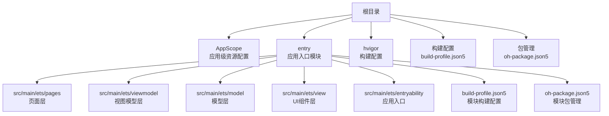
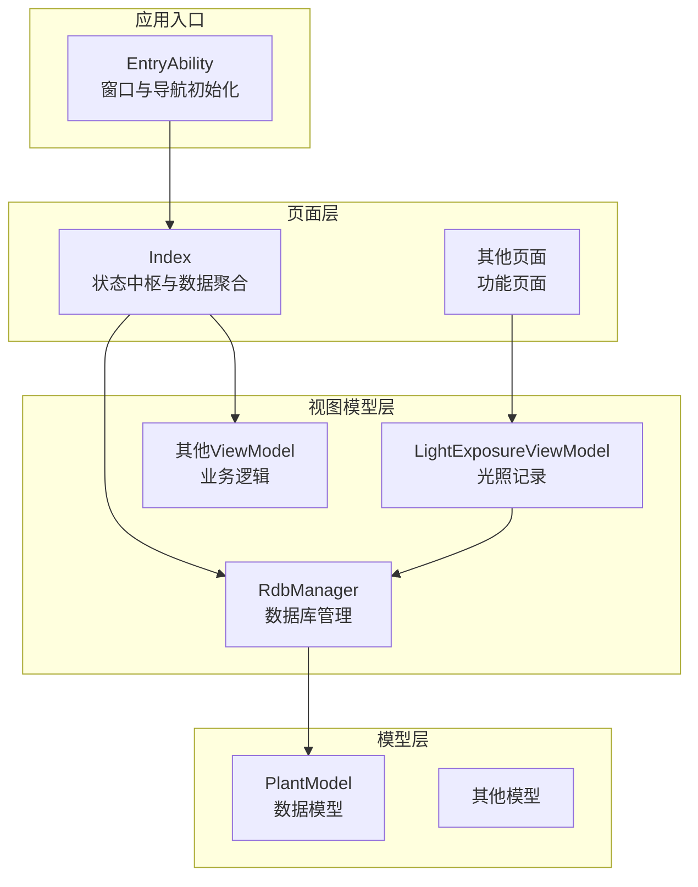
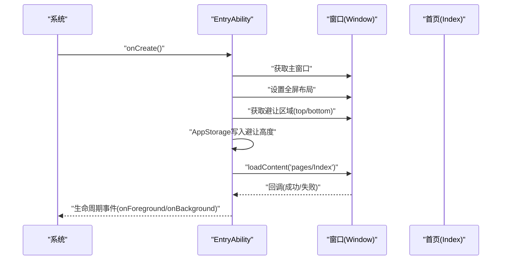
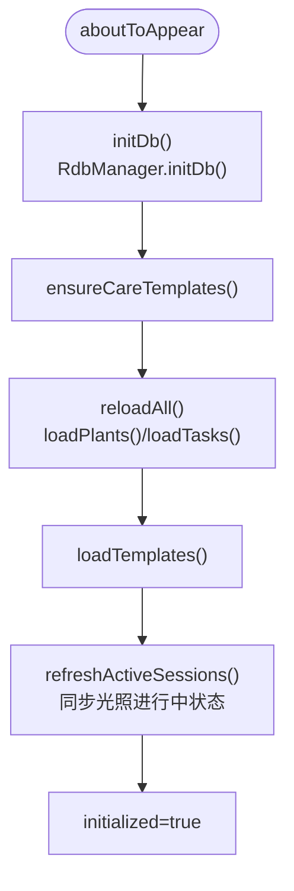
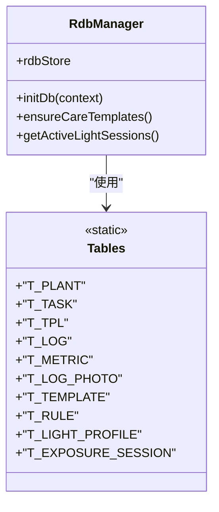
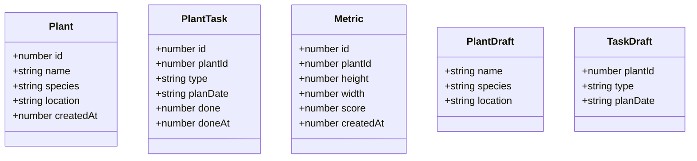
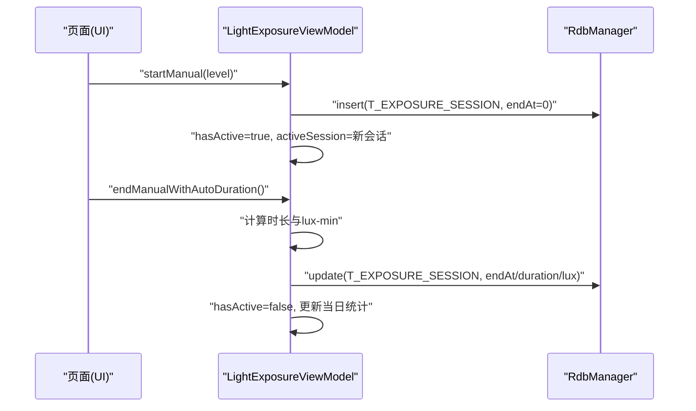
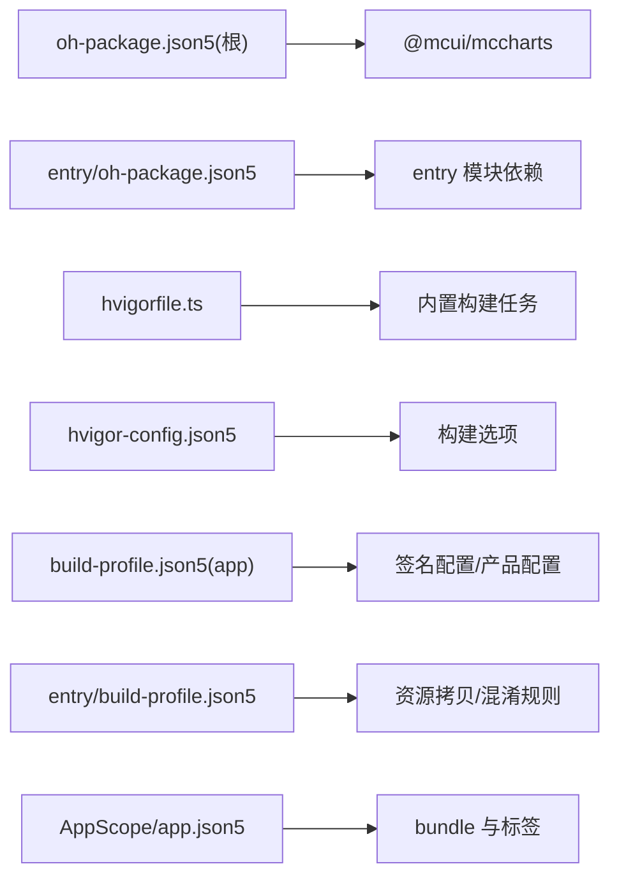

# 快速开始

<cite>
**本文引用的文件**
- [AppScope/app.json5](file://AppScope/app.json5)
- [entry/build-profile.json5](file://entry/build-profile.json5)
- [build-profile.json5](file://build-profile.json5)
- [hvigorfile.ts](file://hvigorfile.ts)
- [hvigor/hvigor-config.json5](file://hvigor/hvigor-config.json5)
- [oh-package.json5](file://oh-package.json5)
- [entry/oh-package.json5](file://entry/oh-package.json5)
- [entry/src/main/ets/entryability/EntryAbility.ets](file://entry/src/main/ets/entryability/EntryAbility.ets)
- [entry/src/main/ets/pages/Index.ets](file://entry/src/main/ets/pages/Index.ets)
- [entry/src/main/ets/viewmodel/RdbManager.ets](file://entry/src/main/ets/viewmodel/RdbManager.ets)
- [entry/src/main/ets/model/PlantModel.ets](file://entry/src/main/ets/model/PlantModel.ets)
- [entry/src/main/ets/viewmodel/LightExposureViewModel.ets](file://entry/src/main/ets/viewmodel/LightExposureViewModel.ets)
- [PROJECT_GUIDE.md](file://PROJECT_GUIDE.md)
</cite>

## 目录
1. [简介](#简介)
2. [项目结构](#项目结构)
3. [核心组件](#核心组件)
4. [架构总览](#架构总览)
5. [详细组件分析](#详细组件分析)
6. [依赖分析](#依赖分析)
7. [性能注意事项](#性能注意事项)
8. [故障排查指南](#故障排查指南)
9. [结论](#结论)
10. [附录](#附录)

## 简介
本指南面向首次接触植物日记（HarmonyOS + ArkTS）项目的开发者，帮助你在最短时间内完成开发环境搭建、项目克隆、依赖安装、编译构建与运行调试，并掌握首次运行后的基础操作。文档涵盖以下要点：
- 开发环境要求与工具安装（DevEco Studio、HarmonyOS SDK、Node.js）
- 项目克隆与依赖安装
- 编译构建与运行调试流程
- 常见环境问题与验证步骤
- 构建配置文件与启动参数说明
- 首次运行后的核心功能上手

## 项目结构
该项目采用模块化的目录组织方式，主要包含应用作用域配置、入口模块（entry）、构建配置与包管理文件等。关键目录与文件如下：
- AppScope：应用级资源配置（如 bundle 名称、图标、标签等）
- entry：应用入口模块，包含页面、组件、视图模型、模型与测试等
- 构建与插件：hvigorfile.ts、hvigor-config.json5、build-profile.json5、entry/build-profile.json5
- 包管理：oh-package.json5、entry/oh-package.json5

**图表来源**
- [AppScope/app.json5:1-11](file://AppScope/app.json5#L1-L11)
- [entry/build-profile.json5:1-33](file://entry/build-profile.json5#L1-L33)
- [hvigorfile.ts:1-6](file://hvigorfile.ts#L1-L6)
- [hvigor/hvigor-config.json5:1-24](file://hvigor/hvigor-config.json5#L1-L24)
- [oh-package.json5:1-12](file://oh-package.json5#L1-L12)
- [entry/oh-package.json5:1-11](file://entry/oh-package.json5#L1-L11)

**章节来源**
- [AppScope/app.json5:1-11](file://AppScope/app.json5#L1-L11)
- [entry/build-profile.json5:1-33](file://entry/build-profile.json5#L1-L33)
- [hvigorfile.ts:1-6](file://hvigorfile.ts#L1-L6)
- [hvigor/hvigor-config.json5:1-24](file://hvigor/hvigor-config.json5#L1-L24)
- [oh-package.json5:1-12](file://oh-package.json5#L1-L12)
- [entry/oh-package.json5:1-11](file://entry/oh-package.json5#L1-L11)

## 核心组件
- 应用入口（EntryAbility）：负责窗口创建、全屏布局、状态栏与导航栏避让区域处理，并加载首页内容。
- 首页（Index）：应用状态中枢，负责数据库初始化、全局数据加载与状态管理，承载植物、任务、模板、指标等数据的统一入口。
- 数据库管理（RdbManager）：负责数据库初始化、建表与索引、默认数据注入及常用查询。
- 数据模型（PlantModel）：定义植物、任务、指标等轻量数据结构，配合响应式装饰器实现状态更新。
- 光照记录视图模型（LightExposureViewModel）：负责光照会话管理、统计计算与每日达标率/状态更新。

**章节来源**
- [entry/src/main/ets/entryability/EntryAbility.ets:1-79](file://entry/src/main/ets/entryability/EntryAbility.ets#L1-L79)
- [entry/src/main/ets/pages/Index.ets:1-1382](file://entry/src/main/ets/pages/Index.ets#L1-L1382)
- [entry/src/main/ets/viewmodel/RdbManager.ets:1-296](file://entry/src/main/ets/viewmodel/RdbManager.ets#L1-L296)
- [entry/src/main/ets/model/PlantModel.ets:1-166](file://entry/src/main/ets/model/PlantModel.ets#L1-L166)
- [entry/src/main/ets/viewmodel/LightExposureViewModel.ets:1-554](file://entry/src/main/ets/viewmodel/LightExposureViewModel.ets#L1-L554)

## 架构总览
应用采用 MVVM 架构，页面层（pages）通过视图模型（viewmodel）与模型（model）解耦，数据持久化由数据库管理器统一处理。应用入口负责窗口与导航初始化，首页作为状态中枢协调各模块。

**图表来源**
- [entry/src/main/ets/entryability/EntryAbility.ets:1-79](file://entry/src/main/ets/entryability/EntryAbility.ets#L1-L79)
- [entry/src/main/ets/pages/Index.ets:1-1382](file://entry/src/main/ets/pages/Index.ets#L1-L1382)
- [entry/src/main/ets/viewmodel/RdbManager.ets:1-296](file://entry/src/main/ets/viewmodel/RdbManager.ets#L1-L296)
- [entry/src/main/ets/viewmodel/LightExposureViewModel.ets:1-554](file://entry/src/main/ets/viewmodel/LightExposureViewModel.ets#L1-L554)
- [entry/src/main/ets/model/PlantModel.ets:1-166](file://entry/src/main/ets/model/PlantModel.ets#L1-L166)

## 详细组件分析

### 应用入口（EntryAbility）
职责与流程：
- 设置窗口全屏与状态栏/导航栏避让区域
- 加载首页内容（pages/Index）
- 生命周期日志输出（性能分析）

**图表来源**
- [entry/src/main/ets/entryability/EntryAbility.ets:1-79](file://entry/src/main/ets/entryability/EntryAbility.ets#L1-L79)

**章节来源**
- [entry/src/main/ets/entryability/EntryAbility.ets:1-79](file://entry/src/main/ets/entryability/EntryAbility.ets#L1-L79)

### 首页（Index）与数据库初始化
职责与流程：
- 初始化数据库（RdbManager.initDb）
- 加载植物、任务、模板等全局数据
- 统一重载与状态同步（如光照进行中状态）
- 提供增删改查与模板/任务批量生成等能力

**图表来源**
- [entry/src/main/ets/pages/Index.ets:116-135](file://entry/src/main/ets/pages/Index.ets#L116-L135)
- [entry/src/main/ets/viewmodel/RdbManager.ets:27-170](file://entry/src/main/ets/viewmodel/RdbManager.ets#L27-L170)

**章节来源**
- [entry/src/main/ets/pages/Index.ets:116-135](file://entry/src/main/ets/pages/Index.ets#L116-L135)
- [entry/src/main/ets/viewmodel/RdbManager.ets:27-170](file://entry/src/main/ets/viewmodel/RdbManager.ets#L27-L170)

### 数据库管理（RdbManager）
职责与流程：
- 创建数据库与表（植物、任务、模板、日志、指标、光照配置与会话等）
- 建立常用索引（提升查询性能）
- 注入默认养护模板与规则
- 提供活跃光照会话查询，供首页同步状态

**图表来源**
- [entry/src/main/ets/viewmodel/RdbManager.ets:1-296](file://entry/src/main/ets/viewmodel/RdbManager.ets#L1-L296)

**章节来源**
- [entry/src/main/ets/viewmodel/RdbManager.ets:1-296](file://entry/src/main/ets/viewmodel/RdbManager.ets#L1-L296)

### 数据模型（PlantModel）
职责与流程：
- 定义植物、任务、指标等数据结构
- 使用响应式装饰器（@ObservedV2/@Trace）实现状态变更通知
- 为页面与视图模型提供共享的轻量数据类型

**图表来源**
- [entry/src/main/ets/model/PlantModel.ets:1-166](file://entry/src/main/ets/model/PlantModel.ets#L1-L166)

**章节来源**
- [entry/src/main/ets/model/PlantModel.ets:1-166](file://entry/src/main/ets/model/PlantModel.ets#L1-L166)

### 光照记录视图模型（LightExposureViewModel）
职责与流程：
- 初始化光照配置与历史会话
- 管理进行中的光照会话（开始/结束/强制关闭）
- 计算光照量（lux-min）与每日统计
- 计算今日达标率与状态（不足/适中/过强）
- 提供最近7天统计用于图表展示

**图表来源**
- [entry/src/main/ets/viewmodel/LightExposureViewModel.ets:129-192](file://entry/src/main/ets/viewmodel/LightExposureViewModel.ets#L129-L192)

**章节来源**
- [entry/src/main/ets/viewmodel/LightExposureViewModel.ets:1-554](file://entry/src/main/ets/viewmodel/LightExposureViewModel.ets#L1-L554)

## 依赖分析
- 包管理：顶层与模块级 oh-package.json5 定义了依赖与开发依赖（如图表库、测试框架等）
- 构建配置：hvigorfile.ts 指向内置构建任务；hvigor-config.json5 提供构建执行选项（如并行、增量、类型检查等）
- 模块配置：entry/build-profile.json5 控制资源拷贝、混淆规则与目标产物
- 应用配置：AppScope/app.json5 定义 bundle 信息与应用标签

**图表来源**
- [oh-package.json5:1-12](file://oh-package.json5#L1-L12)
- [entry/oh-package.json5:1-11](file://entry/oh-package.json5#L1-L11)
- [hvigorfile.ts:1-6](file://hvigorfile.ts#L1-L6)
- [hvigor/hvigor-config.json5:1-24](file://hvigor/hvigor-config.json5#L1-L24)
- [build-profile.json5:1-69](file://build-profile.json5#L1-L69)
- [entry/build-profile.json5:1-33](file://entry/build-profile.json5#L1-L33)
- [AppScope/app.json5:1-11](file://AppScope/app.json5#L1-L11)

**章节来源**
- [oh-package.json5:1-12](file://oh-package.json5#L1-L12)
- [entry/oh-package.json5:1-11](file://entry/oh-package.json5#L1-L11)
- [hvigorfile.ts:1-6](file://hvigorfile.ts#L1-L6)
- [hvigor/hvigor-config.json5:1-24](file://hvigor/hvigor-config.json5#L1-L24)
- [build-profile.json5:1-69](file://build-profile.json5#L1-L69)
- [entry/build-profile.json5:1-33](file://entry/build-profile.json5#L1-L33)
- [AppScope/app.json5:1-11](file://AppScope/app.json5#L1-L11)

## 性能注意事项
- 避免在组件 build 中执行复杂计算，尽量将计算逻辑放入 ViewModel
- 使用响应式装饰器精确追踪数据变化，减少不必要的 UI 重绘
- 大数据列表使用惰性渲染（如 LazyForEach）降低渲染开销
- 合理使用索引（RdbManager 已为常用查询建立索引），避免全表扫描
- 构建阶段可启用并行与增量编译（hvigor-config.json5 中相关选项可按需开启）

[本节为通用建议，无需特定文件引用]

## 故障排查指南
常见问题与解决思路：
- 数据库初始化失败
  - 现象：首页提示数据库初始化失败
  - 排查：确认 RdbManager.initDb 是否成功执行，检查权限与存储空间
  - 参考：首页初始化流程与数据库建表逻辑
- 页面间数据传递
  - 现象：页面间参数丢失或类型不匹配
  - 排查：使用参数装饰器接收参数，通过导航栈进行页面跳转
  - 参考：开发指南中的页面间传递与导航说明
- 实时数据更新不生效
  - 现象：数据变更后 UI 未更新
  - 排查：确保使用响应式装饰器（@ObservedV2/@Trace），避免直接修改不可追踪对象
  - 参考：开发指南中的状态管理与响应式更新说明
- 构建或运行报错
  - 现象：构建失败或设备端运行异常
  - 排查：检查构建配置（build-profile.json5、entry/build-profile.json5）、签名配置与设备兼容性
  - 参考：构建配置与运行参数说明

**章节来源**
- [entry/src/main/ets/pages/Index.ets:116-125](file://entry/src/main/ets/pages/Index.ets#L116-L125)
- [entry/src/main/ets/viewmodel/RdbManager.ets:27-170](file://entry/src/main/ets/viewmodel/RdbManager.ets#L27-L170)
- [PROJECT_GUIDE.md:233-243](file://PROJECT_GUIDE.md#L233-L243)

## 结论
通过本快速开始指南，你已了解植物日记项目的整体架构、核心组件职责与关键配置文件的作用。按照环境搭建与运行流程逐步操作，即可在 HarmonyOS 设备上顺利运行项目，并基于首页与数据库管理器快速上手核心功能。遇到问题时，可依据故障排查指南定位并解决。

[本节为总结，无需特定文件引用]

## 附录

### 开发环境搭建步骤
- 安装 DevEco Studio
  - 从官方渠道下载并安装最新版本
  - 首次启动后配置 HarmonyOS SDK（建议选择与项目匹配的版本）
- 准备 Node.js 环境
  - 安装 Node.js（建议使用 LTS 版本）
  - 验证 npm/node 命令可用
- 准备设备
  - 真机：开启开发者选项与 USB 调试，允许安装测试证书
  - 模拟器：在 DevEco Studio 中创建并启动目标设备镜像

[本节为通用步骤，无需特定文件引用]

### 项目克隆、依赖安装与构建运行
- 克隆仓库至本地
- 在 DevEco Studio 中打开项目根目录
- 依赖安装
  - 根据包管理文件自动安装依赖（oh-package.json5、entry/oh-package.json5）
- 编译构建
  - 使用 hvigor 构建系统，默认目标为 stageMode
  - 可在构建配置中选择 debug/release 模式
- 运行调试
  - 选择目标设备（模拟器/真机）
  - 点击运行按钮，等待安装与启动
  - 首次运行会初始化本地数据库并加载默认数据

**章节来源**
- [hvigorfile.ts:1-6](file://hvigorfile.ts#L1-L6)
- [hvigor/hvigor-config.json5:1-24](file://hvigor/hvigor-config.json5#L1-L24)
- [entry/build-profile.json5:1-33](file://entry/build-profile.json5#L1-L33)
- [build-profile.json5:1-69](file://build-profile.json5#L1-L69)
- [oh-package.json5:1-12](file://oh-package.json5#L1-L12)
- [entry/oh-package.json5:1-11](file://entry/oh-package.json5#L1-L11)

### 构建配置文件与启动参数说明
- hvigorfile.ts
  - 指向内置构建任务，可扩展自定义插件
- hvigor-config.json5
  - 构建执行选项：并行、增量、类型检查、优化策略等
- build-profile.json5（应用级）
  - 签名配置、产品配置、严格模式等
- entry/build-profile.json5（模块级）
  - 资源拷贝策略、混淆规则、目标产物等
- AppScope/app.json5
  - 应用 bundle 信息、图标与标签

**章节来源**
- [hvigorfile.ts:1-6](file://hvigorfile.ts#L1-L6)
- [hvigor/hvigor-config.json5:1-24](file://hvigor/hvigor-config.json5#L1-L24)
- [build-profile.json5:1-69](file://build-profile.json5#L1-L69)
- [entry/build-profile.json5:1-33](file://entry/build-profile.json5#L1-L33)
- [AppScope/app.json5:1-11](file://AppScope/app.json5#L1-L11)

### 首次运行后的基本操作指导
- 添加植物
  - 在首页点击新建，填写名称/种类/位置，保存后可在植物列表查看
- 记录光照
  - 进入植物详情，选择光照记录页，设置光照级别并开始/结束会话
- 浇水估算
  - 进入浇水估算页，输入盆径、深度与介质，查看推荐用水量并保存记录
- 查看生长指标
  - 进入生长指标页，记录身高/冠幅/健康分，查看趋势图表
- 任务管理
  - 在任务页创建/完成日常养护任务，支持模板批量生成周期任务

**章节来源**
- [entry/src/main/ets/pages/Index.ets:287-402](file://entry/src/main/ets/pages/Index.ets#L287-L402)
- [entry/src/main/ets/viewmodel/LightExposureViewModel.ets:129-192](file://entry/src/main/ets/viewmodel/LightExposureViewModel.ets#L129-L192)
- [PROJECT_GUIDE.md:124-186](file://PROJECT_GUIDE.md#L124-L186)