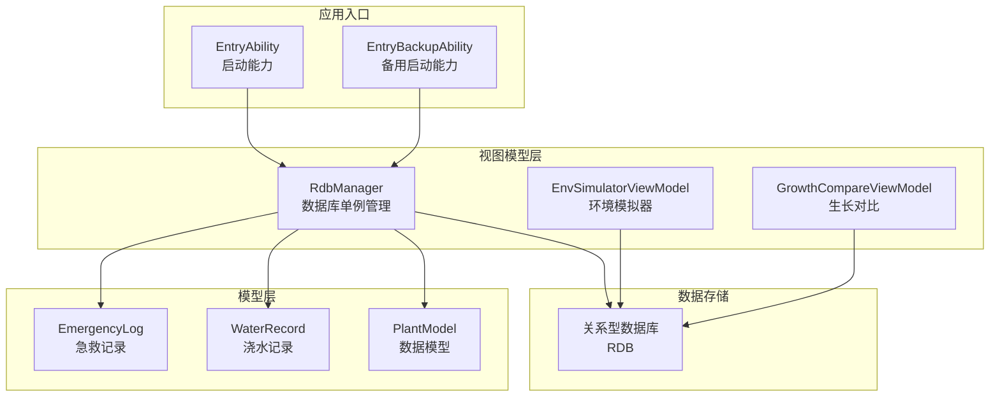
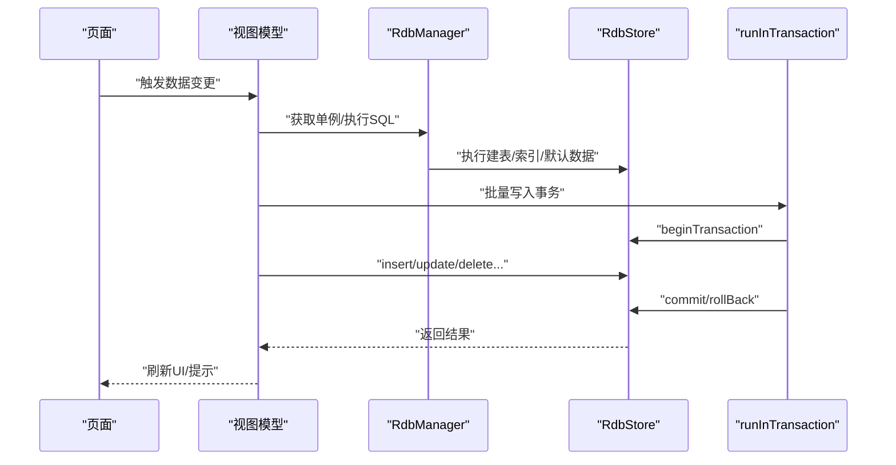
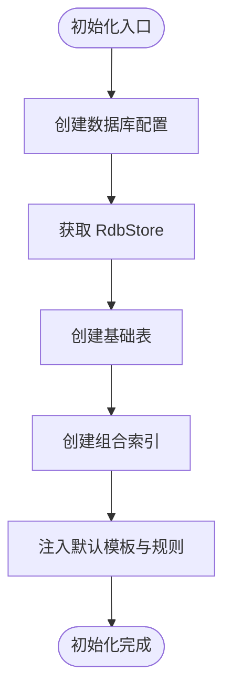
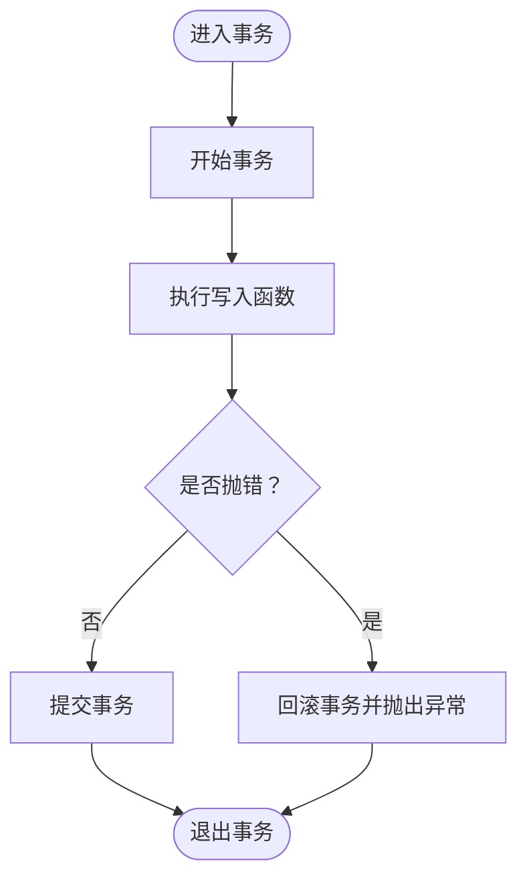
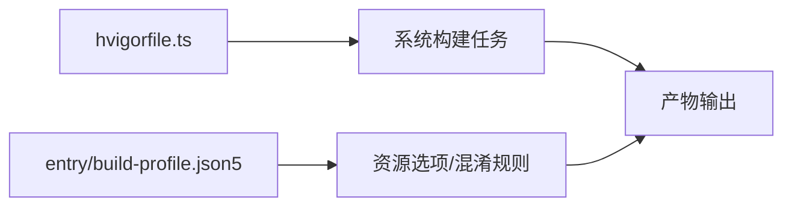

# 故障排除

<cite>
**本文引用的文件**
- [entry/src/main/ets/model/DbUtils.ets](file://entry/src/main/ets/model/DbUtils.ets)
- [entry/src/main/ets/viewmodel/RdbManager.ets](file://entry/src/main/ets/viewmodel/RdbManager.ets)
- [entry/src/main/ets/model/PlantModel.ets](file://entry/src/main/ets/model/PlantModel.ets)
- [entry/src/main/ets/model/WaterRecord.ets](file://entry/src/main/ets/model/WaterRecord.ets)
- [entry/src/main/ets/viewmodel/EnvSimulatorViewModel.ets](file://entry/src/main/ets/viewmodel/EnvSimulatorViewModel.ets)
- [entry/src/main/ets/viewmodel/GrowthCompareViewModel.ets](file://entry/src/main/ets/viewmodel/GrowthCompareViewModel.ets)
- [entry/src/main/ets/model/EmergencyLog.ets](file://entry/src/main/ets/model/EmergencyLog.ets)
- [entry/src/main/ets/viewmodel/err.ets](file://entry/src/main/ets/viewmodel/err.ets)
- [entry/build-profile.json5](file://entry/build-profile.json5)
- [hvigorfile.ts](file://hvigorfile.ts)
</cite>

## 目录
1. [简介](#简介)
2. [项目结构](#项目结构)
3. [核心组件](#核心组件)
4. [架构总览](#架构总览)
5. [详细组件分析](#详细组件分析)
6. [依赖分析](#依赖分析)
7. [性能考虑](#性能考虑)
8. [故障排除指南](#故障排除指南)
9. [结论](#结论)
10. [附录](#附录)

## 简介
本指南面向植物日记项目的开发者，聚焦于常见问题的系统化排查与解决，涵盖编译错误、运行时异常、数据库连接与一致性问题、日志分析与性能监控、环境配置与依赖冲突、兼容性问题、性能瓶颈定位与优化建议，以及不同开发阶段的预防与应急处理策略。文档以仓库中的实际代码为依据，提供可操作的定位步骤与修复建议。

## 项目结构
植物日记采用 ArkTS（ArkUI + TypeScript）技术栈，数据库使用关系型存储模块，采用单例式 RDB 管理器集中初始化与建表，页面与视图模型通过统一的存储实例进行数据访问。构建工具链基于 Hvigor，构建配置位于入口模块的构建配置文件中。

**图表来源**
- [entry/src/main/ets/viewmodel/RdbManager.ets](file://entry/src/main/ets/viewmodel/RdbManager.ets)
- [entry/src/main/ets/viewmodel/EnvSimulatorViewModel.ets](file://entry/src/main/ets/viewmodel/EnvSimulatorViewModel.ets)
- [entry/src/main/ets/viewmodel/GrowthCompareViewModel.ets](file://entry/src/main/ets/viewmodel/GrowthCompareViewModel.ets)
- [entry/src/main/ets/model/PlantModel.ets](file://entry/src/main/ets/model/PlantModel.ets)
- [entry/src/main/ets/model/WaterRecord.ets](file://entry/src/main/ets/model/WaterRecord.ets)
- [entry/src/main/ets/model/EmerergencyLog.ets](file://entry/src/main/ets/model/EmergencyLog.ets)

**章节来源**
- [entry/build-profile.json5](file://entry/build-profile.json5)
- [hvigorfile.ts](file://hvigorfile.ts)

## 核心组件
- 数据库单例与事务封装
  - RdbManager 负责数据库初始化、建表、索引与默认数据注入，并提供单例访问。
  - DbUtils 提供统一事务封装，保证批量写入的原子性。
- 数据模型
  - PlantModel 定义植物、任务、指标、日志等轻量数据结构，用于页面与数据库之间的契约。
  - WaterRecord 与 EmergencyLog 作为轻量实体，分别承载浇水记录与急救记录。
- 视图模型
  - EnvSimulatorViewModel 提供环境模拟与快照导出，不直接持久化。
  - GrowthCompareViewModel 管理前后对比图像的对齐与保存，不直接持久化。

**章节来源**
- [entry/src/main/ets/viewmodel/RdbManager.ets](file://entry/src/main/ets/viewmodel/RdbManager.ets)
- [entry/src/main/ets/model/DbUtils.ets](file://entry/src/main/ets/model/DbUtils.ets)
- [entry/src/main/ets/model/PlantModel.ets](file://entry/src/main/ets/model/PlantModel.ets)
- [entry/src/main/ets/model/WaterRecord.ets](file://entry/src/main/ets/model/WaterRecord.ets)
- [entry/src/main/ets/model/EmergencyLog.ets](file://entry/src/main/ets/model/EmergencyLog.ets)
- [entry/src/main/ets/viewmodel/EnvSimulatorViewModel.ets](file://entry/src/main/ets/viewmodel/EnvSimulatorViewModel.ets)
- [entry/src/main/ets/viewmodel/GrowthCompareViewModel.ets](file://entry/src/main/ets/viewmodel/GrowthCompareViewModel.ets)

## 架构总览
下图展示了从页面到视图模型、再到数据库的典型调用路径与数据流。页面通过视图模型发起数据库操作，视图模型通过 RdbManager 获取存储实例；事务封装确保批量写入的一致性。

**图表来源**
- [entry/src/main/ets/viewmodel/RdbManager.ets](file://entry/src/main/ets/viewmodel/RdbManager.ets)
- [entry/src/main/ets/model/DbUtils.ets](file://entry/src/main/ets/model/DbUtils.ets)

## 详细组件分析

### 数据库单例与初始化（RdbManager）
- 单例模式：getInstance 确保全局唯一存储实例。
- 初始化流程：创建数据库配置，获取 RdbStore，依次建表、建索引、注入默认数据。
- 索引设计：针对高频查询（任务按计划日期、植物ID；日志按植物+时间；指标按植物+时间）建立组合索引，减少查询成本。
- 默认模板：空库时一次性写入多种植物模板及规则，避免覆盖用户后续修改。

**图表来源**
- [entry/src/main/ets/viewmodel/RdbManager.ets](file://entry/src/main/ets/viewmodel/RdbManager.ets)

**章节来源**
- [entry/src/main/ets/viewmodel/RdbManager.ets](file://entry/src/main/ets/viewmodel/RdbManager.ets)

### 事务封装（DbUtils.runInTransaction）
- 目的：确保批量写入要么全部成功、要么全部回滚，提升数据一致性。
- 使用方式：传入存储实例与异步函数块，在 try/catch 中自动提交或回滚。

**图表来源**
- [entry/src/main/ets/model/DbUtils.ets](file://entry/src/main/ets/model/DbUtils.ets)

**章节来源**
- [entry/src/main/ets/model/DbUtils.ets](file://entry/src/main/ets/model/DbUtils.ets)

### 数据模型（PlantModel）
- 轻量契约：仅包含字段与少量构造逻辑，复杂业务规则放在页面或 ViewModel。
- 观测属性：使用 @ObservedV2 与 @Trace 注解，便于响应式更新。
- 结构覆盖：植物、任务、指标、日志、模板与规则等类型，字段与数据库表保持一致。

**章节来源**
- [entry/src/main/ets/model/PlantModel.ets](file://entry/src/main/ets/model/PlantModel.ets)

### 环境模拟器（EnvSimulatorViewModel）
- 纯计算型：不直接持久化，仅生成快照供调用方决定是否写入数据库。
- 参数约束：光照、土壤湿度、空气湿度均约束在合理区间。
- 快照导出：提供序列化接口，便于写入日志或备注字段。

**章节来源**
- [entry/src/main/ets/viewmodel/EnvSimulatorViewModel.ets](file://entry/src/main/ets/viewmodel/EnvSimulatorViewModel.ets)

### 生长对比（GrowthCompareViewModel）
- 对齐参数：分割比、缩放、偏移与网格显示，支持对齐模式下的微调。
- 保存策略：仅固化图片关系与备注，不持久化复杂的对齐参数。

**章节来源**
- [entry/src/main/ets/viewmodel/GrowthCompareViewModel.ets](file://entry/src/main/ets/viewmodel/GrowthCompareViewModel.ets)

### 实体类（WaterRecord、EmergencyLog）
- WaterRecord：轻量浇水记录，包含模式、用量与时间戳。
- EmergencyLog：内存版急救记录，包含症状、标题、时间与完成状态等。

**章节来源**
- [entry/src/main/ets/model/WaterRecord.ets](file://entry/src/main/ets/model/WaterRecord.ets)
- [entry/src/main/ets/model/EmergencyLog.ets](file://entry/src/main/ets/model/EmergencyLog.ets)

## 依赖分析
- 构建工具链：Hvigor 作为构建系统，插件体系可扩展。
- 构建配置：入口模块的构建配置控制资源拷贝、混淆规则与目标产物。
- 运行时依赖：关系型存储模块、能力框架等由系统提供，需确保版本兼容。

**图表来源**
- [hvigorfile.ts](file://hvigorfile.ts)
- [entry/build-profile.json5](file://entry/build-profile.json5)

**章节来源**
- [hvigorfile.ts](file://hvigorfile.ts)
- [entry/build-profile.json5](file://entry/build-profile.json5)

## 性能考虑
- 索引优化：针对高频查询建立组合索引，避免重复索引造成写入开销。
- 批量写入：使用事务封装进行批量插入/更新/删除，降低事务开销与锁竞争。
- 查询设计：优先使用组合索引覆盖查询条件，减少排序与回表。
- 视图模型：纯计算型 VM（如环境模拟器）避免不必要的数据库 IO，减少主线程阻塞。
- 资源与构建：根据需要开启/关闭混淆与资源拷贝，平衡包体与调试便利性。

[本节为通用指导，无需特定文件引用]

## 故障排除指南

### 一、编译错误
- 症状
  - 构建失败、找不到模块或类型错误。
- 排查步骤
  - 检查构建配置：确认资源拷贝与混淆规则设置符合预期。
  - 检查模块声明：确保模块与依赖声明正确，避免路径大小写与拼写错误。
  - 清理缓存：清理构建缓存与依赖锁文件后重试。
- 建议
  - 在构建配置中按需启用混淆，避免影响调试。
  - 使用统一的依赖管理策略，避免版本漂移。

**章节来源**
- [entry/build-profile.json5](file://entry/build-profile.json5)
- [hvigorfile.ts](file://hvigorfile.ts)

### 二、运行时异常
- 症状
  - 页面崩溃、UI 无响应、数据不一致。
- 排查步骤
  - 关注事务封装：检查批量写入是否包裹在事务中，避免部分提交导致脏数据。
  - 检查存储实例：确认 RdbManager 的单例已被正确初始化，避免空引用。
  - 捕获与上报：在关键路径增加异常捕获与日志输出，定位具体失败点。
- 建议
  - 对外暴露统一的错误处理接口，避免异常穿透到 UI 层。
  - 对高频操作（如批量任务状态切换）使用事务封装。

**章节来源**
- [entry/src/main/ets/model/DbUtils.ets](file://entry/src/main/ets/model/DbUtils.ets)
- [entry/src/main/ets/viewmodel/RdbManager.ets](file://entry/src/main/ets/viewmodel/RdbManager.ets)

### 三、数据库连接与一致性问题
- 症状
  - 初始化失败、建表失败、查询异常、索引缺失。
- 排查步骤
  - 确认数据库配置：安全等级、加密开关、只读标志等。
  - 检查初始化顺序：必须先获取存储实例，再执行建表与索引。
  - 校验默认数据注入：空库时应一次性注入模板与规则，避免重复写入。
  - 事务一致性：批量写入必须在事务内执行，失败即回滚。
- 建议
  - 将建表与索引逻辑集中在单例初始化中，避免分散耦合。
  - 对关键写入路径增加幂等判断（如唯一索引约束），避免重复插入。

**章节来源**
- [entry/src/main/ets/viewmodel/RdbManager.ets](file://entry/src/main/ets/viewmodel/RdbManager.ets)
- [entry/src/main/ets/model/DbUtils.ets](file://entry/src/main/ets/model/DbUtils.ets)

### 四、日志分析与错误追踪最佳实践
- 建议
  - 在关键函数入口与出口记录上下文信息（如操作类型、参数摘要、耗时）。
  - 对异常场景记录堆栈与关键变量快照，便于复现。
  - 使用统一的错误提示组件，向用户反馈可理解的信息。
  - 对事务失败与回滚路径增加明确的错误标识，便于定位。

**章节来源**
- [entry/src/main/ets/viewmodel/RdbManager.ets](file://entry/src/main/ets/viewmodel/RdbManager.ets)
- [entry/src/main/ets/model/DbUtils.ets](file://entry/src/main/ets/model/DbUtils.ets)

### 五、环境配置与依赖冲突
- 症状
  - 构建报错、运行时找不到依赖、ABI 不匹配。
- 排查步骤
  - 检查构建工具链版本与插件配置，确保与项目要求一致。
  - 校验依赖声明与锁定文件，避免版本漂移。
  - 在不同目标（默认/ohosTest）下分别验证构建与运行。
- 建议
  - 使用统一的依赖管理策略，定期同步与审计。
  - 在 CI 中加入构建与测试步骤，尽早发现兼容性问题。

**章节来源**
- [hvigorfile.ts](file://hvigorfile.ts)
- [entry/build-profile.json5](file://entry/build-profile.json5)

### 六、性能瓶颈分析与优化
- 症状
  - 页面卡顿、查询缓慢、写入延迟。
- 排查步骤
  - 分析查询路径：确认是否命中组合索引，避免全表扫描。
  - 评估批量写入：使用事务封装减少事务次数与锁竞争。
  - 评估视图模型：纯计算型 VM 减少数据库 IO，提高响应速度。
- 建议
  - 对高频查询建立组合索引，避免重复索引。
  - 控制批量操作粒度，避免单次事务过大。
  - 对 UI 更新进行节流/防抖，减少无效重绘。

**章节来源**
- [entry/src/main/ets/viewmodel/RdbManager.ets](file://entry/src/main/ets/viewmodel/RdbManager.ets)
- [entry/src/main/ets/viewmodel/EnvSimulatorViewModel.ets](file://entry/src/main/ets/viewmodel/EnvSimulatorViewModel.ets)

### 七、不同开发阶段的预防与应急
- 开发阶段
  - 使用事务封装进行本地联调，确保数据一致性。
  - 对关键路径增加日志与断言，快速定位问题。
- 测试阶段
  - 在测试目标下验证数据库初始化与查询路径。
  - 使用边界数据与异常数据驱动测试，覆盖事务回滚与错误提示。
- 上线阶段
  - 严格控制构建配置，确保混淆与资源策略符合生产要求。
  - 建立灰度发布与回滚预案，出现问题快速止损。

**章节来源**
- [entry/src/main/ets/viewmodel/RdbManager.ets](file://entry/src/main/ets/viewmodel/RdbManager.ets)
- [entry/build-profile.json5](file://entry/build-profile.json5)

## 结论
通过统一的数据库单例与事务封装、清晰的数据模型契约、合理的索引设计与视图模型职责划分，植物日记项目具备良好的可维护性与可扩展性。结合本指南提供的系统化排查流程与最佳实践，开发者可以高效定位并解决编译、运行、数据库与性能相关问题，保障应用稳定交付。

## 附录
- 常用排查清单
  - 构建：清理缓存、核对构建配置、检查依赖版本。
  - 运行：确认单例初始化、事务包裹、异常捕获。
  - 数据库：核对建表与索引、默认数据注入、唯一约束。
  - 性能：索引命中、批量写入粒度、UI 更新频率。
  - 日志：上下文信息、异常堆栈、关键变量快照。

[本节为通用指导，无需特定文件引用]