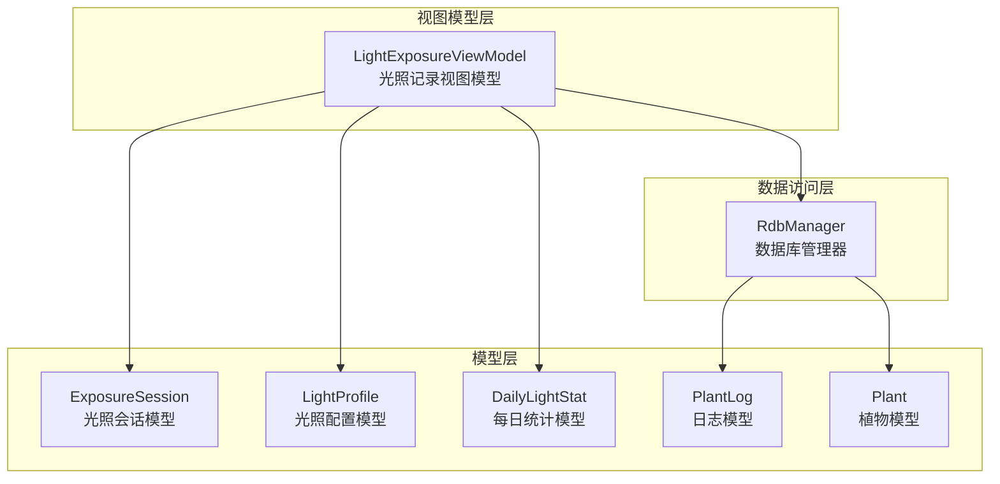
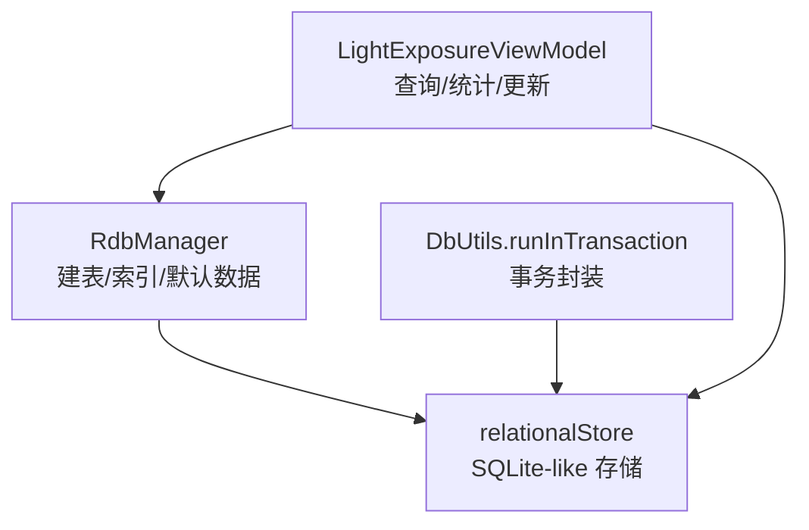
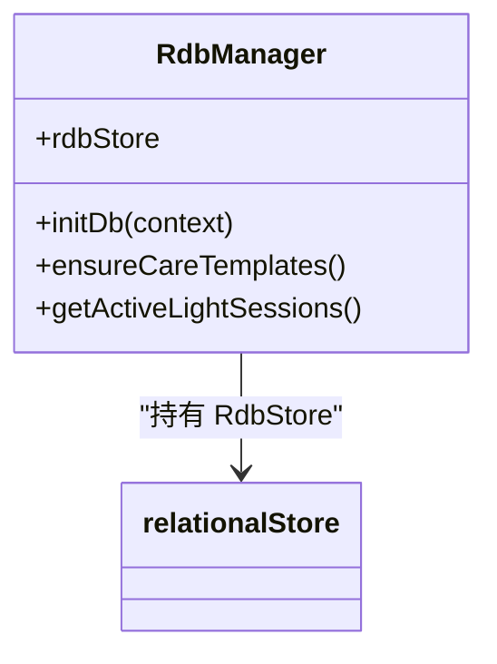
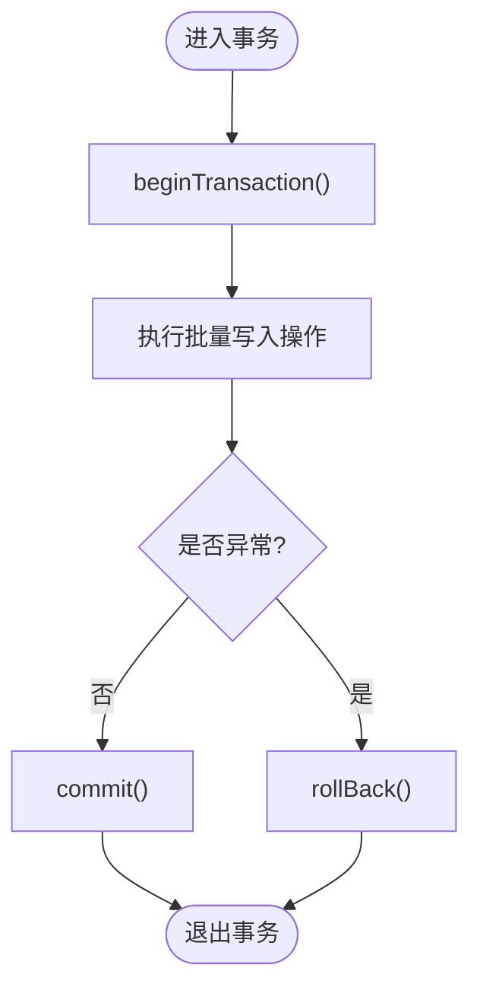
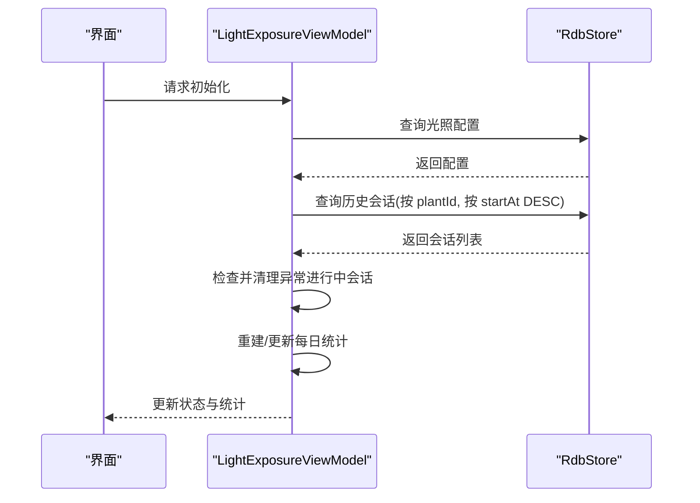
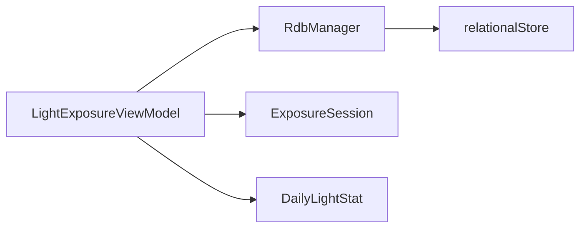

# 性能优化策略

<cite>
**本文引用的文件**
- [RdbManager.ets](file://entry/src/main/ets/viewmodel/RdbManager.ets)
- [DbUtils.ets](file://entry/src/main/ets/model/DbUtils.ets)
- [LightExposureViewModel.ets](file://entry/src/main/ets/viewmodel/LightExposureViewModel.ets)
- [ExposureSession.ets](file://entry/src/main/ets/model/ExposureSession.ets)
- [PlantLogModel.ets](file://entry/src/main/ets/model/PlantLogModel.ets)
- [PlantModel.ets](file://entry/src/main/ets/model/PlantModel.ets)
- [LightProfile.ets](file://entry/src/main/ets/model/LightProfile.ets)
- [DailyLightStat.ets](file://entry/src/main/ets/model/DailyLightStat.ets)
</cite>

## 目录
1. [简介](#简介)
2. [项目结构](#项目结构)
3. [核心组件](#核心组件)
4. [架构总览](#架构总览)
5. [详细组件分析](#详细组件分析)
6. [依赖分析](#依赖分析)
7. [性能考量](#性能考量)
8. [故障排查指南](#故障排查指南)
9. [结论](#结论)
10. [附录](#附录)

## 简介
本文件面向植物日记应用的数据库性能优化，聚焦查询优化、索引优化与缓存策略，结合高频查询场景（任务查询、日志查询、光照会话查询）给出可落地的优化方案。同时阐述数据库事务管理、并发控制与锁机制设计，提供性能监控与诊断思路，以及大数据量下的分页、批量与归档策略，并给出性能测试与基准测试建议。

## 项目结构
植物日记采用 ArkTS + relationalStore 的本地数据库方案，数据层集中在 RdbManager，业务层通过 ViewModel 聚合模型与数据库交互。整体结构清晰，便于在不改动 UI 的前提下进行数据库层面的性能优化。

**图表来源**
- [LightExposureViewModel.ets](file://entry/src/main/ets/viewmodel/LightExposureViewModel.ets)
- [RdbManager.ets](file://entry/src/main/ets/viewmodel/RdbManager.ets)
- [ExposureSession.ets](file://entry/src/main/ets/model/ExposureSession.ets)
- [LightProfile.ets](file://entry/src/main/ets/model/LightProfile.ets)
- [DailyLightStat.ets](file://entry/src/main/ets/model/DailyLightStat.ets)
- [PlantLogModel.ets](file://entry/src/main/ets/model/PlantLogModel.ets)
- [PlantModel.ets](file://entry/src/main/ets/model/PlantModel.ets)

**章节来源**
- [RdbManager.ets](file://entry/src/main/ets/viewmodel/RdbManager.ets)
- [LightExposureViewModel.ets](file://entry/src/main/ets/viewmodel/LightExposureViewModel.ets)

## 核心组件
- 数据库管理器：负责建库、建表、索引初始化与默认数据注入，统一对外暴露 RdbStore。
- 事务工具：提供统一事务封装，确保批量写入原子性。
- 视图模型：集中处理高频查询与统计计算，减少数据库往返次数。
- 模型：承载查询结果与展示数据，降低 UI 层对数据库细节的耦合。

**章节来源**
- [RdbManager.ets](file://entry/src/main/ets/viewmodel/RdbManager.ets)
- [DbUtils.ets](file://entry/src/main/ets/model/DbUtils.ets)
- [LightExposureViewModel.ets](file://entry/src/main/ets/viewmodel/LightExposureViewModel.ets)

## 架构总览
数据库层以 RdbManager 为中心，围绕任务、日志、指标、光照会话等表建立索引，视图模型在内存中维护热点数据与统计，减少频繁查询与排序成本。

**图表来源**
- [RdbManager.ets](file://entry/src/main/ets/viewmodel/RdbManager.ets)
- [DbUtils.ets](file://entry/src/main/ets/model/DbUtils.ets)
- [LightExposureViewModel.ets](file://entry/src/main/ets/viewmodel/LightExposureViewModel.ets)

## 详细组件分析

### 数据库管理器（RdbManager）
- 职责：统一初始化数据库、建表、创建索引、注入默认数据。
- 设计要点：
  - 使用唯一索引约束任务重复，支持“尝试插入、冲突即跳过”的高效批量生成。
  - 针对高频查询建立组合索引（如任务按计划日期、按植物；日志按植物+创建时间；指标按植物+创建时间）。
  - 提供一次性模板与规则注入，避免运行时重复 IO。
  - 提供活跃光照会话查询接口，用于首页快速同步“正在补光”状态。

**图表来源**
- [RdbManager.ets](file://entry/src/main/ets/viewmodel/RdbManager.ets)

**章节来源**
- [RdbManager.ets](file://entry/src/main/ets/viewmodel/RdbManager.ets)

### 事务工具（DbUtils）
- 职责：封装数据库事务，保证批量写入的原子性。
- 使用建议：对批量插入、批量更新、批量删除统一使用事务，减少提交次数与回滚风险。

**图表来源**
- [DbUtils.ets](file://entry/src/main/ets/model/DbUtils.ets)

**章节来源**
- [DbUtils.ets](file://entry/src/main/ets/model/DbUtils.ets)

### 光照记录视图模型（LightExposureViewModel）
- 职责：管理光照会话、配置、统计与 UI 刷新；负责高频查询与增量统计。
- 高频查询场景与优化：
  - 活跃会话查询：通过数据库 DISTINCT 查询活跃会话集合，用于首页状态同步。
  - 历史会话查询：按植物过滤并按开始时间倒序，满足“最新优先”的展示需求。
  - 增量统计：结束会话时仅对当日统计进行增量更新，避免全量扫描。
- 并发与锁：
  - 会话状态在内存中维护，数据库仅承担持久化，降低锁竞争。
  - 通过 UI 定时刷新 tick 驱动响应式更新，避免阻塞主线程。

**图表来源**
- [LightExposureViewModel.ets](file://entry/src/main/ets/viewmodel/LightExposureViewModel.ets)
- [RdbManager.ets](file://entry/src/main/ets/viewmodel/RdbManager.ets)

**章节来源**
- [LightExposureViewModel.ets](file://entry/src/main/ets/viewmodel/LightExposureViewModel.ets)
- [ExposureSession.ets](file://entry/src/main/ets/model/ExposureSession.ets)
- [DailyLightStat.ets](file://entry/src/main/ets/model/DailyLightStat.ets)
- [LightProfile.ets](file://entry/src/main/ets/model/LightProfile.ets)

### 日志与指标查询优化
- 日志查询：按植物维度查询并按创建时间倒序，使用组合索引避免额外排序。
- 指标查询：按植物+时间范围查询，使用组合索引支撑高效范围扫描。
- 建议：对日志与指标表的组合索引进行监控，确保查询计划走索引而非全表扫描。

**章节来源**
- [RdbManager.ets](file://entry/src/main/ets/viewmodel/RdbManager.ets)
- [PlantLogModel.ets](file://entry/src/main/ets/model/PlantLogModel.ets)
- [PlantModel.ets](file://entry/src/main/ets/model/PlantModel.ets)

## 依赖分析
- 视图模型依赖数据库管理器与模型层，形成清晰的单向依赖。
- 数据库管理器依赖 relationalStore，负责建表与索引。
- 事务工具独立于业务，提供通用的事务封装能力。

**图表来源**
- [LightExposureViewModel.ets](file://entry/src/main/ets/viewmodel/LightExposureViewModel.ets)
- [RdbManager.ets](file://entry/src/main/ets/viewmodel/RdbManager.ets)
- [ExposureSession.ets](file://entry/src/main/ets/model/ExposureSession.ets)
- [DailyLightStat.ets](file://entry/src/main/ets/model/DailyLightStat.ets)

**章节来源**
- [LightExposureViewModel.ets](file://entry/src/main/ets/viewmodel/LightExposureViewModel.ets)
- [RdbManager.ets](file://entry/src/main/ets/viewmodel/RdbManager.ets)

## 性能考量

### 查询优化
- 任务查询
  - 使用组合索引 (plantId, planDate) 支撑按植物与计划日期的过滤与排序。
  - 批量生成任务时使用唯一索引避免重复，采用“尝试插入、冲突即跳过”的策略。
- 日志查询
  - 使用组合索引 (plantId, createdAt) 支撑按植物分组与时间倒序。
- 指标查询
  - 使用组合索引 (plantId, createdAt) 支撑按植物与时间范围的高效扫描。
- 光照会话查询
  - 历史查询按 plantId 过滤并按 startAt 倒序，配合索引避免排序开销。
  - 活跃会话查询使用 DISTINCT 过滤，避免全表扫描。

**章节来源**
- [RdbManager.ets](file://entry/src/main/ets/viewmodel/RdbManager.ets)
- [LightExposureViewModel.ets](file://entry/src/main/ets/viewmodel/LightExposureViewModel.ets)

### 索引优化
- 建议定期检查查询计划，确保高频查询命中组合索引。
- 对于新增字段或新查询模式，及时补充复合索引或调整现有索引顺序。

**章节来源**
- [RdbManager.ets](file://entry/src/main/ets/viewmodel/RdbManager.ets)

### 缓存策略
- 内存缓存：视图模型在内存中维护会话列表与每日统计，结束会话时进行增量更新，显著降低数据库压力。
- 首页状态缓存：通过活跃会话查询结果映射为布尔 Map，用于快速同步植物卡片状态。
- 建议：对冷门数据（如历史统计）可引入 LRU 缓存，避免内存膨胀。

**章节来源**
- [LightExposureViewModel.ets](file://entry/src/main/ets/viewmodel/LightExposureViewModel.ets)
- [RdbManager.ets](file://entry/src/main/ets/viewmodel/RdbManager.ets)

### 事务与并发控制
- 事务：统一使用事务封装批量写入，减少提交次数与回滚成本。
- 并发：视图模型在内存中维护状态，数据库仅承担持久化，降低锁竞争。
- 锁机制：relationalStore 为本地存储，默认写锁保护事务一致性；建议避免长时间持有事务，缩短事务窗口。

**章节来源**
- [DbUtils.ets](file://entry/src/main/ets/model/DbUtils.ets)
- [LightExposureViewModel.ets](file://entry/src/main/ets/viewmodel/LightExposureViewModel.ets)

### 大数据量优化
- 分页查询：对日志与指标等可能海量增长的表，建议引入分页查询（基于游标或偏移分页），避免一次性加载过多数据。
- 批量操作：使用事务封装批量插入/更新/删除，减少磁盘写放大。
- 数据归档：对历史数据（如超过一定时间的日志与指标）进行归档或压缩，降低热数据表大小。

**章节来源**
- [RdbManager.ets](file://entry/src/main/ets/viewmodel/RdbManager.ets)
- [DbUtils.ets](file://entry/src/main/ets/model/DbUtils.ets)

### 性能监控与诊断
- 慢查询分析：通过查询计划与耗时统计定位未命中索引或全表扫描的查询，针对性补充索引。
- 资源使用监控：关注事务持续时间、内存占用与 UI 刷新频率，避免过度频繁的数据库访问。
- 建议工具：利用平台提供的数据库性能分析工具（如查询耗时、索引使用率）进行持续监控。

**章节来源**
- [RdbManager.ets](file://entry/src/main/ets/viewmodel/RdbManager.ets)
- [LightExposureViewModel.ets](file://entry/src/main/ets/viewmodel/LightExposureViewModel.ets)

### 性能测试与基准测试
- 测试方法：构造不同规模的数据集（小/中/大），测量关键查询（任务、日志、指标、光照会话）的响应时间与吞吐量。
- 基准指标：平均响应时间、P95/P99 延迟、事务吞吐、内存峰值。
- 建议场景：批量插入/更新、高频查询、活跃会话统计、历史数据回溯。

**章节来源**
- [RdbManager.ets](file://entry/src/main/ets/viewmodel/RdbManager.ets)
- [DbUtils.ets](file://entry/src/main/ets/model/DbUtils.ets)
- [LightExposureViewModel.ets](file://entry/src/main/ets/viewmodel/LightExposureViewModel.ets)

## 故障排查指南
- 查询变慢
  - 检查是否命中组合索引，必要时调整索引或查询条件。
  - 关注是否存在全表扫描或临时表排序。
- 事务失败
  - 确认事务包裹范围合理，避免长时间持有锁。
  - 捕获异常后确保回滚路径正确执行。
- 首页状态异常
  - 检查活跃会话查询结果映射是否正确，确认 endAt=0 的会话清理逻辑生效。

**章节来源**
- [RdbManager.ets](file://entry/src/main/ets/viewmodel/RdbManager.ets)
- [DbUtils.ets](file://entry/src/main/ets/model/DbUtils.ets)
- [LightExposureViewModel.ets](file://entry/src/main/ets/viewmodel/LightExposureViewModel.ets)

## 结论
通过合理的索引设计、事务封装、内存缓存与增量统计，植物日记应用可在不牺牲用户体验的前提下显著提升数据库性能。建议持续监控查询计划与资源使用，结合基准测试迭代优化，确保在大数据量场景下仍能保持稳定响应。

## 附录
- 术语
  - 组合索引：在多个列上建立的索引，用于支撑多列过滤与排序。
  - 增量统计：仅对受影响的时间段或记录进行重新计算，避免全量扫描。
- 参考文件
  - [RdbManager.ets](file://entry/src/main/ets/viewmodel/RdbManager.ets)
  - [DbUtils.ets](file://entry/src/main/ets/model/DbUtils.ets)
  - [LightExposureViewModel.ets](file://entry/src/main/ets/viewmodel/LightExposureViewModel.ets)
  - [ExposureSession.ets](file://entry/src/main/ets/model/ExposureSession.ets)
  - [PlantLogModel.ets](file://entry/src/main/ets/model/PlantLogModel.ets)
  - [PlantModel.ets](file://entry/src/main/ets/model/PlantModel.ets)
  - [LightProfile.ets](file://entry/src/main/ets/model/LightProfile.ets)
  - [DailyLightStat.ets](file://entry/src/main/ets/model/DailyLightStat.ets)