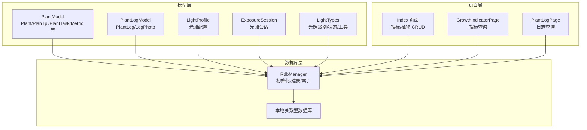
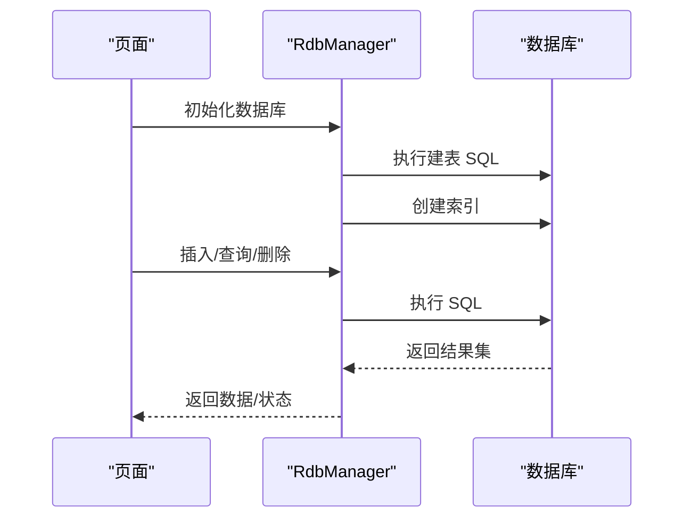
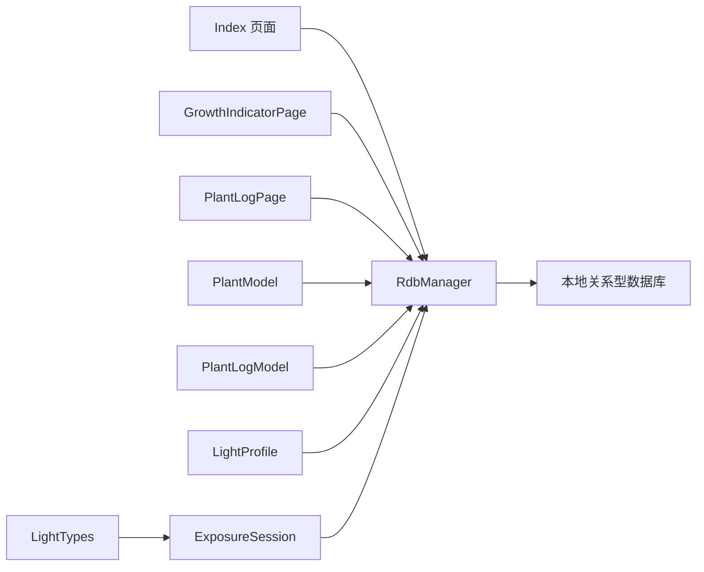

# 数据库表结构

<cite>
**本文档引用的文件**
- [RdbManager.ets](file://entry/src/main/ets/viewmodel/RdbManager.ets)
- [DbUtils.ets](file://entry/src/main/ets/model/DbUtils.ets)
- [PlantModel.ets](file://entry/src/main/ets/model/PlantModel.ets)
- [PlantLogModel.ets](file://entry/src/main/ets/model/PlantLogModel.ets)
- [LightProfile.ets](file://entry/src/main/ets/model/LightProfile.ets)
- [ExposureSession.ets](file://entry/src/main/ets/model/ExposureSession.ets)
- [LightTypes.ets](file://entry/src/main/ets/model/LightTypes.ets)
- [Index.ets](file://entry/src/main/ets/pages/Index.ets)
- [GrowthIndicatorPage.ets](file://entry/src/main/ets/pages/GrowthIndicatorPage.ets)
- [PlantLogPage.ets](file://entry/src/main/ets/pages/PlantLogPage.ets)
</cite>

## 目录
1. [简介](#简介)
2. [项目结构](#项目结构)
3. [核心组件](#核心组件)
4. [架构总览](#架构总览)
5. [详细组件分析](#详细组件分析)
6. [依赖分析](#依赖分析)
7. [性能考虑](#性能考虑)
8. [故障排查指南](#故障排查指南)
9. [结论](#结论)
10. [附录](#附录)

## 简介
本文件系统性梳理植物日记项目中使用的本地关系型数据库表结构，覆盖 plant、task、tpl、log、metric、log_photo、care_template、care_rule、light_profile、exposure_session 等表。文档从表结构设计原则出发，结合实际代码中的建表语句、索引策略、数据模型与典型查询/操作模式，帮助开发者与产品人员理解各表的业务用途、字段含义、约束与关系，并提供可复用的建表与查询范式。

## 项目结构
数据库初始化与表结构定义集中在数据库管理器中，配套的模型文件定义了与数据库字段一致的数据结构，页面通过统一的数据库管理器执行建表、索引与数据操作。

**图表来源**
- [RdbManager.ets:27-170](file://entry/src/main/ets/viewmodel/RdbManager.ets#L27-L170)
- [PlantModel.ets:7-166](file://entry/src/main/ets/model/PlantModel.ets#L7-L166)
- [PlantLogModel.ets:8-57](file://entry/src/main/ets/model/PlantLogModel.ets#L8-L57)
- [LightProfile.ets:11-40](file://entry/src/main/ets/model/LightProfile.ets#L11-L40)
- [ExposureSession.ets:14-83](file://entry/src/main/ets/model/ExposureSession.ets#L14-L83)
- [LightTypes.ets:9-123](file://entry/src/main/ets/model/LightTypes.ets#L9-L123)
- [Index.ets:245-284](file://entry/src/main/ets/pages/Index.ets#L245-L284)
- [GrowthIndicatorPage.ets:400-445](file://entry/src/main/ets/pages/GrowthIndicatorPage.ets#L400-L445)
- [PlantLogPage.ets:1006-1013](file://entry/src/main/ets/pages/PlantLogPage.ets#L1006-L1013)

**章节来源**
- [RdbManager.ets:27-170](file://entry/src/main/ets/viewmodel/RdbManager.ets#L27-L170)

## 核心组件
- 数据库管理器：集中负责数据库初始化、建表、索引创建与默认数据注入。
- 数据模型：与数据库字段一一对应，承载页面与数据库交互的数据结构。
- 页面使用：通过统一的数据库管理器执行建表、索引与数据操作，保证一致性与可维护性。

**章节来源**
- [RdbManager.ets:27-170](file://entry/src/main/ets/viewmodel/RdbManager.ets#L27-L170)
- [DbUtils.ets:12-21](file://entry/src/main/ets/model/DbUtils.ets#L12-L21)

## 架构总览
数据库层通过 RdbManager 统一管理建表与索引；模型层提供与表字段一致的数据结构；页面层通过 RdbManager 执行 CRUD 与查询，典型场景包括指标新增、日志查询、光照会话管理等。

**图表来源**
- [RdbManager.ets:27-170](file://entry/src/main/ets/viewmodel/RdbManager.ets#L27-L170)
- [Index.ets:245-284](file://entry/src/main/ets/pages/Index.ets#L245-L284)
- [GrowthIndicatorPage.ets:400-445](file://entry/src/main/ets/pages/GrowthIndicatorPage.ets#L400-L445)
- [PlantLogPage.ets:1006-1013](file://entry/src/main/ets/pages/PlantLogPage.ets#L1006-L1013)

## 详细组件分析

### plant 表（植物）
- 业务用途：存储植物基本信息，如名称、种类、摆放位置与创建时间。
- 主键：自增整型 id。
- 字段与约束：
  - id：整型，主键，自增。
  - name：文本，非空。
  - species：文本，可空。
  - location：文本，可空。
  - createdAt：整型，时间戳。
- 典型操作：
  - 新增植物：向字段 name、species、location、createdAt 写入。
  - 查询植物列表：按 createdAt 或其他维度排序。
- 设计要点：字段简洁，满足基础识别与展示需求；无外键，降低耦合。

**章节来源**
- [RdbManager.ets:36-43](file://entry/src/main/ets/viewmodel/RdbManager.ets#L36-L43)
- [PlantModel.ets:7-21](file://entry/src/main/ets/model/PlantModel.ets#L7-L21)

### task 表（任务）
- 业务用途：记录植物的周期性或计划性养护任务，支持按植物、类型、计划日期去重。
- 主键：自增整型 id。
- 字段与约束：
  - id：整型，主键，自增。
  - plantId：整型，非空，关联 plant.id。
  - type：文本，非空，任务类型（如浇水、施肥、修剪）。
  - planDate：文本，非空，YYYY-MM-DD 字符串。
  - done：整型，默认 0，0/1 表示未完成/已完成。
  - doneAt：整型，默认 0，完成时间戳。
- 约束与索引：
  - 唯一索引：(plantId, type, planDate)，避免同植物同类型同日期重复任务。
  - 普通索引：planDate、plantId，支撑常用查询与排序。
- 典型操作：
  - 批量生成任务：按模板规则生成未来若干天的任务，利用唯一索引“尝试插入，冲突即跳过”。
  - 查询某日任务：按 planDate 查询。
  - 查询某植物任务：按 plantId 查询。
- 设计要点：以字符串存储日期，简化前端处理；唯一索引保障幂等生成。

**章节来源**
- [RdbManager.ets:44-52](file://entry/src/main/ets/viewmodel/RdbManager.ets#L44-L52)
- [RdbManager.ets:133-146](file://entry/src/main/ets/viewmodel/RdbManager.ets#L133-L146)
- [PlantModel.ets:43-59](file://entry/src/main/ets/model/PlantModel.ets#L43-L59)

### tpl 表（周期模板）
- 业务用途：定义周期性任务的模板参数，如周期天数、重复次数等。
- 主键：自增整型 id。
- 字段与约束：
  - id：整型，主键，自增。
  - name：文本，非空。
  - type：文本，非空。
  - everyDays：整型，非空。
  - times：整型，非空。
  - createdAt：整型，可空。
- 典型操作：
  - 与 care_template/care_rule 配合，生成具体任务。
- 设计要点：与 care_template/care_rule 协作，形成“模板 + 规则”的任务生成体系。

**章节来源**
- [RdbManager.ets:53-61](file://entry/src/main/ets/viewmodel/RdbManager.ets#L53-L61)
- [PlantModel.ets:24-40](file://entry/src/main/ets/model/PlantModel.ets#L24-L40)

### log 表（日志）
- 业务用途：记录植物的观察笔记与养护记录。
- 主键：自增整型 id。
- 字段与约束：
  - id：整型，主键，自增。
  - plantId：整型，非空，关联 plant.id。
  - note：文本，非空。
  - createdAt：整型，非空。
- 索引：
  - 组合索引：(plantId, createdAt)，支撑按植物分组、按时间倒序展示。
- 典型操作：
  - 新增日志：写入 plantId、note、createdAt。
  - 查询某植物日志：按 plantId 查询并按 createdAt 倒序。
- 设计要点：note 为文本，便于自由记录；组合索引兼顾查询效率。

**章节来源**
- [RdbManager.ets:62-69](file://entry/src/main/ets/viewmodel/RdbManager.ets#L62-L69)
- [RdbManager.ets:152-155](file://entry/src/main/ets/viewmodel/RdbManager.ets#L152-L155)
- [PlantLogModel.ets:8-28](file://entry/src/main/ets/model/PlantLogModel.ets#L8-L28)

### metric 表（成长指标）
- 业务用途：记录植物身高、冠宽、健康评分等成长指标。
- 主键：自增整型 id。
- 字段与约束：
  - id：整型，主键，自增。
  - plantId：整型，非空，关联 plant.id。
  - height：实数，默认 0。
  - width：实数，默认 0。
  - score：整数，默认 0，范围通常 0~100。
  - createdAt：整型，非空。
- 索引：
  - 组合索引：(plantId, createdAt)，支撑按植物与时间范围查询。
- 典型操作：
  - 新增指标：height、width、score、createdAt。
  - 查询指标序列：按 plantId 查询并按 createdAt 升序，便于图表展示。
- 设计要点：字段直观，便于可视化；索引支持常见分析场景。

**章节来源**
- [RdbManager.ets:70-78](file://entry/src/main/ets/viewmodel/RdbManager.ets#L70-L78)
- [RdbManager.ets:163-169](file://entry/src/main/ets/viewmodel/RdbManager.ets#L163-L169)
- [PlantModel.ets:109-125](file://entry/src/main/ets/model/PlantModel.ets#L109-L125)
- [GrowthIndicatorPage.ets:400-445](file://entry/src/main/ets/pages/GrowthIndicatorPage.ets#L400-L445)

### log_photo 表（日志照片）
- 业务用途：记录与日志关联的照片，支持原图与缩略图路径。
- 主键：自增整型 id。
- 字段与约束：
  - id：整型，主键，自增。
  - logId：整型，非空，关联 log.id。
  - path：文本，非空，原图路径。
  - thumbPath：文本，非空，缩略图路径。
  - createdAt：整型，非空。
- 索引：
  - 普通索引：logId，支撑按日志查询照片。
- 典型操作：
  - 新增照片：写入 logId、path、thumbPath、createdAt。
  - 查询某日志照片：按 logId 查询。
- 设计要点：与 log 一对多；独立索引提升查询效率。

**章节来源**
- [RdbManager.ets:79-87](file://entry/src/main/ets/viewmodel/RdbManager.ets#L79-L87)
- [RdbManager.ets:157-161](file://entry/src/main/ets/viewmodel/RdbManager.ets#L157-L161)
- [PlantLogModel.ets:34-57](file://entry/src/main/ets/model/PlantLogModel.ets#L34-L57)

### care_template 表（养护模板）
- 业务用途：定义植物养护模板，如“多肉”、“龟背竹”等。
- 主键：自增整型 id。
- 字段与约束：
  - id：整型，主键，自增。
  - name：文本，非空。
  - desc：文本，可空。
- 典型操作：
  - 初始化默认模板：仅在空库时插入。
  - 与 care_rule 配合生成任务。
- 设计要点：模板驱动任务生成，便于扩展新植物类型。

**章节来源**
- [RdbManager.ets:88-94](file://entry/src/main/ets/viewmodel/RdbManager.ets#L88-L94)
- [RdbManager.ets:173-276](file://entry/src/main/ets/viewmodel/RdbManager.ets#L173-L276)
- [PlantModel.ets:150-154](file://entry/src/main/ets/model/PlantModel.ets#L150-L154)

### care_rule 表（养护规则）
- 业务用途：描述模板下的具体任务类型、生成间隔与覆盖范围。
- 主键：自增整型 id。
- 字段与约束：
  - id：整型，主键，自增。
  - templateId：整型，非空，关联 care_template.id。
  - type：文本，非空，任务类型。
  - intervalDays：整型，非空，生成间隔（天）。
  - horizonDays：整型，非空，生成覆盖范围（天）。
- 典型操作：
  - 生成任务：基于模板规则，按 intervalDays 在 horizonDays 范围内生成任务。
- 设计要点：规则驱动任务生成，灵活可扩展。

**章节来源**
- [RdbManager.ets:95-103](file://entry/src/main/ets/viewmodel/RdbManager.ets#L95-L103)
- [RdbManager.ets:173-276](file://entry/src/main/ets/viewmodel/RdbManager.ets#L173-L276)
- [PlantModel.ets:156-163](file://entry/src/main/ets/model/PlantModel.ets#L156-L163)

### light_profile 表（光照配置）
- 业务用途：记录每株植物的光照目标与偏好，如达标区间、偏好级别等。
- 主键：plantId（一对一配置）。
- 字段与约束：
  - plantId：整型，主键，关联 plant.id。
  - targetLuxMinLow：整型，非空，达标下限（lux-min）。
  - targetLuxMinHigh：整型，非空，达标上限（满分参考值）。
  - preferredLevel：整型，非空，偏好光照级别（LOW/MID/HIGH）。
  - updatedAt：整型，可空，更新时间戳。
- 典型操作：
  - 查询某植物光照配置：按 plantId 查询。
  - 更新配置：按 plantId 更新目标区间与偏好级别。
- 设计要点：一对一配置，简化查询；字段与光照模块模型一致。

**章节来源**
- [RdbManager.ets:108-116](file://entry/src/main/ets/viewmodel/RdbManager.ets#L108-L116)
- [LightProfile.ets:11-40](file://entry/src/main/ets/model/LightProfile.ets#L11-L40)

### exposure_session 表（光照会话）
- 业务用途：记录一次完整的光照过程，支持开始/结束与即时补记两种模式。
- 主键：id（字符串，带前缀与时间戳）。
- 字段与约束：
  - id：文本，主键。
  - plantId：整型，非空，关联 plant.id。
  - startAt：整型，非空，开始时间戳（毫秒）。
  - endAt：整型，默认 0，结束时间戳（毫秒），0 表示进行中。
  - durationMin：整型，默认 0，持续时间（分钟）。
  - level：整型，非空，光照级别（LOW/MID/HIGH）。
  - luxMinutes：整型，默认 0，等效光照量（lux-min）。
  - note：文本，可空。
- 典型操作：
  - 开始会话：生成 id，设置 startAt 与 level。
  - 结束会话：设置 endAt，计算 durationMin 与 luxMinutes。
  - 即时补记：根据结束时间与时长反推 startAt。
  - 查询进行中会话：endAt=0 的记录集合。
- 设计要点：id 采用带前缀的字符串，便于识别与排序；endAt=0 标识进行中，利于首页状态同步。

**章节来源**
- [RdbManager.ets:118-129](file://entry/src/main/ets/viewmodel/RdbManager.ets#L118-L129)
- [ExposureSession.ets:14-83](file://entry/src/main/ets/model/ExposureSession.ets#L14-L83)
- [LightTypes.ets:9-13](file://entry/src/main/ets/model/LightTypes.ets#L9-L13)

### 表关系与外键约束
- 外键关系（逻辑层面）：
  - task.plantId → plant.id
  - log.plantId → plant.id
  - metric.plantId → plant.id
  - log_photo.logId → log.id
  - care_rule.templateId → care_template.id
  - light_profile.plantId → plant.id
  - exposure_session.plantId → plant.id
- 引用完整性：
  - 项目中未显式声明外键约束，通过应用层约束与索引保障数据一致性与查询效率。
  - 唯一索引保证任务生成的幂等性（task 上的 (plantId, type, planDate)）。

**章节来源**
- [RdbManager.ets:133-146](file://entry/src/main/ets/viewmodel/RdbManager.ets#L133-L146)
- [RdbManager.ets:152-169](file://entry/src/main/ets/viewmodel/RdbManager.ets#L152-L169)

## 依赖分析
- 组件耦合：
  - 页面依赖 RdbManager 进行建表、索引与数据操作。
  - 模型文件与数据库字段一一对应，减少映射成本。
- 外部依赖：
  - 使用本地关系型数据库能力，提供事务封装与索引策略。
- 循环依赖：
  - 无循环依赖，职责清晰：RdbManager 负责数据库层，页面与模型负责业务层。

**图表来源**
- [RdbManager.ets:27-170](file://entry/src/main/ets/viewmodel/RdbManager.ets#L27-L170)
- [Index.ets:245-284](file://entry/src/main/ets/pages/Index.ets#L245-L284)
- [GrowthIndicatorPage.ets:400-445](file://entry/src/main/ets/pages/GrowthIndicatorPage.ets#L400-L445)
- [PlantLogPage.ets:1006-1013](file://entry/src/main/ets/pages/PlantLogPage.ets#L1006-L1013)
- [PlantModel.ets:7-166](file://entry/src/main/ets/model/PlantModel.ets#L7-L166)
- [PlantLogModel.ets:8-57](file://entry/src/main/ets/model/PlantLogModel.ets#L8-L57)
- [LightProfile.ets:11-40](file://entry/src/main/ets/model/LightProfile.ets#L11-L40)
- [ExposureSession.ets:14-83](file://entry/src/main/ets/model/ExposureSession.ets#L14-L83)
- [LightTypes.ets:9-13](file://entry/src/main/ets/model/LightTypes.ets#L9-L13)

## 性能考虑
- 索引策略：
  - task：唯一索引 (plantId, type, planDate) 保障任务生成幂等；普通索引 (planDate)、(plantId) 支撑常用查询。
  - log：组合索引 (plantId, createdAt) 支撑按植物分组与时间倒序展示。
  - log_photo：索引 (logId) 支撑按日志查询照片。
  - metric：组合索引 (plantId, createdAt) 支撑指标序列查询。
- 事务封装：
  - 使用统一事务封装，确保批量写入的一致性与原子性。
- 数据类型选择：
  - 时间戳统一使用整型，便于排序与范围查询。
  - 指标字段使用数值类型，便于统计与图表展示。
- 扩展性：
  - 表结构简洁，易于新增字段；模板+规则体系支持新植物类型的快速接入。

**章节来源**
- [RdbManager.ets:133-169](file://entry/src/main/ets/viewmodel/RdbManager.ets#L133-L169)
- [DbUtils.ets:12-21](file://entry/src/main/ets/model/DbUtils.ets#L12-L21)

## 故障排查指南
- 任务重复生成：
  - 现象：同植物同类型同日期出现重复任务。
  - 排查：确认唯一索引是否存在；检查生成流程是否正确处理冲突。
- 日志查询异常：
  - 现象：按植物查询日志顺序错误或性能差。
  - 排查：确认组合索引 (plantId, createdAt) 是否存在；查询语句是否按 createdAt 倒序。
- 指标图表异常：
  - 现象：指标序列顺序错误或缺失。
  - 排查：确认查询按 createdAt 升序；检查 createdAt 字段写入是否正确。
- 光照会话状态不同步：
  - 现象：首页未显示“进行中”状态。
  - 排查：确认查询进行中会话的条件 endAt=0；检查会话结束逻辑。

**章节来源**
- [RdbManager.ets:133-169](file://entry/src/main/ets/viewmodel/RdbManager.ets#L133-L169)
- [GrowthIndicatorPage.ets:400-445](file://entry/src/main/ets/pages/GrowthIndicatorPage.ets#L400-L445)
- [Index.ets:278-294](file://entry/src/main/ets/pages/Index.ets#L278-L294)

## 结论
本数据库表结构围绕“植物 + 任务 + 日志 + 指标 + 养护模板 + 光照”六大主题构建，通过简洁的字段设计、合理的索引策略与统一的事务封装，实现了高效、可扩展且易维护的数据层。建议在后续迭代中：
- 明确外键约束，增强引用完整性。
- 对高频查询补充复合索引，持续优化查询性能。
- 保持模型与表结构一致，减少映射成本。

## 附录

### 完整建表与索引语句（路径引用）
- plant 表
  - [RdbManager.ets:36-43](file://entry/src/main/ets/viewmodel/RdbManager.ets#L36-L43)
- task 表
  - [RdbManager.ets:44-52](file://entry/src/main/ets/viewmodel/RdbManager.ets#L44-L52)
  - 唯一索引：[RdbManager.ets:133-137](file://entry/src/main/ets/viewmodel/RdbManager.ets#L133-L137)
  - 普通索引：[RdbManager.ets:138-146](file://entry/src/main/ets/viewmodel/RdbManager.ets#L138-L146)
- tpl 表
  - [RdbManager.ets:53-61](file://entry/src/main/ets/viewmodel/RdbManager.ets#L53-L61)
- log 表
  - [RdbManager.ets:62-69](file://entry/src/main/ets/viewmodel/RdbManager.ets#L62-L69)
  - 组合索引：[RdbManager.ets:152-155](file://entry/src/main/ets/viewmodel/RdbManager.ets#L152-L155)
- metric 表
  - [RdbManager.ets:70-78](file://entry/src/main/ets/viewmodel/RdbManager.ets#L70-L78)
  - 组合索引：[RdbManager.ets:163-169](file://entry/src/main/ets/viewmodel/RdbManager.ets#L163-L169)
- log_photo 表
  - [RdbManager.ets:79-87](file://entry/src/main/ets/viewmodel/RdbManager.ets#L79-L87)
  - 索引：[RdbManager.ets:157-161](file://entry/src/main/ets/viewmodel/RdbManager.ets#L157-L161)
- care_template 表
  - [RdbManager.ets:88-94](file://entry/src/main/ets/viewmodel/RdbManager.ets#L88-L94)
- care_rule 表
  - [RdbManager.ets:95-103](file://entry/src/main/ets/viewmodel/RdbManager.ets#L95-L103)
- light_profile 表
  - [RdbManager.ets:108-116](file://entry/src/main/ets/viewmodel/RdbManager.ets#L108-L116)
- exposure_session 表
  - [RdbManager.ets:118-129](file://entry/src/main/ets/viewmodel/RdbManager.ets#L118-L129)

### 典型数据操作与查询模式（路径引用）
- 新增指标（按植物新增身高、冠宽、评分）
  - [Index.ets:245-260](file://entry/src/main/ets/pages/Index.ets#L245-L260)
  - [GrowthIndicatorPage.ets:422-445](file://entry/src/main/ets/pages/GrowthIndicatorPage.ets#L422-L445)
- 查询指标序列（按植物、升序）
  - [GrowthIndicatorPage.ets:400-420](file://entry/src/main/ets/pages/GrowthIndicatorPage.ets#L400-L420)
- 删除指标
  - [Index.ets:274-284](file://entry/src/main/ets/pages/Index.ets#L274-L284)
- 新增日志（按植物）
  - [PlantLogPage.ets:1006-1013](file://entry/src/main/ets/pages/PlantLogPage.ets#L1006-L1013)
- 查询进行中光照会话（首页状态同步）
  - [RdbManager.ets:277-294](file://entry/src/main/ets/viewmodel/RdbManager.ets#L277-L294)