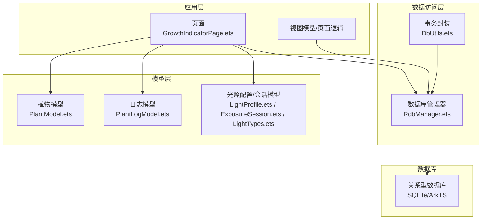
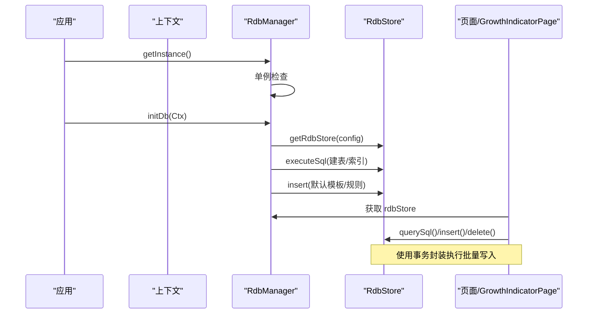
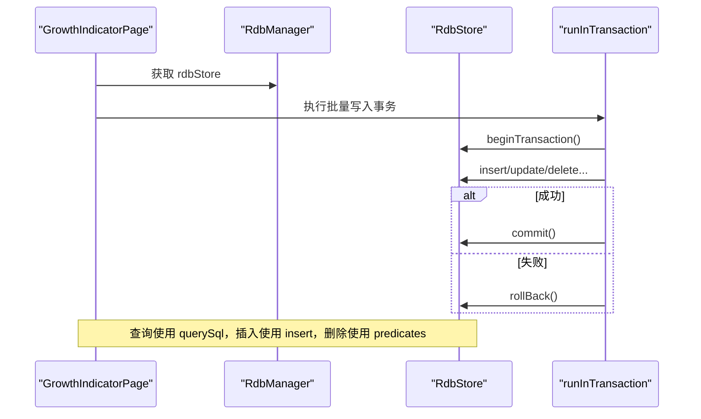
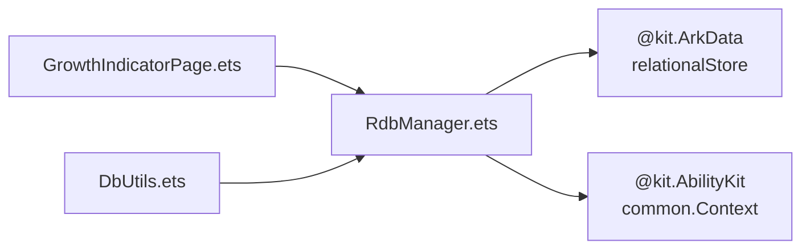
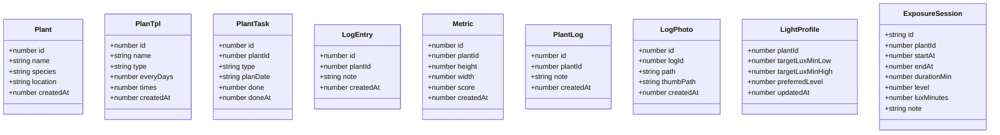

# 数据库设计

<cite>
**本文引用的文件**
- [RdbManager.ets](file://entry/src/main/ets/viewmodel/RdbManager.ets)
- [DbUtils.ets](file://entry/src/main/ets/model/DbUtils.ets)
- [PlantModel.ets](file://entry/src/main/ets/model/PlantModel.ets)
- [PlantLogModel.ets](file://entry/src/main/ets/model/PlantLogModel.ets)
- [LightProfile.ets](file://entry/src/main/ets/model/LightProfile.ets)
- [ExposureSession.ets](file://entry/src/main/ets/model/ExposureSession.ets)
- [LightTypes.ets](file://entry/src/main/ets/model/LightTypes.ets)
- [GrowthIndicatorPage.ets](file://entry/src/main/ets/pages/GrowthIndicatorPage.ets)
</cite>

## 目录
1. [简介](#简介)
2. [项目结构](#项目结构)
3. [核心组件](#核心组件)
4. [架构总览](#架构总览)
5. [详细组件分析](#详细组件分析)
6. [依赖分析](#依赖分析)
7. [性能考虑](#性能考虑)
8. [故障排查指南](#故障排查指南)
9. [结论](#结论)
10. [附录](#附录)

## 简介
本文件面向植物日记项目，系统化梳理数据库设计与实现，涵盖表结构、字段定义、主外键与索引设计、数据模型映射、事务封装、查询示例、性能优化、并发与错误处理策略，以及迁移与备份恢复建议。数据库采用关系型存储，通过统一的数据库管理器集中初始化建表、索引与默认数据种子，并提供事务封装以保障批量写入的一致性。

## 项目结构
数据库相关代码主要分布在以下位置：
- 数据库管理与初始化：RdbManager.ets
- 事务封装：DbUtils.ets
- 数据模型（与表字段一一对应）：PlantModel.ets、PlantLogModel.ets、LightProfile.ets、ExposureSession.ets、LightTypes.ets
- 页面使用示例：GrowthIndicatorPage.ets（展示查询与插入）

**图表来源**
- [RdbManager.ets:27-170](file://entry/src/main/ets/viewmodel/RdbManager.ets#L27-L170)
- [DbUtils.ets:12-21](file://entry/src/main/ets/model/DbUtils.ets#L12-L21)
- [GrowthIndicatorPage.ets:56-420](file://entry/src/main/ets/pages/GrowthIndicatorPage.ets#L56-L420)

**章节来源**
- [RdbManager.ets:27-170](file://entry/src/main/ets/viewmodel/RdbManager.ets#L27-L170)
- [GrowthIndicatorPage.ets:56-420](file://entry/src/main/ets/pages/GrowthIndicatorPage.ets#L56-L420)

## 核心组件
- 数据库管理器（RdbManager）
  - 单例模式，负责数据库初始化、建表、索引与默认数据种子。
  - 暴露统一的 RdbStore 实例供页面/视图模型使用。
- 事务封装（DbUtils.runInTransaction）
  - 包装 beginTransaction/commit/rollBack，确保批量写入原子性。
- 数据模型（PlantModel、PlantLogModel、LightProfile、ExposureSession、LightTypes）
  - 页面与数据库之间的轻量数据结构，字段与表结构一一对应。

**章节来源**
- [RdbManager.ets:4-24](file://entry/src/main/ets/viewmodel/RdbManager.ets#L4-L24)
- [DbUtils.ets:12-21](file://entry/src/main/ets/model/DbUtils.ets#L12-L21)
- [PlantModel.ets:7-21](file://entry/src/main/ets/model/PlantModel.ets#L7-L21)
- [PlantLogModel.ets:8-28](file://entry/src/main/ets/model/PlantLogModel.ets#L8-L28)
- [LightProfile.ets:11-40](file://entry/src/main/ets/model/LightProfile.ets#L11-L40)
- [ExposureSession.ets:14-83](file://entry/src/main/ets/model/ExposureSession.ets#L14-L83)
- [LightTypes.ets:9-124](file://entry/src/main/ets/model/LightTypes.ets#L9-L124)

## 架构总览
数据库初始化流程与事务使用流程如下：

**图表来源**
- [RdbManager.ets:27-170](file://entry/src/main/ets/viewmodel/RdbManager.ets#L27-L170)
- [GrowthIndicatorPage.ets:56-420](file://entry/src/main/ets/pages/GrowthIndicatorPage.ets#L56-L420)
- [DbUtils.ets:12-21](file://entry/src/main/ets/model/DbUtils.ets#L12-L21)

## 详细组件分析

### 数据库表结构与字段定义
- 植物表（plant）
  - 主键：id（自增）
  - 字段：name、species、location、createdAt
- 任务表（task）
  - 主键：id（自增）
  - 字段：plantId、type、planDate、done、doneAt
  - 索引：唯一索引（plantId,type,planDate），普通索引（planDate）、（plantId）
- 周期模板表（tpl）
  - 主键：id（自增）
  - 字段：name、type、everyDays、times、createdAt
- 日志表（log）
  - 主键：id（自增）
  - 字段：plantId、note、createdAt
  - 索引：（plantId,createdAt)
- 指标表（metric）
  - 主键：id（自增）
  - 字段：plantId、height、width、score、createdAt
  - 索引：（plantId,createdAt)
- 日志图片表（log_photo）
  - 主键：id（自增）
  - 字段：logId、path、thumbPath、createdAt
  - 索引：（logId)
- 养护模板表（care_template）
  - 主键：id（自增）
  - 字段：name、desc
- 养护规则表（care_rule）
  - 主键：id（自增）
  - 字段：templateId、type、intervalDays、horizonDays
- 光照配置表（light_profile）
  - 主键：plantId（一对一）
  - 字段：targetLuxMinLow、targetLuxMinHigh、preferredLevel、updatedAt
- 光照会话表（exposure_session）
  - 主键：id（UUID 文本）
  - 字段：plantId、startAt、endAt、durationMin、level、luxMinutes、note
  - 索引：（plantId, startAt/endAt）可结合查询需求评估

**章节来源**
- [RdbManager.ets:36-129](file://entry/src/main/ets/viewmodel/RdbManager.ets#L36-L129)
- [RdbManager.ets:134-169](file://entry/src/main/ets/viewmodel/RdbManager.ets#L134-L169)

### 数据模型与数据库表的对应关系
- Plant → plant
- PlanTpl → tpl
- PlantTask → task
- LogEntry → log
- Metric/PlantMetric → metric
- PlantLog → log
- LogPhoto → log_photo
- CareTemplate → care_template
- CareRule → care_rule
- LightProfile → light_profile
- ExposureSession → exposure_session

上述映射基于字段名与语义一致性，页面与数据库交互通过统一的模型对象完成。

**章节来源**
- [PlantModel.ets:7-166](file://entry/src/main/ets/model/PlantModel.ets#L7-L166)
- [PlantLogModel.ets:8-58](file://entry/src/main/ets/model/PlantLogModel.ets#L8-L58)
- [LightProfile.ets:11-40](file://entry/src/main/ets/model/LightProfile.ets#L11-L40)
- [ExposureSession.ets:14-83](file://entry/src/main/ets/model/ExposureSession.ets#L14-L83)
- [RdbManager.ets:8-17](file://entry/src/main/ets/viewmodel/RdbManager.ets#L8-L17)

### 主键、外键与索引设计
- 主键
  - 植物、任务、周期模板、日志、指标、日志图片、模板、规则、光照会话等表均采用自增主键或显式主键（如 light_profile 的 plantId、exposure_session 的 id）。
- 外键
  - 代码中未显式声明外键约束，但通过业务逻辑保证 referential integrity（如 task.plantId 指向 plant.id）。如需更强约束，可在迁移时添加外键并设置级联策略。
- 索引
  - 唯一索引：task 上的 (plantId,type,planDate)
  - 普通索引：task(planDate)、task(plantId)、log(plantId,createdAt)、metric(plantId,createdAt)、log_photo(logId)

**章节来源**
- [RdbManager.ets:134-169](file://entry/src/main/ets/viewmodel/RdbManager.ets#L134-L169)

### 数据库操作封装与事务管理
- 初始化与建表
  - RdbManager.initDb 负责创建所有表与索引，并在空库时插入默认养护模板与规则。
- 事务封装
  - DbUtils.runInTransaction 提供统一的 begin/commit/rollback 包装，确保批量写入原子性。
- 页面使用
  - GrowthIndicatorPage 直接获取全局 RdbStore，执行查询与插入，典型流程见下图。

**图表来源**
- [GrowthIndicatorPage.ets:400-455](file://entry/src/main/ets/pages/GrowthIndicatorPage.ets#L400-L455)
- [DbUtils.ets:12-21](file://entry/src/main/ets/model/DbUtils.ets#L12-L21)

**章节来源**
- [RdbManager.ets:27-170](file://entry/src/main/ets/viewmodel/RdbManager.ets#L27-L170)
- [DbUtils.ets:12-21](file://entry/src/main/ets/model/DbUtils.ets#L12-L21)
- [GrowthIndicatorPage.ets:400-455](file://entry/src/main/ets/pages/GrowthIndicatorPage.ets#L400-L455)

### 数据迁移策略与版本升级方案
- 建议采用“迁移脚本 + 版本号”的方式：
  - 在 RdbManager.initDb 中增加版本检测（如新增一张 version 表或在应用层维护版本号）。
  - 每次升级比较当前版本与目标版本，按顺序执行迁移脚本（ALTER TABLE、CREATE INDEX、INSERT 默认数据等）。
  - 对于破坏性变更（如删除列），先备份旧数据，再迁移，最后清理。
- 默认数据种子
  - ensureCareTemplates 仅在空库时插入默认模板与规则，避免覆盖用户后续修改。

**章节来源**
- [RdbManager.ets:173-276](file://entry/src/main/ets/viewmodel/RdbManager.ets#L173-L276)

### 数据备份与恢复机制
- 应用层可利用关系型存储提供的备份能力（具体取决于运行环境支持），在合适时机触发备份。
- 恢复时优先使用事务回滚或重放增量日志，确保一致性。
- 建议在关键操作前后进行快照（如批量导入/导出），并提供一键恢复入口。

### SQL 查询示例与性能优化建议
- 查询某植物的所有指标（按时间升序）
  - 示例路径：[GrowthIndicatorPage.ets:405-410](file://entry/src/main/ets/pages/GrowthIndicatorPage.ets#L405-L410)
- 新增指标
  - 示例路径：[GrowthIndicatorPage.ets:434-441](file://entry/src/main/ets/pages/GrowthIndicatorPage.ets#L434-L441)
- 删除指标
  - 示例路径：[GrowthIndicatorPage.ets:451-454](file://entry/src/main/ets/pages/GrowthIndicatorPage.ets#L451-L454)
- 性能优化要点
  - 为高频查询建立复合索引（如 log(plantId,createdAt)、metric(plantId,createdAt)）。
  - 使用唯一索引避免重复任务（task 上的唯一索引）。
  - 批量写入使用事务封装，减少提交次数。
  - 控制查询字段数量，避免 SELECT *。

**章节来源**
- [GrowthIndicatorPage.ets:400-455](file://entry/src/main/ets/pages/GrowthIndicatorPage.ets#L400-L455)

### 并发控制与错误处理策略
- 并发控制
  - 使用事务封装保证同一事务内的读写一致性。
  - 对于热点表（如 task），可通过唯一索引减少并发冲突。
- 错误处理
  - RdbManager.getRdbStore 失败时返回空结果，页面侧应进行健壮性判断（如空 store 直接返回）。
  - getActiveLightSessions 查询异常时降级返回空映射，避免影响主流程。

**章节来源**
- [RdbManager.ets:27-34](file://entry/src/main/ets/viewmodel/RdbManager.ets#L27-L34)
- [RdbManager.ets:278-294](file://entry/src/main/ets/viewmodel/RdbManager.ets#L278-L294)

## 依赖分析
- RdbManager 依赖关系
  - 依赖 ArkData.RelationalStore 获取 RdbStore。
  - 依赖 AbilityKit 提供上下文。
- 页面依赖
  - GrowthIndicatorPage 直接依赖 RdbManager 获取 RdbStore，并使用 querySql/insert/delete 完成 CRUD。
- 事务依赖
  - DbUtils.runInTransaction 依赖 RdbStore 的事务接口。

**图表来源**
- [RdbManager.ets:1-3](file://entry/src/main/ets/viewmodel/RdbManager.ets#L1-L3)
- [GrowthIndicatorPage.ets:56-58](file://entry/src/main/ets/pages/GrowthIndicatorPage.ets#L56-L58)
- [DbUtils.ets:12-21](file://entry/src/main/ets/model/DbUtils.ets#L12-L21)

**章节来源**
- [RdbManager.ets:1-3](file://entry/src/main/ets/viewmodel/RdbManager.ets#L1-L3)
- [GrowthIndicatorPage.ets:56-58](file://entry/src/main/ets/pages/GrowthIndicatorPage.ets#L56-L58)
- [DbUtils.ets:12-21](file://entry/src/main/ets/model/DbUtils.ets#L12-L21)

## 性能考虑
- 索引策略
  - 为 log、metric 建立 (plantId,createdAt) 复合索引，满足“按植物+时间”查询。
  - 为 task 建立 (plantId,type,planDate) 唯一索引，避免重复任务并提升插入性能。
- 查询优化
  - 仅选择必要字段，避免全表扫描。
  - 对日期范围查询使用索引列（如 planDate、createdAt）。
- 写入优化
  - 使用事务封装批量写入，减少磁盘刷写次数。
  - 合理使用唯一索引，避免重复插入导致的回滚与重试。

## 故障排查指南
- 常见问题
  - 无法获取 RdbStore：检查上下文是否有效、权限是否正确。
  - 查询无结果：确认参数绑定是否正确（如 plantId）、索引是否生效。
  - 事务失败：检查异常捕获与回滚逻辑，确保异常被抛出以便上层处理。
- 建议
  - 在关键路径增加日志输出，定位 SQL 与参数。
  - 对于复杂查询，先在 SQLite 工具中验证执行计划。

**章节来源**
- [RdbManager.ets:27-34](file://entry/src/main/ets/viewmodel/RdbManager.ets#L27-L34)
- [GrowthIndicatorPage.ets:400-455](file://entry/src/main/ets/pages/GrowthIndicatorPage.ets#L400-L455)
- [DbUtils.ets:12-21](file://entry/src/main/ets/model/DbUtils.ets#L12-L21)

## 结论
本设计以 RdbManager 为中心，统一建表、索引与默认数据初始化；通过 DbUtils 提供事务封装，保障批量写入一致性；页面通过标准 SQL 接口完成读写。索引策略覆盖高频查询维度，模型与表结构一一对应，便于维护与扩展。建议在后续版本中完善迁移脚本与外键约束，进一步提升数据完整性与可维护性。

## 附录
- 数据模型类图（与表结构对应）

**图表来源**
- [PlantModel.ets:7-166](file://entry/src/main/ets/model/PlantModel.ets#L7-L166)
- [PlantLogModel.ets:8-58](file://entry/src/main/ets/model/PlantLogModel.ets#L8-L58)
- [LightProfile.ets:11-40](file://entry/src/main/ets/model/LightProfile.ets#L11-L40)
- [ExposureSession.ets:14-83](file://entry/src/main/ets/model/ExposureSession.ets#L14-L83)