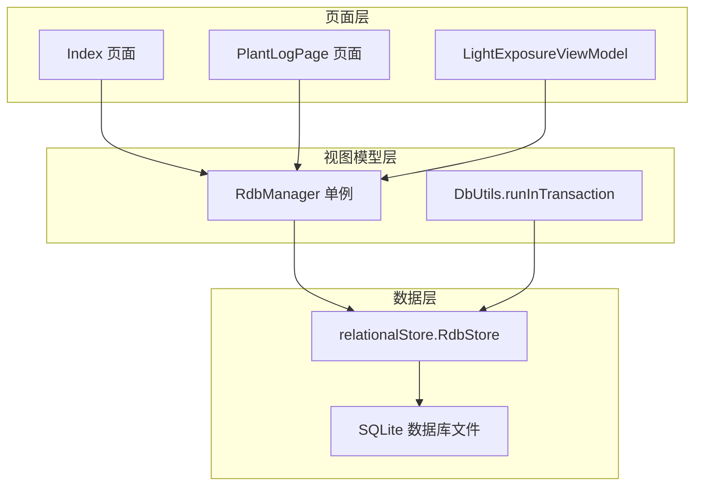
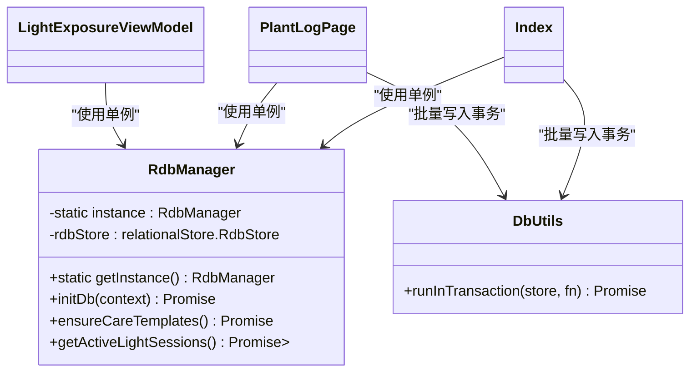
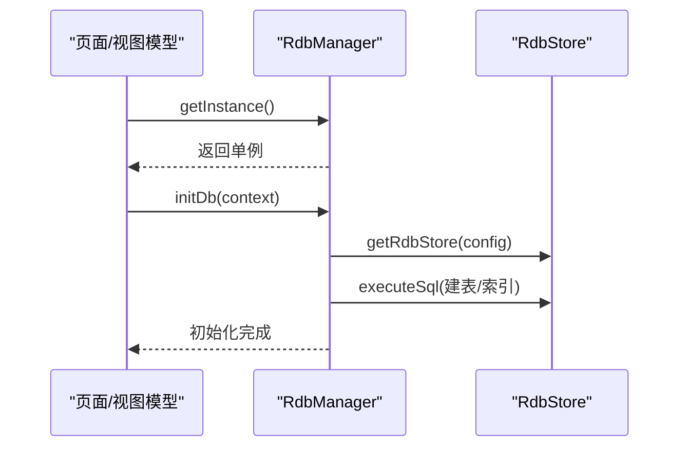
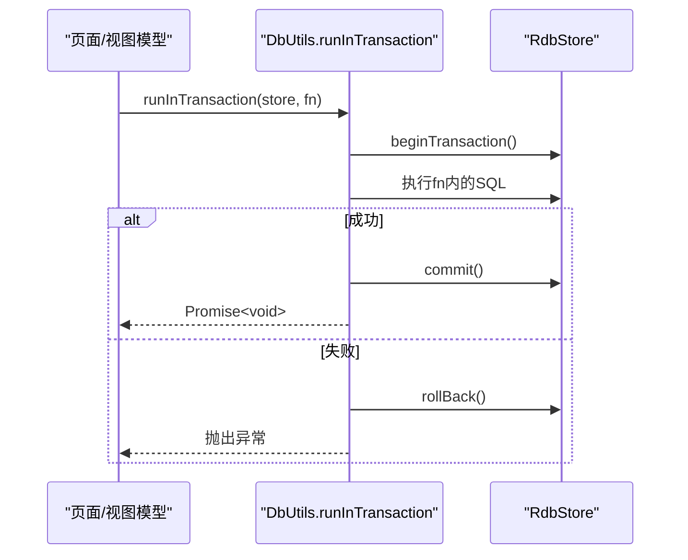
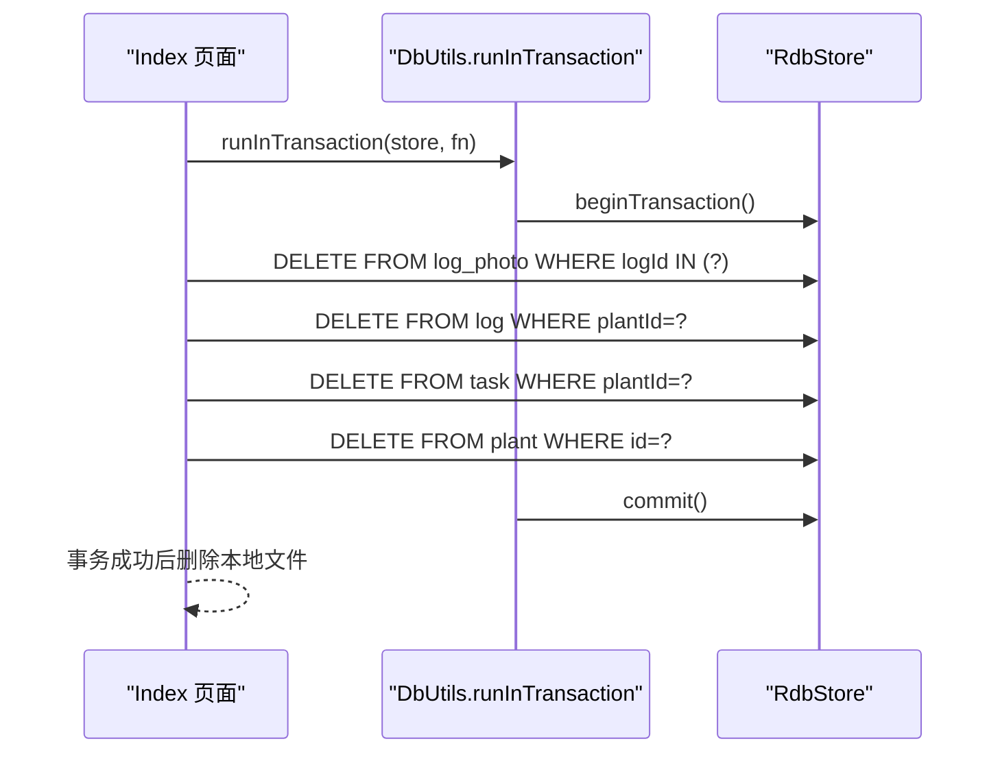
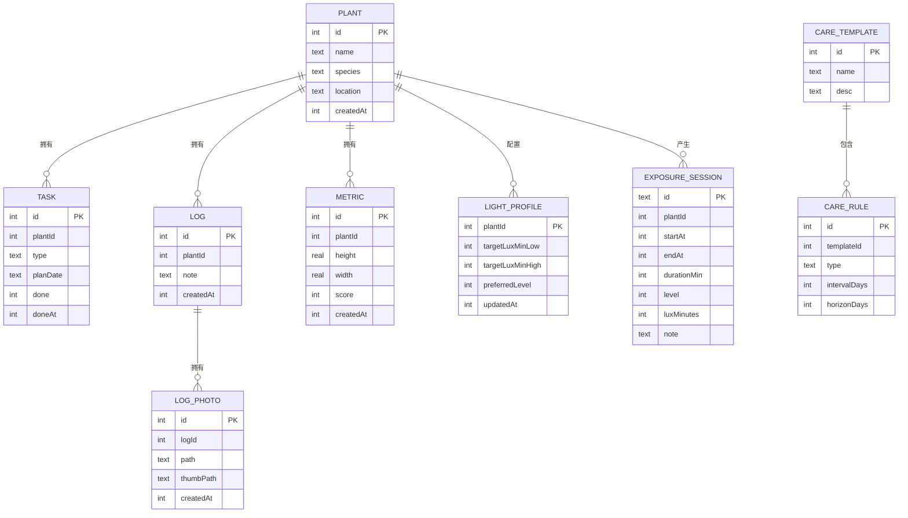
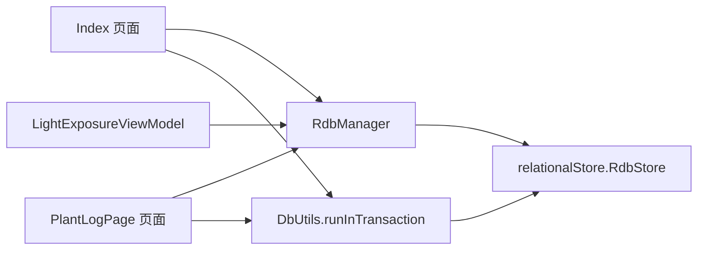

# 数据操作封装

<cite>
**本文引用的文件**
- [RdbManager.ets](file://entry/src/main/ets/viewmodel/RdbManager.ets)
- [DbUtils.ets](file://entry/src/main/ets/model/DbUtils.ets)
- [Index.ets](file://entry/src/main/ets/pages/Index.ets)
- [PlantLogPage.ets](file://entry/src/main/ets/pages/PlantLogPage.ets)
- [LightExposureViewModel.ets](file://entry/src/main/ets/viewmodel/LightExposureViewModel.ets)
- [PlantModel.ets](file://entry/src/main/ets/model/PlantModel.ets)
- [PlantLogModel.ets](file://entry/src/main/ets/model/PlantLogModel.ets)
</cite>

## 目录
1. [简介](#简介)
2. [项目结构](#项目结构)
3. [核心组件](#核心组件)
4. [架构总览](#架构总览)
5. [组件详解](#组件详解)
6. [依赖关系分析](#依赖关系分析)
7. [性能考量](#性能考量)
8. [故障排查指南](#故障排查指南)
9. [结论](#结论)
10. [附录：数据操作API与最佳实践](#附录数据操作api与最佳实践)

## 简介
本文件系统性梳理植物日记项目的数据操作封装，重点围绕 RdbManager 类的数据库封装、统一 CRUD 接口设计、事务管理机制、单例与线程安全、连接与资源管理、异常处理策略，以及 DbUtils 工具类的事务封装与使用。同时给出数据访问层的设计模式、批量操作优化、错误重试建议、数据一致性保障方案，并提供完整的数据操作 API 文档与使用示例，覆盖增删改查的典型场景。

## 项目结构
- 数据访问层位于 viewmodel 层，集中于 RdbManager，负责数据库初始化、建表与索引、默认数据注入、常用查询等。
- 工具层位于 model 层，DbUtils 提供统一事务封装 runInTransaction，确保批量写入的原子性。
- 页面层（如 Index、PlantLogPage、LightExposureViewModel）通过 RdbManager 的单例实例访问数据库，执行具体业务的 CRUD 操作。
- 模型层（PlantModel、PlantLogModel）定义与数据库表对应的轻量数据结构，用于页面与数据库之间的数据映射。

**图示来源**
- [RdbManager.ets:19-24](file://entry/src/main/ets/viewmodel/RdbManager.ets#L19-L24)
- [DbUtils.ets:12-21](file://entry/src/main/ets/model/DbUtils.ets#L12-L21)
- [Index.ets:357-382](file://entry/src/main/ets/pages/Index.ets#L357-L382)
- [PlantLogPage.ets:111-122](file://entry/src/main/ets/pages/PlantLogPage.ets#L111-L122)
- [LightExposureViewModel.ets:27](file://entry/src/main/ets/viewmodel/LightExposureViewModel.ets#L27)

**章节来源**
- [RdbManager.ets:27-170](file://entry/src/main/ets/viewmodel/RdbManager.ets#L27-L170)
- [DbUtils.ets:12-21](file://entry/src/main/ets/model/DbUtils.ets#L12-L21)

## 核心组件
- RdbManager：数据库单例管理器，负责数据库初始化、建表与索引、默认数据注入、常用查询等。
- DbUtils：提供统一事务封装 runInTransaction，确保批量写入的原子性。
- 页面与视图模型：通过 RdbManager 的单例访问数据库，执行 CRUD 操作；在需要时使用 DbUtils.runInTransaction 包裹批量写入。

**章节来源**
- [RdbManager.ets:4-24](file://entry/src/main/ets/viewmodel/RdbManager.ets#L4-L24)
- [DbUtils.ets:12-21](file://entry/src/main/ets/model/DbUtils.ets#L12-L21)

## 架构总览
RdbManager 采用单例模式，提供静态方法获取实例；页面与视图模型通过 getInstance 获取同一实例，确保全局一致性。DbUtils.runInTransaction 封装事务，避免重复样板代码。数据库初始化集中在 RdbManager.initDb 中，统一创建表与索引，保证查询效率与数据完整性。

**图示来源**
- [RdbManager.ets:19-24](file://entry/src/main/ets/viewmodel/RdbManager.ets#L19-L24)
- [DbUtils.ets:12-21](file://entry/src/main/ets/model/DbUtils.ets#L12-L21)
- [Index.ets:357-382](file://entry/src/main/ets/pages/Index.ets#L357-L382)
- [PlantLogPage.ets:111-122](file://entry/src/main/ets/pages/PlantLogPage.ets#L111-L122)
- [LightExposureViewModel.ets:27](file://entry/src/main/ets/viewmodel/LightExposureViewModel.ets#L27)

## 组件详解

### RdbManager 数据库管理器
- 单例模式：getInstance 提供全局唯一实例，避免重复打开数据库。
- 数据库初始化：initDb 创建数据库配置并执行建表与索引语句，确保各表具备高效查询所需的索引。
- 默认数据注入：ensureCareTemplates 在空库时插入预设的养护模板与规则，避免覆盖用户后续修改。
- 常用查询：getActiveLightSessions 查询进行中的光照会话，用于首页状态同步。
- 线程安全：ArkTS 运行时下，RdbManager 作为单例且 rdbStore 为实例字段，页面层通过同一实例访问，避免并发写入竞争；事务通过 runInTransaction 或 RdbStore 原生事务控制保证原子性。

**图示来源**
- [RdbManager.ets:19-34](file://entry/src/main/ets/viewmodel/RdbManager.ets#L19-L34)
- [RdbManager.ets:36-170](file://entry/src/main/ets/viewmodel/RdbManager.ets#L36-L170)

**章节来源**
- [RdbManager.ets:4-24](file://entry/src/main/ets/viewmodel/RdbManager.ets#L4-L24)
- [RdbManager.ets:27-170](file://entry/src/main/ets/viewmodel/RdbManager.ets#L27-L170)
- [RdbManager.ets:173-276](file://entry/src/main/ets/viewmodel/RdbManager.ets#L173-L276)
- [RdbManager.ets:278-294](file://entry/src/main/ets/viewmodel/RdbManager.ets#L278-L294)

### DbUtils 事务封装
- runInTransaction：自动开启事务、执行回调、提交或回滚，异常时回滚并抛出错误，确保批量写入的原子性。
- 使用场景：页面批量删除日志与照片、清理孤儿记录等需要多步写入的场景。

**图示来源**
- [DbUtils.ets:12-21](file://entry/src/main/ets/model/DbUtils.ets#L12-L21)
- [Index.ets:357-382](file://entry/src/main/ets/pages/Index.ets#L357-L382)
- [PlantLogPage.ets:111-122](file://entry/src/main/ets/pages/PlantLogPage.ets#L111-L122)

**章节来源**
- [DbUtils.ets:12-21](file://entry/src/main/ets/model/DbUtils.ets#L12-L21)
- [Index.ets:357-382](file://entry/src/main/ets/pages/Index.ets#L357-L382)
- [PlantLogPage.ets:111-122](file://entry/src/main/ets/pages/PlantLogPage.ets#L111-L122)

### 页面与视图模型中的数据操作
- 批量删除植物及其关联数据：Index 页面使用 runInTransaction 在事务内删除日志照片、日志、任务与植物记录，事务成功后再统一删除本地文件。
- 删除日志与照片：PlantLogPage 页面同样使用 runInTransaction，先删除子表再删除主表，事务成功后再删除本地文件。
- 光照会话管理：LightExposureViewModel 通过 RdbManager.rdbStore 执行查询、插入、更新等操作，维护光照配置与会话记录。

**图示来源**
- [Index.ets:357-382](file://entry/src/main/ets/pages/Index.ets#L357-L382)
- [DbUtils.ets:12-21](file://entry/src/main/ets/model/DbUtils.ets#L12-L21)

**章节来源**
- [Index.ets:357-402](file://entry/src/main/ets/pages/Index.ets#L357-L402)
- [PlantLogPage.ets:111-137](file://entry/src/main/ets/pages/PlantLogPage.ets#L111-L137)
- [LightExposureViewModel.ets:47-113](file://entry/src/main/ets/viewmodel/LightExposureViewModel.ets#L47-L113)

### 数据模型与表结构映射
- 植物、任务、日志、指标、日志照片、光照配置与会话等模型与数据库表一一对应，页面与数据库交互时通过 ValuesBucket 或查询结果映射到模型对象。

**图示来源**
- [RdbManager.ets:37-129](file://entry/src/main/ets/viewmodel/RdbManager.ets#L37-L129)
- [PlantModel.ets:7-125](file://entry/src/main/ets/model/PlantModel.ets#L7-L125)
- [PlantLogModel.ets:9-57](file://entry/src/main/ets/model/PlantLogModel.ets#L9-L57)

**章节来源**
- [PlantModel.ets:7-166](file://entry/src/main/ets/model/PlantModel.ets#L7-L166)
- [PlantLogModel.ets:9-57](file://entry/src/main/ets/model/PlantLogModel.ets#L9-L57)
- [RdbManager.ets:37-129](file://entry/src/main/ets/viewmodel/RdbManager.ets#L37-L129)

## 依赖关系分析
- RdbManager 依赖 ArkData relationalStore，负责数据库连接与 SQL 执行。
- 页面与视图模型依赖 RdbManager 单例，间接依赖 relationalStore。
- DbUtils 依赖 relationalStore，提供事务封装。
- 页面层在执行批量写入时优先使用 DbUtils.runInTransaction，减少重复事务样板代码。

**图示来源**
- [RdbManager.ets:19-34](file://entry/src/main/ets/viewmodel/RdbManager.ets#L19-L34)
- [DbUtils.ets:12-21](file://entry/src/main/ets/model/DbUtils.ets#L12-L21)
- [Index.ets:357-382](file://entry/src/main/ets/pages/Index.ets#L357-L382)
- [PlantLogPage.ets:111-122](file://entry/src/main/ets/pages/PlantLogPage.ets#L111-L122)

**章节来源**
- [RdbManager.ets:19-34](file://entry/src/main/ets/viewmodel/RdbManager.ets#L19-L34)
- [DbUtils.ets:12-21](file://entry/src/main/ets/model/DbUtils.ets#L12-L21)
- [Index.ets:357-382](file://entry/src/main/ets/pages/Index.ets#L357-L382)
- [PlantLogPage.ets:111-122](file://entry/src/main/ets/pages/PlantLogPage.ets#L111-L122)

## 性能考量
- 索引设计：RdbManager 在任务、日志、指标等高频查询表上建立组合索引，避免全表扫描，提升查询性能。
- 批量写入：使用 DbUtils.runInTransaction 将多步写入放入同一事务，减少事务开销与锁竞争。
- 资源释放：查询结果集使用 goToNextRow 循环遍历后及时 close，避免资源泄漏。
- 唯一索引：任务表使用唯一索引避免重复任务，支持“尝试插入、冲突即跳过”的幂等策略。

**章节来源**
- [RdbManager.ets:133-169](file://entry/src/main/ets/viewmodel/RdbManager.ets#L133-L169)
- [DbUtils.ets:12-21](file://entry/src/main/ets/model/DbUtils.ets#L12-L21)
- [Index.ets:357-382](file://entry/src/main/ets/pages/Index.ets#L357-L382)

## 故障排查指南
- 事务异常：runInTransaction 在捕获异常时会回滚事务并抛出错误，检查回调内部的 SQL 与参数绑定。
- 查询异常降级：getActiveLightSessions 在查询失败时返回空 Map，不影响主流程。
- 孤儿记录清理：Index 页面提供孤儿照片清理逻辑，先在事务内删除数据库记录，再尝试删除文件，失败的文件记录在界面上提示数量。
- 文件删除失败：Index 页面在事务提交后再统一删除本地文件，失败的文件会被收集并在界面上提示。

**章节来源**
- [DbUtils.ets:12-21](file://entry/src/main/ets/model/DbUtils.ets#L12-L21)
- [RdbManager.ets:278-294](file://entry/src/main/ets/viewmodel/RdbManager.ets#L278-L294)
- [Index.ets:441-546](file://entry/src/main/ets/pages/Index.ets#L441-L546)

## 结论
RdbManager 通过单例模式与统一初始化，提供了清晰、可维护的数据访问入口；DbUtils.runInTransaction 将事务封装标准化，显著降低了批量写入的复杂度与出错率。配合合理的索引设计与资源释放策略，整体数据层具备良好的性能与可靠性。页面与视图模型遵循统一的 CRUD 调用规范，既保证了数据一致性，又提升了开发效率。

## 附录：数据操作API与最佳实践

### RdbManager API
- 单例获取
  - 方法：getInstance()
  - 用途：获取全局唯一的 RdbManager 实例
  - 返回：RdbManager
  - 示例路径：[RdbManager.ets:19-24](file://entry/src/main/ets/viewmodel/RdbManager.ets#L19-L24)
- 数据库初始化
  - 方法：initDb(context)
  - 用途：创建数据库配置、建表与索引
  - 参数：context（应用上下文）
  - 返回：Promise<void>
  - 示例路径：[RdbManager.ets:27-170](file://entry/src/main/ets/viewmodel/RdbManager.ets#L27-L170)
- 默认数据注入
  - 方法：ensureCareTemplates()
  - 用途：空库时插入默认养护模板与规则
  - 返回：Promise<void>
  - 示例路径：[RdbManager.ets:173-276](file://entry/src/main/ets/viewmodel/RdbManager.ets#L173-L276)
- 常用查询
  - 方法：getActiveLightSessions()
  - 用途：查询进行中的光照会话，用于首页状态同步
  - 返回：Promise<Map<number, boolean>>
  - 示例路径：[RdbManager.ets:278-294](file://entry/src/main/ets/viewmodel/RdbManager.ets#L278-L294)

**章节来源**
- [RdbManager.ets:19-24](file://entry/src/main/ets/viewmodel/RdbManager.ets#L19-L24)
- [RdbManager.ets:27-170](file://entry/src/main/ets/viewmodel/RdbManager.ets#L27-L170)
- [RdbManager.ets:173-276](file://entry/src/main/ets/viewmodel/RdbManager.ets#L173-L276)
- [RdbManager.ets:278-294](file://entry/src/main/ets/viewmodel/RdbManager.ets#L278-L294)

### DbUtils API
- 事务封装
  - 方法：runInTransaction(store, fn)
  - 用途：确保批量写入要么全部成功、要么全部回滚
  - 参数：store（RdbStore）、fn（异步回调）
  - 返回：Promise<void>
  - 示例路径：[DbUtils.ets:12-21](file://entry/src/main/ets/model/DbUtils.ets#L12-L21)
  - 使用示例路径：
    - [Index.ets:357-382](file://entry/src/main/ets/pages/Index.ets#L357-L382)
    - [PlantLogPage.ets:111-122](file://entry/src/main/ets/pages/PlantLogPage.ets#L111-L122)

**章节来源**
- [DbUtils.ets:12-21](file://entry/src/main/ets/model/DbUtils.ets#L12-L21)
- [Index.ets:357-382](file://entry/src/main/ets/pages/Index.ets#L357-L382)
- [PlantLogPage.ets:111-122](file://entry/src/main/ets/pages/PlantLogPage.ets#L111-L122)

### 页面与视图模型中的典型CRUD场景
- 新增任务
  - 步骤：构造 ValuesBucket，调用 store.insert(T_TASK, values)
  - 示例路径：[Index.ets:405-425](file://entry/src/main/ets/pages/Index.ets#L405-L425)
- 切换任务完成状态
  - 步骤：构造 ValuesBucket，使用 RdbPredicates 设置条件，调用 store.update(values, predicates)
  - 示例路径：[Index.ets:427-437](file://entry/src/main/ets/pages/Index.ets#L427-L437)
- 删除日志与照片（事务）
  - 步骤：runInTransaction 包裹，先删除子表（LOG_PHOTO），再删除主表（LOG）
  - 示例路径：[PlantLogPage.ets:111-122](file://entry/src/main/ets/pages/PlantLogPage.ets#L111-L122)
- 批量删除植物及其关联数据（事务）
  - 步骤：runInTransaction 包裹，按顺序删除 LOG_PHOTO、LOG、TASK、PLANT
  - 示例路径：[Index.ets:357-382](file://entry/src/main/ets/pages/Index.ets#L357-L382)
- 光照会话管理
  - 查询：querySql 获取 LIGHT_PROFILE 与 EXPOSURE_SESSION
  - 插入：insert(EXPOSURE_SESSION, values)
  - 更新：update(EXPOSURE_SESSION, values, predicates)
  - 示例路径：
    - [LightExposureViewModel.ets:47-113](file://entry/src/main/ets/viewmodel/LightExposureViewModel.ets#L47-L113)
    - [LightExposureViewModel.ets:138-181](file://entry/src/main/ets/viewmodel/LightExposureViewModel.ets#L138-L181)

**章节来源**
- [Index.ets:405-437](file://entry/src/main/ets/pages/Index.ets#L405-L437)
- [PlantLogPage.ets:111-122](file://entry/src/main/ets/pages/PlantLogPage.ets#L111-L122)
- [LightExposureViewModel.ets:47-113](file://entry/src/main/ets/viewmodel/LightExposureViewModel.ets#L47-L113)
- [LightExposureViewModel.ets:138-181](file://entry/src/main/ets/viewmodel/LightExposureViewModel.ets#L138-L181)

### 最佳实践
- 批量操作优化
  - 使用 runInTransaction 将多步写入合并为单一事务，减少锁竞争与提交次数。
  - 使用占位符与批量删除（IN 子句）降低 SQL 语句数量。
- 错误重试机制
  - 对于非幂等写入，建议在上层封装重试逻辑（如指数退避），并在事务外层捕获异常后回滚。
- 数据一致性保证
  - 通过唯一索引避免重复任务；通过事务保证多表删除的一致性。
  - 查询失败时采用降级策略（如返回空集合），保证 UI 不崩溃。
- 资源释放与异常处理
  - 查询结果集遍历完成后及时关闭；对文件操作失败进行收集与提示，不影响数据库一致性。

**章节来源**
- [DbUtils.ets:12-21](file://entry/src/main/ets/model/DbUtils.ets#L12-L21)
- [Index.ets:357-382](file://entry/src/main/ets/pages/Index.ets#L357-L382)
- [Index.ets:441-546](file://entry/src/main/ets/pages/Index.ets#L441-L546)
- [RdbManager.ets:133-169](file://entry/src/main/ets/viewmodel/RdbManager.ets#L133-L169)